# 出海风浪那么大，怎么可以没有这个护身符？ Cloudflare从0到1实战：DNS、SSL、邮箱、缓存、反爬全指南

如果你准备网站出海，或者正在做工具网站，你一定要认真看看本文。如果说有没有一个工具，能解决我们网站出海过程中的绝大多数问题，而且还是免费，那我一定推荐Cloudflare这个“活菩萨”，从DNS到SSL，从邮箱到缓存，从反爬到安全等等，他都能一条龙全部包下。

网上关于Cloudflare的文章很多，哥飞社群中也经常看到群友的相关分享，但是系统把Cloudflare讲清楚的很少，因为Cloudflare作为我们的出海“护身符”，可以帮我们做的事情实在太多了，如果做一个系列的文章，写上10篇也不为过。

今天，我们就从我们新手的角度，先讲讲上线一个出海网站时需要在Cloudflare中做哪些基本的配置，后续有机会我再另外写文章展开讲Cloudflare的各种高级功能。废话不多说，直接上一个我平时上线网站时配置Cloudflare的必要步骤，你后续上线网站时也可以把它当做网站上线SOP的一部分。

Step 1：添加网站并切换DNS

打开Cloudflare登录后，进入你的Account首页。

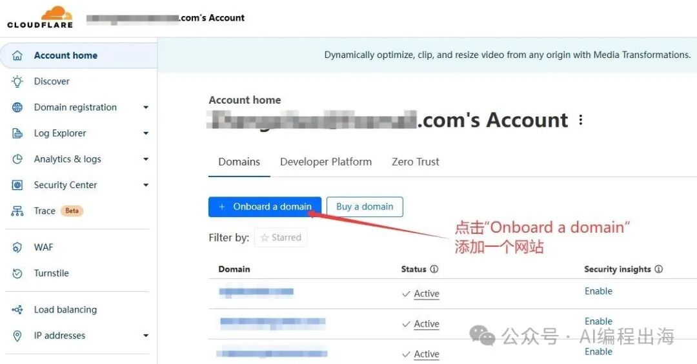

点击“Onboard a domain”添加你的网站。

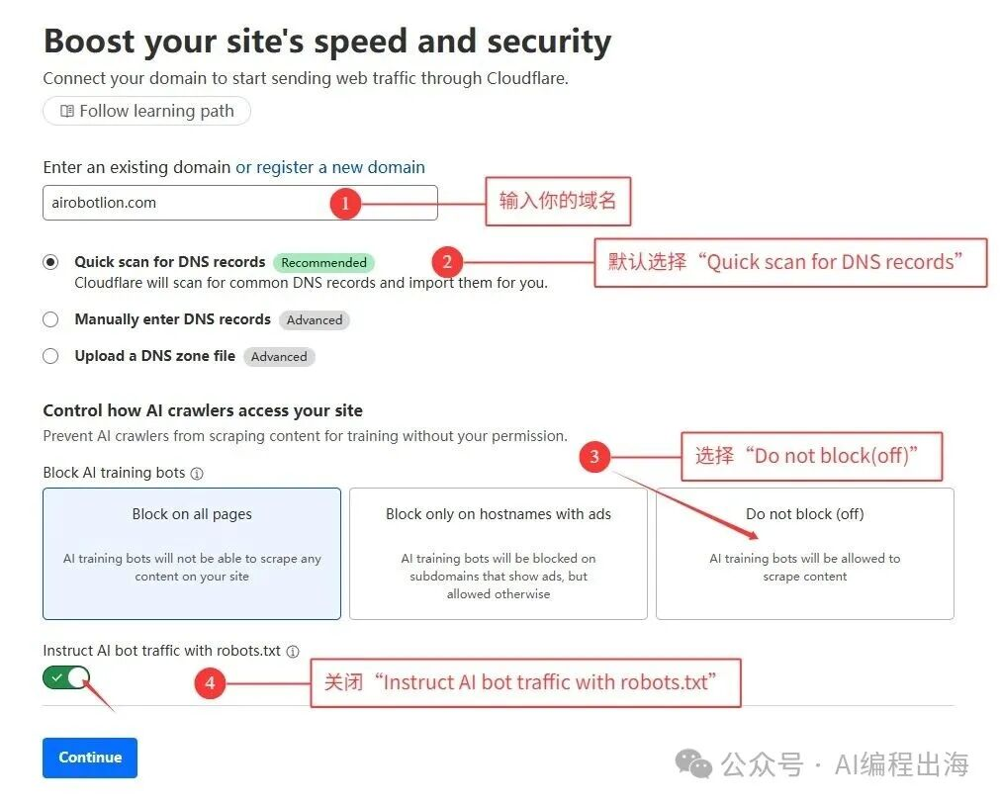

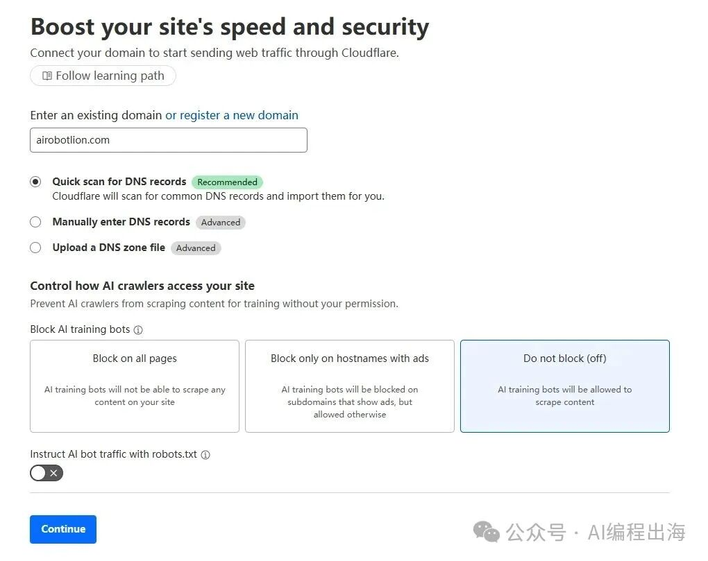

输入你的网站域名，默认选择“Quick scan for DNS records”（除非你有明确的自定义需求时才使用“Manually enter DNS records”或“Upload a DNS zone file”）；

由于我希望AI模型抓取/索引我的网站内容，因此，“Block AI training bots”选择了“Do not block (off)”，并且把“Instruct AI bot traffic with robots.txt”设置为关闭。这一块你可以根据你自己的实际情况决定。

> 小提醒：即使你开放，有些 AI 公司仍可能无视 robots.txt；相反，如果你选择屏蔽，Cloudflare 还有更“硬”的网关侧拦截（不仅仅靠 robots.txt 文件的规则），这些后续可以在 Security → Bots / AI Crawl Control 里随时做修改。

小提醒：即使你开放，有些 AI 公司仍可能无视 robots.txt；相反，如果你选择屏蔽，Cloudflare 还有更“硬”的网关侧拦截（不仅仅靠 robots.txt 文件的规则），这些后续可以在 Security → Bots / AI Crawl Control 里随时做修改。

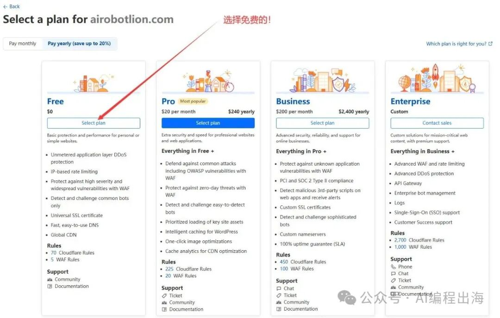

选择免费套餐。一般情况下，免费套餐已经足够使用，给我们的网站提供了必要的“护身符”：不限量 L7 DDoS 防护、基于 IP 的限流、WAF 保护高危/广泛漏洞、检测并挑战常见机器人、通用免费 SSL 证书、快速、易用的权威 DNS和全球 CDN 加速。这也是Cloudflare被业界称为出海网站“活菩萨”的原因。

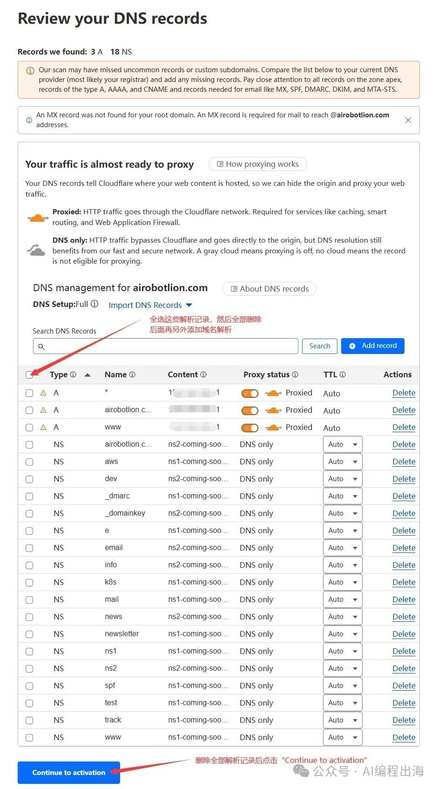

选择免费套餐后，进入“Review your DNS records”页面，可以看到我们的域名原来的解析记录。由于我们要新上一个网站，因此删除所有这些解析记录（如果存在你的其它网站和项目需要用到的解析记录的话，请保留那部分记录）。

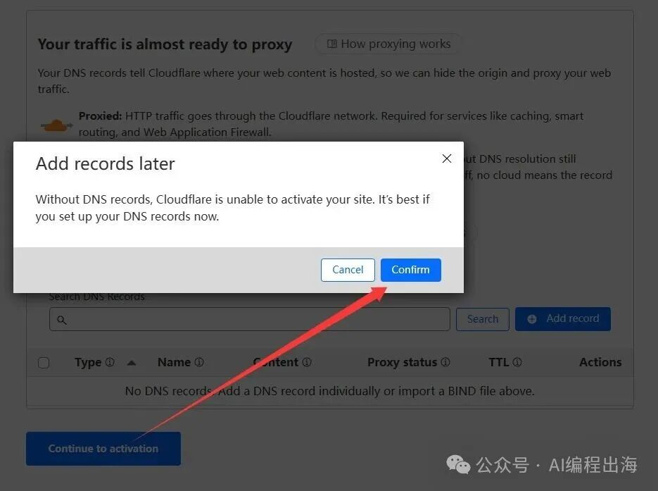

点击“Continue to activation”，提示现在没有解析记录，可以后续再添加，点击“Confirm”即可。

Step 2：切换Name Servers

接下来，我们来到了更新Name Servers的页面：

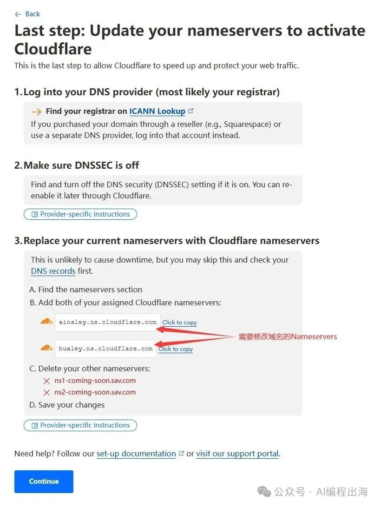

Cloudflare给我们提供了两个Nameservers，我们需要回到我们注册域名的域名商网站中把Nameservers改换成Cloudflare提供的Nameservers。

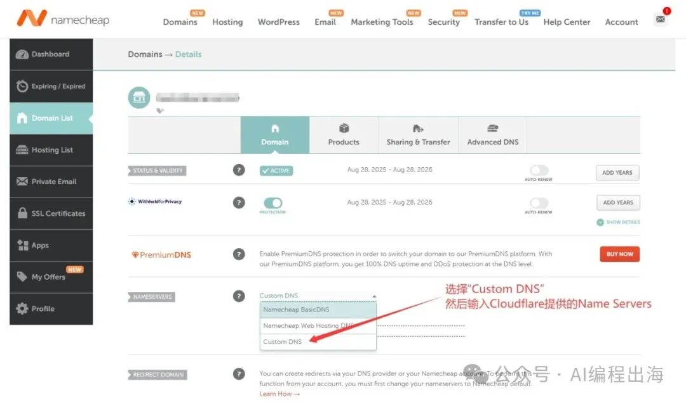

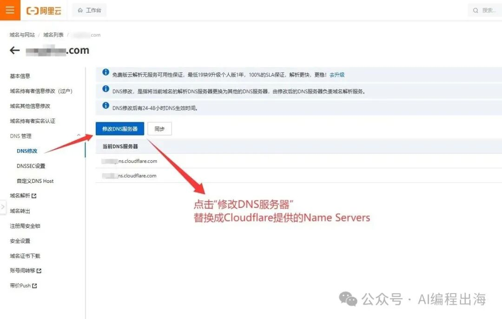

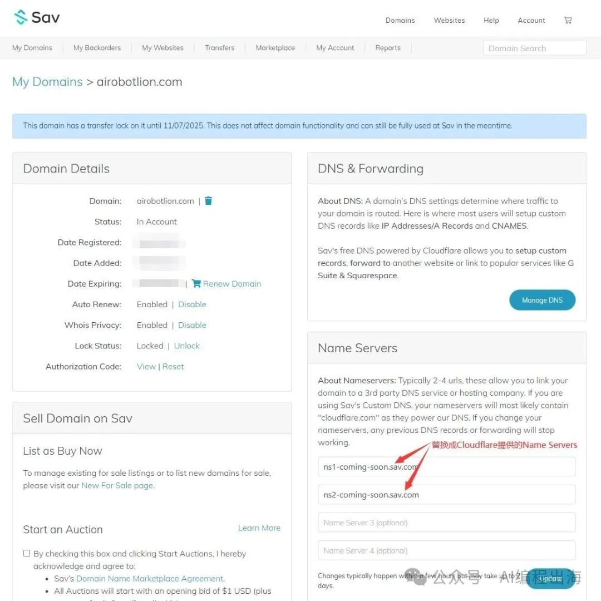

我们以Namecheap、阿里云和Sav.com为例：

Namecheap：进入对应域名的管理页面，在“Nameservers”处选择“Custom DNS”，输入Cloudflare提供的两个Nameservers，记得勾选右侧的“✔”按钮保存；阿里云：进入对应域名的管理页面，点击左侧菜单“DNS 管理”中的“DNS修改”，点击“修改DNS服务器”，输入Cloudflare提供的两个Nameservers，保存即可；Sav.com：进入对应域名的管理页面，在“Name Servers”板块中，把前面两行Sav提供的默认Nameservers修改成Cloudflare提供的两个Nameservers，然后点击“Update”保存。

Namecheap：进入对应域名的管理页面，在“Nameservers”处选择“Custom DNS”，输入Cloudflare提供的两个Nameservers，记得勾选右侧的“✔”按钮保存；

阿里云：进入对应域名的管理页面，点击左侧菜单“DNS 管理”中的“DNS修改”，点击“修改DNS服务器”，输入Cloudflare提供的两个Nameservers，保存即可；

Sav.com：进入对应域名的管理页面，在“Name Servers”板块中，把前面两行Sav提供的默认Nameservers修改成Cloudflare提供的两个Nameservers，然后点击“Update”保存。

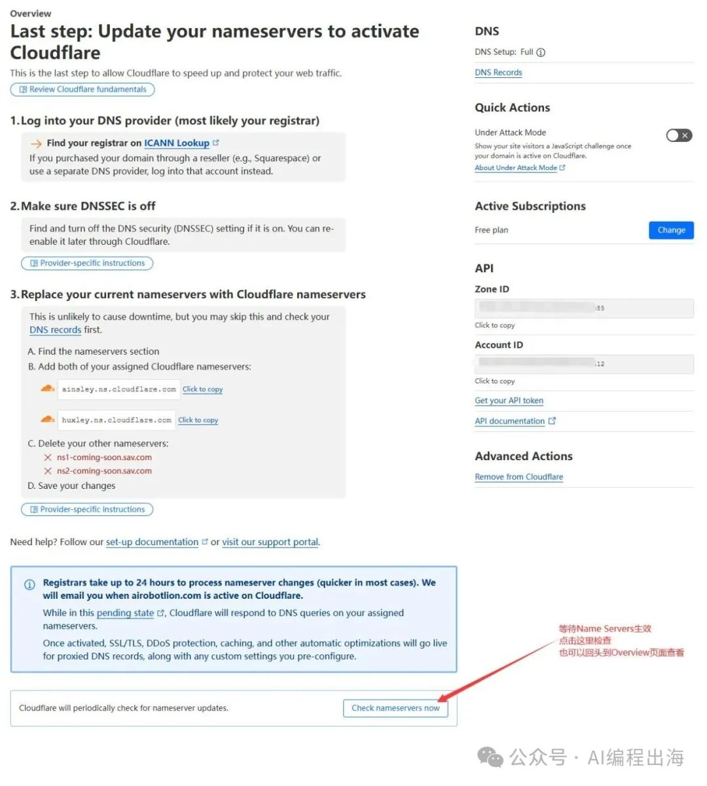

回到Cloudflare页面，等待Cloudflare的Nameservers生效。

> 域名修改了DNS后，不一定马上生效，有时几分钟内，但有时时间会更长。这也是为什么我们在前面这篇文章中提到注册好域名之后不是先开发网站，而是先在Cloudfare中添加网站并切换的DNS服务器的原因。

域名修改了DNS后，不一定马上生效，有时几分钟内，但有时时间会更长。这也是为什么我们在前面这篇文章中提到注册好域名之后不是先开发网站，而是先在Cloudfare中添加网站并切换的DNS服务器的原因。

出海工具站高手是怎样快速上线一个网站的？

Step 3：解析域名：考虑 Vercel 已提供 SSL

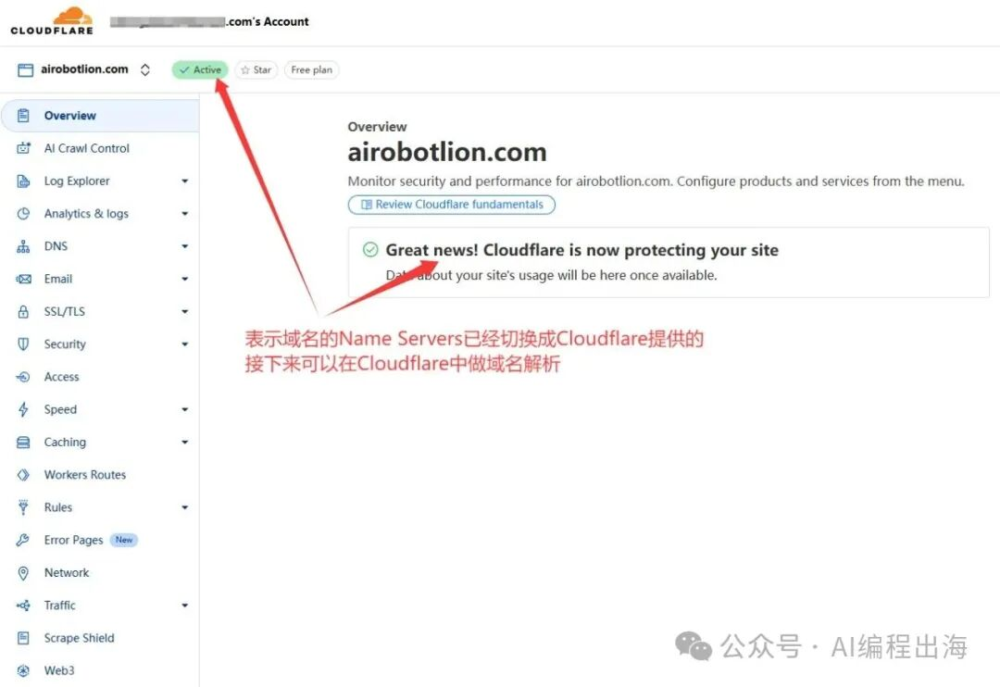

Cloudflare的Nameservers生效后，可以看到绿色的“Active”状态，这意味着我们可以开始在Cloudflare中做域名解析了。

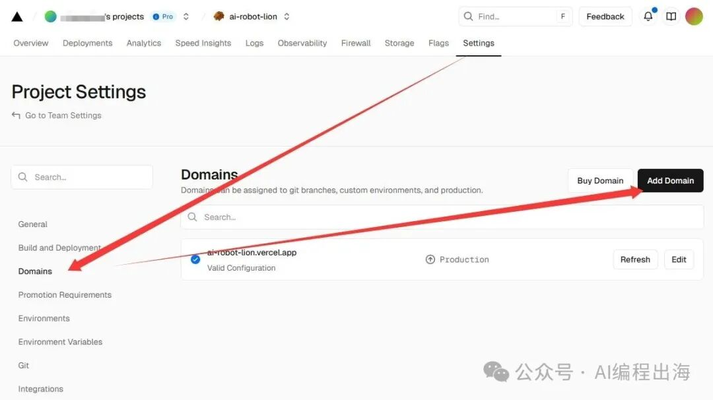

我们回到Vercel的网站控制台，点击“Settings”中的“Domains”进入域名设置页面。

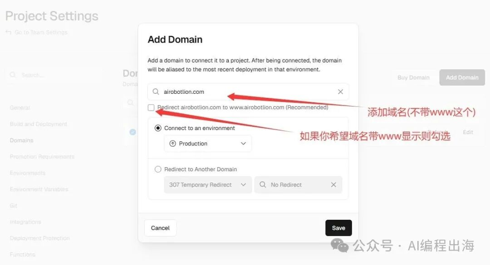

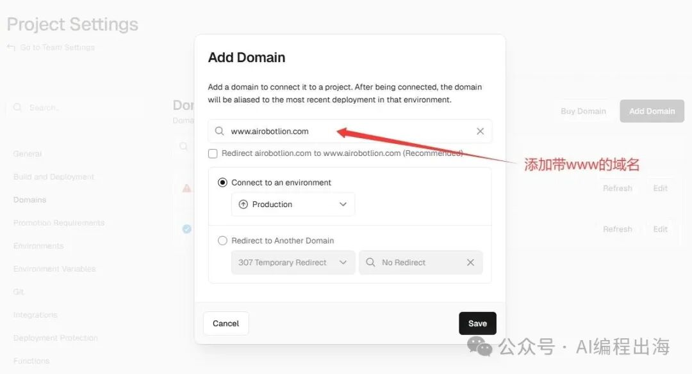

添加我们的域名，一般添加根域名和带“www”的二级域名，以我们这个网站为例，需要添加“airobotlion.com”和“www.airobotlion.com”这两个域名。由于我习惯使用不带“www”的域名，因此没有选择把根域名跳转到“www”的域名上。

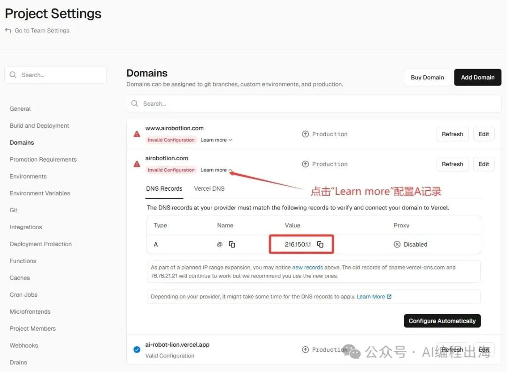

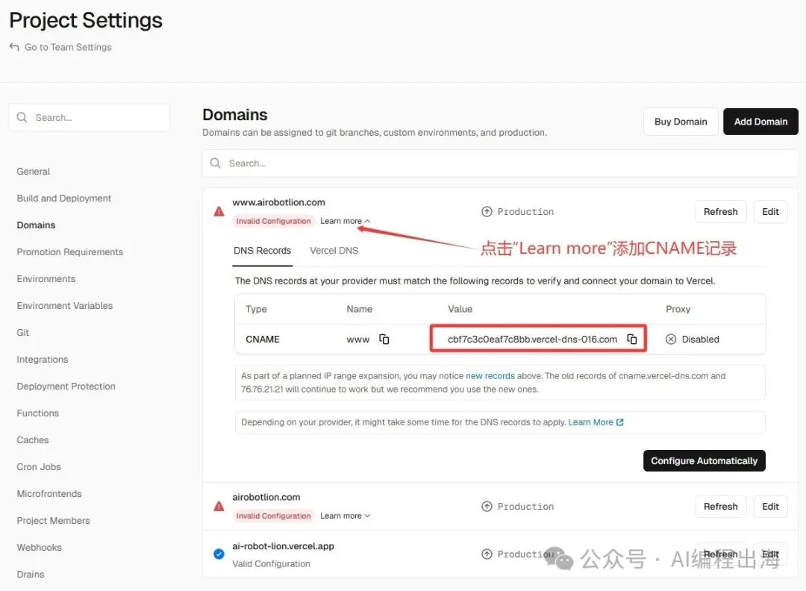

接下来，分别点击这两个域名的“Learn more”链接，可以看到Vercel已经告诉我们怎样解析这两个域名：不带www的根域名通过A记录解析到指定的IP地址，带www的二级域名通过CNAME解析到指定的域名。

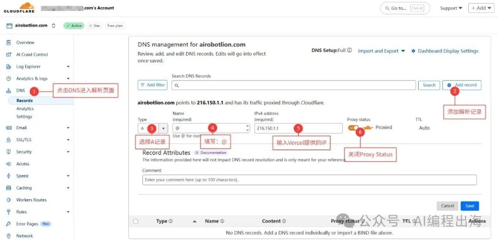

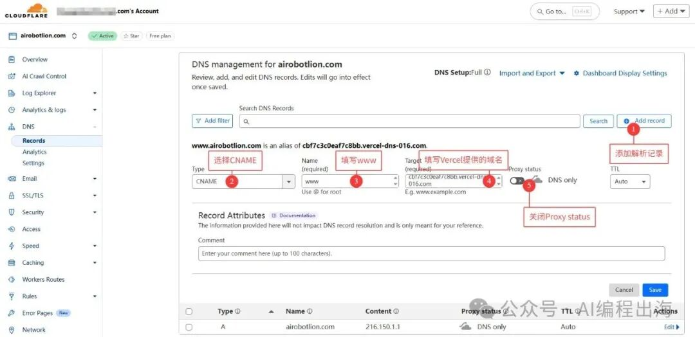

回到Cloudflare，点击“DNS”的“Records”添加域名解析记录，分别添加一条A记录和一条CNAME记录并分别保存。

> 这里特别注意，添加解析记录的时候，Cloudflare默认会开启“Proxy status”，也就是你看到的橙色云朵。由于Vercel建议采用DNS only（也就是灰色云朵），把SSL交由Vercel处理，需要Cloudflare加速/防护的子域再开代理并使用Cloudflare提供的WAF/Rate Limiting/Bot Fight/缓存等能力。因此，我们这里添加解析记录的时候选择不开启“Proxy status”，避免叠加反向代理带来额外延迟并造成缓存管理冲突等问题。

这里特别注意，添加解析记录的时候，Cloudflare默认会开启“Proxy status”，也就是你看到的橙色云朵。由于Vercel建议采用DNS only（也就是灰色云朵），把SSL交由Vercel处理，需要Cloudflare加速/防护的子域再开代理并使用Cloudflare提供的WAF/Rate Limiting/Bot Fight/缓存等能力。因此，我们这里添加解析记录的时候选择不开启“Proxy status”，避免叠加反向代理带来额外延迟并造成缓存管理冲突等问题。

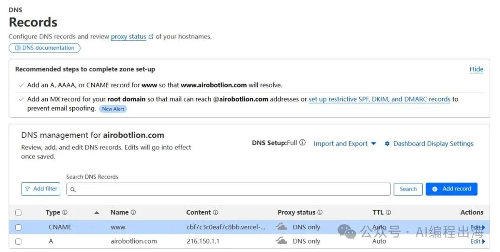

添加完成后，可以看到一条A记录和一条CNAME记录，都显示灰色云朵。

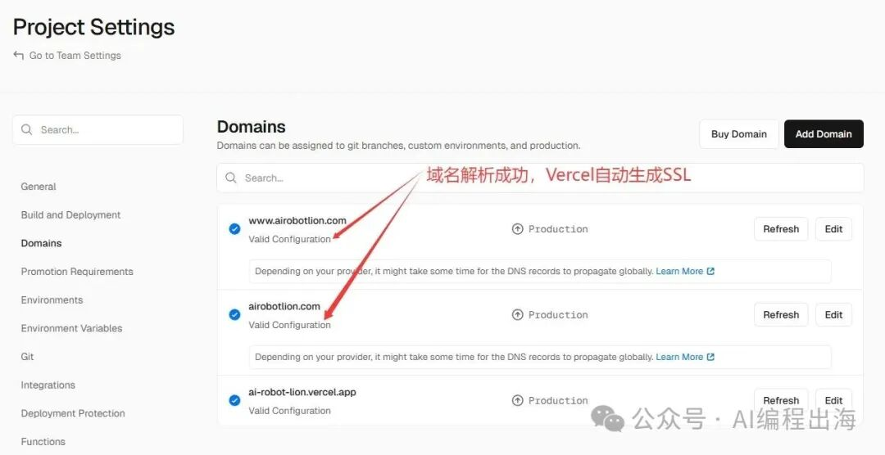

回到Vercel网站控制台的域名管理页面，点击“Refresh”刷新，可以看到域名已经生效，并且显示Vercel自动给域名添加了SSL。

到了这一步，域名管理页面显示的这3个域名都可以打开我们的网站了。但是，一般情况下，我们只保留其中一个对外的域名，其它的需要重定向到对外的域名上，这样可以避免搜索引擎发现多个不同域名同时指向我们的网站首页。

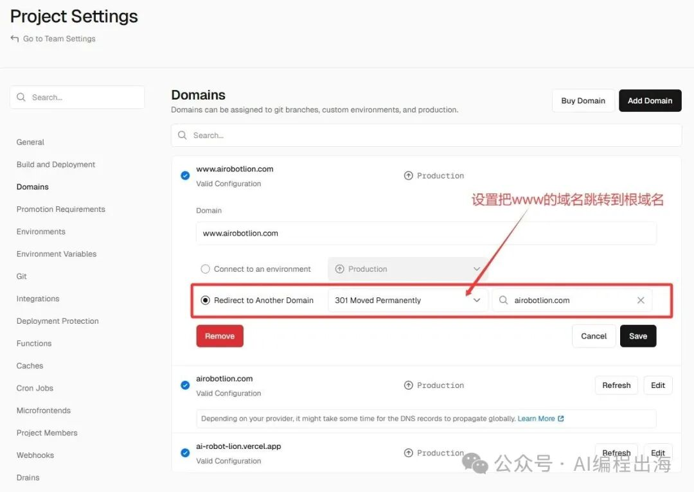

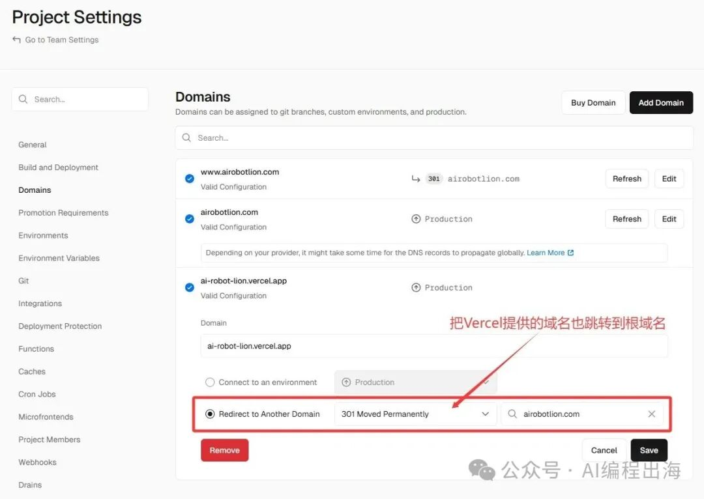

比如，我想把“www.airobotlion.com”和“ai-robot-lion.vercel.app”这两个域名重定向到“airobotlion.com”这个域名上，对外只使用“airobotlion.com”这个域名，那么可以通过编辑域名，然后选择301重定向，把域名重定向到“airobotlion.com”这个域名上。

反之，如果你想使用“www.airobotlion.com”这个域名，则把“airobotlion.com”和“ai-robot-lion.vercel.app”这两个域名重定向到“www.airobotlion.com”这个域名上。

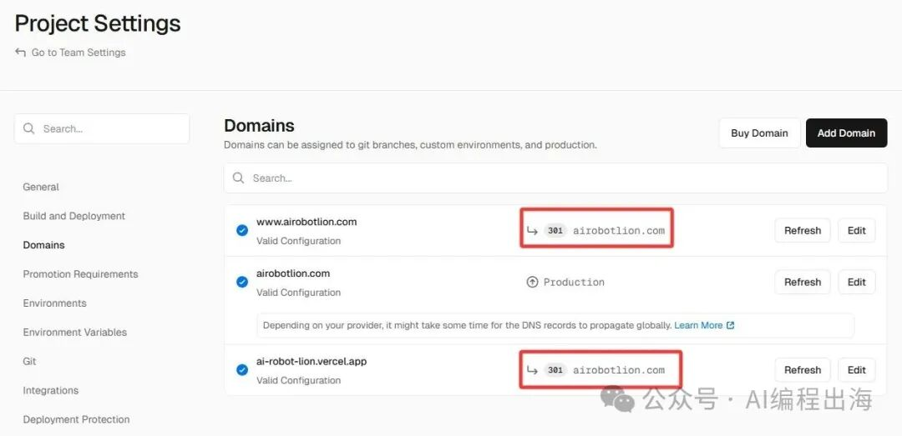

现在我们已经完成了域名解析，可以通过“airobotlion.com”这个域名打开网站了，而且打开的时候，你会发现域名前面带有“https”，这就是Vercel给我们域名添加的SSL。

你还可以尝试通过“www.airobotlion.com”和“ai-robot-lion.vercel.app”这两个域名打开我们的网站，会发现他们都会自动跳转到“airobotlion.com”这个域名上。

Step 4：设置SSL

前面我们在Cloudflare中添加网站的时候选择了“Quick scan for DNS records”方式进行添加，因此，添加完成后，Cloudflare会自动帮我们做好基本的设置，包括SSL。

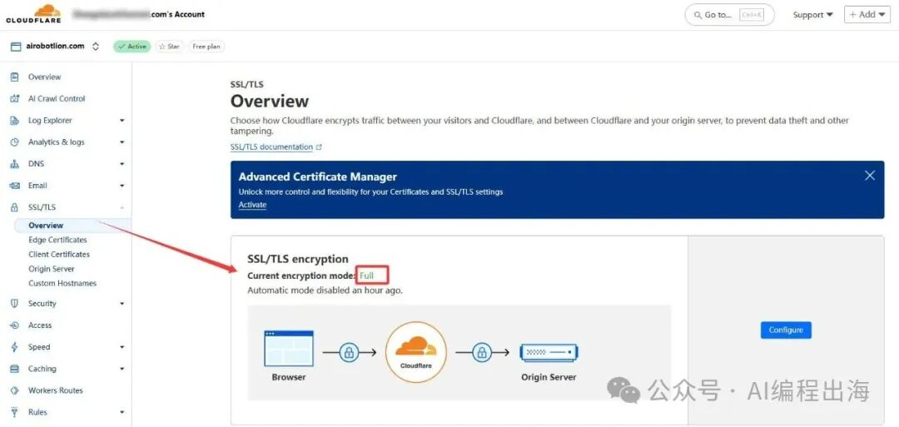

由于Vercel官方不建议在它前面再叠一层反向代理，因此，我们做域名解析的时候选择不开启“Proxy status”，也就是灰色云朵。所以，灰云（DNS only）的情况下Cloudflare 只做权威解析：HTTP/HTTPS 请求不会经过 Cloudflare，Cloudflare 的 CDN 缓存、WAF、Rate Limiting、Bot 管控、重定向与规则引擎等边缘功能均不生效。

因此，本文我们暂不展开讲述Cloudflare的SSL，后面我有写文章讲阿里云部署WordPress网站的时候再做详细介绍。

Step 5：添加免费邮箱（Email Routing）

工具站出海的第一个坑：域名注册需要注意什么？

前面的文章中提到：在你购买域名的时候，有些域名商会赠送你域名邮箱，有些会建议你额外购买域名邮箱。但是，这些都没有必要，直接使用Cloudflare的邮件功能就可以了，Cloudflare Email Routing 可以帮你通过Gmail等邮箱转发接收邮件，但不含发信；若要发信需配合Gmail SMTP / Amazon SES / SendGrid 等（后面我再单独写文章讲讲这一部分）。

现在，我们讲讲怎样添加Cloudflare Email Routing。

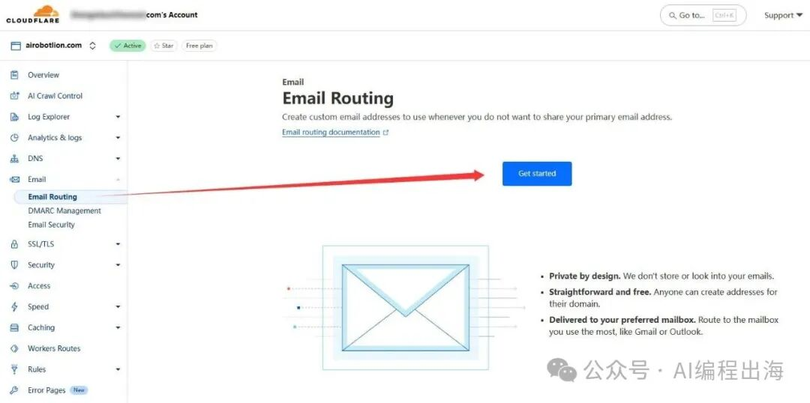

点击左侧菜单“Email”中的“Email Routing”，点击“Get started”。

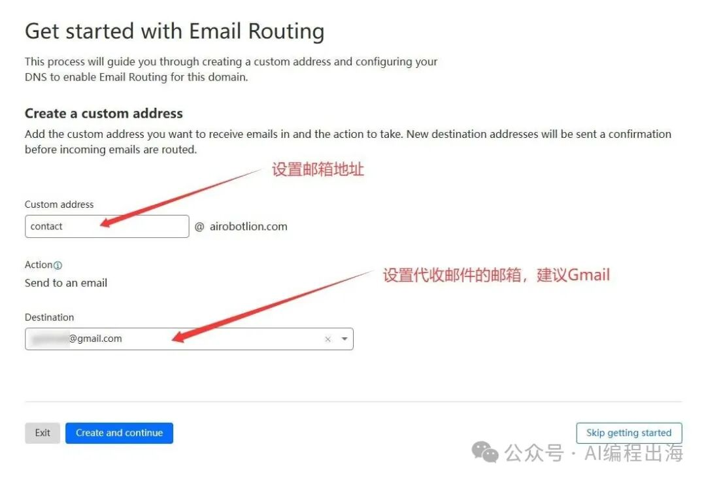

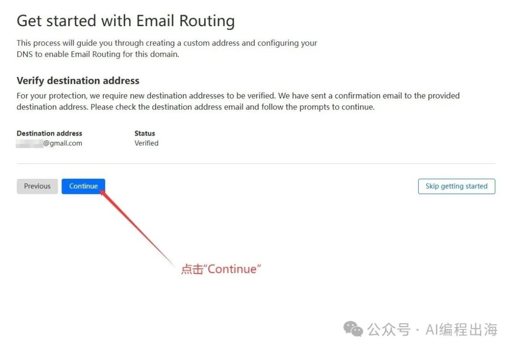

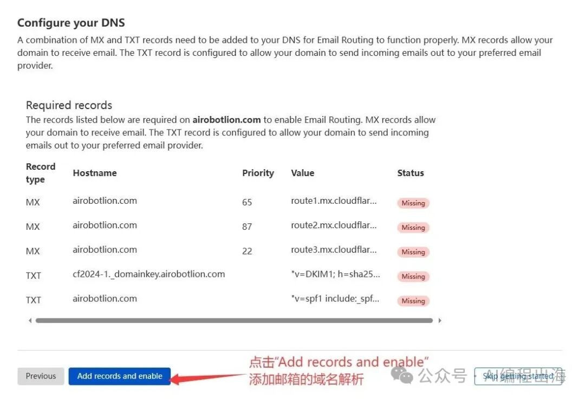

输入你的第一个邮箱地址，你可以使用“contact”、“support”等常用邮箱地址，设置目标邮箱（接收邮件的邮箱，建议使用Gmail），然后点击“Create and continue”；接着确认你的目标收件邮箱后点击“Continue”；接着配置邮箱的域名解析记录，直接点击“Add records and enable”添加解析记录。

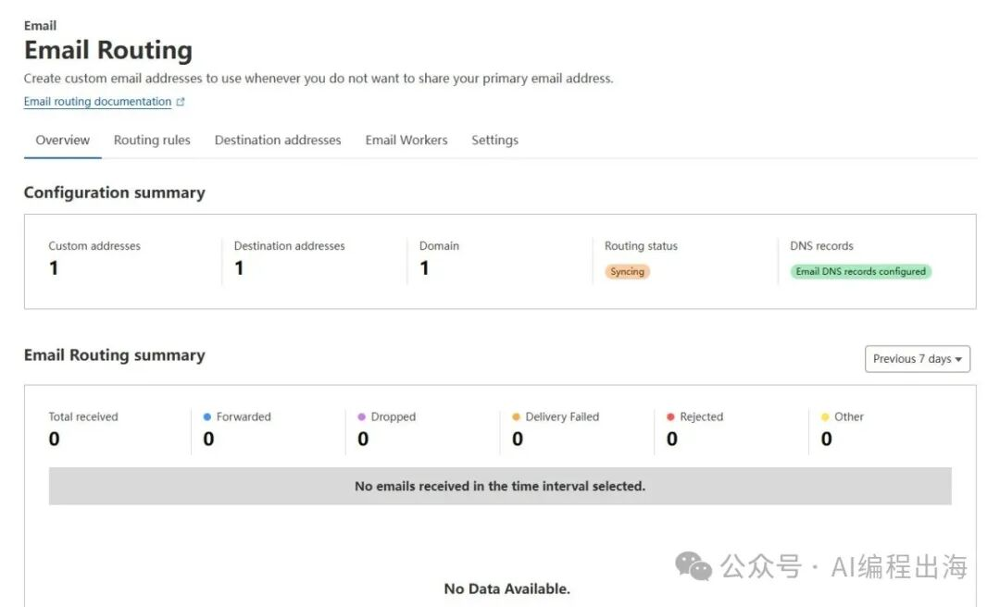

就这样，“Email Routing”就配置好了。

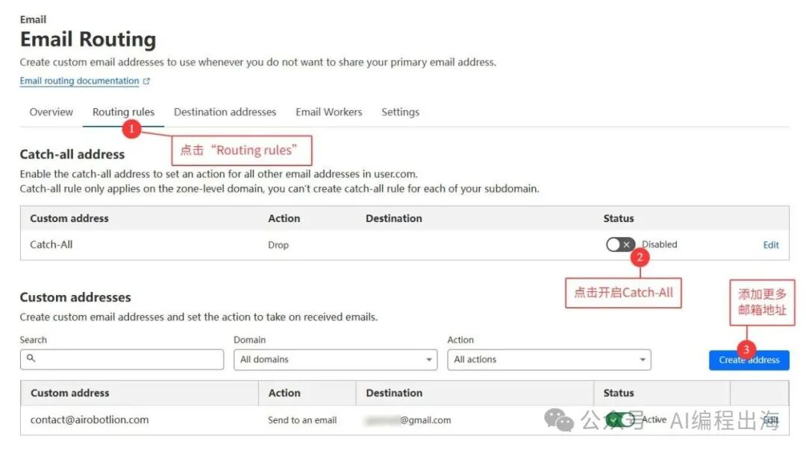

接着，不要忘记开启“Catch-All”。点开“Routing rules”页面，点击开启“Catch-All”。

这是一个兜底规则，开启后，凡是发到你域名下、但没有单独规则匹配的地址（甚至常见拼写错误/别名），都会按你指定的目标地址统一转发；它相当于“安全网/默认路由”。

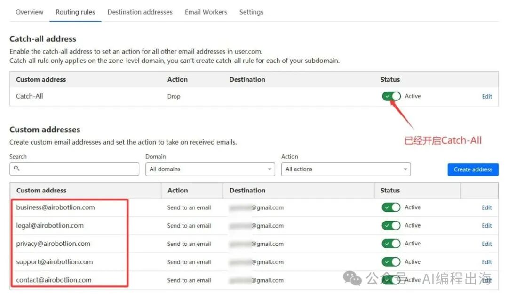

如果你需要添加更多收件邮箱地址，比如“business”、“legal”、“privacy”等，可以通过“Create address”直接添加。

Step 6：开启缓存 & Crawler Hints

在Cloudflare中添加网站后，如果域名解析使用橙色云（Proxied），那么Cloudflare的普通CDN缓存会直接生效。

但是由于我们使用灰色云（DNS only），意味着请求不经过Cloudflare边缘，不会使用Cloudflare的缓存/WAF 等。因此本文暂不展开讲述Cloudflare缓存相关的内容，后面我有写文章讲阿里云部署WordPress网站的时候再做详细介绍。

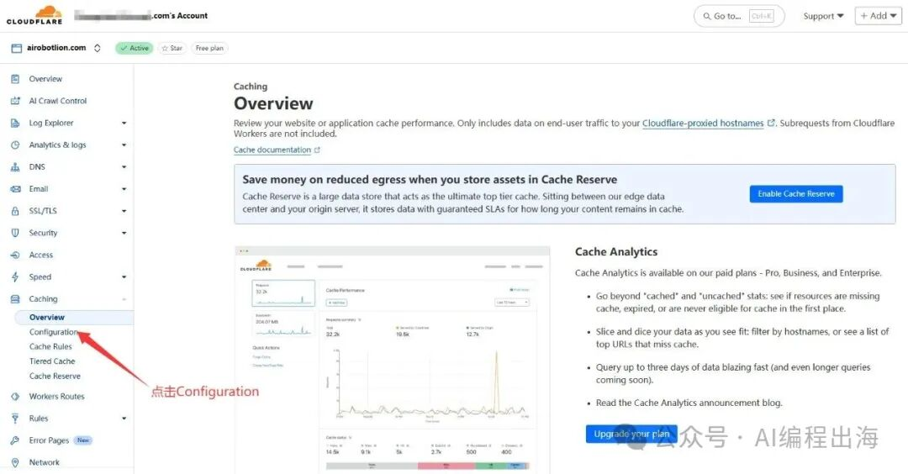

不过，我们仍然需要在缓存的“Configuration”中开启一个重要功能：Crawler Hints。

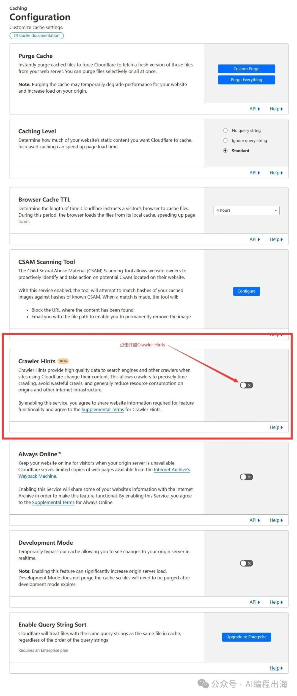

找到“Crawler Hints”点击开启即可。 开启后，它会把“应该何时抓取”的信号发给搜索引擎，帮助搜索引擎更快发现更新、减少无效抓取。

但是当域名解析是是灰云时，Cloudflare在边缘可见的信号较少，效果不如橙云时充分，但开启不会影响Vercel缓存，因此建议开启。

Step 7：基础防护：防刷、防爬、防洞

前面提到，灰云（DNS only）的情况下Cloudflare 只做权威解析：HTTP/HTTPS 请求不会经过 Cloudflare，Cloudflare 的 CDN 缓存、WAF、Rate Limiting、Bot 管控、重定向与规则引擎等边缘功能均不生效。因此，这部分内容也暂不展开讲述，后面我有写文章讲阿里云部署WordPress网站的时候再做详细介绍。

这篇文章写得比较长，看似有很多步骤，但上站熟悉后，每次我都只需要几分钟就可以完成上面所有步骤。

除了上面提到的这些功能，Cloudflare还有很多高级的功能值得我们使用和关注，尤其在你没有使用Vercel这些平台、自建服务器的时候，你更加要使用Cloudflare给你免费提供的这些功能，后续我也会另外写文章做更多Cloudflare的讲解。出海风浪那么大，你怎么可以没有Cloudflare这个“护身符”？
