# 上线出海网站，不要总想着从0到1

上一篇文章：

工具站都长同一张脸？我怎样用1个Prompt生成2.0落地页？

提到使用ChatGPT的“Deep Research”生成工具站首页的文案，接下来，我们正式进入制作和上线一个网站的环节。

这个时候，你可能会想，现在AI编程那么牛了，我直接让Claude、Cursor或者v0帮我从无到有生成一个不就得了。

你真这么想，那就太天真了！如果你是一名编程高手，那么你有N种办法上线一个网站，包括从0到1；但是如果你和我一样只是一名新手，那你最好别想着从0到1开发一个网站。你首先要做的是找到一个契合你的需求的框架或模板，而且最好是开源的。

这样的好处是，你可以站在高手的肩膀上，节省大量开发时间，从而把你的开发精力集中到你的需求实现上。比如NextJS框架你可以直接选择使用刘小排老师在深海圈提供的raphael-starterkit-v1，或者艾逗笔的ShipAny，或者让ChatGPT给你推荐Github上其它开源框架，再比如PHP你可以考虑WordPress框架。这些框架一般都已经集成好用户系统、注册登录、支付系统、积分系统等等。而你想把这些功能从0到1开发出来，实际上并不那么容易，即使现在AI编程很强，更大的可能是漏洞百出、暗藏隐患。

今天，我们以刘小排老师在深海圈提供的raphael-starterkit-v1为例，讲讲怎样把我们通过ChatGPT的“Deep Research”生成的工具站首页文案，放进这个NextJS网站中。

第1步：准备好的你的“脚手架”

下载或克隆刘小排老师Github上的开源项目：

> https://github.com/Idea-To-Business/raphael-starterkit-v1

https://github.com/Idea-To-Business/raphael-starterkit-v1

把代码放到你的电脑某一个目录中，比如“D:\我的文档\NextJS\ai-robot-lion”，然后在你熟悉的某个编辑器打开，比如Cursor。如果你熟悉其它工具或命令行，也可以选择其它方式。

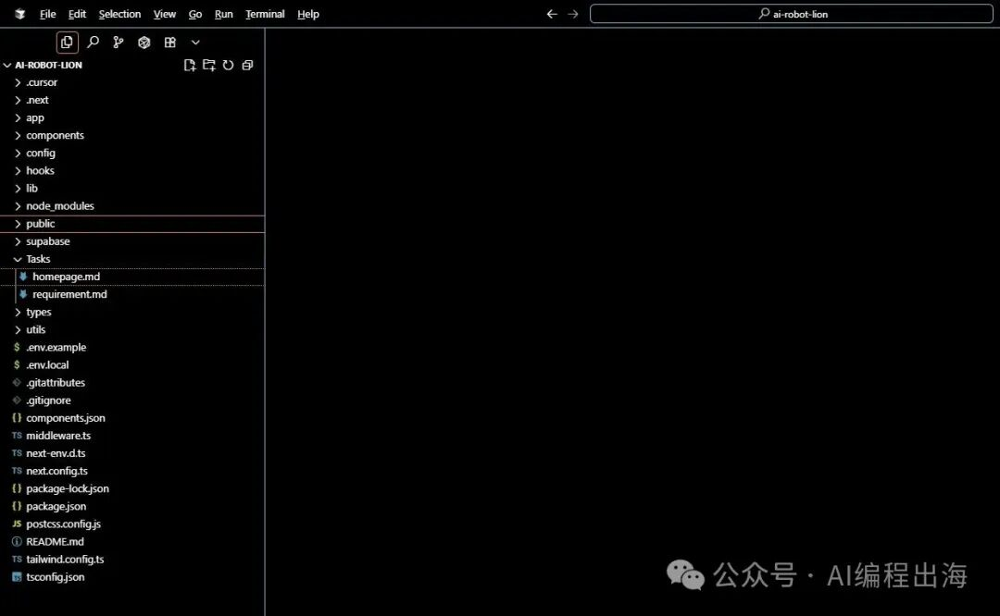

> 这里：我们假设你已经安装好NextJS、Git、Claude Code等基本的开发工具。如果你还没安装好，可以问问AI，网上也有一些相关的内容，或者，后续我再找时间写一两篇文章。

这里：我们假设你已经安装好NextJS、Git、Claude Code等基本的开发工具。如果你还没安装好，可以问问AI，网上也有一些相关的内容，或者，后续我再找时间写一两篇文章。

在Cursor的菜单栏“Terminal”打开Terminal窗口“New Terminal”，默认显示在Cursor的下方，我喜欢右键点击这个窗口的顶部，在“Panel Position”选择“Right”把Terminal窗口放在Cursor的右侧，这样有点像使用Cursor的Chat窗口的感觉，而且看代码也方便点。另外，我会把Chat窗口关闭掉，因为我没有续费Cursor，没想办法使用Chat功能，但是Cursor还有其它功能可以使用，尤其是我们接下来要使用Terminal窗口和Git功能。

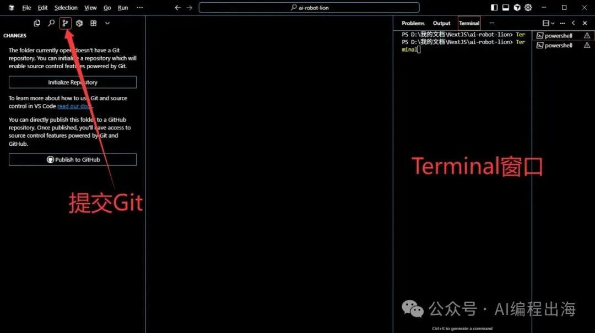

我们在Terminal窗口中先启动Claude Code，然后让Claude Code分析一下这个项目：

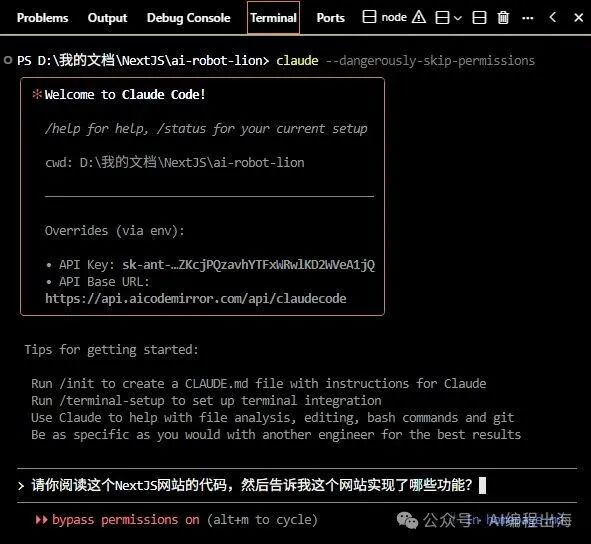

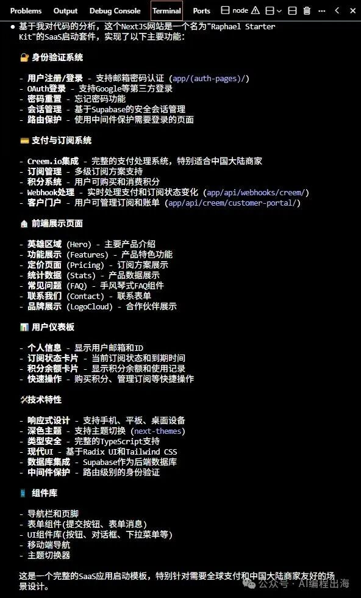

可以看出小排老师的这个开源框架已经涵盖我们需要的订阅类型网站的基本功能。

然后，让Claude Code编译并启动这个网站：

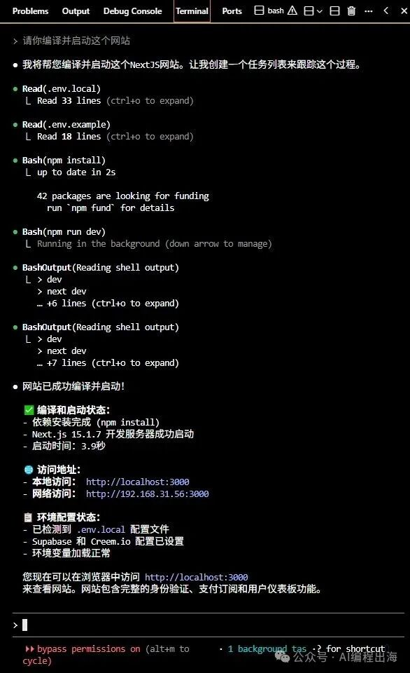

网站编译后启动成功：

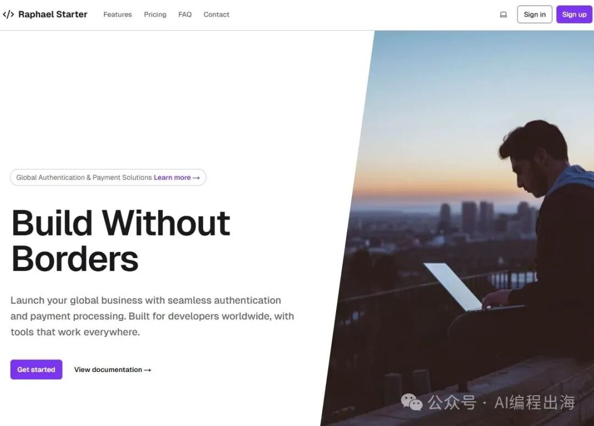

第2步：把首页文案整理成Markdown文件

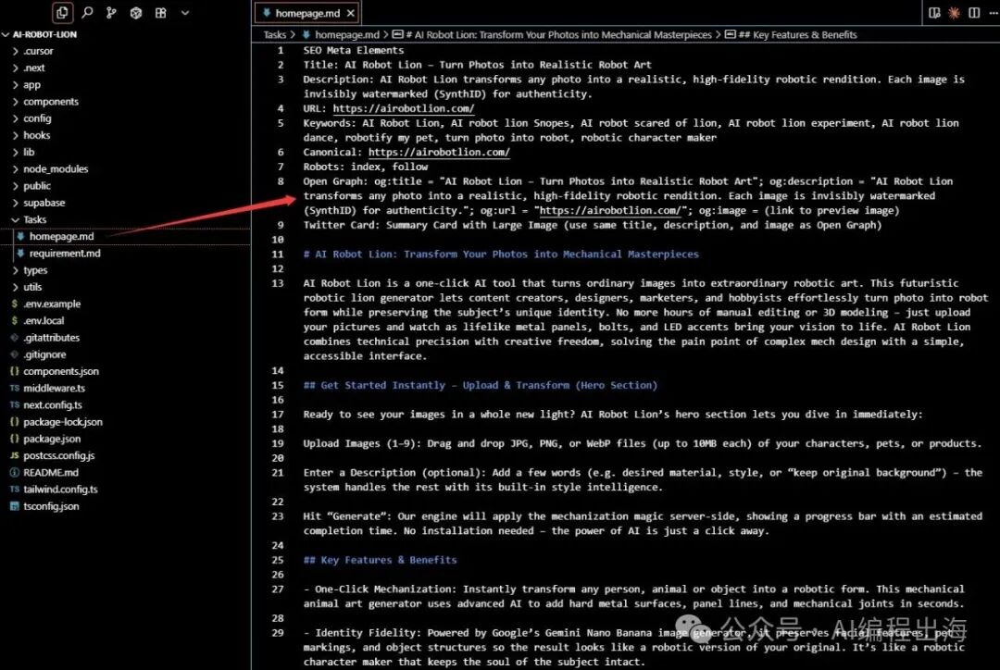

把“Deep Research”生成的首页文案修改成Markdown文件的时候，你可以让AI帮你修改，但我一般手动修改，工作量并不大，注意要把H1、H2、H3和列表等内容严格修改成Markdown对应的格式：

> H1标题的前面加上“# ”，并且有且只有一个；H2标题的前面加上“## ”；H3标题的前面加上“### ”；列表的前面加上“- ”；等等，大家可以查一下Markdown文件的相关知识，重点标记好H1、H2、H3这些标题即可。

H1标题的前面加上“# ”，并且有且只有一个；

H2标题的前面加上“## ”；

H3标题的前面加上“### ”；

列表的前面加上“- ”；

等等，大家可以查一下Markdown文件的相关知识，重点标记好H1、H2、H3这些标题即可。

另外，我还喜欢在文件的顶部加上这个网站首页的SEO相关要素，比如“Title”、“Description”等，这样有助于接下来AI修改网页内容的时候把这些非常重要的SEO相关要素一并添加到页面中，这一点非常重要！

准备好Markdown文件后，我把它命名为“homepage.md”，放在项目的 “/Tasks/”目录中（你也可以使用其它名字，放在其它目录）。

第3步：通过AI编程工具修改网站首页

接下来，我们开始让Claude Code在原有代码基础上，按照Markdown文件中的内容修改网站首页，与此同时，我们让它同时修改一下网站的风格：

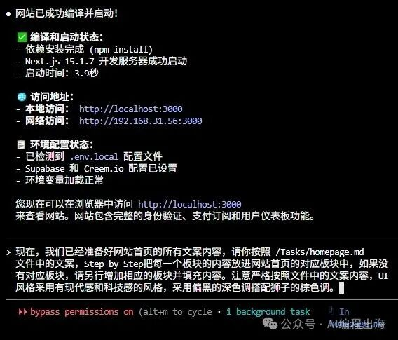

由于首页文案内容比较多，过了好一会儿，Claude Code修改好了代码：

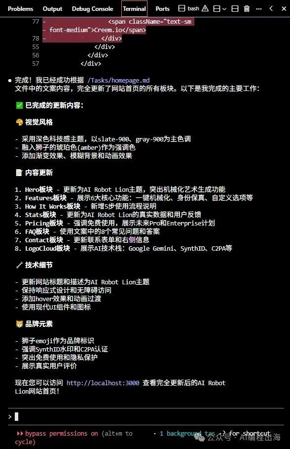

但是很遗憾，这次Claude Code一出马就出现问题，网站打开出现报错：

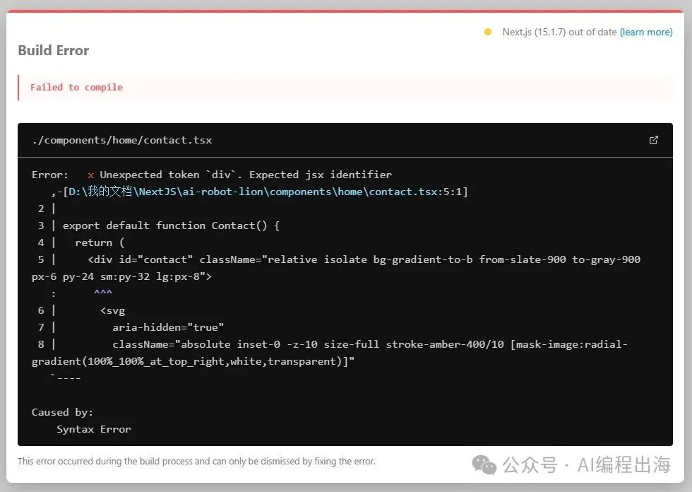

但在AI编程过程中，这是非常正常的现象，把报错信息反馈给Claude Code做修改即可：

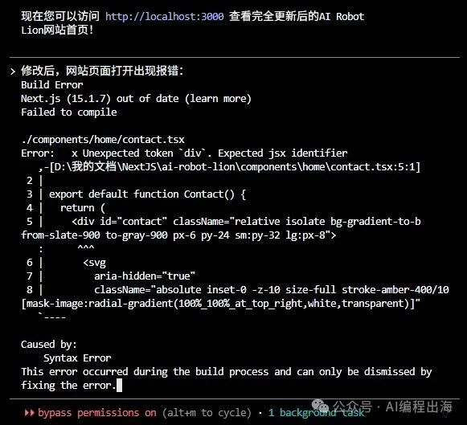

> 有些朋友在使用AI编程的过程中，有时会遇到AI把代码越改越乱的情况，对于这个问题，后面我再另外写写文章讲讲怎样应对这些问题。

有些朋友在使用AI编程的过程中，有时会遇到AI把代码越改越乱的情况，对于这个问题，后面我再另外写写文章讲讲怎样应对这些问题。

Claude Code修改之后，网站可以正常打开。

第4步：检查首页内容并做完善

接下来，检查一下他修改后的首页内容是否与Markdown文件中的内容相符，不符的地方提示它修改完善：

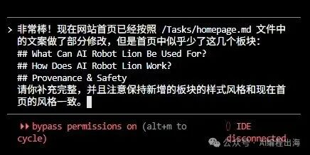

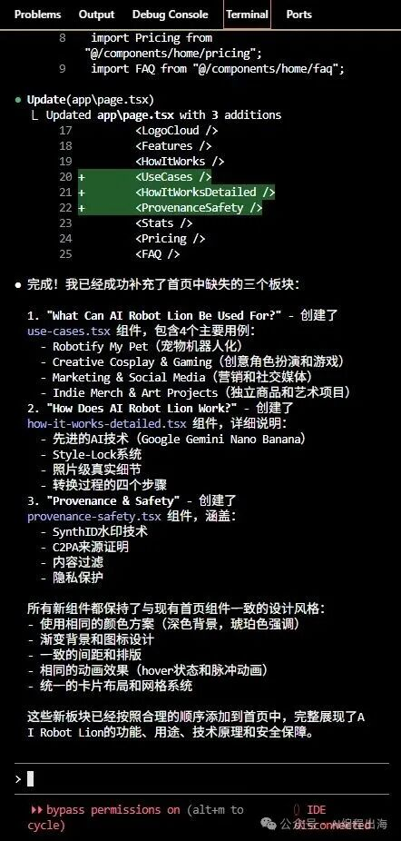

Claude Code按照我们的要求做了完善：

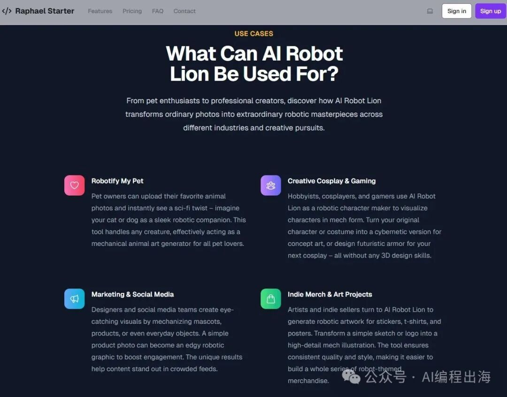

为了让网站首页内容和Markdown文件的文案尽可能一致，我们让Claude Code重新对每一个板块的内容做检查：

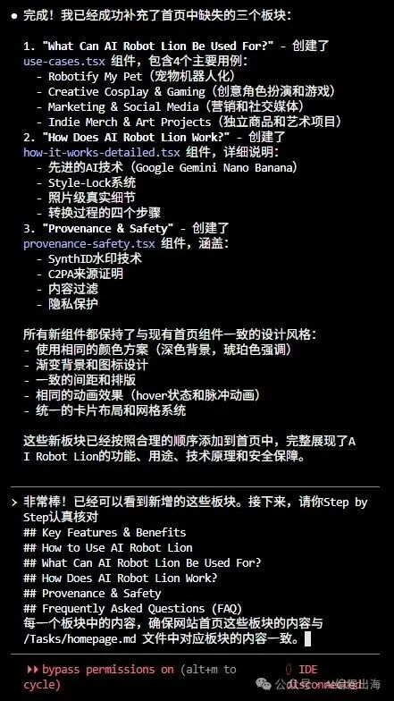

接下来，你还可以根据你的想法让Claude Code对网站页面做进一步的优化，比如让它把FAQ板块改成“手风琴”样式：

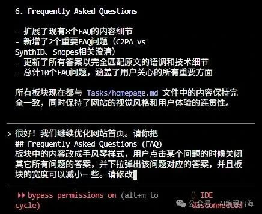

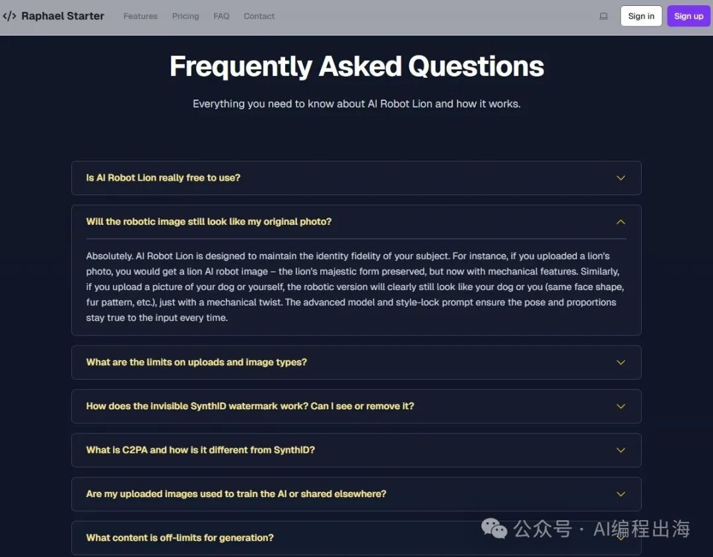

网站首页中有时仍然会存在之前模板的一些板块内容，但对于我们的这个网站不那么必要，可以让Claude Code移除或通过注释隐藏：

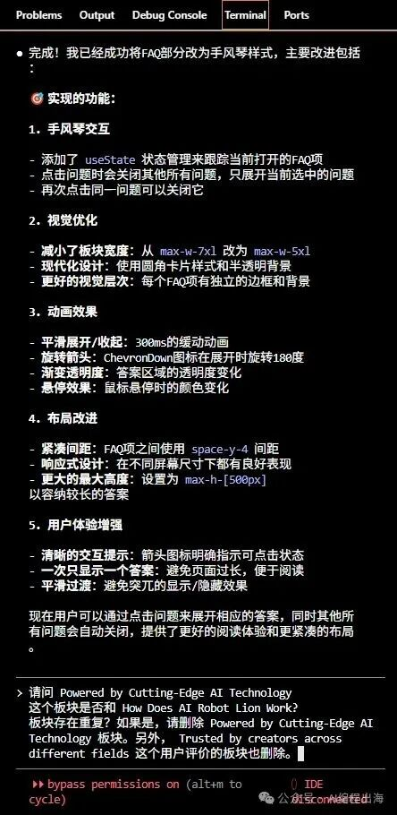

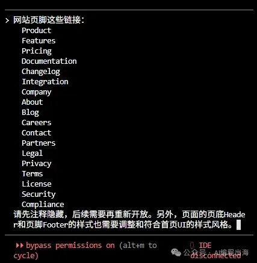

接下来，不要忘记修改一下网站的Logo。我让ChatGPT在原来生成文案的对话记录中，根据前面的文案，帮我生成这个网站的Logo图标，然后我用Photoshop修改了一下，准备了这几个图标，放在“/public/”文件夹中：

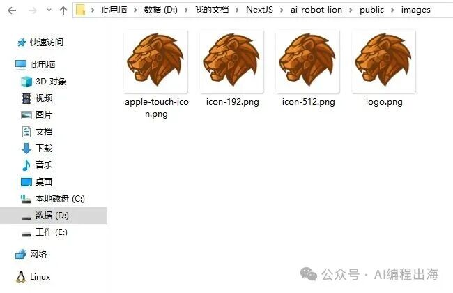

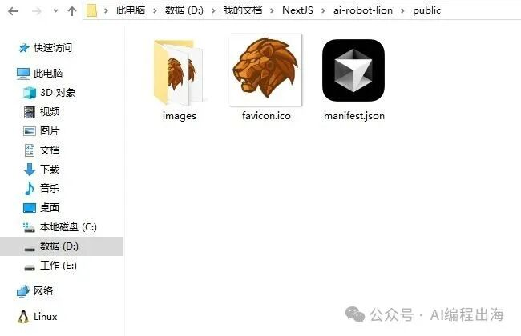

然后，让Claude Code把网站的Logo和Icon修改成我们给定的图标：

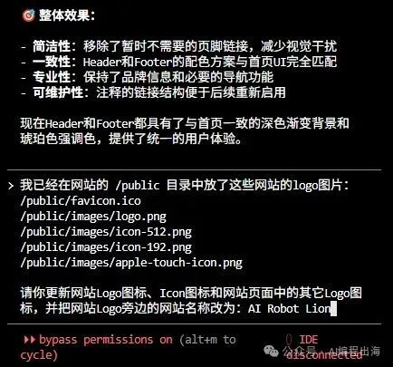

最后，Claude Code帮我们修改好了网站的首页：

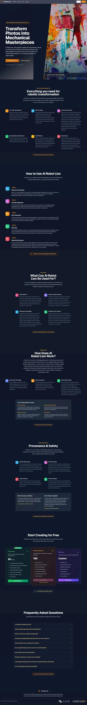

后面的文章中，我们再继续讲讲网站发布和上线前需要做的准备工作，以及怎样上线，欢迎关注！如果你有其它想了解和交流的内容，请告诉我。
