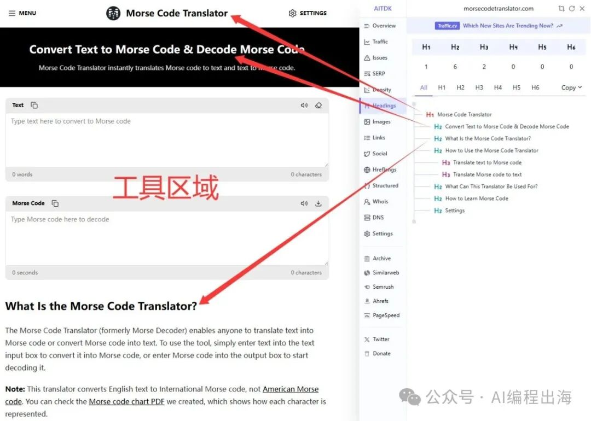
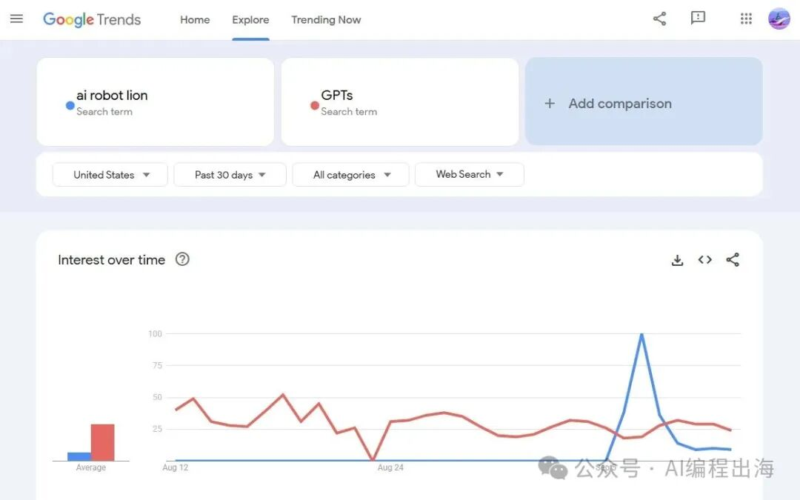
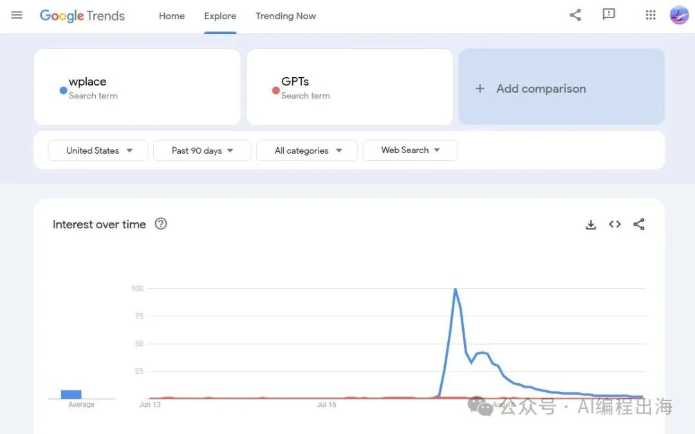
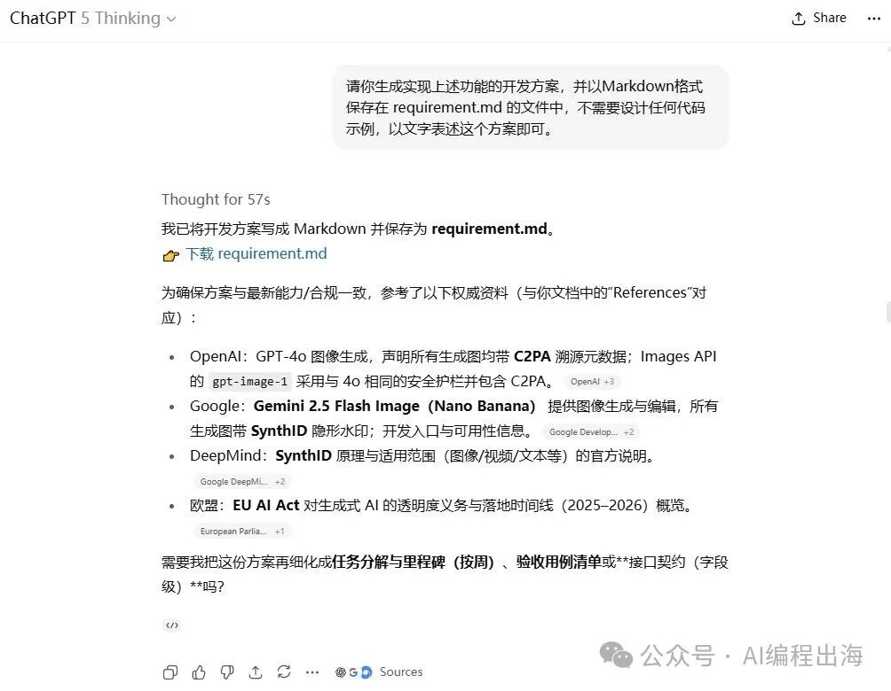
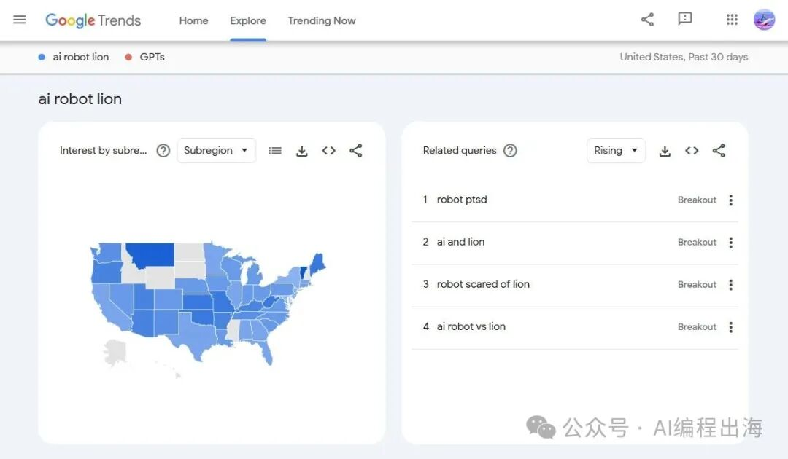
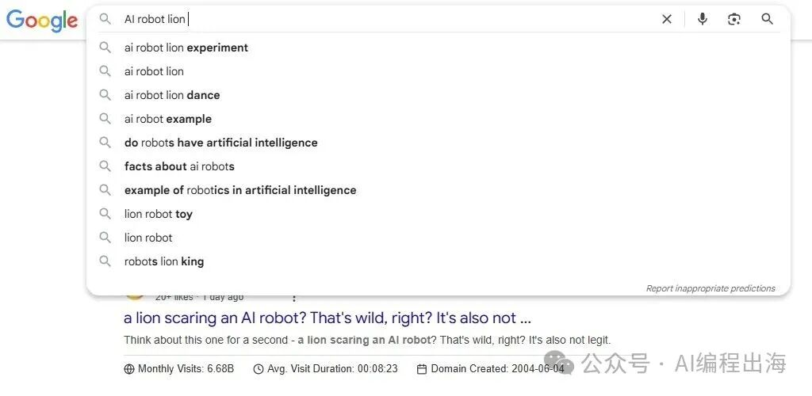
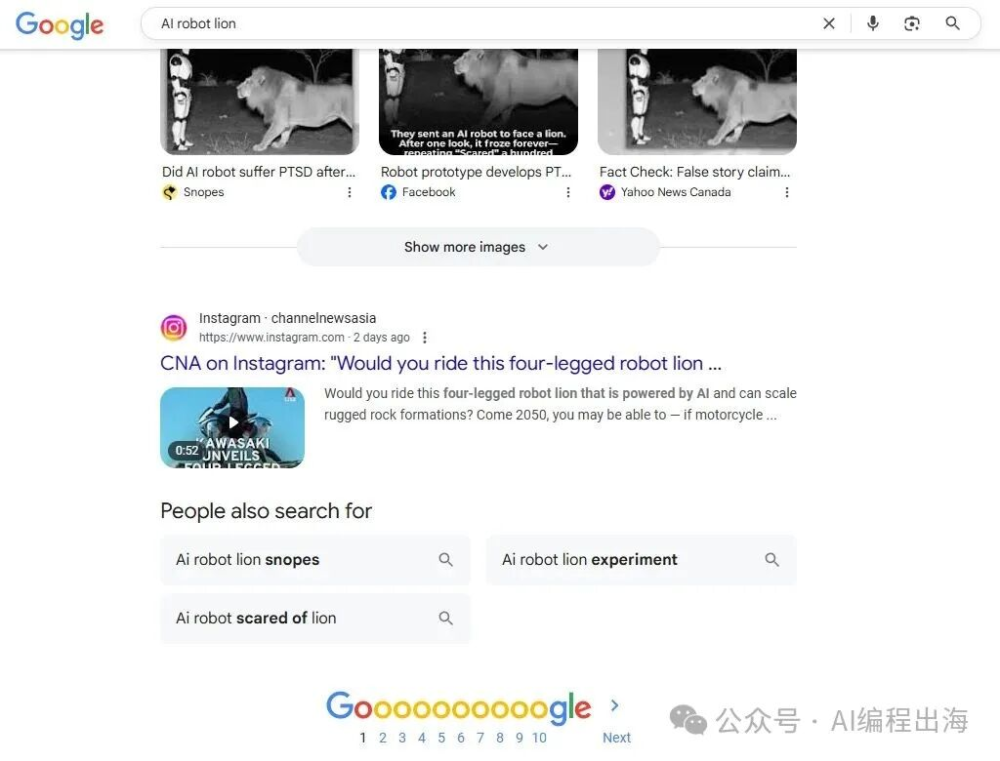
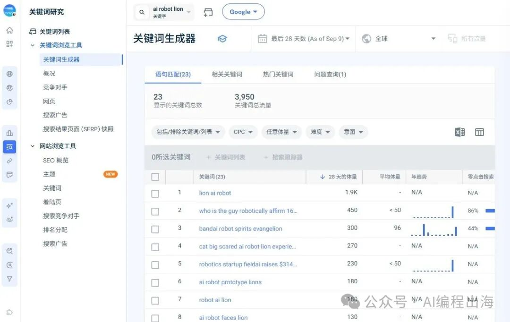

# 工具站都长同一张脸？我怎样用1个Prompt生成2.0落地页？

昨天的文章：

别感到奇怪！这些工具站实际上都是一个模样！

提到很多工具站都长一个模样，都遵循哥飞老师提到的工具站2.0落地页的特点。这样做有两点好处：

用内容承接用户通过关键词搜索的需求和意图；

用工具给用户提供直接触及的体验并增加页面停留时间。

那么，工具站2.0落地页具体有些什么特点呢？我们仍然以Morse Code Translator：

> https://morsecodetranslator.com/

https://morsecodetranslator.com/

这个经典工具站为例：

H1：覆盖核心关键词，甚至只有一个核心关键词“Morse Code Translator”；

Hero工具区域：直接让用户使用工具，给用户直接触及的体验并增加网站停留时间；

H2：覆盖长尾关键词“Convert Text to Morse Code”、“Decode Morse Code”、“What Is the Morse Code Translator?”、“How to Use the Morse Code Translator”、“What Can This Translator Be Used For?”、“How to Learn Morse Code”；

H3：覆盖更多长尾词“Translate text to Morse code”、“Translate Morse code to text”；

每个板块中的内容：覆盖更多长尾词。

既然2.0落地页有这些特点，那么能否让AI根据这些特点输出我们的的工具站的落地页呢？

答案是肯定的！而且AI比我们更懂！

挖掘到某个需求和对应的关键词后，我们需要围绕这个关键词准备网站首页的文案。接下来我们讲讲怎样通过AI准备这个文案。

我们以上周在Tiktok突然火了一下的“AI robot lion”为例。这个词不建议大家去做，这种词是在社媒中突然爆火，热度不一定能持久，这个词仅热了两三天，热度就下去了，不像前不久的另一个词“Wplace”那么火爆，因此，这个词仅仅是作为本次分享随便找的一个例子。

找个一个关键词后，如果你不确定这个关键词的来源和意图，可以先和ChatGPT或Gemini聊一聊。如果你确定要做这个关键词，还可以继续和o3或GPT5 Thinking沟通一下围绕这个词做网站的切入点，并生成实现这个功能的开发方案，以备后续开发这个功能时做参考或使用。

确定好切入点后，我们查找一下这个关键词的长尾词，我一般在这三个地方查看

谷歌趋势搜索这个词后，查看这个词的“Related queries”；

谷歌搜索输入框输入关键词后出现的下拉联想词和底部的“People also search for”；

SimilarWeb中通过“关键词生成器”查看这个词的“语句匹配”词、“相关关键词”和“热门关键词”。

相较而言，谷歌趋势和谷歌搜索的数据几乎是最新的，查看新词的相关关键词一般以这两个作为依据，SimilarWeb和Semrush的数据可能还没来得及更新，但是对于老词，SimilarWeb和Semrush可以延伸出更多的相关关键词。

查询之后，选择和我们这个关键词和切入点相关的关键词，比如：Ai robot lion snopes, Ai robot scared of lion, Ai robot lion experiment, ai robot lion dance, lion ai robot

接下来，我们让ChatGPT o3或GPT5 Thinking根据上面讨论的方案填充下面这个指令的内容：

**【指令】**你现在是一位资深的 SEO 专家与用户体验（UX）设计师，需要基于「AI Robot Lion」（其中可合并第 6 点的详细功能或需求分析）撰写一篇高质量的工具网站首页内容。1.**语言（Language）**：请以「美式英文」（或指定的其他语言）输出完整文案；2.**受众（Audience）**：面向「填充用户群体」人群；3.**风格（Style）**：采用「填充首页内容风格」文案基调；4.**长尾关键词（Long-tail Keywords）**：在文内（H2/H3 标题、小段落、FAQ 等）适度插入并强调「填充长尾词」。5.**参考/对齐（Competitor Sites or References）**：如有需要，请部分借鉴或参考「填充参考网站」的风格/结构，但不可抄袭。6.**详细需求（Detailed Requirements）**：「填充需求」请确保在「AI Robot Lion」关键词里，结合之前第 6 点的**详细需求（Detailed Requirements）**，让 AI 生成的内容更精确地反映工具的实际能力或特色。

很快，ChatGPT帮我们填充好了这个Prompt。你也可以通过手动查询这些相关信息，然后补充到Prompt中。基于这个Prompt，你再增加一些你的要求，比如H2布局、关键词密度等，然后通过ChatGPT的“Deep Research”（切记是“深入研究Deep Research”），可以生成相当不错的首页文案。

你在通过AI生成网站首页落地页内容的时候，不要拘泥于我的上述指令，你可以根据你使用AI的经验通过更加合适的指令生成你所需要的结果，而且，只要你使用ChatGPT的“Deep Research”进行文案生成，效果不会太差。

后面的文章中，我们继续讲讲怎样把“Deep Research”生成的首页文案放进一个NextJS网站中。

文末付费部分是我平时生成工具站落地页文案的完整版指令，可以通过“Deep Research”一次性生成“网站首页文案、网站首页SEO相关要素、网站提交到其他网站的产品信息、网站推广使用的博客文章”这4部分内容。如果你刚好有需要，欢迎使用。
