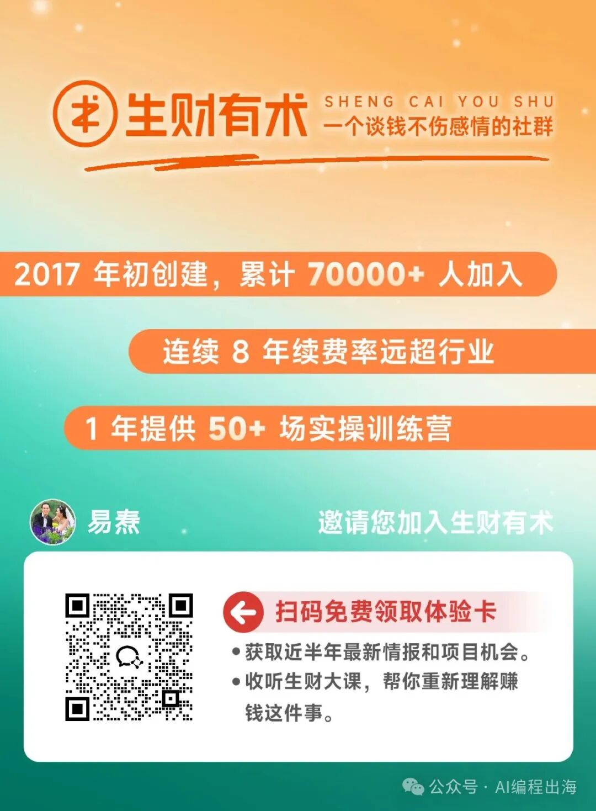
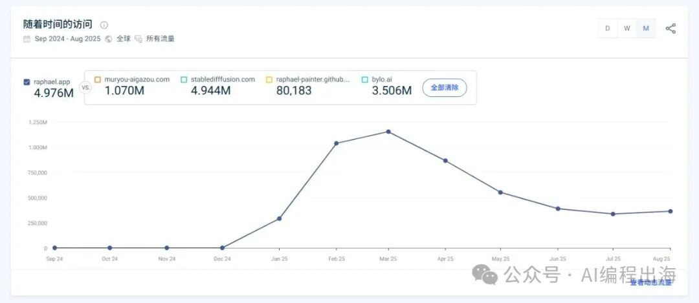
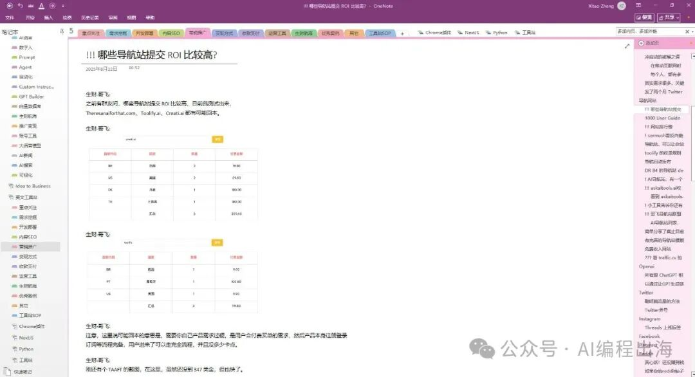

# 人，一定要走进能托举和滋养你的圈子

荀子曰：“与凤凰同飞，必是俊鸟；与虎狼同行，必是猛兽。”

最近有不少朋友联系我，问我有没有社群，以及是否推荐我在文章中提及的社群。

先讲讲我对社群的看法

每个人对社群的需求和理解不一定相同。我参加社群除了从中获取需要的信息之外，还希望能学有所成融入圈子当中，因为这些圈子有许多值得我学习和结交的前辈和牛人。

不管任何社群，都无法保证我们赚多少钱，正如我们以前上学时任何老师都无法保证我们考上大学一样。但是，这一点也不妨碍我们感恩过去的老师，感恩他们对我们的知识启蒙和人生引导。

我目前自己没有做社群，加入的社群只有两个，一个是生财有术，另一个是哥飞社群，两个真正在滋养我和托举我的圈子。

生财有术

我是在2020年6月18日加入生财有术，之后连续五年续费，再没有退出过。加入生财后，我第一次见识到原来在我的认知以外还有那么多副业和生意，而且很多竟然离我们那么近。在这5年间，我阅读了大量精华帖，参加了多次航海实战，最终找到最适合自己的英文工具站赛道并持续深耕。

在生财有术，有各行各业的牛人大咖，甚至有耳熟能详的知名人物：

> 这里有前猎豹移动产品总监刘小排，这里有前返利网创始人之一老胡，这里有抖查查CEO波波，这里有硅谷投资人王川，这里有知名战略营销专家小马宋，这里有跨境电商著名KOL顾小北，这里有出海SEO专家哥飞，这里有互联网百晓生曹政……

这里有前猎豹移动产品总监刘小排，

这里有前返利网创始人之一老胡，

这里有抖查查CEO波波，

这里有硅谷投资人王川，

这里有知名战略营销专家小马宋，

这里有跨境电商著名KOL顾小北，

这里有出海SEO专家哥飞，

这里有互联网百晓生曹政

……

加入生财，我一直在努力提升自己并融入圈子中，分享过多篇AI编程相关的文章，拿到了三篇精华和一颗龙珠，还认识了许多优秀上进的圈友。

> 可能你对龙珠没有概念，这么说，生财的一颗龙珠相当于4张生财的门票，或者8000~10000元，并且每年还有分红。

可能你对龙珠没有概念，这么说，生财的一颗龙珠相当于4张生财的门票，或者8000~10000元，并且每年还有分红。

如果你想开阔眼界增加见识，如果你想尝试副业改变现状，如果你想认识朋友接触大咖，那么生财都是你的不二选择。如果你感兴趣，可以扫码下面这个体验码免费体验，里面有上百种可以做的互联网副业和最新机会。

刘小排深海圈

这是生财有术邀请刘小排老师一同创建的海外AI产品课程，名为：Idea to Business，意为把你的想法落地成为商业项目，目前仅对生财圈友开放。

作为前猎豹移动的产品总监，小排老师以其商业视角告诉我们什么样的idea才有可能成为商业，以其专业能力告诉我们怎样开发产品和打磨产品。他已经公开的项目之一：

> https://raphael.app/

https://raphael.app/

上线三月即做到月访客百万，即使现在有所回落，每个月仍然有三四十万的访客。

如果你想零距离学习顶尖产品人如何用商业视角与专业技能，把一个 Idea 从零打磨成真正的Business，那么一定不可错过小排老师的深海圈。

哥飞社群

哥飞也是生财圈友，同时也是生财航海教练。哥飞社群创建没多久，我就在生财圈友良辰美（现生财英文工具站航海教练）的推荐下加入哥飞社群，从此真正开启了我的网站出海之路。

哥飞一直鼓励我们找新词做新站，从而更快感受到出海的温度，与此同时，他给我们详细讲述了SEO和出海网站的方方面面，内容之细、内容之广，在出海SEO领域未有出其右者。我每天除了看生财的精华帖之外，往往都要抽出时间查看哥飞社群的信息，并分门别类做了大量的笔记：

这些笔记成为了我现在出海航程中的指路明灯。

在社群中一段时间后，你很快就会发现，许多在出海领域有很大成就的大咖其实也同时在生财有术和哥飞社群两个圈子中，除了哥飞和刘小排外，像Pollo.ai、Toolify、mcp.so、AITDK、GPTsHunter等知名AI出海产品的创始人阿彪、阳光山木、艾逗笔、Blank、Airyland等等，其实都是生财圈友，也同时是哥飞群友。

如果你想做出海网站，想做SEO，那么你一定要关注哥飞公众号和哥飞社群。
