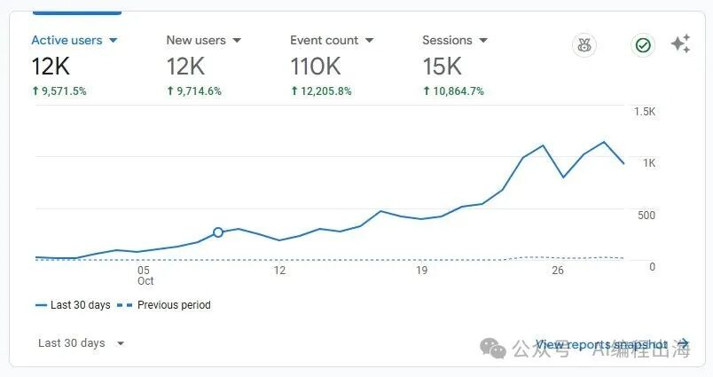
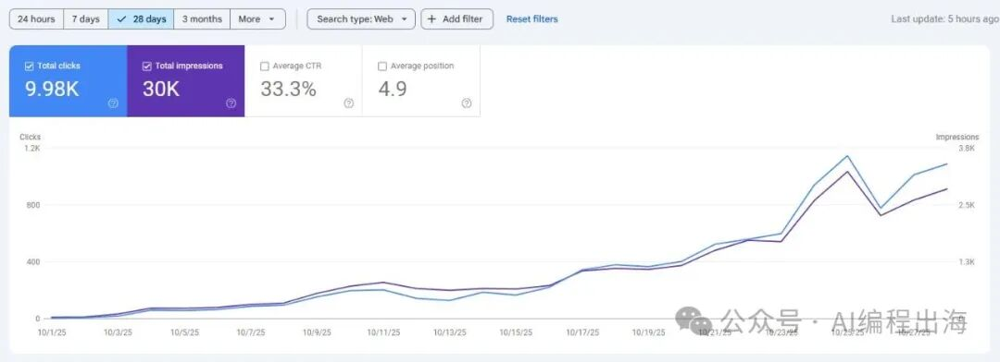

# 终于有一个访客过万的出海网站（附我的上站流程清单）

今天值得记录一下，我有一个出海网站的月访客终于过万了：

网站大部分流量来自于谷歌搜索，GSC显示的近28天访客数差不多有1万：

如果能进一步增长或者保持，网站流量有望超过我之前做的GPT-4o生图的网站。这点访客数，在高手眼中，实则不算什么，但对我们新手来说，却是很强的正反馈。

网站使用的是刘小排老师提供的raphael-starterkit-v1的NextJS框架，按照哥飞老师所讲的思路进行关键词挖掘和SEO优化，并按小排老师所授的方法进行网站部署和产品打磨。

整个过程和我前面分享过的文章内容大同小异，因此，今天给大家重新梳理一下我前面发布的文章，给正在做出海网站的朋友提供一些参考：

上站总览：

出海工具站高手是怎样快速上线一个网站的？

这篇文章是出海工具网站上站的流程总览，其中每一个流程的步骤请详细查看下面“上站流程”部分的文章。

需求挖掘：

找新词：出海网站新手最快找到正反馈的方法

出海那么难！网站流量总是躺平！怎么办？

出海工具站高手是怎样挖掘产品需求的？

出海工具站高手做产品的“不传”心法

前2篇文章详细讲述了哥飞老师“找新词”和“分析关键词难度”的思路，这是最容易让新手在出海过程中快速找到正反馈的方法，我上述提到的访客过万的网站也是通过“找新词”拿到一点点正反馈。

后2篇文章站在高手的角度，通过学习刘小排老师、圈友子木和哥飞社群中的高手的思路，给大家呈上更多出海挖掘需求的思路以及“心法”。

上站流程：

工具站出海的第一个坑：域名注册需要注意什么？

别感到奇怪！这些工具站实际上都是一个模样！

工具站都长同一张脸？我怎样用1个Prompt生成2.0落地页？

上线出海网站，不要总想着从0到1

这些细节没注意，你的出海网站有可能会前功尽弃

新手把代码推上GitHub的最佳姿势，为Vercel一键部署铺路

Vercel一键部署NextJS，上线出海网站就是那么简单！

出海风浪那么大，怎么可以没有这个护身符？ Cloudflare从0到1实战：DNS、SSL、邮箱、缓存、反爬全指南

你的出海网站有没有流量？你的网站用户干了什么？这4个免费工具让你不再盲目出海 | 安装篇

毫无保留！给你讲清楚怎样轻松开发一个AI生图网站

你的出海网站还在使用邮箱登录，那就是在自找麻烦了！最后一步切记不能遗漏

AI编程：

崩溃了！AI把我的代码越改越乱！怎么办？

生成的代码很离谱？通过API调试让AI更懂你的需求

原来，现在最流行的编程语言是中文！7个思路让你快速掌握这门现代化“编程语言”

由于技术能力有限，因此，我很早就通过AI进行编程，从GPT3.5到GPT4，再到Code Interpreter，从Cursor到Claude Code，再到Codex，过程中，我总结了一些AI编程的思路，也许会对你的AI编程带来一些启发。

站外推广：

懒得发外链？让Claude  Code半天搞定外链提交插件，每天省2小时

推广这部分我还有待加强，虽然做了这个插件，提升了部分外链的提交效率，但目前发布外链仍然存在诸多问题和卡点，还需进一步积累外链来源，完善插件功能。

产品打磨：

窥探顶级产品经理的出海网站，从中发现百万月活产品不曾对外公开的12个秘密

这篇文章通过1万字的篇幅，详细分析了刘小排老师的Raphael AI网站，你可以从中感受一个顶级产品经理是怎样打磨一个产品，以及践行他经常和我们强调的做产品的“心法”：

什么人，在什么场景下，愿意花多少钱，解决什么问题？
