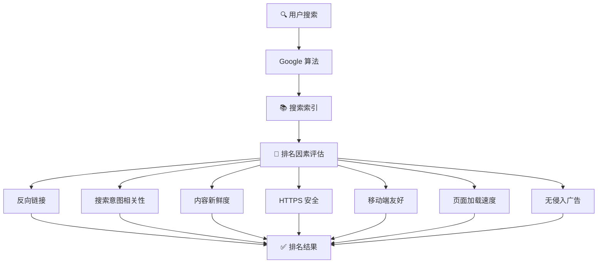
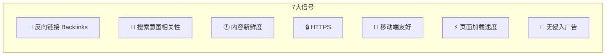
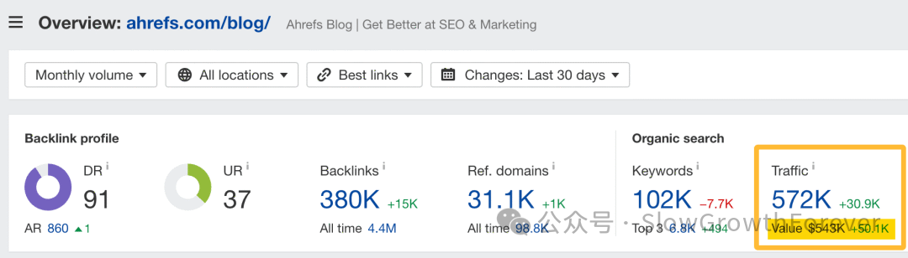
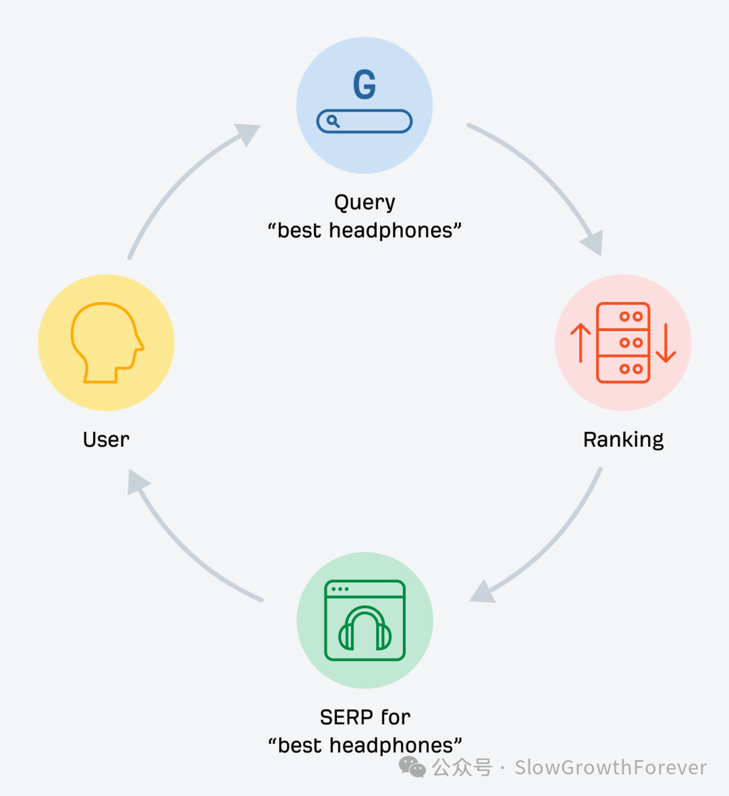
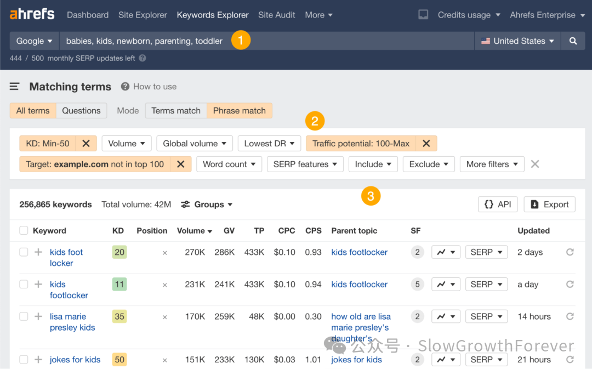
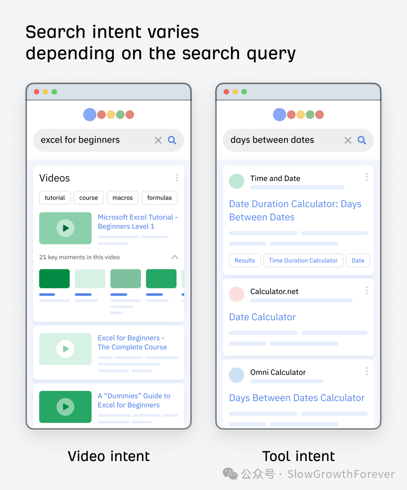
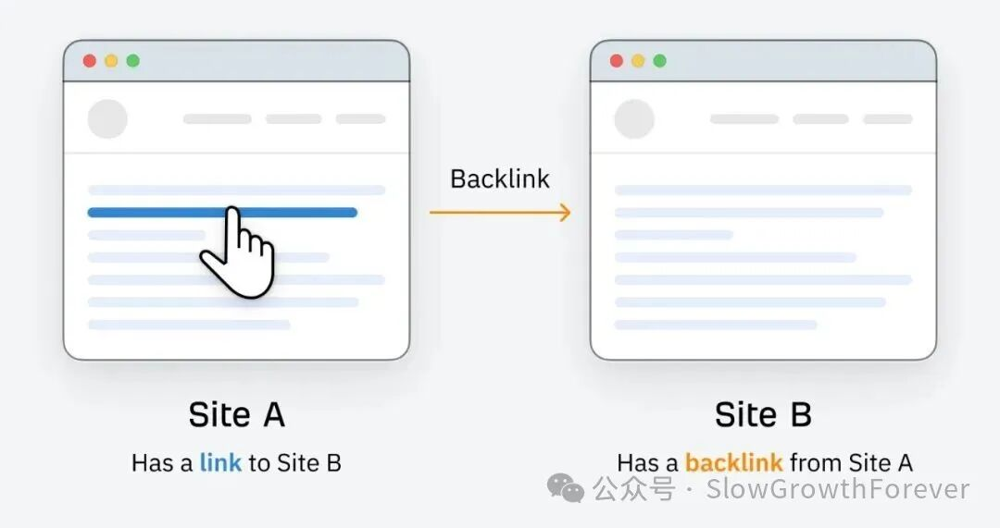
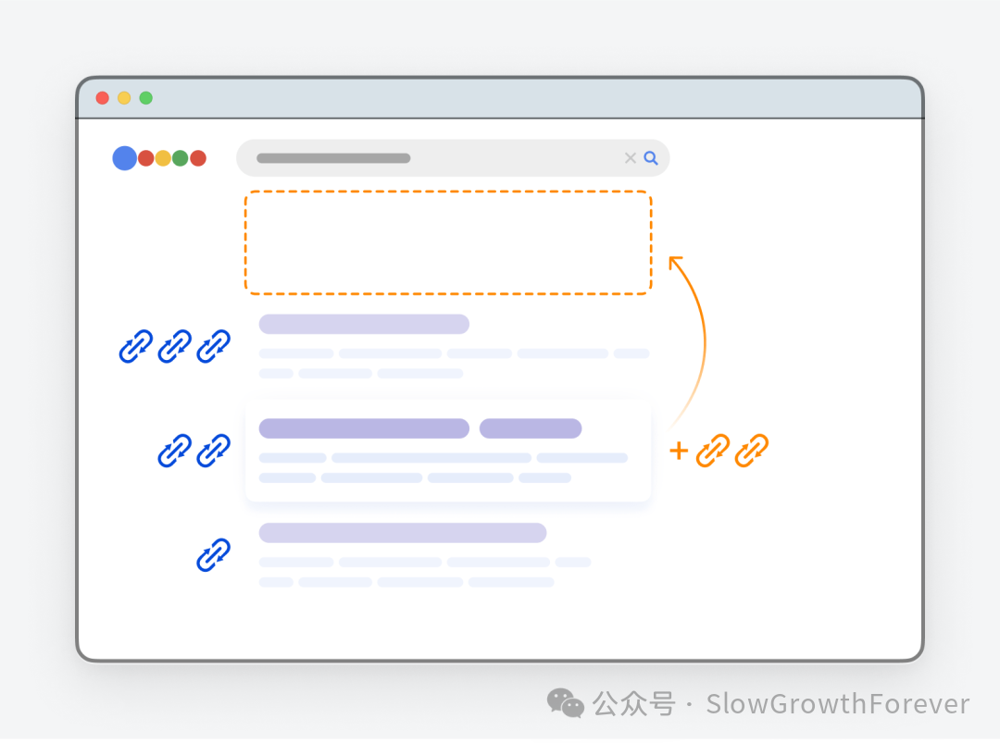

# 做了网站没人来？SEO 到底是什么，Google 靠这 7 个信号决定你排第几

> **摘要**：SEO（搜索引擎优化）通过改善网站内容、结构和权威性，让 Google 把你推荐给搜索相关内容的用户。核心价值：获得免费、可持续的被动流量。Ahrefs 博客每月从 Google 获得 57.2 万次访问，相当于 50 万美元广告费。Google 已确认的 7 个排名信号：**反向链接、相关性（搜索意图）、新鲜度、HTTPS、移动端友好性、页面加载速度、侵入式插页广告**。做好 SEO 四件事：**关键词研究、搜索意图、内容质量、页面用户体验**。

<!-- more -->

## Flowchart: SEO 工作原理



## Google 7 大排名信号



## Markmap 思维导图

```markmap
# SEO 完整指南：Google 7 大排名信号

## 为什么 SEO 重要
- 抢占 Google 搜索需求份额
- 被动流量 = 免费 = 可持续
- Ahrefs 案例：57.2 万次/月 ≈ 50 万美元广告费

## 搜索引擎原理
- 搜索索引（数字图书馆）
- 搜索算法（匹配+排名）
- 三步：抓取 → 索引 → 排名

## Google 7 大排名信号（已确认）
1. 反向链接（Backlinks）
2. 相关性（搜索意图）
3. 新鲜度
4. HTTPS（网站安全性）
5. 移动端友好性
6. 页面加载速度
7. 侵入式插页广告

## 个性化因素
- 地理位置
- 语言
- 搜索历史

## SEO 四件关键事

### 1. 关键词研究
- 找有商业价值 + 有搜索量的词
- 工具：Ahrefs Keywords Explorer
- 流程：种子词 → 筛选 → 选词

### 2. 搜索意图
#### 四种类型
- 信息型（Informational）
- 导航型（Navigational）
- 商业调查型（Commercial investigation）
- 交易型（Transactional）
#### 识别意图3C
- Content type（内容类型）
- Content format（内容格式）
- Content angle（内容角度）

### 3. 内容质量
#### 三个关键
- 优化过的内容：有用/易读/结构清晰/独特/新鲜
- E-E-A-T：经验/专业性/权威性/可信度
- 反向链接

### 4. 页面用户体验
- 站内 SEO 最佳实践
- 标题标签 / alt 文本 / 结构化数据

## 反向链接详解
### 链接建设三种方式
- 赚取 Earn（优质内容吸引）
- 创建 Create（手动添加到目录）
- 建设 Build（主动联系）

### 热门技巧
- 断链建设（Broken link building）
- 客座博客（Guest blogging）
- 摩天大楼技巧（Skyscraper Technique）
- 资源页链接建设
- HARO 服务

### 质量五因素
- 权威性 / 相关性 / 锚文本 / 位置 /nofollow

## SEO 类型
- 站内 SEO（On-page）
- 站外 SEO（Off-page）
- 技术 SEO（Technical）
- 本地 SEO / 电商 SEO / 企业 SEO

## SEO 工具
- Google Search Console（免费，数据准确）
- Ahrefs（全能型，关键词/竞品/外链/技术审计）

## 趋势（2024-2025）
- 视频 SEO
- SGE / AI 概览
- AI SEO
- 信息增益（Information Gain）
```

## 正文

### SEO 是什么

不只是你，所有 OPC 都会遇到这个问题。做了个网站，界面漂亮，功能齐全，然后没人来。用户怎么找到你？大部分时候，他们打开 Google，输入几个词，然后点排名靠前的结果。

SEO 就是让你出现在那些结果里的技术。

SEO（Search Engine Optimization，搜索引擎优化），说白了就是通过改善你网站的内容、结构和权威性，让搜索引擎更好地理解你，然后把你推荐给搜索相关内容的人。

SEO 之所以重要，核心就两点：

1.人们在 Google 上搜各种东西，产品、服务，信息。这就产生了搜索需求，大量网站都在抢。有效的 SEO 能让你在竞争中拿到份额。

2.通过 SEO 获得的流量是免费的。不像投广告，按点击付费，一旦停投，流量就没了。

归根结底，SEO 的价值就是每个月源源不断地给你网站送免费、可持续的被动流量。



### 搜索引擎原理

搜索引擎的设计初衷就是帮你在互联网上找到信息，它靠两个核心组件运转：

- **搜索索引（Search index）**：一个关于网页信息的数字图书馆
- **搜索算法（Search algorithms）**：根据你的搜索查询，从索引中匹配并排列结果的程序

工作流程分三步：

- **抓取（Crawling）**：网络爬虫（也叫蜘蛛）通过已知页面上的链接，访问和下载网页
- **索引（Indexing）**：把抓到的页面信息处理一下，添加到搜索索引里
- **排名（Ranking）**：你搜索的时候，算法根据各种因素对相关结果排名，把最好的放最前面



### Google 7 大排名信号

Google 已确认的 7 个排名信号：

1. **反向链接（Backlinks）**
2. **相关性（搜索意图）**
3. **新鲜度**
4. **HTTPS（网站安全性）**
5. **移动端友好性**
6. **页面加载速度**
7. **侵入式插页广告**（Intrusive interstitials，就是那些遮挡页面内容的弹窗广告）

Google 还会根据位置、语言、搜索历史做个性化结果。

### SEO 四件关键事

#### 1. 关键词研究

要拿到自然搜索流量，内容得围绕人们真正在搜的话题来做。最好的话题还得是有商业价值的。

流程：输入种子词 → 用筛选条件细化 → 选出最适合的关键词。



#### 2. 搜索意图

搜索意图（search intent）就是搜索背后的动机，分四类：

- **信息型（Informational）**：想找信息，比如"谁发明了鼠标"
- **导航型（Navigational）**：想找特定网站，比如"facebook login"
- **商业调查型（Commercial investigation）**：想买但要先调研，比如"ahrefs review"
- **交易型（Transactional）**：纯粹的购买模式，比如"buy iphone 15"

识别意图 3C：内容类型、内容格式、内容角度。



#### 3. 内容质量

Google 衡量内容质量的三个关键：

- **优化过的内容**：有用、易读、结构清晰、独特、新鲜
- **E-E-A-T**：经验、专业性、权威性、可信度
- **反向链接**



#### 4. 反向链接

反向链接就像投票，获得"投票"越多的页面，排名往往越高。

链接建设三种方式：赚取（Earn）、创建（Create）、建设（Build）。



热门技巧：断链建设、客座博客、摩天大楼技巧、资源页链接建设、HARO。

### SEO 常见问题

**SEO 要多久才能见效？**

通常需要 3-6 个月才能看到效果。

**需要哪些工具？**

- Google Search Console：免费，直接来自 Google 的数据
- Ahrefs：全能型，关键词研究+竞品分析+外链+技术审计

### SEO 趋势（2024-2025）

- 视频 SEO
- SGE / AI 概览（搜索生成体验）
- AI SEO
- 信息增益（Information Gain）
