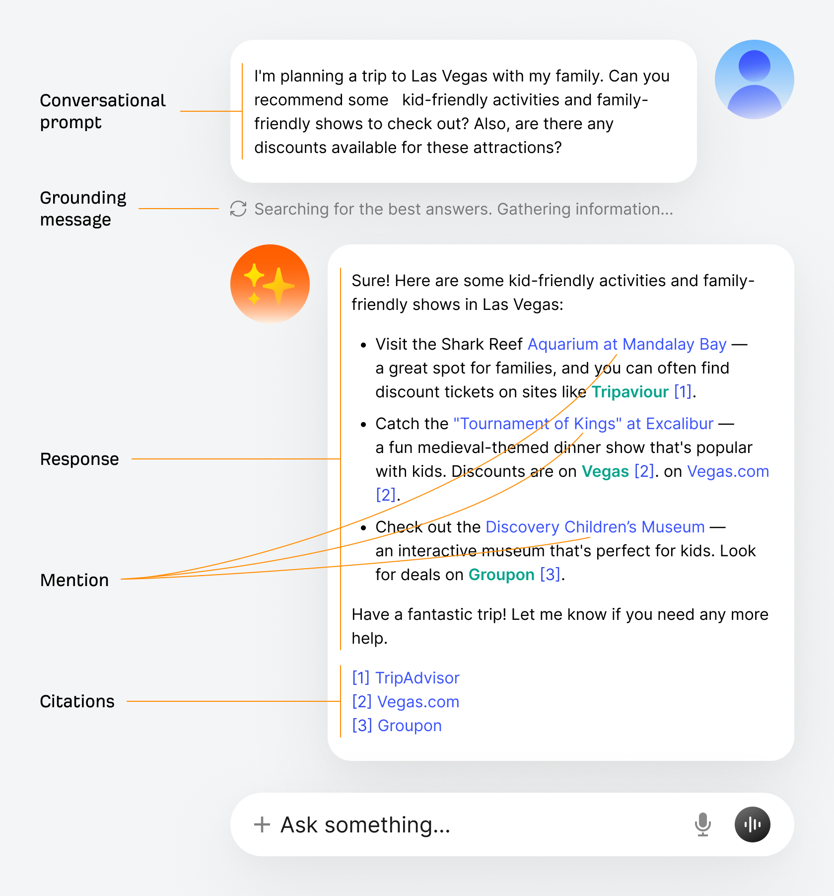
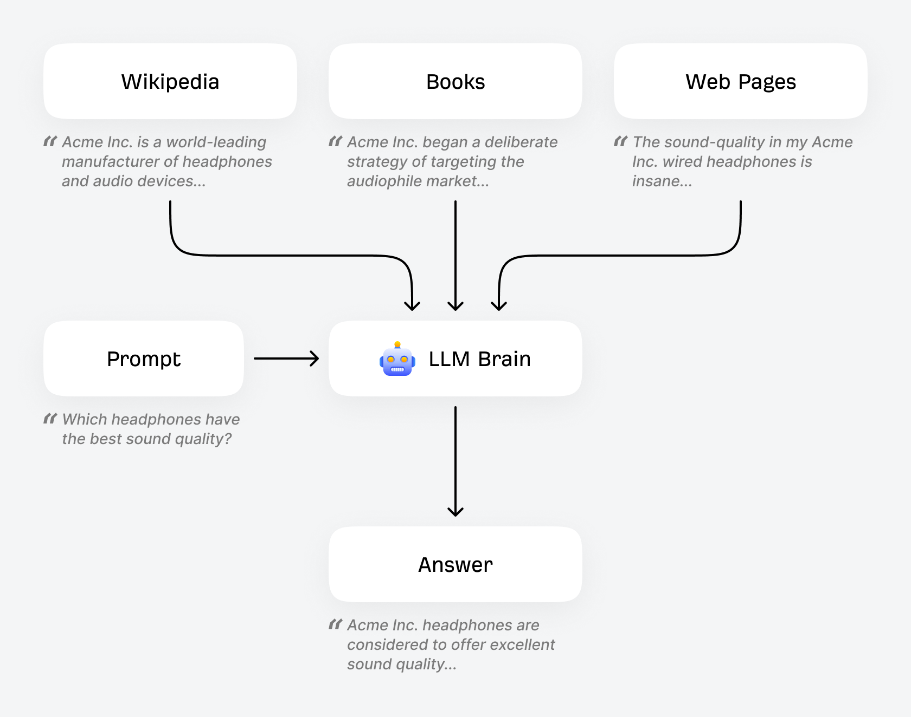
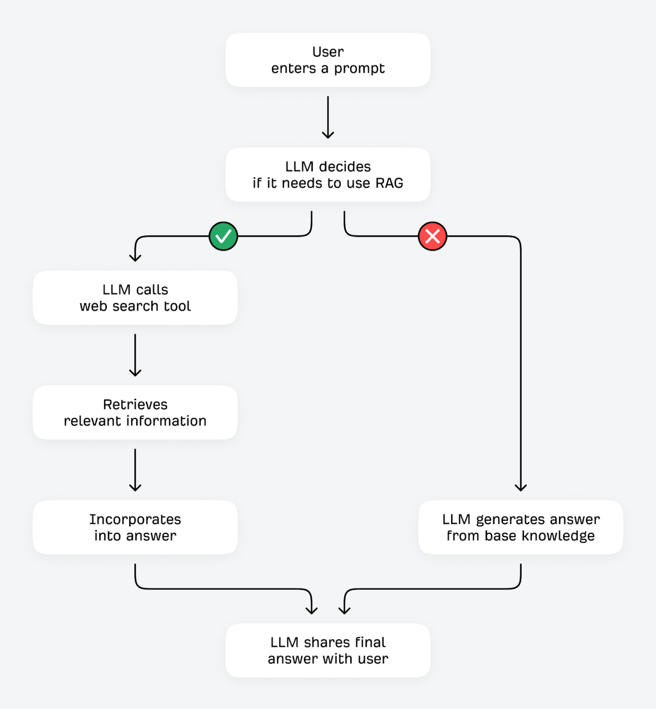
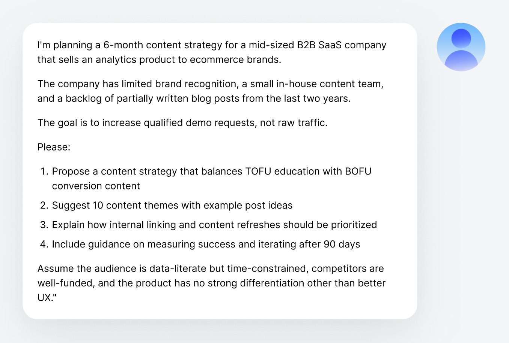
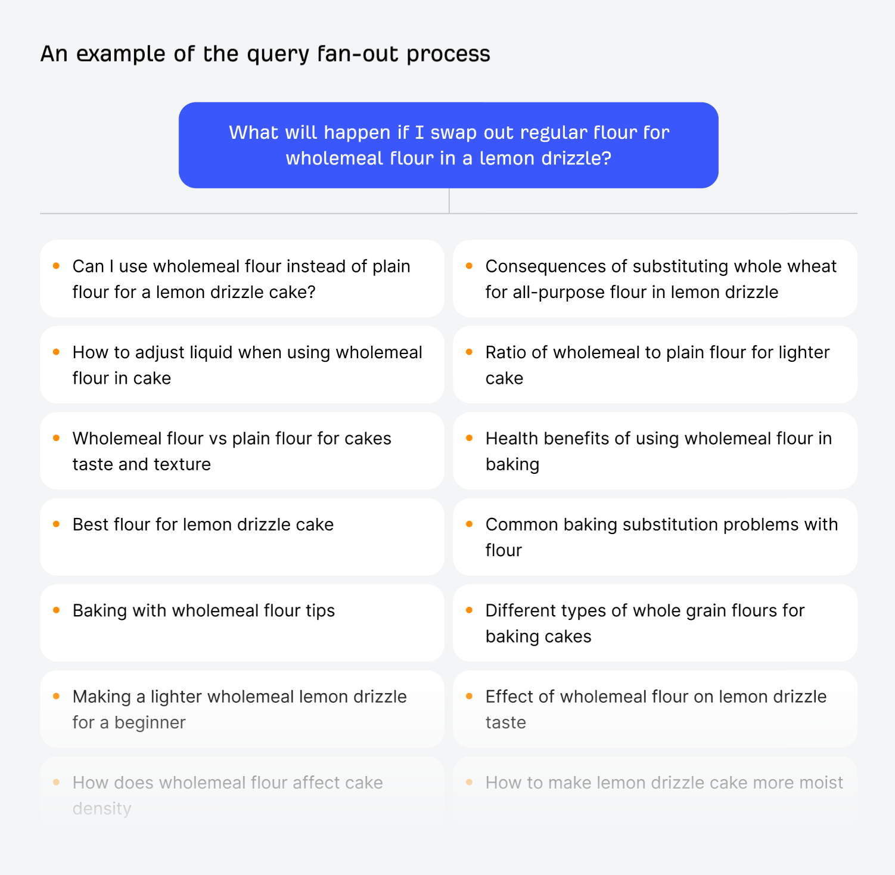
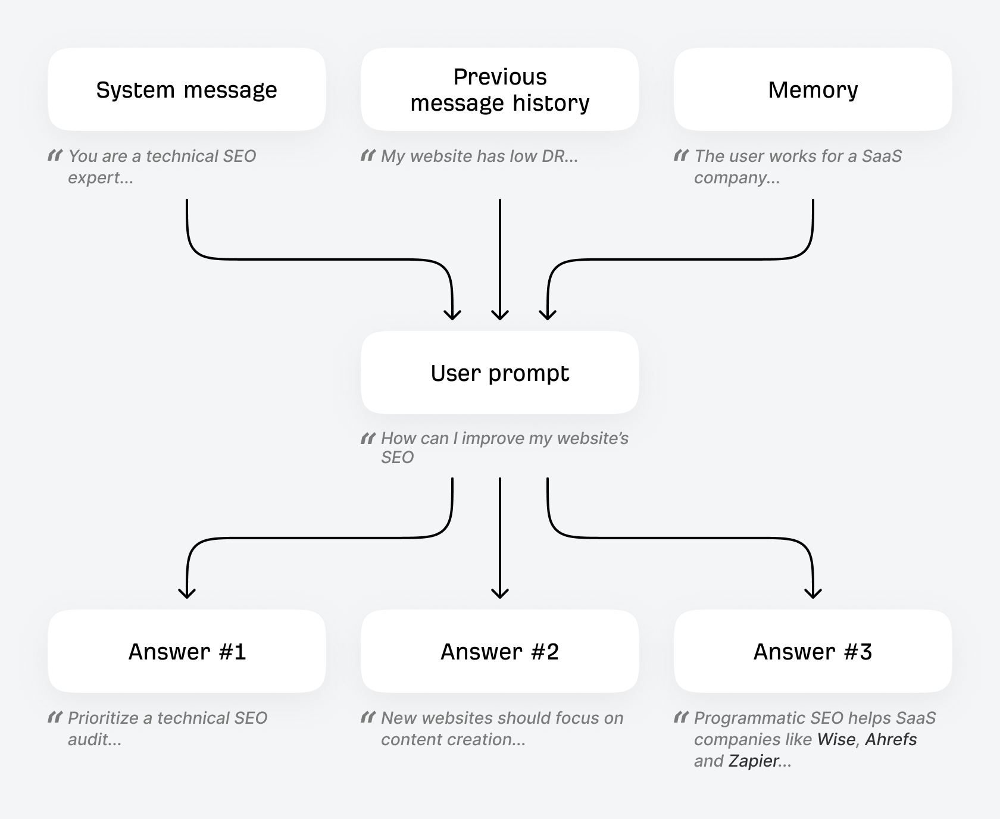

Title: AI 搜索引擎的工作原理

URL Source: https://ahrefs.com/zh/seo/how-ai-search-engines-work

Published Time: Tue, 21 Jul 2026 02:16:58 GMT

Markdown Content:
当您让 ChatGPT 推荐最适合健身时佩戴的头戴式耳机时，实际背后的过程是怎样的？

AI 搜索引擎是如何生成答案并选择产品推荐的？它们与 Google 等传统搜索引擎有哪些不同，又在哪些地方仍有共通之处？

更关键的是，如何让 _你自己_ 的网站、品牌和产品出现在这些 AI 生成的结果中？

* * *

第1部分

## 什么是 AI 搜索引擎？

AI 搜索引擎是基于大语言模型（LLM）的问答系统，能够检索信息并生成响应。

[传统搜索引擎](https://ahrefs.com/zh/seo/how-do-search-engines-work)和 AI 搜索引擎之间存在一些关键差异（尽管随着传统搜索引擎加入更多 AI 功能，这些差异正在缩小）：

*   用户不再只是输入一次性的搜索查询，而是可以**继续追问后续问题**，保持对话的连贯性。

*   AI 搜索引擎不会返回按排名排序的链接列表，而是提供**直接的答案与推荐**（且这些答案可能会定期变化）。

*   用户无需跳转到您的网站，而是会在**聊天界面中直接得到查询解答**（从而导致回流至您网站的点击量减少）。

以下是典型的 AI 搜索界面样式，类似于 ChatGPT、Claude 或 AI 模式中的呈现方式：

*   **对话型提示词：** 用户的提问内容。

*   **事实锚定信息：**用于表明 LLM 已决定搜索额外信息以用于其回答的信息。

*   **响应：**AI 针对用户提示词生成的答案。

*   **提及：**在回答文本中内联提及的实体（例如品牌或产品）。

*   **引用：**用于响应生成的来源 URL，通常列在末尾。

要想让您的内容在此类回答中获得曝光，首先需要了解 AI 搜索引擎运作的核心流程。

* * *

第2部分

## 训练机制

LLM 通过海量数据进行训练，等同于“阅读”了包括整部维基百科、Common Crawl 数据集、Google Books 在内的各类大型语料库，以及数以百万计的网页内容。

训练数据赋予了 LLM 对世界的“认知基础”。如果某耳机品牌在训练数据中高频出现，并且处于相关语境且伴随积极的描述词（如“高性价比”、“适合在健身房使用”等），那么当用户提出与耳机相关的提示词时，该模型有很大概率会在回答中提及该品牌。

您知道吗？

实际的训练流程远比本文描述更为复杂。在**预训练**阶段，会对数据进行清洗与筛选，包括剔除 HTML 标签、移除个人可识别信息、排除屏蔽词以及限定语言范围等；在**后训练**阶段，则通过进一步优化，使模型更接近实用型聊天助手（而不仅仅是简单的词元预测器）。要了解更多信息，请观看 Andrej Karpathy 视频[深入解析 ChatGPT 等大语言模型](https://www.youtube.com/watch?v=7xTGNNLPyMI)。

这也是实体型 SEO 的关键所在：当您的品牌稳定出现在知识图谱中，通过 schema 标记进行了恰当的结构化，并且在整个互联网的高质量内容中与相关实体共同出现，那么你就在训练数据中构建了更强的"实体信号"。

关键在于，LLM 具有许多独特特性：

*   **它们具有概率性：**即使使用相同的提示词，每次也可能得到不同的回答。这种概率特性意味着，你无法像优化关键词那样“针对某个提示词进行优化”。相反，应当从分布的角度思考：在 100 个类似提示词中，你的品牌出现的概率是多少？因此，这就是为什么追踪大量提示词的平均可见度，比死盯住少数几个提示词更有意义。

*   **知识存在截止时间：**默认情况下，LLM 的知识范围仅限于该特定模型训练所用数据集中的内容。每个模型只基于某个截止日期之前的数据快照上进行一次性训练，随后会周期性发布具备更新知识截止时间的新模型（历史上大约每六个月左右发布一次）。

*   **幻觉问题：**模型可能会自信地给出并不真实的内容。LLM 是通过预测下一个最有可能出现的词来生成文本，而不是通过核实事实。虽然它们在训练中被设定为要有帮助且准确，但模型本身并没有内置的事实核查机制，这也正是通过网页搜索进行事实锚定如此重要的原因。

一个常见的误解是，认为 LLM 会像软件打补丁一样获得"知识更新"。实际情况是，每个模型只在某个固定的数据集上训练一次。当一个知识截止日期更新的新模型发布时，那是一个从零开始训练的全新模型，而不是对现有模型的更新。

一个会产生幻觉、分享过时信息的搜索引擎听起来并不怎么实用。正因如此，LLM 通过一种称为**事实锚定**的机制来克服其中的某些局限性。

* * *

第3部分

## 事实锚定与 RAG（检索增强生成）的工作原理

LLM 可以通过两种方式验证并改进自己的回答：一是使用工具（如计算器或其他数据 API），二是从外部来源检索额外信息。后者在技术上被称为检索增强生成（RAG）。

用户提问后，LLM会先自我判断：“我是否已经知道答案，还是应该获取额外信息？”如果模型能够以较高确定性预测下一个令牌（例如那些变化不大的问题，如“红细胞的作用是什么？”），它通常会直接基于自身已有知识进行回答。若确定性较低时（例如“最划算的咖啡研磨机是哪款？”这类更容易变化的问题），模型则可能会调用搜索工具，从互联网中的其他来源检索相关信息。

LLM 会经过微调，以识别那些可能需要补充信息的查询类型，例如：

*   **超出模型训练范围的话题：**_“Ahrefs 的 Keywords Explorer 使用了哪些内部排名因素？”_

*   **需要最新或具备时效性的信息主题：**_“Google 最近一次核心更新是什么？什么时候推出的？”_

*   **明确要求进行网页搜索的主题：**_“在互联网上搜索 2026 年流行的链接建设策略。”_

*   **请求提供来源和证据的提示词：**_“请提供来源，以证明 Google 在其算法中使用了用户参与度信号。”_

某些 LLM 模型还非常容易触发额外的搜索（例如，“深度研究”模型就被专门配置为会触发多轮 RAG（检索增强生成）搜索）。

通过 RAG（检索增强生成）寻找真实依据的过程（通常称为“事实锚定”）具有多项优势。LLM（大语言模型）可以对照第三方来源核验自身响应，从而提高事实准确性并减少幻觉。即使其训练数据相对陈旧，模型也能检索并分享最新的信息。此外，它还能提供更详尽、更全面的答案，并在分享任何内容时实现更好的透明度与来源归因。

AI 搜索引擎会通过一种称为“查询扇出”的过程来执行这种事实锚定。

* * *

第4部分

## 查询扇出的工作原理

核心在于，查询扇出揭示了传统 SEO 在 AI 可见度中的重要性。

ChatGPT、Gemini 和 Perplexity 等 AI 助手会使用 Google、Bing、Brave 等搜索索引来获取最新信息。

搜索引擎提供商之所以重要，是因为每家都有不同的排名算法、索引和覆盖范围：让您的品牌在 Google 搜索中可见，可能比在 ChatGPT 中更有助于提升在 AI 模式下的可见度，因为 ChatGPT 更依赖于 Bing 数据。

| AI 搜索引擎 | 用于事实锚定的搜索索引 |
| --- | --- |
| ChatGPT | Bing, Google |
| Claude | Brave |
| Gemini | Google |
| Copilot | Bing |
| Perplexity | In-house |
| AI Mode | Google |
| AI Overviews | Google |

当触发网页搜索时，LLM 会向其搜索索引请求相关结果。搜索索引返回一个结果列表，随后 LLM 会通过评估页面标题、返回的页面摘要内容以及内容新鲜度（即内容发布的距今时间）等信息，[选择最相关的页面进行抓取](https://www.linkedin.com/feed/update/urn:li:activity:7339191681256177664/)。

为什么 SEO 对 AI 搜索至关重要

这一点值得重复强调：Google 和 Bing 等传统搜索引擎，在帮助 AI 搜索引擎决定在答案中提及和引用哪些内容方面起着关键作用。

换句话说，**在传统搜索中排名越靠前，你在 AI 搜索中的可见度就越高。**

那么，LLM 到底检索的是什么？

LLM 使用一种称为 **查询扇出** 的流程。输入到 ChatGPT 和其他 AI 搜索引擎中的许多提示词都极其冗长、对话性强，而且往往是完全独一无二的。直接将这些提示词复制到 Google 中搜索，并不总能返回有用的内容。

因此，系统不会简单地用用户的原始查询直接进行网页搜索……

_"我正在为一家中型 B2B SaaS 公司规划一份为期 6 个月的内容策略，该公司向电商品牌销售一款数据分析产品。该公司……"_

……LLM 会利用初始提示词，生成一系列更短的相关查询，以帮助检索相关信息。

这些"扇出查询"同样由大语言模型生成，因此具有 _非确定性_：即使相同的搜索，每次的结果也可能不同。

这一过程对 SEO 从业者来说应该并不陌生：这些相关查询与长尾关键词、子意图以及 People Also Ask 中的问题非常相似：

*   _B2B SaaS 常见内容营销策略框架_

*   _SaaS 的 TOFU vs BOFU 内容示例_

*   _内容刷新与内部链接最佳实践_

*   _内容驱动型演示增长的衡量指标_

事实上，ChatGPT、Gemini 和 Copilot 引用的链接中，仅有 [12%](https://ahrefs.com/zh/blog/ai-search-overlap/) 出现在用户原始提示词对应的 Google 搜索前 10 条结果中。然而，这并不意味着传统的排名无关紧要。AI 搜索引擎通过生成多个搜索查询来检索内容——而这些扇出查询往往更接近传统的、以关键词为导向的搜索，恰恰是你现有 SEO 工作能发挥巨大作用的地方。

查询扇出让人更省心：你不必去猜用户会用哪些对话型提示词。相反，应针对拆解后的查询进行优化，也就是 LLM 自然生成的语义组件。这些和传统关键词分析非常相似：[主题] + [限定词]、对比类查询、定义类查询，以及"最佳实践"类内容。你现有的 SEO 研究很可能已经覆盖了这些扇出空间。

* * *

第5部分

## 检索、分块与答案合成的工作原理

当 LLM 从搜索索引中获取相关页面后，[并不会逐字阅读全文](https://dejan.ai/blog/how-gpt-sees-the-web/)，而是将页面拆分为多个文本块（chunks），并优先关注（必要时扩展）与用户查询最相关的文本片段。

这些文本块通常每个包含几百到几千个词，只占大多数网页的一小部分。LLM 也受到严格的上下文窗口限制：它能处理的文本量有限，其中包括用户的提示词、所有检索到的文本块，以及自身生成的回答。这意味着它必须对检索和纳入内容具有高度选择性。

举个例子：

让 LLM 能够更轻松理解你的内容

这点非常重要：当 AI 搜索引擎从互联网上抓取你的内容时，**它们通常只能看到部分摘要**，而无法获取整个页面。要最大化内容在 LLM 答案中被引用的概率，即使模型 _无法_ 访问完整页面，页面的相关性和价值也必须能够被 LLM 轻松理解。

随后，AI 搜索引擎会将这些文本整合到其响应生成流程中。

原始网页内容会被进行 _事实锚定_ 并融入模型的答案中：在上一步中提取的文本片段或数据会被加入模型的上下文中，本质上相当于在提示模型：_“这里有一些可能有用的网页上下文，现在请结合这些信息来回答用户的问题。”_

* * *

第6部分

## 引用的选择方式

随后，模型会将其固有知识与检索到的内容相结合生成答案，并将结果分享给用户。响应通常会包含**引用**：即可点击的 URL 链接，指向在事实锚定过程中使用到的信息来源。

AI 搜索引擎检索到的页面并不会全部在最终回答中被引用，模型会基于多种因素决定引用哪些来源：

*   **相关性：**检索到的内容对响应中具体观点的直接支持程度。

*   **内容新鲜度：**来源内容的更新是否及时、是否为最新信息。

*   **多样性：**指引用来源的多样化程度（AI 搜索引擎通常更倾向于引用多个不同来源，而不是反复引用同一个来源）。

这意味着，即使你的内容被检索并读取，也并不保证一定会获得可见引用；只有当内容被判断为与答案中的某个具体论断直接相关时，才更有可能被引用。

* * *

第7部分

## 个性化机制的工作原理

这就是 AI 搜索引擎运作的核心机制，但还有一个额外的复杂层面：个性化。

ChatGPT 及其他 AI 搜索引擎能够根据不同用户定制个性化搜索结果，即相同的提示词在不同用户侧可能产生不同的结果。这种个性化受多种因素影响，包括：

*   **当前对话上下文：**同一聊天中的历史消息会影响对当前提示词的回答。比如，你在对话中提到自己很看重徒步装备的“耐用性”，那么当后续询问“背包推荐”时，ChatGPT 就很可能在搜索中纳入这一标准。

*   **记忆：**许多 LLM 都具备记忆功能，使系统在不同对话之间保留特定事实或偏好。例如，在开启记忆功能后，ChatGPT 会自动识别并记住用户分享过的细节（如姓名或兴趣爱好），并在后续对话中融入这些信息，以实现个性化回答。

*   **地点、时间、日期：**许多 AI 搜索引擎能够推断出与用户相关的信息并据此定制回答——从利用用户的 IP 地址来粗略定位（例如“我附近的早午餐”），到结合日期和时间调整建议（例如，“露营装备清单”在冬季可能会推荐四季帐，而在夏季则推荐三季帐）。

*   **系统提示词：**在系统消息中设定的任何特定偏好都会影响对话内容（例如，在系统提示词中加入“记住我是素食者”，就会影响对“健康早餐建议”这类提示词的回答）。

这里有一个类比，可以帮助理解系统提示词。假设你在踢足球，"训练数据"就是你多年来的所有训练积累，是长期形成的肌肉记忆。而系统提示词则像是教练在你上场前最后给你的战术指示，它是一种更强的短期记忆，对最终表现的影响更为直接。

因此，建议从整体视角跟踪品牌与网站在不同提示词、不同时间维度下的平均可见度，而不是纠结于某一次单一提示词的回答结果。

* * *

## 结语

每个 AI 搜索引擎（从 ChatGPT 到 Perplexity 再到 Google AI Mode）都略有不同，但核心流程基本一致。对 SEO 从业者和营销人员而言尤其重要的是，Google 和 Bing 等传统搜索引擎提供了 AI 搜索引擎运行所需的大量基础设施。因此，针对 AI 搜索的优化，在很大程度上仍依赖于传统的 SEO 最佳实践。

#### 延伸阅读
