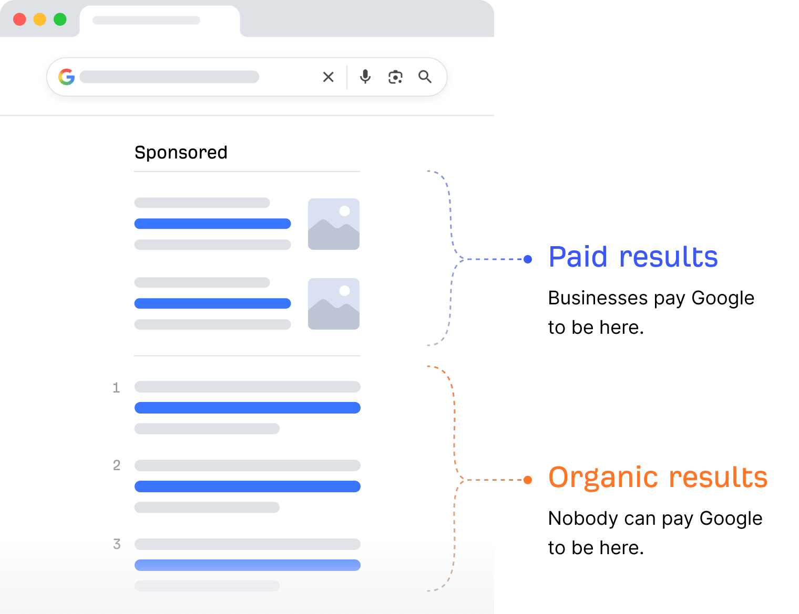
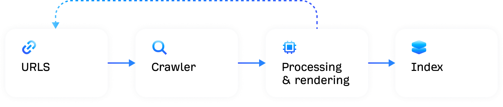
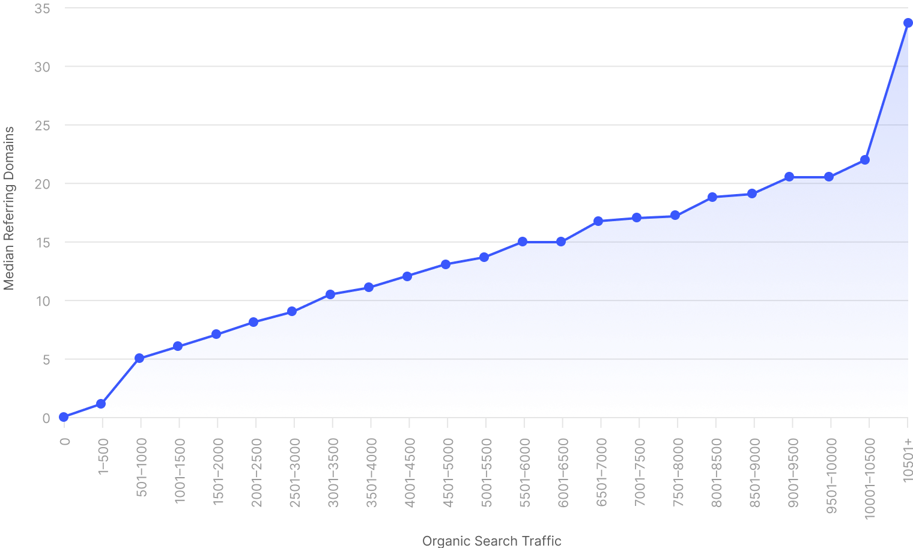
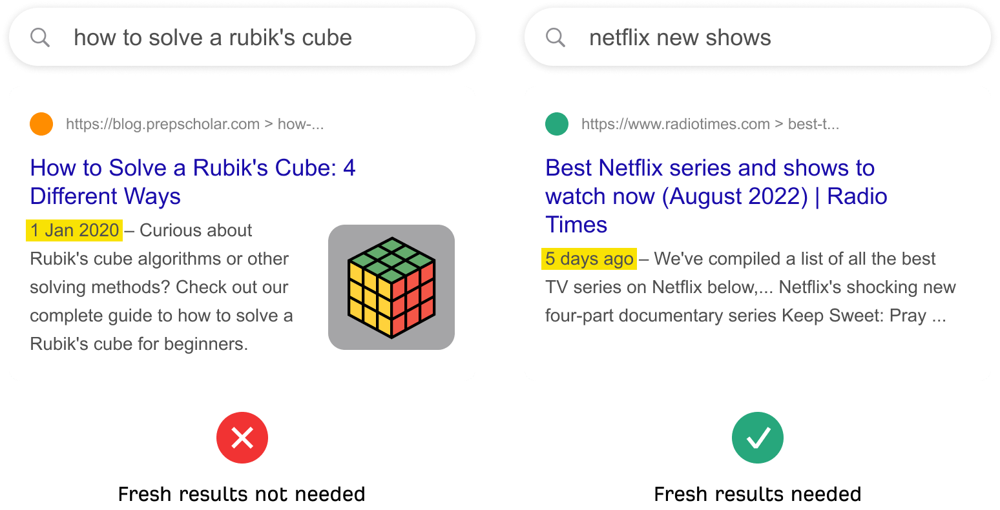
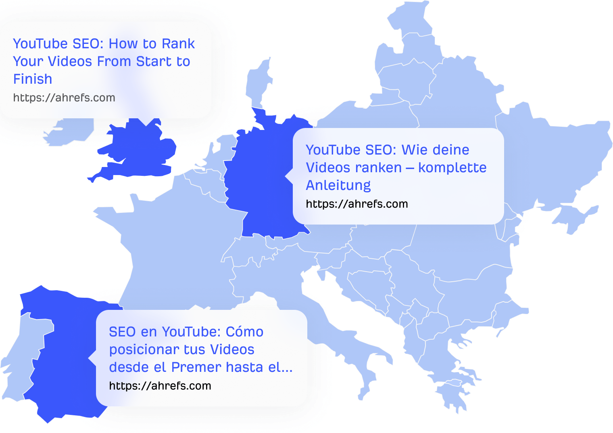

Title: 搜索引擎如何运作？初学者指南

URL Source: https://ahrefs.com/zh/seo/how-do-search-engines-work

Markdown Content:
搜索引擎通过使用网络爬虫抓取数十亿个网页来运作。这些爬虫也被称为蜘蛛或机器人，它们浏览网页并跟踪链接以查找新网页。随后，这些页面会被添加到索引中，搜索引擎乃至像 ChatGPT 这样的 AI 助手，都会从中提取结果。

理解搜索引擎的运作方式对于做好 SEO 至关重要。毕竟，如果你不了解某个事物的工作原理，就很难对其进行优化。

这就是您将在本指南中学到的内容。

* * *

第1部分

## 搜索引擎基础知识

首先，让我们来了解什么是搜索引擎、为何存在，以及如何盈利。

### 什么是搜索引擎？

搜索引擎是可搜索的网页内容数据库。它们主要由两个部分组成：

1

**搜索索引。** 一个存储网页信息的数字化资料库。

2

**搜索算法。**负责从搜索索引中匹配结果的计算机程序。

### 搜索引擎的目标是什么？

每个搜索引擎都旨在为用户提供最佳、最相关的结果。这也是它们获取市场份额的部分原因。

### 搜索引擎如何盈利？

搜索引擎有两种类型的搜索结果：

1

**来自搜索索引的自然搜索结果。**无法通过付费获得排名。

2

**通过付费广告获得的搜索结果**可通过付费获得排名。

每当有人点击付费搜索结果时，广告主就需要向搜索引擎支付费用。这就是所谓的按点击付费（PPC）广告，也正因如此，市场份额显得尤为重要。用户越多，就意味着广告点击量越高，收入也就越高。

搜索引擎通过广告盈利

* * *

第2部分

## 搜索引擎如何构建其索引

每个搜索引擎都有自己构建搜索索引的流程。下面是 Google 使用流程的简化版本。[1](https://ahrefs.com/zh/seo/how-do-search-engines-work#references)

Google 如何构建其搜索索引

下面我们来逐一剖析。

### 网址

一切都始于一份已知的 URL 列表。Google 会通过多种方式发现这些 URL，其中最常见的三种方式是：

*   **源自反向链接。**Google 拥有一个包含数千亿网页的索引。[2](https://ahrefs.com/zh/seo/how-do-search-engines-work#references) 如果有人从一个已知的页面链接到一个新页面，Google 就可以通过该链接找到它。 
*   **来自网站地图。** 网站地图会告诉 Google，用户认为网站上哪些页面和文件很重要。[3](https://ahrefs.com/zh/seo/how-do-search-engines-work#references) 
*   **来自 URL 提交。** Google 允许网站所有者在[Google Search Console](https://search.google.com/search-console/about)中请求对单个 URL 进行抓取。 

### 抓取

抓取是指一种被称为蜘蛛的计算机程序访问并下载已知 URL 的过程。Google 的抓取工具是[Googlebot](https://ahrefs.com/zh/blog/googlebot/)。[4](https://ahrefs.com/zh/seo/how-do-search-engines-work#references)

### 处理与渲染

处理是指 Google 理解并提取被抓取页面中关键信息的过程。为此，它必须渲染页面，也就是通过运行页面代码来了解页面在用户端的呈现效果。

除了 Google 内部人员，无人知晓这一过程的所有细节。但这并不重要。我们真正需要了解的是，它涉及提取链接以及存储内容用于建立索引。

### 索引

索引是指将抓取页面中已处理的信息添加到搜索索引中的过程。

搜索索引是用户在使用搜索引擎时所搜索的内容。像 ChatGPT、Claude 和 Gemini 这类 AI 助手也会利用搜索索引来查找网页。这就是为什么在 Google 和 Bing 等主流搜索引擎中被收录如此重要。只有进入索引，用户才能找到你。

您知道吗？

Google 占据 91.43% 的搜索引擎市场份额。由于它是大多数人使用的搜索引擎，因此能比其他搜索引擎为用户带来更多流量。[5](https://ahrefs.com/zh/seo/how-do-search-engines-work#references)

* * *

第3部分

## 搜索引擎如何对页面进行排名

发现、抓取和索引内容仅是整个流程的第一步。当用户进行搜索时，搜索引擎还需要一种方法来对匹配的结果进行排序。这就是搜索算法的职责所在。

### 什么是搜索算法？

搜索算法是用于从索引中匹配并排序相关结果的公式。Google 在其算法中运用了众多因素。

### Google 关键排名因素

没有人知道 Google 的所有排名因素，因为 Google 从未公开过这些信息。不过，我们确实知道其中一些关键因素。下面就让我们来看其中的几个。

#### 反向链接

反向链接是指从一个网站页面指向另一个网站页面的链接。它们是 Google 最重要的排名因素之一。[6](https://ahrefs.com/zh/seo/how-do-search-engines-work#references) 这或许解释了为何我们在对超过十亿个网页的研究中，发现链接域名与自然搜索流量之间存在显著的相关性。[7](https://ahrefs.com/zh/seo/how-do-search-engines-work#references)

引用域名与搜索流量之间的相关性

基于对 Ahrefs Content Explorer 索引中超过十亿个页面的研究。

不过，这并不完全取决于数量，质量同样重要。拥有[少量高质量反向链接](https://ahrefs.com/zh/blog/high-quality-backlinks/)的页面，其排名往往高于那些拥有大量低质量反向链接的页面。

#### 相关性

相关性是指某个搜索结果对搜索者的有用程度。Google 有多种方式来判断相关性。在最基础的层面，它会寻找包含与搜索查询相同关键词的页面。同时，它也会分析互动数据，以了解其他用户是否认为该结果有用。[9](https://ahrefs.com/zh/seo/how-do-search-engines-work#references)

#### 内容新鲜度

内容新鲜度是取决于查询结果的排名因素。对于需要最新结果的搜索，其影响更为显著。[9](https://ahrefs.com/zh/seo/how-do-search-engines-work#references) 这就是为什么搜索“新上线的 Netflix 剧集”时，会看到近期发布的结果位居首位，而搜索“如何解魔方”则不会出现这种情况。

内容新鲜度是取决于查询结果的排名因素

#### 页面速度

[页面速度](https://ahrefs.com/zh/blog/core-web-vitals/)是桌面端和移动端排名的考量因素。[10 11](https://ahrefs.com/zh/seo/how-do-search-engines-work#references) 但它与其说是一个正向排名因素，不如说是一个负向排名因素。这是因为它会对最慢的页面产生负面影响，而不是让极快的页面获得正面加成。

#### 移动端友好性

自 2019 年 Google 切换到[移动优先索引](https://ahrefs.com/zh/blog/mobile-first-indexing/)以来，移动端友好性一直是移动端和桌面端搜索的一个排名因素。[12](https://ahrefs.com/zh/seo/how-do-search-engines-work#references)

* * *

第4部分

## 搜索引擎如何对结果进行个性化处理

Google 会为每位用户定制搜索结果。它会利用诸如用户的位置、语言以及搜索历史记录等信息来实现这一点。[9](https://ahrefs.com/zh/seo/how-do-search-engines-work#references) 下面让我们更深入地了解一下这些因素。

### 位置

Google 会利用用户的位置信息，为具有本地意图的搜索提供个性化结果。这就是为什么搜索“意大利餐厅”的所有结果都来自本地餐厅或与本地餐厅相关。Google 知道您不太可能为了吃顿午餐而飞到地球另一端。

### 语言

Google 深知向西班牙语用户展示英语搜索结果毫无意义。因此，它会针对使用不同语言的用户，优先对本地化版本的内容（如果可用）进行排名。

Google 会针对不同语言对搜索结果进行排名

### 搜索历史记录

Google 会保存用户的操作记录和访问过的地点，以便提供更个性化的[搜索体验](https://ahrefs.com/zh/blog/search-experience-optimization/)。[13](https://ahrefs.com/zh/seo/how-do-search-engines-work#references) 您可选择退出，但多数用户可能不会这么做。
