Title: 关键词分析：Ahrefs 新手指南

URL Source: https://ahrefs.com/zh/seo/keyword-research

Markdown Content:
90% 的页面无法从 Google 获得自然搜索流量。所有那些辛苦、所有那些努力……换来的却是 _零_ 访问量。

但其实有一种方法可以避免这个问题，几乎可以保证相关人群能找到您的内容。

_关键词分析_。

关键词分析是一个发现有价值的搜索查询的过程：您的目标客户会在 Google 等搜索引擎中输入这些查询词，用来寻找产品、服务和信息。

关键词是 SEO 的基础。如果您发布的文章主题无人搜索，那么无论您多么努力，这篇文章都不会从 Google（或其他搜索引擎）获得任何流量。

许多网站所有者都会犯这个错误，这也是为什么根据 [我们的研究](https://ahrefs.com/zh/blog/search-traffic-study/)，互联网上有 90.63% 的页面无法从 Google 获得任何流量的原因之一。

90% 的页面无法从 Google 获得自然搜索流量

基于对 Ahrefs Content Explorer 索引中超过十亿个页面的研究。

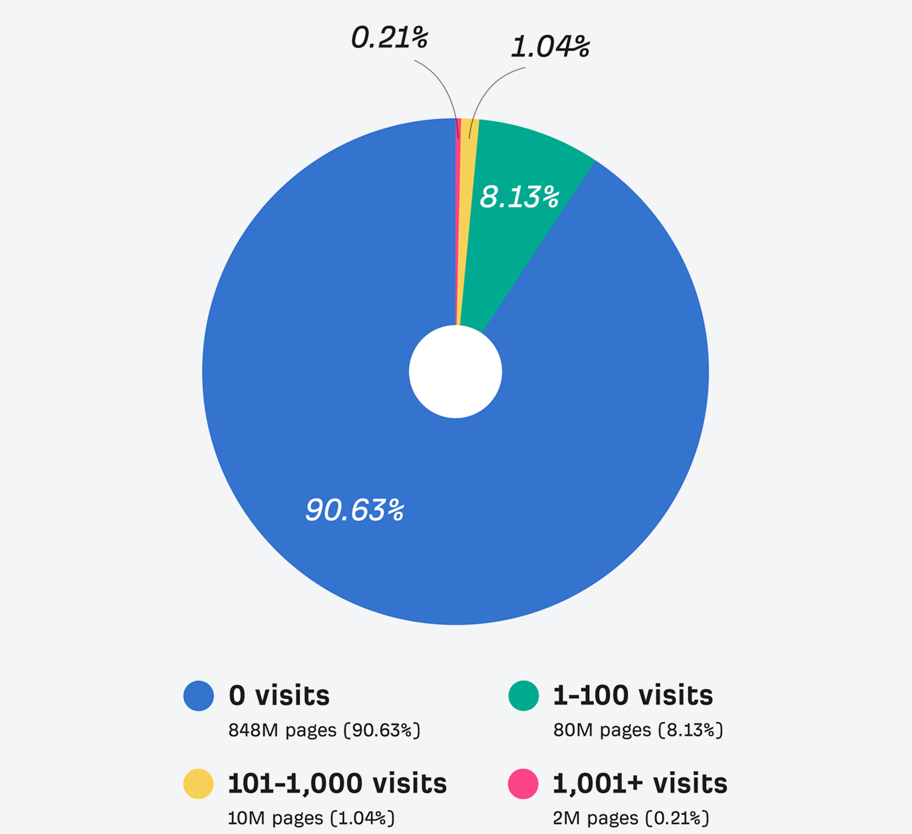

关键词分析能帮您确认：您想写的东西，确实有人在搜。因此，一旦您的页面在 Google 上把目标关键词排上去，就能持续收获源源不断的高度精准的访客。

关键词分析并不是什么高深学问。事实上，您大约 20 分钟就能学会其中的大部分。

但为了做出更好的 SEO 决策，您需要了解一些重要的注意事项和常见的误区。

那么，让我们直接进入正题。

[Video 3](https://www.youtube.com/watch?v=XfO6lmlxh0M)

* * *

第1部分

## 关键词分析入门

关键词分析首先要设身处地地站在客户的角度思考。他们可能会使用哪些词或短语来寻找解决问题的方案？

把这些输入到 Ahrefs 的 [Keywords Explorer](https://ahrefs.com/zh/keywords-explorer) 这类关键词分析工具中，您会在刚才头脑风暴的基础上，找到成千上万更多相关的关键词创意。

这是一个简单的过程，但要把它做好，您需要具备两样东西：

1

对所在行业有深入了解

2

了解关键词分析工具的工作原理

这就是本章的核心所在。

### 试试免费的关键词工具

有大量免费工具可以帮助您集思广益关键词创意。

开始时，每个关键词分析工具都会要求输入一个“种子关键词”，然后基于此生成海量的关键词创意列表。

如果您已经有产品或业务在手，找出种子关键词很容易。只需考虑人们在 Google 上输入哪些词语来寻找您提供的产品或服务。

例如，如果您销售咖啡及咖啡制作设备，那么您的种子关键词可能是：

*   咖啡

*   卡布奇诺

*   法压壶

*   nespresso

*   Etc

当您有了一些想法（不用过度纠结），把它们输入到 [**Ahrefs 免费关键词生成工具**](https://ahrefs.com/zh/keyword-generator) 中。

每输入一个种子关键词，都会获得 20 个相关关键词和 20 个相关问题（也就是说，已经获得了 _40_ 个关键词创意）。

它还会显示这些关键词的排名难度（简单、中等或困难），以及每月大致能获得多少搜索量。

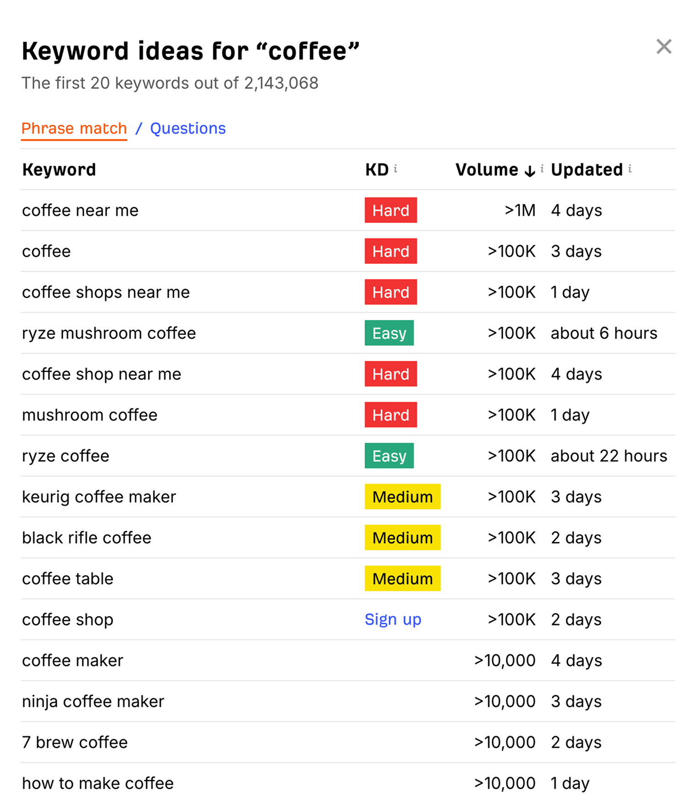

您可以根据需要多次执行此操作，适用于所有的种子关键词。

ChatGPT 也很有用。将您的种子关键词粘贴到 ChatGPT 中，并配上类似的提示词：_请为以下每个主题推荐 10 个简短的关键词创意：_

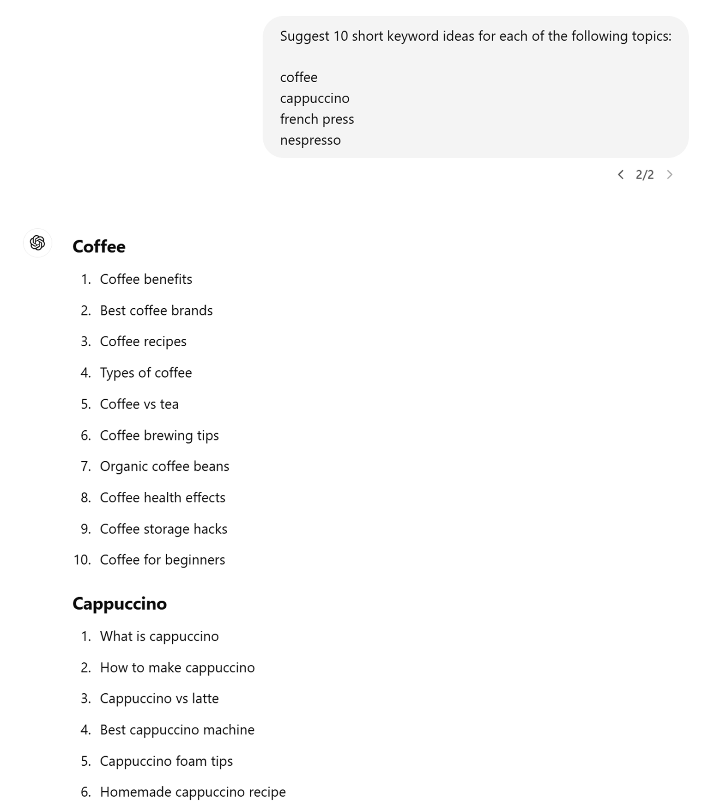

ChatGPT 的短板在于，它无法提供真实可靠的 SEO 指标，比如关键词难度或月搜索量。但它在集思广益、批量生成创意方面非常实用，便于结合 SEO 工具进行进一步分析。

还有其他一些 [免费的关键词分析工具](https://ahrefs.com/zh/blog/free-keyword-research-tools/) 也很有用（尽管它们也存在一些不足之处）：

*   [**Google Keyword Planner**](https://business.google.com/en-all/ad-tools/keyword-planner/) ——这是一款为希望在 Google 上投放广告的用户打造的工具。它可以提供关键词创意，但只有在您实际运行付费广告活动时，才会显示相关 SEO 指标。

*   [**Google Trends**](https://trends.google.com/trends/) —— 一个很棒的工具，用来挖掘热门新话题很酷，但不够细化：只能看到大的主题方向，找不到具体的关键词创意。

*   [**Answer the Public**](https://answerthepublic.com/) —— 利用 Google 的自动补全数据，向您展示用户搜索的相关关键词，但每天只能免费使用 3 次。 

当您真正认真想要提升网站的搜索流量时，记得注册 Ahrefs 并试用一下 [Keywords Explorer](https://ahrefs.com/zh/keywords-explorer)。选取一个种子关键词，让 AI 给您推荐一些关键词创意：

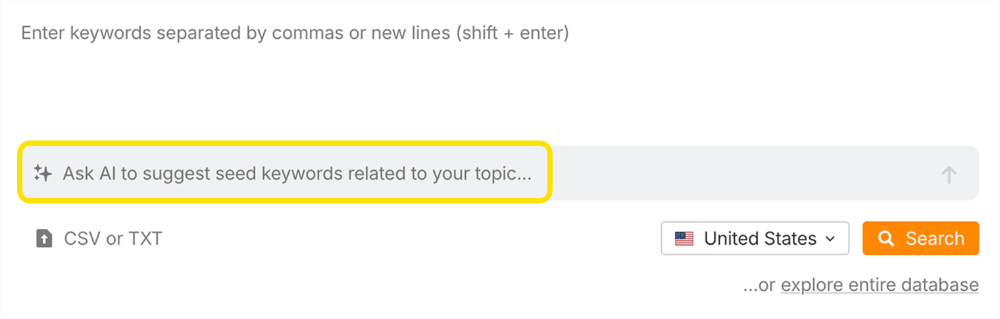

片刻之后，您就能得到 20 个额外的种子关键词，可用于开启搜索：

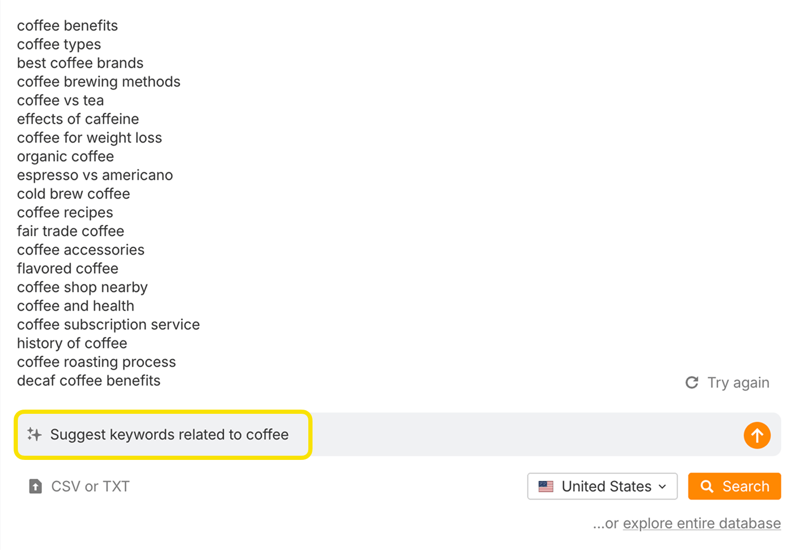

点击搜索按钮，然后进入词匹配报告，看看它给了我们多少关键词创意：

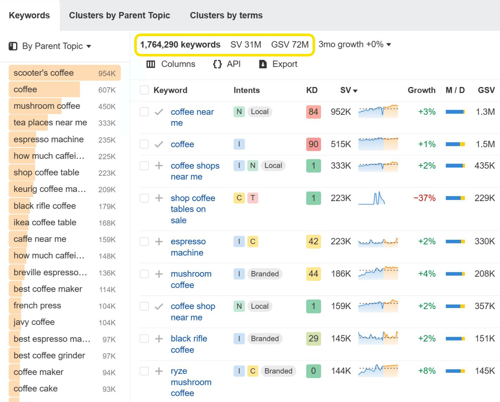

170万个关键词！没有任何免费工具能让您处理如此庞大的关键词创意资源。

这么多关键词，乍一看可能让人有点不知所措，确实挺多的。但别担心，您将在本指南的后面部分学到如何缩小范围。

### 查看您的网站已经获得排名的关键词

如果您 _已经_ 拥有一个网站，可以找到 _已经_ 获得排名的关键词。这对于拓展新的同类关键词创意，或优化现有页面以提升这些关键词的排名，都非常有帮助。

设置完成后，[Google Search Console](https://search.google.com/search-console/about) 将会展示您的网站当前获得排名并带来点击的一部分搜索查询词。

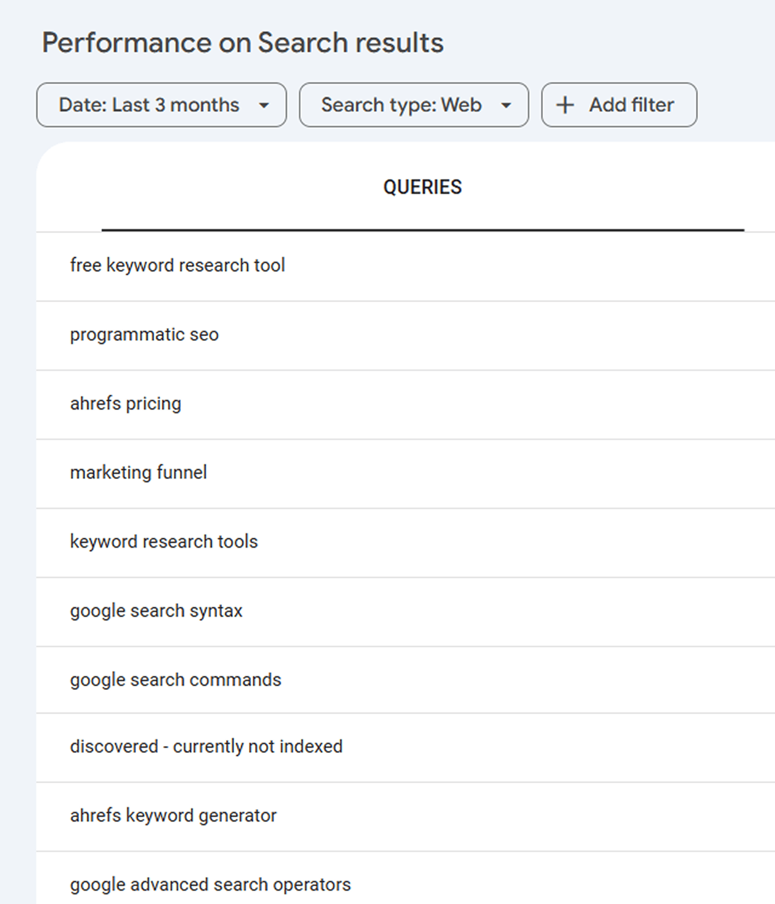

Search Console 的缺点在于它不会显示任何 SEO 指标。因此，即使您看到一个不错的关键词每月能带来一些点击，您也无法判断是否值得花精力去提升它的排名。

这个关键词的月搜索量是 10 次，还是 10,000 次？对您来说容易排名，还是难度太高根本不值得投入精力？Search Console 并不会告诉您这些。

但 [**Ahrefs 免费版**](https://ahrefs.com/zh/free)可以做到。这是我们的免费订阅方案，与 Google Search Console 非常相似。不过，Search Console 只会展示网站排名前 1,000 的关键词，而 Ahrefs 免费版会显示全部关键词。我们还会提供这些关键词的关键词难度评分以及月搜索量。

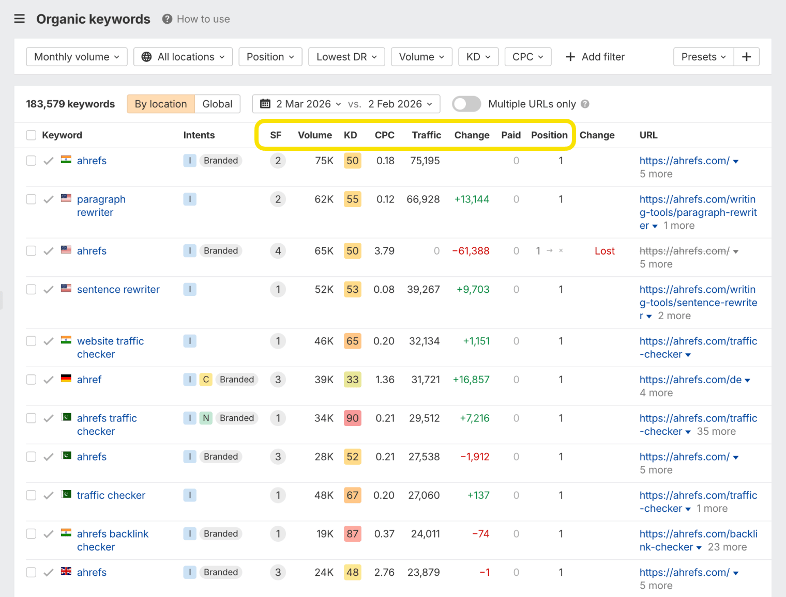

### 查看竞争对手的排名关键词

既然您已经看到了自己网站有排名的关键词……如果能看看您的 _竞争对手_ 有排名的关键词，是不是很酷？

使用 Ahrefs 就能轻松实现这一点。在 Google 中搜索您的一个种子关键词，看看首页排名的是哪些网站。

一旦您找到一个与您网站类似的竞争对手（例如您销售咖啡制作设备，对方也销售同类产品，而不是咖啡馆或星巴克这类商家），就可以将其网址输入到[竞争情报](https://ahrefs.com/zh/blog/competitive-intelligence/)工具（比如：Ahrefs [Site Explorer](https://ahrefs.com/zh/site-explorer) ）中，查看哪些页面为其带来了最多流量，以及这些页面所针对的关键词。

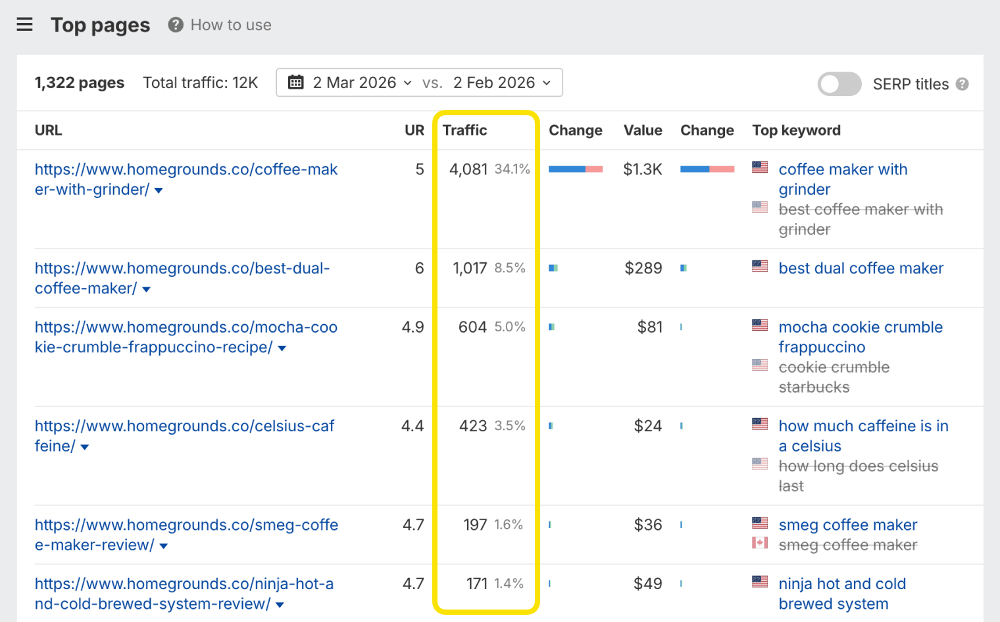

在针对几个竞争对手重复这一过程之后，您会发现自己已经得到了一份相当可观的相关键词列表。而其实，您的关键词分析才刚刚开始！

这些关键词创意是纯信息型（即博客文章），还是带有商业意图（即产品页面），我们将在关键词分析流程的后续阶段来判断。目前，您的目标是尽可能多地收集相关的关键词创意。

请务必针对尽可能多的竞争对手重复这一过程。我们在 [Site Explorer](https://ahrefs.com/zh/site-explorer) 中有一个非常实用的报告，可以帮助您发现更多竞争对手。它叫“竞争域名”，会根据您输入的网站与其他网站在 Google 上共同排名的关键词，展示与其相似的网站。

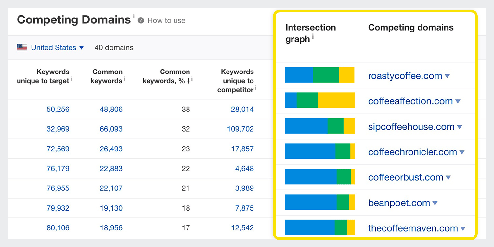

### 是不是发现有不少话题您早就做过了？

如果您在为一个成熟网站做关键词分析，可能会发现您已经覆盖了大多数竞争对手的关键词。这种情况下，您应该试试 Ahrefs 的 [内容差距机会](https://ahrefs.com/zh/content-gap)报告，在[Site Explorer](https://ahrefs.com/zh/site-explorer) 中可查看。

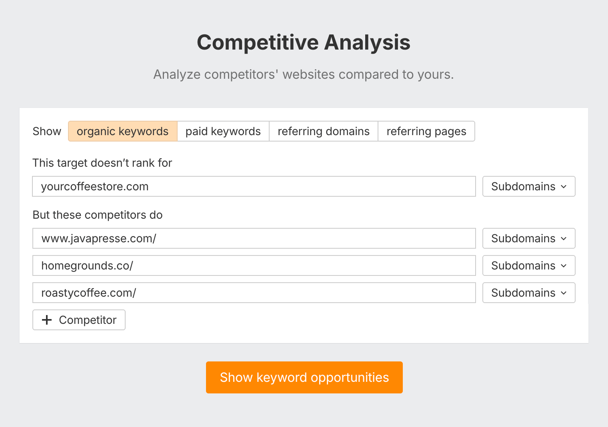

它可以帮您找到一个或多个竞争对手有排名、而您没有排名的关键词。

使用方法是：在顶部区域输入几个竞争对手的网站，然后在底部字段粘贴您自己的网站，并点击“显示关键词”。

想深入了解内容差距机会分析，请查看[此视频](https://www.youtube.com/watch?v=n-kxOhnSH-Q)。

### 研究你的细分领域

到目前为止，我们讨论的所有内容已经足以生成几乎无穷无尽的关键词创意。但与此同时，这个过程在某种程度上也会让您“局限在既有框架内”。那么，如何找到那些尚未被其他人涉足过的新话题呢？

您可以通过前往目标受众活跃的地方——行业论坛、社群以及问答网站——研究他们的讨论内容，从而解决这个问题。例如，这是我在 /r/coffee subreddit 中找到的一个讨论串：

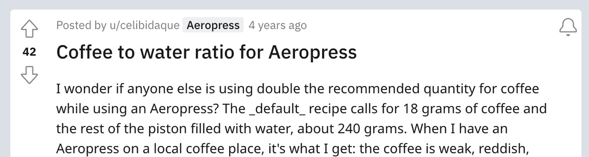

在[Keywords Explorer](https://ahrefs.com/zh/keywords-explorer)里随手一查，就找到了这个搜索词：_“aeropress coffee to water ratio（爱乐压咖啡粉水比）。”_

虽然月搜索量只有 150 次，但该话题在 Reddit 上获得了 42 个赞，这说明人们很重视这类知识。此外，这个 Reddit 讨论串的内容也可以为我未来的内容创作提供基础。

除了浏览行业论坛之外，您的现有客户也是获取关键词创意的一个重要来源。

所以，下次与您的受众交流时，记得留意他们使用的措辞以及常提出的问题。这可能会为您的网站带来一些独特的关键词创意。

* * *

第2部分

## 关键词类型

前面我们已经聊过了种子关键词。随着关键词分析的逐步深入，你需要了解其他将会遇到的关键词“类型”，这一点同样很重要。

如果将种子关键词输入到诸如 Keywords Explorer 这类工具里，就可以选择查找相关关键词。这些关键词通常分为两类：_词匹配_ 和 _相关术语_。具体如下：

### 词匹配

这些是与种子关键词中的 _词_（即具体用词）相 _匹配_ 的关键词创意。Keywords Explorer 中的“词匹配”报告包含两种模式：“词匹配”与“短语匹配”。

“词匹配”会展示包含种子关键词中所有词的关键词创意，无论这些词语具体出现在什么位置，也不论它们的顺序如何。因此，如果我们的种子关键词是“咖啡机”，我们就会得到以下关键词创意：

*   **咖啡**自动售货**机**

*   **machine** gun kelly **咖啡**店

“短语匹配”只会返回那些包含种子关键词，并且词序与输入时完全一致的关键词创意。例如：

*   最佳**咖啡机**

*   带研磨功能的**咖啡机**

### 相关词

_相关_ 词是指与种子关键词存在关联、但不一定包含种子关键词本身的关键词创意。该功能包含两种模式：“同时排名”和“同时提及”。

*   “同时有排名的词”会向您展示：针对您的种子关键词，排名靠前的页面还同时获得排名的其他搜索查询词。

*   “同时提及的”会展示在种子关键词排名靠前的页面中经常被提及的词语和短语。

### 关键词集群

到目前为止，您可能已经积累了成千上万的关键词创意。但您大概率并不想为这些关键词分别创建上千个页面，因此可以使用一种称为关键词聚类的方法来简化关键词列表。

假设你的列表中包含以下关键词：

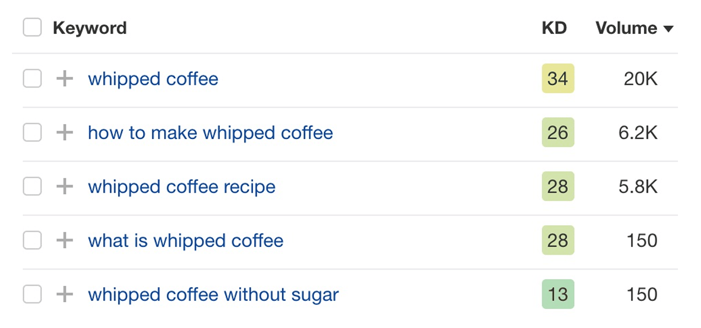

我们来对比一下关键词 _”奶泡咖啡”_ 和关键词 _”奶泡咖啡配方”_ 的搜索结果：

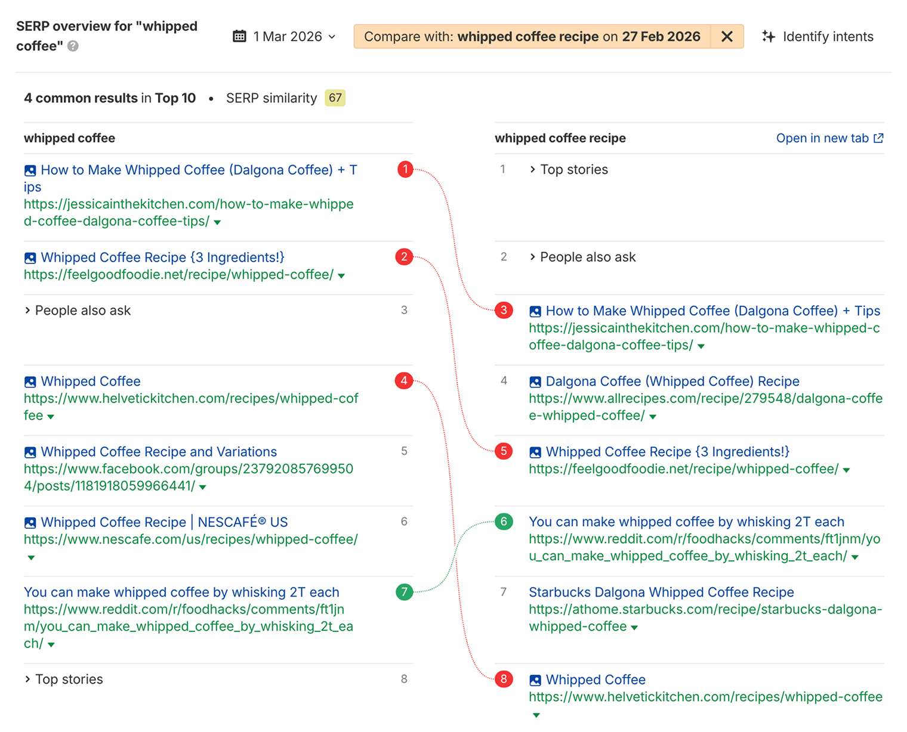

这两个关键词排名靠前的页面几乎一模一样。这意味着，Google 将搜索词 _“whipped coffee recipe”_ 视为更宽泛的搜索词 _“whipped coffee”_ 的一个子话题。因此，你可以用一个页面同时为这两个关键词获得排名。

将相关关键词归类在一起的过程称为 _聚类_。在 Ahrefs 中，我们创建了一个名为[父主题](https://ahrefs.com/academy/how-to-use-ahrefs/keywords-explorer/related-terms)的指标，几乎可以瞬间将这些相关关键词归类在一起。

只需将关键词创意添加到 [Keywords Explorer](https://ahrefs.com/zh/keywords-explorer) 中，进入“按父主题聚类”标签页，就会看到关键词被分组到各个聚类中：

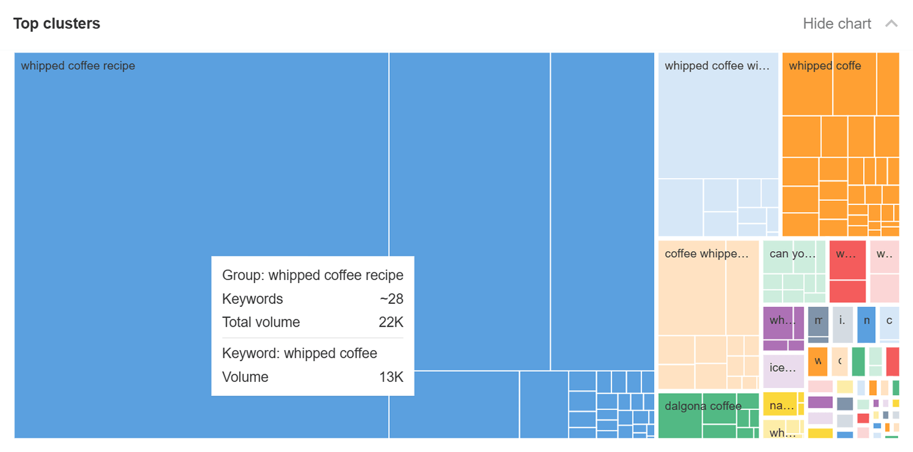

这里我们可以看到 28 个不同的关键词，它们都属于“奶泡咖啡配方”这个关键词集群。很有可能我们只需发布一篇高质量的奶泡咖啡配方指南，就能在所有这类关键词上都获得不错的排名。

按父主题进行聚类的一大优势在于速度——几乎是瞬间完成的。但也存在其他聚类方法，比如 _关键词聚类_，这种方法是根据共同的关键词或短语来分组，而非依据搜索结果的相似性。更多内容可参阅我们的[关键词聚类指南](https://ahrefs.com/zh/blog/keyword-clustering/)。

### 关键词意图

关键词具有不同类型的 _意图。_ 有些关键词是那些准备购买某类产品或服务的人搜索的，这类关键词被称为 _商业型_ 或 _交易型_ 关键词。

*   最好的速溶咖啡

*   cuisinart 咖啡机

*   带储物功能的咖啡桌

还有一些关键词属于 _信息型_ 意图，搜索这类词的用户只是想了解或学习某个知识。

*   咖啡中含有多少咖啡因

*   咖啡蛋糕配方

*   咖啡对健康有益吗

有时，人们只是想找到某个特定的网站或地点，这被称为 _导航型_ 意图。

*   我附近的咖啡店

*   stumptown coffee

*   免下车咖啡

关键词也可以分为 _品牌型_ 和 _非品牌型_，例如“星巴克咖啡”与“黑咖啡”。

理解这些搜索意图可以帮助您判断需要创建哪种类型的内容，并确定某个关键词是否真的值得去优化。

信息型关键词可能更适合一些科普型博客内容，而商业型关键词则可能需要产品着陆页，让访客能够真正 _购买_。

您可以通过查看搜索结果来判断关键词的搜索意图。以“家庭咖啡烘焙”为例，搜索结果中既有销售烘焙设备的商品页（商业意图），也有 Reddit 上关于在家烘焙咖啡豆的讨论帖（信息意图）：

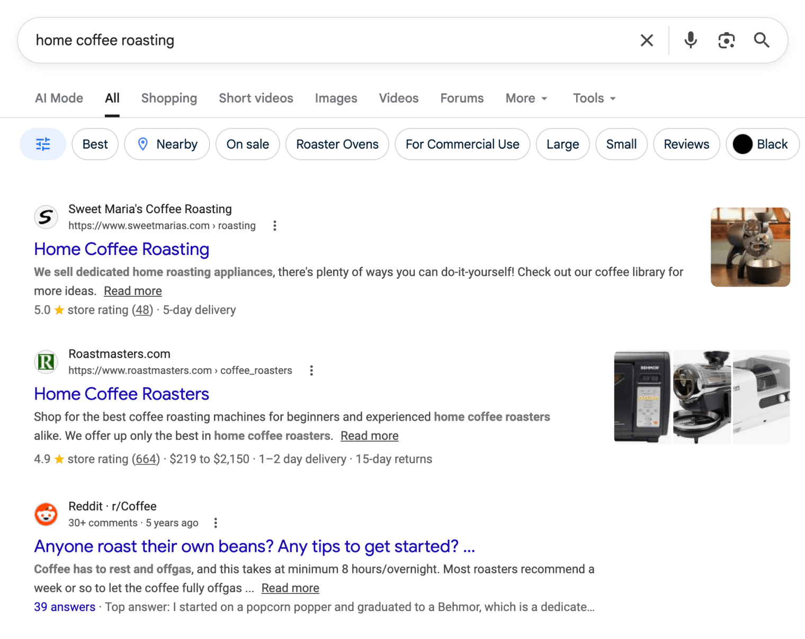

Keywords Explorer 支持一次性查看数百个关键词的搜索意图，并通过筛选快速找出符合你目标意图的关键词：

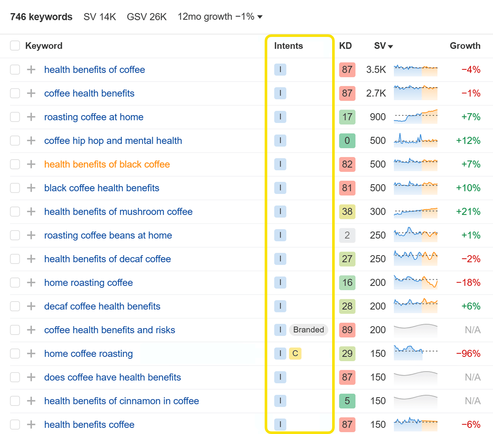

* * *

第3部分

## 关键词 SEO 指标解析

能获取数以百万计的关键词创意固然是好事。但如何判断哪些才是最佳选择？毕竟，纯靠人工逐一筛选几乎是不可能完成的任务。

解决方案很简单：在将关键词加入列表之前，先利用 SEO 指标缩小范围，分清主次，去粗取精。

让我们来看看可以用来实现这一点的六个关键词指标。

关键词 SEO 指标的类型

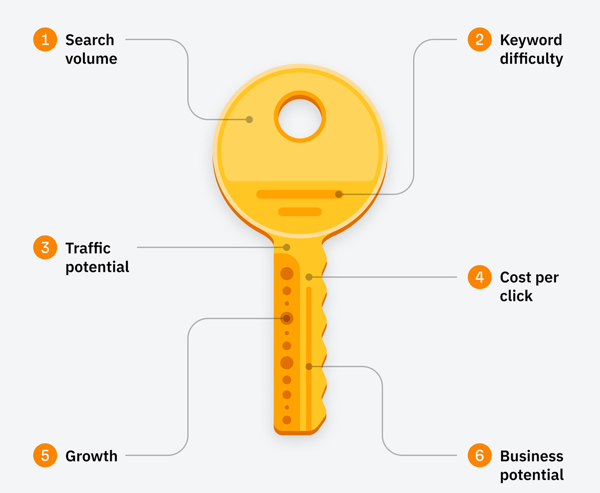

### 搜索量

搜索量指的是一个关键词每月被搜索的平均次数。例如，_“唐纳德·特朗普”_ 仅在美国的月搜索量就达到了 310 万次。

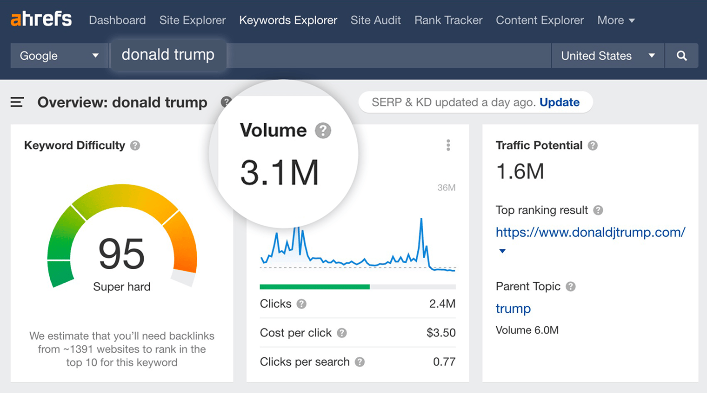

关于搜索量，有几个重要的点需要了解：

*   **这里指的是搜索次数，而不是搜索人数**——有些情况下，同一个人可能在一个月内多次搜索同一个关键词（例如 _“新加坡天气”_）。所有这些搜索行为都会计入该关键词的搜索量。

*   **它并不等于为该关键词排名后能获得的访问量**——即使成功排到第 1 名，来自该关键词的流量也很少会超过其搜索量的 30%。而且这还算是运气不错的情况。

*   **这是一个年平均值**——如果某个关键词在 12 月有 12 万次搜索，而当年其余 11 个月的搜索量为零，那么它显示的月均搜索量将是 1 万次（12 万 ÷ 12 个月）。

*   **这取决于国家/地区**——关键词工具通常会显示所选国家的搜索量。但其中一些工具也提供查看全球搜索量的选项，即所有国家/地区搜索量的总和。

几乎所有的关键词分析工具都会提供搜索量筛选功能，让您能够聚焦于特定热度范围内的关键词创意。该功能主要有两大用途：

*   **过滤掉超高搜索量的关键词**——如果您的网站是新的，那么您可能不想把时间浪费在那些月搜索量超过 1 万的关键词上，因为这些关键词对您来说很可能竞争过于激烈。

*   **专门筛选较低搜索量的关键词**——也许你想找一些竞争小、搜索量低的关键词，这样可以轻松获取一些流量。这类词通常被称为“[长尾关键词](https://ahrefs.com/zh/blog/long-tail-keywords/)”。

长尾关键词在 SEO 领域可谓家喻户晓，但却常常被忽视。大部分人只有在关键词的月搜索量达到至少上百次时才会考虑布局，更不用说那些搜索量显示为零的关键词了。

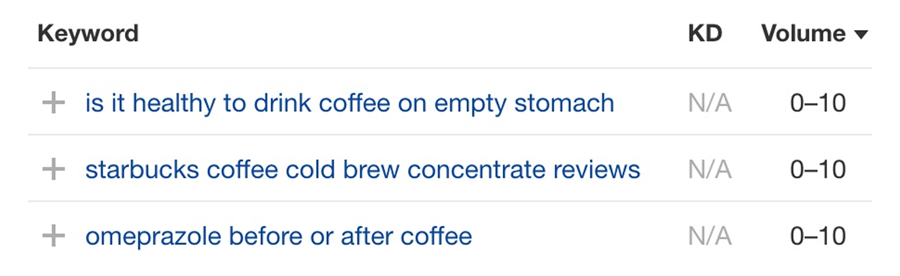

这类[“零搜索量”关键词](https://ahrefs.com/zh/blog/zero-volume-keywords/) ，即使获得排名，每个月也只能带来少量访客。但关键在于，它们具有累积效应！如果您发布上百篇内容来针对这类关键词，年度总流量实际上可能会累积到数千名高度精准的访客。

忽视低搜索量的关键词是新手常犯的错误。这些关键词与那些更热门的关键词同样有用，甚至往往更有用，因为它们更具针对性，且通常具有较高的商业价值。

关于搜索量，另一个需要记住的重要点是，不同工具之间的数值可能会略有差异。这是因为每个工具计算和更新此指标的方式不同。

总而言之，搜索量是 SEO 中一个极其重要的指标。因此，我强烈建议您阅读我撰写的[这篇专题文章](https://ahrefs.com/zh/blog/keyword-search-volume/)。

### 流量潜力

以下两个关键词在美国的搜索量几乎相同：

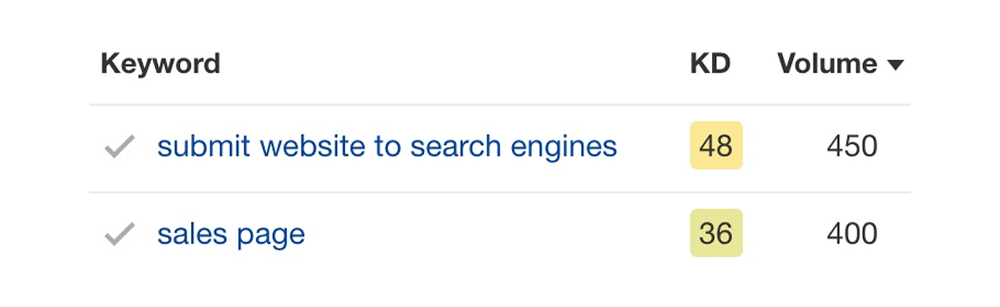

这意味着，针对它们各自所能获得的搜索流量应该也几乎一样，对吧？其实并不完全是这样。

我们以这些关键词的排名靠前页面为例，对比它们在美国获得的搜索流量。只需将这些页面的 URL 复制到 Ahrefs 的[Site Explorer](https://ahrefs.com/zh/site-explorer)中，即可轻松完成。

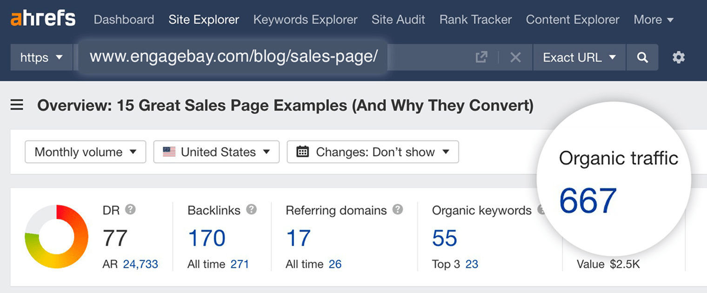

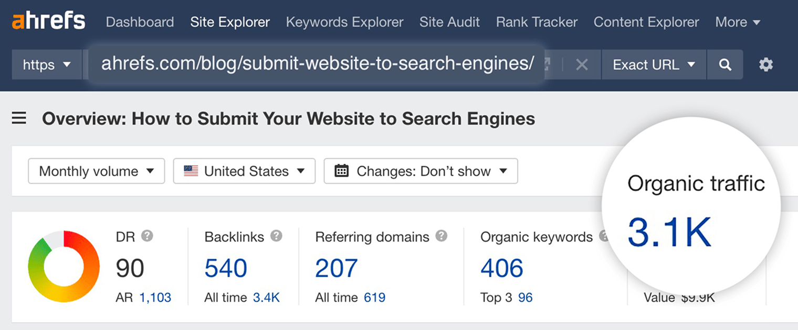

结果发现，其中一个页面的搜索流量实际上比另一个页面高出近 5 倍。这怎么可能呢？

实际上，网页在 Google 中排名并不只依赖单个关键词。仔细观察上面的两张截图，就会发现，_“销售页面”_ 的关键词排名第一的页面，在 Google 中共计对 55 个关键词有排名；而 _“向搜索引擎提交网站”_ 这个关键词排名第一的页面，在 Google 中共计对 406 个不同的关键词实现了排名。

以下是其中的一部分（如**自然搜索关键词**报告所示 [Site Explorer](https://ahrefs.com/zh/site-explorer)）：

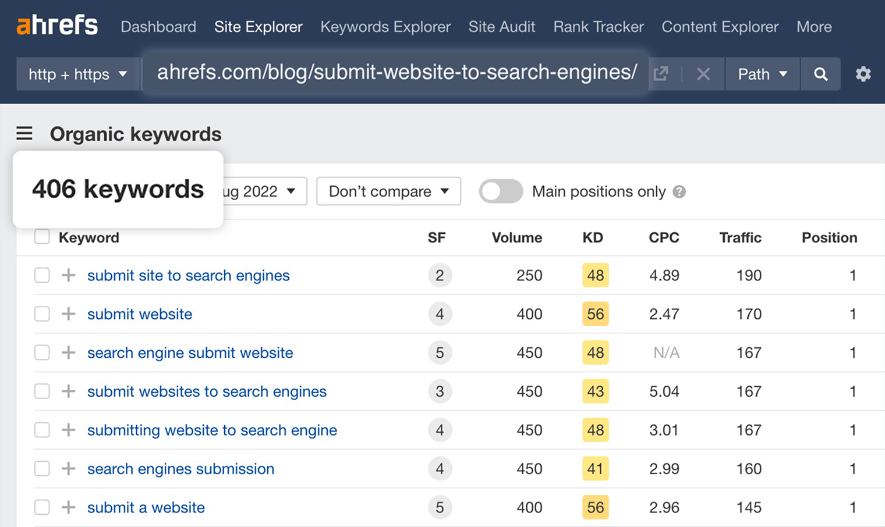

无论您脑海中想搜索的是什么，不同的人可能会用不同的表述方式，但本质上是在寻找相同的内容。Google 足够智能，能够理解这一点，因此会让同一个页面在所有这些相似的搜索查询中获得排名。

[我们曾对这一“现象”进行过研究](https://ahrefs.com/zh/blog/also-rank-for-study/)，结果发现通常情况下，排名靠前的页面还会同时在近千个相似关键词上获得排名。

这意味着，在估算页面如果针对某个关键词获得排名后能带来的搜索流量时，不应该盲目依赖该单一关键词的搜索量。相反，需要分析该关键词当前排名靠前的页面，查看它们通过所排名的所有关键词变体一共获得了多少搜索流量。

在 Ahrefs，我们认为这是分析关键词时需要考虑的重要因素，因此我们开发了一个专门的指标来解决这个问题。

这个指标叫作“流量潜力”，用于展示关键词排名第一的页面获得了多少搜索流量。

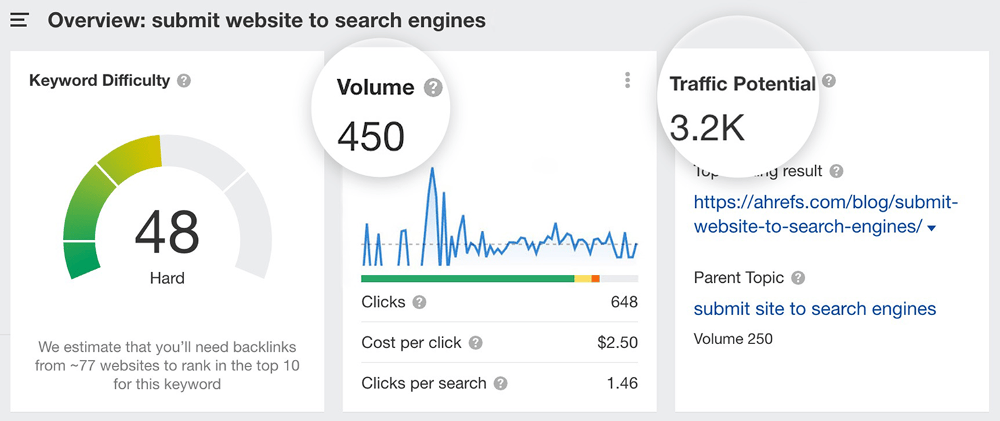

在 Ahrefs 的[Keywords Explorer](https://ahrefs.com/zh/keywords-explorer)中，流量潜力指标就显示在搜索量旁边。这让你无需再单独查询该关键词排名第 1 的页面及其总搜索流量，从而节省大量时间。

不过，搜索量和流量潜力这两个指标都是针对特定国家的。因此，如果需要评估某个排名靠前页面的全球搜索流量，就需要在 [Site Explorer](https://ahrefs.com/zh/site-explorer) 中选择“所有国家/地区”模式。

### 关键词难度

经验丰富的 SEO 专业人士通常会手动评估每个关键词的排名难度。也就是查看每个关键词的搜索结果并进行分析。他们会综合考虑许多不同的因素，以判断该关键词的排名是困难还是容易：

*   搜索意图

*   内容深度、相关性、内容新鲜度、权重

*   反向链接的数量（及质量）

*   域名评分

*   SERP 特性

*   等等

这个过程因人而异，对于哪些因素重要、哪些不重要，并没有一个明确共识。

有人可能认为域名评分很重要，而另一些人可能觉得相关性更关键。

观点也可能因他们分析的搜索查询类型而不同，因为对于不同类型的查询，Google 会优先考虑不同的因素。

所有这些，都让 SEO 工具开发者们的工作变得有些棘手，因为他们试图将复杂而精密的排名难度概念，提炼成一个简单的两位数。

但在与众多专业 SEO 从业者交流了关于“可操作的关键词难度评分（KD）”应该纳入哪些信号后，我们发现至少有一点是大家的共识：反向链接对于排名非常重要。

因此，我们最终决定基于指向排名前 10 页面的独立网站数量来计算关键词难度 (KD) 评分。

Ahrefs 的关键词难度评分体系

要使某个关键词进入前 10 名，需要多少个引用域名

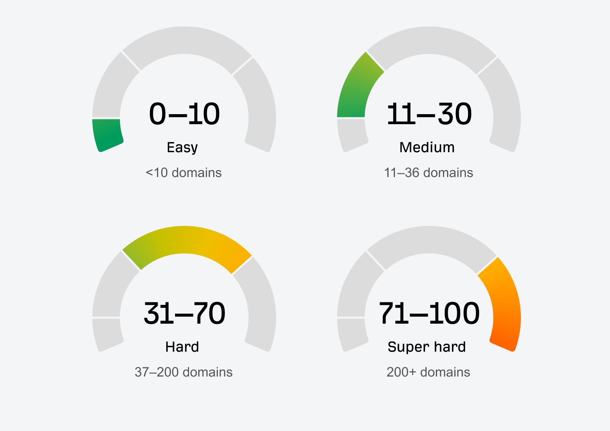

正如上图所示，KD 与您的页面想要进入前 10 名所需的预计可链接网站数量有关。

明白了吗？这个数字并不是排名第一所需的预估可链接网站数量，而是进入前十所需的预估数量。冲到第一完全是另一场战斗。

许多人在使用关键词难度（KD）指标时存在误区，把筛选范围设为 0 到 10，只关注于简单的关键词创意。下面说明了为什么避开高 KD 关键词可能是个错误：

1

**您应该尽早而不是延后去布局高 KD 关键词**——因为要在高 KD 关键词上获得排名，需要大量反向链接，这通常需要投入大量时间和资源。因此，尽早创建页面并开始推广，往往更有价值。

2

**将高 KD 关键词视为获取链接的机会**——某些关键词的排名靠前页面拥有大量反向链接，这本身就表明该主题“值得被链接”。若您能围绕该主题创作出原创内容，便极有可能吸引大量网站主动链接。

核心要点是：KD 的存在并不是用来阻止去优化某些关键词，而是帮助您理解为了在某个搜索查询中获得排名需要付出什么（以及特定主题的“可获取链接价值”）。

请记住，在确定要优化某个关键词之前，始终要进行手动评估，不要仅凭任何工具的难度分数来做最终决定。没有任何一个单一的指标能将 Google 排名算法的复杂性提炼成一个数字。要警惕那些暗示可以做到这一点的工具开发者。

### 每次点击费用（CPC）

每次点击费用（CPC）显示广告主愿意为某个关键词在搜索结果顶部展示的广告点击支付多少钱。它更像是广告主使用的指标，而非 SEO 的指标，但它可以作为衡量关键词价值的一个有用替代指标。

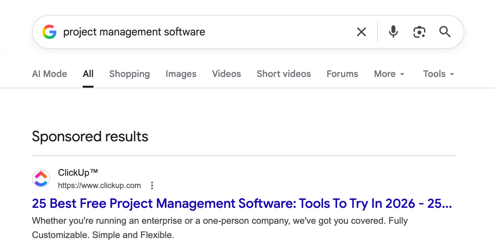

例如，关键词“project management software”的 CPC 高达 30 美元。这是因为搜索该词的用户往往是在寻找可购买的产品。

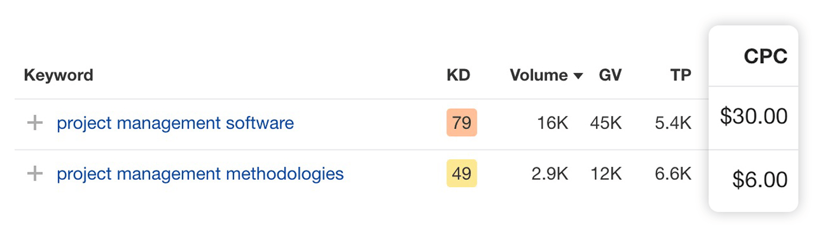

但 _“project management methodologies”_ 的情况则完全不同。这显然是一个信息型搜索词，向这些用户销售你的项目管理软件的几率没有那么高，因此它的 CPC 要低得多，仅为 6 美元。

关于 CPC，有一点很重要：它的波动性远高于搜索量。虽然大多数关键词的搜索需求在每个月之间基本保持稳定，但其 CPC 却可能随时发生变化，因为会有越来越多的公司针对这些关键词投放广告。

这意味着，在各类 SEO 工具中显示的 CPC 值只是某个时间点的快照，并非特别精确。若需获取实时 CPC 数据，建议使用 AdWords。

### 增长

由于搜索量是年度平均值，它往往会在预测某个搜索查询未来的搜索需求时产生误导。

Notebook LM 是一种可以将文本转化为播客音频的 AI 模型，其 12 个月的平均搜索量为 73,000。但这个平均值来自许多搜索量为零的月份，以及少数几个超过 40 万次搜索量的月份。

在这种情况下，平均值低估了未来几个月的可能搜索量：

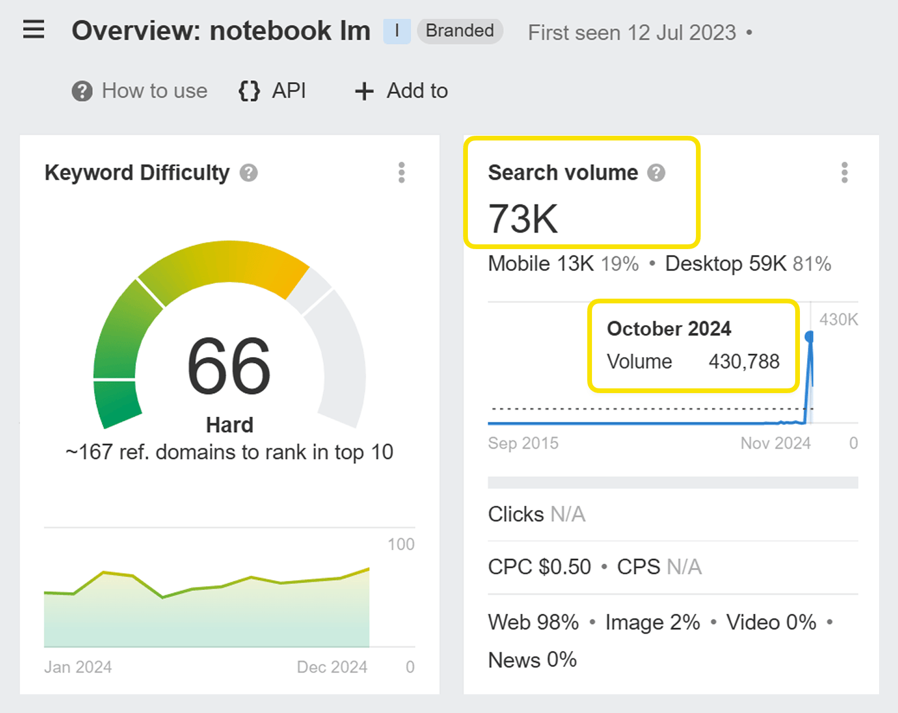

再比如像“黑色星期五”这样的季节性关键词。其平均搜索量显示为 282,000，但这个平均值是由许多搜索量 _较低_ 的月份（大多数月份约为 50,000）以及一个搜索量 _极高_ 的月份（例如 2024 年 11 月达到 250 万次搜索）共同计算得出的：

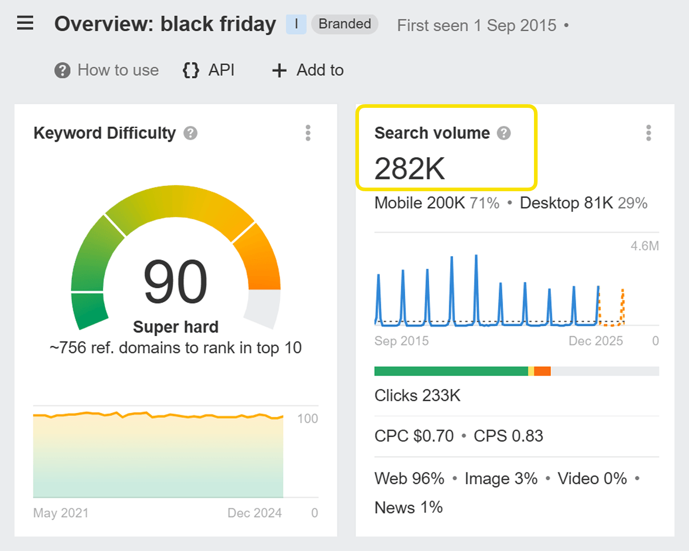

任何关键词的搜索量都会随时间变化，如果能提前布局那些目前搜索量不高、但已呈现出上升趋势的关键词，往往能获得实实在在的收益。

通过 Keywords Explorer 中的“增长”指标轻松找到这些趋势关键词。只需输入关键词，然后按“增长”列排序，就能找出越来越受欢迎的主题（例如“蘑菇咖啡的健康益处”）或者热度在下降的主题（例如“家庭咖啡烘焙”）。

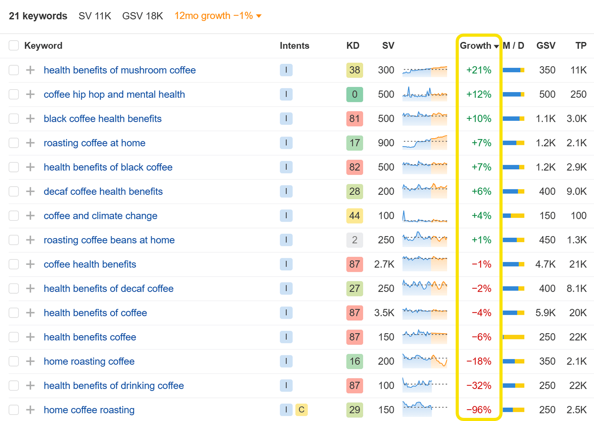

### 商业潜力

给关键词列表排优先级，并决定应该先把精力投入到哪里，可能是整个关键词分析流程中最不直观、也最“个性化”的部分。需要考虑的事情实在太多：

*   这个关键词的预估流量潜力是多少？

*   关键词排名难度如何？竞争对象有哪些？

*   如何打造一个完美的页面？或者你可能已经拥有一个页面，但还需要进一步优化？

*   这个关键词的商业价值是什么？为它获得排名能为您带来什么收益？

最后一点尤其重要。虽然搜索量、流量潜力、排名难度和搜索意图都是重要的考量因素，但还需要评估针对该关键词排名对您的业务价值有多大。

在 Ahrefs，我们开发了自己的一套方式来判断关键词的商业价值。

我们称之为“商业潜力”，这是一个从 0 到 3 的简单评分，表示针对某个关键词进行产品推介时的难易程度。

商业潜力

| #### 分数 | #### 这意味着什么 | #### 例子 |
| --- | --- | --- |
| 3 | 我们的产品是解决该问题不可替代的方案。 | _“如何查看竞争对手的反向链接”_——因为如果没有像 Ahrefs 这样的工具集，很难做到这一点。 |
| 2 | 我们的产品对此有一定帮助，但并不是解决该问题的关键。 | _”SEO 技巧”_——因为有些技巧没有我们的产品就无法实现，而另一些则不需要。 |
| 1 | 我们的产品只能被简短提及。 | _“营销创意”_——因为 SEO 只是众多营销创意中的一种，而 Ahrefs 正是在这方面提供支持的工具。 |
| 0 | 完全无法在内容中提及我们的产品。 | _”社交媒体营销”_——因为那不是 Ahrefs 能帮上忙的事情。 |

如果您销售的是 Aeropress（爱乐压）配件，像“爱乐压滤纸”这类关键词就具有非常高的商业潜力评分。反之，像“stanley thermos（史丹利保温杯）”这类关键词评分就很低：尽管它与咖啡相关，但与您的业务并无直接关联。

一般来说，优先选择在商业潜力评分中为 2 或 3 的主题是一个不错的策略。这些主题最有可能为网站带来潜在客户——而这正是关键词分析和 SEO 的最终核心目标。

当我们对 Ahrefs 网站上的所有博客文章进行分类时，其中的 77% 在商业潜力评分中获得了较高分（2 或 3）：

按商业潜力评分划分的文章数量

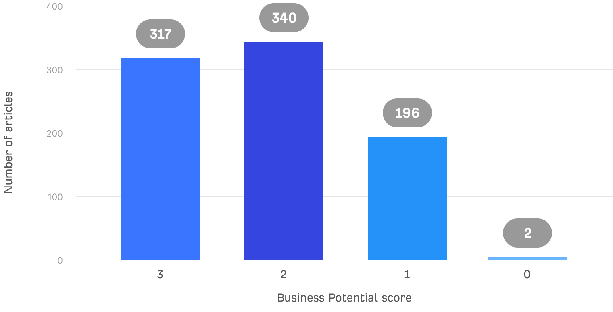

（而且如你所见，我们几乎没有商业潜力为 _零_ 的博客文章。）

* * *

第4部分

## 如何对关键词进行优先排序

那么……您应该先从哪些关键词入手呢？

遗憾的是，这个问题并没有一个简单直接的答案。正如 SEO 从业者常说的那样：“要视情况而定”。

*   您是在做一个全新的网站，还是已经有一定基础的成熟网站？

*   您是唯一的营销人员，还是在管理一个大型团队？

*   您的职责是直接推动实际转化，还是为销售团队提供新的潜在客户？

*   您需要多快看到成效？

关键词分析，本质上是在你所处的独特业务场景与一系列指标及概念之间进行权衡，包括我们刚刚提到的：流量潜力、关键词难度、商业潜力以及搜索意图。

在某些情况下，你的目标是尽可能快地获取大量流量，这就需要找到那些高搜索量、低难度的关键词。而在另一些时候，你可能需要专注于线索获取或转化，这时商业潜力就成为了最值得关注的核心指标。

关键词分析并非寻找“容易获得排名”的关键词，而是找出与你的业务最相关、最具价值的关键词。

同时，你还应该制定短期、中期和长期的排名目标。如果只关注短期目标，你将永远无法在那些最具价值的关键词上获得排名；反之，如果只关注中长期目标，则可能需要多年时间才能看到流量。
