Title: SEO 链接建设：新手入门指南

URL Source: https://ahrefs.com/zh/seo/link-building

Published Time: Tue, 21 Jul 2026 02:17:30 GMT

Markdown Content:
你来到这里，是因为你需要链接。

你可能已经听说过，链接（或反向链接）有助于提升网站在 Google 中的排名。现在，你需要学习如何获取它们。

嗯……我们 (Ahrefs) 为专业的链接建设人员开发工具已有 10 多年了，可以说在链接建设方面颇有心得。

在这篇指南中，我们汇集了最精华的知识，并尝试用通俗易懂的方式解释链接建设的所有细节，以便你能轻松地将我们的建议付诸实践。

但在开始深入探讨之前，这里有几个 先行 洞察，帮你快速进入状态：

*   如果你的网站是全新的，建议先建立几十条基础链接。

*   在向网站所有者请求链接之前，先建立一定的前期关系会大有帮助。

*   人们更愿意链接到那些有趣且实用的网页。如果你的页面平庸无奇，想要获取链接将会困难重重。

*   来自权威网站相关页面的链接，对你在 Google（以及其他主要搜索引擎）中的排名影响最大。

* * *

第1部分

## 链接建设基础知识

你可以把链接想象成投票。当其他网站链接到你的页面时，就等于告诉 Google 你的页面具有某种重要性。这正是 Google [PageRank 算法](https://ahrefs.com/zh/blog/google-pagerank/)的核心逻辑。

因此，一个页面拥有的[高质量反向链接](https://ahrefs.com/zh/blog/high-quality-backlinks/)越多，它在 Google 中的排名往往就越高。如果你想让自己的页面超越竞争对手，通常需要获得比它更多的链接。

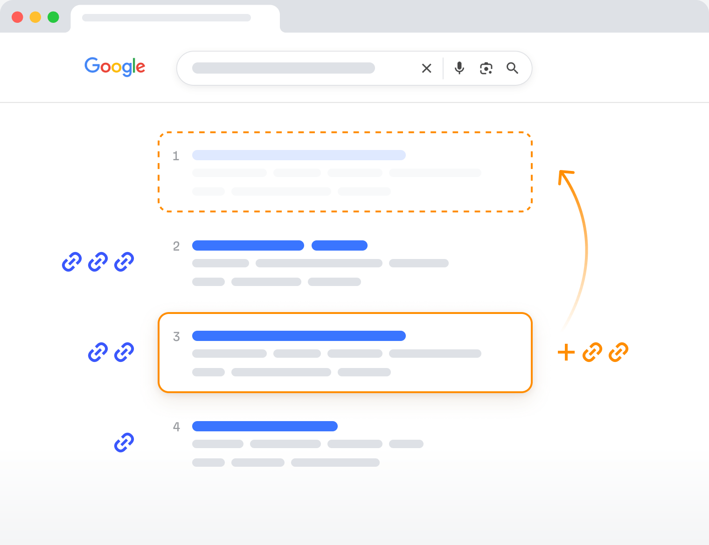
反向链接有助于页面在 Google 搜索结果中获得更高排名。

当然，这里是对情况进行了较大程度的简化。想要在 Google 排名第一，远不只是“获取更多链接”这么简单，因为链接并不是 Google 使用的唯一排名信号。但不可否认的是，它仍然是一个[非常强的信号](https://searchengineland.com/now-know-googles-top-three-search-ranking-factors-245882)，并且对搜索排名有着直接影响。

那么，什么是链接建设？具体又该怎么做？

链接建设是让其他网站链接到你网站页面的过程。其目的是在 Google 眼中提升你页面的“权威性”，从而让这些页面排名更高并带来更多搜索流量。

让我们更深入地探讨一下这个问题。

* * *

第2部分

## 如何建立链接

从概念上讲，大多数主流的链接建设策略都可以归为以下四类：

1

**添加链接**——也就是你主动前往某个网站，手动将你的链接添加进去。

2

**请求链接**——也就是你给相关网站的站长发送电子邮件，请求他们链接到你的网站。

3

**购买链接**——与上述相同，但你需要向对方提供金钱（或其他形式的补偿）。

4

**赢得链接**——指通过创建并推广一些极具价值的内容，吸引人们自然而然地添加链接。

如何获取反向链接

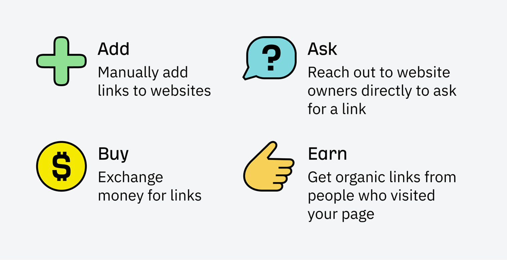

你也可以雇用一位经验丰富的链接建设人员（或链接建设机构）来为你搞定一切。事实上，许多数字营销人员和企业最终都会选择这种方式，因为无论采用哪种策略，链接建设本身都需要投入大量精力。

但即便你决定外包，掌握一些链接建设的基础知识也会非常有用。因为这样你才能判断出你雇的人做得好不好。

接下来，让我们仔细看看这四类方式。

### 添加链接

这是指你访问一个不属于你的网站，并手动将自己的链接放在那里。

这一类最常见的做法包括：

*   创建社交媒体资料。

*   提交企业名录。

*   入驻评论网站。

*   在论坛、社区和问答网站发帖。

通过这些战术建立链接非常容易。也正因如此，在 Google 眼中，这类链接的价值往往微乎其微。

除此之外，这类链接几乎无法为你提供任何竞争优势。既然你能去某个网站手动添加链接，你的竞争对手同样也可以。

不过，这类链接建设策略也不应该被完全忽视。事实上，一些专业的链接建设人员在处理全新网站时，更倾向于从这类链接入手。

他们称之为建立“基础链接”。

想想看，大多数在线业务在各大主流社交网络上都有品牌账号，同时也会出现在各类企业目录和评价网站中（如 Yelp、Trustpilot、ProductHunt、Glassdoor 等）。而所有这些页面都包含一个指向其官网的链接。

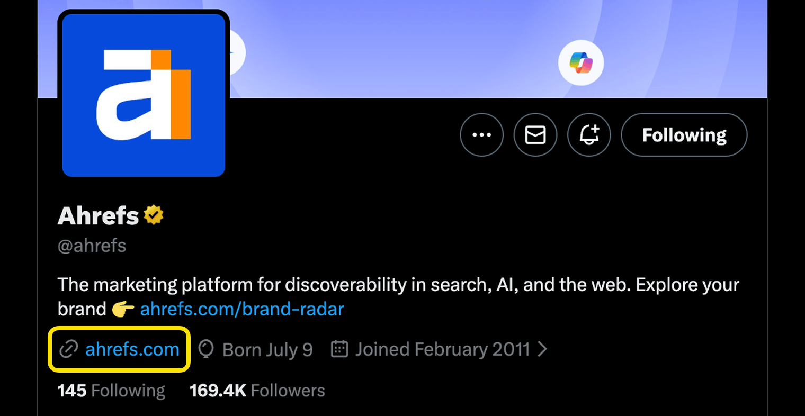

Google 显然会关注这些资料页。如果你查看 Ahrefs 的“知识”面板（见下方截图），就会注意到其中展示了我们的社交媒体链接。这些并不是我们手动添加的，而是 Google 自动识别了我们的社交账号，并将其作为[知识图谱](https://support.google.com/knowledgepanel/answer/9787176)的一部分与 Ahrefs 品牌关联起来。

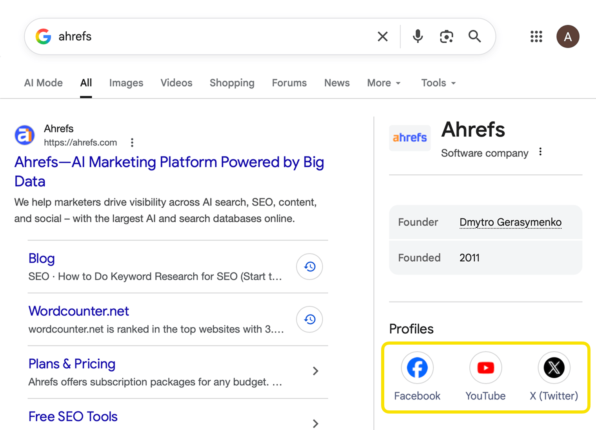

没错，通常这类链接要么是 [nofollow](https://ahrefs.com/zh/blog/nofollow-links/)，要么权重非常低。这意味着，它们对 Google 排名的直接影响微乎其微。

但鉴于如今“nofollow”属性已被[视为一种提示](https://developers.google.com/search/blog/2019/09/evolving-nofollow-new-ways-to-identify)，随着时间的推移，你的这些资料页可能会积累一些高质量链接，从而开始为网站带来一定的搜索引擎优化 (SEO) 价值。

例如，Ahrefs 在 Twitter 上的资料页拥有来自一千多个不同网站的 11,000 条反向链接。所以我非常确定，它在 Google 眼中还是有一定“分量”的。

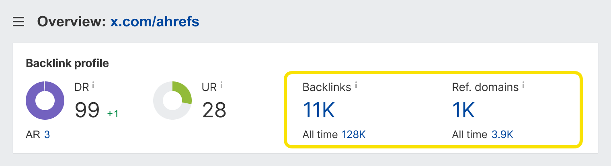

话虽如此，也别疯狂地把你的网站提交到所有能想到的社交网络和企业名录中。只需选择几十个与业务相关、自然合理的平台即可，再多就纯粹是在浪费时间。

而寻找优质网站来添加链接的最佳方法，就是研究竞争对手的链接。我们将在本指南的后续部分详细讨论这一点。

### 请求链接

这是指你主动联系其他网站的站长，并请求他们提供链接，SEO 从业者通常称之为“[链接外展](https://ahrefs.com/zh/blog/outreach/)”。

但你总不能跑去联系 datasciencecentral.com 的人，然后请他们链接到你的“曲奇食谱”页面吧？你必须挑选那些与你的页面存在某种关联的网站，因为只有这样，对方才更有可能认真考虑你的请求。

整理这份相关网站名单的过程被称为“[链接挖掘](https://ahrefs.com/zh/blog/link-prospecting/)”。你在寻找合适的目标上投入的精力越多，成功率就越高。

但话说回来，即便页面相关，为什么其他网站主会愿意链接到你呢？

理想情况下，你希望他们被你的资源深深折服，以至于自发地想将其分享给自己的访客（即建立链接）。

但现实是，并非你网站上的每个页面都是值得上千个链接的精品内容。因此，SEO 专业人士设计出了一系列策略，用来说服其他网站主在他们的页面上添加链接。

以下是这些策略的简要列表及其背后的一般逻辑：

*   [**客座文章**](https://ahrefs.com/zh/blog/guest-blogging/)——为对方网站撰写一篇高质量的文章，并在其中植入指向自己网站的链接。

*   [**摩天大楼技巧**](https://ahrefs.com/zh/blog/skyscraper-technique/)——找到一个已有大量外链但内容过时或质量一般的页面，然后在你自己的网站上创建一个更好的版本，再将它展示给那些“链接到旧页面的网站”。

*   [**资源页链接建设**](https://ahrefs.com/zh/blog/resource-page-link-building/)——寻找收录类似资源的页面，并申请将你的页面加入其中。

*   [**失效链接建设**](https://ahrefs.com/zh/blog/broken-link-building/)——找到一个拥有大量链接但已失效的页面，然后在你自己的网站上创建一个替代页面，并通知所有链接到该页面的网站。这就是失效链接建设的基本思路。

*   [**图片链接建设**](https://ahrefs.com/zh/blog/build-links-with-images/)——找到那些使用了你的图片却未注明出处的网站，请求他们添加链接。

*   [**HARO**](https://ahrefs.com/zh/blog/haro-link-building/)**和记者请求**——为他们的文章提供一段“专家引言”。

*   [**无链接提及**](https://ahrefs.com/zh/blog/unlinked-mentions/)——请求对方将提及你品牌的地方转变为可点击的链接。

*   [**PR**](https://moz.com/blog/easiest-pr-focused-link-building-tip)——给媒体提供一个值得报道的精彩故事。

不过需要注意一点。

虽然这些策略背后的逻辑看起来都很合理，但实际成功率往往低到让你大吃一惊。我的意思是，假设你发出了 100 封外展邮件，最后能换回 5 个链接就已经算是不错的结果了。

但有一件简单的事情可以显著提高成功率——在开口求人之前，先与行业内的人士建立联系。

试想一下，如果你今天突然收到一封陌生人发来的冷邮件求链接，你会理睬吗？我看未必。但如果这封邮件来自一个你之前在 Twitter 上聊过天，甚至在某个线下活动见过面的人呢？你肯定会更重视，对吧？

因此，如果你提前开始与圈内人建立联系（甚至顺手帮他们一些小忙），未来当你提出链接请求时，一切都会顺理成章。

以下是我自己的一个亲身经历。Authority Hacker 的 Gael Breton 早在 2014 年就联系过我，那时我甚至还没加入 Ahrefs：

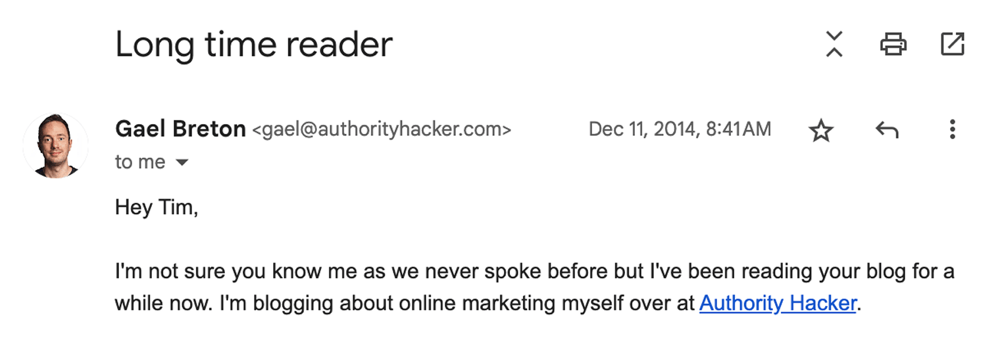

我很欣赏 Gael 的工作，从那以后我们一直保持联系。这也是为什么截至今天，他的网站从 ahrefs.com 获得了 122 条入站链接：

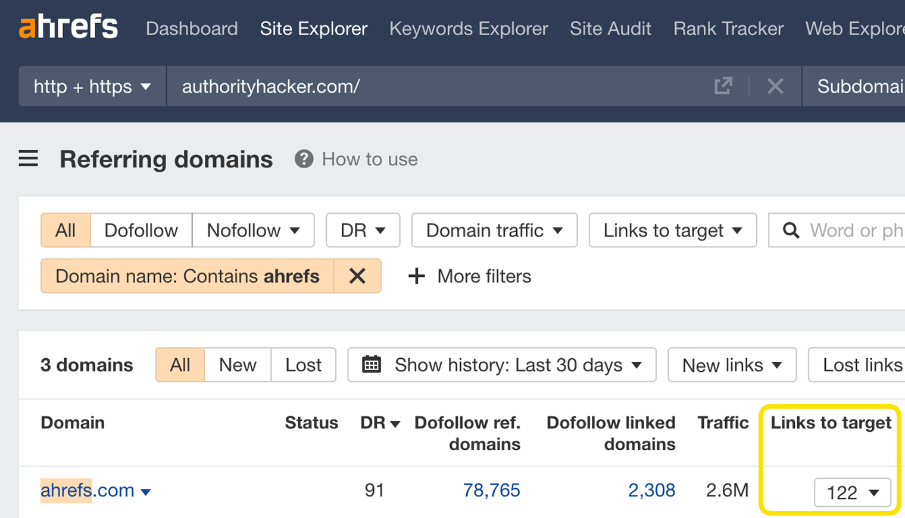

但别误会，Gael 并不是时不时地向我要链接，我们只是单纯关注彼此的工作。当他们在 Authority Hacker 发布了一些值得关注的内容时，我会看到并分享给团队，之后我们可能会在博客中链接到它。

这就是人脉关系如何帮助你自然地获取链接。

### 购买链接

这是建立链接最简单的方法。只要你愿意付钱，很多网站主都会乐意链接到你。

但用金钱（或其他任何形式的利益）换取链接是极具风险的。[Google 认为这是对算法的恶意操纵](https://developers.google.com/search/docs/essentials/spam-policies#link-spam)，并可能因此惩罚你，将你的网站踢出搜索结果。

购买链接的另一个风险在于，你可能会把钱浪费在毫无作用的[劣质链接](https://ahrefs.com/zh/blog/bad-links/)上。

也就是说，我们不想教你任何可能让你的业务（或钱包）面临风险的策略。因此，本指南不会提供任何“如何正确购买链接”的建议。

不过，你也应该清楚地意识到，SEO 行业中确实有许多人通过购买链接来达成排名目标。一旦你开始研究竞争对手的反向链接并尝试联系相同的网站，你很快就会发现他们是否为某些链接付过费。

### 赢得链接

当你不需要开口求人，他人就主动链接到你的网页时，你就“赢得”了链接。但这种情况发生的前提是，你拥有某些真正值得关注的内容，让其他网站主发自内心地想要在自己的网站上提及。

以下是一些能让你的页面值得被链接的要素：

*   公司专有数据

*   实验结果（通常需要投入大量精力）

*   独特的见解和强有力的观点（即思想领导力）

*   行业调查

*   突发新闻

例如，早在 2017 年，我们就利用公司的专有数据开展了一项独特的研究，回答了 SEO 领域最常被问到的一个问题：“[在 Google 获得排名需要多长时间？](https://ahrefs.com/zh/blog/how-long-does-it-take-to-rank-in-google-and-how-old-are-top-ranking-pages/)”

截至今天，这篇博文已拥有来自约 1,700 个不同网站的近 3,000 条反向链接。

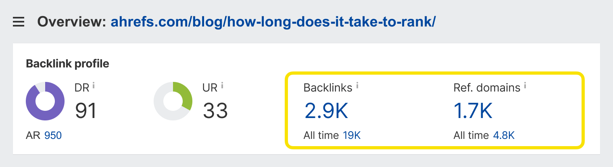

即便是在 6 年后的今天，这项研究依然在不断吸引新的链接。以下是今年早些时候的一些带链接的提及：

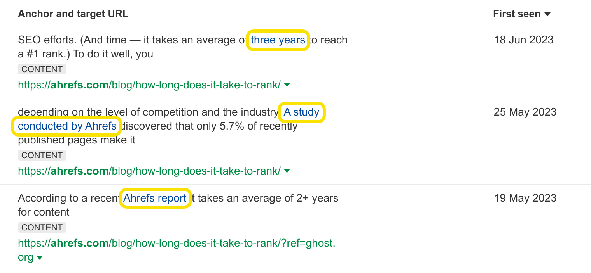

但你并不一定非得创作内容。你的企业本身，或者你提供的产品和服务，就可能具有被链接的价值。

指向 ahrefs.com 的很大一部分链接其实并非来自我们发布的内容，而是来自人们提及我们的产品和公司。以下是我们昨天刚获得的一些链接提及：

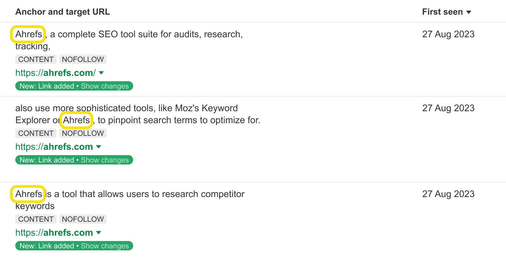

然而，人们无法链接到他们根本不知道其存在的东西。所以无论你的页面（或产品）有多出色，你都需要进行推广。看到的人越多，建立链接的机会就越大。

我们将在本指南的后续部分详细讨论这一点。

* * *

第3部分

## 哪些链接真正有效？

不同类型的链接对页面在 Google 中的排名影响也不同。而且没人能确定 Google 到底如何衡量每一条链接的价值。

但 SEO 业界公认有五个评估链接价值的核心概念。

什么样的链接才是好链接

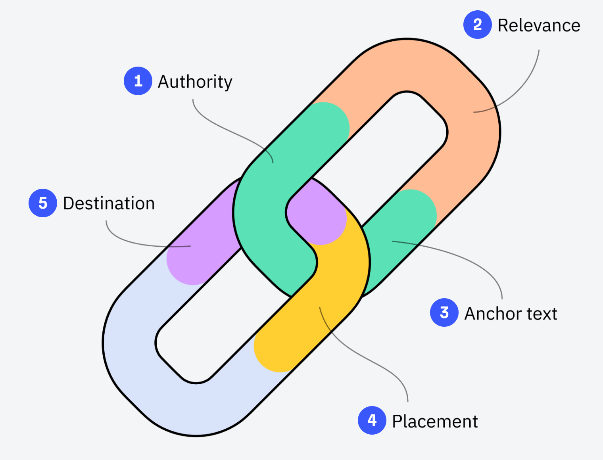

### 权威性

直觉告诉我们，一个来自《纽约时报》的链接和你朋友的小众旅游博客的链接，在 Google 眼中绝不可能是同等的。前者是享誉世界的权威媒体，而后者甚至在朋友圈里都未必出名。

经过多年的链接建设实践，SEO 从业者积累了大量经验证据，表明来自更知名、更权威网站的链接，对你的页面排名影响更大。

但你该如何衡量一个网站的“权威性”呢？

根据 [Aira 发起的一项行业调查](https://aira.net/state-of-link-building/link-building-measurement-and-reporting/)显示，最受欢迎的网站权威性指标是 Ahrefs 的[域名评分 (DR)](https://ahrefs.com/zh/blog/domain-rating/) 和 Moz 的 Domain Authority (DA)。而各公司内部开发的指标（通常融合了 DR 或 DA）则位列第三。

你会使用指标来衡量链接的权威性和/或质量吗？

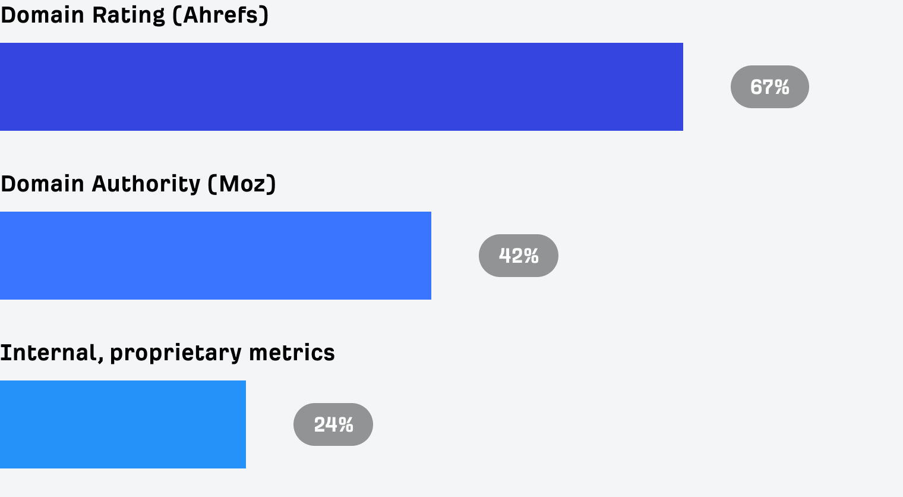
2022 年链接建设现状报告。

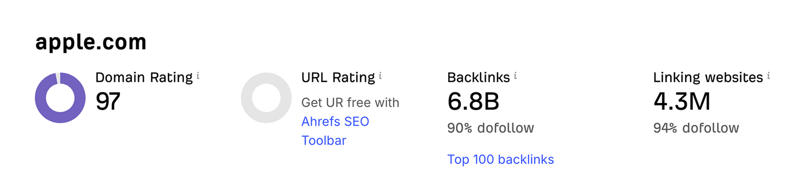

除了整个网站的权威性之外，链接到你网站的具体页面本身也有权威性。众所周知，Google 会借助著名的 [PageRank 算法](https://ahrefs.com/zh/blog/google-pagerank/)来计算这一点。

简单来说，PageRank 算法的前提是：拥有更多（且质量更好）反向链接的页面，其投出的“选票”分量更重。

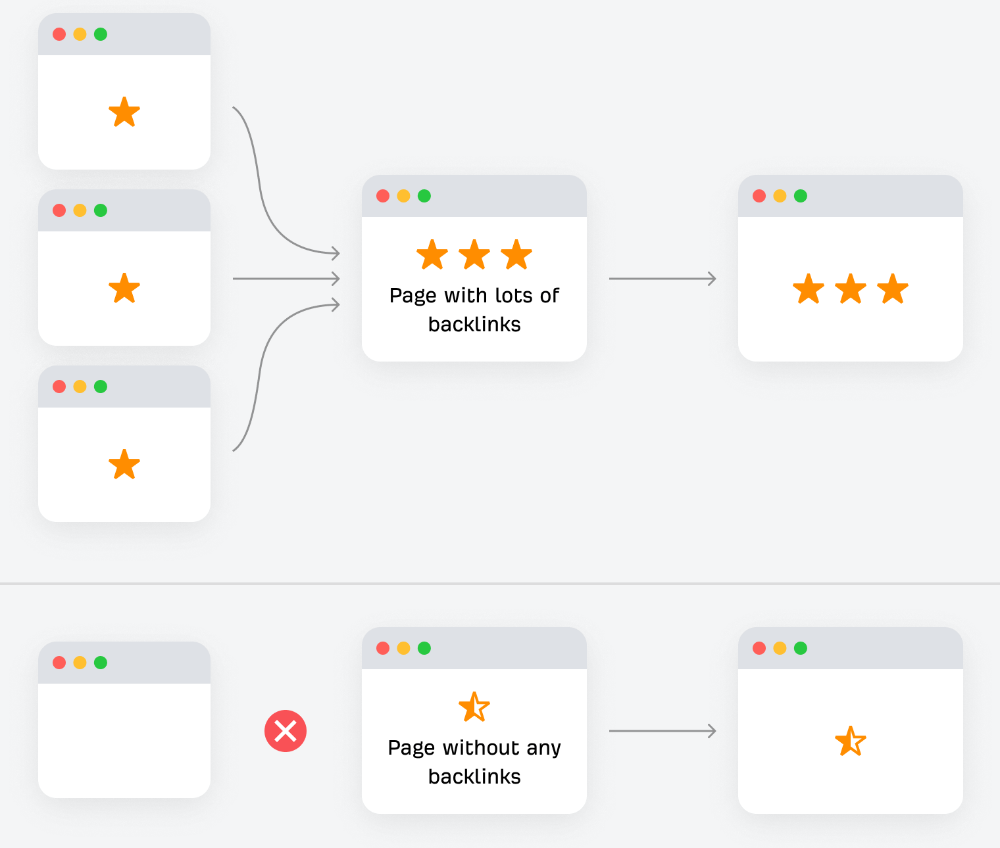
拥有反向链接的页面比没有反向链接的页面投出的“选票”更有力。

在 Ahrefs，我们有专门衡量页面权威性的指标，叫做 [URL 评分 (UR)](https://ahrefs.com/zh/blog/ahrefs-seo-metrics/#section9)，其计算方式与原始的 PageRank 非常相似。

你正在阅读的这个页面 UR 值为 30，并且拥有来自一千多个不同网站（引用域名）的反向链接：

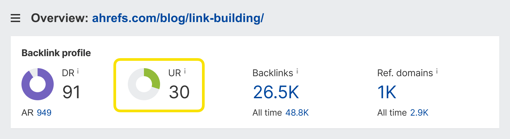

### 相关性

如果你运营一个关于健康和健身的博客，那么来自同类主题的其他网站（及页面）的链接，在 Google 眼中会比来自汽车或金融类网站的链接更有分量。

“[Google 搜索的运作方式](https://www.google.com/intl/en_uk/search/howsearchworks/how-search-works/ranking-results/)”指南中的一段摘录也印证了这一理论（粗体为笔者所加）：

如果**同一主题下的其他知名网站**也链接到该页面，通常是内容质量较高的一个信号。

但这并不意味着你应该避免从那些主题与你不一致的网站获取链接。我无法想象任何一位资深的 SEO 专家会说：“不，请不要从 dreamhost.com（一个 DR 93 的主机托管网站）链接到我的食谱网站。”

关键在于，无论你的网站主题是什么，都会存在数十个相关但又不完全相同的主题。

例如，营养对于健康和健身非常重要，因此健身网站链接到关于饮食的文章是非常自然的。而如果你想定期锻炼，就需要合理安排时间，所以链接到关于时间管理的文章也并不会显得突兀。

换句话说，相关性是一个相当灵活的概念，除非你硬把链接塞进明显不该出现的地方。

### 锚文本

如果你还不熟悉这个术语，“[锚文本](https://ahrefs.com/zh/blog/anchor-text/)”就是一段链接到其他页面的可点击文本。在多数情况下，它能简要描述被链接页面的内容。

因此，Google 会利用锚文本中的词来更好地理解被引用页面的主题，以及它应该在哪些关键词下获得排名，这并不令人意外。事实上，[Google 最初的 PageRank 专利](http://infolab.stanford.edu/~backrub/google.html)中就非常明确地提到了这一点（粗体为笔者所加）：

Google 采用多种技术来提升搜索质量，包括 PageRank、**锚文本**以及邻近信息。

那么在做链接建设时，你该如何利用锚文本呢？

答案是：最好不要去刻意利用它。你越是试图控制不同页面链接到你的方式，越是想方设法将所有“正确的关键词”硬塞进反向链接的锚文本中，Google 就越有可能怀疑你在操纵算法并因此惩罚你。所以，最好让链接页面的作者自行决定他们想如何引用你的页面。

### 位置

早在 2010 年，Bill Slawski 就[提出](https://www.seobythesea.com/2010/05/googles-reasonable-surfer-how-the-value-of-a-link-may-differ-based-upon-link-and-document-features-and-user-data/)了一项描述“Reasonable Surfer Model”的 [Google 专利](https://patents.google.com/patent/US8117209B1/en)。该模型解释了链接被点击的可能性如何影响其传递的权威性。而这种可能性主要取决于链接在页面中的位置。

假设有一个网页由三个板块组成：正文内容区、侧边栏和页脚。一般来说，正文内容中的链接会获得更多点击，因为访客对正文板块的关注度最高。

位置更显眼的链接可能会传递更多“权威性”。

另一个会影响链接点击率的因素是它在页面中出现的纵向高度。读者更可能点击文章开头的链接，而不是末尾的链接。

### 链接目标

在为你的网站构建链接时，通常有三个主要的目标指向：

1

你的首页。

2

3

你需要在 Google 中获得良好排名的实际页面（通常称为“盈利页面”）。

而且很多时候，你需要获得良好排名的页面往往也是最难获得链接的页面。

这是因为，网站主通常更愿意链接到能为读者免费提供价值的信息型页面，而不是那些可能会推销产品的商业页面。

因此，SEO 中最常见的问题之一就是：“如何为无聊的页面获取链接？”

经验丰富的 SEO 专家通常建议的策略是：先为你那些“可链接资产”获取大量优质链接，然后通过内部链接将一部分“链接权威性”传递给那些你希望获得好排名的“盈利页面”。

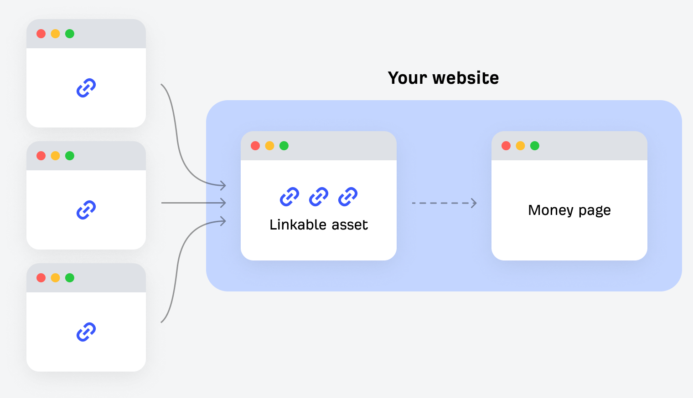
利用内链将权威性传递给那些你需要在 Google 中获得良好排名的“无聊”页面。

* * *

第4部分

## 最佳链接建设策略

链接建设的方法和策略有很多。有些非常有效，而另一些如今已经不太管用，很可能只是在浪费你的时间。

根据我们的观察，目前真正有效的方法包括：

### 复制竞争对手的反向链接

如果有人链接到了你的竞争对手，那他很有可能也愿意链接到你。

启动这一策略的好方法是研究谁链接到了竞争对手网站的首页。这类页面通常是在提及整个业务，而不是某个具体的网页（而那个具体的网页你自己网站上可能正好没有）。

例如，下面是一些链接到我们首页、且本身具有不错搜索流量的页面：

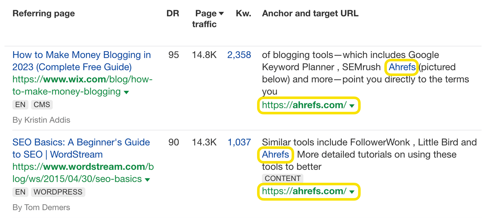
来自 Site Explorer 的截图。

如你所见，在这两种情况下，Ahrefs 都是紧挨着其他营销工具被提及的，这恰恰说明：请求对方在提到竞争对手时顺便提一下你，是一个完全合理的诉求。

分析完首页链接后，下一步就是研究竞争对手网站上哪些页面获得的链接最多。在 [Site Explorer](https://ahrefs.com/zh/site-explorer) 里就有一个专门为此设计的报告，名为“按反链数量排序”。

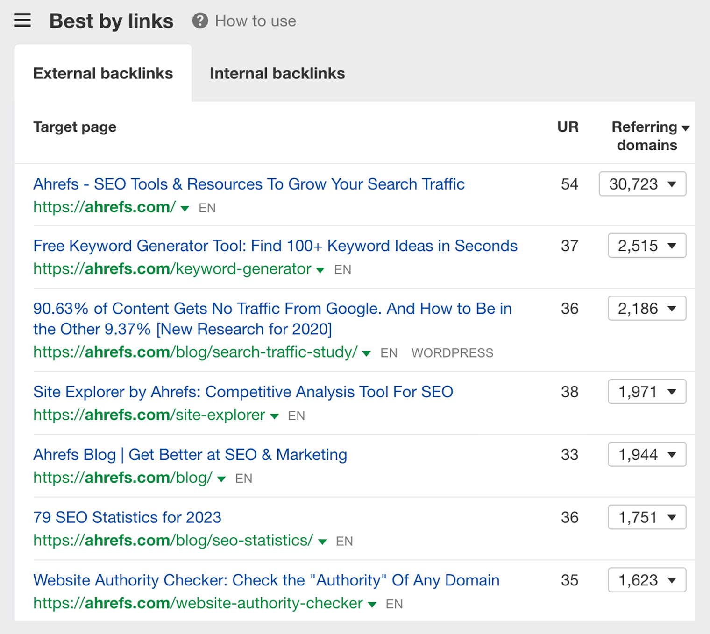

通过查看 ahrefs.com 的**按反链数量排序**报告（见上图），可以很容易发现哪些类型的页面为我们带来了最多链接：

*   **我们的首页**——因为很多人会把 Ahrefs 当作一款软件或一家公司来提及。

*   **我们的免费工具**——[Keyword Generator](https://ahrefs.com/zh/keyword-generator) 和 [Website Authority Checker](https://ahrefs.com/zh/website-authority-checker) 只是我们开发的众多免费工具中的两个，而且这些工具每一个都在自然地吸引大量反向链接。 
*   **我们的博客**——由于持续输出高质量内容，现在有很多人在推荐并链接到我们的博客。

*   **我们的研究报告**——人们喜欢有洞察力的数据。因此，我们发布的研究报告往往能获得大量链接。

你也可以试着浏览竞争对手的**按反链数量排序**报告，看看什么类型的页面为他们带来了链接。一旦你识别出对他们有效的模式，你就可以在自己的网站上创建类似（或更好）的资源。

完成上述策略后，我建议你[设置一个反向链接提醒](https://ahrefs.com/zh/alerts)，每当竞争对手获得新链接时你就会收到通知。这样，你就能立刻联系那些链接到他们的网站，尝试让自己也被添加到同一个页面上。

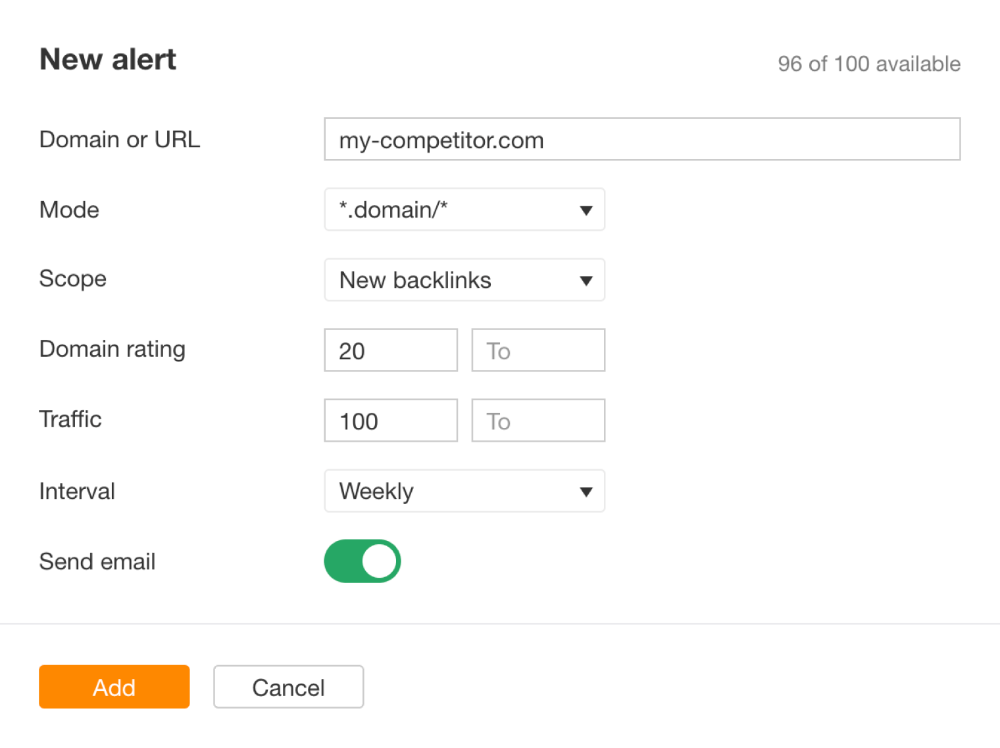

总而言之，竞争对手就是优质链接机会的宝库。随着你对他们反向链接的深入挖掘，很快就会发现一些可以为你所用的链接建设模式。实际上，我们还[针对这个话题写了一篇非常详细的文章](https://ahrefs.com/zh/blog/find-competitors-backlinks/)，别忘了去看看。

### 有针对性的链接外展

假设你已经完成了了关键词分析，并且确定了一个需要针对特定关键词在 Google 中获得良好排名的页面。现在，你需要为这个特定的页面构建链接。

最好的切入点就是，找到该关键词下排名靠前的页面，并研究它们的链接来源。

只需将你的关键词输入 Ahrefs 的 [Keywords Explorer](https://ahrefs.com/zh/keywords-explorer)，然后向下滚动到“SERP 概览”小组件。你将会看到排名靠前的页面，以及它们拥有多少反向链接（和引用域名）。

假设你想在“best productivity apps”这个关键词上获得排名，其 SERP 如下图所示：

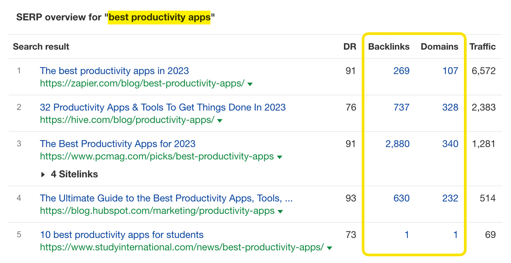

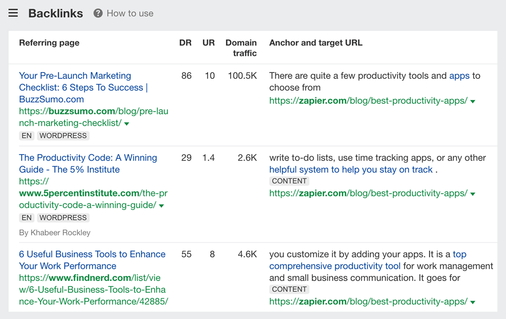

接下来你需要做的是：

1

2

手动浏览剩余的页面列表，逐一打开它们，查看其上下文是否允许添加指向你页面的链接

3

联系这些网站的所有者，尝试说服他们在页面上添加指向你资源的链接

此外，你还可以从提及相关主题的网站中寻找潜在链接来源。例如，如果你需要为一款效率应用构建链接，那么你需要联系所有在页面某处提到过“productivity”这个词的网站。

你可以尝试在 Google 中搜索它们，但它提供的搜索结果数量有限，平均只有几百条。

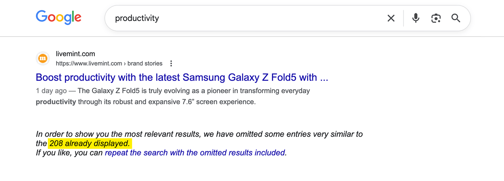

想要更快找到成千上万个提及你主题的页面，可以使用 Ahrefs 的 [Content Explorer](https://ahrefs.com/zh/content-explorer)。

例如，如果你搜索关键词“productivity app”，你会得到超过 120,000 个提到该关键词的页面。

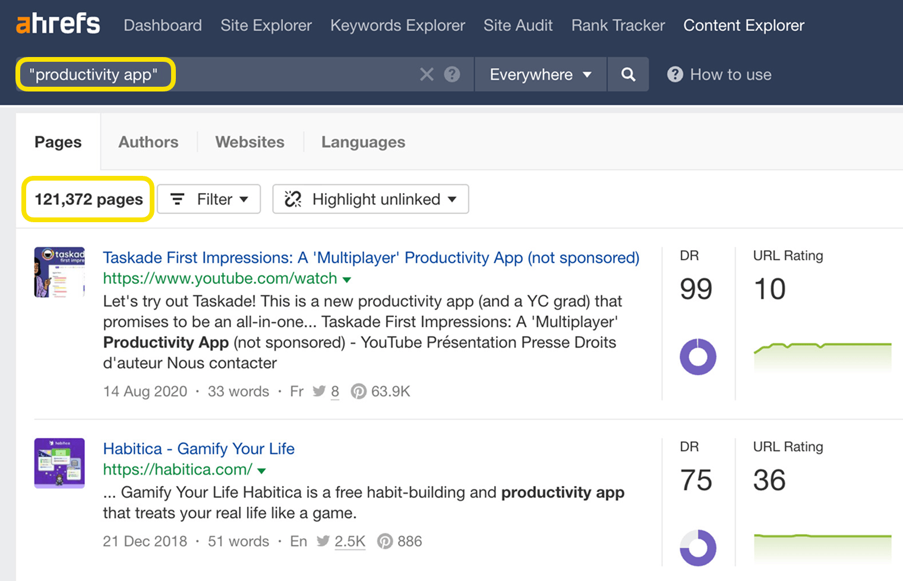

在此基础上，你可能需要应用以下筛选条件，将结果列表缩小到最有意义的范围：

*   语言：英语（或你感兴趣的任何语言）

*   网站流量：1,000 以上

*   域名评分：30 以上

*   过滤不当内容

*   筛选条件：每个域名一个页面、排除首页、排除子域名

这样一来，你最终会得到 4,000 多个页面。这是一个更容易管理、便于后续处理的链接数量。

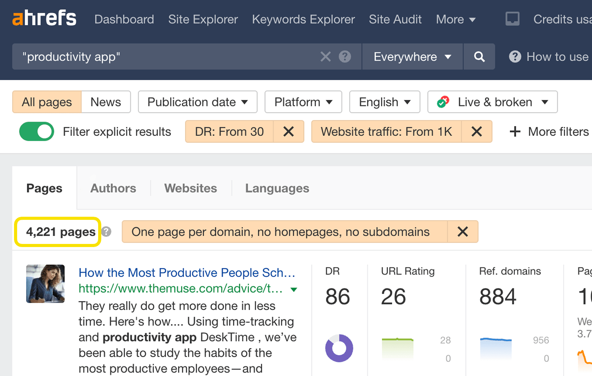

接下来的行动计划与前一个非常相似。逐个检查这些页面，如果你认为对方有可能同意链接到你的页面，就联系相应的网站主。

平心而论，这两个潜在链接群体的成功率可能都很低。我之所以知道这一点，是因为不久前[我也做过这种链接建设外展](https://ahrefs.com/zh/blog/email-outreach/)。而且从我与专业链接建设者的交流来看，下面这些基本就是常态。

*   大多数人根本懒得回复你的邮件。

*   很多人回信只是为了礼貌地拒绝你的请求。

*   只有极少数人会真正给你链接。

这就是为什么我前面提到，在你真正开口求人帮忙之前，就应该先与这些网站主建立关系。

一个很好的做法是，在你还在创建页面的过程中就联系他们。你可以征求他们的意见、索取引言，甚至建议展示他们的相关作品。

如果你正在做的内容确实能引起他们的兴趣，那将会有巨大的帮助。

例如，以前我运营个人博客时，曾联系了 500 多位博主，请他们为我的一个小型研究分享一些 Google Analytics 数据。这个请求激起了他们的兴趣，因此许多人都帮了我的忙。

研究完成并发布后，我确实通过电子邮件通知了最初联系过的 500 多位博主。正因如此，这篇文章才成为我博客上链接最多的页面：

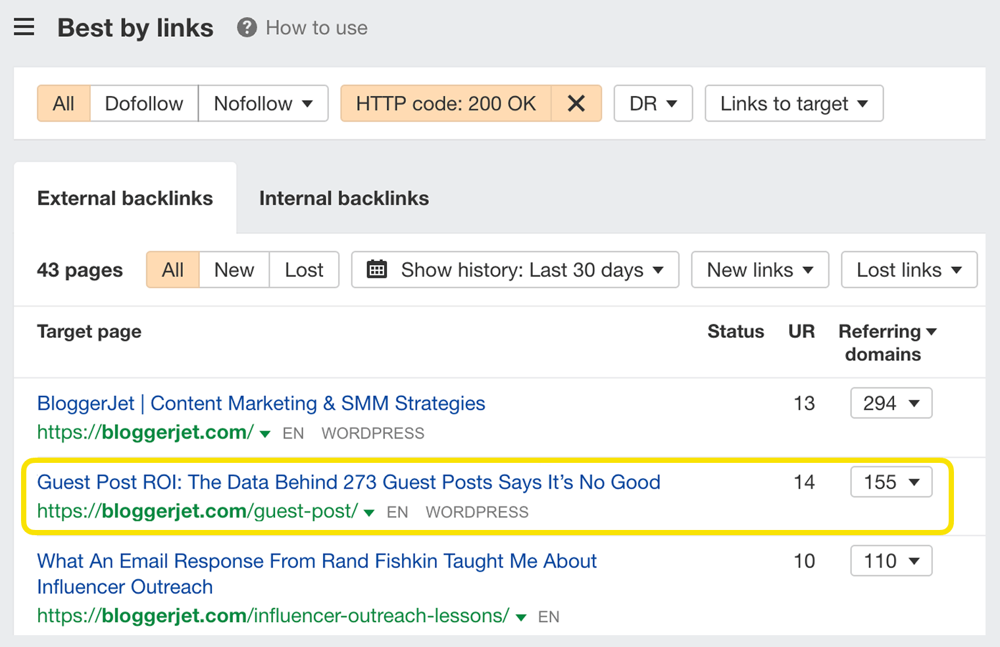
来自 Site Explorer 的截图。

但最重要的是，我在这项研究中投入的大量努力为我赢得了许多博主的尊重。后来每当我再联系他们提出其他请求时，我不再是一个“无名小卒”，他们也更愿意和我交流。

换句话说，如果你正在做的东西确实值得大家关注，那么你的邮件外展效果将会大幅提升。

### 创建可链接资产

在 SEO 中，我们用“[可链接资产](https://ahrefs.com/zh/blog/linkable-assets/)”或“链接诱饵”来指代那些为了吸引链接而精心设计的内容。这类可链接资产可以有多种表现形式：

*   行业调查

*   报告与调研

*   在线工具与计算器

*   奖项与排名

*   操作指南与教程

*   定义与自创术语

*   信息图、GIF 信息图以及“地图信息图”

前面我已经提到过两个可链接资产的例子：我为个人博客做的博主调研，以及我们在 Ahrefs 做的研究报告。现在让我再给大家展示一个来自其他人的绝佳案例。

数字营销机构 Aira 每年都会对数百名行业顶尖专家进行调查并发布一份[《链接建设现状报告》](https://aira.net/state-of-link-building/)。这份报告为他们带来了来自 600 多个不同网站的反向链接：

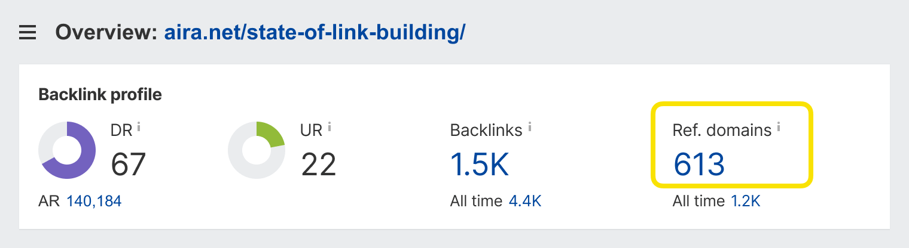

其中一条反向链接正来自于 ahrefs.com 的首页（该页面的 URL 评分为 54）：

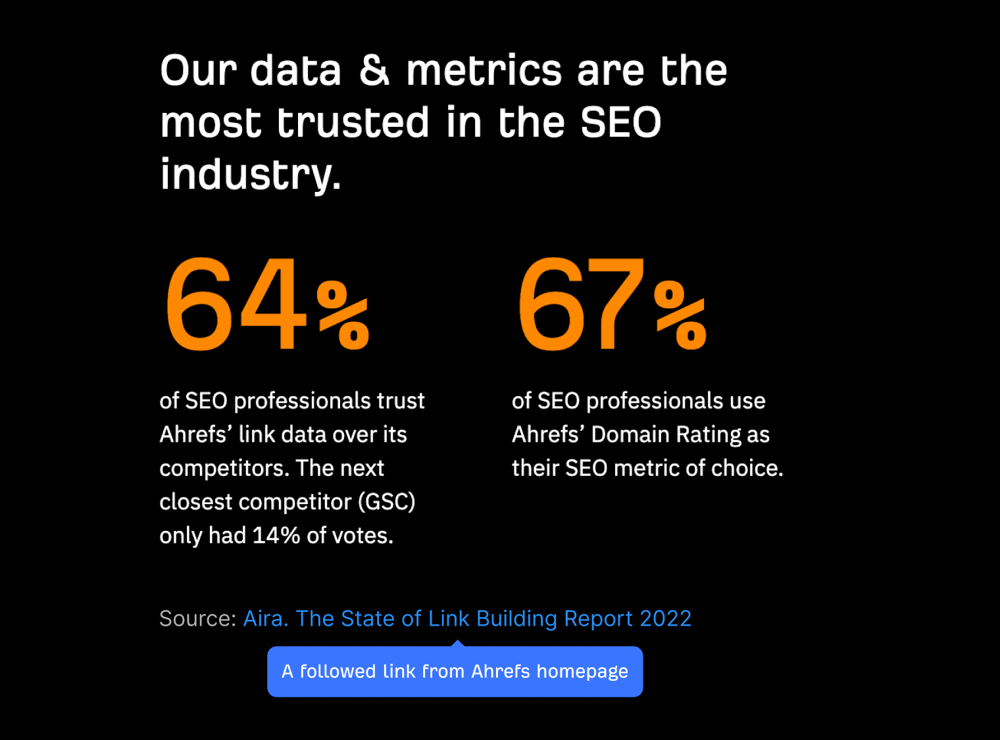

他们的报告包含了一些对我们公司非常有利的数据，所以我们忍不住将它放在了首页上。许多营销人员把这种链接诱饵称为“[自我诱饵](https://www.searchenginejournal.com/link-building-guide/ego-bait-content/)”。但在 Aira 的案例中，我认为这并非刻意而为，因为他们不可能事先知道行业调查的结果。

那么，你该如何把这一链接建设策略付诸行动呢？

首先，你需要构思出一个真正值得被链接的页面创意。

你可以根据上面提到的可链接资产类型做一次简单的头脑风暴：

*   你能围绕某个话题对你所在的行业做一项调研吗？

*   你能利用业务可获取的数据，计算出一些有意义的统计信息吗？

*   有没有什么有趣的实验是你可以去执行的？

*   你的行业是否需要某种免费的在线工具？

*   诸如此类。

如果你实在想不出什么有趣的点子，也可以回头研究竞争对手的网站，看看哪些类型的可链接资产对他们奏效。

但别忘了，即便是最好的可链接资产也需要通过推广来吸引链接，因为人们无法链接到他们根本不知道其存在的东西。

所以，让我们快速聊聊内容推广。

### 内容推广

我们其实还有一篇单独的文章列出了 [21 种内容推广策略](https://ahrefs.com/zh/blog/content-promotion/)。但目前，我希望你重点关注以下三种：

1

**广告**——一个非常简单的方法，可以把你的资源推广给成千上万的相关受众，但可能需要大量的预算。

2

**网红拓展**——你可以找出所在领域中活跃的意见领袖，每当你发布值得他们关注的内容时就联系他们。如果运气好的话，他们可能会分享给自己的粉丝。

3

**建立粉丝群**——你绝对应该[开始建立邮件列表](https://www.sender.net/blog/email-list-management-software/)（如果你还没有的话），并在 Twitter (X) 和 LinkedIn 等平台保持活跃。如果你能持续发布优质内容，就会有更多人开始关注你，其中不少人最终可能会链接到你的内容。

此外，别忘了通过在新发布的内容中提及你的旧内容来进行推广。

正如 Ryan Holiday 在他的著作《Perennial Seller》中所说：“创作更多内容，本身就是最有效的营销方式之一。”

### 客座文章

一些 SEO 专业人士其实不太认可这种链接建设策略，主要是因为有些人会做得过头，甚至演变成垃圾内容。

不过，客座博客依然是当今 SEO 人员构建链接最流行的方式之一：

你主要使用哪些策略来为你的联盟营销网站获取反向链接？

基于一项针对 179 位 SEO 专业人士的 Facebook 投票

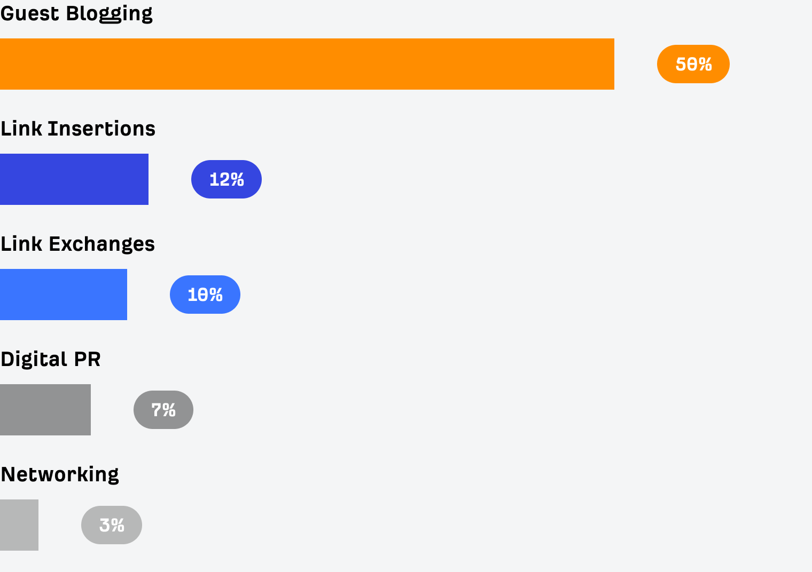
来源：Matt Diggity

即便是在 Ahrefs 博客，我们偶尔也会接受客座投稿。只要客座作者引用的资源与文章主题相关，他们就可以链接到自己的内容。这意味着，通过客座文章建设链接完全可以是合规且合理的做法。

但你该如何让自己的内容发布在行业顶尖博客上呢？其实，你只需要向他们提出一个非常有吸引力的文章选题即可。

这里有一个小技巧，教你如何构思出让人难以拒绝的内容选题：只需为你想要投稿的博客找几个竞争对手，然后使用 [Content Gap 工具](https://ahrefs.com/zh/content-gap)，找出哪些主题能为他们带来大量流量，但你打算投稿的那个博客却尚未覆盖。

例如，通过对我们自家博客与竞争对手博客快速进行一次 [内容差距分析](https://ahrefs.com/zh/blog/content-gap-analysis/)，就能发现一系列对手有搜索流量、而我们却没有覆盖的优质主题。

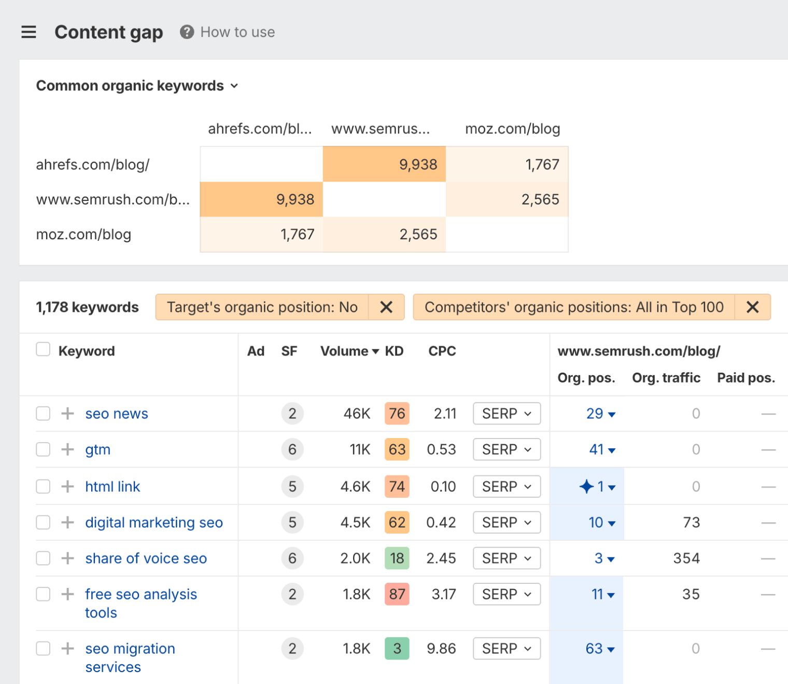

如果有人提出一个极具说服力的选题，并声称可以就这些主题写出一篇不错的博文，我们会很难拒绝。

还有一个稍显冷门的客座投稿策略，在你想投稿的博客上找出一篇表现不佳的文章，并提议为他们从头开始重写。如果你能说服他们相信你可以显著改进这篇文章，让它在 Google 中获得更高排名并带来更多搜索流量，我相信他们会很难拒绝你的提议。

该如何找到这些表现不佳的页面呢？只需打开 [Site Explorer](https://ahrefs.com/zh/site-explorer) 中的**热门页面**报告，然后使用“流量”筛选器即可：

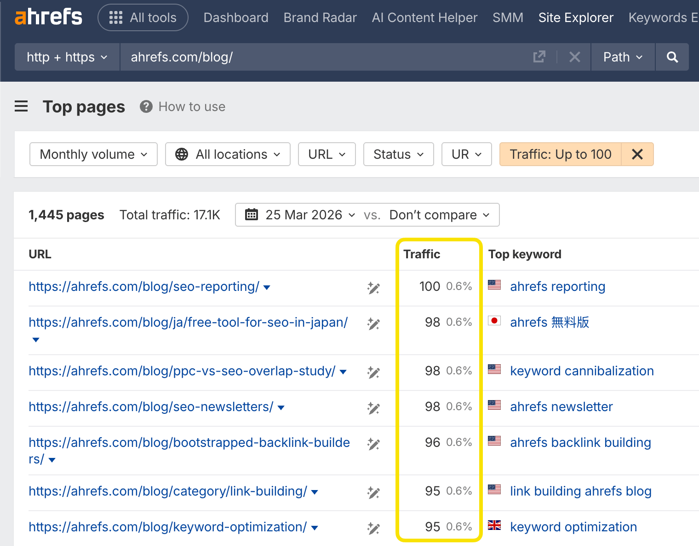

* * *

第5部分

## 链接建设工具

* * *

## 我们来总结一下

每当我向完全没有经验的新手解释链接建设时，都会用同一个比喻：如果你本身不是一个有趣（且慷慨）的人，你就很难交到朋友。网站也是如此，如果你的网站没有任何有趣或有用之处，那么别人凭什么愿意链接到它呢？

这就是为什么许多 SEO 人员声称他们从不主动建设链接。他们只是专注于在网站上做出值得关注、“值得一链”的事情，并把这些成果推广给相关受众。随后，链接自然而然就会出现。

以上就是我想分享的全部内容。希望你在读完这篇指南后对链接建设有了更深入的了解。如果你喜欢这篇文章并且一直读到了这里，欢迎在 Twitter (X) 上艾特我一下 [@timsoulo](https://x.com/timsoulo)，这对我来说意义重大。
