Title: 本地 SEO：完整指南

URL Source: https://ahrefs.com/zh/seo/local-seo

Published Time: Tue, 21 Jul 2026 02:17:34 GMT

Markdown Content:
第1部分

## 什么是本地 SEO？

本地 SEO 是一种帮助 Google 理解您的商家位置、提供的服务以及可信度的策略。这有助于提升您在本地搜索结果中的排名，从而惠及任何拥有实体门店或服务于本地区域的商家。

例如，这家披萨店在本地包和“蓝色链接”自然搜索结果中都排名第一：

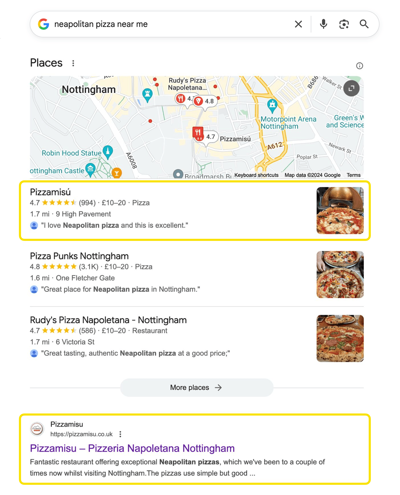

这是因为它离我很近，正好满足我的需求，并且口碑很好（994 条评价中评分为 4.7/5）。

* * *

第2部分

## 为什么本地 SEO 很重要？

本地 SEO 之所以重要，是因为很多人会使用搜索引擎来查找本地商家。

事实上，[据 Google 表示](https://www.thinkwithgoogle.com/consumer-insights/mobile-search-trends-consumers-to-stores/)：

*   所有移动端搜索中有 30% 与地理位置相关。

*   78% 的手机用户在搜索附近商家后，会在一日内前往该商家。

*   28% 的本地搜索最终会带来购买行为。

简而言之，客户正在搜索您的商家。如果您没有出现在搜索结果中，就等于白白错失收入。

* * *

第3部分

## 本地 SEO 是如何运作的？

本地 SEO 包含两个不同的战场，因为 Google 在本地搜索中会显示两类搜索结果：本地包和自然搜索的“蓝色链接”。您的网页有机会同时在这两类结果中排名。

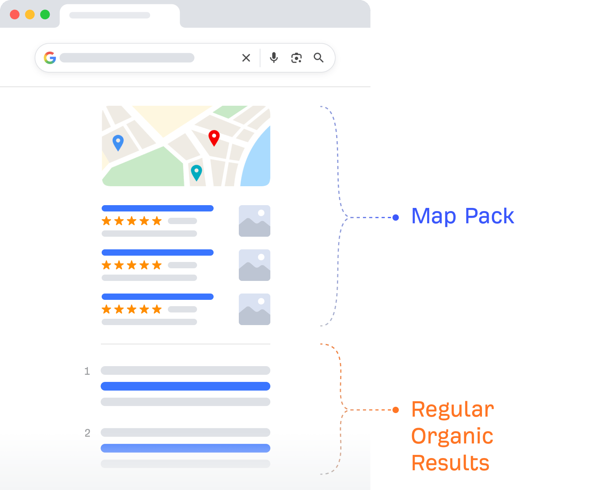

#### 地图包结果

地图包（又称本地包）是 Google 的一项 SERP 特性，用于展示排名靠前的本地商品列表及地图。在本地搜索中，它通常出现在 Google 搜索结果的最顶部。

#### 自然搜索结果

“常规”自然搜索结果就是我们熟悉的“十个蓝色链接”。它们通常出现在地图包结果下方。

* * *

第4部分

## 什么是有效的本地 SEO 策略？

通过初始优化打好坚实基础，然后建立相应机制，在后续尽可能实现自动化运作。

例如，评论固然重要，但获取更多评论并不一定很麻烦。您可以采取一些简单的措施来鼓励客户留下评论，比如如果您经营一家餐厅，可以在餐桌上放置如下所示的卡片：

这就是我所说的被动式本地 SEO。只要您让客户满意，您的线上口碑就会自动增长，排名也应随之提升。

在阅读本指南的其余部分时，请牢记这一思路。

* * *

第5部分

## 如何进行本地 SEO

进行本地 SEO 需要同时针对本地地图包和常规“蓝色链接”自然搜索结果进行优化。为此，您需要针对本地排名因素进行优化。

其中一些因素对于本地包和常规搜索结果都很重要，而另一些因素则仅对其中一种结果更为重要。

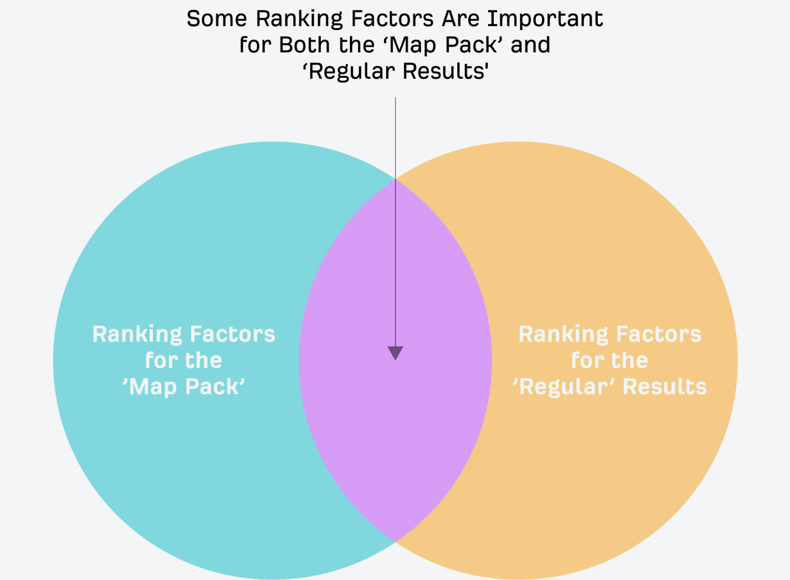

让我们从头到尾梳理一遍本地 SEO 的整个流程。

### 创建并优化您的 Google 商家资料（原 Google 我的商家）

Google 商家资料是包含商家信息的本地列表。它是免费的，并能让您的商家出现在地图包和 Google 地图中。

根据 [BrightLocal 的调查](https://www.brightlocal.com/learn/key-ranking-factors-for-local-seo/)，36% 的 SEO 从业者认为，Google 商家资料是地图包中最重要的排名因素；而 6% 的人认为它对“常规”自然搜索结果也具有重要影响。

有多少 SEO 从业者认为 Google 商家资料是最重要的排名因素？

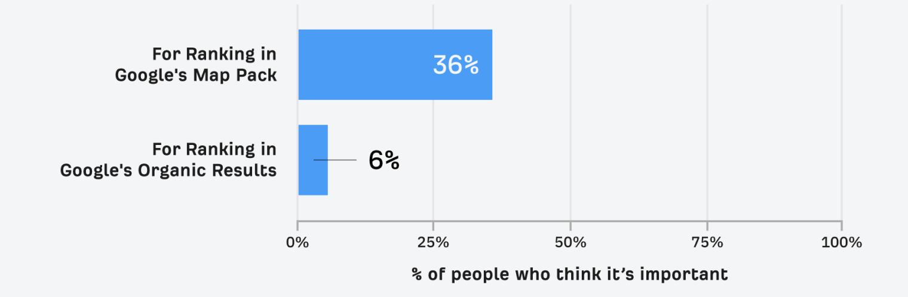

这一点并不令人意外，因为您 _必须_ 拥有 Google 商家资料，才有可能在地图包中获得排名。

随着时间的推移，商家资料信号在地图包中的重要性认知，也呈现出逐年上升的趋势。

Google 商家资料信号的重要性认知随时间推移的变化趋势

|  | 2013 | 2014 | 2015 | 2017 | 2018 | 2020 | 2021 |
| --- | --- | --- | --- | --- | --- | --- | --- |
| 本地包 / Local Finder | 23% | 20% | 22% | 19% | 25% | 33% | 36% |
| 本地化自然搜索结果 | 10% | 10% | 8% | 7% | 9% | 7% | 6% |

来源：BrightLocal

除了排名之外，Google [表示](https://support.google.com/business/answer/10515606?hl=en)，客户访问拥有完整商家资料的商家的可能性会高出 70%；考虑购买的可能性会提高 50%。因此很明显，如果您想吸引更多客户，一个完整且经过优化的商家资料至关重要。

以下是一些[来自 Google](https://support.google.com/business/answer/10515606?hl=en#zippy=%2Cadd-services-offered%2Cadd-in-store-products%2Cupload-photos-videos-regularly%2Cselect-attributes-to-describe-your-business) 的最佳实践：

*   设置商家类别时要具体明确

*   设置营业时间（包括节假日营业时间）

*   添加地址（适用于有线下门店的商家）

*   设置服务区域（适用于需上门服务或提供配送服务的商家）

*   添加您所提供的产品或服务

*   添加照片

*   请客户撰写评论

#### 延伸阅读

### 获取更多评论

评论指的是您在 Google 商家资料及其他线上平台上的评论数量和质量。

BrightLocal 2021 年的研究显示，17% 的 SEO 从业者认为，评论是地图包排名中最重要的排名因素，但只有 5% 的人认为它们对常规自然排名最重要。

有多少 SEO 从业者认为评论是最重要的排名因素？

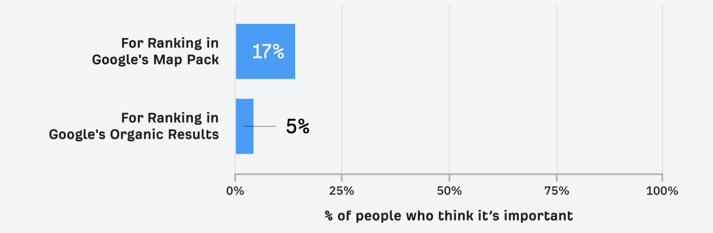

在过去几年中，评论在本地包排名中的重要性认知也有所上升。

评论信号的重要性认知随时间推移的变化趋势

|  | 2013 | 2014 | 2015 | 2017 | 2018 | 2020 | 2021 |
| --- | --- | --- | --- | --- | --- | --- | --- |
| 本地包 / Local Finder | 12% | 12% | 11% | 13% | 15% | 16% | 17% |
| 本地化自然搜索结果 | 6% | 7% | 6% | 7% | 6% | 6% | 5% |

来源：BrightLocal

但评论不仅仅关乎排名。在 Google 商家资料及其他平台上获取评论，有助于建立 Google 和客户对您的信任。

以下是一些[来自 Google](https://support.google.com/business/answer/3474122?hl=en-GB)的获取更多评论的最佳实践：

*   引导客户进行评论（可在 Google Business Manager 中生成并分享评论链接）

*   重点获取 Google 商家资料上的用户评论

*   回复用户评论以建立信任（需要先验证 Google 商家资料才能进行此操作）

*   不要通过金钱来换取或提供评论（这违反[Google 服务条款](https://support.google.com/contributionpolicy/answer/7411351?hl=en&ref_topic=7422769)） 
*   不要阻止用户留下差评，也不要向顾客索要好评（这违反 Google 服务条款）

### 被收录到目录网站中（以获取更多 NAP 引用）

NAP 引用是指在互联网上提及您的商家名称、地址和电话号码的信息。这类引用通常出现在商业目录和社交媒体资料页面中。

此外，还有包含您网站信息的 NAPW 引用（名称、地址、电话和网址）。

BrightLocal 2021 年的研究显示，7% 的 SEO 从业者认为，引用是最重要的排名因素。这一观点同时适用于地图包和常规自然搜索结果。

有多少 SEO 从业者认为引用是最重要的排名因素？

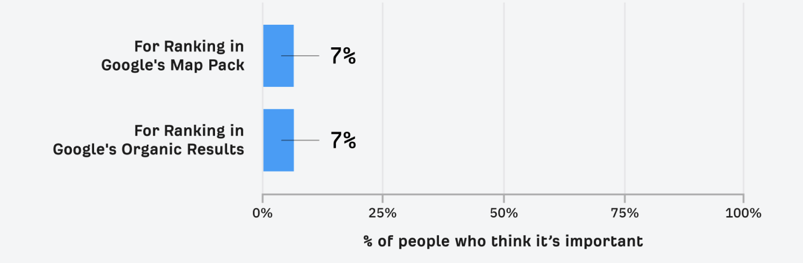

换句话说，它们仍然有一定重要性——但不如过去那么重要。

自 2014 年以来，SEO 从业者对引用的重要性认知一直在下降。

引用信号的重要性认知随时间推移的变化趋势

|  | 2013 | 2014 | 2015 | 2017 | 2018 | 2020 | 2021 |
| --- | --- | --- | --- | --- | --- | --- | --- |
| 本地包 / Local Finder | 18% | 20% | 17% | 13% | 11% | 7% | 7% |
| 本地化自然搜索结果 | 11% | 11% | 10% | 8% | 9% | 6% | 7% |

来源：BrightLocal

即便如此，引用仍然有助于搜索用户在网上发现您的商家。这是因为目录网站往往会在本地搜索结果中获得排名。因此，只要您的信息出现在这些目录中，那些从搜索结果中点击目录的用户就有可能找到您的商家。

以下是一些最佳实践：

*   提交到其他主流平台（以美国为例，如 Apple Maps、Yelp、Yellow Pages、Bing Places 和 Facebook）

*   向您所在地区和行业的其他热门目录网站提交商家信息

*   确保您的引用信息（名称、地址、电话号码）在所有平台上保持一致

#### 延伸阅读

提示

以下是快速查找行业和本地目录的方法：

1

2

前往 **Link Intersect**

3

输入您所在地区的几家竞争对手的主页网址

4

将所有目标的搜索模式设置为“URL”

5

点击“显示链接机会”

这将显示那些链接到一个或多个竞争对手、但并未链接到您的网站。

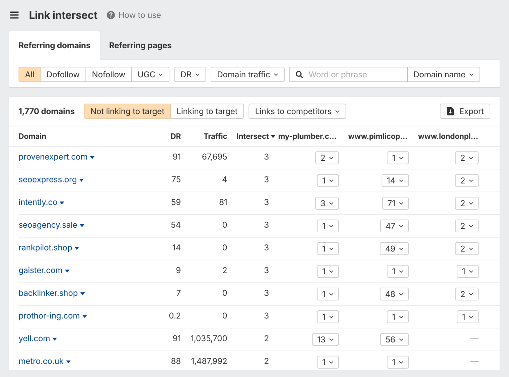

如果一个网站链接了很多竞争对手，那么它很可能是一个目录站点，您也可以在其中添加自己的商品 Listing。

### 进行本地关键词分析

本地关键词分析是了解人们如何搜索您所提供的本地服务的过程。

这很重要，因为您需要针对用户的实际搜索意图进行优化。

接下来我们来看看如何实现这一点。

#### 挖掘与服务相关的关键词

大多数人往往不会去思考，用户可能会用哪些不同的搜索方式来寻找他们的产品或服务。

例如，如果您是一名水管工，有些客户会直接在 Google 中搜索“plumber（水管工）”找到您，而另一些客户则会搜索与具体服务相关的词，比如“drain unblocking（疏通下水道）”。

因此，您应首先通过头脑风暴列出您所提供的服务。这将有助于您在客户搜索的相关查询中获得最大化的曝光度。

下面是以水管工为例展示的可能呈现的效果：

*   疏通下水道

*   锅炉维修

*   锅炉安装

*   锅炉保养

*   暖气片安装

*   爆裂水管维修

要扩展这份列表，可以将这些服务关键词作为“种子词”，进一步挖掘用户正在搜索的更多相关服务。

例如，将上述服务导入 Ahrefs 的 [Keywords Explorer](https://ahrefs.com/zh/keywords-explorer)，并查看 **词匹配** 报告，我们会看到如下关键词：

*   燃气锅炉安装

*   组合式锅炉安装

*   电锅炉安装

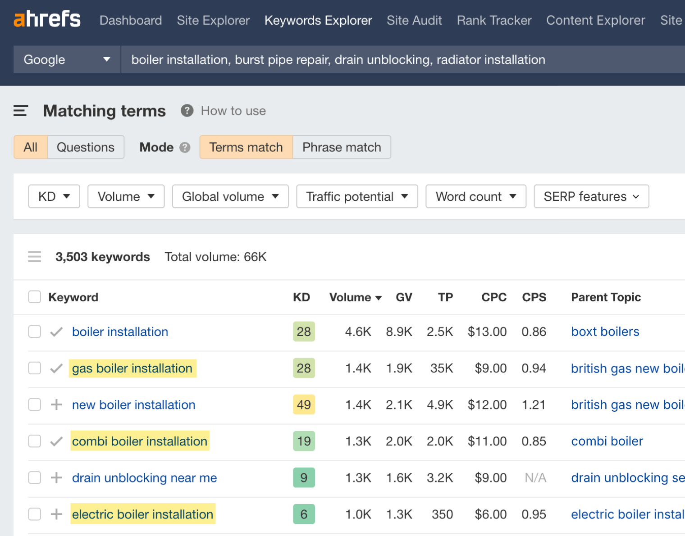

如果您有提供此类服务，不妨也把这些关键词纳入优化范围。

下面是另一种查找“遗漏”关键词的方法：

将竞争对手的商家信息输入 Ahrefs 的 [Site Explorer](https://ahrefs.com/zh/site-explorer)中，进入 **热门页面**报告，并查找与其服务内容相对应的 URL。

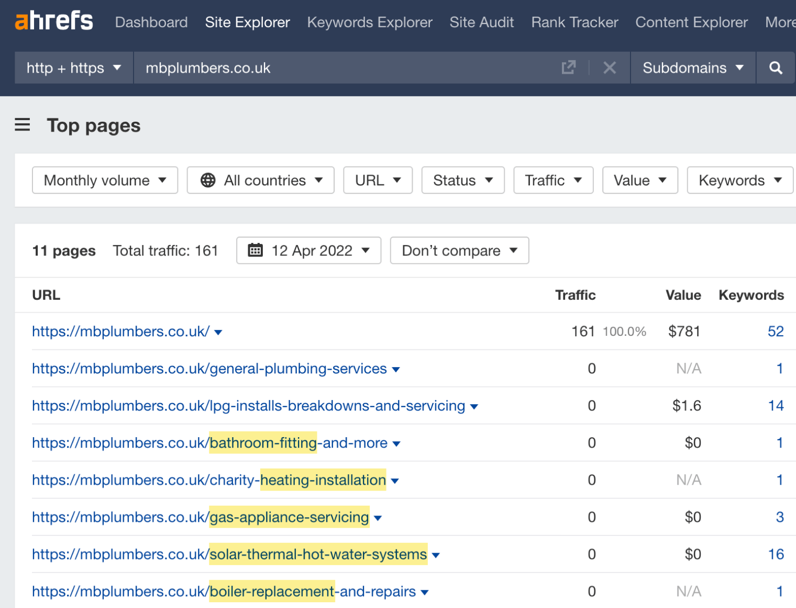

#### 查看搜索量

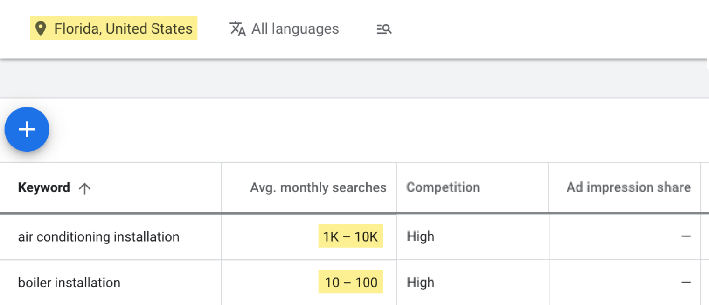

不过，Keyword Planner 也存在一些不足之处：

*   它显示的是宽泛的搜索量范围（例如 1K–10K），而非精确数值。

*   它会对关键词进行分组，并显示合并后的搜索量（取整数值）。

因此，在全国层面查看关键词的相对热度通常更具成效。因为一座城市的情况，往往与另一座城市大致相似。

您可以使用像 Ahrefs 的[Keywords Explorer](https://ahrefs.com/zh/keywords-explorer) 这样的关键词分析工具来完成此操作。

例如，该工具告诉我们，在英国搜索“boiler repair”（锅炉维修）的人数多于搜索“boiler installation”（锅炉安装）的人数：

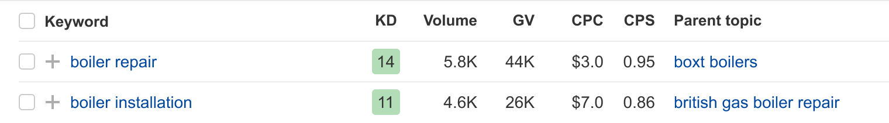

无论在哪个城市，这种情况大概率都是成立的，因此这是为关键词排定优先级的绝佳方法。

#### 判断是否具有本地搜索意图

本地搜索意图意味着搜索用户希望在附近购物。如果您的服务不符合这一点，那就不是本地 SEO 机会。

要判断某个查询是否具有本地搜索意图，可在 Google 中搜索该词并查看搜索结果。

如果搜索结果中出现地图包和/或一些本地“蓝色链接”，则说明该查询具有本地搜索意图。

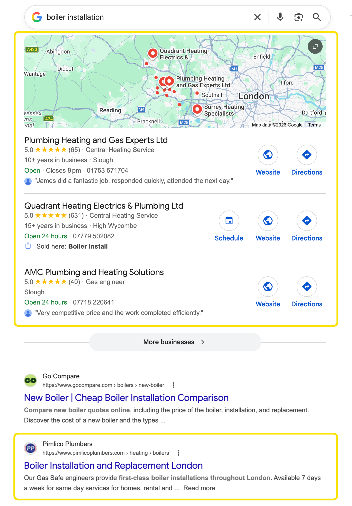

如果搜索结果页中没有地图包和本地“蓝色链接”，则说明该查询不具备本地搜索意图。

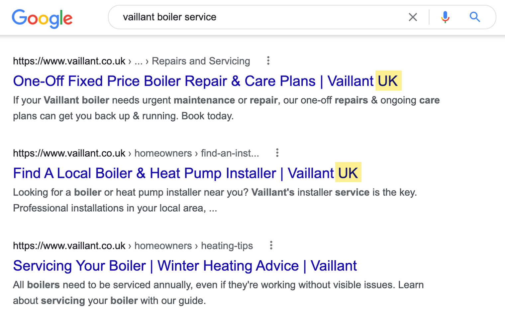

虽然可以针对无本地搜索意图的关键词进行布局，但这并非本地 SEO 的职责。

#### 给页面分配对应的关键词

您的主页不太可能覆盖所有服务关键词并获得排名。因此，您需要为部分关键词创建单独的页面进行优化。

在为 URL 分配关键词时，应考虑这些关键词对应的是哪些服务。

如果它们对应的是完全不同的服务，例如“boiler installation（锅炉安装）”和“burst pipe repair（爆裂水管维修）”，则应将它们分配到不同的页面。

如果它们对应的是同一项服务，例如“drain unblocking（疏通下水道）”和“drain unclogging（疏通排水管）”，则将它们分配到同一个页面。

您可以在下方的本地关键词分析指南中了解更多关于此流程的信息。

#### 延伸阅读

### 获取更多反向链接

链接就像来自其他网站对您网站的投票。

BrightLocal 的研究显示，31% 的 SEO 从业者认为，链接是常规自然搜索排名中最重要的信号；而对于地图包排名，持相同看法的从业者比例则为 13%。

有多少 SEO 从业者认为链接是最重要的排名因素？

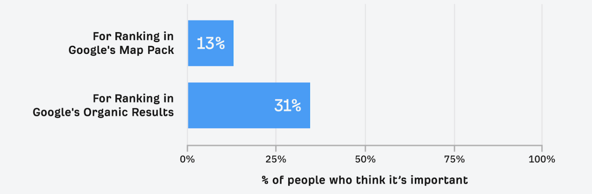

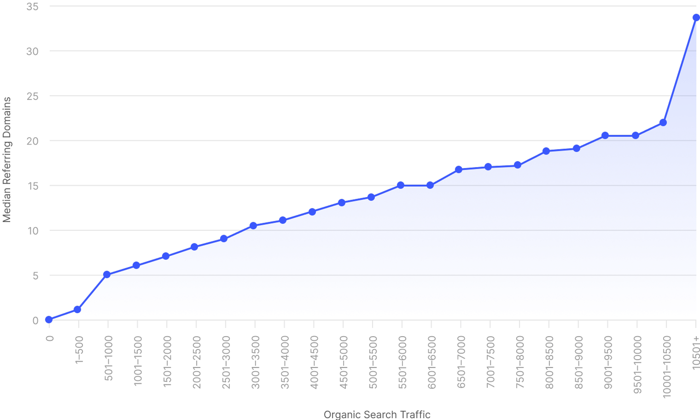

随着时间的推移，链接对于“常规”本地排名的重要性认知也在不断提高。但在“地图包”排名中的重要性认知则基本保持不变。

链接的重要性认知随时间推移的变化趋势

|  | 2013 | 2014 | 2015 | 2017 | 2018 | 2020 | 2021 |
| --- | --- | --- | --- | --- | --- | --- | --- |
| 本地包 / Local Finder | 12% | 12% | 15% | 17% | 17% | 15% | 13% |
| 本地化自然搜索结果 | 24% | 25% | 25% | 29% | 28% | 31% | 31% |

来源：BrightLocal

以下是一些最佳实践：

*   从其他排名靠前的网站获取链接

*   获取竞争对手已有的链接资源（通过 Ahrefs 的 [Link Intersect 工具](https://ahrefs.com/zh/link-intersect) 来实现） 
*   获取本地引用（这些通常包含链接）

*   通过将旧版页面重定向到新版页面，重新获取丢失的链接

#### 延伸阅读

### 改进页面 SEO 优化

页面 SEO 是指通过对页面内容进行优化和调整，从而帮助其在自然搜索结果中获得更高排名。

BrightLocal 的研究显示，34% 的 SEO 从业者认为，页面信号是常规自然搜索中最重要的因素；16% 的人认为它是地图包排名中最重要的因素。

有多少 SEO 从业者认为页面 SEO 是最重要的排名因素？

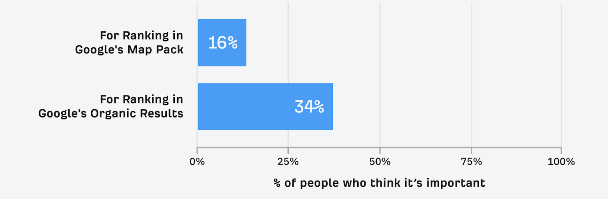

页面信号在本地 SEO 中的重要性认知也在不断提升。这一点可以从 BrightLocal 以往的调查结果中看出。

页面信号重要性认知随时间推移的变化趋势

|  | 2013 | 2014 | 2015 | 2017 | 2018 | 2020 | 2021 |
| --- | --- | --- | --- | --- | --- | --- | --- |
| 本地包 / Local Finder | 18% | 15% | 14% | 14% | 14% | 15% | 16% |
| 本地化自然搜索结果 | 27% | 27% | 26% | 24% | 26% | 32% | 34% |

来源：BrightLocal

以下是一些最佳实践：

*   围绕搜索意图优化页面

*   在您的网站上添加 NAP 信息

*   加入对搜索用户而言重要的细节

提示

一种了解搜索用户所关注的细节的方法，是查看您所在领域排名靠前的页面都在讨论什么。您可以直接浏览这些页面，或者使用 [Keywords Explorer](https://ahrefs.com/zh/keywords-explorer) 来查找这些高排名页面中提到的关键词。

具体操作方法如下：

1

输入[服务关键词] [地点]（例如：“boiler repair london（伦敦锅炉维修）”）

2

前往**相关术语**报告

3

点击“同时提及”和“前十名”的开关按钮

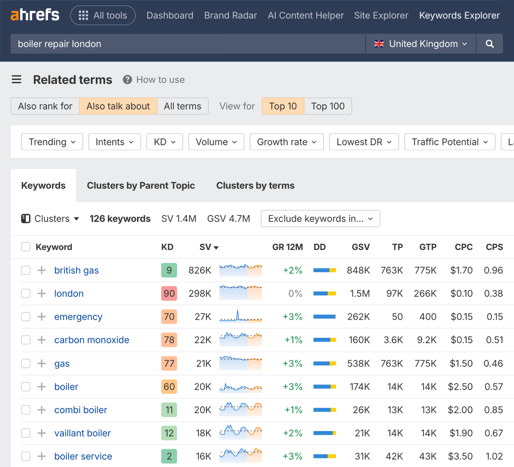

以下是“boiler repair london（伦敦锅炉维修）”排名靠前的页面中经常提及的一些关键词，以及它们可能传达的含义：

*   **“gas safe（燃气安全）”** —— 搜索该关键词的用户，很可能是想找一位在 Gas Safe Register（英国官方燃气安全机构）中注册的工程师。

*   **“greater london（大伦敦）”**——搜索该关键词的用户，很可能是想知道商家是否在其所在地区提供该服务。

*   **“gas boiler（燃气锅炉）”** —— 搜索该关键词的用户，很可能是想了解该商家是否能维修他们所使用的锅炉类型。

*   **“emergency call”（紧急呼叫）**——搜索该关键词的用户，很可能是想知道商家是否提供紧急上门服务。

建议在页面中提及这些内容。

#### 延伸阅读

* * *

第6部分

## 本地 SEO 工具

最后，再为您推荐几款实用的本地 SEO 工具。

### Google Business Manager

### Google Search Console

### Ahrefs Rank Tracker

[Rank Tracker](https://ahrefs.com/zh/rank-tracker) 支持按国家、州、城市，甚至邮政编码跟踪多达 10,000 个关键词在“常规”自然搜索中的排名。

### Ahrefs Link Intersect

### Grid My Business

[Grid My Business](https://gridmybusiness.com/) 可以展示您商家周边区域内某个关键词的地图包排名位置。该工具采用免费增值模式，有助于了解本地搜索用户是否以及在何处可能看到您的商家。

### Yext

[Yext](https://www.yext.com/solutions/marketing/location-listings) 是一款在多个列表之间同步和管理商家信息的工具。它有助于保持引用信息的一致性，当然也可以手动完成这些操作。

### Google Keyword Planner

* * *

## 了解更多关于本地 SEO 的内容

至此，相信您已经较好地理解了本地 SEO 的基本原理。如需进一步深入学习，可参考以下资料：
