Title: 页面 SEO：面向爬虫与读者的优化指南

URL Source: https://ahrefs.com/zh/seo/on-page-seo

Published Time: Tue, 21 Jul 2026 02:17:13 GMT

Markdown Content:
页面 SEO 是对博客文章及网页进行优化的过程，旨在提升其搜索排名和 AI 可见度。

页面 SEO 极其重要，因为对页面进行微小的调整就可能对其排名、流量以及在 AI 中的曝光产生重大影响。

以下是一个真实的案例：我们的一篇博客文章仅通过修改标题中的一个单词，就在搜索结果中攀升了 7 位。

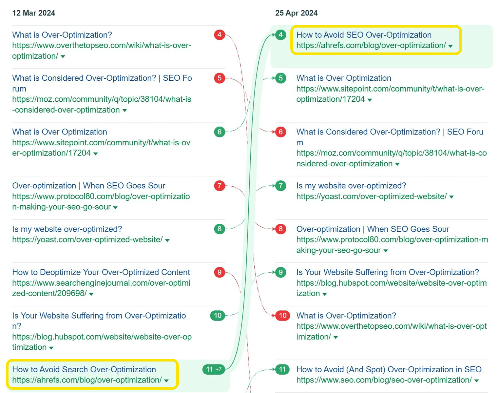

页面 SEO 就像蛋糕上的糖霜。要充分发挥其效果，你需要有用且准确的内容，并确保它符合目标关键词的搜索意图。（我们在[上一章](https://ahrefs.com/zh/seo/seo-content)有一篇关于这个主题的指南。）

而且，页面优化不仅仅是为了在搜索引擎中获得更多曝光。

如今，人们越来越多地使用 AI 来获取答案。

许多帮助你在搜索结果中获得高排名的最佳实践，现在[同样也能帮助你出现在 AI 的回答中](https://ahrefs.com/zh/blog/geo-is-just-seo/)。

这意味着，页面 SEO 的重要性更胜往昔。

在此基础上，下面是一些实用的页面优化技巧，可以帮助你提升排名并获得更好的搜索流量表现：

提示

页面 SEO 指的是我们可以直接在页面上进行的优化改进。而任何有助于提升搜索表现、但无法直接在页面上修改的内容，则被称为[页面外 SEO](https://ahrefs.com/seo/glossary/off-page-seo)。

* * *

第1部分

## 在相关位置植入目标关键词

在页面的核心元素中植入目标**关键词**，能帮助 Google、AI 助手（如 ChatGPT 和 Gemini）以及你的读者理解页面的主题。

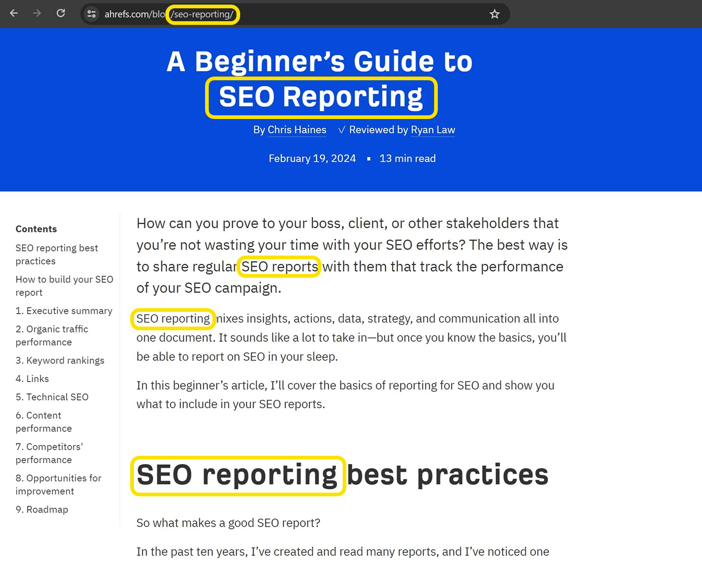

但如今的搜索引擎对**主题**和**用户意图**的理解已经远超以往。

也就是说，SEO 不再只是简单地重复某个精确的关键词了。

它的核心在于全面覆盖主题，并精准匹配用户的搜索内容。

这一点对于 AI 可见度尤为关键——像 ChatGPT 和 Perplexity 这样的 AI 助手，本身就是为了理解词汇与主题之间的联系而构建的。

因此，它们在生成回答时会优先选择那些[全面覆盖主题](https://metehan.ai/blog/chatgpt-is-using-reciprocal-rank-fusion-rrf/?s=09)的内容。

你页面的核心主题是什么？

一旦明确了这一点，就要确保在搜索引擎和 LLM 重点检索的位置清晰地给出指引。

这意味着你的目标关键词 _仍然应该_ 出现在关键位置，以建立主题相关性，例如：

*   **页面标题**

*   **URL**

*   **主标题** (H1)

*   **副标题**（部分 H2、H3 等）

*   **引言段落**

……但与此同时，你的内容还需要涵盖相关概念，并回答用户的常见问题。

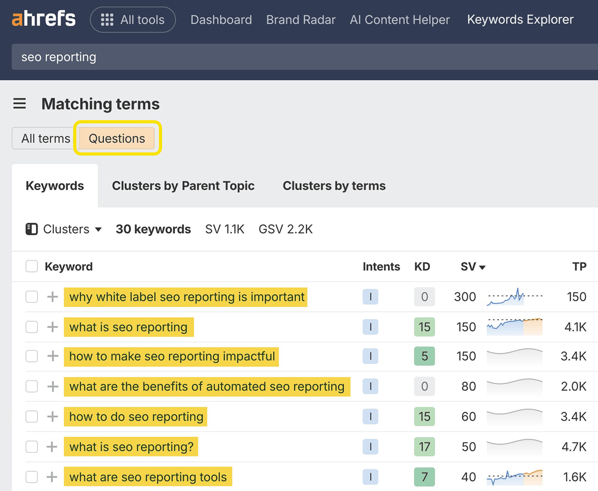

* * *

第2部分

## 使用标题标签构建页面结构

HTML 标题标签能帮助 Google 和 AI 助手理解页面内容，同时能将内容拆分为逻辑清晰、易于读者快速浏览的段落。

在页面代码中，标题标签通常如下所示：<h2>此处为标题</h2>。你可以使用 [Ahrefs Toolbar](https://ahrefs.com/zh/seo-toolbar) 快速查看页面的标题标签使用情况：

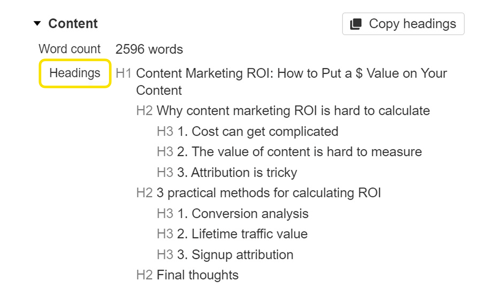

一般来说，建议遵循以下原则：

*   **每个页面仅使用一个 <h1> 标签**

*   **使用 <h2> 标签来标记页面的主要论点。**

*   **使用 <h3> 标签（及更低层级标签）来标记支撑主要论点的部分，例如示例或相关观点。**

另外，合理使用副标题可以显著提升内容的可读性，让读者能够一目了然地了解各个部分的内容：

标题（包括 H1 标签）通过建立层级来提升用户体验

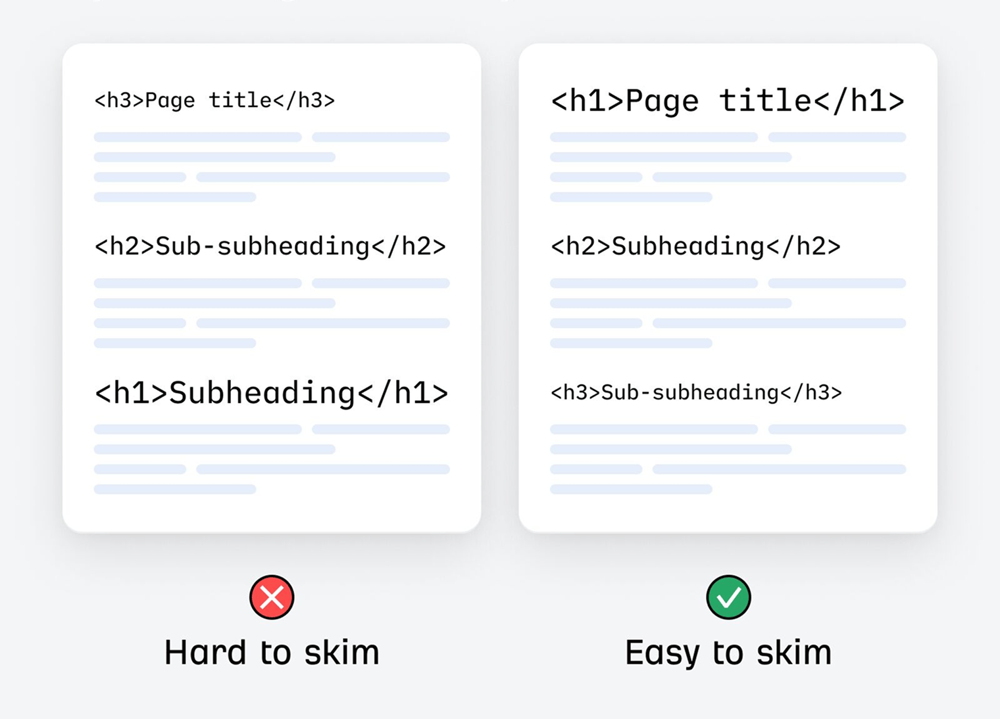

* * *

第3部分

## 撰写具有吸引力的标题标签

标题标签往往是受众在决定是否[点击你的网站](https://developers.google.com/search/docs/advanced/appearance/title-link)时参考的核心信息。

Google 有 [61.6% 的概率](https://zyppy.com/seo/title-tags/google-title-rewrite-study/)会重写标题标签（最常见于过短或过长的标题）。但这些通常只是小幅调整，Google 在排名过程中仍会参考[你的原始标题](https://www.linkedin.com/feed/update/urn:li:activity:7356991147728064512?commentUrn=urn%3Ali%3Acomment%3A%28activity%3A7356991147728064512%2C7357444238667571200%29&dashCommentUrn=urn%3Ali%3Afsd_comment%3A%287357444238667571200%2Curn%3Ali%3Aactivity%3A7356991147728064512%29)，因此，花时间将其打磨得尽可能吸引人是非常值得的。

此外，页面标题标签会影响 AI 在对话中如何识别及引用你的品牌。

以下是撰写标题的一些技巧：

*   **保持简短**——最好控制在 70 个字符以内，以避免被截断。

*   **匹配搜索意图**——告诉用户，你能提供他们想要的内容。

*   **利用**[**好奇心缺口**](https://ahrefs.com/zh/blog/how-to-write-a-headline/)——但切勿制造与文章内容不符的误导性标题。

*   **植入关键词**——如果语义更自然，也可以使用关键词的近义变体。

*   **针对有时效性的主题标注年份**——例如 _2026 年税收减免_。

*   **突出差异化**——展现幽默感，或对 SERP 中的其他文章做出回应。

*   **如果拿不准，请套用 ABC 公式**——Adjective（形容词）、Benefit（利益）、Confidence booster（信任强化）。

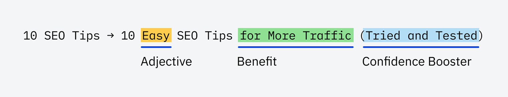

你应该为每个可被索引的页面设置标题标签。如果需要的话，可以使用 [**Ahrefs 的 Site Audit**](https://ahrefs.com/zh/site-audit) 查找标题标签存在问题的页面（如标题为空或过长）。注册并抓取你的网站后（[免费](https://ahrefs.com/zh/free)），进入 **Content** 报告即可查看问题。

这里我们可以看到有 226 个页面标题过长，存在被截断的风险：

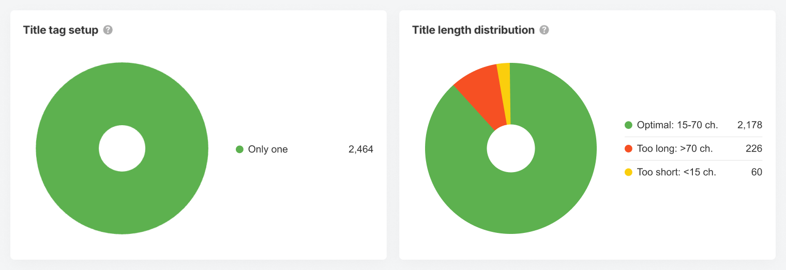

为了节省时间，你还可以使用 Ahrefs Site Audit 中的 Patches 功能批量生成标题标签。

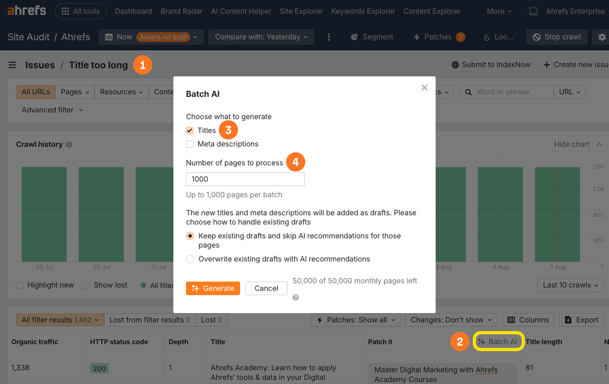

* * *

第4部分

## 撰写引人入胜的元描述

元描述本身[并不是排名因素](https://developers.google.com/search/blog/2009/09/google-does-not-use-keywords-meta-tag)，但它们能带来更多点击和流量。这是因为 Google 在 [37.22%](https://ahrefs.com/zh/blog/meta-description-study/) 的情况下会将其作为搜索结果中的描述性摘要，而其余情况下则会使用页面中的其他内容。

因此，没必要执着于为每个页面都打造完美的元描述，只需集中精力为重要页面编写高质量描述即可，比如首页或搜索流量很高的页面。以下是一些编写建议：

*   **保持简短**——最好控制在 160 个字符以内。

*   **对标题标签进行补充**——包含标题中未能涵盖的额外信息。

*   **匹配搜索意图**——进一步强化用户真正关心的内容。

*   **使用主动语态**——直接与用户对话。

*   **植入关键词**——Google 常常会在搜索结果中将其加粗显示。

元描述长期以来一直是页面 SEO 的基础要素，即便到了今天——甚至在涉及 AI 可见度时——它们依然至关重要。

[ChatGPT 在选择](https://www.linkedin.com/feed/update/urn:li:activity:7339191681256177664/)最佳引用来源以生成回答时，会基于以下内容进行筛选：

1

URL

2

标题

3

摘要（通常就是**元描述**）

4

排名位置

5

元数据（如发布日期）

除了第 4 项之外，其余的都是你在 2025 年仍需重点关注的页面 SEO 因素。

如果你想为其他所有页面批量创建元描述，可以再次尝试 Patches 功能。

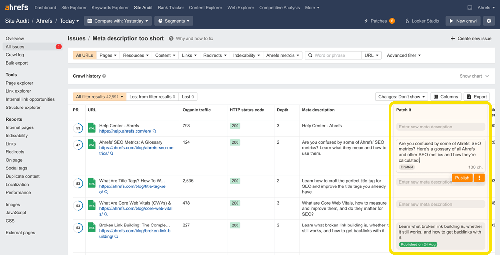

该工具会生成成千上万条可用的候选描述，供你自由选择或进一步优化。

* * *

第5部分

## 设置 SEO 友好型 URL

使用简短、描述性强的 URL 结构来突出页面的核心主题是非常有帮助的。正如 Google 在其 [SEO 入门指南](https://developers.google.com/search/docs/fundamentals/seo-starter-guide#use-descriptive-urls)中所解释的：

_“URL 的部分内容可以在搜索结果中以面包屑导航显示，因此用户也可以通过 URL 来判断某个搜索结果是否对他们有用。”_

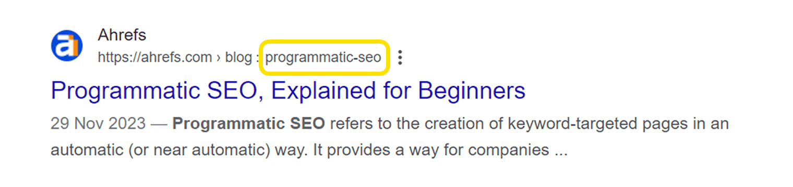

我们建议将目标关键词作为 URL 的后缀，就像我们在 Ahrefs 博客中所做的那样：

| #### 页面标题 | #### 目标关键词 | #### URL 后缀 |
| --- | --- | --- |
| [SEO 代理机构软件（我亲测有效的工具）](https://ahrefs.com/zh/blog/seo-agency-software/) | seo agency software | /blog/seo-agency-software/ |
| [特许经营 SEO：面向特许经营品牌的本地与全国增长策略](https://ahrefs.com/zh/blog/franchise-seo/) | franchise seo | /blog/franchise-seo/ |
| [SEO 趋势 2024：去伪存真](https://ahrefs.com/zh/blog/seo-trends/) | seo trends | /blog/seo-trends/ |
| [如何推广你的博客（其实只有三种方法）](https://ahrefs.com/zh/blog/how-to-promote-your-blog/) | how to promote your blog | /blog/how-to-promote-your-blog/ |

在 URL 中加入关键词并不会像施了魔法一样瞬间提升搜索表现，但它能让读者相信你的页面与他们的查询高度相关。

（而且当你在日后更新旧内容时，也更容易回想起当初的目标关键词。）

简短、描述性强的 URL 最有利于 SEO

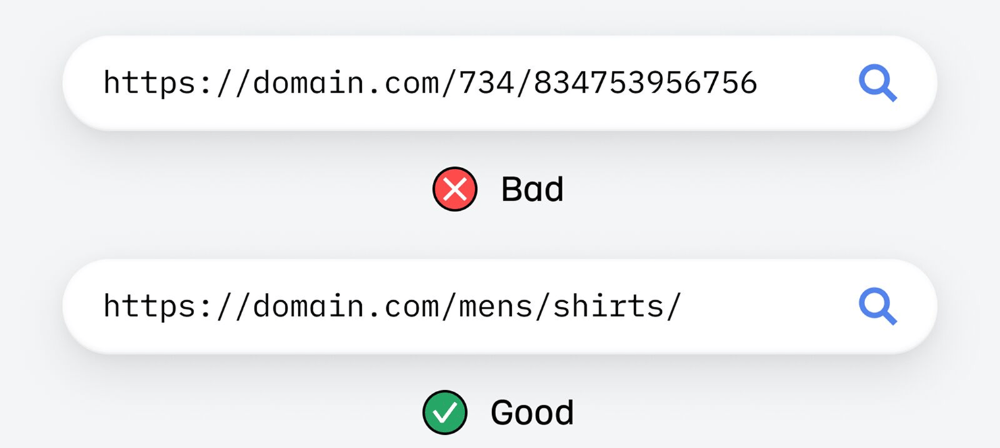

在选择 URL 时，建议注意以下几点：

*   **避免包含日期（除非确有必要）：**_/best-seo-tools-2026_ 虽然在今年是合理的，但如果你明年还想更新该文章，就可能向用户传递错误的信息。

*   **不必在意功能词：**像 _for、and_ 或 _to_ 这类词完全可以从 URL 中剔除。

*   **让 URL 简洁且易读：**_domain.com/article/keyword-research-guide_ 显然优于 _domain.com/2026/03/21/article-keyword-research_。

* * *

第6部分

## 在有用之处添加内链

如果你的网站上有相关页面，请务必进行链接。[内链](https://ahrefs.com/seo/glossary/internal-link)不仅能帮助访客更顺畅地浏览网站，增加他们找到所需信息的几率，对 SEO 也有诸多益处。

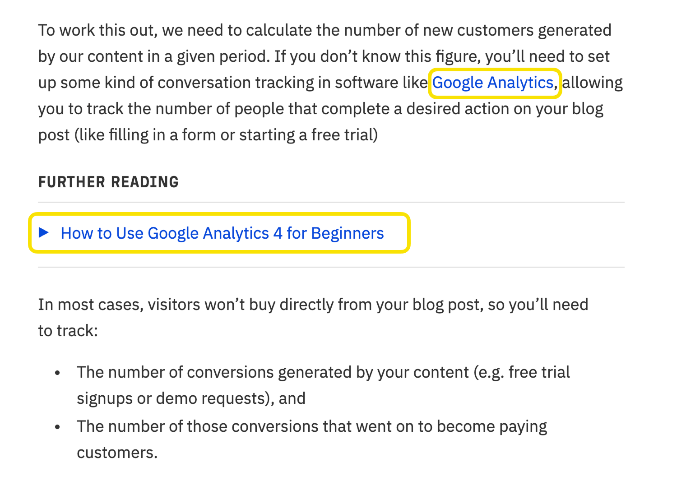

内链能帮助搜索引擎和 AI 爬虫发现你网站上的所有页面，理解每个页面的主题（以及它们彼此之间的关系），并突出你[认为最重要](https://ahrefs.com/zh/blog/internal-links-for-seo/)的页面。同时，这些链接还会在页面之间传递[链接权重](https://ahrefs.com/zh/blog/google-pagerank/)。

添加内链时的建议：

*   **使用相关的锚文本**，但要保持自然，切勿在锚文本中堆砌关键词。

*   **链接到最重要的页面**，比如产品页、服务页，或最优质的博客文章。

*   **使用**[**中心辐射模型**](https://ahrefs.com/zh/blog/content-hub/)，确保最重要的“核心”页面获得应有的链接权重。

您可以使用 Google 的 _site:_ 搜索运算符，快速找到适合添加链接的相关页面。只需在网站中搜索目标关键词（加上引号以查找完全匹配的结果），Google 就会显示所有包含该关键词且已被收录的页面：

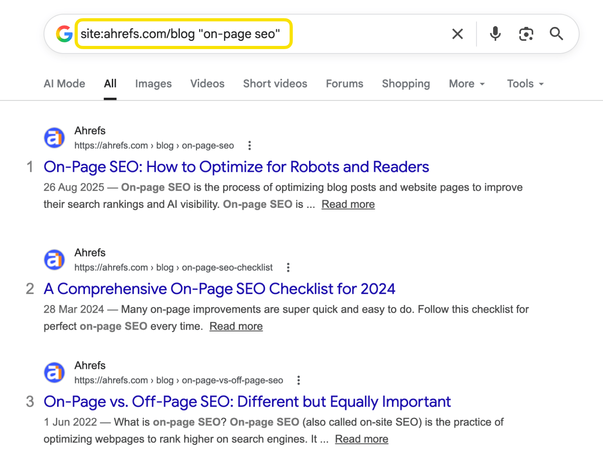

或者，你也可以使用 Ahrefs 的 **Site Audit** 实现自动化操作：

*   进入**内链机会**报告

*   在搜索框中输入你新发布页面的 URL

*   在下拉菜单中选择“来源页面”

按下回车键，你将会看到一系列推荐的内链机会。

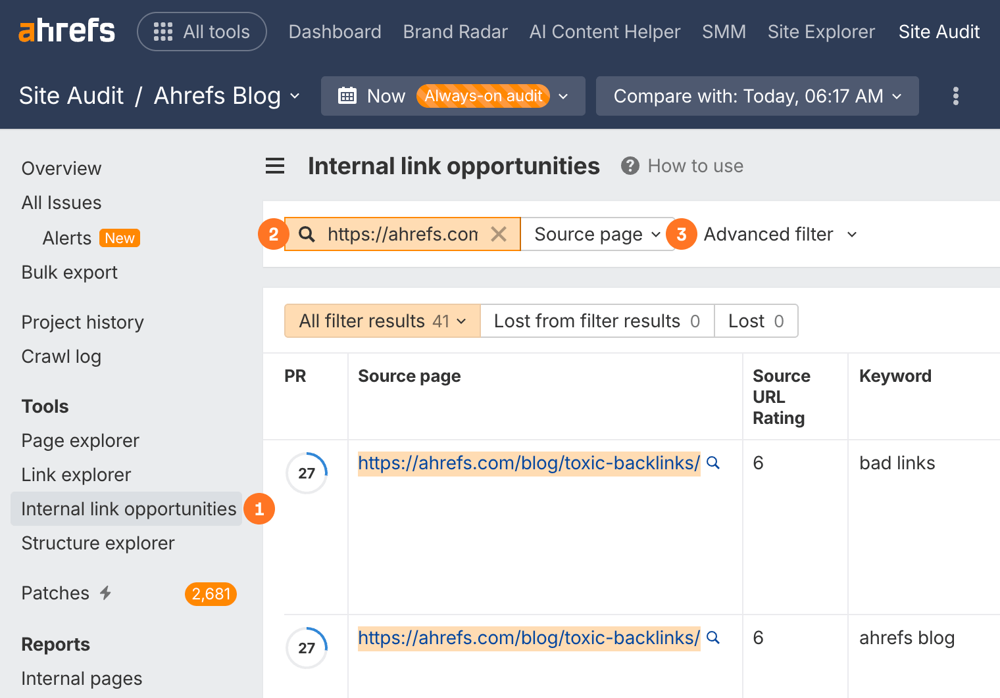

例如，这份报告建议从我们一篇关于 _有害反向链接_ 的文章链接到我们另一篇关于 _坏链接_ 的指南：

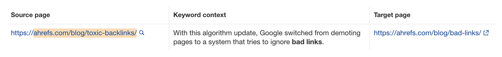

此外，内链还能帮助集成了搜索功能的 AI 助手发现相关主题和信息，从而更好地生成回答。

关于内链的详细说明请参阅我们的完整指南：[SEO 内链：实操指南](https://ahrefs.com/zh/blog/internal-links-for-seo/)。

* * *

第7部分

## 添加外部链接

[Google 表示](https://www.youtube.com/watch?v=58zaiOx7TM4&t=25s)，链接到其他网站是为用户提供价值的绝佳方式

当你想要引用网络上的其他信息，或将读者引导至权威的第三方信息来源时，添加外部链接都是明智之举。

我们在 Ahrefs 博客中就经常这样做：

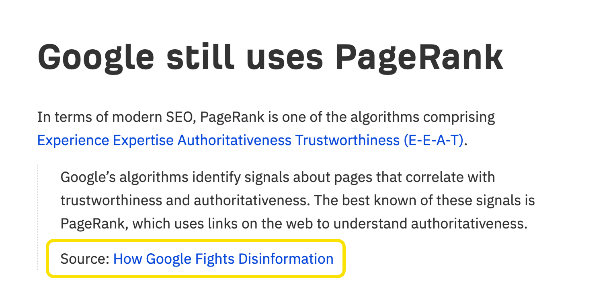

随着时间的推移，一些外部链接会因为目标页面被重定向或删除而失效，从而影响用户体验。你可以使用 **Site Audit** 找出并修复这些失效链接：只需为你的网站设置定期抓取，并在抓取报告中监测**存在失效链接的页面**问题即可。

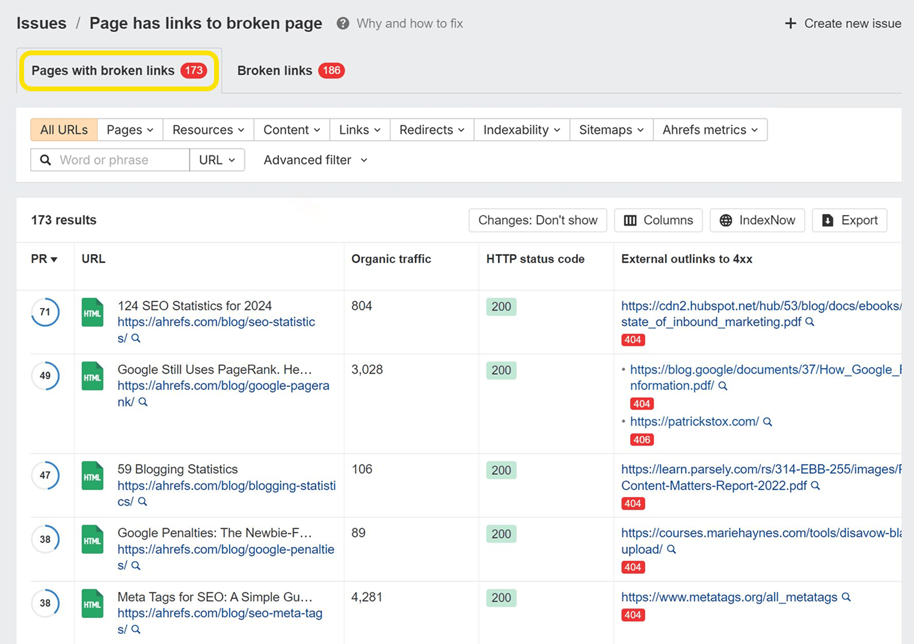

* * *

第8部分

## 优化你的图片

页面中的图片不仅可以在 Google 图片搜索中获得排名，还可能出现在 AI 搜索结果中，从而为你带来更多流量。

优化图片需要做好以下三件事：

*   **压缩图片：**压缩图片可以减小文件体积，从而加快页面加载速度。市面上有很多此类工具，ShortPixel 是个不错的选择。

*   **使用描述性的文件名：**Google 表示，文件名可以帮助其理解图片内容。[9] 因此，dog.jpg 会优于 IMG_859045.jpg。一般来说，要描述清楚、简洁明了，避免关键词堆砌。

*   **使用描述性的 alt 文本：**Alt 文本的主要目的是为使用屏幕阅读器的访客提升无障碍体验，但 Google 也会通过 alt 文本（替代文本）来理解图片的主题。[9] 这是一个 HTML 属性，代码形式如下：__

Alt 文本能帮助 AI 和搜索引擎爬虫理解图片内容，从而更好地对你的内容进行排名或引用。

你可以使用 Ahrefs **Site Audit** 中的**图片报告**来检查网站中缺失 Alt 文本的图片（以及其他潜在优化机会，例如图片过大等）：

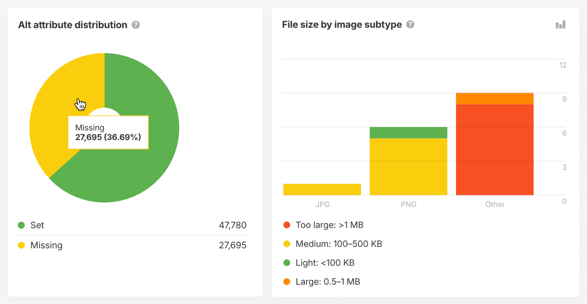

* * *

第9部分

## 填补内容差距

通过填补文章中的“内容差距”往往可以提升排名。所谓内容差距，是指其他文章已经覆盖、但你尚未涉及的重要信息。

添加新章节来补充这些缺失的信息，不仅能帮助你在更多[长尾关键词变体](https://ahrefs.com/zh/blog/long-tail-keywords/)上获得排名，还能增强核心关键词的竞争力。

这对 AI 可见度同样至关重要。

当用户向 ChatGPT 询问“健康早餐建议”时，AI 并不只是进行关键词匹配，而是会通过一种名为“**query fan-out**”的过程扩展出一系列相关问题，例如：

*   _哪些早餐既快速又健康？_

*   _早上吃什么最健康？_

*   _鸡蛋算健康的早餐吗？_

*   _有哪些高蛋白早餐选择？_

*   _早餐我应该避免吃什么？_

即便某个页面的排名不高，只要它能回答[大量相关问题](https://metehan.ai/blog/chatgpt-is-using-reciprocal-rank-fusion-rrf/?s=09)，那么它被 AI 引用的概率会远高于一个内容单一的高排名页面。

我们的 [**AI Content Helper**](https://ahrefs.com/zh/ai-content-helper) 能根据当前的搜索排名情况，帮你精准锁定内容差距。

在下面这个示例中，我们只需输入已发布的 URL 和目标关键词。

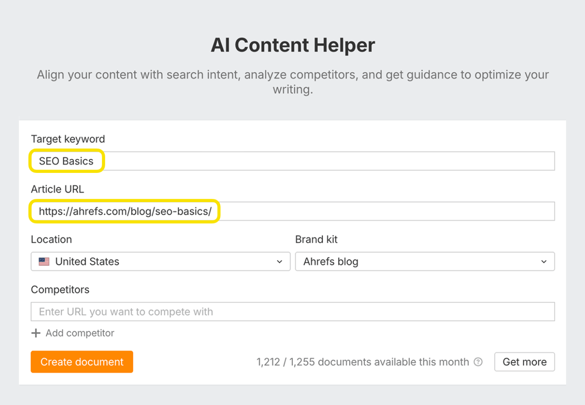

随后，**AI Content Helper** 会根据文章对宏观主题的覆盖程度进行评分。

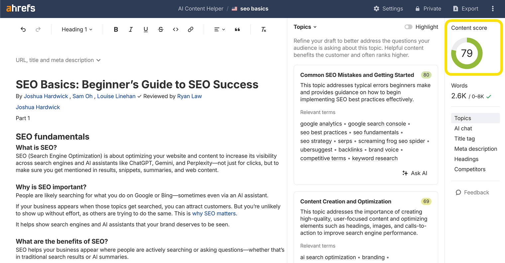

这个工具对于提升搜索排名**以及** AI 可见度均大有裨益。

它[采用与 AI 模型相同的机制](https://www.linkedin.com/posts/thinkingslow_tip-if-you-want-to-optimize-your-content-activity-7341461334921732098-QAVH/)来解读你的内容，并对主题覆盖度进行 100 分制评分。

接着，它会建议可以纳入的子主题，以进一步丰富文章内容。

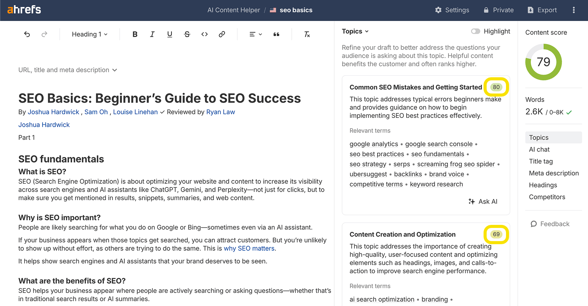

你还可以开启“高亮”功能，对具体内容进行逐段优化，并实时查看评分变化。

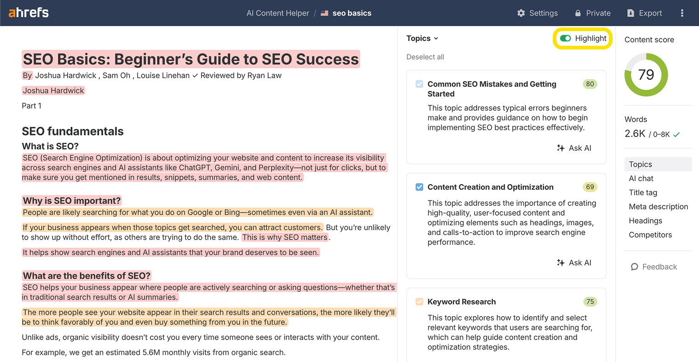

* * *

第10部分

## 展示你的经验与专业性

Google 的[质量评分者指南](https://developers.google.com/search/blog/2022/12/google-raters-guidelines-e-e-a-t)鼓励作者在内容中展现“[EEAT](https://ahrefs.com/zh/blog/eeat-seo/)”，即 _专业性、经验、权威性_ 和 _可信度_。

这些指南主要供 Google 的质量评分者使用。虽然它们并非直接的排名因素，但明确揭示了 Google 旨在褒奖的内容类型。你可以通过以下几种方式强化你的 EEAT：

*   **在作者简介中展现相关专业背景：**这对所谓的 YMYL (Your Money or Your Life) 主题尤其重要。例如，医疗内容应由医疗专业人士审核，投资建议应由具备资质的投资者提供，等等。

*   **加入专家引述：**当你的专业素养不足以支撑该主题的权威性时，可以去寻求 _真正_ 专家的观点和反馈（尤其是在医疗保健或会计等需要特定认证和资质的领域）。

*   **亲身实践：**如果你要写如何冲煮浓缩咖啡，就真的去煮上几百杯。要评测免费的 CRM 软件？那就下载、安装，再花几个小时体验每个选项。如果你不愿意做到这种程度，很可能会被愿意这么做的人打败。

*   **展示证据：**向读者（以及 Google）证明你确实做过你所讲的事情。可以在作者简介中加入相关经验，并附上记录你实际经历的原创照片和视频。

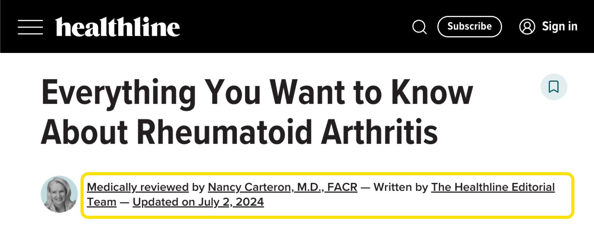
这是一个作者简介的示例，展示了其与文章主题相关的专业背景。

* * *

第11部分

## 针对零点击搜索进行优化

随着用户可以直接通过[精选摘要](https://ahrefs.com/zh/blog/featured-snippets/)、[AI Overviews](https://ahrefs.com/zh/blog/google-ai-overviews/)以及 AI 模式获取即时答案，点击量与流量正在迅速消失——这种现象被称为“[零点击搜索](https://ahrefs.com/zh/blog/zero-click-search/)”。

不过，让你的网站入选 AI 的回答，仍然能帮助你的品牌触达更多受众。

目前并没有稳操胜券的方法来夺取这些展示位，但整体排名表现依然是最重要的因素。

一般来说，如果你的文章包含与零点击功能生成的回答相似的文本，那么你入选的机会就会大大增加。

例如，使用[陈述句](https://seonotebook.notion.site/Introducing-SnippetBrain-1248c368519180ce8de5fee211e300b2)写作，并在文章开头尽早亮出核心观点，都有助于提升出现概率。

像 AI Overviews 和精选摘要这类富媒体答案，旨在提供简单、具体的回答，因此会优先选取简洁、明确的文本进行引用或改写。

提升你在 AI Overviews 中存在感的一个可行方法，是向那些已经被引用的竞品页面学习。

只需在 [Ahrefs Brand Radar](https://ahrefs.com/zh/brand-radar) 的 AI Responses 中搜索竞争对手的域名。

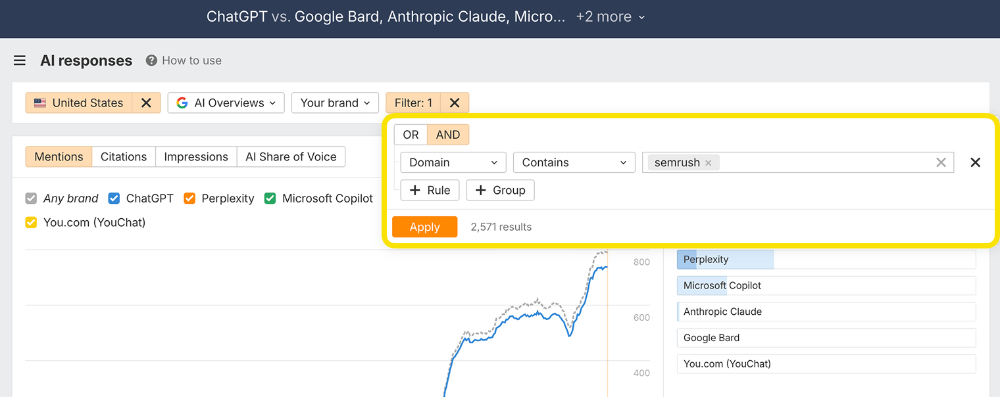

然后，为自己的域名添加一个“不包含”的负向过滤条件，这样你就能看到哪些 AI Overviews 引用了竞争对手，而你却缺席了。

在这个例子中，我们通过添加关键词“Tool”进一步筛选，以锁定高价值、处于营销漏斗底端的搜索词。

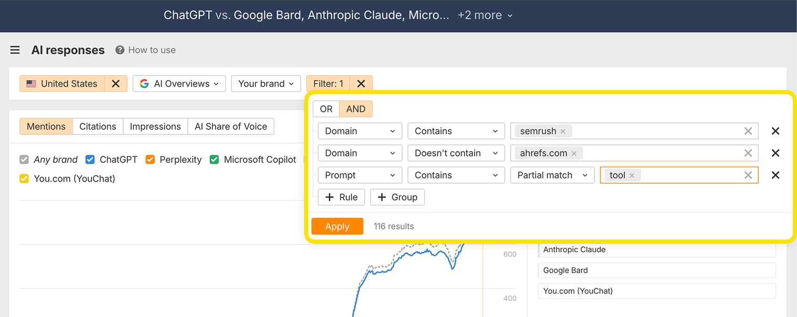

最终筛选出 56 个关键词，其中包括一个对 Ahrefs 来说具有较高[商业潜力](https://ahrefs.com/zh/blog/how-to-rank-for-keywords/)的关键词：competitor traffic analysis tool。

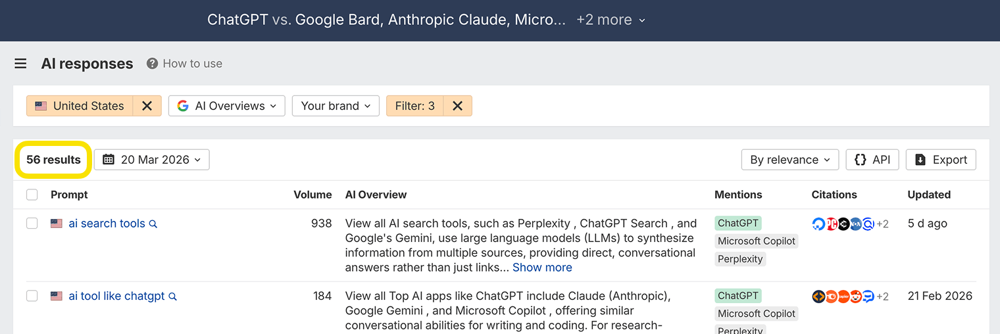

通过分析这些经常被引用的页面，我们可以优化页面 SEO 以争夺该搜索位置。

在这个例子中，我们发现一个新发布的工具列表和两个着陆页被引用了，而且它们的 H1 标签中都包含该关键词。

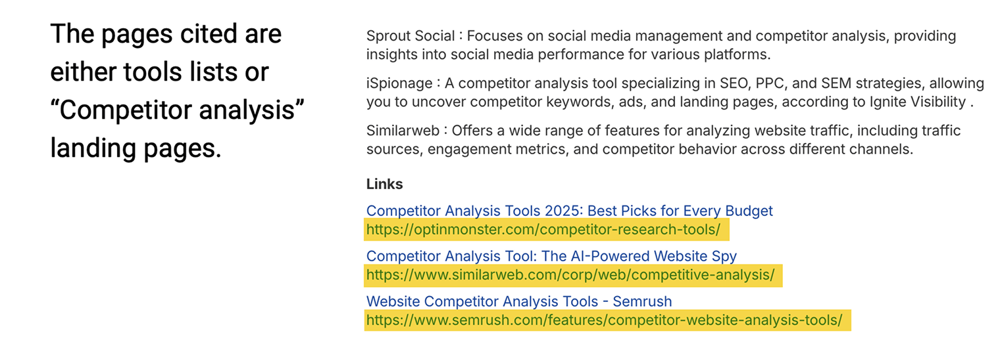

随后，我们检查了自己关于“Competitor analysis tools”主题的内容归档，发现仅有一篇过时的（2024）工具列表，以及一个主题模糊的着陆页。

这意味着，如果我们想赢得 AI 搜索中的引用，要么需要更新旧的工具列表，要么需要围绕核心关键词重新构建着陆页的主题。

* * *

第12部分

## 使用 Schema 标记获取富媒体结果

Schema 标记是一种可以添加到网页中的代码，旨在帮助搜索引擎和 AI 助手理解内容的含义与结构。

这有助于在 Google 中以**富媒体结果**的形式展现，也就是包含额外信息的增强型搜索列表，例如评分、步骤说明或常见问题等。

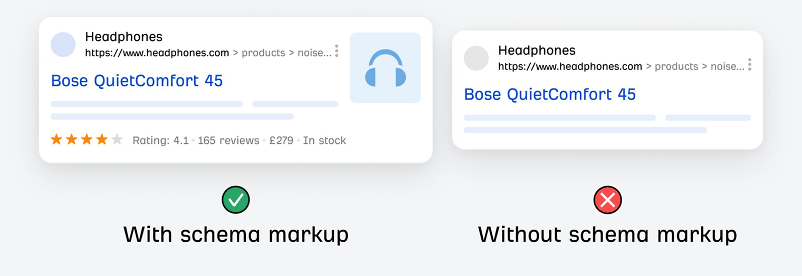

Google 和 [Microsoft](https://www.seroundtable.com/schema-llms-copilot-bing-microsoft-39093.html#:~:text=There%20is%20a%20big%20debate,Microsoft%20Bing%2C%20said%20they%20do) 均已证实，像 Schema 标记这样的结构化数据对 AI 搜索至关重要，能有效帮助 LLM 准确解析你的页面内容。

可以将 Schema 标记理解为一种标签，用来告诉搜索引擎：“嘿，这部分是问题，那部分是答案”，或者“这些是流程中的步骤”。

以下是几种常见且实用的 Schema 标记类型：

*   **FAQPage Schema：**当你的内容包含针对初学者常见问题的简短问答时，请使用此标记。它有助于 AI 搜索工具和 Google 识别并复用你的答案。

*   **HowTo Schema：**非常适合步骤类说明，能让你的指南在视觉搜索功能和语音助手中表现更佳。

*   **Article 或 Organization Schema：**有助于展示内容的作者及其可信度，对于构建信任感和权威性非常有用。

你可以通过我们的指南深入了解不同类型的 Schema 及其应用方法：[Schema 标记：定义及实施指南](https://ahrefs.com/zh/blog/schema-markup/)。

* * *

第13部分

## 提升用户体验

Google 在确定排名时，会参考[用户与你页面的互动方式](https://www.google.com/intl/en_uk/search/howsearchworks/how-search-works/ranking-results/#:~:text=that%20you%20see.-,Usability%20of%20content,-Our%20systems%20also)。

这被称为“用户体验”，简称“UX”。

良好的 UX 对 AI 可见度同样重要，因为 AI 系统在生成回答时会优先选择[易读且结构清晰](https://www.searchenginejournal.com/how-llms-interpret-content-structure-information-for-ai-search/544308/)的内容。

在对页面进行排名时，Google 会参考一系列“页面体验信号”，包括但不限于：

*   **Core Web Vitals (CWV)**：即页面是否加载迅速且稳定。

*   **安全性**：页面是否通过 HTTPS 连接。

*   **移动端友好性**：Google 使用页面的移动端版本进行索引和排名。

*   **避免侵入性插页**与对话框。

你可以在 Ahrefs Site Audit 中全天候持续监测 Core Web Vitals。

只需进入 Site Audit > 性能报告，查看 CrUX 指标即可。

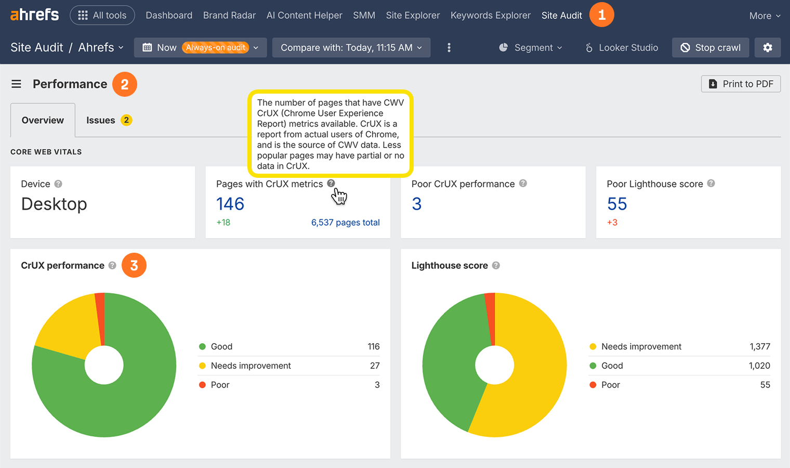

以下是其他一些优化页面 UX 的建议。

### 确保内容易于阅读与导航

使用短段落、清晰的标题和充足的留白，并根据目标受众来设计内容布局。例如，技术类博客的设计风格应与生活方式类网站有所区别。

对于着陆页，应通过能支撑主题（而非分散注意力）的内容和视觉元素，引导用户达成目标。

此外，请务必进行全站优化，而不仅仅是针对个别页面。

### 不要忽视技术性页面 SEO

技术因素也会直接影响页面提供良好 UX 的能力。

例如，当网站拥有清晰的技术结构时，搜索引擎和 AI 爬虫能更轻松地扫描你的站点。

你的[网页托管质量](https://ahrefs.com/zh/seo/seo-basics)、服务器端缓存以及网站架构也会影响页面加载速度和爬虫抓取内容的难度。

像 [PageSpeed Insights](https://pagespeed.web.dev/) 这样的工具可以帮助你发现可能影响 UX 并拖累排名的技术问题。

查看我们的指南以了解更多：

#### 延伸阅读

### 确保内容可被搜索引擎和 AI 爬虫访问

网站不仅要对用户友好，也要对爬虫友好。

[Ahrefs 的“全天候”Site Audit](https://ahrefs.com/zh/blog/always-on-audit/) 会列出 AhrefsBot 最近一次抓取你网站各页面的时间，而且 AhrefsBot 看到的内容与所有其他搜索引擎爬虫一致。

使用 AhrefsBot 进行全站抓取，可以让你了解搜索引擎和 AI 爬虫在访问页面时的实际情况。

这可以帮你实现：

*   确保所有关键页面返回 200 OK 状态码（避免失效链接）。

*   修复 [Robots.txt](https://ahrefs.com/zh/blog/robots-txt/) 或 Meta Robots 中任何标记为“[noindex](https://ahrefs.com/seo/glossary/noindex-tag)”或屏蔽重要内容的问题。 
*   找出没有任何内链的孤立页面，并在相关文章、分类页面或导航菜单中引用它们。

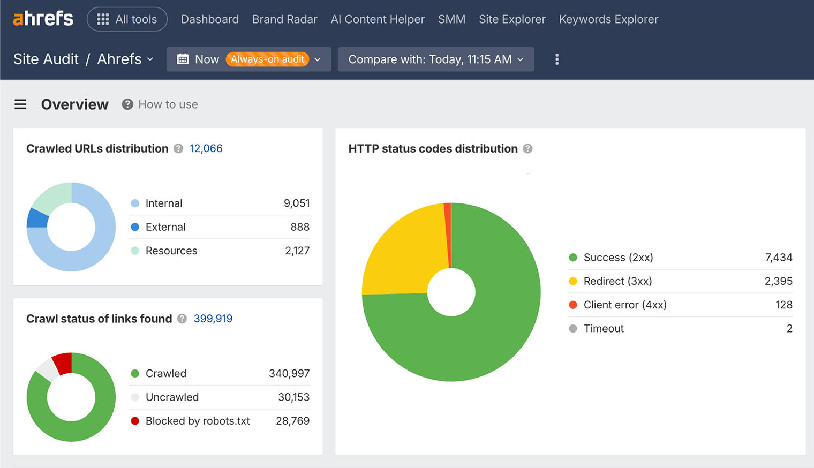

你还可以在 Ahrefs Site Explorer 工具的热门页面报告中查看“内容变更”，从而发现并更新过时的内容。事实证明，搜索机器人和 [AI 助手都更青睐新鲜的信息](https://ahrefs.com/zh/blog/do-ai-assistants-prefer-to-cite-fresh-content/)。

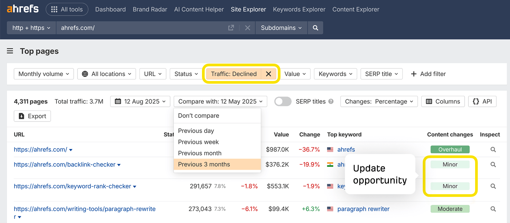

* * *

第14部分

## 监测页面 SEO 的表现

你已经完成了更新标题标签或添加内链等页面优化。

现在，需要追踪这些优化是否真的带来了效果提升。

### 追踪优化后的主题排名情况

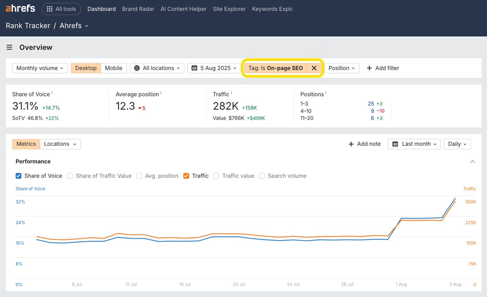

### 衡量优化页面带来的流量变化

使用 [Ahrefs Web Analytics](https://ahrefs.com/zh/web-analytics) 检查优化后的页面是否获得了更多自然搜索流量。

它免费、注重隐私保护，且比 Google Analytics 4 更易上手。

通过对比页面优化前后的流量趋势，有助于判断哪些改动是有效的。

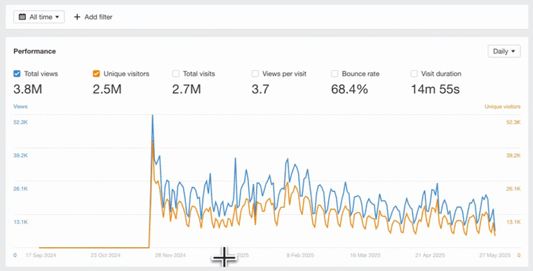

### 检查更新页面的用户行为

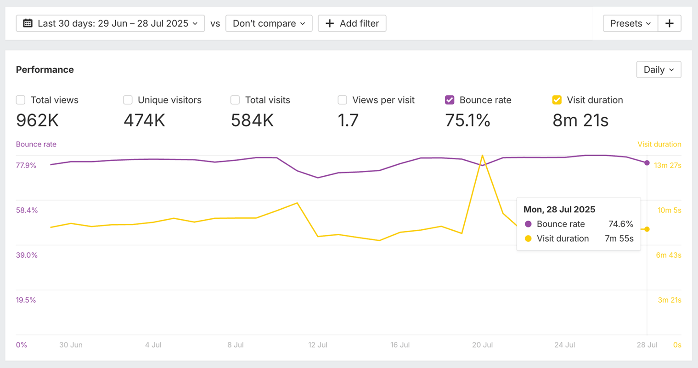

如果用户在优化后的页面停留时间更长，这通常意味着你的改动是卓有成效的。

### 追踪在 AI 搜索结果中的表现

观察像 ChatGPT 或 Google 的 AI Overview 等 AI 助手是否开始更多地引用你的网站。

可以使用 [Ahrefs Brand Radar](https://ahrefs.com/zh/brand-radar) 来实现这一点。例如，你可以在 AI Overview 的回答中搜索你的品牌名，并追踪在进行特定页面优化后，品牌提及量是否有所增加。

* * *

## 结语

当你优化标题、填补内容差距并展现专业性时，实际上是在帮助算法更有信心地推荐你的页面。

与以往不同的是，Google 不再是你唯一的目标，你还得为赢得 ChatGPT、Perplexity 及其他 AI 助手的引用而竞争。

即便如此，核心的页面因素并未改变。上述策略可以帮助你在搜索引擎和 AI 助手中都获得良好的曝光。

如果你的可见度没有提升，那么值得再次尝试更新或强化你的内容。

我们在 Ahrefs 博客中经常这么做，并且通过更新甚至彻底重写内容取得了不错的效果。

#### 延伸阅读

在下方示例中你可以看到，随着定期更新内容，自然搜索流量持续增长并保持相对稳定（绿色圆点代表内容更新节点！）：

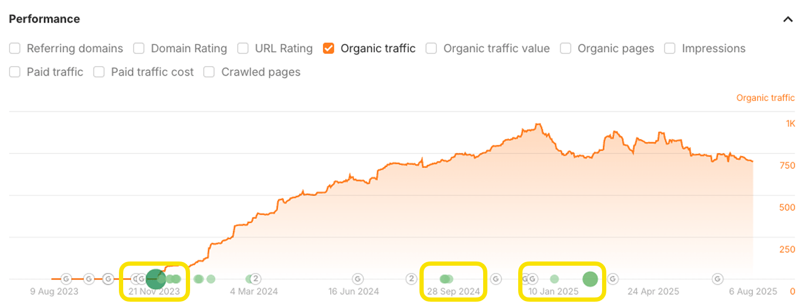

关键在于保持页面优化的持续性——小幅、持续的改进会随着时间累积，带来远超预期的可见度提升。
