Title: SEO 基础：SEO 成功入门指南

URL Source: https://ahrefs.com/zh/seo/seo-basics

Published Time: Tue, 21 Jul 2026 02:16:49 GMT

Markdown Content:
如果您希望用户能通过 Google 找到您的网站，就需要了解 SEO 的基础知识。这些内容其实比您想象的要简单。

继续阅读，了解什么是 SEO、如何做好成功设置，以及如何让网站被收录。

* * *

第1部分

## SEO 基础知识

### 什么是 SEO？

SEO（搜索引擎优化）是指通过优化网站和内容，以提升其在搜索引擎以及像 ChatGPT、Gemini、Perplexity 等 AI 助手上的可见度——这不仅是为了获取点击，更是为了确保您能够在搜索结果、摘要片段、内容总结以及网页内容中被提及。

### 为什么 SEO 很重要？

人们很可能会在 Google 或 Bing 上搜索您提供的服务——有时甚至会通过 AI 助手来搜索。

如果您的业务在这些主题被搜索时出现，您就能吸引客户。但如果不付出努力，您很难被展示，因为其他人也在争取同样的机会。这就是 [SEO 重要的原因](https://ahrefs.com/zh/blog/why-seo-is-important/)。

它有助于向搜索引擎和 AI 助手表明：您的品牌值得被看到。

### SEO 有哪些好处？

SEO 能帮助您的业务出现在用户主动搜索或提出问题的场景中——无论是在传统搜索结果中，还是在 AI 摘要里。

您的网站在搜索结果和相关用户讨论中被看到的次数越多，人们就越有可能对您产生好感，甚至在未来向您购买产品或服务。

与广告不同，自然可见度不会因为用户每次浏览或互动而产生费用。

例如，我们从自然搜索获得的月访问量估计为 560 万次。

若要通过付费广告复制这一效果，每月需花费约 420 万美元——这证明强大的 SEO 能够创造持久且持续叠加的价值。

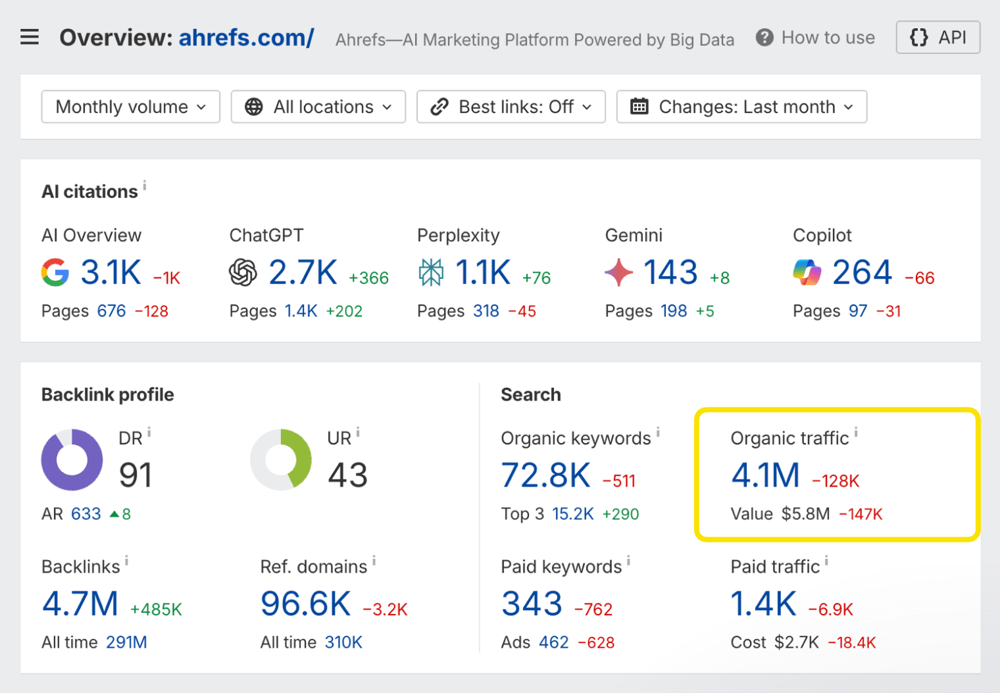
任何流量来源都不是完全免费的，SEO 同样需要时间、精力和持续优化投入。

### SEO 该怎么做？

SEO 主要包含五个步骤：

1

**关键词分析。**发现人们在搜索引擎中搜索的内容 _以及_ 在AI 助手中提出的问题。聚焦于目标受众实际使用的主题、问题和语言。

2

**内容创作。**创建有价值且值得信赖的内容，深入覆盖相关主题。

3

**页面内 SEO 与结构优化。** 通过良好的排版、内链以及结构化数据，让您的内容更清晰、易于浏览，并且便于搜索引擎理解与抓取。

4

**链接与品牌提及。**通过全网范围内的反向链接、品牌提及、客户评价和引用来积累信任信号。

5

**技术性 SEO。**确保搜索引擎和 AI 助手能够高效发现、抓取并索引网站内容。保持网站快速且对移动端适配，同时别忘了添加网站地图。

这些步骤是[我们的 SEO 入门指南](https://ahrefs.com/zh/seo)的主要内容。

* * *

第2部分

## 为 SEO 成功做好设置

当您的网站为 SEO 成功做好基础设置后，进行 SEO 会轻松得多。下面我们来看几种实现方法。

### 选择一个优质的域名

大多数域名对 SEO 都无负面影响，已有域名的也无需焦虑。若仍在挑选之中，则请留意优质域名的这两个关键要素。

#### 域名

此处最好选择简短且易记的名称，不要刻意塞入关键词。通常情况下，使用不带连字符或特殊字符的商家名称是稳妥的选择。

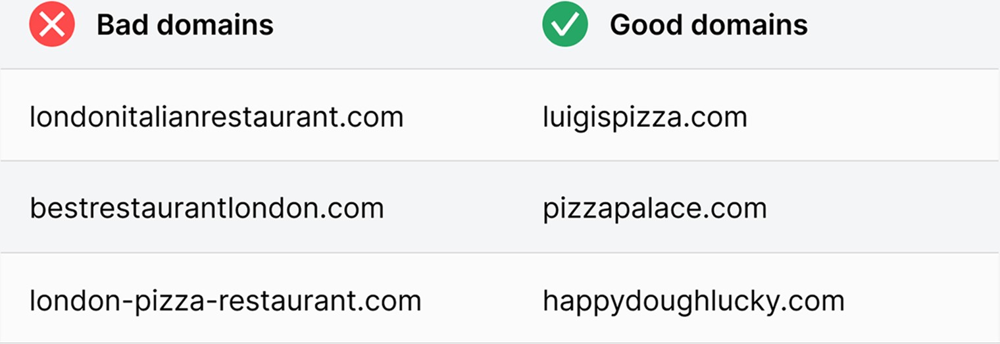

#### 顶级域名（TLD）

这就是域名中名称后面的部分，比如 .com。您选择的顶级域名（TLD）对 SEO 没有影响。[1](https://ahrefs.com/zh/seo/seo-basics#references)但我们认为对于大多数用户而言，.com 是最佳选择，因为它最具辨识度且更具信任度。对于慈善机构来说，.org 或您所在地区的对应域名同样适用。

如果您只在美国以外的某一个国家开展业务，那么使用该国家的国家代码顶级域名（ccTLD）（例如 .co.uk）也是可以的。

最好避免使用像 .info 和 .biz 这样的顶级域名，因为人们往往会将它们与垃圾信息联系在一起。但如果您已经拥有这样的域名，也并非世界末日。您仍然可以建立一个合规且能够获得曝光的网站。

例如，如果您面向特定国家提供服务，使用国家/地区的 ccTLD（如法国用 .fr、西班牙用 .es）会向搜索引擎释放强烈信号，表明您的网站面向该国用户。

### 使用网站平台

借助网站平台，哪怕您不懂代码，也能轻松搭建和管理网站。

有两种类型：

1

**托管平台**（如 Wix、Shopify、Webflow）：所有技术环节均由平台代为处理。它们为您托管网站、提供现成的设计方案，并让您无需接触代码即可添加和编辑内容。

2

**自托管平台**（例如 WordPress）：同样支持您无需接触代码也可添加和编辑内容。区别在于，您需要自行托管和安装。

托管平台 vs. 自托管平台

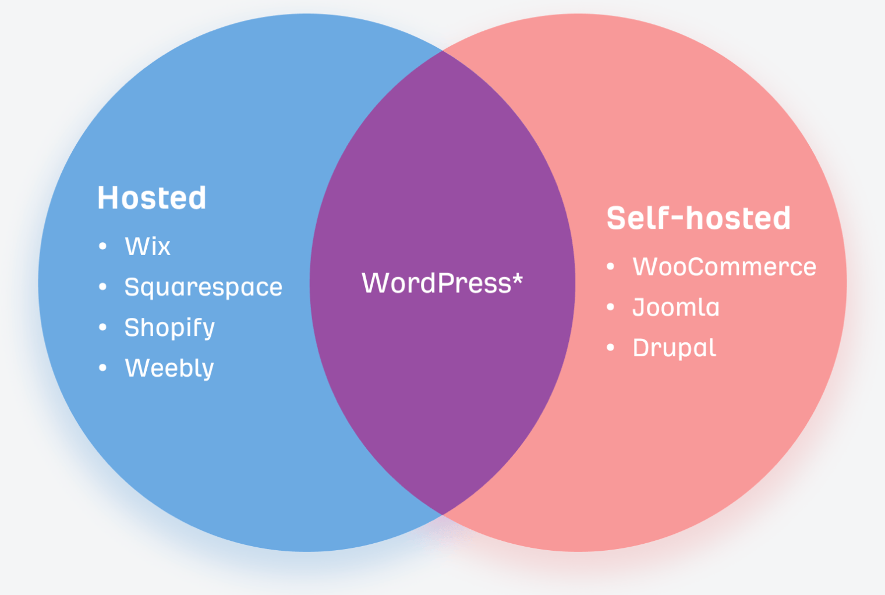
* WordPress 在 wordpress.com 上提供托管式解决方案

大多数 SEO 从业者推荐使用像 WordPress 这样的自托管开源平台，因为：

*   **它具有高度可定制性。** 您可以根据需要自由修改开源代码。此外，还有庞大的社区资源，以及对该平台了如指掌的开发者提供的专业建议。 
*   **它具有可扩展性与延展性。**有数百万个插件可用于扩展功能，其中包括许多 SEO 插件。这种托管方式能够随您的业务发展而弹性扩容。 

话虽如此，如果您更看重易用性和客户支持，像 Webflow 或 Shopify 这样的托管式解决方案可能更适合——尤其是对于较新的企业而言。托管平台在过去几年里有了很大改进，如今大多数现在都提供开箱即用的强大 SEO 功能。

### 选择优质的网站托管服务商

如果您使用的是托管解决方案，那么您需要一个网站托管服务商——该服务商负责存储您的网站文件、并让用户（以及越来越多像 Googlebot、Bingbot、GPTBot 这样的 AI 爬虫）能够访问网站内容。

在选择托管服务商时，请考虑**三个 S**——以及第四个日益重要的因素：

1

**安全**

您的网站需要加密。选择提供免费 SSL/TLS 证书的托管服务商，或至少支持 Let’s Encrypt 的托管服务商。这不仅保护访客数据，同时也是面向用户和搜索引擎的信任信号。

2

**服务器位置**

服务器距离越近，加载速度就越快。如果大部分流量来自某个国家，应选择该地区附近的托管服务商。这可以提升网站速度，而网站速度是排名因素之一[2](https://ahrefs.com/zh/seo/seo-basics#references) ，同时有助于在搜索和 AI 结果中获得更好的可见度。

3

**支持**

优质的客服支持是硬性要求。理想情况下，您需要 7×24 小时的实时在线支持。在确定使用前，不妨先测试一下——询问关于 SSL 设置、CDN 集成或爬虫访问权限等问题，看看他们的响应如何。

4

**搜索与 AI 可访问性**

您的网站应当便于搜索引擎 _和_ AI 系统抓取。在选择托管服务商时，要确保它允许您配置 robots.txt（有些会限制或锁定此项设置），并能自主控制网站地图（有些会自动生成）。这些是确保网站可被完整抓取、可索引、可获得曝光的关键。此外，您还需要选择一家不会屏蔽已知 AI 爬虫的托管服务商。

您知道吗？

可借助内容分发网络（CDN）优化服务器位置。CDN 会在全球各地的服务器上创建网站的副本，从而确保始终从靠近用户的位置提供服务。所以不必过于担心这一点。如果您发现速度成为问题，后续再考虑部署 CDN 即可。

### 打造良好的用户体验

Google 和 AI 助手希望呈现能为访客提供良好体验的页面。[3](https://ahrefs.com/zh/seo/seo-basics#references)下面我们来看几种实现方法。

#### 使用 HTTPS

对访客而言，没有什么比个人数据易受黑客攻击更糟糕的了。请务必启用 SSL/TLS 为您的网站加密。

#### 选择具有吸引力的设计

没有人愿意访问一个看起来像是上世纪 90 年代的网站。因此，虽然没必要每隔几个月就重新设计一次网站，但网站应该保持美观且能够体现您的品牌形象。

#### 确保其对移动端适配

现在，移动端的搜索量已经超过了桌面端。[4](https://ahrefs.com/zh/seo/seo-basics#references) 因此，确保您的网站在移动端的使用体验与桌面端同样良好至关重要。

#### 使用清晰易读的字号

人们使用各种设备浏览网页。请确保您的内容在所有设备上都具有良好的可读性。

#### 避免使用干扰性强的弹窗和广告

人人都讨厌广告，但有时您确实需要投放。如果是这样，请避免干扰性强的插页广告。包含这类广告的页面可能无法获得较高的排名。[5](https://ahrefs.com/zh/seo/seo-basics#references)

#### 确保页面快速加载

[页面速度](https://ahrefs.com/zh/blog/core-web-vitals/)是桌面端和移动端排名的考量因素。根据 Google 数据，5 秒的加载时间会导致 90% 的用户在未进行任何交互的情况下离开您的网站。[6](https://ahrefs.com/zh/seo/seo-basics#references)

### 创建逻辑清晰的网站结构

无论是访客还是搜索引擎，都应该能轻松找到您网站上的内容。因此，为内容创建逻辑清晰的层级结构非常重要。您可以通过绘制思维导图来实现这一点。

使用思维导图来创建网站结构

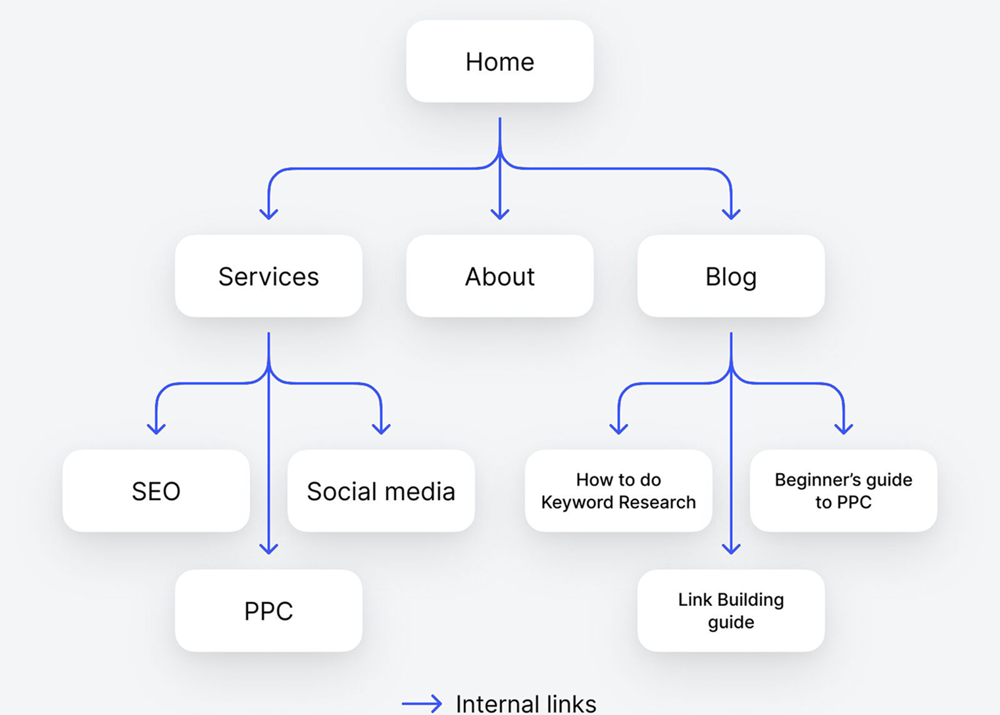

地图上的每个分支都会变成内链，即网站中一个页面指向另一个页面的链接。

内链对用户体验和 SEO 至关重要，原因有几方面：

*   **它们有助于搜索引擎发现新页面。**Google 无法收录找不到的页面，这也可能导致 AI 助手无法访问这些页面。

*   **它们有助于在您的网站内传递 PageRank。**[PageRank](https://ahrefs.com/zh/blog/google-pagerank/) 是 Google 搜索的基础。它通过分析指向某个页面的链接的数量和质量来判断该页面的质量。时至今日，Google 仍在沿用这一技术。[7](https://ahrefs.com/zh/seo/seo-basics#references)

*   **它们有助于搜索引擎和 AI 助手理解页面主题。**两个平台都会查看链接中的可点击文字，即所谓的锚文本，以此获得相关信息。[8](https://ahrefs.com/zh/seo/seo-basics#references)

### 使用逻辑清晰的 URL 结构

URL 很重要，因为它们能帮助用户和搜索引擎理解页面的内容与上下文。WordPress 允许您从多种 URL（永久链接）格式中进行选择，主要有以下几种：

*   **纯文本：** website.com/?p=123

*   **日期和名称：** website.com/2021/03/04/seo-basics/

*   **月份和名称：** website.com/2021/03/seo-basics/

*   **数据类型：** website.com/archives/865

*   **文章名称（推荐）：** website.com/seo-basics/

如果您正在搭建新网站，请选择最清晰、最具描述性的结构，也就是**文章名称**。但如果您是在维护一个已有网站，通常不建议更改 URL 结构，因为这可能会导致网站功能出现问题。

### 安装 SEO 插件

大多数网站平台本身就具备基础的 SEO 功能。但如果您使用的是 WordPress，则需要安装一个 SEO 插件。否则即便是最基本的 SEO 最佳实践也很难落地。[Yoast](https://yoast.com/) 和 [Rank Math](https://rankmath.com/) 都是不错的选择。

### 专注于本地 SEO

如果您的业务在本地运营，就需要对[本地 SEO](https://ahrefs.com/zh/blog/local-seo/)有所了解。

它涉及优化您的线上存在，使其出现在与地理位置相关的搜索结果中，涵盖 Google、地图，以及越来越多地出现在像 Gemini 这样的 AI 平台上。

这样可以确保您的业务在关键搜索场景中出现——无论是用户在地图中搜索“附近的服务”，还是通过业务相关关键词进行搜索。

*   **创建并完善 Google 商家资料**，以便在 Google 搜索和地图中展示——包括类别、服务、图片、问答以及定期更新。

*   **确保 NAP**（名称、地址、电话）在您的网站、Google 商家资料（GBP）以及各主要目录平台上的信息保持一致。

*   在 Google 及其他与业务相关的目录平台上，**主动收集并回复客户评价**。

*   **创建本地化内容**（例如：地区页面、博客文章、常见问题解答），使其贴合用户的实际搜索方式。

*   **监控企业资料**，以便及时掌握 Google 根据访客反馈所做的更新。您可使用 [Ahrefs Google Business Profile Monitor](https://ahrefs.com/zh/gbp-monitor) 跟踪这些变更，并拒绝任何不需要的修改。 

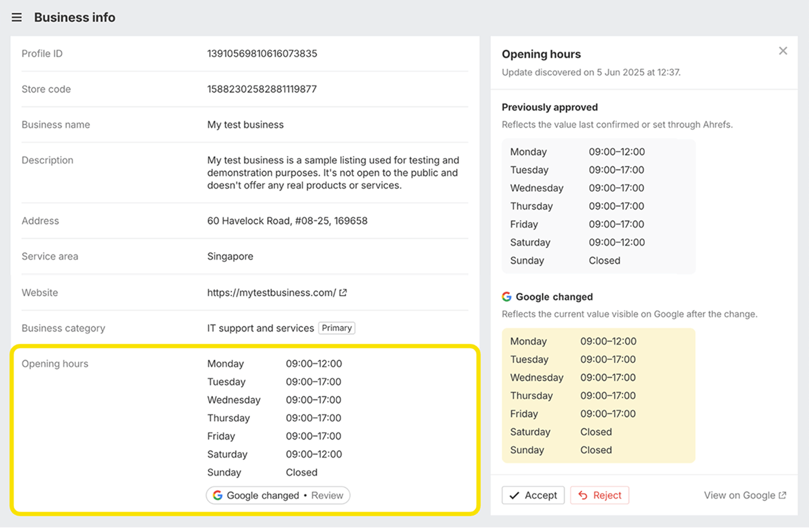

* * *

第3部分

## 在 Google 上被收录

让网站具备 SEO 友好结构，有助于 Google 抓取和收录您的页面。一旦被 Google 收录，就更有可能出现在 AI 助手的搜索结果中，因为它们通常会参考搜索引擎的结果。

将网站提交给 Google 可以进一步加快这一过程。因为，即使您的网站没有任何反向链接，也能帮助 Google 发现您的网站。

如何将网站提交至 Google

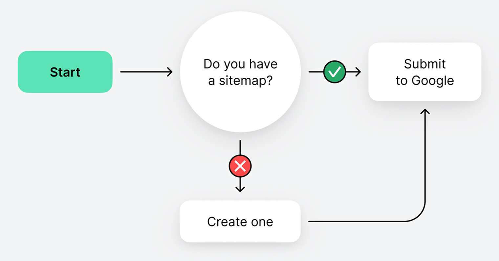

### 查找或创建网站地图

网站地图列出了您希望搜索引擎收录的关键页面。如果您已经有网站地图，它通常位于以下某个 URL：

*   site.com/sitemap.xml

*   site.com/sitemap_index.xml

如果在那里找不到，可以查看 site.com/robots.txt，通常会在其中列出。

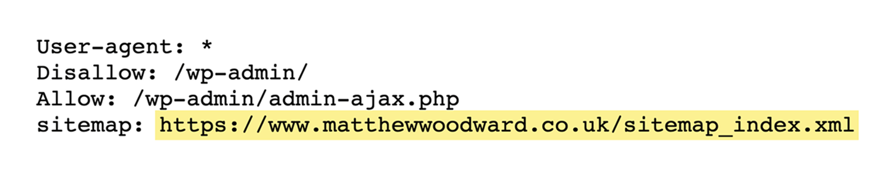

如果仍然找不到，说明您可能还没有网站地图，需要创建一个。

### 提交网站地图

通过 Google Search Console（GSC）即可完成这一步，整个过程大约只需两秒钟。

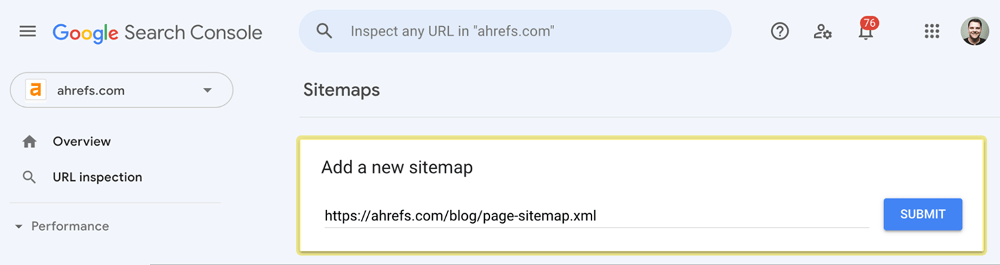

* * *

第4部分

## 如何衡量 SEO 成效

在深入探讨如何开展 SEO 之前，值得花点时间了解如何[跟踪和衡量 SEO 表现](https://ahrefs.com/zh/blog/seo-performance-results/)。这从来都不是一件容易的事，我们在此介绍的也只是一个 _非常_ 宏观的概述。

### 自然搜索流量与展示量

如果自然搜索流量在增长，说明您的优化方向是正确的。

不可否认，近来自然搜索流量的获取正变得越来越困难，因为 AI 会在搜索结果页面中直接对网站内容进行摘要，减少了用户点击进入网站的动机。

尽管如此，对其进行追踪仍然很重要，因为它很可能仍是您最主要的访客来源。您可以在**Site Explorer**中查看估算数据。

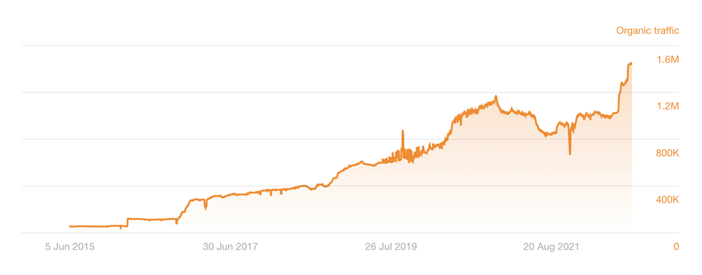

您还可以跟踪**展示量**，以了解您的网站在搜索和 AI 中的可见度——即使未被点击。

您可以在 Google Search Console 中免费查看这些数据。

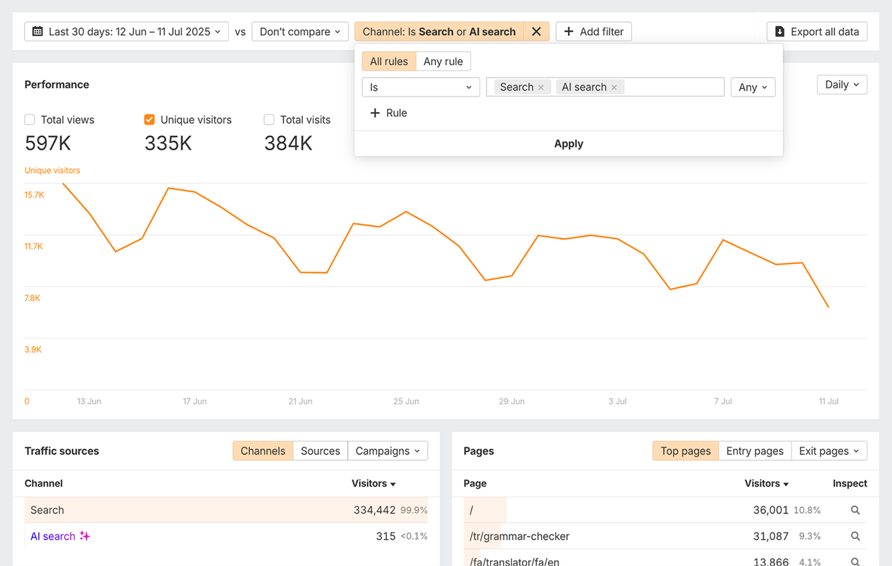

### 关键词排名

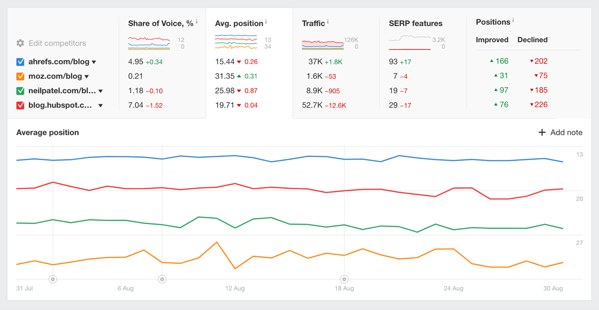

### AI 可见度

AI 正逐渐成为在线可见度中一个重要且不可或缺的组成部分：66% 的人会定期主动使用 AI[8](https://ahrefs.com/zh/seo/seo-basics#references)。

通过[Ahrefs Brand Radar](https://ahrefs.com/zh/brand-radar)，可监测网站在各类 AI 搜索结果中被提及的频率，涵盖 Google AI Overview、ChatGPT、Perplexity、Gemini 以及 Copilot 等平台。

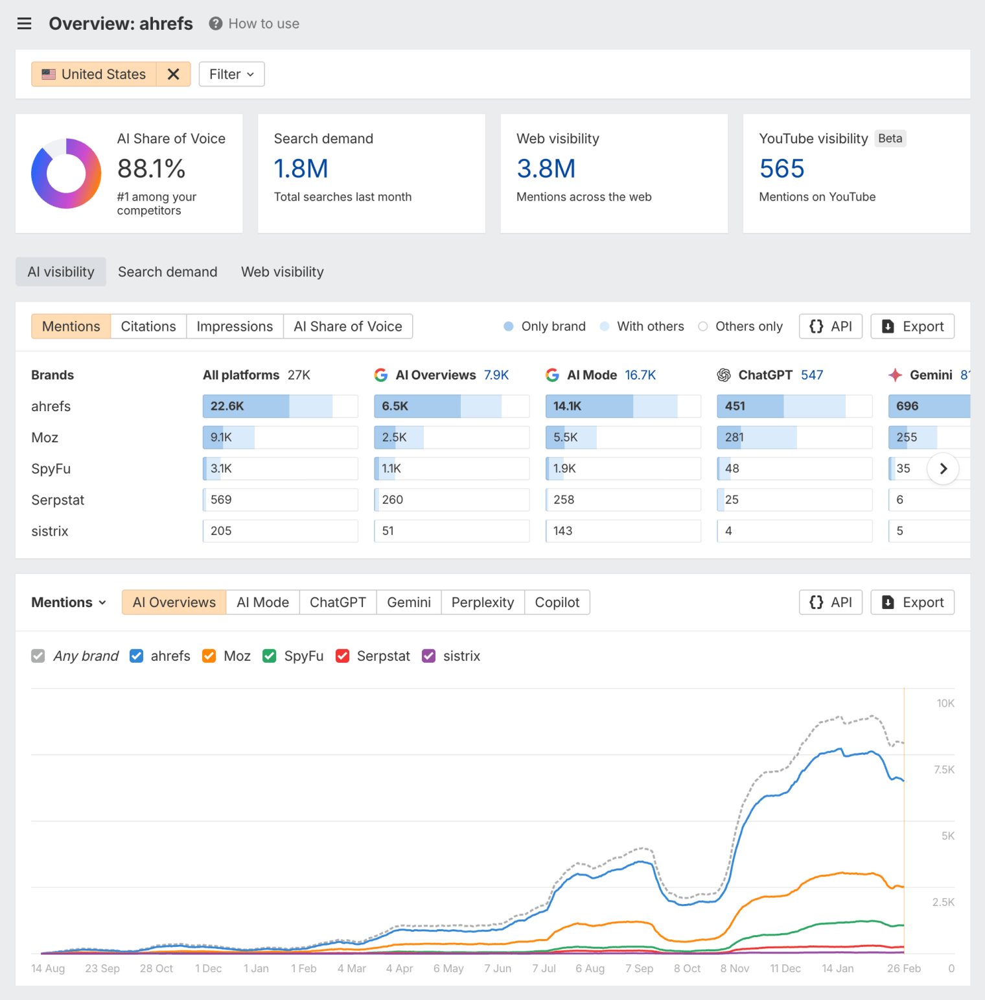

### 声音份额

跟踪自身网站的表现固然重要，但您也需要了解竞争对手的表现情况。

声量份额是一种用于将您的表现与竞争对手进行对比的方法。

声音份额显示您在所跟踪关键词上获得的点击占比。

若网站在 Google 某关键词的前 10 个搜索结果中全部上榜，即可获得 100% 的声量份额。

如果竞争对手占据了其中的一半位置，那么您的声音份额就是 50%。

如果您的声音份额在上升，这是一个好迹象，说明您的 SEO 在起作用。
