Title: SEO 内容：新手指南

URL Source: https://ahrefs.com/zh/seo/seo-content

Published Time: Tue, 21 Jul 2026 02:17:19 GMT

Markdown Content:
要在搜索引擎中获得排名，你必须创作出让用户和搜索引擎双双满意的内容。

继续阅读本文，你将了解到 SEO 内容的重要性，以及如何从零开始创建。

* * *

第1部分

## SEO 内容基础

### 什么是 SEO 内容？

SEO 内容是指为了在搜索引擎中获取排名而设计的内容。它的表现形式多种多样，包括但不限于博客文章、产品页面、着陆页、交互式工具等。

### 为什么 SEO 内容很重要？

并非所有内容都能获得排名并从自然搜索中获取流量。除非运气爆棚，否则只有那些针对用户正在搜索的主题、并为搜索用户精心打造的内容才能脱颖而出。

* * *

第2部分

## 如何创建 SEO 内容

打造 SEO 内容的核心在于：满足搜索用户的需求，并增强内容的“粘性”。如果还能在此基础上分享独特见解和专业知识，效果将更上一层楼。下面我们来详细拆解这一流程。

### 选择一个经过验证的主题

如果你已经做过关键词分析，那么应该已经锁定了一个经过验证的主题。这类话题通常具备流量潜力、商业潜力和排名潜力：

*   **流量潜力：**能够带来足够的访问量，证明创建内容的投入是值得的。

*   **商业潜力：**让你能够自然地提及自己的产品或服务

*   **排名潜力：**你的网站有可能在目标关键词上获得排名。

例如，这是一家烘焙用品商店经过验证的主题：

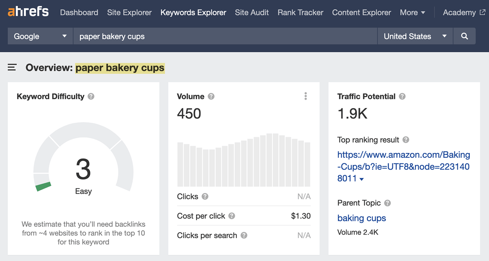

它具备良好的商业潜力和流量潜力，并且从关键词难度 (KD) 评分来看，排名似乎相对容易。

我们是这样找到它的：

1

将种子关键词“bakery”输入 Ahrefs 的 [Keywords Explorer](https://ahrefs.com/zh/keywords-explorer)

2

查看**词匹配**报告。

3

筛选出流量潜力高且 KD 值较低的关键词

您知道吗？

Ahrefs 中的关键词难度 (KD) 评分是基于排名靠前页面的反向链接数量计算得出的，它是筛选关键词列表的一种高效方式。尽管如此，在决定布局某个主题之前，深入调研其排名难度依然非常有必要。更多内容请参阅[我们的关键词难度指南](https://ahrefs.com/zh/blog/keyword-difficulty/)。

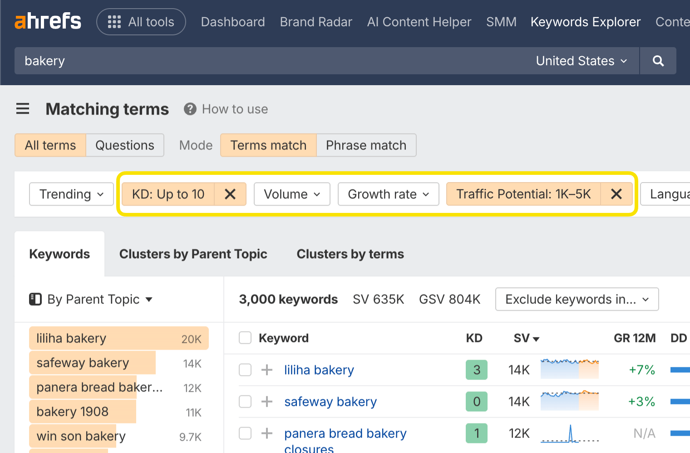

最后，通过 SERP 概览查看排名靠前的页面及其数据。由于很多页面反向链接极少且来自知名度较低的品牌，那么这就是一个非常有潜力的关键词。

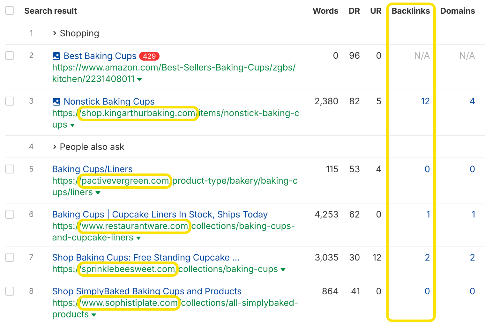

### 分析搜索意图

理解搜索意图，本质上是弄清楚用户到底想找什么。你需要这样做，因为如果你的内容与意图不匹配，排名的机会将微乎其微。

当我们更好地匹配了搜索意图后，我们的一篇博客文章发生了如下变化：

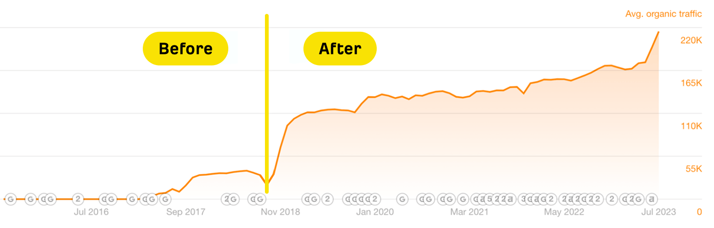

像 _“如何在没有机器的情况下在家制作浓缩咖啡”_ 这样的关键词，很容易猜到其背后的搜索意图。信息就在关键词里：用户想学习如何在家里、不使用意式咖啡机的情况下做出好咖啡。

但对于 _“espresso”_，仅凭关键词很难推断背后的意图：

*   用户是想买咖啡吗？

*   他们是想要一个简单的定义，还是想了解详细的制作过程？

*   我们应该写昂贵的意式咖啡机，还是像摩卡壶这样的 DIY 替代方案？

这些信息不在关键词里，但存在于搜索结果中。如果一篇文章针对某个特定关键词排名很好，那它很可能就是提供了用户想要的东西。现有的搜索结果可以提供一份路线图，帮助你理解并匹配搜索意图。

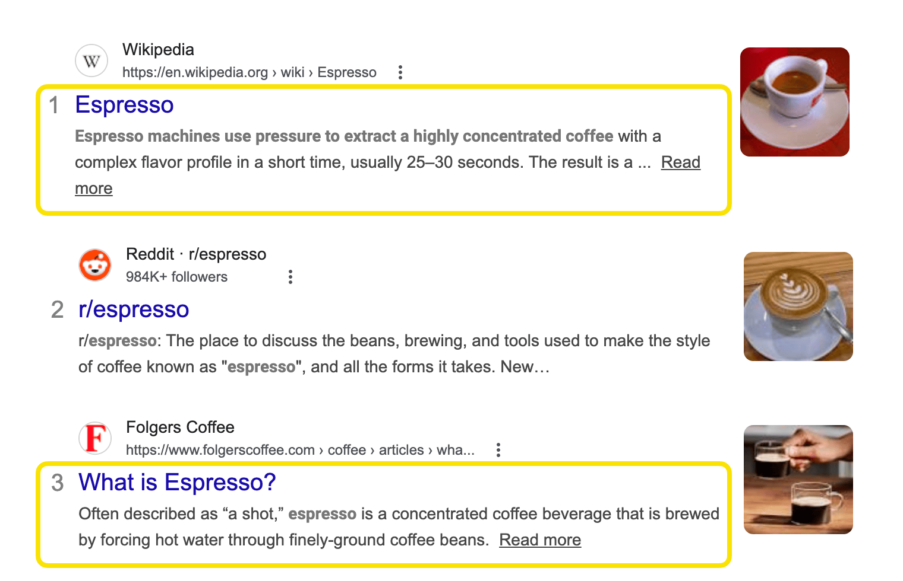
“espresso”的大多数排名靠前的结果都聚焦于定义和基础说明。

要识别搜索意图，请查看 Google 上排名靠前的结果，并判断搜索意图的三个 C：

*   **内容类型**：占主导的内容类型是什么？是博客文章、产品页、视频，还是其他形式？

*   **内容格式**：排名靠前的结果都是操作指南吗？还是清单、评测或对比？

*   **内容角度**：排名靠前的文章采用了什么切入角度？它们是否都在讨论“最佳”、“最便宜”或“适合初学者”？

例如，“neapolitan pizza dough”的排名靠前的结果全是食谱类博客文章，且“正宗”是主要的内容角度。

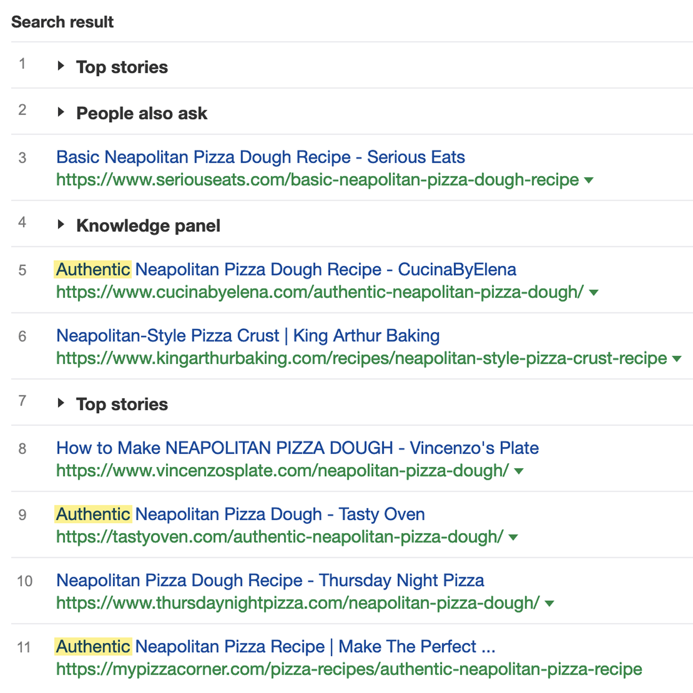

在大多数情况下，你的内容应该采用与当前高排名内容相似的方式（是相似而不是照搬，后面会细说）。一旦你确信自己提供了用户想要的东西，就该进入页面 SEO 的细节部分了。

提示

有些搜索结果可能同时包含多种不同的意图（例如，“kiwi”一词的 SERP 就同时包含了奇异鸟、猕猴桃、航空公司，以及 Harry Styles 的歌曲）。

如果你想借助数据来帮助判断应该锁定哪种意图，可以试试 Ahrefs 的“识别意图”功能。

进入 **Keywords Explorer**，输入你的关键词，向下滚动到 **SERP 概览**，然后点击**识别意图**按钮：

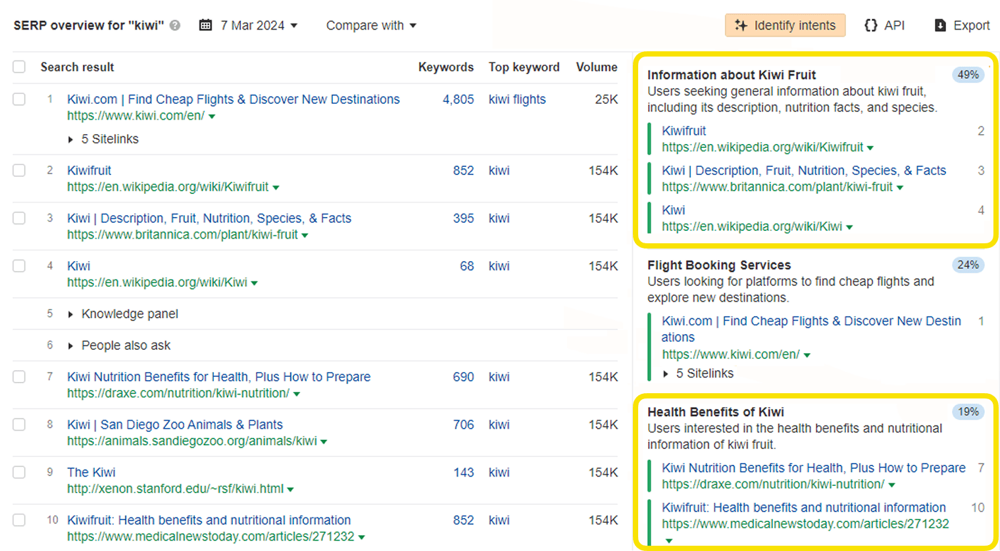

在这里你可以看到，预计有 49% 的流量流向了关于猕猴桃的基础信息页面。但还有另一个值得考虑的切入角度：预计有 19% 的流量特别关注的是食用猕猴桃的 _健康益处_。

### 检查你的专业性

如今，Google 比以往任何时候都更看重能够展示出对主题具有第一手经验的内容。以下是他们在最近一次[质量评分者指南](https://developers.google.com/search/blog/2022/12/google-raters-guidelines-e-e-a-t)更新中的表述：

内容是否也表明，它是在一定程度的经验基础上创作出来的？比如实际使用过某个产品、实际到访过某地或传达了作者的亲身经历？在某些情况下，你最看重的内容恰恰是由那些在该主题上有第一手生活经验的人创作的。

[Google 会使用一系列信号](https://www.google.com/search/howsearchworks/how-search-works/ranking-results/)来帮助判断内容是否体现了经验、专业性、权威性与可信度。Google 将这些信号称为 [EEAT](https://ahrefs.com/zh/blog/eeat-seo/)，它们对那些可能影响读者幸福、健康或财富的主题尤为重要。Google 把这类主题称为 Your Money or Your Life (YMYL) 主题。

正如 [Google 所解释的](https://static.googleusercontent.com/media/guidelines.raterhub.com/en//searchqualityevaluatorguidelines.pdf)：

*   **非 YMYL 主题：**“日常专业性”就足够了。只要作者拥有足够的生活阅历，使其在探讨该主题时展现出专家水准，那就没问题。

*   **YMYL 主题：**正式的专业素养非常重要，但对于某些主题来说，“日常专业性”也已足够。例如，癌症患者可能比医生更擅长回答“患癌是一种怎样的体验”。

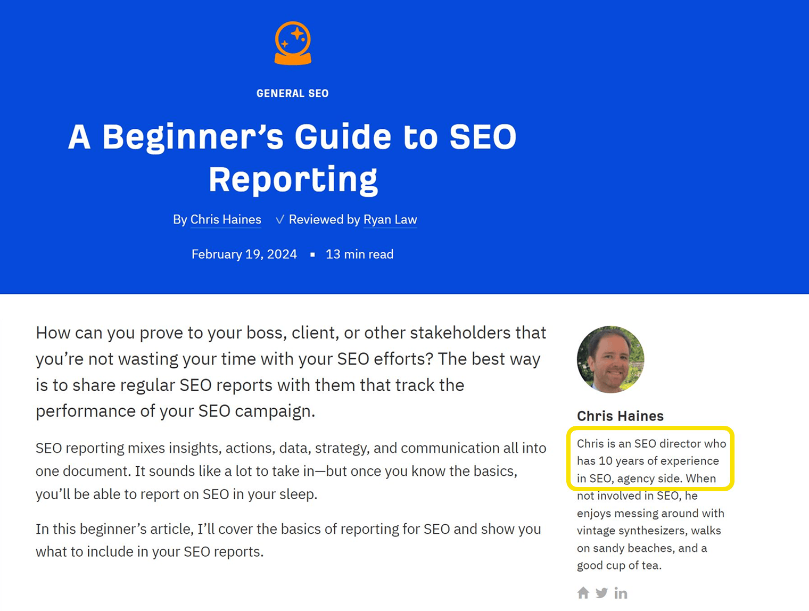

请参考下方的流程图来决定，是否以及如何涵盖某个主题。

如何判断是否要覆盖某个主题

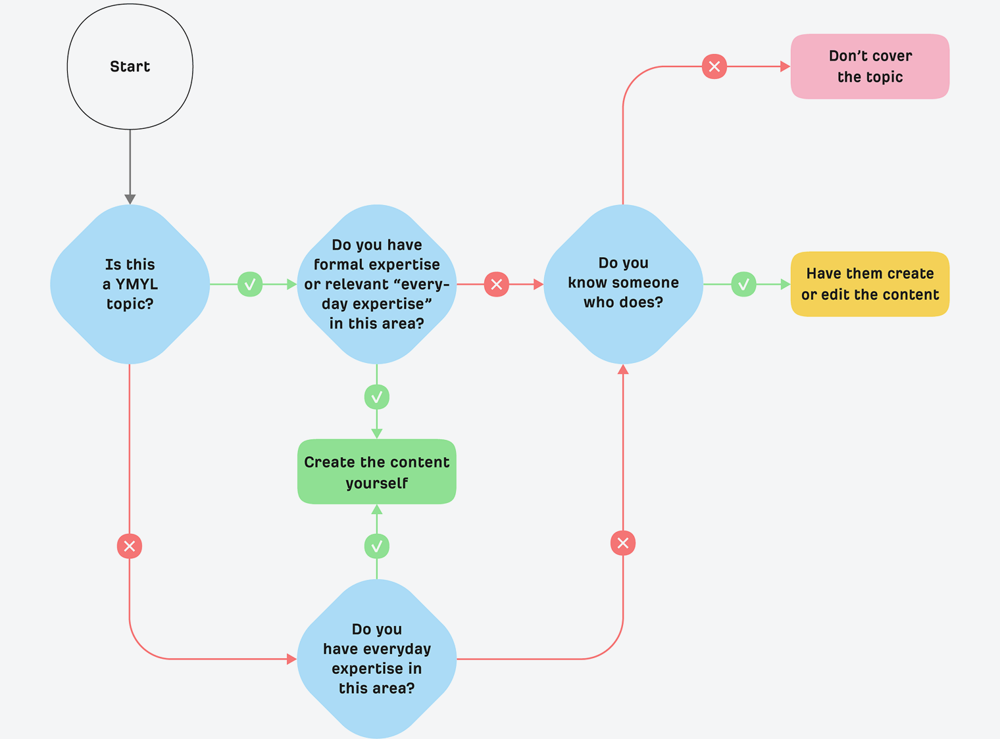

此外，还有一些页面元素也能提供帮助：

*   **加入专家引述：**当你的专业素养不足以支撑该主题的权威性时，可以去寻求 _真正_ 专家的观点和反馈（尤其是在[医疗保健](https://ahrefs.com/zh/blog/healthcare-seo/)或会计等需要特定认证和资质的领域）。

*   **亲身实践：**如果你要写如何冲煮浓缩咖啡，就真的去煮上几百杯。要评测免费的 CRM 软件？那就下载、安装，再花几个小时体验每个选项。如果你不愿意做到这种程度，很可能会被愿意这么做的人打败。

*   **展示证据：**向读者（以及 Google）证明你确实做过你所讲的事情。可以在作者简介中加入相关经验，并附上记录你实际经历的照片和视频。

### 全面覆盖主题

当你已经具备专业知识后，接下来就是打造搜索用户真正想看的内容。分析搜索意图能让你从宏观上把握方向，但这还远远不够。问题在于，针对某一查询词的最佳搜索结果，必须能够覆盖用户想了解的全部信息。

如果读者点击了一篇标题为 _如何煮出完美的浓缩咖啡_ 的文章，但文章却漏掉了重要的步骤，例如 _磨豆_ 或 _布粉_，他们很可能会感到沮丧。

优质的搜索内容应当是 _全面的_，即涵盖整个流程的所有步骤，列出读者所需的全部资源，并解答所有需要回答的问题。既能兑现其承诺，也不会在关键信息上留下漏洞。

全面的内容对读者很有价值，同时也会提高你的文章在更多关键词上获得排名的概率。在下图中，我们可以看到一篇名为 _How to brew espresso_ 的文章在 712 个关键词上获得了排名，其中包括 _how to make espresso at home_ 和 _espresso shot_ 等词：

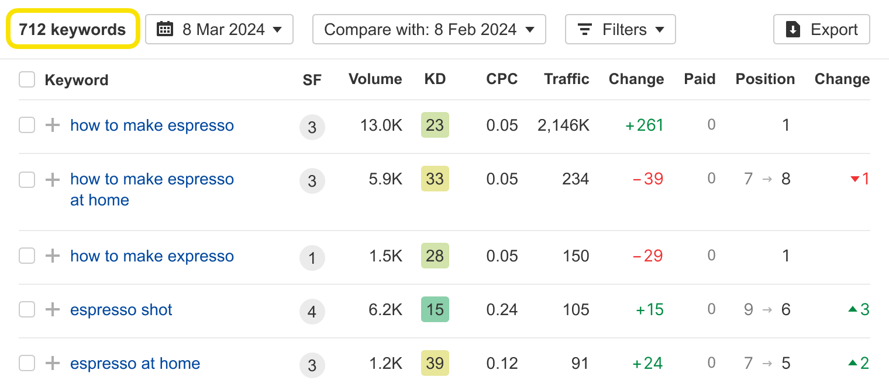

重要的是，做到 _全面_ 并不总是意味着要 _写得很长。_ 内容可以既全面实用，又保持简洁，这取决于主题本身。如果读者只是想找一个快速定义，或者——恕我直言——一份食谱，上千字的内容有时反而会造成干扰。

要做到全面覆盖，一个重要环节就是涵盖相关子主题。关键词分析在这里会有很大帮助。在 Ahrefs 的 **Keywords Explorer** 中输入你的目标关键词，就能快速找到数百个值得覆盖的相关关键词，其中包括：

*   **词匹配：**包含目标关键词中所有词项的关键词（“how to make espresso martini”）。

*   **问题：**以提问形式呈现的相关关键词（“how to make espresso at home”）

*   **同时有排名的词：**排名前 10 的页面同时还获得排名的关键词（“what is espresso”）

*   **同时提及的：**排名靠前的文章中频繁提及的关键词（“coffee maker”）

你也可以阅读排名靠前的内容来获取灵感，比如这段关于 _moka pot espresso_ 的内容：

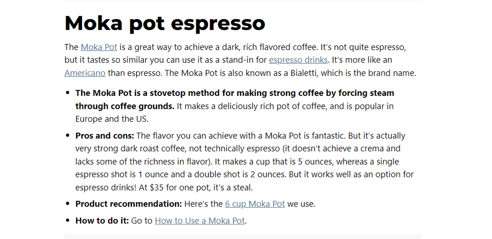

或者，你也可以使用 **Site Explorer** 查看每篇文章已经获得排名的不同关键词。从这一组结果来看，_how to make espresso without an espresso machine_ 或许有覆盖的价值：

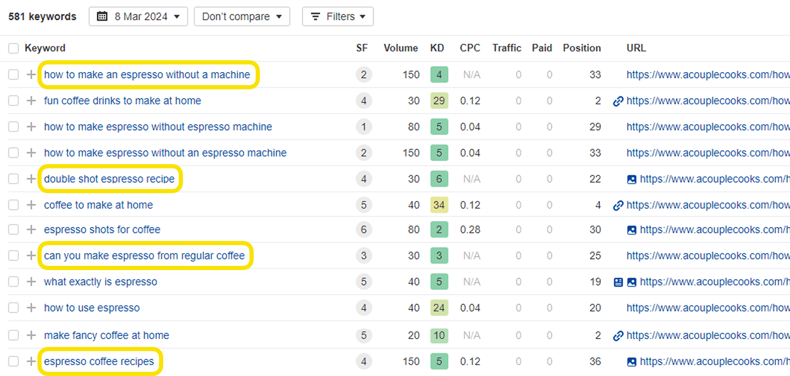

你还可以使用 **Content Gap** 报告对多篇文章运行此过程。在下面的截图中，我将我们的文章（已高亮）与三篇竞争对手的文章进行了比较：

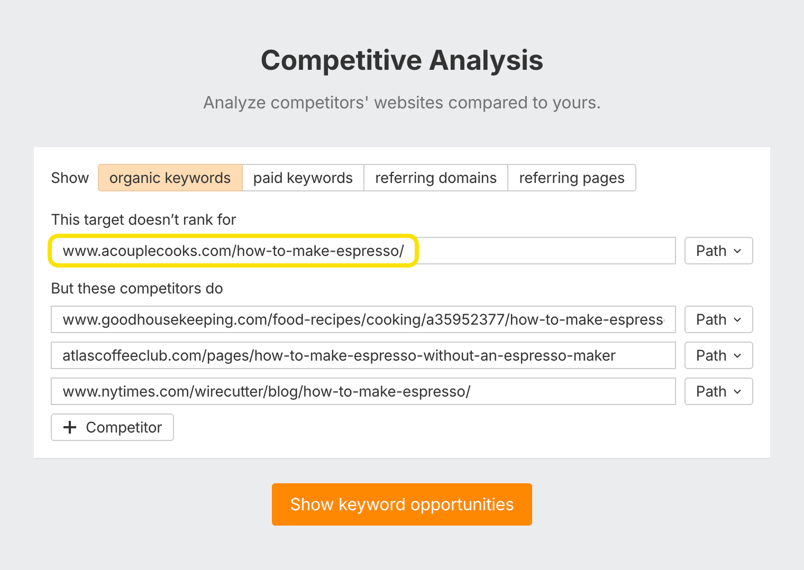

点击“Show keywords”，你就能立刻看到那些你没有排名、但竞争对手有排名的关键词。在这个例子中，我们可能应该添加一个章节，讨论哪种咖啡最适合用于意式咖啡机：

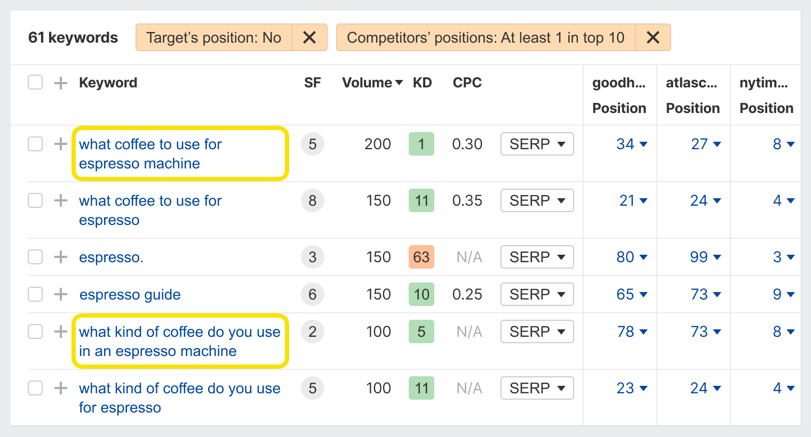

最后，也许是最重要的一点：**运用你的常识**。

如果你根据经验知道某个子主题至关重要，哪怕暂时找不到任何关键词或现有文章来证明其合理性，也请直接把它加进去。凡是有利于读者的信息，都有利于搜索排名。

关于页面优化工具的一点说明

页面 SEO 工具在辅助识别子主题时非常有帮助，但有一个重要的前提。

如果你对这些工具给出的建议照单全收，很容易创建出逻辑混乱、东拼西凑的内容，甚至是更糟糕的情况——出现明显且严重的关键词堆砌问题。

我更倾向于将页面优化工具作为补充来源，用来挖掘可能值得加入内容大纲的主题。如果我的文章已经足够全面，我不会纠结它的评分是 B- 还是 A+。

更多说明请参阅：[内容评分越高，Google 排名就越高吗？我们的数据研究表明并非如此。](https://ahrefs.com/zh/blog/seo-content-score-study/)

### 确保独特性

如果你把内容完全建立在高排名页面的基础上，最终只会得到“山寨内容”。这类内容既无法从同类结果中脱颖而出，也无法提供任何独特价值。

SEO 工具如何导致山寨内容

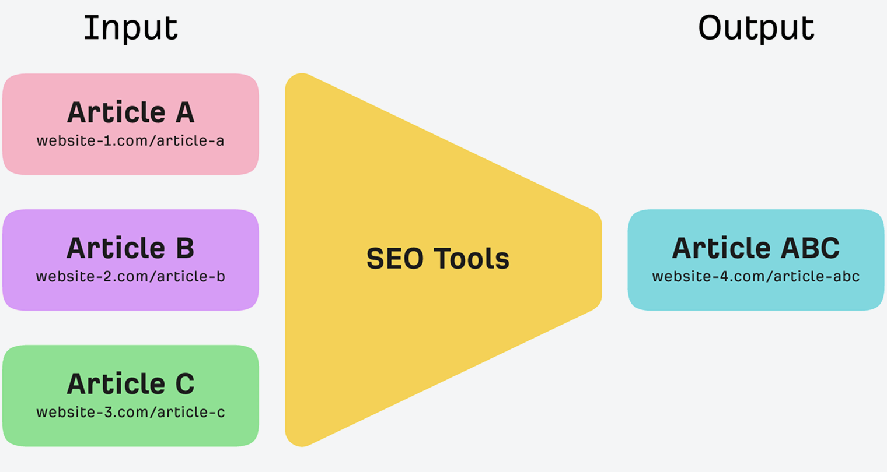
来源：Animalz

山寨内容对 SEO 来说是个问题，因为人们没有理由去链接它。而链接之所以重要，是因为它们本身就是排名因素之一。

无论你称之为[信息增益](https://www.animalz.co/blog/information-gain/)、独特性还是附加价值，答案都很直接：提供其他地方找不到的东西。

*   **覆盖别人从未涉及的子主题**：“影响浓缩咖啡口感、却最常被忽视的因素是……”

*   **分享专家观点或个人经验**：“机器做出的浓缩咖啡被高估了，因为……”

*   **进行实验**：“我用爱乐压冲了一整个月的咖啡……”

*   **通过投票、问卷调查和研究提供原创数据**：“我调查了 20 位咖啡师，发现……”

*   **采访主题领域专家**：“我采访了一位世界咖啡冲煮大赛冠军……”

如果你在 Ahrefs 的 [Site Explorer](https://ahrefs.com/zh/site-explorer) 中使用**按反链数量排序**报告来查看我们获得链接最多的博客文章，就会发现其中大部分都是研究报告。这说明在我们这个行业里，原创研究对于获取反向链接是多么有效。

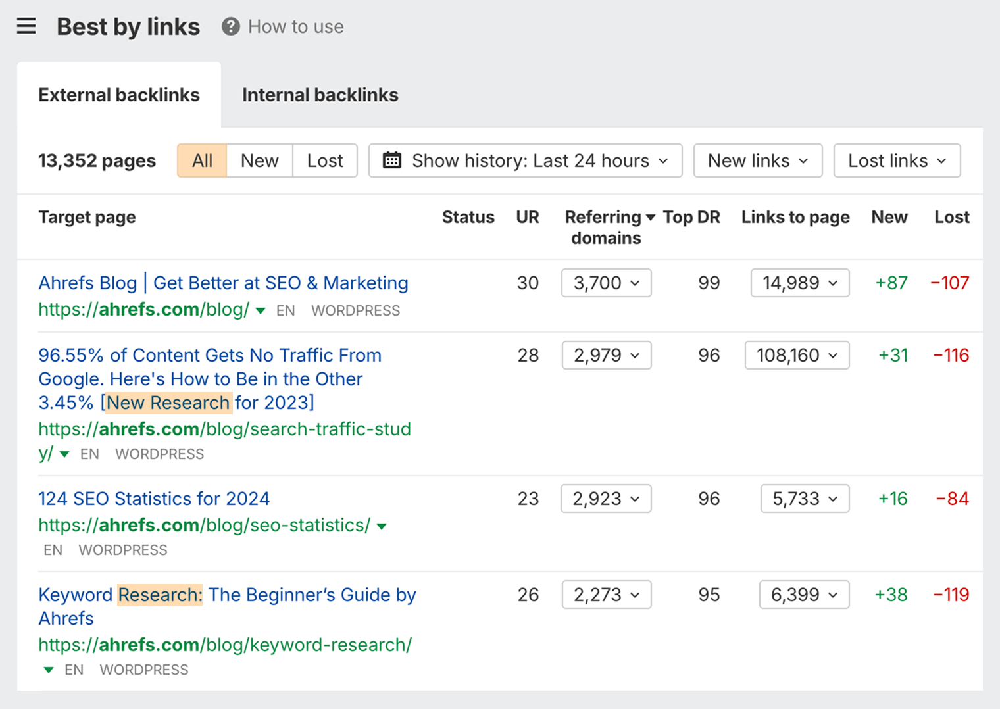

另一个技巧是，去分析人们为什么会链接到那些高排名页面。

例如，我们发现某个竞争对手关于“SEO 文案写作”的页面获得了很多链接，而这归功于作者提出的一个公式。于是，我们也为自己的文章创造了一个 “ASMR 公式”。目前，它已经为我们带来了一些链接。

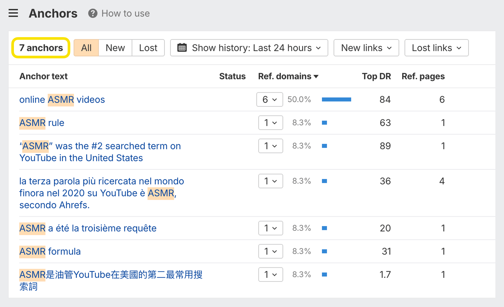

您知道吗？

### 让内容更有“粘性”

如果内容让人觉得困惑、难以阅读，用户就不会愿意停留。这很糟糕，因为 Google 会使用交互数据来评估相关性。如果用户像逃离泰坦尼克号一样迅速离开你的内容，这显然不利于 SEO。

以下是一些让内容更具“粘性”的小技巧：

*   **保持简单：**避免使用复杂的词语和句子。

*   **让内容更直观：**用图片和视频打破大段的文字墙。

*   **用受众熟悉的表达方式：**使用能引起读者共鸣的术语和行话。

*   **把好拼写关：**做一次拼写检查，效果会截然不同。

像 [Hemingway](https://hemingwayapp.com/) 和 [Grammarly](https://www.grammarly.com/) 这样的工具可以帮助简化表达并检查拼写。如果你好奇受众可能会使用什么样的语言和术语，可以试试这个方法：

1

2

前往**相关术语**报告

3

点击“同时提及的”切换项

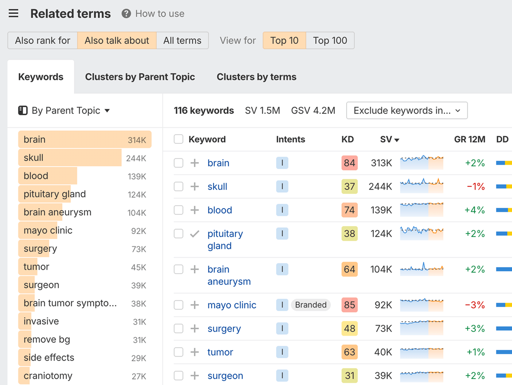

### 保持内容常青

内容不可能永远保持新鲜。如果你针对的是一个快速变化的主题，这就会成为问题。这意味着你必须持续更新内容，才能让 Google 和用户满意。

例如，我们的 Google 热门搜索列表的预估流量趋势会上下波动。

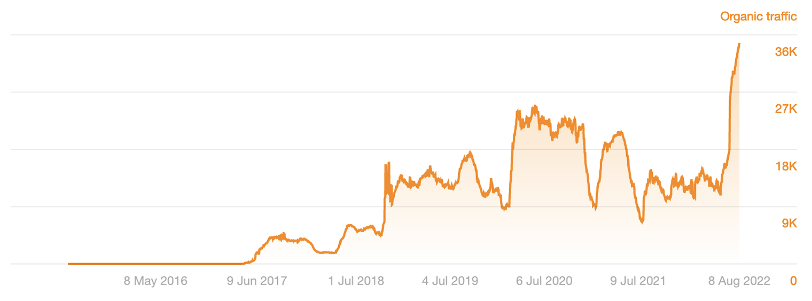

之所以会这样，是因为这个主题本身就需要新鲜的内容。用户并不想看到多年以前的 Google 热搜清单，他们想要的是最新的信息。每一次下滑都发生在我们的内容变得陈旧时，而每一次回升都发生在我们更新页面后。
