Title: 技术性SEO初学者指南

URL Source: https://ahrefs.com/zh/seo/technical-seo

Markdown Content:
技术性 SEO 曾经是 SEO 中最重要的部分。页面必须可抓取且可索引，才有可能获得排名，但与内容和链接相比，现在许多要素对 SEO 的影响微乎其微。

我们编写了这份新手指南，旨在帮助你理解一些基础知识，以及应该将时间投入在哪些方面才能最大化效果。

[Video 3](https://www.youtube.com/watch?v=DaUIMuFXABQ)

* * *

第1部分

## 技术性 SEO 基础

### 什么是技术性 SEO？

技术性 SEO 是指优化你的网站，以帮助搜索引擎发现、抓取、理解和索引你的页面。它有助于提升网站在搜索引擎中的可见度和排名。同时，它对 AI 搜索也至关重要。

### 技术性 SEO 有多复杂？

这要看情况。基础知识并不难掌握，但深入下去，技术性 SEO 可能会变得很复杂且难以理解。在这篇指南中，我会尽量用最简单的方式来讲解。

### 技术性 SEO 对 AI 搜索重要吗？

是的。AI 搜索仍然依赖可抓取、结构良好且值得信赖的网页。技术性 SEO 可确保你的网站速度快、可访问且可索引，这些都会提升你的内容在 AI 驱动的答复以及传统搜索中被采用的几率。

* * *

第2部分

## 理解抓取

在本章中，我们将介绍如何确保搜索引擎能够高效抓取你的内容。

### 抓取的工作原理

抓取是指搜索引擎从网页中获取内容，并利用页面上的链接来发现更多网页。你可以通过几种方式控制网站上哪些内容可以被抓取。以下是几种常见选项。

#### Robots.txt

[robots.txt](https://ahrefs.com/zh/blog/robots-txt/) 文件会告诉搜索引擎和 AI 平台，在你的网站上哪些地方可以访问，哪些地方不能访问。

大多数搜索引擎和 AI 爬虫都会遵守你的 robots.txt 设置。如果你明确禁止它们，它们就会遵守规则，不会抓取你的内容或将其纳入训练数据。但需要注意的是，如果你阻止搜索引擎和 LLM 将你的网站用作训练材料，你出现在它们回答中的机会也会随之降低。

您知道吗？

即便某些页面无法被抓取，如果存在指向这些页面的链接，Google 和 一些 LLM 仍可能将其编入索引。这可能会让人感到困惑，但如果你想彻底避免页面被索引，请查看这份[指南和流程图](https://ahrefs.com/zh/blog/remove-urls-from-google/)，它会引导你完成整个过程。

#### LLMs.txt

LLMs.txt 是一项自愿性标准，用于告诉大型语言模型 (LLM) 如何使用你的内容。但正如我们在 [LLMs.txt 指南](https://ahrefs.com/zh/blog/what-is-llms-txt/)中所解释的，它目前并不是特别有效，可能也不值得为此投入精力。

目前尚无证据表明 LLMs.txt 能改善 AI 检索、增加流量或提高模型的准确性。

#### 抓取频率

在 robots.txt 中有一条许多爬虫都支持的 crawl-delay 指令，它可以让你设置抓取页面的频率。遗憾的是，Google 并不理会这一指令。[[1]](https://ahrefs.com/zh/seo/technical-seo#references) 对于 Google，你需要在 Google Search Console 中修改抓取频率。[[2]](https://ahrefs.com/zh/seo/technical-seo#references)

#### 访问限制

如果你希望页面对某些用户可访问，但搜索引擎无法访问，那么你可能需要以下三种方案之一：

*   某种登录系统

*   IP 白名单（仅允许特定 IP 地址访问页面）

这类设置最适合内网、会员专属内容，或用于暂存、测试或开发站点。它允许特定用户访问该页面，但搜索引擎无法访问，也不会对其进行索引。

### 如何查看抓取活动

针对 Google 来说，查看其抓取内容最简单的方法是使用 Google Search Console 中的[“抓取统计”报告](https://search.google.com/search-console/settings/crawl-stats)，它能提供有关如何抓取你网站的详细信息。

如果你想查看网站上的所有抓取活动（包括来自 AI 爬虫的抓取），则需要访问服务器日志，并可能需要使用工具来更好地分析数据，这部分相对高阶。但如果你的主机自带类似 cPanel 的控制面板，你应该可以访问原始日志以及一些聚合工具，例如 AWstats 和 Webalizer。

### 抓取调整

每个网站都有不同的[抓取预算](https://ahrefs.com/zh/blog/crawl-budget/)，它由 Google 想要抓取的频率，以及你的网站允许被抓取的数量共同决定。热门页面和经常更新的页面会被更频繁地抓取，而那些看起来不太受欢迎或链接较少的页面，抓取频率则较低。

如果爬虫在抓取网站时发现过载迹象，它们通常会减慢速度甚至停止抓取，直到情况好转。

页面被抓取后，会被渲染并发送到索引中。索引就是所有可用于响应搜索查询的页面列表。下面我们来聊聊索引。

* * *

第3部分

## 理解索引

在本章中，我们将讨论如何确保你的页面被编入索引，并检查它们是如何被索引的。

### 爬虫指令

Robots meta 标签是一段 HTML 代码片段，用于告诉搜索引擎如何抓取或索引某个页面。它被放置在网页的 `<head>` 部分，如下所示：

```html
<meta name="robots" content="noindex" />
```

### 规范化

当存在重复内容导致同一页面有多个版本时，Google 会选择其中一个存入索引。这个过程称为[规范化](https://ahrefs.com/zh/blog/canonicalization/)，而被选为规范网址的 URL 将会显示在 Google 的搜索结果中。Google 在选择规范 URL 时会参考多种信号，包括：

查看 Google 如何索引某个页面最简单的方法，是使用 Google Search Console 中的[URL 检查工具](https://search.google.com/search-console?action=inspect)。它会显示 Google 选择的规范 URL。

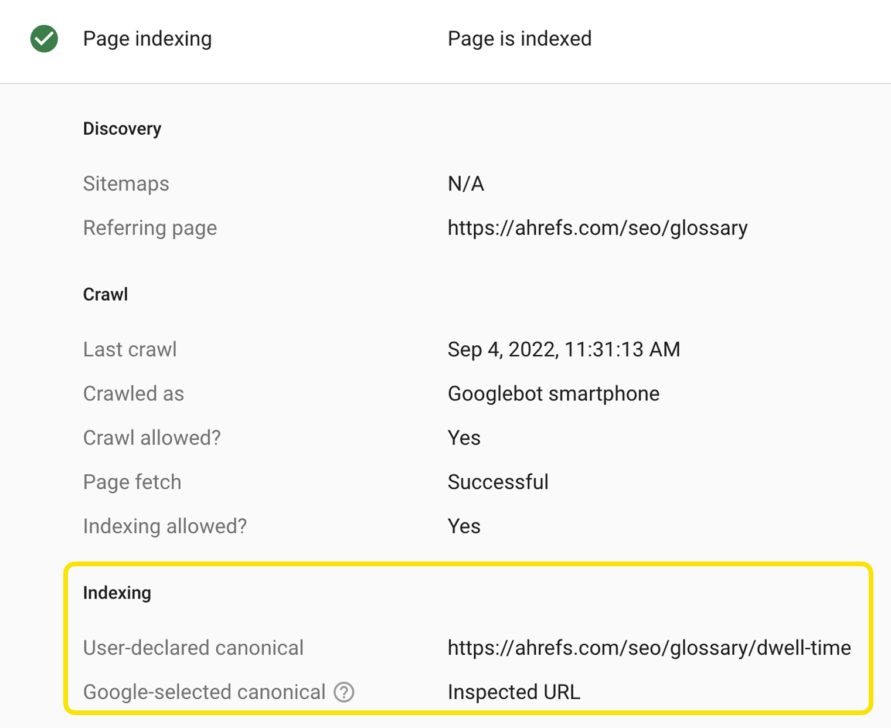

* * *

第4部分

## 技术性 SEO 速胜要素

对 SEO 人员来说，最难的事情之一就是确定优先级。虽然有很多最佳实践，但某些改动对排名和流量的影响远比其他的要大。以下是我建议优先考虑的一些项目。

### 检查索引

确保你希望用户找到的页面能被 Google 索引。前两章都在讲爬行和索引，目的就在于此。

您可查看**可索引性**报告在 [Site Audit](https://ahrefs.com/zh/site-audit) 中，找到无法被索引的页面及其原因。该功能可在[Ahrefs 免费版](https://ahrefs.com/zh/free)中使用。

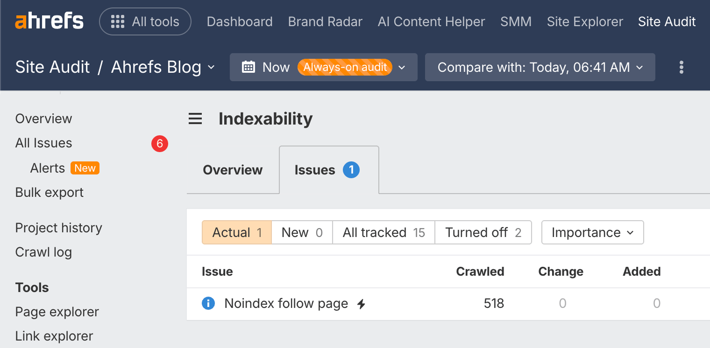

运行免费的技术性 SEO 审核

对于已验证所有权的网站免费

对于已验证所有权的网站免费

在此处注册后，您将获得[Ahrefs 免费版↗](https://ahrefs.com/zh/free)的访问权限

### 找回丢失的链接

网站通常会随着时间推移更改其 URL。很多情况下，这些旧 URL 包含来自其他网站的链接。如果它们没有被重定向到当前页面，那么这些链接就会丢失并且不再计入你的页面。现在做这些重定向还不算晚，你可以快速挽回损失的价值。不妨把这当作是你做过的最快的链接建设。

你可以使用 Ahrefs 的 [Site Explorer](https://ahrefs.com/zh/site-explorer) 找到回收失效链接的机会。输入你的域名，进入**按反链数量排序**报告，然后添加一个“404 not found”的 HTTP 响应筛选器。我通常会按“引用域名”进行排序。

以下是 1800flowers.com 的示例：

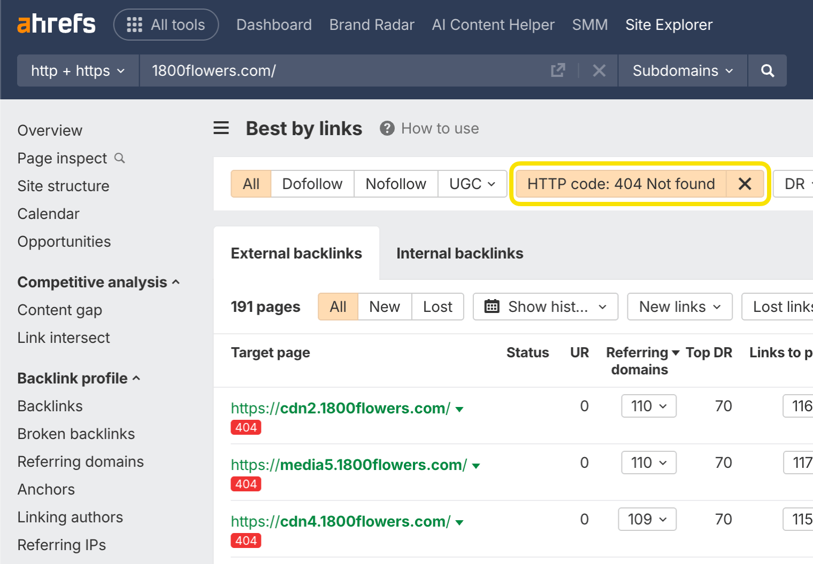

查看 archive.org 中的第一个 URL，我发现它以前是母亲节的页面。通过将这个旧页面重定向到当前版本，你可以找回来自 59 个不同网站的 225 条链接，其他页面也有很多类似的情况。

我甚至创建了一个[脚本来帮助你匹配重定向](https://colab.research.google.com/drive/18lMkaRHK__eNM6m5FpoyhGDlDAYr3a6P?usp=sharing)。别被吓到，你只需要下载几个文件并上传即可。Colab notebook 会引导你完成操作，并帮你处理繁重的工作。

你需要用 [301 重定向](https://ahrefs.com/zh/blog/301-redirects/)，将旧 URL 重定向到当前的位置，以找回这部分丢失的价值。

您知道吗？

301 重定向是一种永久重定向。在 Google 看来，任何指向重定向 URL 的链接都会计入新的 URL。[[3]](https://ahrefs.com/zh/seo/technical-seo#references)

### 添加内部链接

[内部链接](https://ahrefs.com/zh/blog/internal-links-for-seo/)是从你网站的一个页面指向另一个页面的链接。它们有助于页面被发现，并帮助页面获得更好的排名。我们在 [Site Audit](https://ahrefs.com/zh/site-audit) 中有一个名为**内链机会**的工具，可帮助你快速找到这些机会。

该工具会查找你的网站上已经有排名的关键词提及情况，然后将其作为上下文相关的内链机会推荐给你。

例如，该工具显示我们的重复内容指南中提到了“分面导航”。由于 Site Audit 知道我们有一个关于分面导航的页面，它就会建议我们在此处添加一条指向该页面的内链。

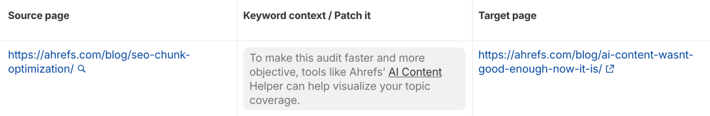

### 添加 Schema 标记

[Schema 标记](https://ahrefs.com/zh/blog/schema-markup/)是一段代码，可帮助搜索引擎更好地理解你的内容，并提供许多功能，让你的网站在搜索结果中脱颖而出。它还可能帮助 LLM 正确解读你的页面内容。Google 提供了一个[搜索库](https://developers.google.com/search/docs/guides/search-gallery)，展示各种搜索功能以及你的网站获得这些功能所需的 schema 类型。

* * *

第5部分

## 面向 AI 搜索的技术性 SEO

AI 改变了内容被发现与展示的方式，但它仍然依赖可抓取、结构良好且值得信赖的网页这一基础。同时，AI 也在改变我们创作和优化内容的方式。

关注以下几个针对 AI 的技术因素，可以帮助你在各种搜索场景中保持可见性。

### 确保 LLM 能够访问你的网站

与搜索引擎类似，LLM 需要能够抓取你的网站并访问其内容。不过，它们的工作方式与搜索引擎爬虫略有不同。

例如，大多数 LLM 不会渲染 JavaScript（这是一种常用于构建网站的编程语言）。如果核心内容或导航必须在 JavaScript 加载后才出现，那么某些 AI 爬虫可能就无法看到它们。因此，对于你希望在 AI 搜索中展示的关键内容，最好避免使用 JavaScript。

此外，还需检查一下第三方工具是否拦截了 AI 爬虫访问你的网站。

例如，Cloudflare 推出了新功能，允许网站主控制 AI 平台是否可以抓取内容用于训练数据集。

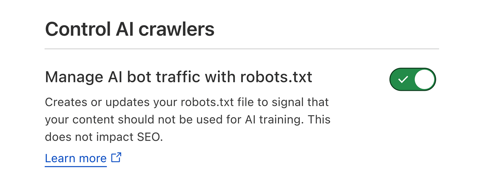

默认设置会阻止 AI 爬虫访问内容。不过，如果你希望最大化内容在 AI 搜索结果中的可见度，就需要把它关闭。

### 重定向幻觉 URL

AI 搜索系统可能会引用你域名下并不存在的 URL。你可以在 Ahrefs 的 Web Analytics 中，通过查看获得 AI 搜索流量的页面来发现这些情况：

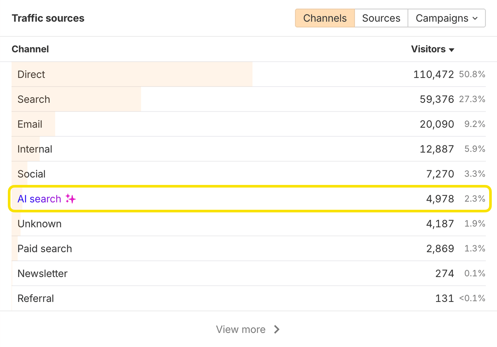

如果这些页面中有任何一个返回 404 错误，说明 AI 系统可能“凭空捏造”了该 URL。为了避免流量损失，你可以将该 URL 重定向到一个相关的有效页面。

定期监测可以防止用户受挫，并保护品牌权威性。

### AI 内容检测

虽然使用 AI 为你的网站创建内容没问题，但过多的 AI 内容可能会被[视为垃圾信号](https://developers.google.com/search/blog/2023/02/google-search-and-ai-content)，从而限制你的内容在传统搜索和 AI 搜索系统中的可见性。

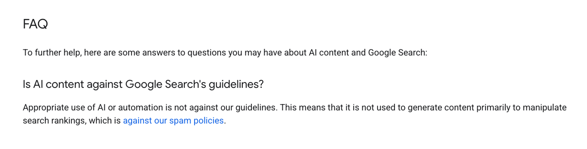

你可以在 **Site Explorer**>**Page Inspect** 中使用 Ahrefs 的 AI 检测器，查看机器如何解读你的内容中使用 AI 的程度。

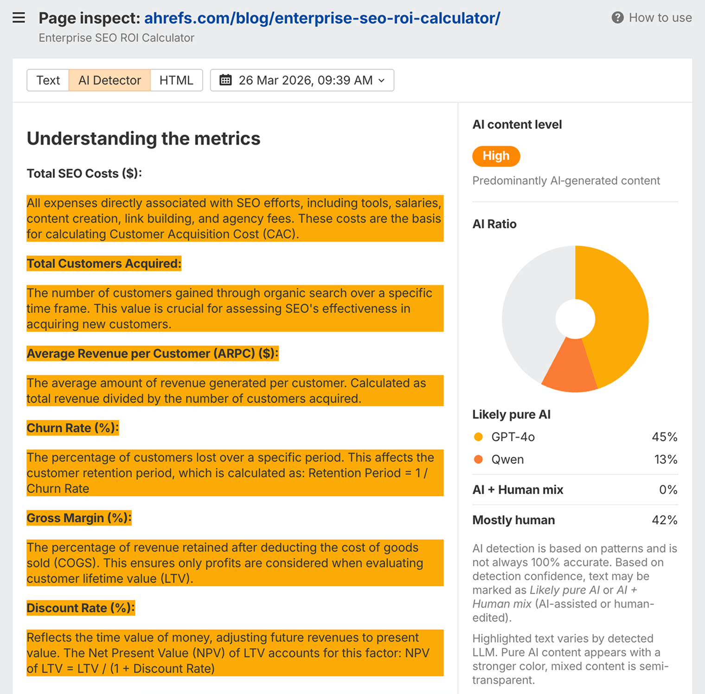

你也可以在**热门页面**报告中批量检查，找出那些可能需要重写的现有页面：

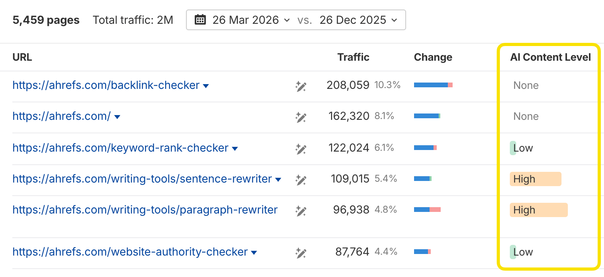

### AI 工具注入的代码

如果你使用 AI 来辅助搭建网站或添加新功能，它们可能会加入额外的 HTML 代码，从而暴露你使用了 AI。

曾有这样一个案例：Yoast SEO 的一个漏洞往页面中插入了隐藏的 AI 相关类名，让搜索引擎一眼就能看出 AI 参与其中。

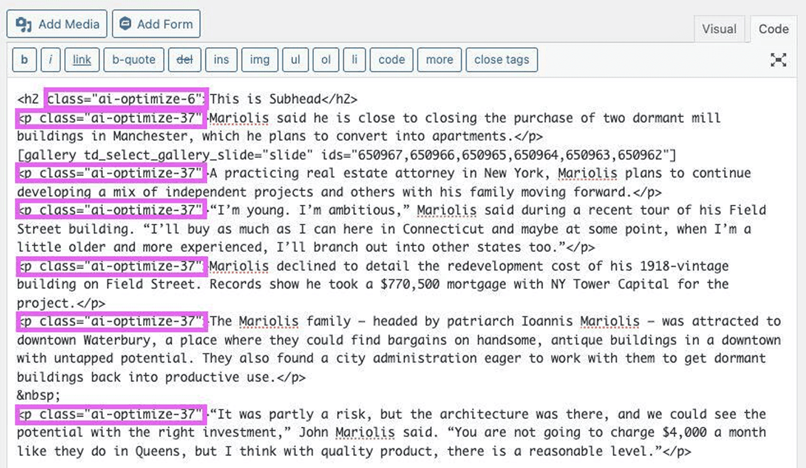

如果你使用 AI 工具进行页面改动，请检查网站的源代码，确保没有添加任何意外的内容。通过定期代码审查和发布更新前的测试，可以避免产生这种隐藏的“指纹”。

* * *

第6部分

## 其他技术性 SEO 项目

本章要讨论的这些项目都是很值得关注的内容，但它们可能需要投入更多精力，而且收益可能不如上一部分提到的“速胜”项目。这并不代表你不该去做，只是为了帮你理清不同项目的优先级。

### 页面体验信号

这些是次要的排名因素，但为了用户体验，你仍然需要关注。它们涵盖了网站中影响用户体验 (UX) 的各个方面。

Google 搜索中的页面体验信号

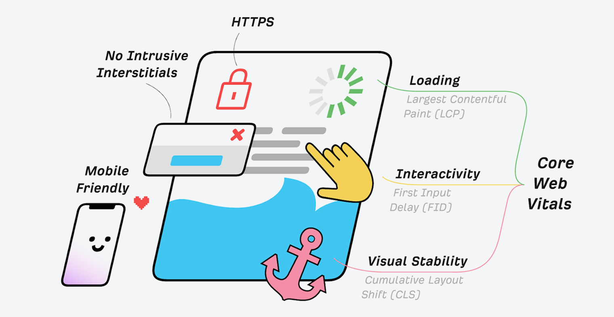
https://ahrefs.com/blog/core-web-vitals/

#### Core Web Vitals

#### HTTPS

[HTTPS](https://ahrefs.com/zh/blog/what-is-https/) 可保护浏览器与服务器之间的通信不被攻击者拦截或篡改。这为当今绝大多数的网络流量提供了机密性、完整性和身份验证。你应该希望页面通过 HTTPS 而非 HTTP 加载。

任何在地址栏中显示“锁”形图标的网站都使用 HTTPS 协议。

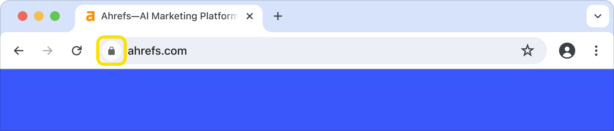

#### 移动端友好性

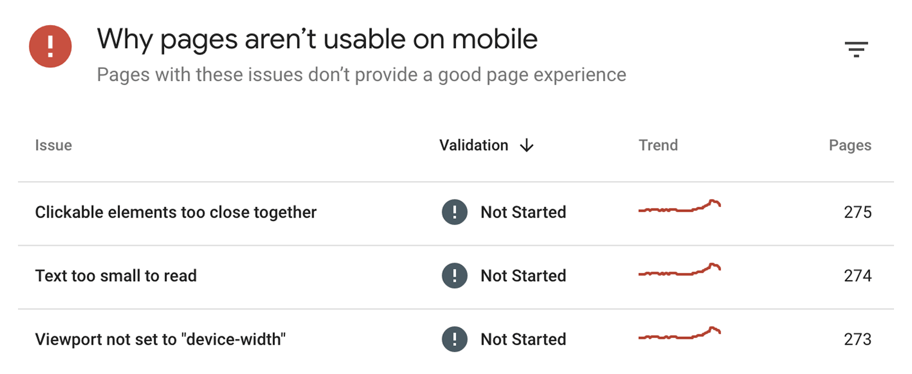

这份报告会告诉你，你的页面是否存在移动设备友好性问题。

#### 插页式广告

[插页式广告](https://developers.google.com/search/blog/2016/08/helping-users-easily-access-content-on)会阻止内容被看到。这些弹出窗口会覆盖主要内容，用户可能需要与其进行交互才能使其消失。

### Hreflang——用于多语言

[Hreflang](https://ahrefs.com/zh/blog/hreflang-tags/) 是一种 HTML 属性，用于指定网页的语言和地理定位。如果你有同一页面的多个语言版本，可以使用 hreflang 标签告知 Google 等搜索引擎这些变体，从而帮助它们向用户展示正确的版本。

Ahrefs 现在通过 **Site Audit** 中的可视化 hreflang 链接图简化了 hreflang 的部署。

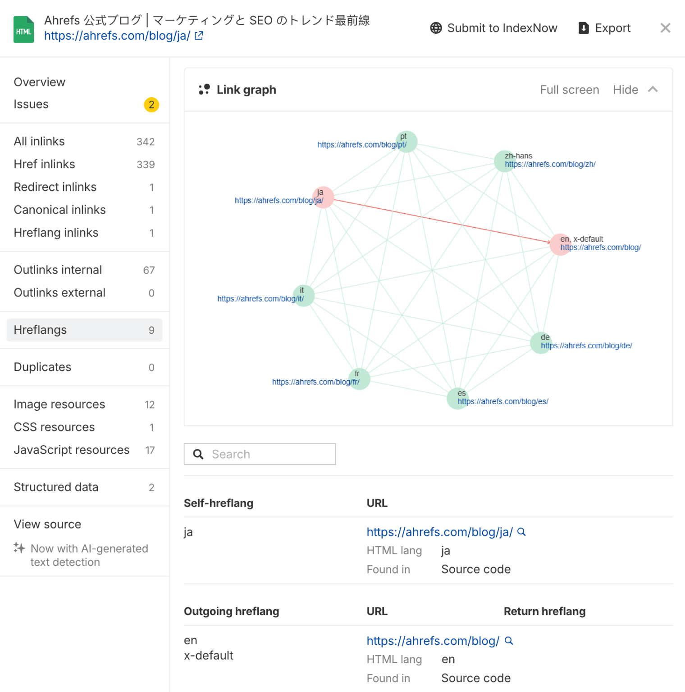

这张 hreflang 图表展示了页面的所有语言版本，并突出了配置问题。此外，它还会标记无效的语言代码、缺少自我引用链接、缺少双向标签等错误，并给出清晰的修复指引。

### 常规维护/网站健康

这些任务不太可能对你的排名产生很大影响，但对于提升用户体验来说是件好事。

#### 失效链接

失效链接是你网站上指向不存在资源的链接。它们可能是内部链接（即指向你域名下的其他页面），也可能是外部链接（即指向其他域名的页面）。

您可以通过[Site Audit](https://ahrefs.com/zh/site-audit)中的**链接**报告快速查找网站上的失效链接，该功能可在[Ahrefs 免费版](https://ahrefs.com/zh/free)中使用。

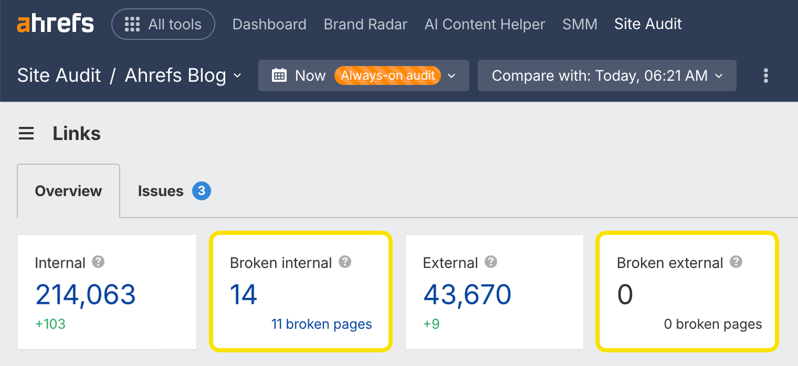

#### 重定向链

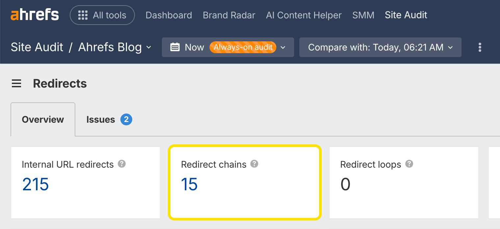

* * *

第7部分

## 技术性 SEO 工具

这些工具可帮助你改进网站的技术层面。

### [谷歌搜索控制台](https://search.google.com/search-console/about)

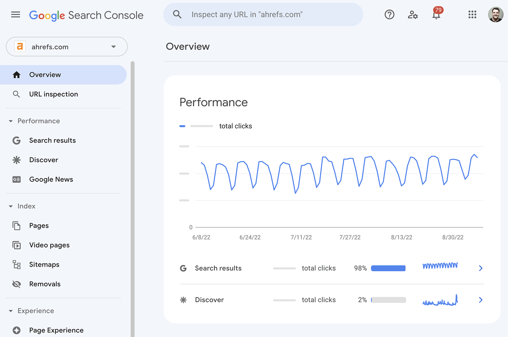

Google Search Console（以前叫 Google Webmaster Tools）是 Google 提供的一项免费服务，可帮助你监控网站在搜索结果中的表现并对其进行故障排除。

利用它，你可以发现并修复技术错误、提交站点地图、查看结构化数据问题等。

[Bing](https://www.bing.com/toolbox/webmaster) 和 [Yandex](https://webmaster.yandex.com/welcome/) 都有各自的版本，Ahrefs 同样如此。[Ahrefs 免费版](https://ahrefs.com/zh/free)可以帮助您提升网站的 SEO 表现。它可以让您：

*   监控网站的 SEO 健康状况。

*   全面检查 100 多项 SEO 常见问题。

*   查看所有反向链接。

*   查看您获得排名的所有关键词。

*   了解您的页面获取了多少流量。

*   寻找内部链接机会。

它是我们针对 Google Search Console 局限性给出的解决方案。

### [Google 移动友好测试](https://search.google.com/test/mobile-friendly)

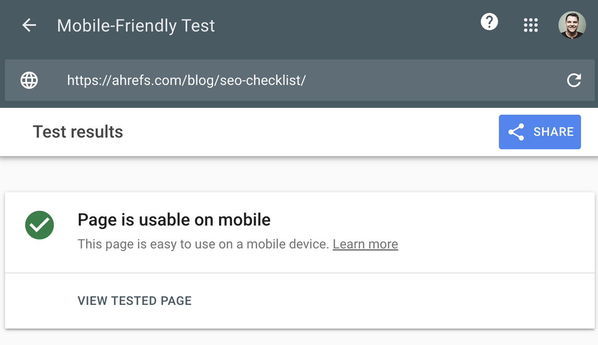

Google 的移动友好测试会检查访客在移动设备上使用你页面的便捷程度。它还能识别特定的移动可用性问题，例如文字太小难以阅读、使用了不兼容的插件等。

测试会显示 Google 在抓取页面时看到的内容。你也可以使用[富媒体搜索结果测试](https://search.google.com/test/rich-results)来查看 Google 在桌面端或移动设备上看到的内容。

### [Chrome 开发者工具](https://developers.google.com/web/tools/chrome-devtools/)

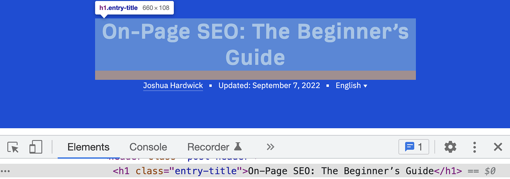

Chrome 开发者工具是 Chrome 内置的网页调试工具。你可以用它来调试页面速度问题、提升网页渲染性能等。

从技术性 SEO 的角度来看，它有无穷无尽的用途。

### [Ahrefs SEO Toolbar](https://ahrefs.com/zh/seo-toolbar)

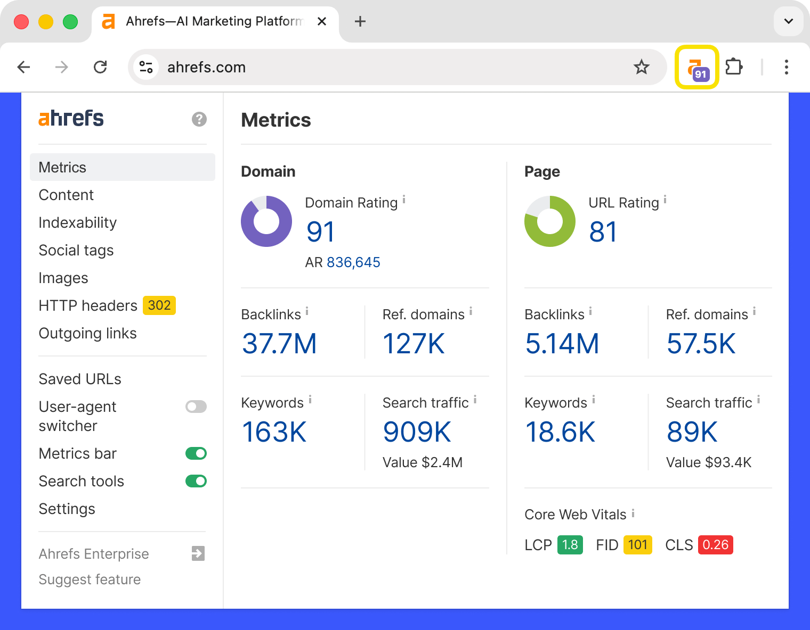

Ahrefs SEO Toolbar 是一款适用于 [Chrome](https://chrome.google.com/webstore/detail/ahrefs-seo-toolbar/hgmoccdbjhknikckedaaebbpdeebhiei) 和 [Firefox](https://addons.mozilla.org/en-US/firefox/addon/ahrefs-seo-toolbar/) 的免费扩展，可为你访问的页面和网站提供有用的 SEO 数据。

它的免费功能包括：

*   页面 SEO 报告

*   使用 HTTP 标头的重定向追踪器

*   失效链接检查器

*   链接高亮显示

*   SERP 排名

此外，作为 Ahrefs 用户，你还可以获得：

*   你访问的每个网站、页面以及 Google 搜索结果的 SEO 指标

*   在 SERP 中直接显示关键词指标，例如搜索量和关键词难度

*   SERP 结果导出

### [PageSpeed Insights](https://ahrefs.com/zh/blog/pagespeed-insights/)

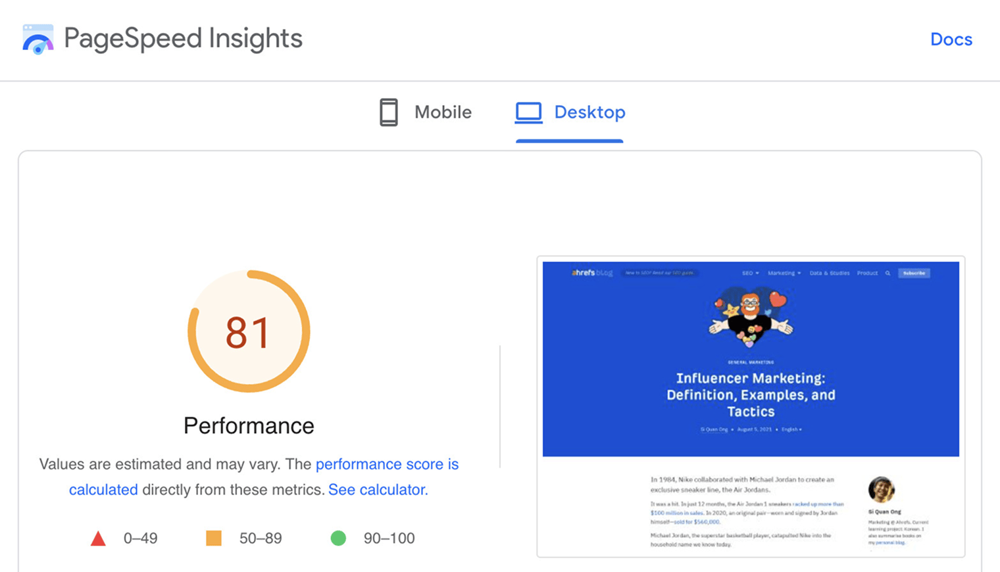

PageSpeed Insights 会分析网页的加载速度。除了性能评分之外，它还会给出可执行的建议，帮助页面更快加载。
