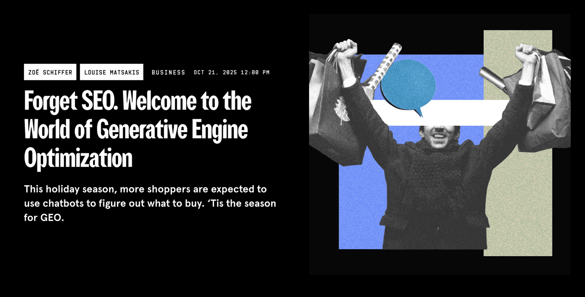
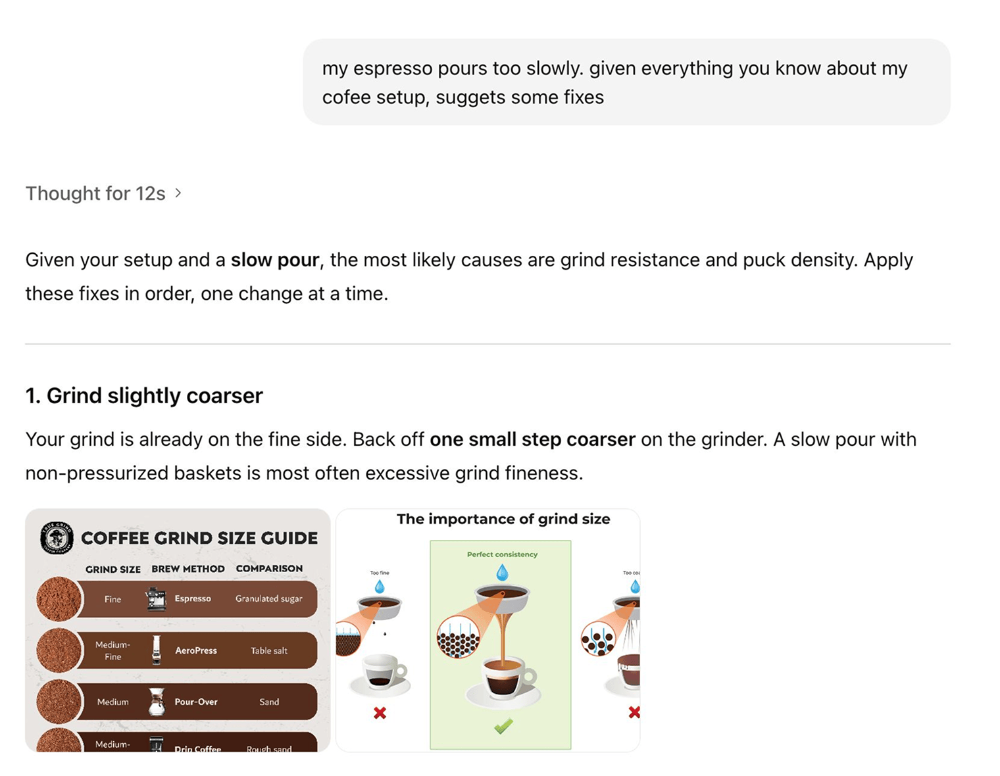
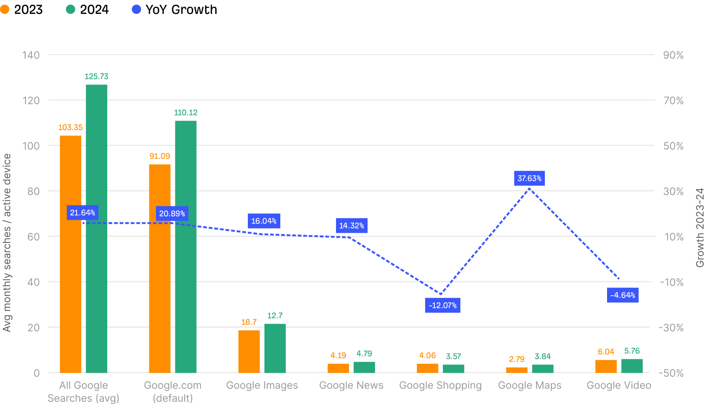
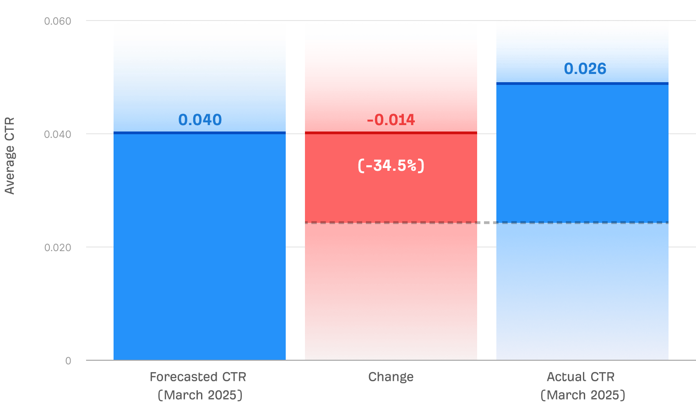
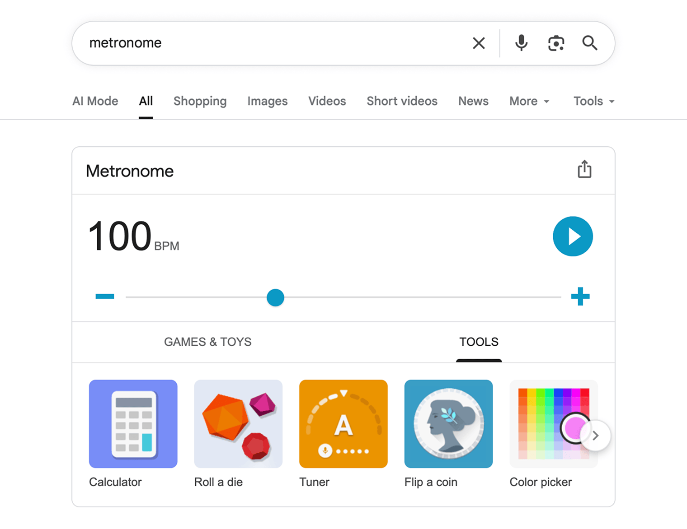
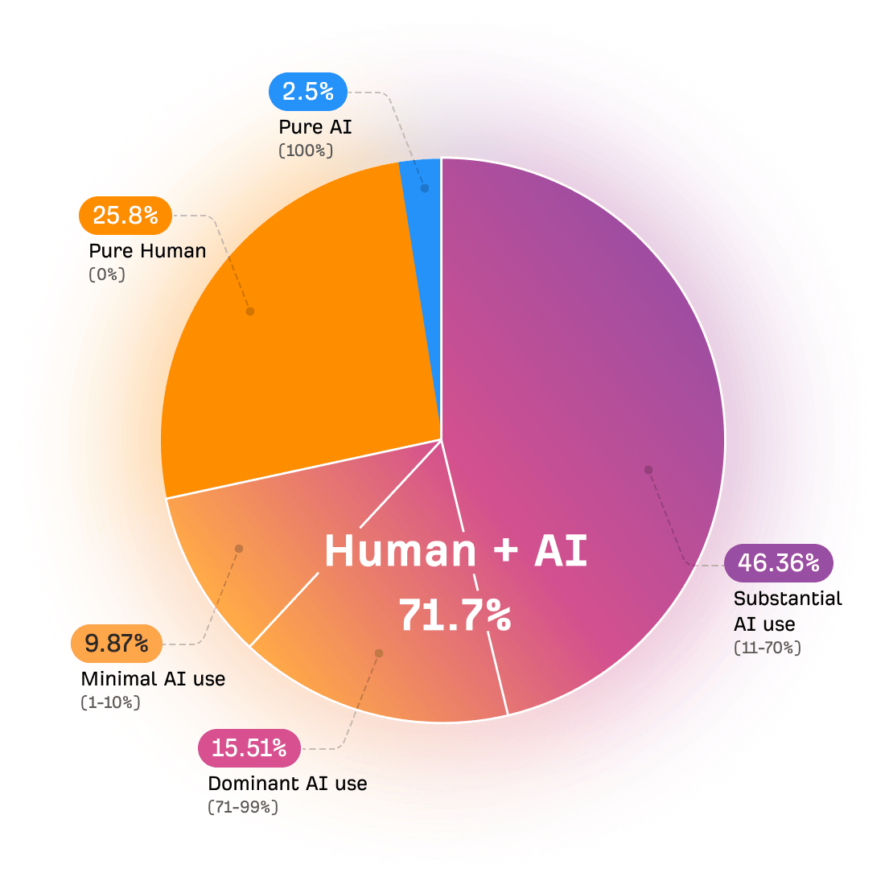
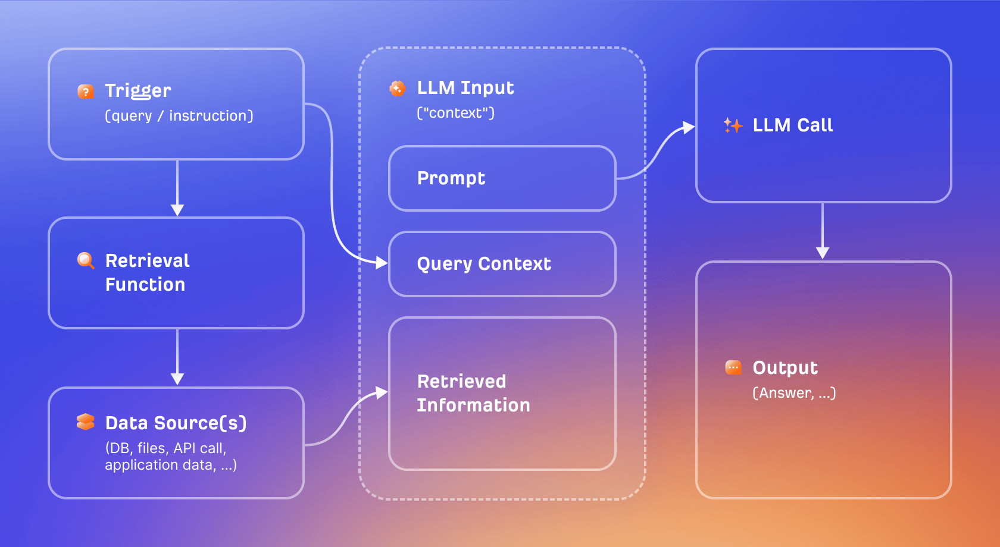
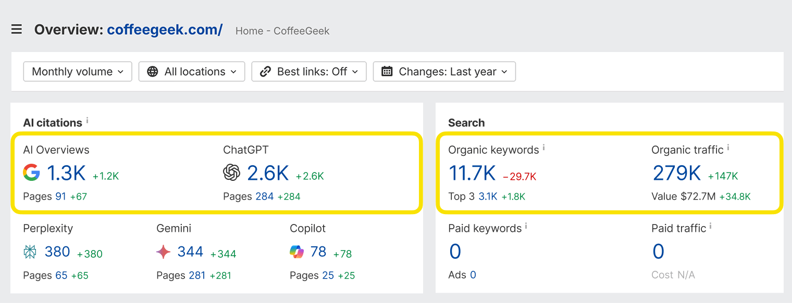
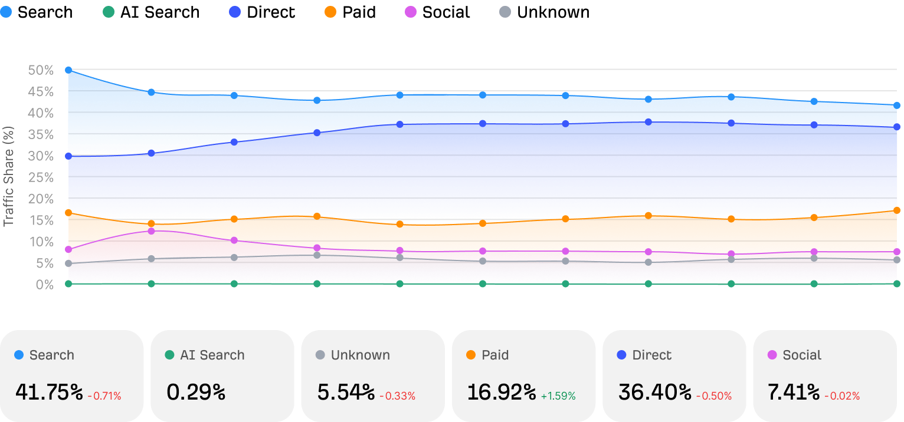

Title: AI 对 SEO 的意义

URL Source: https://ahrefs.com/zh/seo/what-ai-means-for-seo

Published Time: Tue, 21 Jul 2026 02:16:59 GMT

Markdown Content:
如今谈到 SEO，已经离不开生成式 AI。

随便在 Google 搜索任何一个关键词，你都有很大概率会在搜索结果中看到 AI 生成的答案。如今，许多人使用 AI 来发布 SEO 内容，比以往任何时候都更快、成本也更低。甚至还可以通过像 ChatGPT 和 Perplexity 这样的 AI 助手，调研任意公司，并直接购买其产品。

因此，一个新的流行词应运而生：GEO，即生成引擎优化（Generative Engine Optimization），指的是提升在 ChatGPT 等 AI 助手中可见度的过程。有些主流新闻媒体还发布了如下这类夸张标题：

*   _“生成引擎优化（GEO）如何重写搜索规则”_

*   _“随着 AI 使用量飙升，企业正从 SEO 转向 GEO”_

*   _“忘掉 SEO 吧。欢迎来到生成引擎优化的世界”_

那么，生成式 AI 是否已经[扼杀了 SEO](https://ahrefs.com/zh/blog/is-seo-dead/)？我们是否应该减少对搜索引擎优化的关注，转而将更多精力投入到生成引擎优化上呢？

并非如此。事实上，SEO 比以往任何时候都更重要。因为 SEO 的三大支柱——内容创作、外部链接建设和技术健康——对于出现在 AI 搜索结果中都至关重要。

如果您想为未来做好准备，并让您的品牌在搜索引擎 _和_ 生成式 AI 中可见，SEO 是最理想的起点。

* * *

第1部分

## AI 究竟如何改变了 SEO

抛开那些炒作不谈，如今的 SEO 确实在一些重要方面发生了变化。

### Google 不再是获取答案的唯一途径

如果我想冲一杯完美的意式浓缩咖啡，或者学习如何将玫瑰修剪到最佳状态，我更可能打开 ChatGPT 而不是 Google。AI 助手提供了一种与传统搜索截然不同的搜索体验，更具个性化和互动性。

ChatGPT 会记住我拥有的咖啡机类型，并根据我们过去的互动记录来定制建议。

有这样想法的并非我一个：在过去两年里，ChatGPT 的[周活跃用户数已增长至 8 亿](https://www.demandsage.com/chatgpt-statistics/)。此外，还有数十种替代品，如 Perplexity、Claude、Gemini 和 Grok，每个都拥有数百万用户。而且，借助 ChatGPT 的[即时结账](https://chatgpt.com/merchants/) 等功能，用户可以直接在 AI 助手里完成产品的研究、比较和购买。

尽管 AI 助手发展迅猛，但 Google 的使用量并**未相应减少**。在 2024 年 AI 热潮最盛之时，[Google 的年度搜索量反而增长了 22%](https://sparktoro.com/blog/new-research-google-search-grew-20-in-2024-receives-373x-more-searches-than-chatgpt/)，相当于每日搜索量是 ChatGPT 的 373 倍。

2023–2024 年 Google 搜索增长趋势

来源：基于 Datos 2023-2024 年美国桌面端用户面板数据的分析。

大多数人似乎是在使用 ChatGPT 和其他 AI 助手的 _同时_，也会使用 Google 搜索。因此，基于这些数据，我们不应将重心放在用 ChatGPT _取代_ Google 上，而是应同时关注 ChatGPT _与_ Google。

### 流量减少（零点击搜索增多）

由于 AI 的影响，现在从 Google 搜索获得自然搜索流量比以前要稍微难一些。

最大的“罪魁祸首”是 AI Overviews。目前，美国超过[20% 的关键词](https://ahrefs.com/zh/blog/ai-overview-triggers/)都会显示 AI Overview。这种由 AI 生成的答案会总结许多排名靠前的搜索结果（从而降低搜索者为满足搜索意图而点击进入博客文章的必要性）。

如果在包含 AI Overview 的 SERP 中排名首位，则该 AI Overview 将使您获得的点击量 [平均减少 34.5%](https://ahrefs.com/zh/blog/ai-overviews-reduce-clicks/)。

AIO 对首位页面点击率（CTR）的影响 300,000 万关键词分析

但重要的是，这一趋势早在 AI 出现之前就已开始。

早在 2024 年，[60% 的 Google 搜索都以未点击结束](https://sparktoro.com/blog/2024-zero-click-search-study-for-every-1000-us-google-searches-only-374-clicks-go-to-the-open-web-in-the-eu-its-360/)。零点击搜索（即用户在 _无需_ 点击任何搜索结果的情况下就已获得满意答案的 Google 搜索）多年来一直在增长，这主要得益于以下因素：

*   更多 **赞助结果和广告**

*   更多**交互式工具**，例如：Google 的计算器、表情符号、节拍器和取色器等

*   其他 **“零点击”搜索功能**，比如精选摘要

在 Google 搜索关键词“节拍器”时，你会发现搜索结果不再是博客文章或视频，而是一个交互式工具。Google 正不断提升提供此类工具的能力，以更好地满足这类搜索意图。

但来自 Google 的流量减少，并不等于 _没有_ 流量。只要网站仍然能够获得 _足够_ 的流量，以证明对内容创作的投入物有所值，SEO 就仍然值得开展。SEO 依然是一个利润极其丰厚的营销渠道。

### 内容创作成本比以往任何时候都低

有多少页面是由 AI 创建或辅助生成的？

基于 Ahrefs 于 2025 年 4 月发布的研究数据（每个域名选取一个页面） ，涵盖 90 万+  个网页。

AI 让每个人都更容易创作 SEO 内容。与此同时，大家可能会感觉竞争比以往任何时候都更激烈。但关键在于，Google（甚至像 ChatGPT 这样的 AI 助手）_希望_ 展示并奖励由专家撰写的高质量内容。

如果你愿意投入技巧和精力，去深耕你精通的领域，你将有很多机会超越那些平庸的 AI 生成内容。

### AI 让 SEO 更快、更高效

生成式 AI 带来的并非全是负面影响：许多 SEO 策略都可以借助生成式 AI 变得更快、更高效。

借助名为[MCP 服务器](https://ahrefs.com/zh/blog/what-is-mcp-server/)的工具，您可以使用 ChatGPT 或 Claude 与 Ahrefs 进行“对话”，并要求其[代表您执行常见 SEO 任务](https://ahrefs.com/zh/blog/mcp-use-cases/)，例如：

*   **挖掘热门趋势关键词**（并探究其热度攀升的背后原因）。

*   **返回网站的失效反向链接列表**（并为您撰写邮件文案，以便修复反向链接）。

*   **分析竞争对手**，并总结他们的 SEO 策略。

以下是一些网站列表，这些网站会针对“在线购买男士运动服套装”“男士在线时尚商店”和“男士无袖连帽衫”等词排名，每月来自搜索的访客在 50,000 到 100 万之间。

| 网站 | 2025 年 9 月自然搜索流量 | Ahrefs 域名评分 |
| --- | --- | --- |
| madewell.com | 666,020 | 78 |
| ssense.com | 468,321 | 82 |
| reebok.com | 428,610 | 78 |
| belk.com | 417,738 | 74 |
| grailed.com | 324,965 | 76 |
| vineyardvines.com | 312,001 | 71 |
| cottonon.com | 295,383 | 74 |
| bonobos.com | 272,380 | 75 |
| dxl.com | 256,394 | 63 |
| forever21.com | 231,605 | 79 |
| yesstyle.com | 222,134 | 75 |
| stitchfix.com | 201,177 | 79 |
| boohooman.com | 191,050 | 69 |

* * *

第2部分

## 为什么 SEO 比以往任何时候都更重要

鉴于仍有大量用户习惯使用 Google 等传统搜索引擎，SEO 依然举足轻重。但在生成式 AI 时代，SEO 的重要性 _更_ 远超许多人的认知，原因很简单：SEO 同样是 AI 搜索的基石。

### AI 搜索的有效运行依赖于 SEO

生成式 AI 存在“幻觉”问题：像 ChatGPT 和 Gemini 这样的工具容易出错并编造说法，尤其是在它们不太了解的话题上。

AI 助手通过一种被称为 _事实锚定_ 的过程来解决这一问题。许多查询——尤其是那些需要最新、实时信息的搜索——会促使 AI 助手进行网络搜索，以查找有用且相关的内容，并将其整合到最终回答中。

Google Gemini 在其运行过程中会使用 Google 搜索；Microsoft Copilot 使用 Bing；ChatGPT 和 Meta 则结合使用这两者；Claude 使用 Brave 。以下是 [AI 助手如何执行‘“事实锚定”搜索](https://techcommunity.microsoft.com/blog/fasttrackforazureblog/grounding-llms/3843857)的示例：

因此，在搜索引擎中针对相关主题排名靠前的网站，其页面更有可能被 AI 助手检索并使用。

如果你销售咖啡机，并且成功在 Google 的“最适合新手的咖啡机”或“如何保养你的 Nespresso”等关键词上获得高排名，那么你的内容和品牌极有可能会被纳入 AI 关于类似主题的对话中。

coffeegeek.com 在大量咖啡相关关键词的搜索中名列前茅……同时也频繁出现在与咖啡相关的 AI 对话中。

这真是个好消息，因为我们早就知道如何在搜索引擎中获得排名——这就是 SEO（而你刚刚已经读完了一整本关于它的书）。

### 核心 SEO 策略同样有利于 AI 搜索

这意味着，您已经采取的许多提升 SEO 表现的操作，同样 _也_ 有助于提高 AI 可见度：

*   **内容创作：**搜索引擎与 AI 助手的核心价值都在于解答用户问题，并在用户需要时提供有价值的信息。因此，创建高质量且相关性强的内容，是同时提升您在 AI 搜索 _和_ 传统搜索中可见度的最佳途径。

*   **链接建设：** AI 助手并不像传统搜索引擎那样重视反向链接（尽管它们仍然有间接影响：更多的反向链接通常意味着更好的搜索排名，从而提升 AI 可见度）。但 AI 助手 _确实_ 非常重视“品牌提及”——即品牌和产品在第三方网站上被提及的次数以及出现的上下文环境。许多链接建设策略，例如数字公关、品牌合作和客座博客，也同样适用于建立品牌提及。

*   **技术优化：** 确保网站设置合理，以便 AI 助手能够访问您的内容，这一点至关重要。不要在 robots.txt 文件中屏蔽 AI 爬虫，应使用简洁易懂的格式来排版页面，也不要将关键信息隐藏在大量的 JavaScript 代码之后。

若您不确定该把精力集中在哪里，SEO 的三大支柱始终是绝佳选择：内容创作、建立外部链接与品牌提及，以及优化网站的技术健康状况。

### Google 仍然是你最有效的营销渠道

避免非此即彼的思维定式很重要。Google 搜索或许更具竞争性（并且给许多网站带来的流量会略有减少），但即便如此，Google 依然是您可以利用的最有效的营销渠道之一。

Google 搜索依然能够为您的网站带来大量相关且高质量的流量。事实上，当我们分析了 71,000 个网站的流量分布时发现，**Google 搜索是第一大流量来源**，占所有网站流量的近 **42%**（相比之下，_所有_ AI 助手合计仅占 0.29%）。

按类别划分的流量 主要类别随时间推移的流量分布。

来源：https://chatgpt-vs-google.com/

阻止竞争对手在相关关键词上轻松占据主导地位仍然是一个好策略。即使搜索环境比以前略微缩小，成为最大品牌仍然是最佳选择。即便 SEO 比以前略难或成本更高，它仍然能够带来巨大的投资回报。这才是最重要的。

* * *

第3部分

## 你的 SEO 大脑将为你铺就未来的道路

生成式 AI 正以惊人的速度发展演进，要跟上每一次变化都十分困难。

但我有个好消息。做 SEO 的人通常充满好奇、乐于尝试，而且，坦白说还有点不服输。您可以把这些特质的组合称为“SEO 大脑”，而正是这些技能，将使您在未来几年 AI 所带来的不确定世界中脱颖而出。

SEO 与 AI 搜索之间存在巨大的交集，本指南中涵盖的所有 SEO 策略对于提升您在 AI 搜索中的可见度都至关重要。但即便未来世界真的发生变化，SEO 和 AI 搜索成为两个独立的领域，_今天_ 学习 SEO 仍然是迎接 _明天_ 的最佳准备方式。

强化你的 SEO 大脑，一切皆有可能。
