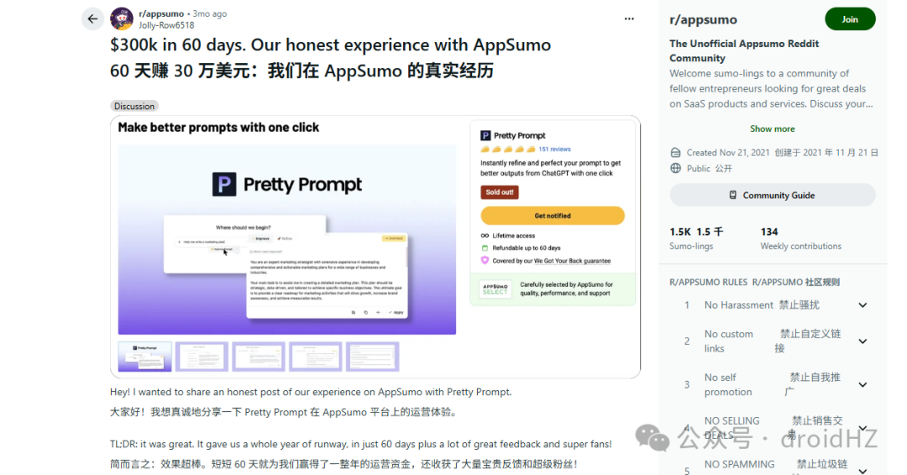
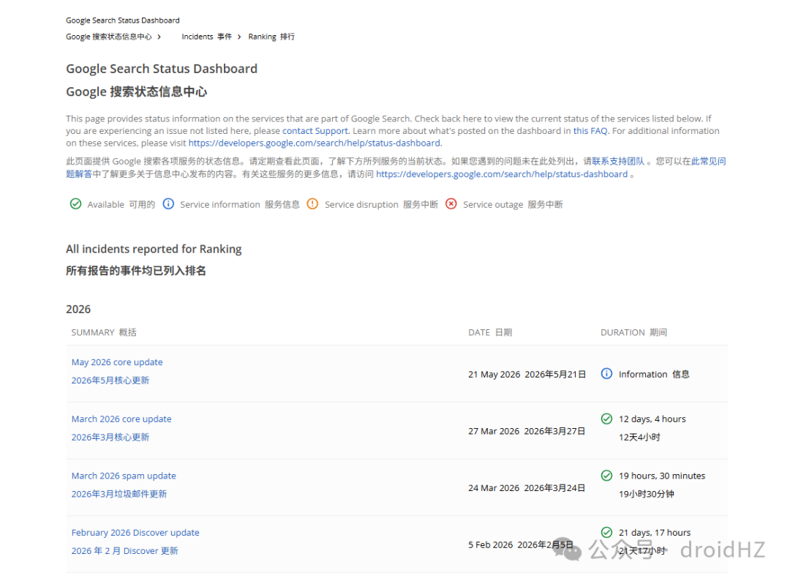
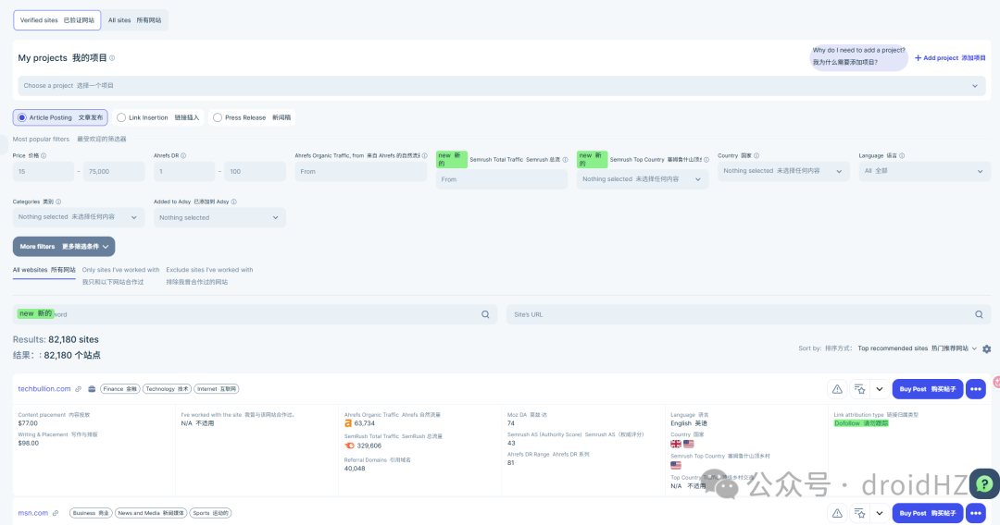
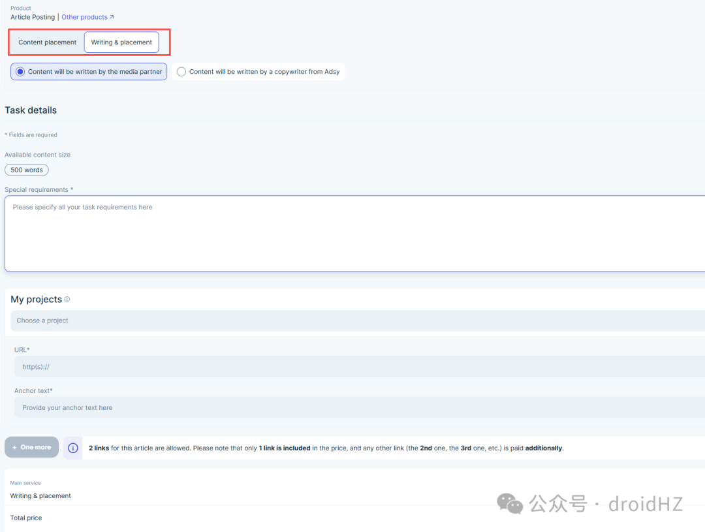
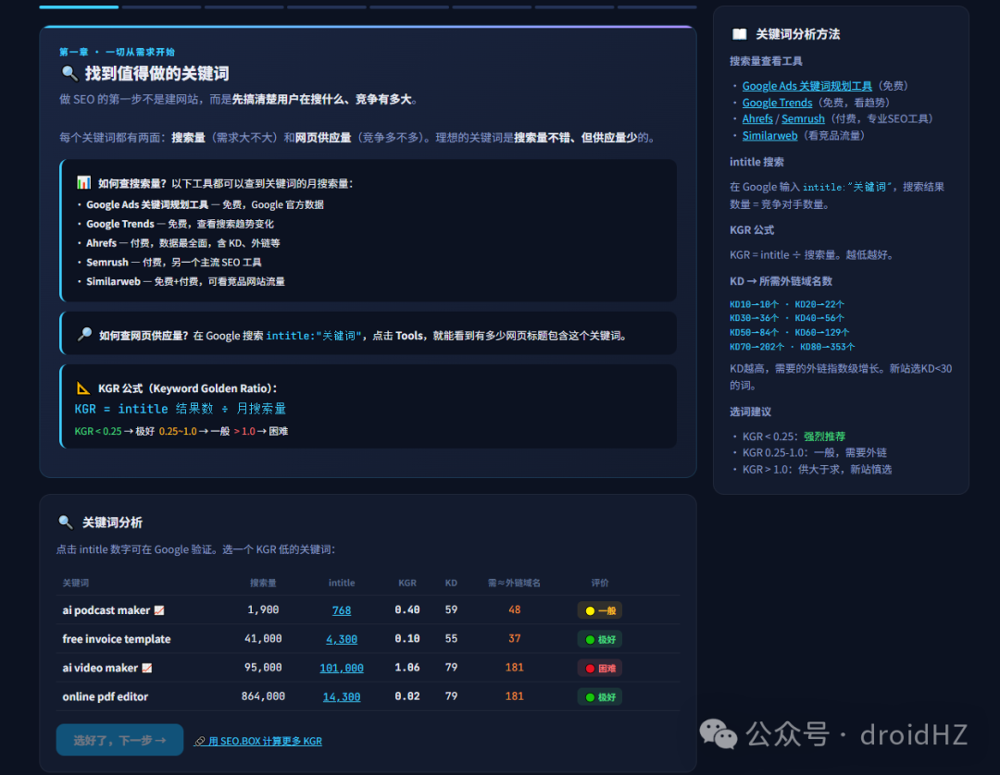

# 网站出海分享：使用AITDK 检测网站GEO问题

早上好，朋友们！大家都比较关心关注的GEO，最近发现AITDK的插件也增加了一个GEO的检测，大家可以给自己的网页或者三方平台引流的文章都测试一下，看看是否能够更好的被AI推荐，然后做针对性的优化。检测后会得到一个 GEO Score，并拆成 5 个部分：AI 爬虫访问、机器可读性、结构化数据、内容可引用性、信任与 E-E-A-T。AI 爬虫访问（AI Crawler Access）这一部分主要检测 5 个点：AI 训练爬虫能否访问、AI 搜索爬虫能否访问、ChatGPT-User 等用户触发的抓取能否读取真实内容、页面有没有 noindex，以及 nosnippet 等设置是否限制 AI 引用网页内容。大家可以检查网站的 robots.txt、页面 robots meta 和响应头，确认需要的 AI 爬虫可以正常访问，同时页面没有误加 noindex 或 nosnippet，避免网页可以访问，却不能进入搜索或被引用。openai 文档地址：https://developers.openai.com/api/docs/bots机器可读性（Machine Readability）除了能访问，页面还要容易读取。大家可以检查主要内容是否直接存在于 HTML 中，title、H1、description 是否完整，以及网站有没有 sitemap、canonical，URL 是否清晰稳定。这些原本就是 SEO 的基础，在 GEO 里同样重要。还可以给网站添加 llms.txt。它有点像给 AI 准备的网站说明书，用 Markdown 告诉 AI 网站是谁、有哪些重要内容，以及对应页面的地址。llms.txt说明文档：https://llmstxt.org/结构化数据（Structured Data）结构化数据可以帮助机器更明确地识别网站、作者、发布时间和内容类型。大家可以根据页面类型添加 FAQPage、HowTo、BreadcrumbList 等内容结构，再用 Organization、Person 或 WebSite 说明网站和作者是谁。Google 文档地址：https://developers.google.com/search/docs/appearance/structured-data/intro-structured-data?hl=zh-cnimage.png内容与可引用性（Content & Citability）清晰的标题层级、列表、表格，以及开头先给答案，都方便 AI 提取内容。写文章时，可以把部分 H2 改成用户会搜索的问题，然后在段落开头直接回答，再补充数据和来源。这样既方便用户阅读，也是在给 AI 提供可以直接使用的答案片段。GEO 论文在 1 万条查询的实验中发现，给内容增加可靠来源、相关数据和权威引用，可以让内容在生成式回答中的可见性最高提升约 40%；单纯堆关键词则没有明显帮助。当然，这是特定实验结果，并不代表改完一定会被 AI 推荐。文档地址：https://arxiv.org/abs/2311.09735信任与 E-E-A-T（Trust & E-E-A-T）最后一部分是 Trust 与 E-E-A-T，主要关注作者、发布时间、About、Contact、隐私政策，以及品牌信息是否一致。大家可以给文章增加真实作者和更新时间，并在网站导航或底部放好 About、Contact、Privacy、Terms 等页面。Google 的实用内容指南也给出了相同方向：内容要有第一手经验、明确来源和作者信息，并真正帮助用户解决问题，而不只是为了排名。对 AI 来说，能读懂内容只是第一步，是否愿意引用，还要看内容是否可信。Google文档地址：https://developers.google.com/search/docs/fundamentals/creating-helpful-content?hl=zh-cn大家可以把一些GEO的标准，在写一个页面的时候结合进去。也可以在页面检测有GEO的一些问题时，让ai 去进行部分修改。

早上好，朋友们！

大家都比较关心关注的GEO，最近发现AITDK的插件也增加了一个GEO的检测，大家可以给自己的网页或者三方平台引流的文章都测试一下，看看是否能够更好的被AI推荐，然后做针对性的优化。

检测后会得到一个 GEO Score，并拆成 5 个部分：AI 爬虫访问、机器可读性、结构化数据、内容可引用性、信任与 E-E-A-T。

AI 爬虫访问（AI Crawler Access）

这一部分主要检测 5 个点：AI 训练爬虫能否访问、AI 搜索爬虫能否访问、ChatGPT-User 等用户触发的抓取能否读取真实内容、页面有没有 noindex，以及 nosnippet 等设置是否限制 AI 引用网页内容。

大家可以检查网站的 robots.txt、页面 robots meta 和响应头，确认需要的 AI 爬虫可以正常访问，同时页面没有误加 noindex 或 nosnippet，避免网页可以访问，却不能进入搜索或被引用。

openai 文档地址：https://developers.openai.com/api/docs/bots

机器可读性（Machine Readability）

除了能访问，页面还要容易读取。大家可以检查主要内容是否直接存在于 HTML 中，title、H1、description 是否完整，以及网站有没有 sitemap、canonical，URL 是否清晰稳定。这些原本就是 SEO 的基础，在 GEO 里同样重要。

还可以给网站添加 llms.txt。它有点像给 AI 准备的网站说明书，用 Markdown 告诉 AI 网站是谁、有哪些重要内容，以及对应页面的地址。

llms.txt说明文档：https://llmstxt.org/

结构化数据（Structured Data）

结构化数据可以帮助机器更明确地识别网站、作者、发布时间和内容类型。大家可以根据页面类型添加 FAQPage、HowTo、BreadcrumbList 等内容结构，再用 Organization、Person 或 WebSite 说明网站和作者是谁。

Google 文档地址：https://developers.google.com/search/docs/appearance/structured-data/intro-structured-data?hl=zh-cn

内容与可引用性（Content & Citability）

清晰的标题层级、列表、表格，以及开头先给答案，都方便 AI 提取内容。写文章时，可以把部分 H2 改成用户会搜索的问题，然后在段落开头直接回答，再补充数据和来源。这样既方便用户阅读，也是在给 AI 提供可以直接使用的答案片段。

GEO 论文在 1 万条查询的实验中发现，给内容增加可靠来源、相关数据和权威引用，可以让内容在生成式回答中的可见性最高提升约 40%；单纯堆关键词则没有明显帮助。当然，这是特定实验结果，并不代表改完一定会被 AI 推荐。

文档地址：https://arxiv.org/abs/2311.09735

信任与 E-E-A-T（Trust & E-E-A-T）

最后一部分是 Trust 与 E-E-A-T，主要关注作者、发布时间、About、Contact、隐私政策，以及品牌信息是否一致。大家可以给文章增加真实作者和更新时间，并在网站导航或底部放好 About、Contact、Privacy、Terms 等页面。

Google 的实用内容指南也给出了相同方向：内容要有第一手经验、明确来源和作者信息，并真正帮助用户解决问题，而不只是为了排名。对 AI 来说，能读懂内容只是第一步，是否愿意引用，还要看内容是否可信。

Google文档地址：https://developers.google.com/search/docs/fundamentals/creating-helpful-content?hl=zh-cn

大家可以把一些GEO的标准，在写一个页面的时候结合进去。也可以在页面检测有GEO的一些问题时，让ai 去进行部分修改。

我是赫兹，专注网站出海，持续分享网站出海内容。新朋友可以看看之前的文章合集；想系统学习，也推荐关注哥飞老师，我很多方法是向他学习的，微信搜索 361079 就可以找到他。

网站出海每日分享

网站出海深度总结
