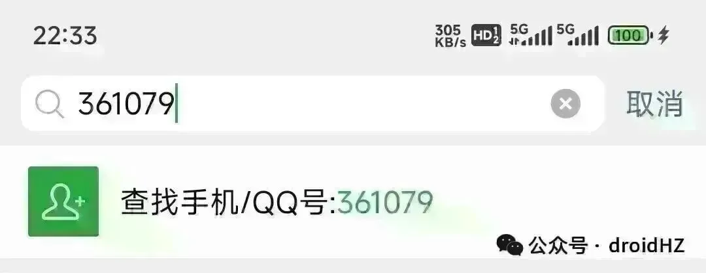

# 网站出海分享：查看外链的几种方式

早上好，朋友们！ 我们日常提交外链，或者通过找需求，有一个经常需要用到的功能，就是查看网站的外链，今天分享一下可以查看外链的几种方式。ahrefs、similarweb 付费工具查看用工具应该是大家比较常用的一个方式，similarweb在反向链接分析就可以直接查看到ahrefs 查看外链是更好的选择，因为可以做一些spam，最佳链接的筛选，价格也会比similarweb 更贵Bing 的站长工具这个在上次的分享大会上，小羊老师也讲过的一个方法，在bing 的站长工具那里，反向链接，选择到任何站点的反向链接，然后添加要对比的网站，这个时候查看详细报告，就能看到你对比网站的所有外链，这个是bing爬虫获取到的外链。这种方法完全免费，而且可以全部导出。 bing.com/webmasters/backlinksAITDK 插件的新功能AITDK 最佳更新了一个新版本，增加了挺多功能的，其中有个功能Backlinks，就是可以看外链，但是只能看部分外链，类似于ahrefs.com/backlink-checker/ 这个免费版本，也是只能看部分外链。搜索语法看外链可以直接用搜索语法搜索域名，大概率也是网站的外链，这种方式找到的外链是被Google收录的页面，同时你也可以高级搜索筛选时间，查看最佳被收录的新外链。 比如pollo，我们就可以用搜索语法："pollo.ai" -site:pollo.ai我是赫兹，专注网站出海第417天，持续分享网站出海内容。新朋友可以看看之前的文章合集；想系统学习，也推荐关注哥飞老师，我很多方法是向他学习的，微信搜索 361079 就可以找到他。网站出海每日分享网站出海深度总结

早上好，朋友们！ 我们日常提交外链，或者通过找需求，有一个经常需要用到的功能，就是查看网站的外链，今天分享一下可以查看外链的几种方式。

## ahrefs、similarweb 付费工具查看

用工具应该是大家比较常用的一个方式，similarweb在反向链接分析就可以直接查看到

ahrefs 查看外链是更好的选择，因为可以做一些spam，最佳链接的筛选，价格也会比similarweb 更贵

## Bing 的站长工具

这个在上次的分享大会上，小羊老师也讲过的一个方法，在bing 的站长工具那里，反向链接，选择到任何站点的反向链接，然后添加要对比的网站，这个时候查看详细报告，就能看到你对比网站的所有外链，这个是bing爬虫获取到的外链。这种方法完全免费，而且可以全部导出。 bing.com/webmasters/backlinks

## AITDK 插件的新功能

AITDK 最佳更新了一个新版本，增加了挺多功能的，其中有个功能Backlinks，就是可以看外链，但是只能看部分外链，类似于ahrefs.com/backlink-checker/ 这个免费版本，也是只能看部分外链。

## 搜索语法看外链

可以直接用搜索语法搜索域名，大概率也是网站的外链，这种方式找到的外链是被Google收录的页面，同时你也可以高级搜索筛选时间，查看最佳被收录的新外链。 比如pollo，我们就可以用搜索语法："pollo.ai" -site:pollo.ai

我是赫兹，专注网站出海第417天，持续分享网站出海内容。新朋友可以看看之前的文章合集；想系统学习，也推荐关注哥飞老师，我很多方法是向他学习的，微信搜索 361079 就可以找到他。

网站出海每日分享

网站出海深度总结
