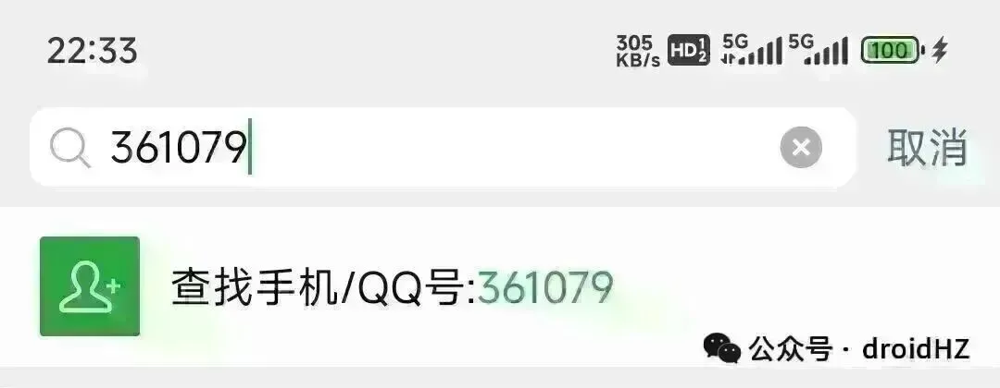

# 网站出海每日分享：从推广渠道找需求

早上好，朋友们！问大家一个问题，如果你现在有一个产品，用户留存也不错，ROI也跑正了，接下来你会怎么做？大家应该都会是：想办法去推广，把这个产品放大吧，所有我们逆向一下，推广渠道，其实也可以是你挖掘需求的地方。举几个常见的例子：通过广告去挖掘需求可以是tk、facebook、google ads 的广告。大家做产品，需要对广告保持一种敏感性。 比如ads 大家可以用sitedata 插件发现一些投广告的代理商，然后通过这些代理商在Google官方的 广告信息公开中心查询：adstransparency.google.com 持续在投的广告可能就是ROI 还不错的需求。通过外链找需求我们上新站，为了获取SEO的流量，外链是一个很重要的渠道，可能第一时间就会买一些自己认为高价值的外链。这个时候你就可以在一些高价值的外链平台去看最近提交上来的网站。你就会发现一些新词需求（比如新词seedance 2刚出来的时候，toolify 一页全是seedance 2），或者各种方向的需求。我知道有的朋友是做了一些导航站或者producthunt 这种网站产品的监控的。还有就是哥飞老师社群去年网站流量排行榜有个网站，就是用这种方式挖到的需求。通过reddit 挖掘大家常说reddit 是金矿，有很多朋友会在上面推广产品，有时可以去刷一刷，看看别人分享的项目，或者推广的帖子，比如我在sideproject 看到的这个项目 DistilBook ，第一个月就破千刀了大家还可以根据自己常用的推广渠道，去挖掘一些其他的需求。

早上好，朋友们！

问大家一个问题，如果你现在有一个产品，用户留存也不错，ROI也跑正了，接下来你会怎么做？大家应该都会是：想办法去推广，把这个产品放大吧，所有我们逆向一下，推广渠道，其实也可以是你挖掘需求的地方。

举几个常见的例子：

## 通过广告去挖掘需求

可以是tk、facebook、google ads 的广告。大家做产品，需要对广告保持一种敏感性。 比如ads 大家可以用sitedata 插件发现一些投广告的代理商，然后通过这些代理商在Google官方的 广告信息公开中心查询：adstransparency.google.com 持续在投的广告可能就是ROI 还不错的需求。

## 通过外链找需求

我们上新站，为了获取SEO的流量，外链是一个很重要的渠道，可能第一时间就会买一些自己认为高价值的外链。这个时候你就可以在一些高价值的外链平台去看最近提交上来的网站。你就会发现一些新词需求（比如新词seedance 2刚出来的时候，toolify 一页全是seedance 2），或者各种方向的需求。我知道有的朋友是做了一些导航站或者producthunt 这种网站产品的监控的。还有就是哥飞老师社群去年网站流量排行榜有个网站，就是用这种方式挖到的需求。

## 通过reddit 挖掘

大家常说reddit 是金矿，有很多朋友会在上面推广产品，有时可以去刷一刷，看看别人分享的项目，或者推广的帖子，比如我在sideproject 看到的这个项目 DistilBook ，第一个月就破千刀了

大家还可以根据自己常用的推广渠道，去挖掘一些其他的需求。

我是赫兹，专注网站出海第383天，持续分享网站出海内容。新朋友可以看看之前的文章合集；想系统学习，也推荐关注哥飞老师，我很多方法是向他学习的，微信搜索 361079 就可以找到他。

网站出海每日分享

网站出海深度总结
