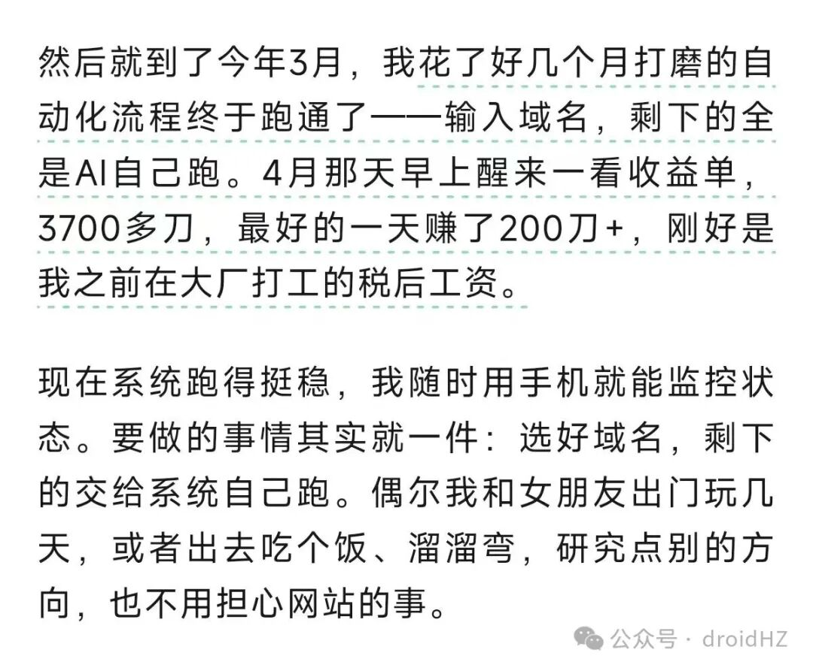
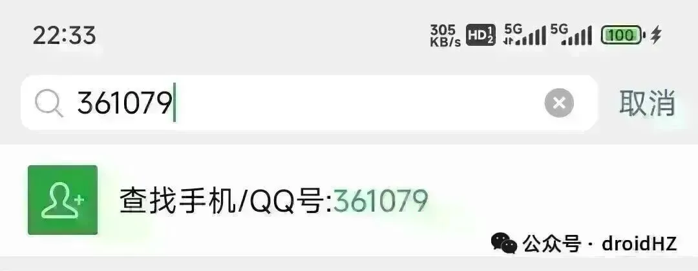

# 网站出海每日分享：Google 垃圾内容政策，做网站需要关注的一些红线

早上好，朋友们！Google 有一份官方的垃圾内容政策，列出了哪些行为会导致网站降权甚至被移除。今天把里面常见的的几条拆出来，分享给大家。文档地址：https://developers.google.com/search/docs/essentials/spam-policies?hl=zh-cn规模化内容滥用这条是最近几年更新频率最高的，尤其是 AI 普及之后，批量生成大量页面，被K站的，我看很多朋友都遇到过这个问题。常见违规场景：用 AI 批量生成大量低质量文章爬取其他网站的内容，聚合发布短时间上线大量的页面用 AI 辅助写内容本身没问题，问题是内容有没有真实价值。你自己愿不愿意看、能不能帮用户解决问题。外链Google 官方明确把购买链接列为违规行为，不过实际上，我感觉很多人在买付费外链，并没有出问题。这里需要辨证来看。Google 打击的并不是"付费"这个动作本身，应该是低质量、大规模、明显以操纵排名为目的的链接行为。比如用自动程序批量生成链接、在毫不相关的论坛签名里堆外链、找垃圾站批量互换等。如果你购买的是有真实流量、内容相关、权重合理的网站上的外链，对方网站本身对用户是有价值的，这类外链的风险就低很多。Google 的应该是会判断链接质量。那什么才算好的外链？几个判断维度：有真实流量、网站活跃且近期有收录、DR 有一定权重、运营时间够长、内容和你的网站相关。几个需要注意的点：大量互换链接，容易被识别，需要要小心抄竞品外链时，ahrefs 会对垃圾外链打 SPAM 标记，这类过滤掉爬取内容直接复制别人网站的内容发布到自己网站，这是很多人建站初期会踩的坑。也有可能是你用同一套模板上线了不同网站，内容没有修改（我知道有朋友也踩过这个坑的）违规行为：把别人的内容原封不动搬过来只做了最小修改就重新发布嵌入其他网站的内容但没有任何附加价值关键字堆砌在页面里大量重复堆砌关键词，读起来很别扭，明显不是给人看的——这就是关键字堆砌。常见形式：页脚放一大串城市名或服务词同一个关键词在一篇短文里出现几十次用看不见的方式（白色背景白色字）藏关键词内容写给用户看，关键词自然出现就好。总之。Google 垃圾政策的核心逻辑只有一条：内容是给用户看的，凡是为了操纵排名而不是服务用户的行为，都在打击范围内。

早上好，朋友们！

Google 有一份官方的垃圾内容政策，列出了哪些行为会导致网站降权甚至被移除。今天把里面常见的的几条拆出来，分享给大家。

文档地址：https://developers.google.com/search/docs/essentials/spam-policies?hl=zh-cn

## 规模化内容滥用

这条是最近几年更新频率最高的，尤其是 AI 普及之后，批量生成大量页面，被K站的，我看很多朋友都遇到过这个问题。

常见违规场景：

用 AI 批量生成大量低质量文章

爬取其他网站的内容，聚合发布

短时间上线大量的页面

用 AI 辅助写内容本身没问题，问题是内容有没有真实价值。你自己愿不愿意看、能不能帮用户解决问题。

## 外链

Google 官方明确把购买链接列为违规行为，不过实际上，我感觉很多人在买付费外链，并没有出问题。这里需要辨证来看。

Google 打击的并不是"付费"这个动作本身，应该是低质量、大规模、明显以操纵排名为目的的链接行为。比如用自动程序批量生成链接、在毫不相关的论坛签名里堆外链、找垃圾站批量互换等。

如果你购买的是有真实流量、内容相关、权重合理的网站上的外链，对方网站本身对用户是有价值的，这类外链的风险就低很多。Google 的应该是会判断链接质量。

那什么才算好的外链？

几个判断维度：有真实流量、网站活跃且近期有收录、DR 有一定权重、运营时间够长、内容和你的网站相关。

几个需要注意的点：

大量互换链接，容易被识别，需要要小心

抄竞品外链时，ahrefs 会对垃圾外链打 SPAM 标记，这类过滤掉

## 爬取内容

直接复制别人网站的内容发布到自己网站，这是很多人建站初期会踩的坑。也有可能是你用同一套模板上线了不同网站，内容没有修改（我知道有朋友也踩过这个坑的）

违规行为：

把别人的内容原封不动搬过来

只做了最小修改就重新发布

嵌入其他网站的内容但没有任何附加价值

## 关键字堆砌

在页面里大量重复堆砌关键词，读起来很别扭，明显不是给人看的——这就是关键字堆砌。

常见形式：

页脚放一大串城市名或服务词

同一个关键词在一篇短文里出现几十次

用看不见的方式（白色背景白色字）藏关键词

内容写给用户看，关键词自然出现就好。

总之。Google 垃圾政策的核心逻辑只有一条：内容是给用户看的，凡是为了操纵排名而不是服务用户的行为，都在打击范围内。

我是赫兹，专注网站出海第378天，持续分享网站出海内容。新朋友可以看看之前的文章合集；想系统学习，也推荐关注哥飞老师，我很多方法是向他学习的，微信搜索 361079 就可以找到他。

网站出海每日分享

网站出海深度总结
