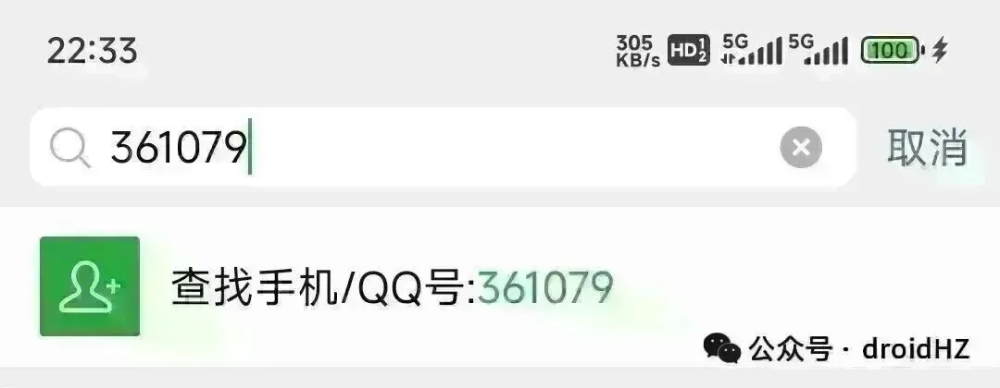

# 网站出海每日分享：clarity 看AI访问引用情况

早上好，朋友们！ 今天分享一个Clarity 的新功能，AI Visibility，这个可以看到AI的引用和AI爬虫的的访问具体入口在左上角新增的AI Visibility ，点击你可以看到: Citation 看AI引用你没有 Bot Activity 看AI爬虫访问的情况查看AI 引用使用Citation 需要先认证一下的你域名，可以直接选择GSC，然后Google 登录认证。认证成功后，就可以看到 Grounding queries 是AI 引用是用到的相关关键词，My cited pages是对应的页面。右上角有个View analysis，点击后可以直接看到这些AI来源的用户的一些基本数据和录屏查看机器人访问选择Bot Activity ，刚进入时也是需要连接cloudflare ，点击上面的cloudflare 的API Token 跳转链接去创建对应的密钥。在cloudflare 上，添加全选里面，按照Clarity的要求配置对应的权限，我的是中文版，英文版配置看Clarity上面的截图。然后同意创建对应的密钥。把创建好的密钥粘贴带Clarity 上，让选择对应的域名，就链接上了，等待一小时左右就可以看到爬虫的访问数据了。通过分析这些AI的引用和访问数据，大家可以挖掘哪些词哪些页面容易被引用，从而去做相应的词和页面。也可以看看这些AI 来的用户实际体验是什么样的（录屏），会不会过度消耗你的服务器 等等。

早上好，朋友们！ 今天分享一个Clarity 的新功能，AI Visibility，这个可以看到AI的引用和AI爬虫的的访问

具体入口在左上角新增的AI Visibility ，点击你可以看到: Citation 看AI引用你没有 Bot Activity 看AI爬虫访问的情况

## 查看AI 引用

使用Citation 需要先认证一下的你域名，可以直接选择GSC，然后Google 登录认证。

认证成功后，就可以看到 Grounding queries 是AI 引用是用到的相关关键词，My cited pages是对应的页面。右上角有个View analysis，点击后可以直接看到这些AI来源的用户的一些基本数据和录屏

## 查看机器人访问

选择Bot Activity ，刚进入时也是需要连接cloudflare ，点击上面的cloudflare 的API Token 跳转链接去创建对应的密钥。

在cloudflare 上，添加全选里面，按照Clarity的要求配置对应的权限，我的是中文版，英文版配置看Clarity上面的截图。然后同意创建对应的密钥。把创建好的密钥粘贴带Clarity 上，让选择对应的域名，就链接上了，等待一小时左右就可以看到爬虫的访问数据了。

通过分析这些AI的引用和访问数据，大家可以挖掘哪些词哪些页面容易被引用，从而去做相应的词和页面。也可以看看这些AI 来的用户实际体验是什么样的（录屏），会不会过度消耗你的服务器 等等。

我是赫兹，专注网站出海第372天，持续分享网站出海内容。新朋友可以看看之前的文章合集；想系统学习，也推荐关注哥飞老师，我很多方法是向他学习的，微信搜索 361079 就可以找到他。

网站出海每日分享

网站出海深度总结
