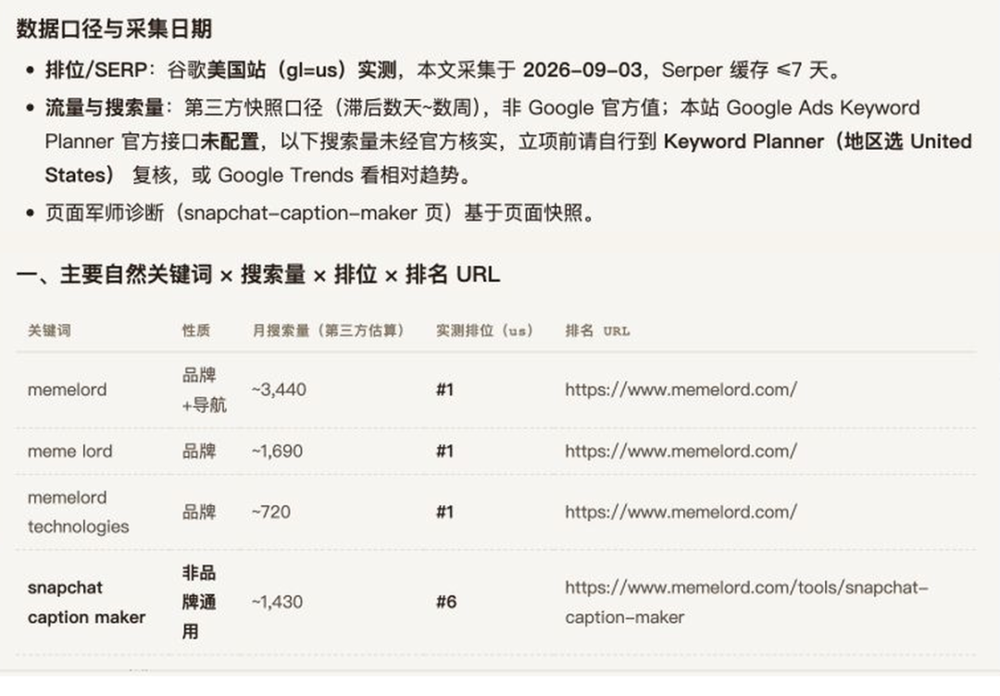
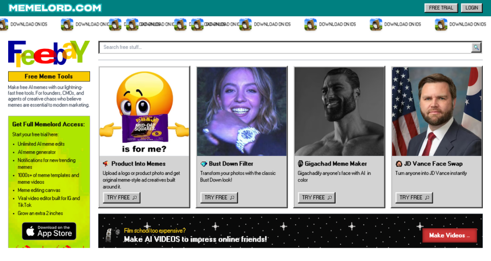
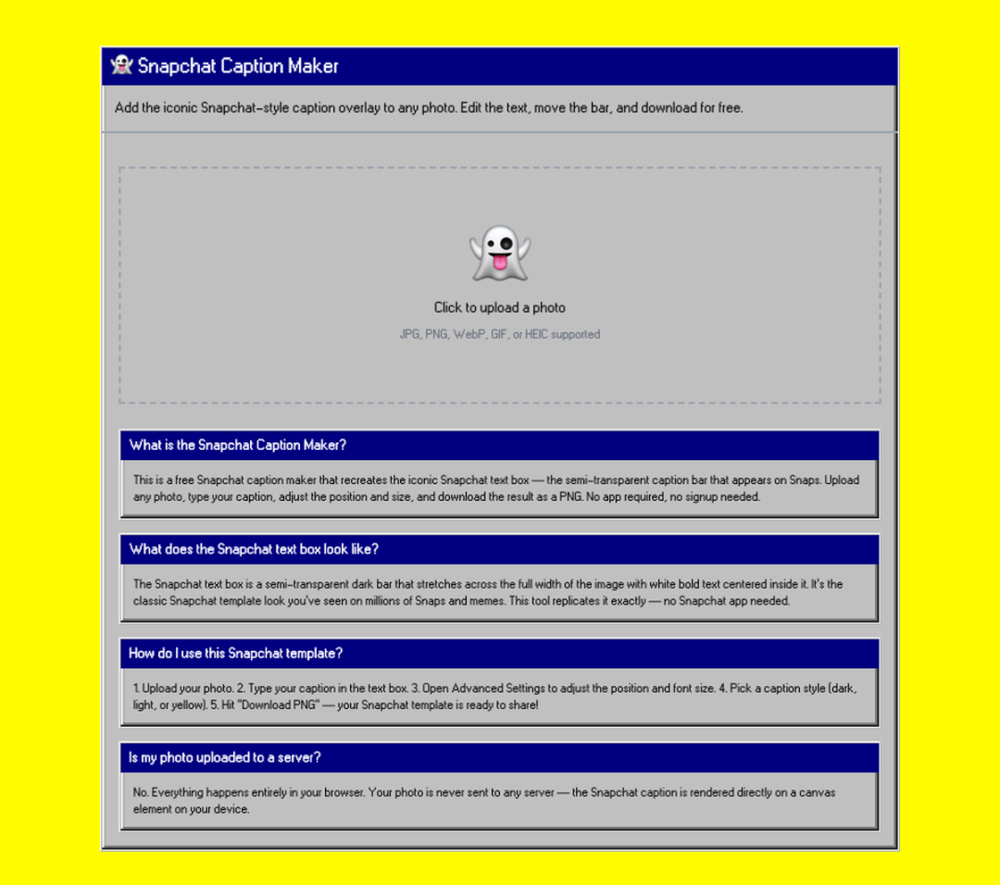

# 19岁大学退学，后来靠卖表情包素材起步，不到一年融资300万美元

封面大家好，我是哥飞。Jason Levin 19 岁时从大学退学。几年后，这个不会写代码的年轻人，做了一款专门帮人追热点、找素材、制作 Meme（网络梗图）的软件。他最早甚至没有做软件，只是每天发一封包含 Meme 素材的付费邮件，再把素材放进 Google Slides。有人愿意每月付 6.90 美元看这些内容，他就先靠这套很简陋的产品做到了月收入 1000 美元。后来，他用 Bubble 搭出第一版 Memelord，年经常性收入（ARR）做到约 10 万美元。产品上线约 8 个月后，也就是2025 年 5 月，完成了种子轮融资，不过直到 9 月，他才公布金额是300 万美元。软件做出来以后，获客不能一直只靠 Jason 发内容。官网也要让没看过他文章的人找到 Memelord。第一版只是一封付费邮件和 Google SlidesJason 从中学时就开始在网上做内容：用 Photoshop 修图、拍 YouTube 视频，琢磨什么内容更容易在社交平台传播。后来给创业公司做增长，他每天都要追热点、找合适的 Meme，再尽快改成自己的版本发布。从 2022 年开始，他围绕 Meme 营销连续写了 150 多周。做得越久，他越清楚最费时间的并不是改图，而是每次都要从头找素材。一个热点刚出现时，相关素材散落在 X、Reddit、Instagram 和各种群组里。找到之后，还要下载、改文字、换脸、调整尺寸，再拿去不同平台发布。动作都不难，但每次都要重复。Jason 想要的，是一个“给 Meme 用的 Google Alerts 加 Adobe”：新梗出现时自动提醒，点开以后马上就能编辑。可他没有直接做软件。他先每天发一封包含 Meme 素材的付费邮件，向订阅者收取每月 6.90 美元，再用 Google Slides 交付素材。等这套产品做到每月约 1000 美元收入以后，他才开始开发 Memelord。做到每月 1000 美元以后，Jason 确认了一件事：有人愿意为省下找素材、处理素材的时间付费。Jason Levin 创始人资料卡Jason 先用付费邮件验证需求，再把同一套工作流程做成软件。不会写代码，就先用 Bubble 做Memelord 第一版是在 Bubble 上搭出来的。Jason 后来公开过后台：为了完成加字、旋转、编辑等操作，他堆了 400 多个工作流。这些工作流已经能让用户找到新梗、做出图片并发出去。Jason 一边写内容、做 Meme，一边自己使用产品，也靠自己的读者和社交账号持续带来用户。这个 Bubble 版本最终做到约 10 万美元 ARR，而且是在聘请工程师之前完成的。2024 年 9 月 25 日，第一版 Memelord 上线，他也辞掉工作全职投入。到 2025 年 5 月完成融资，中间大约 8 个月。拿到资金后，他请来 CTO 和工程师，把产品从头重做；同年 9 月，他正式公布这轮 300 万美元种子轮融资。新版本不再只是一个 Meme 编辑器。它会监控新出现的热门 Meme，发送提醒，让用户在画布里改图、换脸、生成视频，也开始把部分能力开放成 API。到 2026 年 2 月，Memelord 又上线了 iOS 应用。从付费邮件到无代码网页，再到正式的软件团队和移动端，产品形态一直在变，解决的仍是最初那个问题：少刷一会儿信息流，更快找到能用的 Meme。Memelord 当前官网首页首页首先强调 Meme 产品定位，右上角直接提供免费试用。Memelord 目前采用订阅制。个人月付档是每月 19.99 美元，提供 3 天试用；更高的 Max 档是每月 199 美元，提供 7 天试用。Memelord 当前收费方案Monthly 月付档提供 3 天试用，Max 档提供 7 天试用。创始人会做内容，网站能不能自己带来用户？我想弄明白，Memelord 的网站有没有形成新的流量入口，就从官网的访问量和来源看起。Memelord 做到约 10 万美元 ARR 的过程中，Jason 一直在靠文章、热点 Meme 和自己的社交账号带来用户。这条路能完成冷启动，却很难一直靠一个人放大。公司拿到融资、产品重新开发以后，官网需要承担更多工作：让一个没读过 Jason 文章、也没关注他账号的人，通过搜索或者别人分享的页面第一次遇见 Memelord。Similarweb 估算显示，按全球所有流量计算，memelord.com 在 2026 年 6 月约有 8.9 万次访问，和上个月基本持平。移动网页占 54.31%，略高于桌面端的 45.69%。Memelord 访问量与设备分布6 月访问量约 8.9 万，手机端带来的访问略多。自然搜索占 38.68%，高于直接访问的 32.78%，是最大的单一渠道；自然社媒和付费社交合计占 21.09%。搜索入口已经占到不小比例。接下来要看这些人是在搜 Memelord，还是先搜索某种做图需求，再遇见 Memelord。Memelord 流量来源渠道自然搜索超过直接访问，接下来再看这些搜索来自品牌名还是具体需求。2026 年 9 月 3 日，我让哥飞 SEO Agent 继续查了美国地区的关键词、排名和对应页面。排在前面的几乎全是memelord、meme lord和memelord technologies。这几组词都排在第 1 位，但搜索者本来就在找这个品牌。在这次实测里，能把陌生用户带进来的通用词中，最突出的是snapchat caption maker：月搜索量约 1430，Memelord 的页面排在第 6 位。而更大的meme maker和ai meme generator，官网没有进入美国 Google 前十。哥飞 SEO Agent 返回的 Memelord 关键词结果网站已经拿到品牌搜索，但通用需求带来的入口还很少。所以，Memelord 的搜索渠道已经有了规模，但在美国地区这轮实测里，强排名仍然偏向品牌词。用户搜索品牌名来到官网，和陌生人先搜一个具体需求再发现 Memelord，是两种不同的增长方式。它已经开始补免费工具页官网已经上线了一个免费工具目录，里面有 Snapchat 字幕生成器、Meme 去背、换脸、头像滤镜、Logo 转 Meme 等一批小工具。每一个工具都对应一个可以单独搜索、单独分享的需求。Memelord 免费工具目录免费工具已经很多，网站正在把不同的 Meme 玩法拆成独立入口。具体看进入排名的Snapchat Caption Maker：页面上半部分可以直接上传图片、修改字幕并下载；下面接着解释这种字幕条是什么、怎么使用、图片是否上传服务器，最后再链接到其他免费工具。Memelord 的 Snapchat Caption Maker 页面页面上既有操作区，也有使用方法和常见问题。这个结果说明，小而具体的免费工具已经开始带来搜索入口。只是 Memelord 现在做出来的页面很多，进入前列的通用词还不多。比起继续无差别增加工具数量，更有效的做法是围绕已经出现搜索需求的 Meme 玩法，补齐真实示例、可编辑模板、更新时间和相关工具之间的链接。用户进来就能完成一次制作，再顺手进入完整版产品，免费页面也能成为试用入口。我之前在《【哥飞 SEO 教程】以 Canva.com/sizes/ 页面为例说明如何做内页拿流量》里讲过类似做法。给功能分配一个独立 URL 只是第一步，每个页面还要完整解决一个明确需求。哥飞的判断Jason 按风险从低到高推进：先用付费邮件确认有人愿意付钱，再用 Bubble 做出能用的版本；收入稳定后请工程师重做产品，最后用移动端、API 和免费工具页扩大入口。现在 Memelord 已经搭起了一批可以被搜索的免费页面。自然搜索也成了最大的单一访问渠道，但美国地区这轮实测里，排上去的通用需求只有少数。Memelord 接下来要做的，是把 Jason 对热点和 Meme 的理解，持续变成陌生用户也能搜到、打开就能用的页面。先用最便宜的方式确认有人付钱，再决定软件该怎么做；产品做起来以后，再把个人获客能力变成网站自己的入口。如果你也在做工具站，可以检查两个问题：第一批付费用户从哪里来？如果你停止发内容，网站还会不会继续遇到新用户？如果你是第一次看我的文章，也简单介绍一下我自己。我是哥飞，做网站和 SEO 很多年了，现在在运营“哥飞的朋友们”社群。平时我会和大家一起研究怎么挖掘需求、做网站、获取流量，再把流量变成收入。如果你想进一步了解我和这个社群，可以从下面几篇文章开始：想先了解我为什么做这个社群，以及它为什么能持续三年：在教人赚钱这件事情上，我干了三年了，居然口碑不错想看社群朋友如何把 SEO 和做网站变成真实结果：我的4000人出海创业社群里，靠SEO赚到钱的人都做对了什么？想看看社群里的分享和交流是什么样：650位朋友来到深圳，在哥飞的朋友们2026年中分享交流会里都学到了这些想看看大家如何在一天里把想法做成上线的网站：一个词根、一个白天、175支交卷的队伍——“哥飞的朋友们”上站Hackathon深圳站侧记如果看完之后觉得这个社群适合你，可以加哥飞微信咨询了解。微信搜索框，输入 361079，点击查找 QQ 号，就能加哥飞微信了。哥飞微信

大家好，我是哥飞。

Jason Levin 19 岁时从大学退学。几年后，这个不会写代码的年轻人，做了一款专门帮人追热点、找素材、制作 Meme（网络梗图）的软件。

他最早甚至没有做软件，只是每天发一封包含 Meme 素材的付费邮件，再把素材放进 Google Slides。有人愿意每月付 6.90 美元看这些内容，他就先靠这套很简陋的产品做到了月收入 1000 美元。

后来，他用 Bubble 搭出第一版 Memelord，年经常性收入（ARR）做到约 10 万美元。产品上线约 8 个月后，也就是2025 年 5 月，完成了种子轮融资，不过直到 9 月，他才公布金额是300 万美元。

软件做出来以后，获客不能一直只靠 Jason 发内容。官网也要让没看过他文章的人找到 Memelord。

## 第一版只是一封付费邮件和 Google Slides

Jason 从中学时就开始在网上做内容：用 Photoshop 修图、拍 YouTube 视频，琢磨什么内容更容易在社交平台传播。

后来给创业公司做增长，他每天都要追热点、找合适的 Meme，再尽快改成自己的版本发布。从 2022 年开始，他围绕 Meme 营销连续写了 150 多周。

做得越久，他越清楚最费时间的并不是改图，而是每次都要从头找素材。

一个热点刚出现时，相关素材散落在 X、Reddit、Instagram 和各种群组里。找到之后，还要下载、改文字、换脸、调整尺寸，再拿去不同平台发布。动作都不难，但每次都要重复。

Jason 想要的，是一个“给 Meme 用的 Google Alerts 加 Adobe”：新梗出现时自动提醒，点开以后马上就能编辑。

可他没有直接做软件。

他先每天发一封包含 Meme 素材的付费邮件，向订阅者收取每月 6.90 美元，再用 Google Slides 交付素材。等这套产品做到每月约 1000 美元收入以后，他才开始开发 Memelord。

做到每月 1000 美元以后，Jason 确认了一件事：有人愿意为省下找素材、处理素材的时间付费。

Jason 先用付费邮件验证需求，再把同一套工作流程做成软件。

## 不会写代码，就先用 Bubble 做

Memelord 第一版是在 Bubble 上搭出来的。

Jason 后来公开过后台：为了完成加字、旋转、编辑等操作，他堆了 400 多个工作流。这些工作流已经能让用户找到新梗、做出图片并发出去。

Jason 一边写内容、做 Meme，一边自己使用产品，也靠自己的读者和社交账号持续带来用户。这个 Bubble 版本最终做到约 10 万美元 ARR，而且是在聘请工程师之前完成的。

2024 年 9 月 25 日，第一版 Memelord 上线，他也辞掉工作全职投入。到 2025 年 5 月完成融资，中间大约 8 个月。拿到资金后，他请来 CTO 和工程师，把产品从头重做；同年 9 月，他正式公布这轮 300 万美元种子轮融资。

新版本不再只是一个 Meme 编辑器。它会监控新出现的热门 Meme，发送提醒，让用户在画布里改图、换脸、生成视频，也开始把部分能力开放成 API。

到 2026 年 2 月，Memelord 又上线了 iOS 应用。从付费邮件到无代码网页，再到正式的软件团队和移动端，产品形态一直在变，解决的仍是最初那个问题：少刷一会儿信息流，更快找到能用的 Meme。

首页首先强调 Meme 产品定位，右上角直接提供免费试用。

Memelord 目前采用订阅制。个人月付档是每月 19.99 美元，提供 3 天试用；更高的 Max 档是每月 199 美元，提供 7 天试用。

Monthly 月付档提供 3 天试用，Max 档提供 7 天试用。

## 创始人会做内容，网站能不能自己带来用户？

我想弄明白，Memelord 的网站有没有形成新的流量入口，就从官网的访问量和来源看起。

Memelord 做到约 10 万美元 ARR 的过程中，Jason 一直在靠文章、热点 Meme 和自己的社交账号带来用户。

这条路能完成冷启动，却很难一直靠一个人放大。公司拿到融资、产品重新开发以后，官网需要承担更多工作：让一个没读过 Jason 文章、也没关注他账号的人，通过搜索或者别人分享的页面第一次遇见 Memelord。

Similarweb 估算显示，按全球所有流量计算，memelord.com 在 2026 年 6 月约有 8.9 万次访问，和上个月基本持平。移动网页占 54.31%，略高于桌面端的 45.69%。

6 月访问量约 8.9 万，手机端带来的访问略多。

自然搜索占 38.68%，高于直接访问的 32.78%，是最大的单一渠道；自然社媒和付费社交合计占 21.09%。搜索入口已经占到不小比例。接下来要看这些人是在搜 Memelord，还是先搜索某种做图需求，再遇见 Memelord。

自然搜索超过直接访问，接下来再看这些搜索来自品牌名还是具体需求。

2026 年 9 月 3 日，我让哥飞 SEO Agent 继续查了美国地区的关键词、排名和对应页面。

排在前面的几乎全是memelord、meme lord和memelord technologies。这几组词都排在第 1 位，但搜索者本来就在找这个品牌。

在这次实测里，能把陌生用户带进来的通用词中，最突出的是snapchat caption maker：月搜索量约 1430，Memelord 的页面排在第 6 位。

而更大的meme maker和ai meme generator，官网没有进入美国 Google 前十。

网站已经拿到品牌搜索，但通用需求带来的入口还很少。

所以，Memelord 的搜索渠道已经有了规模，但在美国地区这轮实测里，强排名仍然偏向品牌词。用户搜索品牌名来到官网，和陌生人先搜一个具体需求再发现 Memelord，是两种不同的增长方式。

## 它已经开始补免费工具页

官网已经上线了一个免费工具目录，里面有 Snapchat 字幕生成器、Meme 去背、换脸、头像滤镜、Logo 转 Meme 等一批小工具。每一个工具都对应一个可以单独搜索、单独分享的需求。

免费工具已经很多，网站正在把不同的 Meme 玩法拆成独立入口。

具体看进入排名的Snapchat Caption Maker：页面上半部分可以直接上传图片、修改字幕并下载；下面接着解释这种字幕条是什么、怎么使用、图片是否上传服务器，最后再链接到其他免费工具。

页面上既有操作区，也有使用方法和常见问题。

这个结果说明，小而具体的免费工具已经开始带来搜索入口。只是 Memelord 现在做出来的页面很多，进入前列的通用词还不多。

比起继续无差别增加工具数量，更有效的做法是围绕已经出现搜索需求的 Meme 玩法，补齐真实示例、可编辑模板、更新时间和相关工具之间的链接。用户进来就能完成一次制作，再顺手进入完整版产品，免费页面也能成为试用入口。

我之前在《【哥飞 SEO 教程】以 Canva.com/sizes/ 页面为例说明如何做内页拿流量》里讲过类似做法。给功能分配一个独立 URL 只是第一步，每个页面还要完整解决一个明确需求。

## 哥飞的判断

Jason 按风险从低到高推进：先用付费邮件确认有人愿意付钱，再用 Bubble 做出能用的版本；收入稳定后请工程师重做产品，最后用移动端、API 和免费工具页扩大入口。

现在 Memelord 已经搭起了一批可以被搜索的免费页面。自然搜索也成了最大的单一访问渠道，但美国地区这轮实测里，排上去的通用需求只有少数。

Memelord 接下来要做的，是把 Jason 对热点和 Meme 的理解，持续变成陌生用户也能搜到、打开就能用的页面。

先用最便宜的方式确认有人付钱，再决定软件该怎么做；产品做起来以后，再把个人获客能力变成网站自己的入口。

如果你也在做工具站，可以检查两个问题：第一批付费用户从哪里来？如果你停止发内容，网站还会不会继续遇到新用户？

如果你是第一次看我的文章，也简单介绍一下我自己。

我是哥飞，做网站和 SEO 很多年了，现在在运营“哥飞的朋友们”社群。平时我会和大家一起研究怎么挖掘需求、做网站、获取流量，再把流量变成收入。

如果你想进一步了解我和这个社群，可以从下面几篇文章开始：

想先了解我为什么做这个社群，以及它为什么能持续三年：

在教人赚钱这件事情上，我干了三年了，居然口碑不错

想看社群朋友如何把 SEO 和做网站变成真实结果：

我的4000人出海创业社群里，靠SEO赚到钱的人都做对了什么？

想看看社群里的分享和交流是什么样：

650位朋友来到深圳，在哥飞的朋友们2026年中分享交流会里都学到了这些

想看看大家如何在一天里把想法做成上线的网站：

一个词根、一个白天、175支交卷的队伍——“哥飞的朋友们”上站Hackathon深圳站侧记

如果看完之后觉得这个社群适合你，可以加哥飞微信咨询了解。

微信搜索框，输入 361079，点击查找 QQ 号，就能加哥飞微信了。
