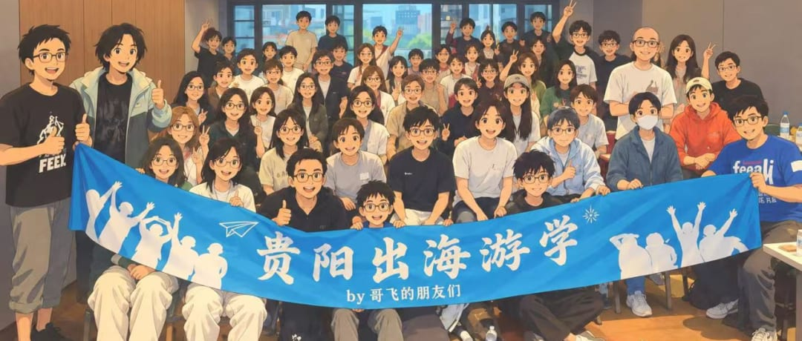
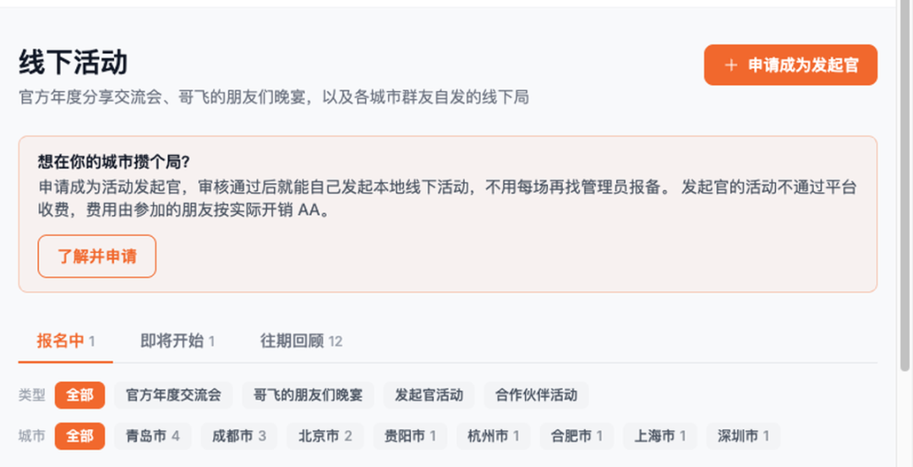
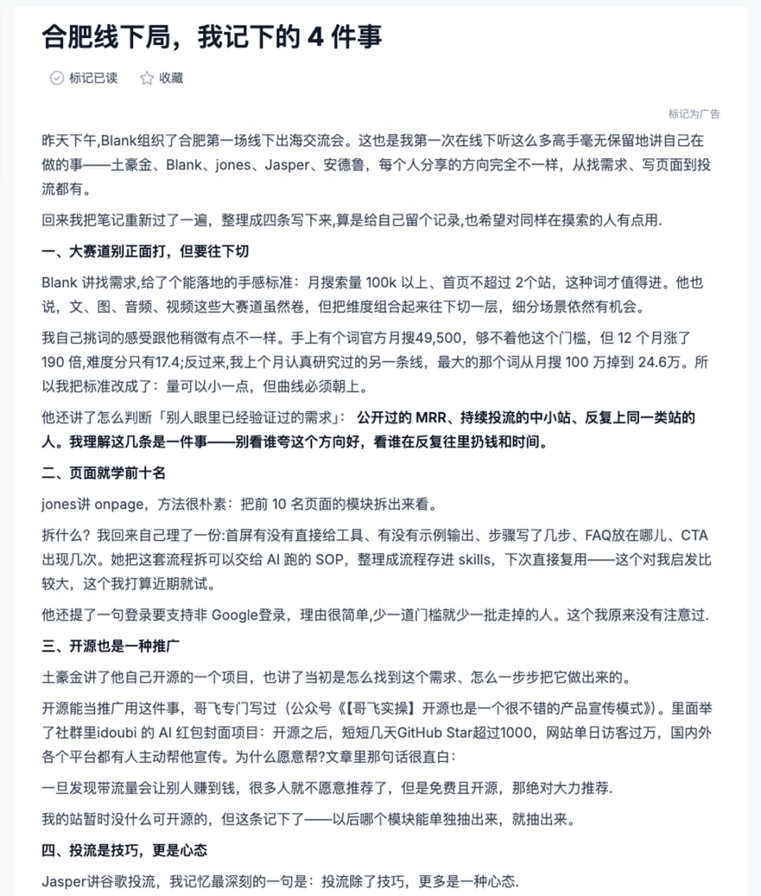
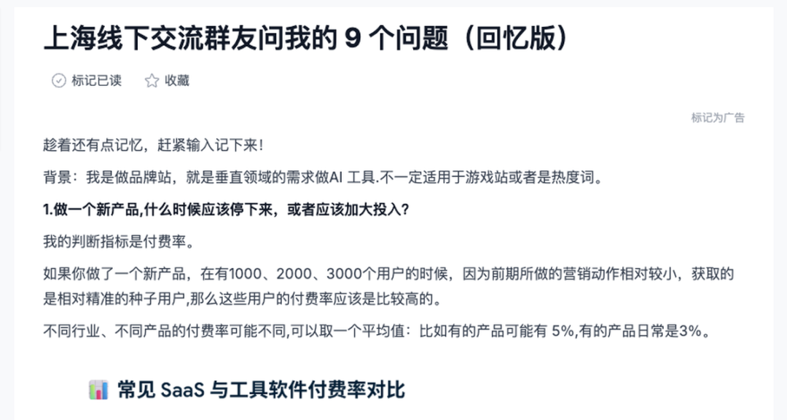
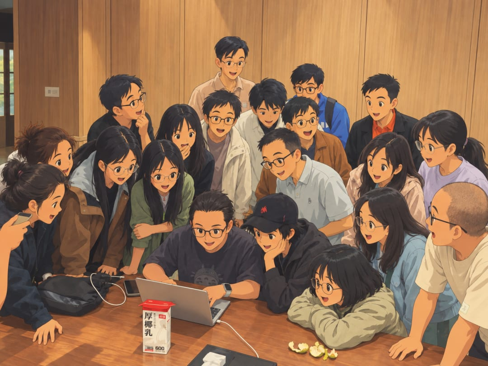
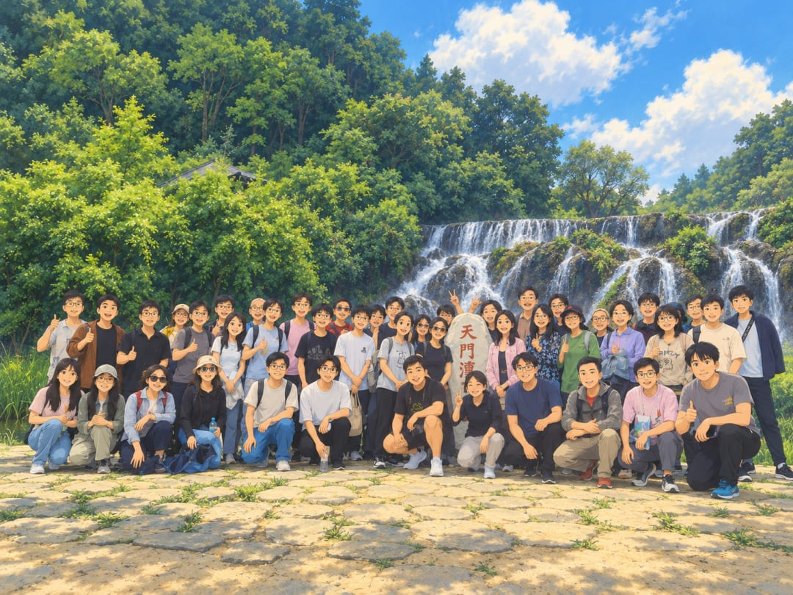

# 最近一两周，哥飞在贵阳、合肥、上海的朋友们都组起了线下局

贵阳出海游学群友合影大家好，我是哥飞。最近一两周，贵阳、合肥、上海的群友，都把线下局组起来了。我把大家发在 Web.Cafe 的复盘一篇篇看完。规模都不大，有的是十几个人围着四个主题聊一下午，有的是围着一个项目连续追问了九个问题，还有的从正式分享一路聊到饭桌、爬山和钓鱼。这些活动没有等我来安排，都是群友自己找人、找场地、定时间，然后把正在做的网站、产品、广告账户和卡点带到现场，一起看，一起讨论。这件事让我挺高兴。以前我们在深圳办过 650 人的分享交流会，一天可以听到很多不同方向的经验。我写过一篇完整侧记：650位朋友来到深圳，在哥飞的朋友们2026年中分享交流会里都学到了这些。大活动适合集中听分享、认识更多人。十几个人的小局，则可以围着一个具体项目反复追问，直到知道回去先改什么。群友已经开始自己组局了Web.Cafe 现在有单独的线下活动页面，入口在这里：Web.Cafe 线下活动页。页面会把报名中、即将开始和往期活动分开，也可以按城市筛选。想参加，就先看看附近有没有活动；想自己在城市里攒个局，可以申请成为发起官。审核通过之后，就能自己发起本地线下局，不用每一场都找管理员报备。平台不收活动费用，场地、吃饭等实际支出，由参加的朋友按实际情况 AA。Web.Cafe 线下活动页开放本地发起官申请这个入口解决了一个很实际的问题：如果什么事情都等我来组织，那一年也办不了多少场，我也不可能同时出现在几十个城市。群友能自己发起，活动就不用只集中在少数几个城市。很多城市都有正在做网站、做产品、投广告的朋友，身边几个人约个下午，把页面和数据打开，就可以开始聊。小局还有一个好处：参加的人大多正在做具体项目，不需要从基础概念重新讲起。一个人把页面打开，其他人可以顺着注册、付费、流量来源一路问下去，讨论很快就会落到实际动作。下面说说最近的合肥、上海和贵阳。合肥：十几个人，把四件事聊具体合肥第一场线下出海交流会由 Blank 组织。班纳参加后，把现场内容整理成《合肥线下局，我记下的 4 件事》。分享的人有土豪金、Blank、jones、Jasper、安德鲁，话题从找需求、写页面，一直聊到开源和广告验证。班纳在 Web.Cafe 复盘合肥线下局的四件事大家先聊找需求。Blank 给了一个很直接的判断：大赛道不要正面硬打，可以把文字、图片、音频、视频继续组合，往更具体的场景切。班纳也拿自己看过的词做对比。一个词月搜索量 49,500，没有到大家常说的“大词”门槛，但过去 12 个月增长了 190 倍，难度分只有 17.4。另一个词曾经有百万月搜索量，后来掉到 24.6 万。所以不能只看某个月的搜索量。量级要看，曲线也要看。别人有没有公开收入、有没有持续投广告、同一批人是不是反复做这类站，也都要看。班纳在复盘里写得很直白：别只听谁说这个方向好，要看谁在持续往里面放钱和时间。接着聊页面。jones 讲的方法很朴素：把搜索结果前十名的页面拆开看。班纳回去后又整理了一份检查表：首屏有没有直接给工具？有没有示例输出？步骤写了几步？FAQ 放在哪里？CTA 出现几次？登录是不是只支持 Google？这些细节直接影响用户进来以后会不会继续往下走，跟页面漂不漂亮关系不大。现场还提到，可以把这套动作整理成 AI 能反复执行的 SOP，存成 skill，下次遇到类似页面直接复用。再往后是开源。土豪金分享了自己的开源项目。开源之后，别人更愿意主动帮忙传播，GitHub、网站和各个平台之间会互相带流量。开源不是把代码扔出去就结束了。README 怎么写、演示效果怎么放、用户为什么愿意转发，仍然要认真做。对于适合开放的项目，开源本身就可以是一种产品宣传。最后聊广告。Jasper 现场把 Google Ads 的流程走了一遍。从账户、关键词、出价到后面的指标，现场没有把广告说成“花钱就有流量”，重点是用它更快验证需求。一个产品值不值得继续做，不一定非要等半年自然流量。先拿一小批高意图用户回来，看他们会不会注册、会不会走到付款前一步，答案会来得快很多。找词、做页面、开源、投广告，网上都有教程。线下好用的地方，是有人会马上追问：你看的哪个词？页面具体拆了什么？广告先用哪种匹配方式？数据不好时停在哪里？上海：九个问题，一路追到下一步动作上海这场没有按四个主题来讲，而是围着一个真实项目不断提问。分享者“我话事”做的是垂直领域品牌站，用 AI 工具解决具体需求。线下结束后，他趁记忆还在，把群友问的九个问题写成了《上海线下交流群友问我的 9 个问题（回忆版）》。上海线下交流围绕一个真实项目连续追问九个问题第一个问题就很实际：做一个新产品，什么时候该停，什么时候该加大投入？他的判断指标是前期用户的付费率。新产品刚拿到 1000、2000、3000 个用户时，营销动作还不多，来的往往是比较精准的种子用户。如果这批人的付费表现都明显低于同类产品，就要先停下来检查：是产品没有竞争力，还是来的用户不够准。接着大家问：第一批用户从哪里来？他把产品分成两类来看。用户已经知道解决方案的，比如 PDF 转 Word、AI 视频工具，大家会主动搜索。这类产品先把搜索排名做好，获客路径比较清楚。另一类是用户还不知道该搜什么的新产品。它没有成熟关键词，就要先去社交媒体做曝光，让人先知道原来还有这种解决办法。这两类产品的起点不一样，第一批用户的找法当然也不一样。不能看到别人靠 SEO 起量，就默认自己的产品也该照着做。群友继续往下问：去哪里发内容？写什么内容？什么时候投广告？没有投放经验，怎么提前验证？先批量看这个领域的搜索结果。假如查了 3000 个关键词，发现某些第三方网站、某类内容反复出现在前十名，就优先研究这些平台。先认真发 5 到 10 篇内容，看能不能获得排名、带来品牌搜索和访问。写内容时，他会分三种来做：一类承接品牌词，一类回答接近购买决策的问题，还有一类先帮用户解决上游问题，把更大一批人带进来。投广告时，不先上大而宽的词。先选离付款动作最近的高意图词，只用精确匹配来验证，避免一上来就把大量不相关访问混进数据。如果产品还没开发完，可以先做 Demo。每个功能先做 10 到 20 条内容，看用户有没有兴趣；也可以把用户引到一个最小流程，观察有多少人愿意继续点击购买。他在复盘里还写了一句：热度不等于赚钱。一条视频有很多分享，可能只是大家觉得新奇。评论区里很多人喊着要试用，也不等于他们愿意付费。最后仍然要回到用户从哪里来、为什么来、走到哪一步、有没有付款。九个问题一路问下来，最后都会落到同一件事：这个项目明天先做什么。贵阳：一次正式分享，连着好几天游学贵阳这场人数更多一些，由小龙和冉云组织。有人专程跨城飞到贵阳，如有从北京赶来的群友，写下自己的观察。活动结束后，Web.Cafe 上连续出现了多篇复盘。我把几篇对照着看，发现大家记住的东西很不一样。有人在复盘里记住的是“上线比天大”。新手最容易把时间花在本地打磨：域名再想一想，模板再改一版，文案再润色一次。站没有上线，就没有用户，也没有数据。阿飞哥把节奏讲得很直接：先上线，用五天形成一轮反馈，再根据真实结果改。有人记住的是流量来了以后怎么接。大林子讲的是，怎么从 GSC 里的查询、点击和排名，判断页面有没有接住流量；蓝星空则讲怎么用文章带来转化更好的访问。流量进来以后，首屏有没有明确功能，内容有没有对准搜索意图，用户下一步往哪里走，这些地方没做好，前面辛苦拿到的曝光就会白白流掉。还有人记住的是，不要把命全放在 Google 手里。赫兹拆了怎样通过 AI 工具目录获得 800 多个付费用户；冉云讲搜索广告从上线到放量；小龙把手动外链拆成资源、账号、素材、提交和筛选的流程。龙猫讲不同阶段的 SEO 获客系统，条形马则把问题继续往前推到更适合 AI Agent 使用的产品形态。参与者围在桌前看项目、追问具体做法这些主题，单独搜都能找到很多文章。现场不一样的地方，是有人直接把自己的站和广告账户打开，把做过的、没做成的都拿出来。一位参与者在游学复盘里写得很具体：一个问题在线下可以被连续追问。你说这个词能做，别人会问为什么；你说页面要改，别人会问改哪里；你说渠道有效，接下来会有人追问成本、转化、周期、风险和复盘方式。问题这样追下去，原来很空的一句建议，才会变成回去能做的动作。贵阳这趟游学也不只发生在会场里。有参与者在《贵阳游学后记》里写道，自己 9 月 2 日就提前到了。正式分享开始前，他已经跟着组织者一起吃饭、夜爬、钓鱼，也一起看网站和广告账户。等参加完后面的正式分享，才离开贵阳。饭桌、路上和水边的聊天不在议程里，但大家会自然聊到正在做什么、哪里卡住了、最近踩过什么坑。贵阳游学群友在户外合影平时在线上看到的是一个昵称。线下见到人以后，才知道对方正在做什么，为什么会形成现在的判断，哪些路是踩过坑才绕开的。尤其是长期在非一线城市做项目的人，很容易觉得身边没人聊。到了线下才发现，大家都遇到过增长停滞、广告亏损和方向摇摆。问题不会因为见一面就消失，但至少不用继续一个人在脑子里打转。正式议程之外，饭桌也是继续交流项目的地方线下局最有用的，是能一直追问合肥聊四个主题，上海追着一个项目问了九个问题，贵阳把一次正式分享连成了好几天游学。形式不一样，最后都落到同一个动作上：一句话说不清楚，就继续问。有人建议先做离付款更近的词，就继续问客单价多少，用户会搜什么，现有页面能不能接住。有人说可以投广告验证，就问预算多少，先投哪个国家，用什么匹配，看到什么数据继续，看到什么数据停。有人说要做外链，就继续问资源从哪里来，素材怎么准备，提交以后怎么筛效果。同一句建议，放到不同项目里，动作可能完全不一样。小局人少，反而有时间把这些问题问完。很多问题只用一句话提出来，很容易只得到一个标准答案。面对面时，别人能看到你的页面、数据和当前进度，同一句建议会被继续拆成几个具体问题。这也是为什么十几个人聊一个下午，往往更容易把事情说清楚。所以准备线下局，不用先想一套很大的议程。把正在做的页面带来，把最近的数据打开，再带一个卡了两周的问题，就已经够聊一个下午。别人给建议时，别急着点头。继续问到自己知道回去先改哪一处，也请对方把判断依据说清楚。发起人也不需要是现场最厉害的人。合肥是 Blank 把人约起来，参加者各讲一个自己最熟的部分；贵阳是小龙和冉云把场地、分享和几天的行程串起来；上海干脆从群友提问开始。组织者要做的，是把正在做事的人聚到一起，让讨论别停在自我介绍。报名时就可以让每个人交一个问题，现场先讲清产品、流量来源和当前卡点，再让大家往下问。活动结束后，再像班纳和“我话事”一样把讨论写出来。写复盘的时候，会自然分清哪些是别人说的，哪些是自己验证过的，下一步到底要做什么。先从一桌人开始我以前组织大型分享会，是希望把不同方向做出结果的人请来，让更多朋友一次见到、一次听够。现在看到群友自己在城市里组局，这比我自己多办一场大活动，更让我高兴。如果你所在的城市也有几位正在做出海项目的人，不用等一场几百人的大会，也不用等我来。先约一个下午。每个人带一个项目，带一个真实问题。少讲一点整理得很漂亮的结论，多打开页面，多看数据，多问几句为什么。一场有用的线下局，就可以从这一桌人开始。如果你是第一次看我的文章，也简单介绍一下我自己。我是哥飞，做网站和 SEO 很多年了，现在在运营“哥飞的朋友们”社群。平时我会和大家一起研究怎么挖掘需求、做网站、获取流量，再把流量变成收入。如果你想进一步了解我和这个社群，可以从下面几篇文章开始：想先了解我为什么做这个社群，以及它为什么能持续三年：在教人赚钱这件事情上，我干了三年了，居然口碑不错想看社群朋友如何把 SEO 和做网站变成真实结果：我的4000人出海创业社群里，靠SEO赚到钱的人都做对了什么？想看看社群里的分享和交流是什么样：650位朋友来到深圳，在哥飞的朋友们2026年中分享交流会里都学到了这些想看看大家如何在一天里把想法做成上线的网站：一个词根、一个白天、175支交卷的队伍——“哥飞的朋友们”上站Hackathon深圳站侧记如果看完之后觉得这个社群适合你，可以加哥飞微信咨询了解。微信搜索框，输入 361079，点击查找 QQ 号，就能加哥飞微信了。哥飞微信

大家好，我是哥飞。

最近一两周，贵阳、合肥、上海的群友，都把线下局组起来了。

我把大家发在 Web.Cafe 的复盘一篇篇看完。规模都不大，有的是十几个人围着四个主题聊一下午，有的是围着一个项目连续追问了九个问题，还有的从正式分享一路聊到饭桌、爬山和钓鱼。

这些活动没有等我来安排，都是群友自己找人、找场地、定时间，然后把正在做的网站、产品、广告账户和卡点带到现场，一起看，一起讨论。

这件事让我挺高兴。

以前我们在深圳办过 650 人的分享交流会，一天可以听到很多不同方向的经验。我写过一篇完整侧记：650位朋友来到深圳，在哥飞的朋友们2026年中分享交流会里都学到了这些。

大活动适合集中听分享、认识更多人。十几个人的小局，则可以围着一个具体项目反复追问，直到知道回去先改什么。

## 群友已经开始自己组局了

Web.Cafe 现在有单独的线下活动页面，入口在这里：Web.Cafe 线下活动页。

页面会把报名中、即将开始和往期活动分开，也可以按城市筛选。想参加，就先看看附近有没有活动；想自己在城市里攒个局，可以申请成为发起官。

审核通过之后，就能自己发起本地线下局，不用每一场都找管理员报备。平台不收活动费用，场地、吃饭等实际支出，由参加的朋友按实际情况 AA。

这个入口解决了一个很实际的问题：如果什么事情都等我来组织，那一年也办不了多少场，我也不可能同时出现在几十个城市。

群友能自己发起，活动就不用只集中在少数几个城市。很多城市都有正在做网站、做产品、投广告的朋友，身边几个人约个下午，把页面和数据打开，就可以开始聊。

小局还有一个好处：参加的人大多正在做具体项目，不需要从基础概念重新讲起。一个人把页面打开，其他人可以顺着注册、付费、流量来源一路问下去，讨论很快就会落到实际动作。

下面说说最近的合肥、上海和贵阳。

## 合肥：十几个人，把四件事聊具体

合肥第一场线下出海交流会由 Blank 组织。

班纳参加后，把现场内容整理成《合肥线下局，我记下的 4 件事》。分享的人有土豪金、Blank、jones、Jasper、安德鲁，话题从找需求、写页面，一直聊到开源和广告验证。

大家先聊找需求。

Blank 给了一个很直接的判断：大赛道不要正面硬打，可以把文字、图片、音频、视频继续组合，往更具体的场景切。

班纳也拿自己看过的词做对比。一个词月搜索量 49,500，没有到大家常说的“大词”门槛，但过去 12 个月增长了 190 倍，难度分只有 17.4。

另一个词曾经有百万月搜索量，后来掉到 24.6 万。

所以不能只看某个月的搜索量。量级要看，曲线也要看。别人有没有公开收入、有没有持续投广告、同一批人是不是反复做这类站，也都要看。

班纳在复盘里写得很直白：别只听谁说这个方向好，要看谁在持续往里面放钱和时间。

接着聊页面。

jones 讲的方法很朴素：把搜索结果前十名的页面拆开看。

班纳回去后又整理了一份检查表：首屏有没有直接给工具？有没有示例输出？步骤写了几步？FAQ 放在哪里？CTA 出现几次？登录是不是只支持 Google？这些细节直接影响用户进来以后会不会继续往下走，跟页面漂不漂亮关系不大。

现场还提到，可以把这套动作整理成 AI 能反复执行的 SOP，存成 skill，下次遇到类似页面直接复用。

再往后是开源。

土豪金分享了自己的开源项目。开源之后，别人更愿意主动帮忙传播，GitHub、网站和各个平台之间会互相带流量。

开源不是把代码扔出去就结束了。README 怎么写、演示效果怎么放、用户为什么愿意转发，仍然要认真做。对于适合开放的项目，开源本身就可以是一种产品宣传。

最后聊广告。

Jasper 现场把 Google Ads 的流程走了一遍。从账户、关键词、出价到后面的指标，现场没有把广告说成“花钱就有流量”，重点是用它更快验证需求。

一个产品值不值得继续做，不一定非要等半年自然流量。先拿一小批高意图用户回来，看他们会不会注册、会不会走到付款前一步，答案会来得快很多。

找词、做页面、开源、投广告，网上都有教程。线下好用的地方，是有人会马上追问：你看的哪个词？页面具体拆了什么？广告先用哪种匹配方式？数据不好时停在哪里？

## 上海：九个问题，一路追到下一步动作

上海这场没有按四个主题来讲，而是围着一个真实项目不断提问。

分享者“我话事”做的是垂直领域品牌站，用 AI 工具解决具体需求。线下结束后，他趁记忆还在，把群友问的九个问题写成了《上海线下交流群友问我的 9 个问题（回忆版）》。

第一个问题就很实际：做一个新产品，什么时候该停，什么时候该加大投入？

他的判断指标是前期用户的付费率。

新产品刚拿到 1000、2000、3000 个用户时，营销动作还不多，来的往往是比较精准的种子用户。如果这批人的付费表现都明显低于同类产品，就要先停下来检查：是产品没有竞争力，还是来的用户不够准。

接着大家问：第一批用户从哪里来？

他把产品分成两类来看。

用户已经知道解决方案的，比如 PDF 转 Word、AI 视频工具，大家会主动搜索。这类产品先把搜索排名做好，获客路径比较清楚。

另一类是用户还不知道该搜什么的新产品。它没有成熟关键词，就要先去社交媒体做曝光，让人先知道原来还有这种解决办法。

这两类产品的起点不一样，第一批用户的找法当然也不一样。不能看到别人靠 SEO 起量，就默认自己的产品也该照着做。

群友继续往下问：去哪里发内容？写什么内容？什么时候投广告？没有投放经验，怎么提前验证？

先批量看这个领域的搜索结果。假如查了 3000 个关键词，发现某些第三方网站、某类内容反复出现在前十名，就优先研究这些平台。先认真发 5 到 10 篇内容，看能不能获得排名、带来品牌搜索和访问。

写内容时，他会分三种来做：一类承接品牌词，一类回答接近购买决策的问题，还有一类先帮用户解决上游问题，把更大一批人带进来。

投广告时，不先上大而宽的词。先选离付款动作最近的高意图词，只用精确匹配来验证，避免一上来就把大量不相关访问混进数据。

如果产品还没开发完，可以先做 Demo。每个功能先做 10 到 20 条内容，看用户有没有兴趣；也可以把用户引到一个最小流程，观察有多少人愿意继续点击购买。

他在复盘里还写了一句：热度不等于赚钱。

一条视频有很多分享，可能只是大家觉得新奇。评论区里很多人喊着要试用，也不等于他们愿意付费。最后仍然要回到用户从哪里来、为什么来、走到哪一步、有没有付款。

九个问题一路问下来，最后都会落到同一件事：这个项目明天先做什么。

## 贵阳：一次正式分享，连着好几天游学

贵阳这场人数更多一些，由小龙和冉云组织。

有人专程跨城飞到贵阳，如有从北京赶来的群友，写下自己的观察。活动结束后，Web.Cafe 上连续出现了多篇复盘。我把几篇对照着看，发现大家记住的东西很不一样。

有人在复盘里记住的是“上线比天大”。

新手最容易把时间花在本地打磨：域名再想一想，模板再改一版，文案再润色一次。站没有上线，就没有用户，也没有数据。阿飞哥把节奏讲得很直接：先上线，用五天形成一轮反馈，再根据真实结果改。

有人记住的是流量来了以后怎么接。

大林子讲的是，怎么从 GSC 里的查询、点击和排名，判断页面有没有接住流量；蓝星空则讲怎么用文章带来转化更好的访问。

流量进来以后，首屏有没有明确功能，内容有没有对准搜索意图，用户下一步往哪里走，这些地方没做好，前面辛苦拿到的曝光就会白白流掉。

还有人记住的是，不要把命全放在 Google 手里。

赫兹拆了怎样通过 AI 工具目录获得 800 多个付费用户；冉云讲搜索广告从上线到放量；小龙把手动外链拆成资源、账号、素材、提交和筛选的流程。

龙猫讲不同阶段的 SEO 获客系统，条形马则把问题继续往前推到更适合 AI Agent 使用的产品形态。

这些主题，单独搜都能找到很多文章。现场不一样的地方，是有人直接把自己的站和广告账户打开，把做过的、没做成的都拿出来。

一位参与者在游学复盘里写得很具体：一个问题在线下可以被连续追问。你说这个词能做，别人会问为什么；你说页面要改，别人会问改哪里；你说渠道有效，接下来会有人追问成本、转化、周期、风险和复盘方式。

问题这样追下去，原来很空的一句建议，才会变成回去能做的动作。

贵阳这趟游学也不只发生在会场里。

有参与者在《贵阳游学后记》里写道，自己 9 月 2 日就提前到了。正式分享开始前，他已经跟着组织者一起吃饭、夜爬、钓鱼，也一起看网站和广告账户。等参加完后面的正式分享，才离开贵阳。

饭桌、路上和水边的聊天不在议程里，但大家会自然聊到正在做什么、哪里卡住了、最近踩过什么坑。

平时在线上看到的是一个昵称。线下见到人以后，才知道对方正在做什么，为什么会形成现在的判断，哪些路是踩过坑才绕开的。

尤其是长期在非一线城市做项目的人，很容易觉得身边没人聊。到了线下才发现，大家都遇到过增长停滞、广告亏损和方向摇摆。问题不会因为见一面就消失，但至少不用继续一个人在脑子里打转。

## 线下局最有用的，是能一直追问

合肥聊四个主题，上海追着一个项目问了九个问题，贵阳把一次正式分享连成了好几天游学。形式不一样，最后都落到同一个动作上：一句话说不清楚，就继续问。

有人建议先做离付款更近的词，就继续问客单价多少，用户会搜什么，现有页面能不能接住。

有人说可以投广告验证，就问预算多少，先投哪个国家，用什么匹配，看到什么数据继续，看到什么数据停。

有人说要做外链，就继续问资源从哪里来，素材怎么准备，提交以后怎么筛效果。

同一句建议，放到不同项目里，动作可能完全不一样。小局人少，反而有时间把这些问题问完。

很多问题只用一句话提出来，很容易只得到一个标准答案。面对面时，别人能看到你的页面、数据和当前进度，同一句建议会被继续拆成几个具体问题。这也是为什么十几个人聊一个下午，往往更容易把事情说清楚。

所以准备线下局，不用先想一套很大的议程。把正在做的页面带来，把最近的数据打开，再带一个卡了两周的问题，就已经够聊一个下午。

别人给建议时，别急着点头。继续问到自己知道回去先改哪一处，也请对方把判断依据说清楚。

发起人也不需要是现场最厉害的人。

合肥是 Blank 把人约起来，参加者各讲一个自己最熟的部分；贵阳是小龙和冉云把场地、分享和几天的行程串起来；上海干脆从群友提问开始。

组织者要做的，是把正在做事的人聚到一起，让讨论别停在自我介绍。报名时就可以让每个人交一个问题，现场先讲清产品、流量来源和当前卡点，再让大家往下问。

活动结束后，再像班纳和“我话事”一样把讨论写出来。写复盘的时候，会自然分清哪些是别人说的，哪些是自己验证过的，下一步到底要做什么。

## 先从一桌人开始

我以前组织大型分享会，是希望把不同方向做出结果的人请来，让更多朋友一次见到、一次听够。

现在看到群友自己在城市里组局，这比我自己多办一场大活动，更让我高兴。

如果你所在的城市也有几位正在做出海项目的人，不用等一场几百人的大会，也不用等我来。

先约一个下午。每个人带一个项目，带一个真实问题。少讲一点整理得很漂亮的结论，多打开页面，多看数据，多问几句为什么。

一场有用的线下局，就可以从这一桌人开始。

如果你是第一次看我的文章，也简单介绍一下我自己。

我是哥飞，做网站和 SEO 很多年了，现在在运营“哥飞的朋友们”社群。平时我会和大家一起研究怎么挖掘需求、做网站、获取流量，再把流量变成收入。

如果你想进一步了解我和这个社群，可以从下面几篇文章开始：

想先了解我为什么做这个社群，以及它为什么能持续三年：

在教人赚钱这件事情上，我干了三年了，居然口碑不错

想看社群朋友如何把 SEO 和做网站变成真实结果：

我的4000人出海创业社群里，靠SEO赚到钱的人都做对了什么？

想看看社群里的分享和交流是什么样：

650位朋友来到深圳，在哥飞的朋友们2026年中分享交流会里都学到了这些

想看看大家如何在一天里把想法做成上线的网站：

一个词根、一个白天、175支交卷的队伍——“哥飞的朋友们”上站Hackathon深圳站侧记

如果看完之后觉得这个社群适合你，可以加哥飞微信咨询了解。

微信搜索框，输入 361079，点击查找 QQ 号，就能加哥飞微信了。
