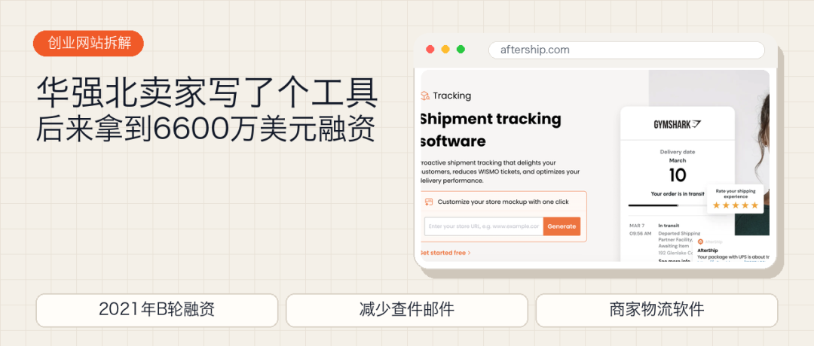
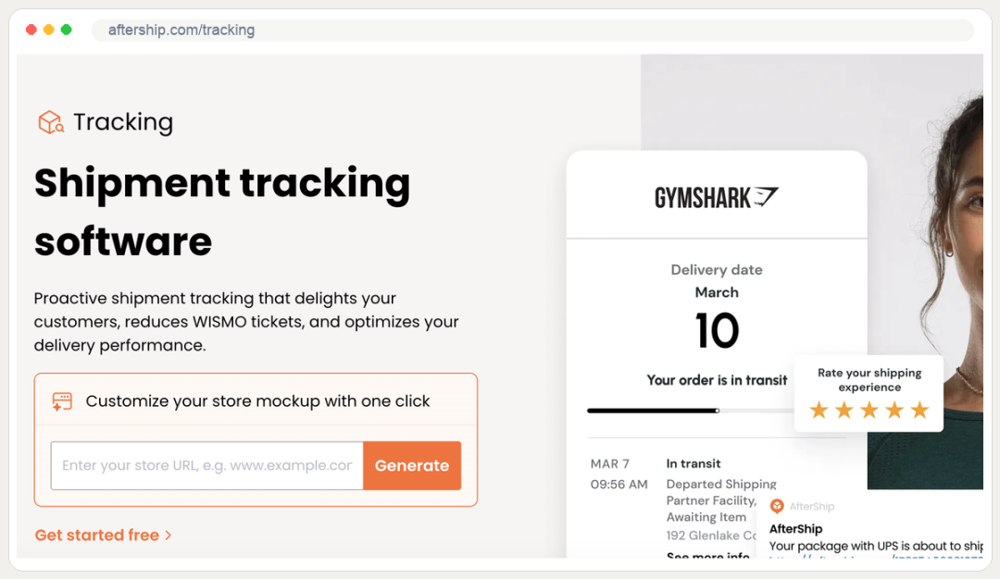
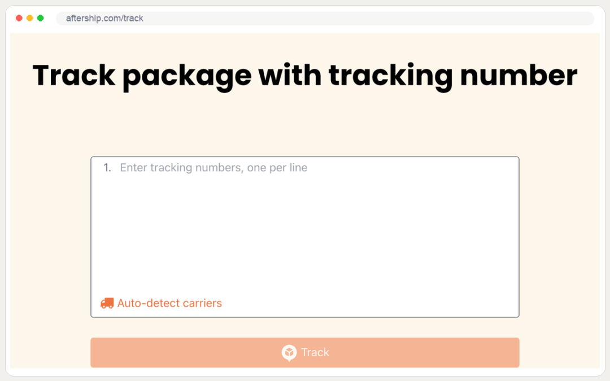
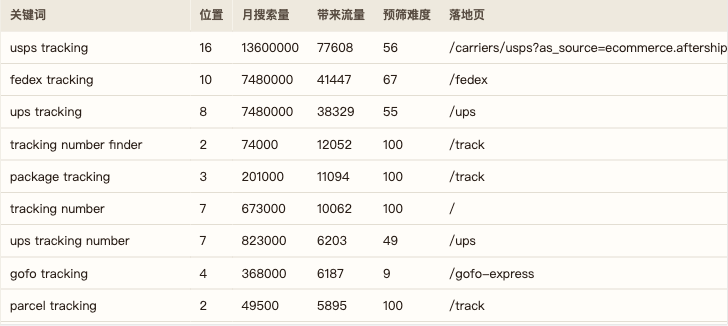
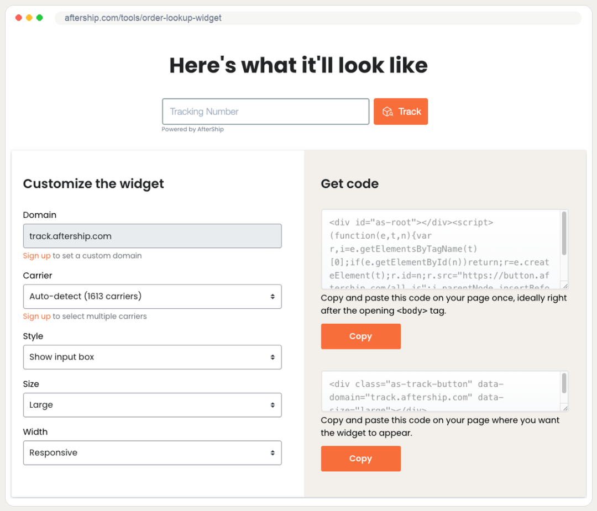
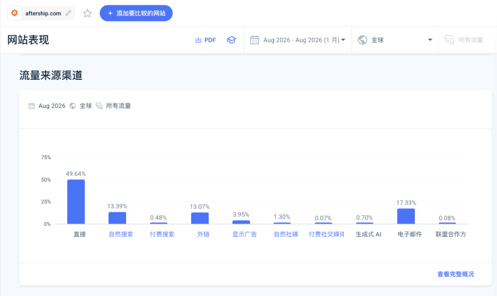
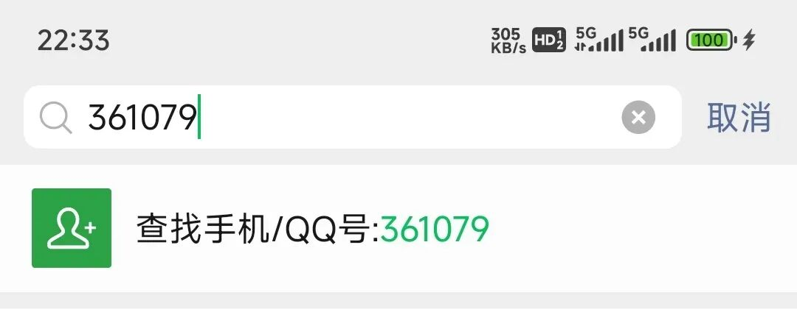

# 华强北卖家嫌客服邮件太多，写了个工具，后来拿到6600万美元融资

AfterShip从华强北卖电子产品，到给全球商家提供物流软件。大家好，我是哥飞。前几天评论区有位朋友说，怎么介绍的都是海外团队产品，难道就没有国人做得好的吗？其实有的，而且还不少。今天介绍的 AfterShip 就是中国创业者做起来的出海产品。创始人陈龙生，英文名 Teddy，最早在深圳华强北采购 MP3 等电子产品，卖给海外客户。后来，他把自己做电商时遇到的查件麻烦，做成了一家软件公司。2021 年，AfterShip 宣布获得 6600 万美元 B 轮融资，由 Tiger Global 领投。而最初，Teddy 写这个程序，只是因为买家总在问：包裹什么时候到？一天上千封邮件，实在回不过来2004 年大学毕业后，Teddy 开始做跨境电商。他在华强北租了一个小房间，既当仓库，也当办公室。订单多了，客服邮件也跟着多起来。按照他在十周年演讲里的回忆，每天会收到上千封邮件，很多都在问货发了没有、订单到哪里了。他请了几个人专门回复，但邮件增长得比回复还快。生意继续扩大，难道就一直加人回答同样的问题？Teddy 会写代码。他把邮件分类，发现大部分问题都与物流进度有关，就写了一个程序：自动追踪包裹，主动把进度通知买家。他回忆，这个程序让需要回复的客户邮件减少了 60%。以前每多卖一批货，就多出一批查件工作；现在程序能处理大部分重复通知，客服可以去处理真正需要人的问题。买家问的“在哪里”，他也理解错过从自己用的小程序，到一家公司，中间还有好几年的时间。2011 年，Teddy 参加香港的一场创业比赛，认识了后来的合伙人 Andrew Chan。他们的小团队做出了产品，赢下比赛，随后在 2012 年成立 AfterShip。但天天听客户说需求，也不代表每次都能理解对。最初，他们以为买家问包裹在哪里，就是想知道它的地理位置，于是做了地图功能，把包裹显示在地图上。做完后，仍然有人来问物流进度。Teddy 后来才意识到，买家真正关心的是什么时候能够收到。于是，他们去掉了地图，改为展示预计送达日期。地图能告诉买家包裹到了哪个城市，却未必能回答还要等几天。买家想安排收货时间，产品就得把这个答案给出来。客户反而催他们收费Teddy 在一次采访里讲过早期收费的经历。他们去美国参加创业大会，有人走过来问，你们是不是 AfterShip？产品当时还不成熟，他以为对方是来投诉的。结果，对方问能不能收费。免费使用不是更好吗？客户的顾虑是：你们没有大公司背景，也没拿融资，总要活下去。如果一直不收费，会不会靠卖数据赚钱？回去后，他们开始收费，同时明确不把客户数据卖给第三方。后来，一家大型平台也很认可产品，甚至已经谈到合作，却因为团队履历和资金背景不够强，担心公司倒闭，最终没有签约。所以，Teddy 寻找投资时，看重的不只是钱，还有能让客户放心的背书。2014 年，他们获得 IDG Capital 的 100 万美元 A 轮投资。到了 2021 年 B 轮融资时，Andrew 接受采访说，公司主要依靠口碑推荐，以及与电商建站平台 Shopify 集成这样的合作方式增长。卖家已经在 Shopify 上经营店铺，AfterShip 的集成就把物流服务接到了他们每天用的系统里。同样是查件，商家为什么付钱？于是我打开 AfterShip 首页，进入 Tracking 产品页看一下。它主打的仍然是主动追踪和通知，减少买家反复询问物流进度。AfterShip商家产品页商家买的是自动通知、交付管理和自己的品牌查件页面。个人偶尔查一个包裹，只需要输入单号。商家每天有几百、几千个包裹，要处理的事情就多了：哪些延误了，什么时候通知买家，怎样把信息同步回店铺，客服怎么统一查看。AfterShip 把这些事情做成持续收费的软件，还允许商家建立自己的品牌查件页面。当前 Tracking 定价页按包裹量和功能区分套餐。以每年 6000 个包裹为例，选择年付，Essentials 折合每月 29 美元起，Premium 每月 59 美元起，超出额度另外计费。更大规模的企业则询价。卖家订单越多，人工逐单处理越麻烦，自动化的价值也越明显。商家按包裹量选择套餐，订单多了，再升级。搜索包裹进度的人，会来到哪一页？付钱的是商家，但来网站的还有大量等包裹的买家。AfterShip 给他们提供了一个直接可用的查件页面。打开/track，最醒目的就是单号输入框，页面告诉用户可以自动识别承运商。用户不用先听一段公司介绍，就能开始查件。AfterShip查件页面先让用户输入单号，完成眼前的查件需求。我让哥飞 SEO Agent 查了美国市场的关键词。这次查到的结果中，package tracking，也就是包裹追踪，月搜索量为 20.1 万，AfterShip 排名第 3，落地页正是/track；parcel tracking排名第 2，也落到同一个页面。这两个词表达的是同一种需求，AfterShip 用同一个页面来承接：让用户拿着单号，查到包裹进度。哥飞 SEO Agent 原始关键词表看 package tracking 和 parcel tracking 两行，排名分别为第3、第2，落地页都是 /track。一个查件框，怎么放进商家自己的店铺？如果商家想把这个查件框放进自己的店铺呢？查件页往下有一个 order-lookup widget 链接，点进去，是一个可以配置的查件组件。页面先给出预览：一个单号输入框，一个 Track 按钮。下面左边调整设置，右边直接生成代码。AfterShip 查件组件配置页面左边选择承运商、样式和尺寸，右边复制代码；域名下方的 Sign up 则通向注册。默认域名是 track.aftership.com，承运商可以自动识别。商家还能选择显示输入框、预填单号等样式，调整按钮大小和宽度。右边给了两段代码：一段按说明放进网页，另一段放到希望出现查件框的位置。这样，商家不需要重新开发一个查询工具，就有了把查件入口放进店铺的办法。但如果想让顾客看到自己的域名呢？Domain 输入框下方就写着，注册后可以设置自定义域名。页面一开始也明确介绍：要为店铺创建完整的品牌查件页，可以注册 AfterShip。商家可以先配置组件、复制代码，想用自己的域名，再点击注册。前面定价页里的自动通知和品牌页面，则是商家接下来要比较的服务。免费组件也给 AfterShip 留了一个链接再看预览输入框下面，还有一行小字：Powered by AfterShip。点击这行字，就会进入 AfterShip 官网。组件帮商家给顾客提供查件入口，同时也展示了提供工具的公司。这个推广位置就在使用者刚刚用过的查件框下面。如果我们也提供可以嵌入别人网站的工具，除了考虑自己首页怎么获客，还可以检查组件本身：用户在哪里完成操作，在哪里能认识提供工具的人，感兴趣之后有没有可点的入口。查件也不总从搜索开始。买家收到物流通知，可以点链接查看；商家也可以把查件入口放在自己的店铺里。每发出一批货，就有一批人需要知道包裹的进度。Similarweb 的 2026 年 8 月数据显示，AfterShip 全球月访问约 1166 万。其中邮件占 17.33%，比自然搜索的 13.39% 还高，外链另占 13.07%。外链来源中有 Printify、Shopify 等网站。组件下方的链接只是其中一种推广位置，AfterShip 也从其他平台获得访问。AfterShip访问渠道邮件占17.33%，外链占13.07%；查件服务的访问入口不只有搜索。谁在用，谁会付钱？回到 Teddy 最早遇到的问题，买家想知道包裹什么时候到，商家想少回一些重复邮件。同一件事，两边需要的服务不一样。网站因此既提供可以直接使用的免费查件页，也给商家提供嵌入组件、品牌页面和自动通知。偶尔查询的人不必购买整套软件，长期管理订单的人则可以继续了解套餐。我之前写过订阅，真是一个好生意。AfterShip 的持续收费，也对应着商家每天都在发生的发货、通知和客服工作。我们在社群里拆网站时，也可以沿着这样的入口多点一步：谁在使用，下一步想做什么，页面有没有把他带到合适的服务上。如果你是第一次看我的文章，也简单介绍一下我自己。我是哥飞，做网站和 SEO 很多年了，现在在运营“哥飞的朋友们”社群。平时我会和大家一起研究怎么挖掘需求、做网站、获取流量，再把流量变成收入。如果你想进一步了解我和这个社群，可以从下面几篇文章开始：想先了解我为什么做这个社群，以及它为什么能持续三年：在教人赚钱这件事情上，我干了三年了，居然口碑不错想看社群朋友如何把 SEO 和做网站变成真实结果：我的4000人出海创业社群里，靠SEO赚到钱的人都做对了什么？想看看社群里的分享和交流是什么样：650位朋友来到深圳，在哥飞的朋友们2026年中分享交流会里都学到了这些想看看大家如何在一天里把想法做成上线的网站：一个词根、一个白天、175支交卷的队伍——“哥飞的朋友们”上站Hackathon深圳站侧记如果看完之后觉得这个社群适合你，可以加哥飞微信咨询了解。微信搜索框，输入 361079，点击查找 QQ 号，就能加哥飞微信了。哥飞微信

从华强北卖电子产品，到给全球商家提供物流软件。

大家好，我是哥飞。

前几天评论区有位朋友说，怎么介绍的都是海外团队产品，难道就没有国人做得好的吗？

其实有的，而且还不少。

今天介绍的 AfterShip 就是中国创业者做起来的出海产品。

创始人陈龙生，英文名 Teddy，最早在深圳华强北采购 MP3 等电子产品，卖给海外客户。后来，他把自己做电商时遇到的查件麻烦，做成了一家软件公司。

2021 年，AfterShip 宣布获得 6600 万美元 B 轮融资，由 Tiger Global 领投。而最初，Teddy 写这个程序，只是因为买家总在问：包裹什么时候到？

## 一天上千封邮件，实在回不过来

2004 年大学毕业后，Teddy 开始做跨境电商。他在华强北租了一个小房间，既当仓库，也当办公室。

订单多了，客服邮件也跟着多起来。按照他在十周年演讲里的回忆，每天会收到上千封邮件，很多都在问货发了没有、订单到哪里了。

他请了几个人专门回复，但邮件增长得比回复还快。生意继续扩大，难道就一直加人回答同样的问题？

Teddy 会写代码。他把邮件分类，发现大部分问题都与物流进度有关，就写了一个程序：自动追踪包裹，主动把进度通知买家。

他回忆，这个程序让需要回复的客户邮件减少了 60%。

以前每多卖一批货，就多出一批查件工作；现在程序能处理大部分重复通知，客服可以去处理真正需要人的问题。

## 买家问的“在哪里”，他也理解错过

从自己用的小程序，到一家公司，中间还有好几年的时间。

2011 年，Teddy 参加香港的一场创业比赛，认识了后来的合伙人 Andrew Chan。他们的小团队做出了产品，赢下比赛，随后在 2012 年成立 AfterShip。

但天天听客户说需求，也不代表每次都能理解对。

最初，他们以为买家问包裹在哪里，就是想知道它的地理位置，于是做了地图功能，把包裹显示在地图上。

做完后，仍然有人来问物流进度。Teddy 后来才意识到，买家真正关心的是什么时候能够收到。

于是，他们去掉了地图，改为展示预计送达日期。

地图能告诉买家包裹到了哪个城市，却未必能回答还要等几天。买家想安排收货时间，产品就得把这个答案给出来。

## 客户反而催他们收费

Teddy 在一次采访里讲过早期收费的经历。

他们去美国参加创业大会，有人走过来问，你们是不是 AfterShip？产品当时还不成熟，他以为对方是来投诉的。

结果，对方问能不能收费。

免费使用不是更好吗？客户的顾虑是：你们没有大公司背景，也没拿融资，总要活下去。如果一直不收费，会不会靠卖数据赚钱？

回去后，他们开始收费，同时明确不把客户数据卖给第三方。

后来，一家大型平台也很认可产品，甚至已经谈到合作，却因为团队履历和资金背景不够强，担心公司倒闭，最终没有签约。

所以，Teddy 寻找投资时，看重的不只是钱，还有能让客户放心的背书。2014 年，他们获得 IDG Capital 的 100 万美元 A 轮投资。

到了 2021 年 B 轮融资时，Andrew 接受采访说，公司主要依靠口碑推荐，以及与电商建站平台 Shopify 集成这样的合作方式增长。

卖家已经在 Shopify 上经营店铺，AfterShip 的集成就把物流服务接到了他们每天用的系统里。

## 同样是查件，商家为什么付钱？

于是我打开 AfterShip 首页，进入 Tracking 产品页看一下。它主打的仍然是主动追踪和通知，减少买家反复询问物流进度。

商家买的是自动通知、交付管理和自己的品牌查件页面。

个人偶尔查一个包裹，只需要输入单号。商家每天有几百、几千个包裹，要处理的事情就多了：哪些延误了，什么时候通知买家，怎样把信息同步回店铺，客服怎么统一查看。

AfterShip 把这些事情做成持续收费的软件，还允许商家建立自己的品牌查件页面。

当前 Tracking 定价页按包裹量和功能区分套餐。以每年 6000 个包裹为例，选择年付，Essentials 折合每月 29 美元起，Premium 每月 59 美元起，超出额度另外计费。更大规模的企业则询价。

卖家订单越多，人工逐单处理越麻烦，自动化的价值也越明显。商家按包裹量选择套餐，订单多了，再升级。

## 搜索包裹进度的人，会来到哪一页？

付钱的是商家，但来网站的还有大量等包裹的买家。AfterShip 给他们提供了一个直接可用的查件页面。

打开/track，最醒目的就是单号输入框，页面告诉用户可以自动识别承运商。用户不用先听一段公司介绍，就能开始查件。

先让用户输入单号，完成眼前的查件需求。

我让哥飞 SEO Agent 查了美国市场的关键词。这次查到的结果中，package tracking，也就是包裹追踪，月搜索量为 20.1 万，AfterShip 排名第 3，落地页正是/track；parcel tracking排名第 2，也落到同一个页面。

这两个词表达的是同一种需求，AfterShip 用同一个页面来承接：让用户拿着单号，查到包裹进度。

看 package tracking 和 parcel tracking 两行，排名分别为第3、第2，落地页都是 /track。

## 一个查件框，怎么放进商家自己的店铺？

如果商家想把这个查件框放进自己的店铺呢？查件页往下有一个 order-lookup widget 链接，点进去，是一个可以配置的查件组件。

页面先给出预览：一个单号输入框，一个 Track 按钮。下面左边调整设置，右边直接生成代码。

左边选择承运商、样式和尺寸，右边复制代码；域名下方的 Sign up 则通向注册。

默认域名是 track.aftership.com，承运商可以自动识别。商家还能选择显示输入框、预填单号等样式，调整按钮大小和宽度。

右边给了两段代码：一段按说明放进网页，另一段放到希望出现查件框的位置。这样，商家不需要重新开发一个查询工具，就有了把查件入口放进店铺的办法。

但如果想让顾客看到自己的域名呢？

Domain 输入框下方就写着，注册后可以设置自定义域名。页面一开始也明确介绍：要为店铺创建完整的品牌查件页，可以注册 AfterShip。

商家可以先配置组件、复制代码，想用自己的域名，再点击注册。前面定价页里的自动通知和品牌页面，则是商家接下来要比较的服务。

## 免费组件也给 AfterShip 留了一个链接

再看预览输入框下面，还有一行小字：Powered by AfterShip。

点击这行字，就会进入 AfterShip 官网。

组件帮商家给顾客提供查件入口，同时也展示了提供工具的公司。这个推广位置就在使用者刚刚用过的查件框下面。

如果我们也提供可以嵌入别人网站的工具，除了考虑自己首页怎么获客，还可以检查组件本身：用户在哪里完成操作，在哪里能认识提供工具的人，感兴趣之后有没有可点的入口。

查件也不总从搜索开始。买家收到物流通知，可以点链接查看；商家也可以把查件入口放在自己的店铺里。每发出一批货，就有一批人需要知道包裹的进度。

Similarweb 的 2026 年 8 月数据显示，AfterShip 全球月访问约 1166 万。其中邮件占 17.33%，比自然搜索的 13.39% 还高，外链另占 13.07%。外链来源中有 Printify、Shopify 等网站。组件下方的链接只是其中一种推广位置，AfterShip 也从其他平台获得访问。

邮件占17.33%，外链占13.07%；查件服务的访问入口不只有搜索。

## 谁在用，谁会付钱？

回到 Teddy 最早遇到的问题，买家想知道包裹什么时候到，商家想少回一些重复邮件。同一件事，两边需要的服务不一样。

网站因此既提供可以直接使用的免费查件页，也给商家提供嵌入组件、品牌页面和自动通知。偶尔查询的人不必购买整套软件，长期管理订单的人则可以继续了解套餐。

我之前写过订阅，真是一个好生意。AfterShip 的持续收费，也对应着商家每天都在发生的发货、通知和客服工作。

我们在社群里拆网站时，也可以沿着这样的入口多点一步：谁在使用，下一步想做什么，页面有没有把他带到合适的服务上。

如果你是第一次看我的文章，也简单介绍一下我自己。

我是哥飞，做网站和 SEO 很多年了，现在在运营“哥飞的朋友们”社群。平时我会和大家一起研究怎么挖掘需求、做网站、获取流量，再把流量变成收入。

如果你想进一步了解我和这个社群，可以从下面几篇文章开始：

想先了解我为什么做这个社群，以及它为什么能持续三年：

在教人赚钱这件事情上，我干了三年了，居然口碑不错

想看社群朋友如何把 SEO 和做网站变成真实结果：

我的4000人出海创业社群里，靠SEO赚到钱的人都做对了什么？

想看看社群里的分享和交流是什么样：

650位朋友来到深圳，在哥飞的朋友们2026年中分享交流会里都学到了这些

想看看大家如何在一天里把想法做成上线的网站：

一个词根、一个白天、175支交卷的队伍——“哥飞的朋友们”上站Hackathon深圳站侧记

如果看完之后觉得这个社群适合你，可以加哥飞微信咨询了解。

微信搜索框，输入 361079，点击查找 QQ 号，就能加哥飞微信了。
