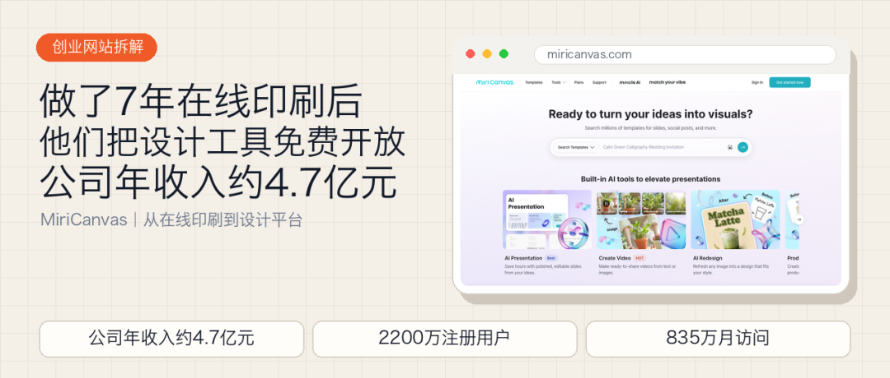
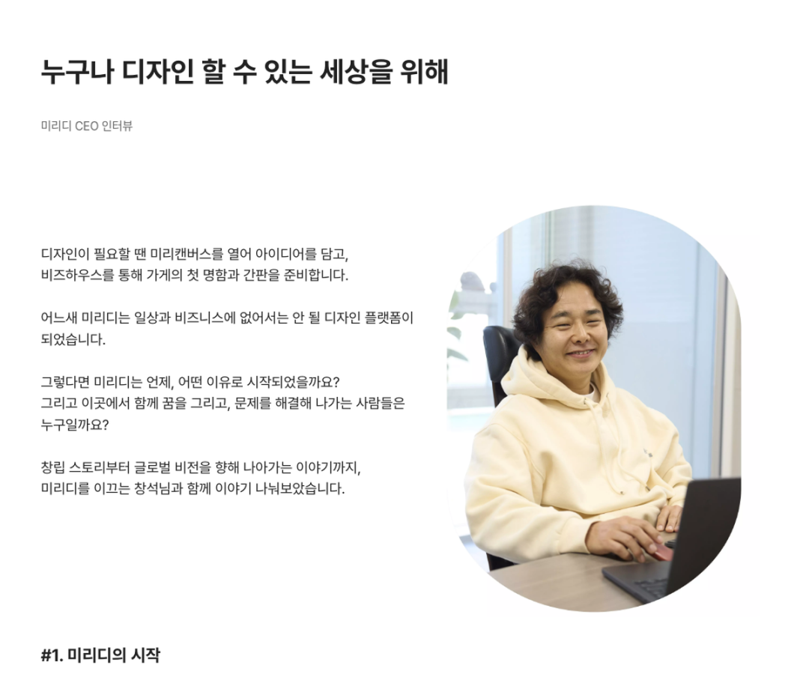
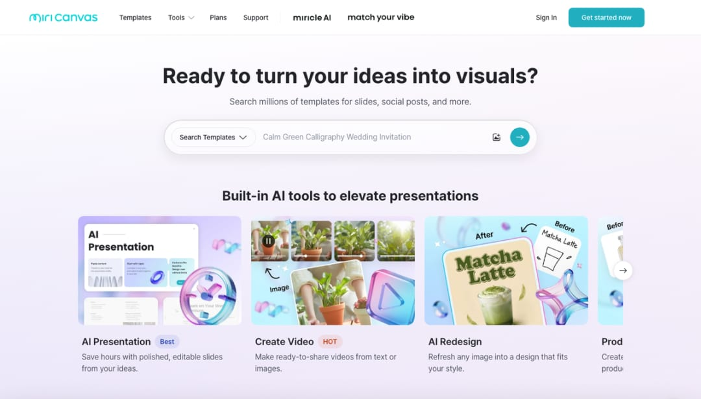
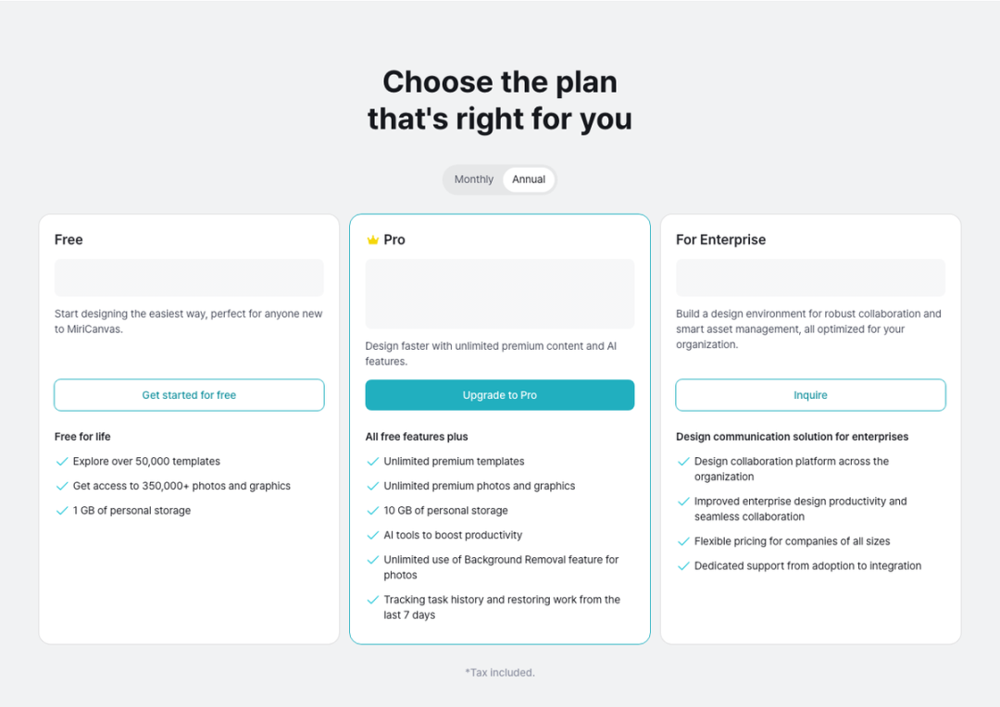
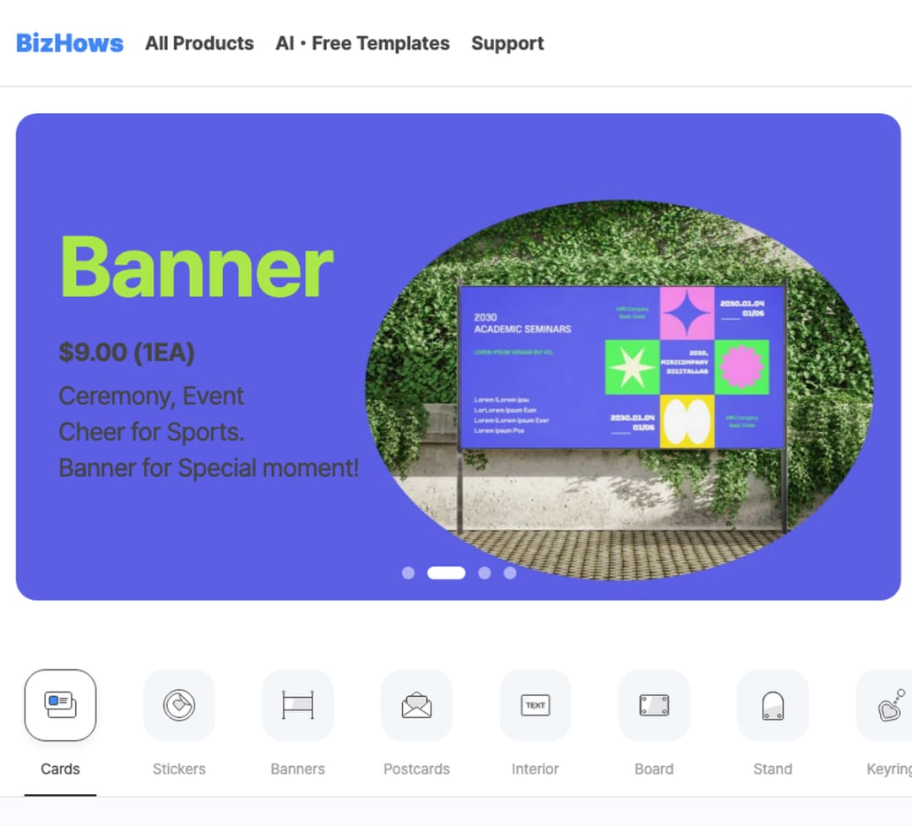
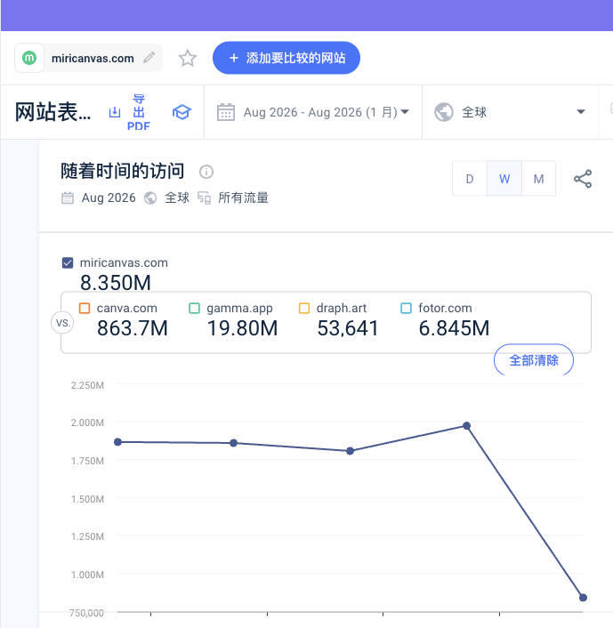
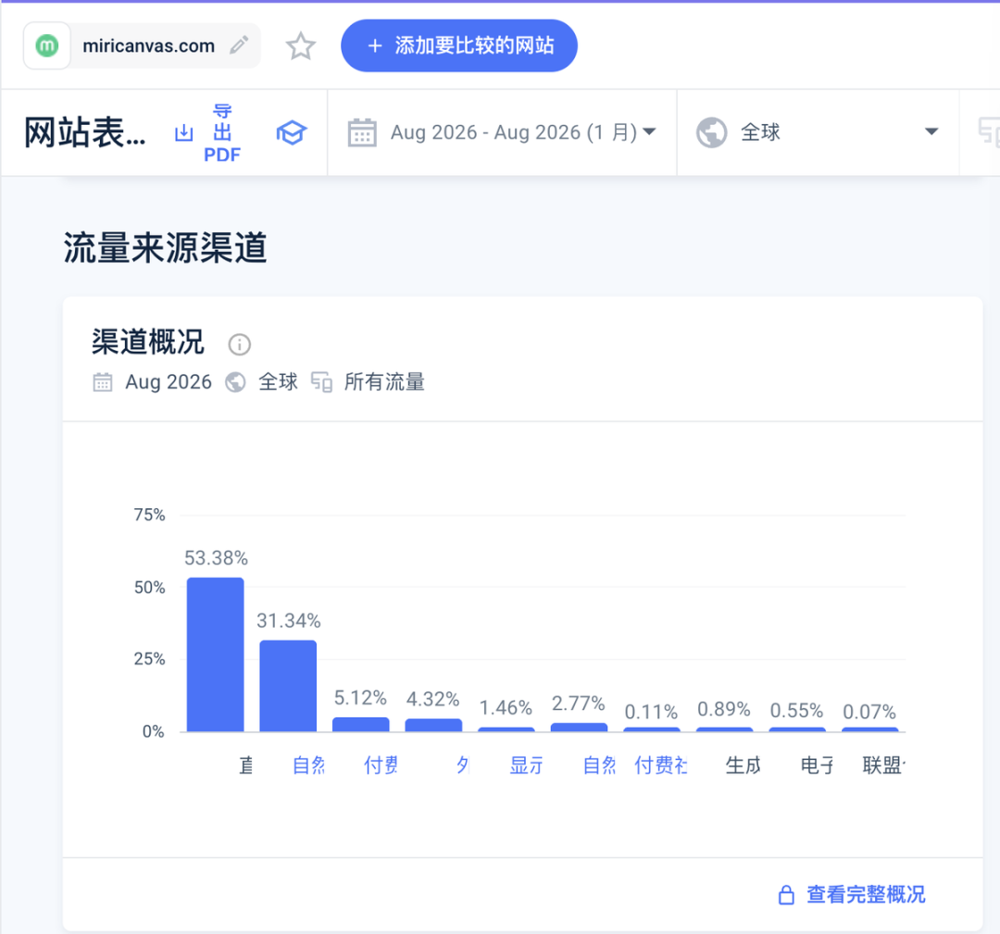
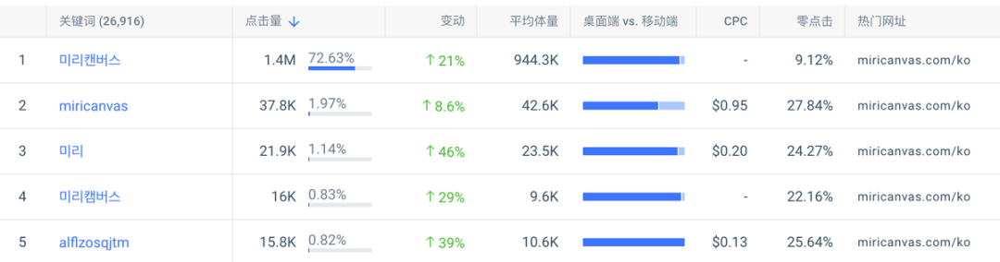
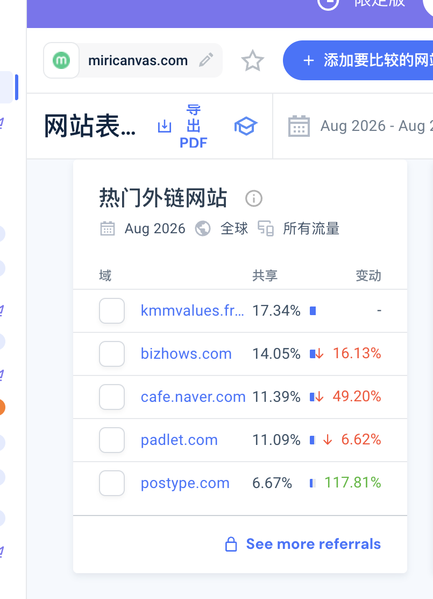

# 做了7年在线印刷后，他们把设计工具免费开放，公司年收入约4.7亿元

MiriCanvas 创业网站拆解大家好，我是哥飞。今天介绍一个韩国网站，MiriCanvas。它有点像韩国版 Canva：不会设计的人打开浏览器，选一个模板，换掉文字和图片，就能做海报、演示文稿、社交媒体图片和短视频。2026年5月，公司披露 MiriCanvas 注册用户已经超过2200万，平台上有50多万个模板，用户累计创建了1.9亿份设计。这门生意也已经跑出了结果。MiriCanvas 背后的公司 MiridiH 在2025年收入942亿韩元，按当时汇率折合人民币约4.7亿元，比2020年的147亿韩元增长了5倍多。MiriCanvas 之前，他们已经做了很多年在线印刷。印刷生意先做了7年创始人姜昌锡学的是计算机。2004年，他先做了一个叫 Smilecat 的照片和照片书服务，2008年成立公司，第二年上线了网页设计编辑器 SmileCanvas。在线印刷有一个很具体的麻烦。顾客想印名片、传单、菜单或海报，却经常拿不出可以直接印刷的设计文件。印刷公司要么让顾客找设计师，要么自己反复帮忙改尺寸、排版和图片。姜昌锡于是把设计工具放进网页里，让普通用户先完成设计，再直接下单印刷。2012年，公司又推出 BizHows，把模板、编辑和印刷进一步放在一起。MiridiH 创始人姜昌锡介绍 MiriCanvas 与 BizHowsMiridiH 创始人访谈页面。做到这里，他们已经积累了十多年网页编辑器、模板素材和印刷交付经验。问题也很明显：只有准备印东西的人，才会进入这套流程。大量只想做一张海报、一份课件或一张社交媒体图片的人，在设计完成后并不需要印刷。从2012年上线 BizHows，到2019年推出 MiriCanvas，他们做了7年在线印刷，才把其中的设计能力单独拿出来，做成免费的设计网站。免费之后，学生成了最大用户群MiriCanvas 先测试了大约一年，2019年7月正式上线。早期版本已经提供5万个模板和12万个设计元素，用户不需要安装软件，打开浏览器就能使用。从后来的用户构成看，使用 MiriCanvas 最多的并不是专业设计师。公司在2022年公布过一份覆盖27万用户的调查：学生占44.5%，普通个人用户占27.8%，教育从业者占9.2%，小商家和企业用户合计约14.7%。学生要做作业封面和课堂展示，老师要做课件，店主需要菜单、宣传单和社交媒体图片。这些人都有设计任务，却不值得为了偶尔用一次去学复杂软件。MiriCanvas 还接入了 Naver Whale、Naver Clova、NHN Edu、Classting 等韩国用户熟悉的平台。公司当时披露，每周最多能增加7万名新用户，获客成本约100韩元。用户数量很快开始上升：2020年12月突破100万，2021年3月达到200万，2022年1月达到500万。下载量比注册数更接近实际使用。2019年，用户从 MiriCanvas 下载了约110万份设计；2020年增加到1900万份，2021年达到8800万份，2022年2月累计下载量突破1亿。注册只能说明有人来过；下载至少说明用户完成了编辑并导出了结果。对需要反复做课件、海报和宣传图的人来说，能否顺利完成这一步，比注册数更能说明产品有没有真正被用起来。先把模板送给用户，再收三种钱现在打开 MiriCanvas 首页，首先看到的仍然是免费设计入口。用户可以直接搜索模板，也可以从演示文稿、海报、社交媒体图片、视频等用途开始。MiriCanvas 首页与在线设计入口MiriCanvas 英文首页。免费版提供5万多个模板、35万多张照片和图形，以及1GB存储空间。个人用户需要更多高级模板、品牌工具和存储空间时，可以升级 Pro。目前 Pro 按年付费是每位成员每年129.99美元，折合每月10.83美元；按月购买是11.99美元。再往上还有面向学校和公司的 Enterprise，提供团队协作、成员管理和集中控制，价格需要询价。MiriCanvas Free、Pro 与 Enterprise 方案MiriCanvas 当前方案与主要功能。第三种收入仍然来自老本行：印刷。用户在 MiriCanvas 里做好名片、传单或海报后，可以继续去 BizHows 下单，把数字文件变成实物。设计工具负责把人带进来，订阅和企业版承接更高频、协作更复杂的需求，印刷再承接设计完成后的下一步。BizHows 的设计与印刷服务页面BizHows 提供名片、宣传物料等设计与印刷服务。这里要把金额主体说清楚：2025年的942亿韩元，是 MiridiH 整家公司的收入，里面同时包括 MiriCanvas 和 BizHows，并不是 MiriCanvas 单个产品的收入。公司整体收入一直在增长：2023年收入607亿韩元，并首次实现年度盈利；2024年收入约780亿韩元；2025年增加到942亿韩元。截至2026年，MiriCanvas 已经服务超过2800家企业，并与韩国17个教育厅合作。一个从学生和个人用户开始的免费工具，后来也进入了学校和公司的采购范围。用户已经达到千万级。我想弄明白的是：这些人做完第一张图以后，会不会形成品牌回访；而海外的新用户，又是从什么入口第一次发现 MiriCanvas？于是我打开 MiriCanvas 的网站，看看它的流量来源。835万次访问里，品牌词比想象中重今年4月，我在群里拆 MiriCanvas 时，看到它的流量主要来自自然搜索和直接访问，韩国用户占绝大多数。当时有一个细节很醒目：仅品牌词，每个月就有上百万次搜索。Similarweb 估算，2026年8月，miricanvas.com 的全球访问量约835万。MiriCanvas 2026年8月访问量与互动数据MiriCanvas 2026年8月的访问量。同一个月，用户平均每次访问停留5分05秒，浏览7.12页，跳出率25.95%。其中89.35%的访问来自韩国。用户会在模板、素材和编辑页面之间连续操作。平均7.12页和5分钟停留时间，也说明这不只是一个介绍产品的官网，设计工作本身就在网页里完成。访问来源给出了答案：直接访问占53.38%，自然搜索占31.34%，付费搜索只有5.12%。MiriCanvas 2026年8月流量渠道直接访问和自然搜索是 MiriCanvas 的两个主要入口。自然搜索占比不低，但把自然搜索继续拆开，品牌词占78%，非品牌词只占22%。4月的 Semrush 数据显示，韩文品牌词“미리캔버스”的月搜索量约94.43万，估算点击约140万；排在后面的主要关键词，也大多是 MiriCanvas 的韩文或英文拼写。MiriCanvas 品牌关键词数据MiriCanvas 的头部搜索词主要是品牌词及其不同写法。所以，MiriCanvas 今天的大流量，并不是主要依靠大量通用关键词页面从搜索引擎带来陌生用户。它先用免费模板、学校场景和平台合作让用户记住产品。用户要做下一张图时，直接输入网址，或者在搜索框里输入品牌名回来。直接访问和品牌搜索看起来是两个渠道，背后其实都是同一件事：产品已经形成使用习惯。模板页是下一段增长的入口品牌词在韩国已经很强，MiriCanvas 接下来要解决的是海外用户为什么第一次发现它。它的英文模板页正在做这件事。页面没有只放一个编辑器入口，而是按用途和人群整理模板：演示文稿、海报、菜单、名片、课堂资料、社交媒体图片等。用户搜索一个具体任务时，可以先落到相应模板，再进入编辑器。这种页面值得做，但2026年8月的数据也说明海外获客还在早期。MiriCanvas 近九成流量仍来自韩国，非品牌自然搜索占比也不高。翻译韩文模板只是第一步，团队还得理解不同国家的学校、商家和创作者在做什么，再为这些任务准备当地用户愿意直接套用的模板。我之前写过一篇文章，专门用 Canva 的尺寸页说明这类内页怎样承接搜索需求：以 Canva.com/sizes/ 页面为例说明如何做内页拿流量MiriCanvas 已经有编辑器、素材库和大量模板。如果它能把更多非品牌需求做成清晰的模板页和工具页，海外增长才有机会从“认识品牌的人回来用”，变成“原本不认识它的人也能搜到”。做完图以后，用户还能往哪里走前面这些数据解释的是用户怎样找到 MiriCanvas、怎样回来继续做图。生意能不能接住这批用户，还要看设计完成以后，他们下一步去哪里。2026年8月，BizHows 在 MiriCanvas 的外链来源中排第二，占引荐访问的14.05%；在 MiriCanvas 的出站去向中，BizHows 占32.56%。这不等于已经产生印刷订单，但能确认两个网站之间一直有人来回访问。BizHows 在 MiriCanvas 外链来源中的占比2026年8月，BizHows 是 MiriCanvas 的第二大外链来源。把整个路径连起来就很清楚了：普通用户先免费做图；高频用户购买 Pro；学校和公司购买 Enterprise；需要实物的人继续下单印刷。MiridiH 把用户做完图之后的不同去向分别接住：更频繁使用的人订阅 Pro，学校和公司购买 Enterprise，需要实物的人去 BizHows 下单印刷。如果我们自己做工具站，也可以问同一个问题：用户完成核心任务以后，下一步会付钱买什么？有时答案是高级功能，有时是团队协作，也可能像 MiriCanvas 一样，是把数字结果变成一件真正拿到手里的商品。免费模式把原来服务印刷客户的设计能力，变成了一个拥有2200万注册用户的入口，同时保留了通往印刷下单的下一步。如果你是第一次看我的文章，也简单介绍一下我自己。我是哥飞，做网站和 SEO 很多年了，现在在运营“哥飞的朋友们”社群。平时我会和大家一起研究怎么挖掘需求、做网站、获取流量，再把流量变成收入。如果你想进一步了解我和这个社群，可以从下面几篇文章开始：想先了解我为什么做这个社群，以及它为什么能持续三年：在教人赚钱这件事情上，我干了三年了，居然口碑不错想看社群朋友如何把 SEO 和做网站变成真实结果：我的4000人出海创业社群里，靠SEO赚到钱的人都做对了什么？想看看社群里的分享和交流是什么样：650位朋友来到深圳，在哥飞的朋友们2026年中分享交流会里都学到了这些想看看大家如何在一天里把想法做成上线的网站：一个词根、一个白天、175支交卷的队伍——“哥飞的朋友们”上站Hackathon深圳站侧记如果看完之后觉得这个社群适合你，可以加哥飞微信咨询了解。微信搜索框，输入 361079，点击查找 QQ 号，就能加哥飞微信了。哥飞微信

大家好，我是哥飞。

今天介绍一个韩国网站，MiriCanvas。

它有点像韩国版 Canva：不会设计的人打开浏览器，选一个模板，换掉文字和图片，就能做海报、演示文稿、社交媒体图片和短视频。

2026年5月，公司披露 MiriCanvas 注册用户已经超过2200万，平台上有50多万个模板，用户累计创建了1.9亿份设计。

这门生意也已经跑出了结果。MiriCanvas 背后的公司 MiridiH 在2025年收入942亿韩元，按当时汇率折合人民币约4.7亿元，比2020年的147亿韩元增长了5倍多。

MiriCanvas 之前，他们已经做了很多年在线印刷。

## 印刷生意先做了7年

创始人姜昌锡学的是计算机。2004年，他先做了一个叫 Smilecat 的照片和照片书服务，2008年成立公司，第二年上线了网页设计编辑器 SmileCanvas。

在线印刷有一个很具体的麻烦。

顾客想印名片、传单、菜单或海报，却经常拿不出可以直接印刷的设计文件。印刷公司要么让顾客找设计师，要么自己反复帮忙改尺寸、排版和图片。

姜昌锡于是把设计工具放进网页里，让普通用户先完成设计，再直接下单印刷。2012年，公司又推出 BizHows，把模板、编辑和印刷进一步放在一起。

MiridiH 创始人访谈页面。

做到这里，他们已经积累了十多年网页编辑器、模板素材和印刷交付经验。

问题也很明显：只有准备印东西的人，才会进入这套流程。大量只想做一张海报、一份课件或一张社交媒体图片的人，在设计完成后并不需要印刷。

从2012年上线 BizHows，到2019年推出 MiriCanvas，他们做了7年在线印刷，才把其中的设计能力单独拿出来，做成免费的设计网站。

## 免费之后，学生成了最大用户群

MiriCanvas 先测试了大约一年，2019年7月正式上线。早期版本已经提供5万个模板和12万个设计元素，用户不需要安装软件，打开浏览器就能使用。

从后来的用户构成看，使用 MiriCanvas 最多的并不是专业设计师。

公司在2022年公布过一份覆盖27万用户的调查：学生占44.5%，普通个人用户占27.8%，教育从业者占9.2%，小商家和企业用户合计约14.7%。

学生要做作业封面和课堂展示，老师要做课件，店主需要菜单、宣传单和社交媒体图片。这些人都有设计任务，却不值得为了偶尔用一次去学复杂软件。

MiriCanvas 还接入了 Naver Whale、Naver Clova、NHN Edu、Classting 等韩国用户熟悉的平台。公司当时披露，每周最多能增加7万名新用户，获客成本约100韩元。

用户数量很快开始上升：2020年12月突破100万，2021年3月达到200万，2022年1月达到500万。

下载量比注册数更接近实际使用。

2019年，用户从 MiriCanvas 下载了约110万份设计；2020年增加到1900万份，2021年达到8800万份，2022年2月累计下载量突破1亿。

注册只能说明有人来过；下载至少说明用户完成了编辑并导出了结果。对需要反复做课件、海报和宣传图的人来说，能否顺利完成这一步，比注册数更能说明产品有没有真正被用起来。

## 先把模板送给用户，再收三种钱

现在打开 MiriCanvas 首页，首先看到的仍然是免费设计入口。用户可以直接搜索模板，也可以从演示文稿、海报、社交媒体图片、视频等用途开始。

MiriCanvas 英文首页。

免费版提供5万多个模板、35万多张照片和图形，以及1GB存储空间。个人用户需要更多高级模板、品牌工具和存储空间时，可以升级 Pro。

目前 Pro 按年付费是每位成员每年129.99美元，折合每月10.83美元；按月购买是11.99美元。再往上还有面向学校和公司的 Enterprise，提供团队协作、成员管理和集中控制，价格需要询价。

MiriCanvas 当前方案与主要功能。

第三种收入仍然来自老本行：印刷。

用户在 MiriCanvas 里做好名片、传单或海报后，可以继续去 BizHows 下单，把数字文件变成实物。设计工具负责把人带进来，订阅和企业版承接更高频、协作更复杂的需求，印刷再承接设计完成后的下一步。

BizHows 提供名片、宣传物料等设计与印刷服务。

这里要把金额主体说清楚：2025年的942亿韩元，是 MiridiH 整家公司的收入，里面同时包括 MiriCanvas 和 BizHows，并不是 MiriCanvas 单个产品的收入。

公司整体收入一直在增长：2023年收入607亿韩元，并首次实现年度盈利；2024年收入约780亿韩元；2025年增加到942亿韩元。

截至2026年，MiriCanvas 已经服务超过2800家企业，并与韩国17个教育厅合作。一个从学生和个人用户开始的免费工具，后来也进入了学校和公司的采购范围。

用户已经达到千万级。我想弄明白的是：这些人做完第一张图以后，会不会形成品牌回访；而海外的新用户，又是从什么入口第一次发现 MiriCanvas？于是我打开 MiriCanvas 的网站，看看它的流量来源。

## 835万次访问里，品牌词比想象中重

今年4月，我在群里拆 MiriCanvas 时，看到它的流量主要来自自然搜索和直接访问，韩国用户占绝大多数。当时有一个细节很醒目：仅品牌词，每个月就有上百万次搜索。

Similarweb 估算，2026年8月，miricanvas.com 的全球访问量约835万。

MiriCanvas 2026年8月的访问量。

同一个月，用户平均每次访问停留5分05秒，浏览7.12页，跳出率25.95%。其中89.35%的访问来自韩国。

用户会在模板、素材和编辑页面之间连续操作。平均7.12页和5分钟停留时间，也说明这不只是一个介绍产品的官网，设计工作本身就在网页里完成。

访问来源给出了答案：直接访问占53.38%，自然搜索占31.34%，付费搜索只有5.12%。

直接访问和自然搜索是 MiriCanvas 的两个主要入口。

自然搜索占比不低，但把自然搜索继续拆开，品牌词占78%，非品牌词只占22%。

4月的 Semrush 数据显示，韩文品牌词“미리캔버스”的月搜索量约94.43万，估算点击约140万；排在后面的主要关键词，也大多是 MiriCanvas 的韩文或英文拼写。

MiriCanvas 的头部搜索词主要是品牌词及其不同写法。

所以，MiriCanvas 今天的大流量，并不是主要依靠大量通用关键词页面从搜索引擎带来陌生用户。

它先用免费模板、学校场景和平台合作让用户记住产品。用户要做下一张图时，直接输入网址，或者在搜索框里输入品牌名回来。直接访问和品牌搜索看起来是两个渠道，背后其实都是同一件事：产品已经形成使用习惯。

## 模板页是下一段增长的入口

品牌词在韩国已经很强，MiriCanvas 接下来要解决的是海外用户为什么第一次发现它。

它的英文模板页正在做这件事。页面没有只放一个编辑器入口，而是按用途和人群整理模板：演示文稿、海报、菜单、名片、课堂资料、社交媒体图片等。用户搜索一个具体任务时，可以先落到相应模板，再进入编辑器。

这种页面值得做，但2026年8月的数据也说明海外获客还在早期。MiriCanvas 近九成流量仍来自韩国，非品牌自然搜索占比也不高。翻译韩文模板只是第一步，团队还得理解不同国家的学校、商家和创作者在做什么，再为这些任务准备当地用户愿意直接套用的模板。

我之前写过一篇文章，专门用 Canva 的尺寸页说明这类内页怎样承接搜索需求：

以 Canva.com/sizes/ 页面为例说明如何做内页拿流量

MiriCanvas 已经有编辑器、素材库和大量模板。如果它能把更多非品牌需求做成清晰的模板页和工具页，海外增长才有机会从“认识品牌的人回来用”，变成“原本不认识它的人也能搜到”。

## 做完图以后，用户还能往哪里走

前面这些数据解释的是用户怎样找到 MiriCanvas、怎样回来继续做图。生意能不能接住这批用户，还要看设计完成以后，他们下一步去哪里。

2026年8月，BizHows 在 MiriCanvas 的外链来源中排第二，占引荐访问的14.05%；在 MiriCanvas 的出站去向中，BizHows 占32.56%。这不等于已经产生印刷订单，但能确认两个网站之间一直有人来回访问。

2026年8月，BizHows 是 MiriCanvas 的第二大外链来源。

把整个路径连起来就很清楚了：

普通用户先免费做图；高频用户购买 Pro；学校和公司购买 Enterprise；需要实物的人继续下单印刷。

MiridiH 把用户做完图之后的不同去向分别接住：更频繁使用的人订阅 Pro，学校和公司购买 Enterprise，需要实物的人去 BizHows 下单印刷。

如果我们自己做工具站，也可以问同一个问题：用户完成核心任务以后，下一步会付钱买什么？有时答案是高级功能，有时是团队协作，也可能像 MiriCanvas 一样，是把数字结果变成一件真正拿到手里的商品。

免费模式把原来服务印刷客户的设计能力，变成了一个拥有2200万注册用户的入口，同时保留了通往印刷下单的下一步。

如果你是第一次看我的文章，也简单介绍一下我自己。

我是哥飞，做网站和 SEO 很多年了，现在在运营“哥飞的朋友们”社群。平时我会和大家一起研究怎么挖掘需求、做网站、获取流量，再把流量变成收入。

如果你想进一步了解我和这个社群，可以从下面几篇文章开始：

想先了解我为什么做这个社群，以及它为什么能持续三年：

在教人赚钱这件事情上，我干了三年了，居然口碑不错

想看社群朋友如何把 SEO 和做网站变成真实结果：

我的4000人出海创业社群里，靠SEO赚到钱的人都做对了什么？

想看看社群里的分享和交流是什么样：

650位朋友来到深圳，在哥飞的朋友们2026年中分享交流会里都学到了这些

想看看大家如何在一天里把想法做成上线的网站：

一个词根、一个白天、175支交卷的队伍——“哥飞的朋友们”上站Hackathon深圳站侧记

如果看完之后觉得这个社群适合你，可以加哥飞微信咨询了解。

微信搜索框，输入 361079，点击查找 QQ 号，就能加哥飞微信了。
