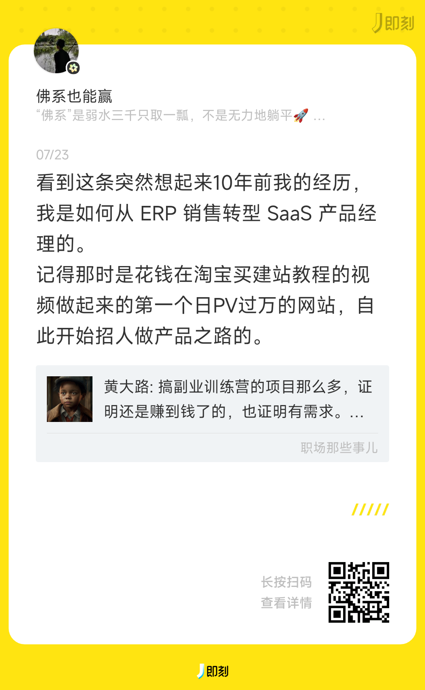
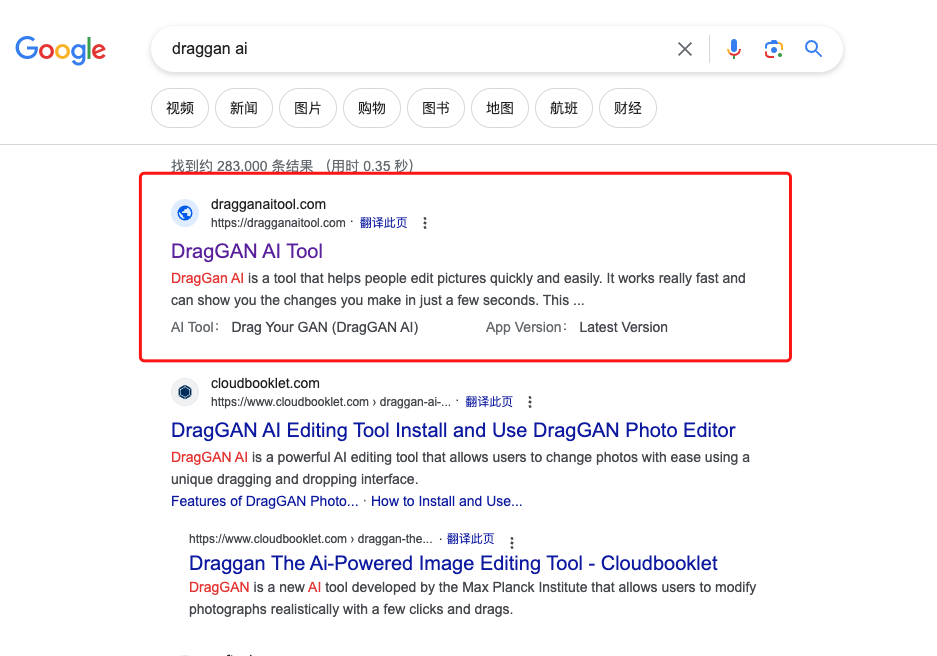
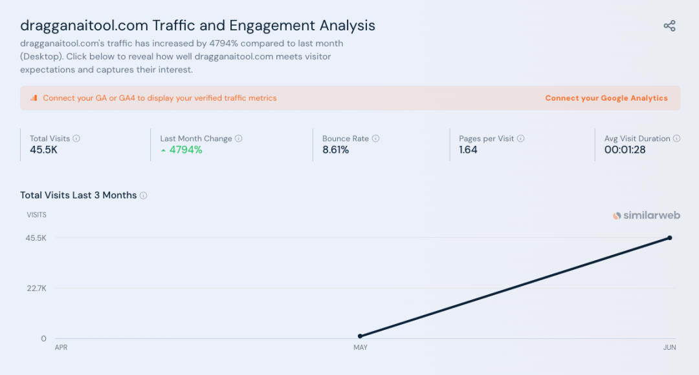
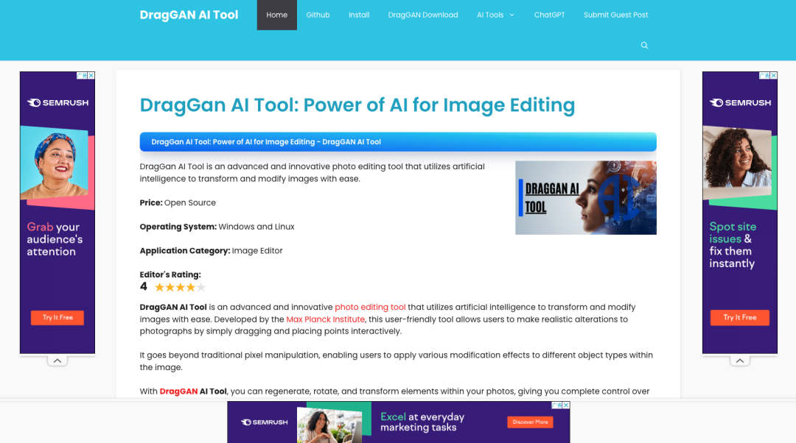
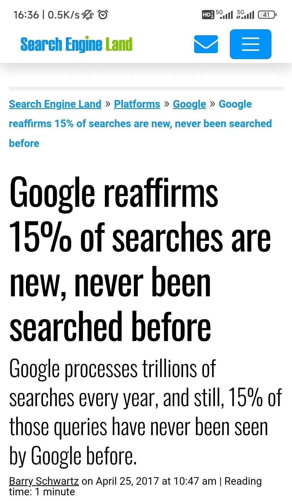
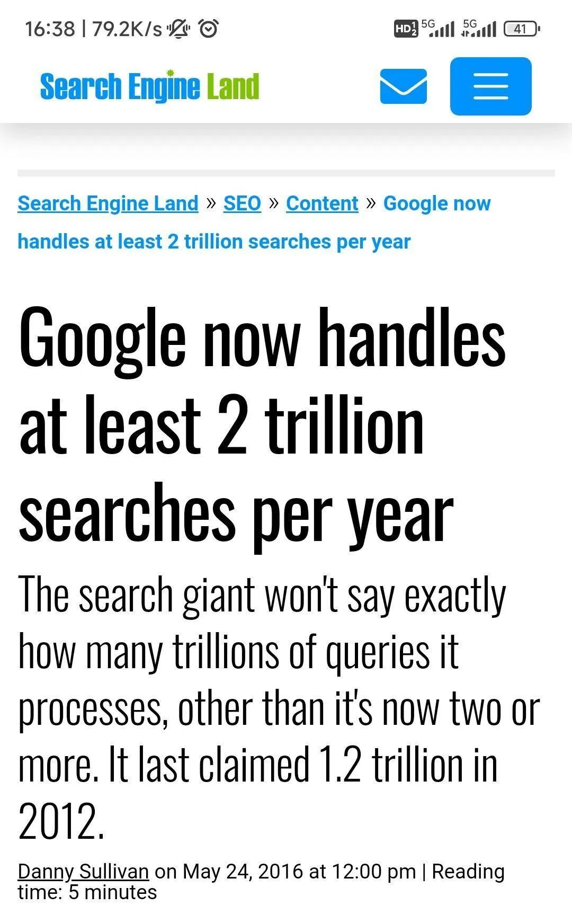
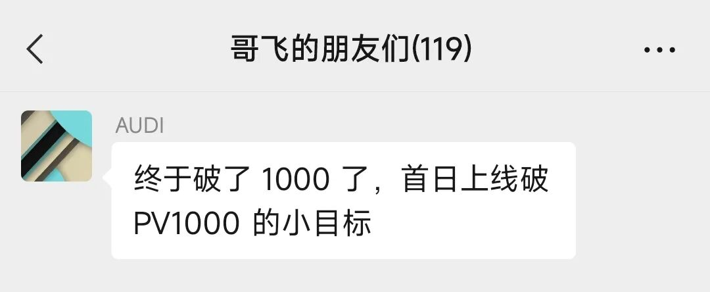

# 找新词：一个永远有效的建站策略，让你快速拿到搜索引擎流量

有个即友回忆10年前从ERP销售转型为SaaS产品经理之路，说当时花钱在淘宝买建站教程，跟着教程做起来的第一个网站，很快就日PV过万了。

回忆起成功的原因，即友说，是因为刚好抓住了一个新词，拿到了搜索引擎前二位置。

这个方法，10年前有效，今天依然有效，如群友@Gray做的网站，就是抓住了新词，群友新站上线9天拿到11030个独立访客，他是怎么做到的？

这样的例子还可以举出很多，如在谷歌搜索“draggan ai”，发现排名第一的网站，并不是官方网站。

dragganaitool.com 这个域名5月28日注册的，6月份就拿到了4.5万的月访问量。

凭什么一个新网站，能排到第一？

主要原因就是因为，这是一个新站，没多少人跟他竞争。

我们再来看一下，谷歌官方公布的一组统计数据。

谷歌每天处理的搜索中有15%是从来没有被搜索过的词。

2016年，谷歌说每年处理2万亿次搜索，到2023年，应该要有3万亿次以上了。

15%就是4500亿，再除以365得到每天是12亿次左右。

即使其中有大部分是旧关键字的变种，也还是有很多全新的搜索词。

这里具体多少比例不清楚，但即使打个1折，也有每天1.2亿次全新的搜索。

全新的搜索意味着什么？

意味着你只要做个网页上去，只要被收录了，你就能排名第一。

那么剩下的问题就是，如何找到每天出现的新词了。

其实哥飞在“哥飞的朋友们”这个付费社群里提到好几次了，有多种办法，具体见下面聊天记录。

哥飞这个付费群建立时间不长，到今天也才23天时间，群友们已经上线好几个网站，好几个浏览器插件了。

如，今天又有群友上线了新的工具站，上线当天就拿到了1000PV。

想要跟着一群这么努力的小伙伴们一起做出海产品吗？

我们不是闲聊，我们是真诚交流，互通有无，干货满满。

欢迎加哥飞微信 GeFeiSvip ，一起交流，一起鼓励，一起成长，一起赚钱。

