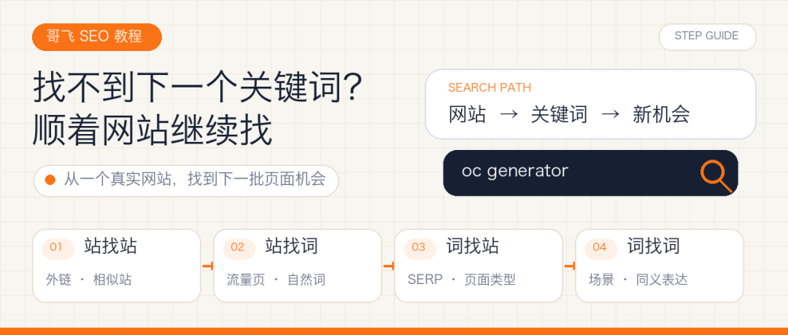
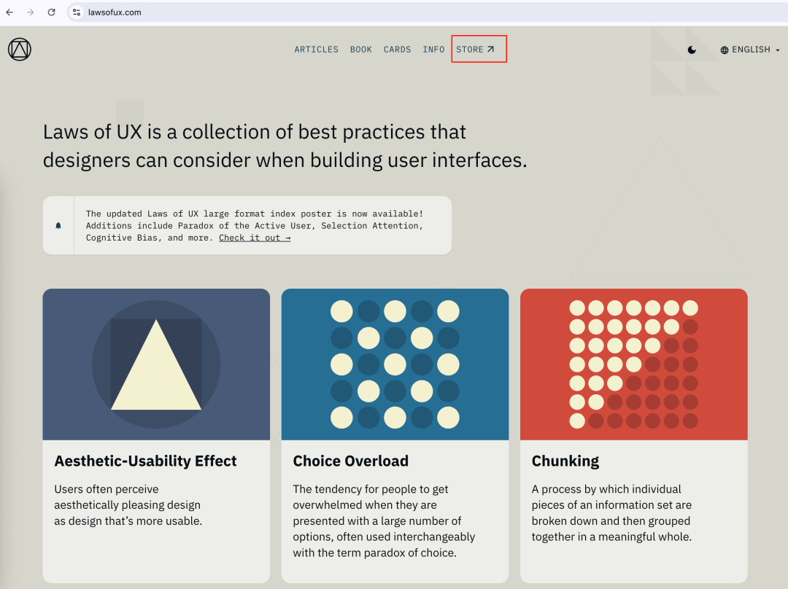
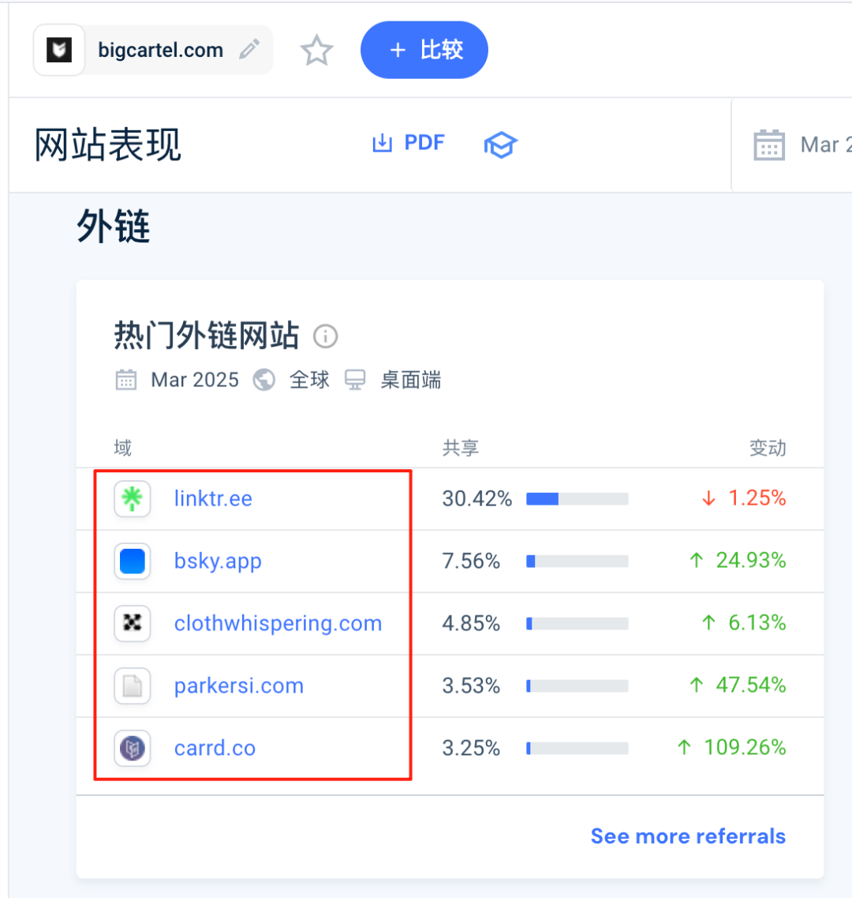
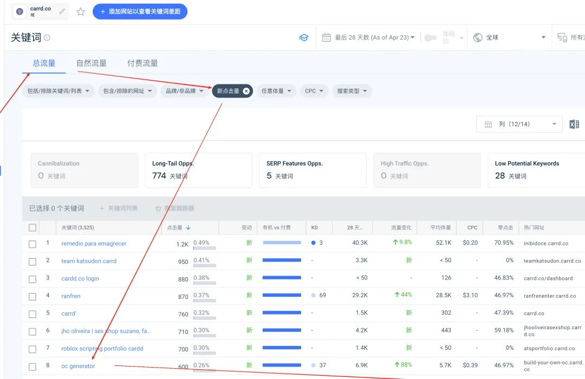
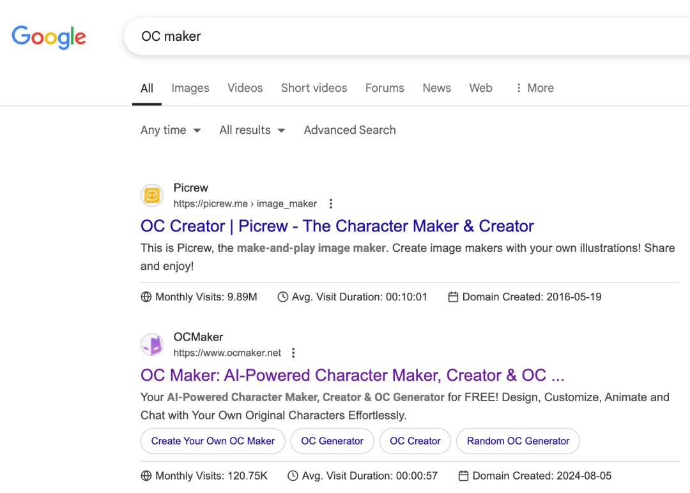
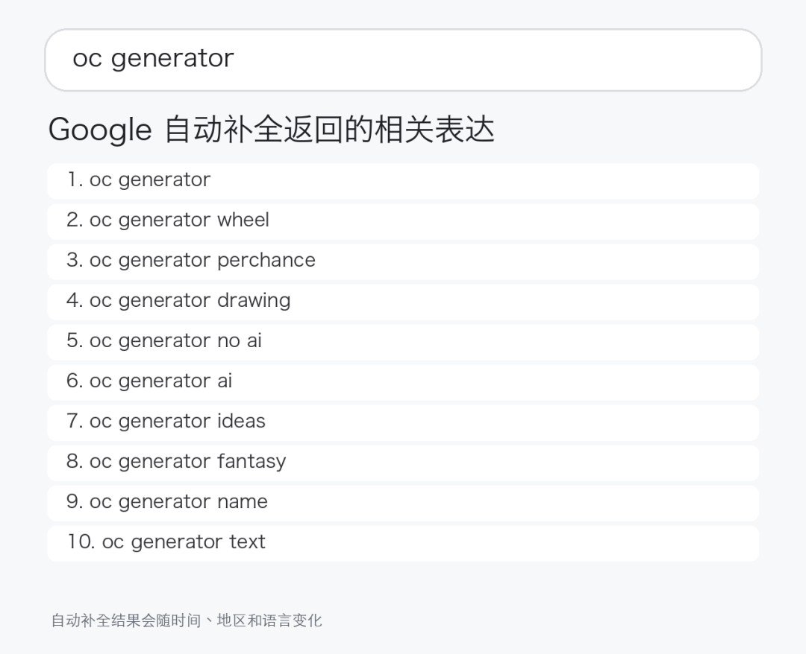

# 【哥飞SEO教程】找不到下一个关键词？用“站找站、站找词”顺藤摸瓜

大家好，我是哥飞。很多人做工具站，最容易卡在第二步。第一个页面已经上线了，第一个关键词也找到了，但接下来做什么？继续盯着关键词工具，出来的是一长串词；坐在电脑前凭空想，又总觉得能想到的都被别人做过了。今天我给大家一个建议，你先找到一个和目标用户有关的网站，顺着它往下追。一个网站会带出更多网站，一个网站会带出一批关键词，一个关键词又会带出新的搜索结果和新的需求。这样不断循环，机会会从真实页面和搜索结果里冒出来，不需要坐在表格前凭空想。拿到一批词之后，可以再做搜索意图分组和页面规划。这篇先解决前一步：第一批种子之外，怎么持续找到下一批词。先找一个真实网站，不要先打开空白表格起点不用很厉害，也不用和你准备做的产品完全一样。它只需要满足一个条件：用户和你想服务的人有交集。比如你想给设计师做工具，看到一个讲用户体验的网站，就可以从它开始。先把首页、导航、商店、资源页都点一遍，看它链接到了哪里，又用了哪些第三方服务。Laws of UX 官网这时先别急着评价网站做得好不好。你要找的是线索：它把用户带去哪里，用什么产品完成下一步，哪些页面值得用户继续点击。一个真实网站只是这张关系网的入口。第一步：站找站“站找站”，就是从一个网站找到更多相关网站。最直接的入口有四个：• 看它链接出去的网站；• 看哪些网站给它链接；• 看它使用的平台、模板、支付或建站服务；• 看相似站和竞争站。例如，从一个网站的商店链接里发现它使用 Big Cartel，就可以继续查看有哪些网站也在用这个平台，哪些网站正在给平台带来访问。Similarweb 外链来源这里不要只收藏域名。每发现一个站，至少记三件事：1. 它服务谁；2. 用户来这里完成什么；3. 哪个页面最像需求入口。如果只记网站名，收藏夹很快就会变成垃圾场。把“用户—需求—页面”一起记下来，后面才有可能转成自己的选题。第二步：站找词找到一个新网站后，下一步不是继续逛首页，而是看它靠哪些页面获得搜索流量。可以打开 Ahrefs、Semrush、Similarweb 或其他关键词工具，重点看两块：自然关键词和高流量页面。Similarweb 自然关键词列表这一步不要只按搜索量从大到小抄词。我会把关键词、对应页面和用户动作放在一起看。比如一个页面拿到了oc generator，用户要的不是阅读一篇介绍，而是立即创建一个原创角色。再打开页面，如果它功能并不复杂，却仍然有人使用，这个信号比单独看到一个搜索量数字更有意义。因为你已经同时看到了三件事：有人这样搜，有页面承接，而且需求可以被一个具体功能满足。第三步：词找站拿到oc generator后，可以再用相近表达OC maker复查一次结果类型，所以下面的截图搜索的是OC maker。这一步直接查看当前搜索结果页，工具给出的难度分数暂时放到一边。Google 搜索结果我通常会连续打开前两页里几种不同的结果：• 排名前面的独立站首页；• 大站里的具体内页；• 功能很简单却排得不错的页面；• 页面看起来没有充分满足需求的结果。你会看到谁在做这个需求、谷歌当前更愿意展示什么页面，以及结果里还有没有明显缺口。如果前面全是图片工具，你就不要只写一篇博客；如果前面都是教程，但用户实际需要完成一个动作，工具页可能有机会。这个判断可以接着看《【哥飞SEO教程】别再继续做博客页了，正确的做法是用户要什么你就做什么页面》。如果每个结果都很强，而你只能做出同样的东西，就先把这个词放下。“词找站”是为了尽快判断自己有没有必要继续投入。第四步：词找词一个词还可以继续带出更多词。最基础的是谷歌下拉、相关搜索和“其他人还在问”（People Also Ask）。也可以把词放进关键词工具，看同义表达、问题词、场景词和相邻需求。以oc generator为例，我实际查了一次谷歌自动补全，能看到oc generator wheel、oc generator drawing、oc generator no ai、oc generator ai、oc generator name等表达。Google 自动补全这些词不能直接一词一页。可以先按用户动作分组：•wheel更像随机生成方式；•drawing指向图像结果；•name指向角色命名；•ai和no ai反映用户对生成方式的不同要求。接着分别搜索这些词，看结果页提供的是完整角色生成器、单独名字生成器，还是一篇说明文章。只有输入、结果或使用场景明显不同，才考虑拆页；只是表达不同，就放在同一页覆盖。每找到一个候选，先问三个问题顺着网站和关键词一路追，很容易越看越兴奋。真正动手前，我会问三个问题。第一，需求是否清楚？能不能用一句话说清用户打开页面要完成什么。说不清，就继续研究，不急着上站。第二，当前搜索结果是否已经充分满足？不要只看大站多不多，要点进去操作。页面慢、步骤绕、结果差、移动端不好用、必须登录才能试，都可能是改进空间。第三，我能不能做出明显差异？差异可以是更快、更简单、针对更细场景，也可以是更好的结果、更方便的分享或更清楚的页面。只换颜色和文案，不算新机会。需求清楚、结果有缺口、能力能匹配，才进入候选清单。只满足其中一两个，就继续观察。什么时候应该停下来这套方法也有停止条件。出现下面几种情况，就应该停：• 只收藏链接，却说不清用户要什么；• 只看到流量数字，没有找到承接需求的具体页面；• 越追越远，已经偏离自己的技术、资源或目标用户；• 搜索结果已经很好，而自己做不出明显差异；• 候选太多，迟迟不选一个页面验证。找词最后要落到一个值得上线的页面，表格再大也没有用。最后，把四步变成固定动作以后看到一个陌生网站，可以按这个顺序走一遍：1. 站找站：看外链、出站链接、平台子域和相似站；2. 站找词：看自然关键词和高流量页面；3. 词找站：回到谷歌搜索结果，判断页面类型和竞争缺口；4. 词找词：扩同义表达、场景和用户动作；5. 用“需求是否清楚、结果是否充分、自己能否做出差异”筛选；6. 选一个页面上线，再用 GSC 看它是否出现预期查询。下次打开一个陌生网站，先看它连接了谁、靠什么词获得流量、用户进来完成什么，再从旁边挑出一个更小、更具体的切口。如果你是第一次看我的文章，也简单介绍一下我自己。我是哥飞，做网站和 SEO 很多年了，现在在运营“哥飞的朋友们”社群。平时我会和大家一起研究怎么挖掘需求、做网站、获取流量，再把流量变成收入。如果你想进一步了解我和这个社群，可以从下面几篇文章开始：想先了解我为什么做这个社群，以及它为什么能持续三年：在教人赚钱这件事情上，我干了三年了，居然口碑不错想看社群朋友如何把 SEO 和做网站变成真实结果：我的4000人出海创业社群里，靠SEO赚到钱的人都做对了什么？想看看社群里的分享和交流是什么样：650位朋友来到深圳，在哥飞的朋友们2026年中分享交流会里都学到了这些想看看大家如何在一天里把想法做成上线的网站：一个词根、一个白天、175支交卷的队伍——“哥飞的朋友们”上站Hackathon深圳站侧记如果看完之后觉得这个社群适合你，可以加哥飞微信咨询了解。微信搜索框，输入 361079，点击查找 QQ 号，就能加哥飞微信了。哥飞微信

大家好，我是哥飞。

很多人做工具站，最容易卡在第二步。

第一个页面已经上线了，第一个关键词也找到了，但接下来做什么？

继续盯着关键词工具，出来的是一长串词；坐在电脑前凭空想，又总觉得能想到的都被别人做过了。

今天我给大家一个建议，你先找到一个和目标用户有关的网站，顺着它往下追。

一个网站会带出更多网站，一个网站会带出一批关键词，一个关键词又会带出新的搜索结果和新的需求。这样不断循环，机会会从真实页面和搜索结果里冒出来，不需要坐在表格前凭空想。

拿到一批词之后，可以再做搜索意图分组和页面规划。这篇先解决前一步：第一批种子之外，怎么持续找到下一批词。

## 先找一个真实网站，不要先打开空白表格

起点不用很厉害，也不用和你准备做的产品完全一样。

它只需要满足一个条件：用户和你想服务的人有交集。

比如你想给设计师做工具，看到一个讲用户体验的网站，就可以从它开始。先把首页、导航、商店、资源页都点一遍，看它链接到了哪里，又用了哪些第三方服务。

这时先别急着评价网站做得好不好。

你要找的是线索：它把用户带去哪里，用什么产品完成下一步，哪些页面值得用户继续点击。

一个真实网站只是这张关系网的入口。

## 第一步：站找站

“站找站”，就是从一个网站找到更多相关网站。

最直接的入口有四个：

• 看它链接出去的网站；

• 看哪些网站给它链接；

• 看它使用的平台、模板、支付或建站服务；

• 看相似站和竞争站。

例如，从一个网站的商店链接里发现它使用 Big Cartel，就可以继续查看有哪些网站也在用这个平台，哪些网站正在给平台带来访问。

这里不要只收藏域名。每发现一个站，至少记三件事：

1. 它服务谁；

2. 用户来这里完成什么；

3. 哪个页面最像需求入口。

如果只记网站名，收藏夹很快就会变成垃圾场。把“用户—需求—页面”一起记下来，后面才有可能转成自己的选题。

## 第二步：站找词

找到一个新网站后，下一步不是继续逛首页，而是看它靠哪些页面获得搜索流量。

可以打开 Ahrefs、Semrush、Similarweb 或其他关键词工具，重点看两块：自然关键词和高流量页面。

这一步不要只按搜索量从大到小抄词。

我会把关键词、对应页面和用户动作放在一起看。

比如一个页面拿到了oc generator，用户要的不是阅读一篇介绍，而是立即创建一个原创角色。再打开页面，如果它功能并不复杂，却仍然有人使用，这个信号比单独看到一个搜索量数字更有意义。

因为你已经同时看到了三件事：有人这样搜，有页面承接，而且需求可以被一个具体功能满足。

## 第三步：词找站

拿到oc generator后，可以再用相近表达OC maker复查一次结果类型，所以下面的截图搜索的是OC maker。

这一步直接查看当前搜索结果页，工具给出的难度分数暂时放到一边。

我通常会连续打开前两页里几种不同的结果：

• 排名前面的独立站首页；

• 大站里的具体内页；

• 功能很简单却排得不错的页面；

• 页面看起来没有充分满足需求的结果。

你会看到谁在做这个需求、谷歌当前更愿意展示什么页面，以及结果里还有没有明显缺口。

如果前面全是图片工具，你就不要只写一篇博客；如果前面都是教程，但用户实际需要完成一个动作，工具页可能有机会。这个判断可以接着看《【哥飞SEO教程】别再继续做博客页了，正确的做法是用户要什么你就做什么页面》。如果每个结果都很强，而你只能做出同样的东西，就先把这个词放下。

“词找站”是为了尽快判断自己有没有必要继续投入。

## 第四步：词找词

一个词还可以继续带出更多词。

最基础的是谷歌下拉、相关搜索和“其他人还在问”（People Also Ask）。也可以把词放进关键词工具，看同义表达、问题词、场景词和相邻需求。

以oc generator为例，我实际查了一次谷歌自动补全，能看到oc generator wheel、oc generator drawing、oc generator no ai、oc generator ai、oc generator name等表达。

这些词不能直接一词一页。可以先按用户动作分组：

•wheel更像随机生成方式；

•drawing指向图像结果；

•name指向角色命名；

•ai和no ai反映用户对生成方式的不同要求。

接着分别搜索这些词，看结果页提供的是完整角色生成器、单独名字生成器，还是一篇说明文章。只有输入、结果或使用场景明显不同，才考虑拆页；只是表达不同，就放在同一页覆盖。

## 每找到一个候选，先问三个问题

顺着网站和关键词一路追，很容易越看越兴奋。真正动手前，我会问三个问题。

第一，需求是否清楚？

能不能用一句话说清用户打开页面要完成什么。说不清，就继续研究，不急着上站。

第二，当前搜索结果是否已经充分满足？

不要只看大站多不多，要点进去操作。页面慢、步骤绕、结果差、移动端不好用、必须登录才能试，都可能是改进空间。

第三，我能不能做出明显差异？

差异可以是更快、更简单、针对更细场景，也可以是更好的结果、更方便的分享或更清楚的页面。只换颜色和文案，不算新机会。

需求清楚、结果有缺口、能力能匹配，才进入候选清单。只满足其中一两个，就继续观察。

## 什么时候应该停下来

这套方法也有停止条件。

出现下面几种情况，就应该停：

• 只收藏链接，却说不清用户要什么；

• 只看到流量数字，没有找到承接需求的具体页面；

• 越追越远，已经偏离自己的技术、资源或目标用户；

• 搜索结果已经很好，而自己做不出明显差异；

• 候选太多，迟迟不选一个页面验证。

找词最后要落到一个值得上线的页面，表格再大也没有用。

## 最后，把四步变成固定动作

以后看到一个陌生网站，可以按这个顺序走一遍：

1. 站找站：看外链、出站链接、平台子域和相似站；

2. 站找词：看自然关键词和高流量页面；

3. 词找站：回到谷歌搜索结果，判断页面类型和竞争缺口；

4. 词找词：扩同义表达、场景和用户动作；

5. 用“需求是否清楚、结果是否充分、自己能否做出差异”筛选；

6. 选一个页面上线，再用 GSC 看它是否出现预期查询。

下次打开一个陌生网站，先看它连接了谁、靠什么词获得流量、用户进来完成什么，再从旁边挑出一个更小、更具体的切口。

如果你是第一次看我的文章，也简单介绍一下我自己。

我是哥飞，做网站和 SEO 很多年了，现在在运营“哥飞的朋友们”社群。平时我会和大家一起研究怎么挖掘需求、做网站、获取流量，再把流量变成收入。

如果你想进一步了解我和这个社群，可以从下面几篇文章开始：

想先了解我为什么做这个社群，以及它为什么能持续三年：

在教人赚钱这件事情上，我干了三年了，居然口碑不错

想看社群朋友如何把 SEO 和做网站变成真实结果：

我的4000人出海创业社群里，靠SEO赚到钱的人都做对了什么？

想看看社群里的分享和交流是什么样：

650位朋友来到深圳，在哥飞的朋友们2026年中分享交流会里都学到了这些

想看看大家如何在一天里把想法做成上线的网站：

一个词根、一个白天、175支交卷的队伍——“哥飞的朋友们”上站Hackathon深圳站侧记

如果看完之后觉得这个社群适合你，可以加哥飞微信咨询了解。

微信搜索框，输入 361079，点击查找 QQ 号，就能加哥飞微信了。
