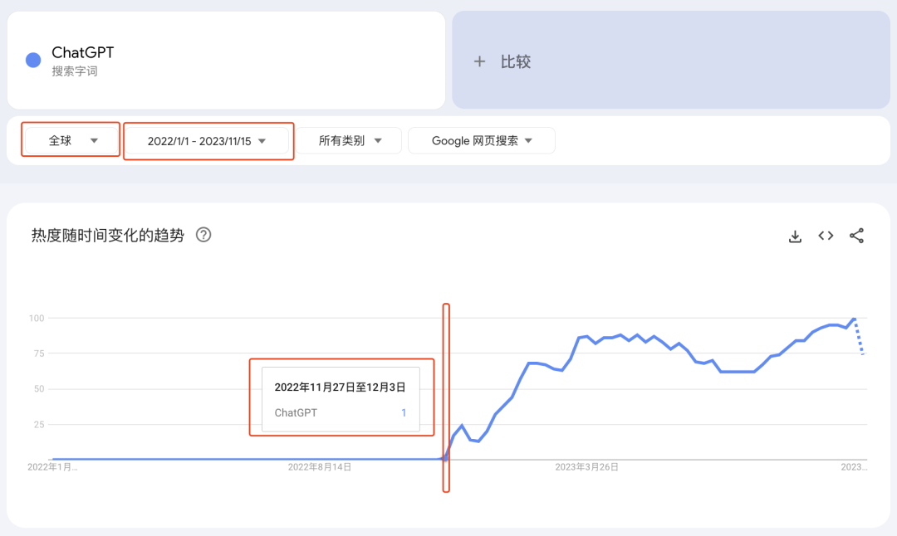
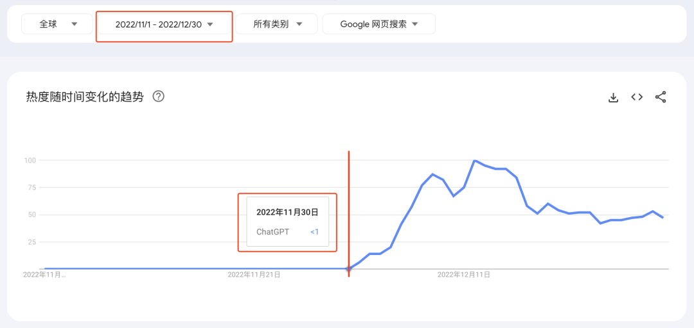
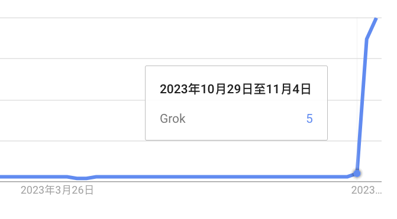
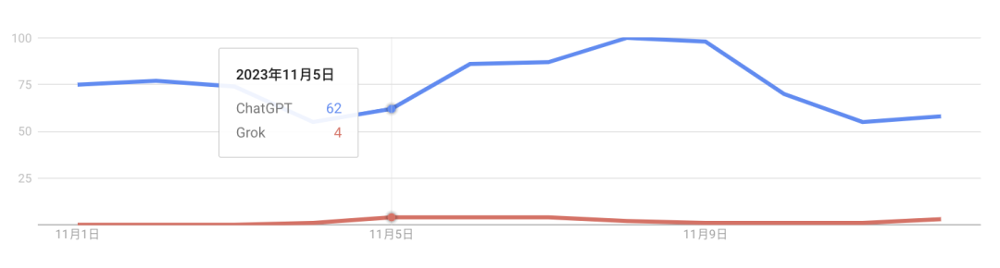

# 哥飞教你一招判断关键词出现时间，找新词不再难

大家好，我是哥飞。

我们之前聊过很多次新词相关话题：

找新词：一个永远有效的建站策略，让你快速拿到搜索引擎流量

哥飞社群里最近的几个活动

上线5天的新网站，今日UV3000多

AI工具站日收入破千美元；零基础入门养网站防老路线图

2023年10月回顾：有日入千刀的，有月入千刀的，也有日UV破万的，还有才上第一个网站的，大家都是好样的

飞

我们之前在《上线5天的新网站，今日UV3000多》介绍过的这个网站，在上线第12天时申请下来了Adsense，昨天第14天时，Adsense日收入达到了93美元。

怎么做到的？还是靠新词。

有很多朋友问，那要怎么确定一个词是不是新词呢？

哥飞今天免费教大家一招，用这个办法，你能看到每一个词的出现时间。

而且这是完全免费的方法，只需要有一个谷歌账号就行。

方法说出来了，也很简单，就是用谷歌趋势。

网址： https://trends.google.com/trends/

打开之后，在输入框输入你要查的任意一个词，如我们输入 ChatGPT，地区选择全球，时间设置为2022年1月1日到现在。

我们知道 ChatGPT 是2022年的11月30日上线发布的，从上面的谷歌趋势图里可以看到，这个词最开始有搜索量，范围是2022年11月27日至12月3日。这跟11月30日上线时间是对得上的。

如果把时间范围缩小，还能得到准确的日期，就是11月30日。

哥飞对于新词的定义是出现时间不超过12个月的词，那么通过这个方法，我们就能够判断一个词是否是新词。

我们再拿 Grok 来看下，这个词之前一直有些搜索量，但不大。直到马斯克在11月4日发推宣布了xAI的第一个产品名字是 Grok，这个词的搜索量开始上升。

除了看单个词，我们还可以看多个词，进行搜索量对比。从下图 ChatGPT 和 Grok 的对比可以看到，Grok 现在还是小弱鸡，ChatGPT太深入人心了。

哥飞的这个方法你学会了吗？

现在学会了如何判断一个关键词是否是新词，那么如何去找新词呢？

欢迎加入哥飞的付费社群“哥飞的朋友们”，哥飞将会在社群里为大家详细讲解。

目前社群定价666元，还剩71个位置就要涨价到777元了，不管是为了价格还是为了尽快出海赚钱，哥飞都建议你今天就加入进来。

为什么哥飞建议你尽早加入哥飞的这个社群呢？

因为越早加入，越早赚钱，社群费用很快就能赚回来。

就像这位朋友，一天的广告费就把社群费用赚回来了。

更不用说，还有些朋友已经日入千刀以上了。

2023年10月回顾：有日入千刀的，有月入千刀的，也有日UV破万的，还有才上第一个网站的，大家都是好样的

如果你对社群感兴趣，请加哥飞微信 qiayue 咨询了解。

