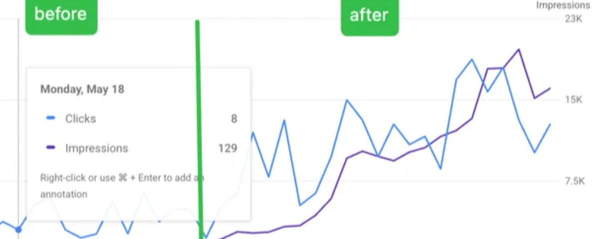
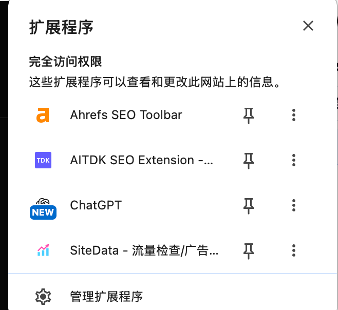
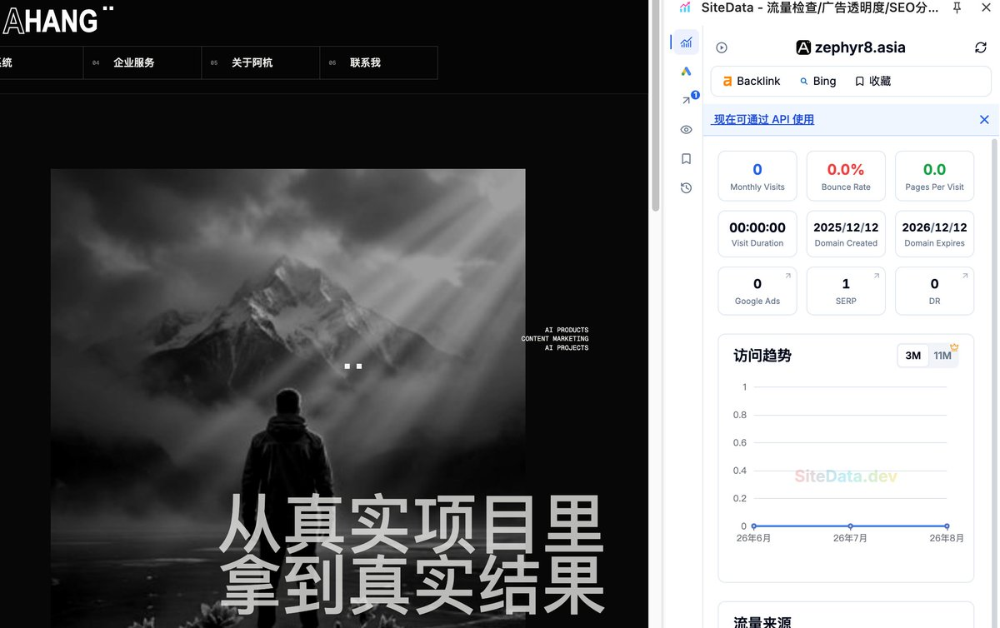
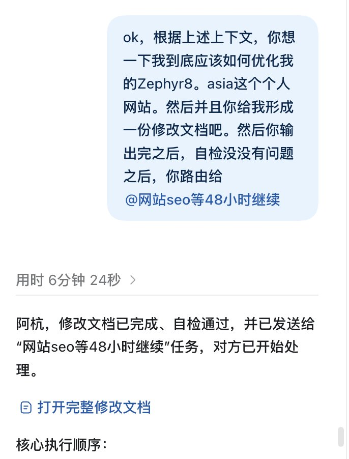

# 从0人访问到被更多人搜到：纯小白个人网站 AI + SEO 实战复盘

从零了解 AI 加出海与个人站点 SEO 能做哪些事情。以完全小白视角，记录如何使用 Codex 搭配工具链对个人网站进行深度体检与工程级改造。

在此之前，很多专业 SEO 工具我都未曾使用过，更谈不上深谙出海运营。但通过让 Codex 与主流工具协作，完成了对个人站点的完整排查，定位底层缺陷，并生成了详尽的结构化整改规范交付后续任务推进。

---

## 核心出发点：如何让目标群体在搜索场景中找到你？

当创作者或独立开发者希望拓展品牌合作、承接海外项目或展示技术影响力时，除了在社交媒体（如 X 等）日常分发内容外，是否存在更具持久复利的触达方式？

当品牌方、客户在搜索引擎检索特定领域关键词，或者让 AI 筛选行业候选人时，个人网站能否稳定出现在结果中？

在用户进入站点后，能否在极短时间内清晰传达核心价值：
- **我是谁**
- **做过哪些成熟项目与实战案例**
- **适合承担何种合作或服务**
- **历史产出是否具备可信的结果与数据验证**

如果无法清晰回应这些问题，个人网站充其量仅是一份被动静态简历。因此第一步需先厘清已有海外网站的流量来源构成，再以此为基准审查自身站点。

---

## 第一阶段：工具链部署与职责分工

利用 Codex 操作浏览器环境并解读关键数据指标，将专业工具的分析维度转化为清晰的业务与技术改进项：

1. **流量格局与画像分析（如 SiteData 等）**：
   - 观测站点的访问量级分布
   - 区分搜索流量、社媒引流与直接访问（Direct）占比
   - 识别主要用户分布地域与进入站点的核心关键词
2. **页面质量与 AI 可读性审查（如 AITDK 等）**：
   - 检查页面 Title、Meta Description、正文层级
   - 评估搜索引擎抓取效率与 Structured Data（结构化数据）配置
   - 验证网站内容对 LLM/AI 搜索引擎是否友好、易于解析
3. **架构合规与交叉核验（如 Ahrefs SEO Toolbar 等）**：
   - 审查 HTML 页面结构完整性、规范网址（Canonical URL）配置
   - 核验 Sitemap（站点地图）覆盖度与文章层级语义标记

三类工具分别承担**市场基准研究**、**页面代码体检**与**最终交叉验收**。

在对内容营销类样本站点的拆解中可以发现：成熟站点的访问往往大量来自直接访问和社交平台沉淀，而在自然搜索流量中，**品牌词搜索**占据了显著比重。

### 对 SEO 链路的认知重构

> **社交媒体负责分发与心智触达，用户建立品牌认知后发起主动检索，网站则承接后续的信任证明、深度答疑与商业转化。**

SEO 接住的是这条长效链路。个人站点负责将分散在各平台的零散内容、案例与技术沉淀整合收敛，让首次检索进来的访客无需翻阅历史记录，即可建立完整的专业信任。

---

## 第二阶段：站点深度体检与典型技术隐患

完成外部基准比对后，开始对个人站点进行系统核验：

站点看似能够正常渲染，但与“能持续获取自然搜索流量”之间存在诸多隐性技术缺陷：

### 1. 基础配置现状
- `robots.txt` 规则运转正常
- `sitemap.xml` 包含完整的基础 URL 收录
- 首页具备相对清晰的标题、描述与身份信息
- 文章页面具备供 AI 阅读的纯净 Markdown 或纯文本版本
- 已接入 Google Search Console 站长平台

### 2. 挖掘出的深层结构问题
- **列表动态分页导致内容断链**：虽然所有文章均可直链访问，但首页/归档列表仅默认渲染前 24 篇，后续文章依赖交互动效点击“加载更多”。爬虫通常不会主动触发动态点击，导致大部分文章缺少首页内链权重传导。
- **数据指标缺乏来源说明**：展示浏览量、互动量等数字时，未显式标明数据源自外部社交平台原帖，容易引发真实性与统计口径上的误读。
- **跨版本输出一致性**：网页 HTML、Markdown 镜像以及供 AI 读取的全文端点若各自独立生成，容易出现数据脱节。应保证多端由同一数据源统一输出。

Codex 整理出了包含具体页面、修复方案与验收标准的结构化自检文档，将原本零散的感知转变为清晰可落地的工程任务。

---

## 第三阶段：Codex + SEO 的协同落地流程

在自检文档梳理清晰后，通过上下文传递机制将改动需求同步给负责站点工程实现的另一个 Codex 会话环境：

该环境已具备站点的代码库架构、部署上下文与 Search Console 历史表现，因此无需重复交代背景即可直接进入代码修改与构建验收阶段：
1. 优化所有文章在主列表中的静态爬取可达性，消除单纯依赖客户端点击造成的深度孤岛。
2. 规范化文章的层级语义结构，补齐缺失的章节锚点与关联内链。
3. 统一 HTML 视图与 Markdown 视图的数据流，确保同一页面在人类浏览和机器解析下信息完全一致。

---

## 核心方法论沉淀

1. **AI 充当业务导师与执行杠杆**：即便面对陌生的垂直领域（出海、SEO 体系化标准），AI 不仅能辅助编写内容，更能作为架构顾问指导工具组合使用，抹平知识盲区。
2. **多 Agent 职能解耦**：
   - 一个 Agent 负责操作工具、爬取竞品与收集数据
   - 一个 Agent 维系代码库与基础设施长期上下文
   - 开发者处于中枢进行商业目标判断与真实性裁决
3. **敏捷工程响应**：当商业目标明确后，核心竞争力在于能否迅速调度 AI、工具链与上下文资源，形成闭环的工作流。
