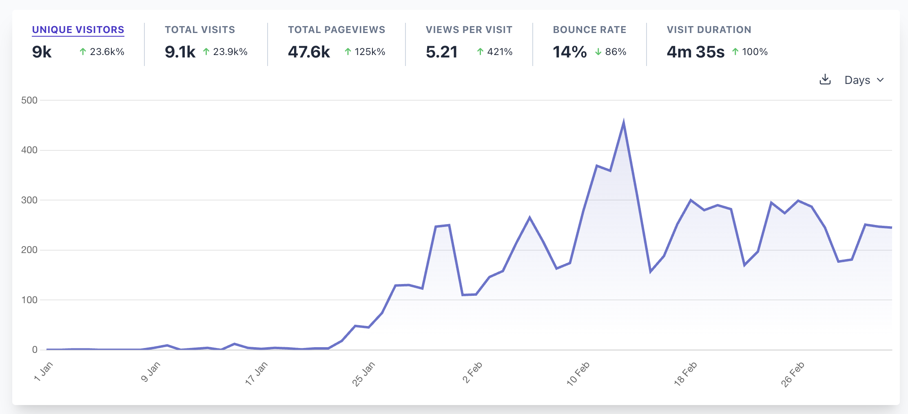
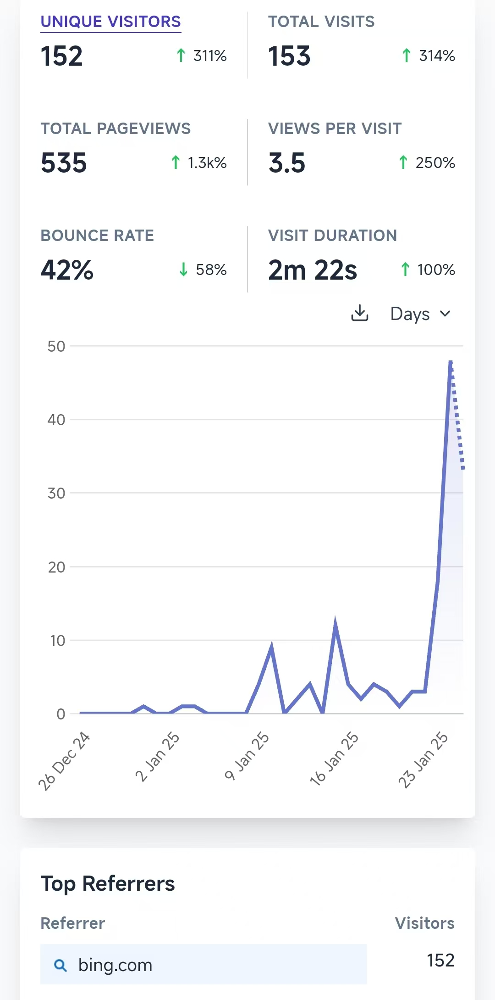
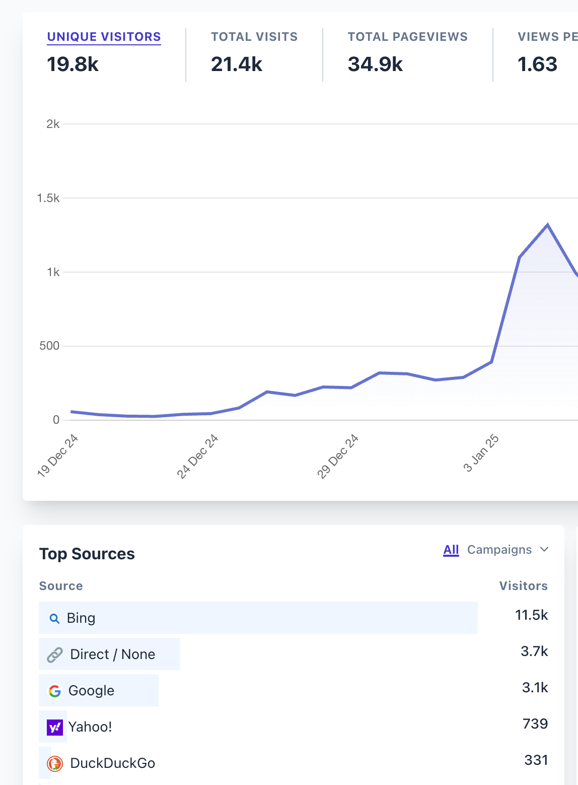
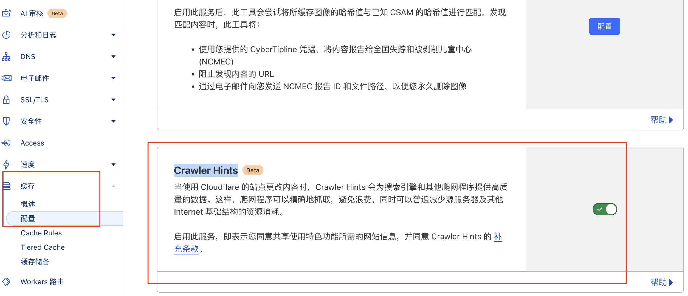
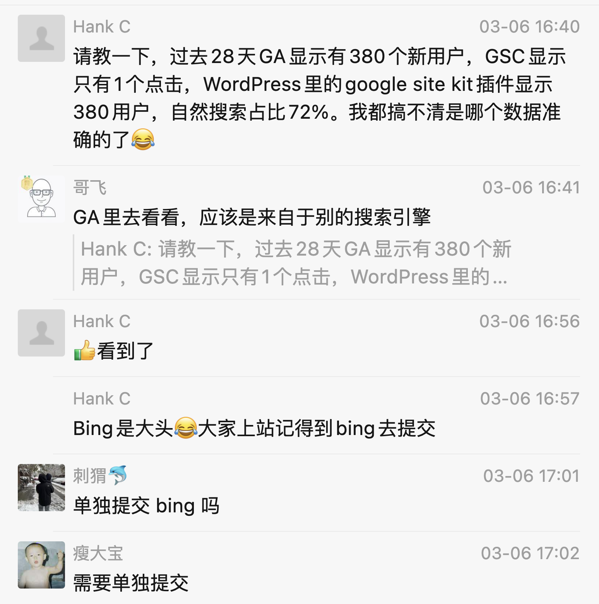

# 如何获取Bing的流量
> 原文链接: https://new.web.cafe/tutorial/detail/i9aa0x1lhb

---

哥飞2025-03-06 17:15

[Bing](https://new.web.cafe/label/x928zoixjs)

进阶教程

## 进阶教程

# 如何获取Bing的流量

收藏

先看图，今天3月6日，回看1月1日到3月5日，来自于 Bing 的流量，可以看到还是很有效果的，现在稳定在每天有两三百个点击。

以下是1月25日，哥飞在社群里的分享。

我有一个网站，这周才发现Bing没有收录。 于是就去做了一些事情，目前看来有一些效果了：

1.  提交到 Bing 站长后台 [https://www.bing.com/webmaster/](https://www.bing.com/webmaster/)

2.  加上 Sitemap（这个站没有Sitemap，也有来自于谷歌每天几K的点击）

3.  按照 Bing 站长后台扫描出来的问题，一个一个去修改。 如有些页面没有Description，有些没有H1，有些Title太长。

4.  增加对 IndexNow 的支持[https://www.bing.com/indexnow](https://www.bing.com/indexnow) 网址主动提交到 IndexNow

5.  在 CF 开启主动推送

为什么谷歌不需要Sitemap，我猜谷歌爬虫很强大，不需要依赖Sitemap，也不太喜欢站长提交过来的大量链接，谷歌更喜欢自己去爬，自己去发现，去判断。

但是其它爬虫，想省钱，爬虫没有那么强大，所以就更依赖站长提交的Sitemap。

包括国内的百度、搜狗等搜索引擎也是，如果你能够把Sitemap提交上去，那么收录就十拿九稳。

群里朋友“帆”补充：

我也有个网站，大部分都是 Bing 带来的流量 

没有刻意去提交站点，就是开了 Cloudflare 里的那个选项，域名 => 缓存 => 配置 => Crawler Hints，开启来后很快就有 Bing / Yahoo / Yandex / DuckDuckGo / Brave 那些来源的记录了 \[破涕为笑\] 

SegmentFault 联合创始人 Joyqi 也说思否的流量已经是百度的2倍了。

刚刚，群里也有朋友的网站，主要流量来源是 Bing 。 

补充，如何在GA（谷歌分析）看网站流量来源，见这里[https://new.web.cafe/experience/hwnkft6n9z](https://new.web.cafe/experience/hwnkft6n9z)

[上一篇: 再聊挖掘需求的方法](https://new.web.cafe/tutorial/detail/mrozYpTgfu6MGXggeX2Kzr)[下一篇: 【哥飞看词】帮社群里朋友看一个关键词是否能做](https://new.web.cafe/tutorial/detail/6y8debz2oj)

评论区

-   

    2025-06-13 14:32

    回复

    bing 流量质量怎样

-   

    LFT

    2025-06-28 11:03

    回复

    mark

-   

    心花烂漫

    2025-07-05 22:29

    回复

    问一下，这里的流量是用什么统计的

-   

    峻菁

    2025-07-07 11:21

    回复

    打卡

-   

    阿木子三不知

    2025-07-07 23:56

    回复

    打卡

-   

    图南

    2025-07-09 11:44

    回复

    打卡

-   

    张宇

    2025-07-26 23:39

    回复

    打卡

-   

    老荀

    2025-09-22 12:34

    回复

    打卡

-   

    简扬♪

    2025-11-05 21:43

    回复

    打卡 1.CF开始主动推送 2.主动给bing提交站点地图 3.提交到 Bing 站长后台 4.按照bing的网站扫描结果，进行修改； 5.主动提交到 IndexNow

-   

    laiqun🇨🇳

    2025-12-22 17:26

    回复

    在 Cloudflare（CF）里开启“主动推送”，通常指的是： 👉 当你的网站 URL 有变化时，Cloudflare 会自动帮你把这些变化“推送”给搜索引擎（主要是 Bing 的 IndexNow）。

    一句话版： 你更新网站 → CF 自动通知 Bing → Bing 更快收录。

-   

    fz

    2026-01-18 11:50

    回复

    Cloudfalre里面开启“主动推送”选项指的就是“Crawer hints” 吗？

-   

    丿晓风

    2026-01-25 22:03

    回复

    打卡

-   

    曦演

    2026-03-22 16:03

    回复

    打卡

-   

    简语

    2026-05-17 23:46

    回复

    打卡

-   

    36Laugh

    2026-05-26 16:48

    回复

    completed

-   

    大鱼

    2026-06-30 10:17

    回复

    打卡

-   

    Jimmy sunshine

    2026-07-01 22:02

    回复

    打卡

-   

    Jessica周

    2026-07-13 17:05

    回复

    打卡

-   

    曾伟雄

    2026-07-20 18:21

    回复

    打卡

添加图片添加隐藏回复

[

