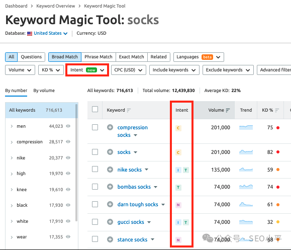
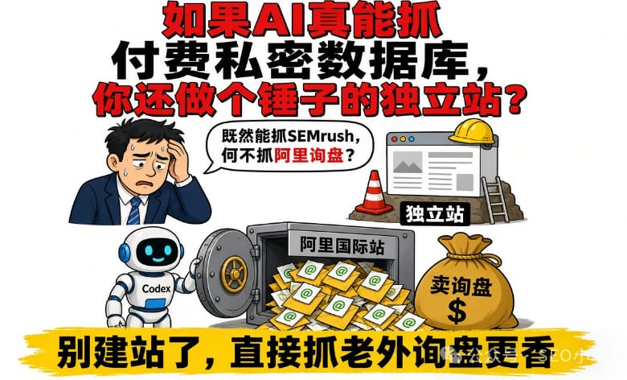
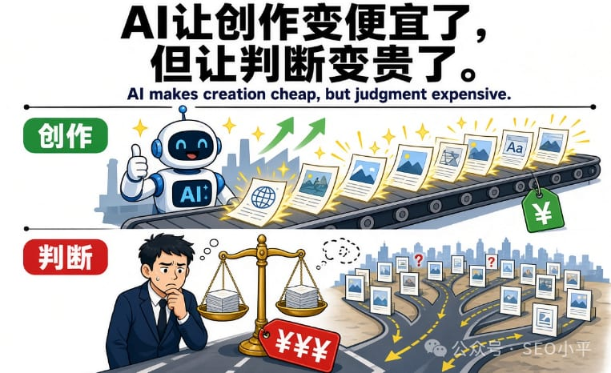
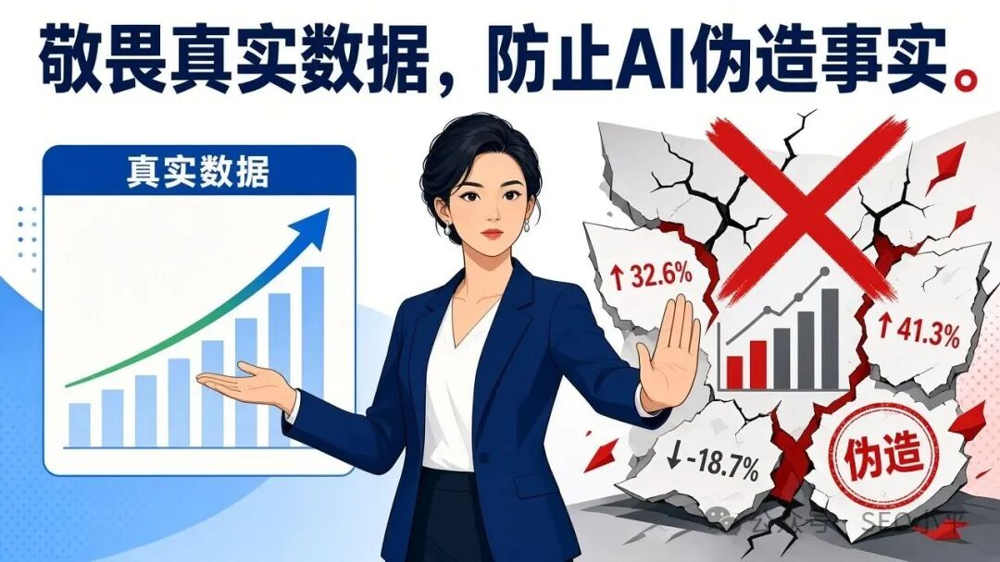

# 警告：别用Codex做关键词调研，都是虚假数据

大家好，我是10年外贸独立站SEO操盘手和创业者：SEO小平，我最近参加了很多下线的SEO分享大会，发现很多人用AI建站的使用关键词调研是AI做的，这让SEO外贸圈有种很危险的兴奋。

先把丑话说在前面

Codex 做 AI 建站，可以用。 让它搭页面、改代码、出结构、整理产品参数，没问题。

但请你记住一句很硬的话：

不要用它做关键词调研。

因为它吐出来的「搜索量」「竞争难度」，不是从真实数据库里读出来的，而是大语言模型学会了「关键词报告长什么样」，然后给你现场演了一出专业。

演得很像。 所以才更危险。

SEMrush 和 Ahrefs 的核心数据，是必须要输入账号密码才能读取，如果你没绑定API，Codex是根本读不到SEMrush的数据的。

这事得讲透，不然小白永远觉得：AI 那么聪明，数据难道不能自己抓吗？

不能。

你没登录、没付费、没权限，也没有购买API，你就看不到。 AI Agent 没有魔法钥匙，也不会因为你语气诚恳一点，就突然拥有商业数据公司的内网接口。

所以当 Codex 给你写出：

这个词月搜 5400， 难度 32， 竞争低， 建议主攻——

你以为它在汇报数据。 它其实可能只是在写作文。

对大模型来说，填一个「看起来合理的数字」，和编一段「看起来专业的分析」，本来就是同一项能力。

如果AI真能抓到付费的私密数据库，你还做个锤子的独立站？

阿里巴巴国际站也是付费的私密数据库啊，你何不让Codex 直接把阿里巴巴国际站的每天所有老外的询盘全部给你抓下来，你卖询盘都能赚翻了。

这里有个最能打脸、也最该让人清醒的反问。

那不是比做什么关键词、写什么产品页、搞什么 SEO、GEO 更直接、更高效吗？

正因为「抓对手真实询盘和 WhatsApp」荒谬， 所以「抓 SEMrush 墙后真实搜索量」也同样荒谬。

AI让创作变便宜了，但让判断变贵了。

AI makes creation cheap, but judgment expensive.

上面这句话是深圳联盟营销大佬@Affiliate Wayne这几天在越南参加AI营销大会上的分享，这是全球其他AI大佬都有的共识。

这才是这个时代最阴的地方。所以你要找有经验的专家来帮你梳理SOP。这也是我们做SEO和GEO陪跑的初衷。

以前小白不知道选什么词，会心虚。 心虚是好事，心虚会逼你去查、去问、去验证。

外贸独立站本来就够难了。流量贵，信任慢，询盘少，决策重。你要是在最开始的选词环节，就拿假数据当罗盘，后面整站都可能建在沙上。

AI 建站可以加速，但不能替你发明市场需求

把边界划清楚，大家才不会一竿子打死 AI。

AI Agent 适合做什么？ 适合提高执行速度。 适合帮你搭站、改站、出初稿、整理信息、提出「可能相关」的词表假设。

AI Agent 不适合冒充什么？ 不适合冒充 SEMrush。 不适合冒充 Ahrefs。 不适合在没有真实数据源的情况下，给你拍板「这个词值不值得做」。

市场需求是实证问题，不是AI的提示词的问题。

实证问题，得回到真实来源： 谷歌关键词规划师、Search Console、付费工具、站内真实搜索与转化、销售一线反馈、老客户原话、行业询盘记录。

AI 可以帮你提问。 AI 可以帮你整理。 AI 可以帮你加快验证。

但验证本身，不能省略。 真实数据，不能幻觉。

敬畏真实数据，使用 AI 加速，绝不让模型替你伪造事实。

因为越是 Agent 时代，真假越容易混淆。 模型越会模仿专业报告，普通人越容易放弃核对。 而外贸获客这种事，错一次选词，可能浪费的是整季内容和整季预算。

你要怕的，不是 AI 不够聪明。 你要怕的，是它聪明到足够把「胡说」包装成「结论」。请问你自己的价值何在？
