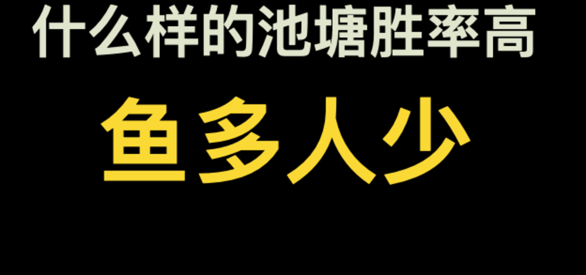
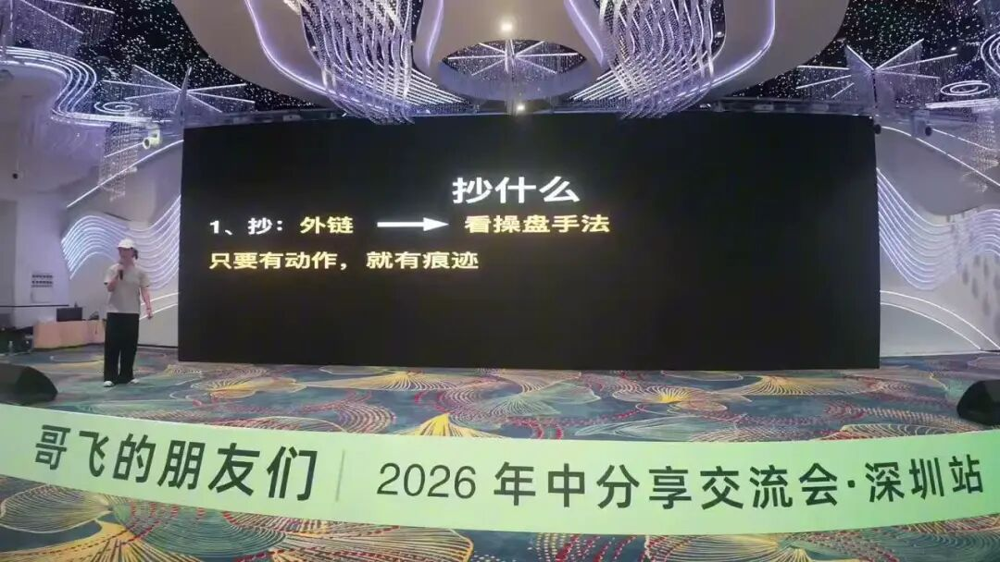

# 出海四个月月入万刀，Fiona说新手先找鱼多、人少的池子

大家好，我是哥飞。

很多新手做出海，第一反应是先补技术。

学框架，学部署，学支付，学自动化，学完一个还有下一个。

这些东西当然要会。 Fiona 在现场讲得很直接：出海第一件事，先别急着挑战技术难题。

先找方向。

方向找错了，技术再熟，也可能只是把一个没人要的东西做得更完整。

方向找对了，页面简陋一点，功能先少一点，甚至有些地方先手动处理，也能更快拿到反馈。

Fiona 自己是 AI 产品经理出身。大模型刚出来的时候，她对 AI 并不陌生，但一开始没有把注意力放到海外市场上。

后来她加入哥飞社群，开始真正下场做出海项目。之前写深圳活动侧记《 650 位朋友来到深圳，在哥飞的朋友们 2026 年中分享交流会里都学到了这些》时也提到过，她出海四个月做到了月入万刀。

四个月月入万刀这个结果很亮眼。

对新手更有用的问题是：想更快拿到正反馈，应该把力气先花在哪里。

Fiona 讲这件事时，用了一个很形象的比喻：捕鱼。

你要先找池子。

一个池子里本来就没什么鱼，你坐在那里钓一天，钓不到鱼很正常。

一个池子里鱼很多，但旁边坐满了高手，新手也很难钓到。

更适合新手的地方，是鱼多、人少。

这四个字听起来简单，其实很适合拿来重新理解找词。

鱼多，代表那里有需求。

有人搜，有人买，有人在投广告，有人在发外链，有人在持续更新页面，有人在榜单里赚钱。

这些都说明一件事：这个方向有真实市场，已经有人用真金白银投票了。

人少，代表竞争还没到新手完全打不动的程度。

有些方向看起来很热，大家都知道，到处都在讨论，各种工具榜单也在讨论。

这时候再冲进去，表面看是新词，实际上已经没有信息差了。

没有信息差的时候，新手跟大站、老手、资源更多的人正面打，很容易变成陪跑。

所以 Fiona 的第一层判断很朴素：不要一上来就问我技术能不能做出来。

先问这个池子里有没有鱼。

再问这个池子旁边坐了多少人。

## 跟着高手学，看他们留下的痕迹

找到鱼多、人少的地方，听起来还是有点抽象。

那新手怎么判断哪里有鱼？

Fiona 给的一个办法是：跟着高手学。

这里的"学"，重点不在把别人的网站复制一遍。

真正要看的，是高手留下的痕迹。

第一个痕迹是外链。

一个站从零到一做起来，外链路径往往会留下很多线索。它早期先发了哪些地方，哪些外链出现得很早，哪些页面先被推起来，这些东西比后期看到的结果更有价值。

很多人只看别人现在排名很好，流量很大。

但更有用的是往回看：它最开始是怎么动的。

有些外链看起来不起眼，却可能是冷启动时的第一批动作。有些社区帖子、目录站、博客评论、产品发布页，单独看都不神奇，连起来看，就能看到一条操盘路径。

第二个痕迹是新增内容。

做 SEO 做得好的人，对关键词往往很敏感。

他今天新增了什么页面，明天又上了什么工具，最近开始写哪类博客，这些都在透露他的判断。

哪里有鱼，他可能比新手更早知道。

所以不要只盯着他的首页，也不要只看某个工具里粗略的流量曲线。更应该看它每天新增了什么。

第三个痕迹是页面结构。

标题怎么写，首页怎么组织，内页怎么放入口，价格页怎么引导，按钮放在哪里，生成器和注册之间怎么衔接，这些都值得拆。

尤其是现在网站越来越卷，交互设计和信任感越来越重要。

用户打开一个页面，第一眼觉得专业，才愿意继续试。

页面做得粗糙，配色东一块西一块，按钮看着像临时拼出来的，用户很难放心输入内容，更不要说付费。

这里我很认同 Fiona 的一个说法：不要只把网址丢给 AI 说"帮我抄一下"。

让 AI 真正打开页面，点一遍你想学的功能，看它的交互路径，再让它总结为什么这样设计。

这样学到的才是页面背后的判断，表面样式只是最后一层。

## 通过鱼去找人

还有一个问题：新手怎么知道谁是高手？

Fiona 的说法也很直接：通过鱼去找人。

谁钓到了大鱼，谁大概率知道哪里有鱼。

放到网站和 SEO 里，就是看谁能在短时间内把大词做到前排，谁能在新词刚出现时跑得最快，谁经常在高质量外链站点上留下动作。

这些人值得研究。

研究这些人，价值在他们的动作里。

比如一个词长期有人投广告，说明这个词大概率能挣钱。

一个方向里有人愿意持续买高价外链，说明它背后可能有足够利润支撑。

一个 App 榜单里的产品持续赚钱，说明用户已经在为这个需求付费。它在应用商店能赚钱，放到网页搜索里，也可能有人搜。

这些判断，都是在用钱验证需求。

很多新手找方向，只看自己喜不喜欢。

我觉得更稳的方式，是先看市场上有没有人已经愿意花钱。

有人花钱买广告，有人花钱买外链，有人花钱买订阅，有人花钱做内容，说明这个池子里至少有鱼。

接下来再看人多不多，自己有没有机会切进去。

## 不要和大佬正面硬刚

Fiona 讲"鱼多人少"时，专门讲了另一面：怎么避开人多。

有些词看起来是新词，其实已经不适合新手无脑追。

比如某个模型刚火，全网都在讨论，身边很多人也都知道，老手当然也知道。

你现在冲进去，看到的是新词，遇到的是老手。

大家同时上站，同时发外链，同时做页面。老手有更成熟的模板，更快的上线速度，更多站群资源，更懂外链和页面转化。

这种情况下，新手硬刚，很容易打不赢。

Fiona 的建议是，不要只跟着最热的词跑。

可以往后多想一步。

一个模型火了，背后的需求是什么？

一个玩法火了，会不会产生新的衍生需求？

英语主战场已经卷起来了，小语种会不会晚几天才开始爆发？

某个源头账号、榜单、社区，能不能提前盯住？

这些地方才可能出现新手能拿到的窗口。

同样是追热点，有人追的是大家都看见的热闹，有人追的是热闹背后的下一层需求。

差别就在这里。

## 万刀来自每一夜

讲完找方向， Fiona 还讲了一件更扎心的事。

很多人其实不缺方法。

缺的是一直做下去。

她借用了一句话：万刀来自每一夜。

这句话很适合新手听。

我们看到别人月入万刀，很容易觉得是某个站突然爆了，某个词突然起来了，某个机会突然被他抓住了。

往前看，常常会看到更长的积累。

他可能上了很多站，踩了很多坑，做过很多页面，发过很多外链，改过很多次转化路径。

最后看起来爆的是其中一个站。

前面积累下来的经验，都进了这个站。

Fiona 用了两个概率上的思路来解释这件事。

第一个是大数定理。

如果一个方向的成功率是百分之十，那你做一个站，当然很可能失败。

但你做十个站，就更有机会遇到那个跑出来的。

这里的重点是提高样本量，不要把所有运气押在第一个站。

第二个是不断迭代。

第一个站做完，还要继续。

你要知道它哪里做得好，哪里做得差，哪些可以留到下一个站继续用，哪些必须改掉。

第二个站比第一个站多一个改进，第三个站再多一个改进。

每次进步一点，后面的胜率就会变高。

这也是我一直觉得上站很重要的原因。

很多经验，只靠看文章看不出来。

页面上线后有没有收录，用户点进来停留多久，注册按钮有没有人点，生成器有没有人用，价格页有没有人看，这些都要到真实网站里才会暴露。

不下场，永远不知道自己到底卡在哪。

## 新手更适合先做截流

讲流量时， Fiona 把路径分成几类。

有一种叫造势。

你自己做一个全新的产品，市场上还没有这个词，没有人主动搜索它。你要靠社媒爆款、持续记录、红人传播、内容讨论，把需求造出来。

这种打法能做，但很考验人。

你要会表达，会发内容，会让别人愿意转发，也要能持续讲一个产品为什么值得关注。

对很多新手来说，更快拿正反馈的方式，是先做截流。

截流的意思是：需求已经在那里了，用户已经在搜了，你想办法把这部分现成需求接过来。

比如某个平台词、某个模型词、某个明确需求词。

用户搜这个词的时候，通常已经知道自己想要什么。

你需要做的是给他一个能用的页面，让他打开之后发现：这个东西正好解决我的问题。

这类流量离转化更近。

尤其是模型词。

很多用户搜模型词时，已经知道这个模型能做什么，也已经产生了使用欲望。你不用从零教育他"为什么要用 AI 生成图片"或者"为什么这个玩法有意思"。

他已经被教育过了。

你只要把使用路径做好，把结果展示清楚，把付费点放顺，就更容易拿到反馈。

所以新手做第一个正反馈，不一定要做一个从零开始教育市场的大品牌。

先接一段已经存在的需求，把它服务好，也是一种很现实的打法。

## 冷启动先拿精准流量

Fiona 讲冷启动时，也没有讲得很玄。

她的核心判断是：先找精准流量。

精准流量的好处，先是可能带来第一批用户。

它还会影响网站后续的数据。

用户点进来之后，如果发现内容对得上，会停留，会试用，会点更多页面。这样的行为数据，对后续 SEO 也有帮助。

流量不精准时，用户进来发现内容对不上，马上离开。看起来有访问，实际价值不大。

那怎么让用户多停留、多试用？

Fiona 提到几个很细的动作。

比如前期送积分。

积分不一定比买外链更贵，但它能让用户多试几次。用户多试几次，你才能知道他到底卡在哪。

比如生成速度不用一味追求极快。

有时候让用户等几十秒，甚至更久一点，页面上同时给出动态过程、示例、提示和结果预览，用户反而会多看一会儿。

再比如加一些动态元素。

视频、图片、弹窗、过程展示，目的很具体：让用户知道页面在工作，让用户愿意继续等，让用户有下一步动作。

这和小羊讲转化时说的很多内容能对上。

工具站不能只把功能放上去。

用户每一步都需要被引导。

从打开页面，到输入内容，到生成结果，到复制、下载、注册、付费，中间每一步都可能流失。

冷启动阶段尤其要珍惜每一个精准用户。

因为他们不仅可能付费，还会告诉你这个产品到底有没有满足需求。

## 先想清楚赚谁的钱

做网站到最后，还是要回到变现。

Fiona 讲得很直白：我们花的是自己的钱，不要学那些烧投资人钱的打法。

有些公司投广告，账面看起来不赚钱，但它可能拿的是融资的钱，目标是规模、估值、市场份额。

普通人做站不一样。

我们花的是自己的钱，时间也是自己的。

所以一开始就要想清楚：这个项目赚谁的钱。

Fiona 把它分成几类。

第一类，赚省时间的钱。

用户原来需要几个小时、几天才能完成的事情，用你的工具几分钟完成。只要价值足够清楚，他就愿意付费。

很多 AI 工具站，本质上赚的都是这类钱。

第二类，赚帮业务赚钱的钱。

如果你的工具能帮公司多拿线索、多做内容、多转化客户、多节省人力，这类钱更好赚。

因为能赚钱的公司，更愿意花钱。

第三类，赚让用户爽的钱。

有些产品不靠省时间，也不直接帮他赚钱，靠的是给用户心理满足。

AI 陪伴、游戏、娱乐类工具，经常属于这一类。

这类用户有时不会认真对比竞品。只要当下觉得爽，就愿意花钱。

第四类，赚信息差的钱。

有些工具本身不复杂，但用户不知道背后还有更便宜、更直接的实现方式。

你把复杂东西包装成简单服务，让用户少研究、少折腾，也能赚钱。

这几类钱，没有哪一类天然高级。

关键是你自己要知道正在赚哪一类钱。

如果你赚的是省时间的钱，页面就要讲清楚省了什么时间。

如果你赚的是帮业务赚钱的钱，页面就要讲清楚怎么带来收入或线索。

如果你赚的是让用户爽的钱，页面就要让用户最快体验到爽点。

如果你赚的是信息差的钱，页面就要把复杂过程变简单。

很多项目赚不到钱，是因为页面上写得很热闹，但读者看不出为什么要付费。

## AI 是伙伴，真正要卷的是人

Fiona 最后把 AI 和人的关系收得很清楚。

她的意思很清楚： AI 红利窗口在收窄，市场也越来越卷。

AI 是工具，是伙伴，也是在帮普通人放大执行力。

真正要卷的，是其他还停在空想里的人。

很多人每天都在想方向，想技术，想完美产品，想等一个更好的机会。

但真正能拿到反馈的人，往往先把页面上了。

功能没做完，可以先放排队入口。

流程不完美，可以先跑一个最小版本。

关键词不确定，可以先做一个页面观察收录和点击。

外链不熟，可以先发第一条，再看有没有效果。

你做了，才有数据。

有数据，才知道下一步怎么改。

不做，就只有想法。

Fiona 讲"心力"时，我也觉得这个词很准确。

很多人真正缺的，是可持续的心力。

每天做太多决策，心力很快就会被耗光。

下班之后要不要上站？

这个词要不要做？

这个页面要不要改？

这个功能要不要先上线？

想来想去，人就累了。

对新手来说，更稳的办法是减少每天的重新选择。

先给自己定一个简单规则。

看到一个方向，先判断有没有鱼。

有人投广告，有人发外链，有人做内容，有人赚钱，就值得继续研究。

接着判断人多不多。

如果所有老手都已经冲进去了，就换一个更小、更细、更晚爆发的角度。

然后尽快上一个页面。

不要等想明白全部再做。

先拿到一个真实反馈，再决定下一步。

Fiona 这场对新手最有用的地方，就在这里。

她没有把出海讲成一个很玄的东西。

先找池子，再看高手，再避开正面战场，再多上站，再复盘，再想清楚赚谁的钱。

这些动作都不神秘。

难的是一直做。