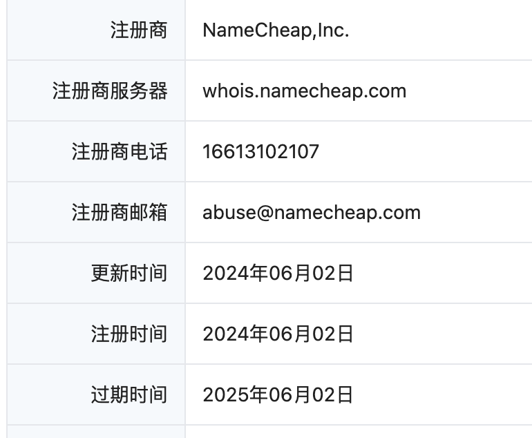
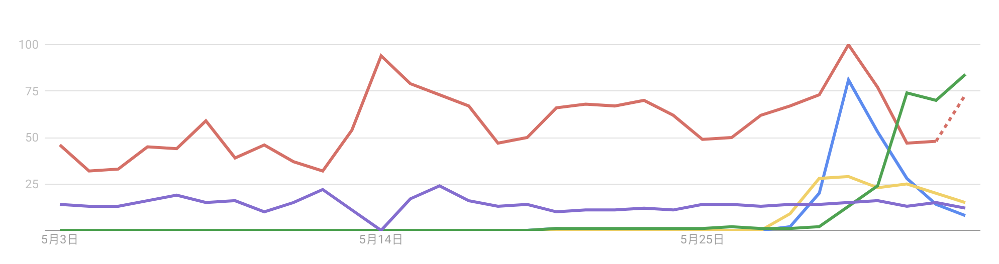
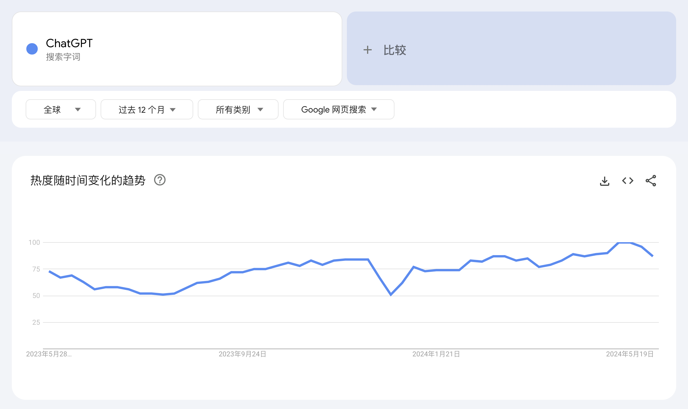
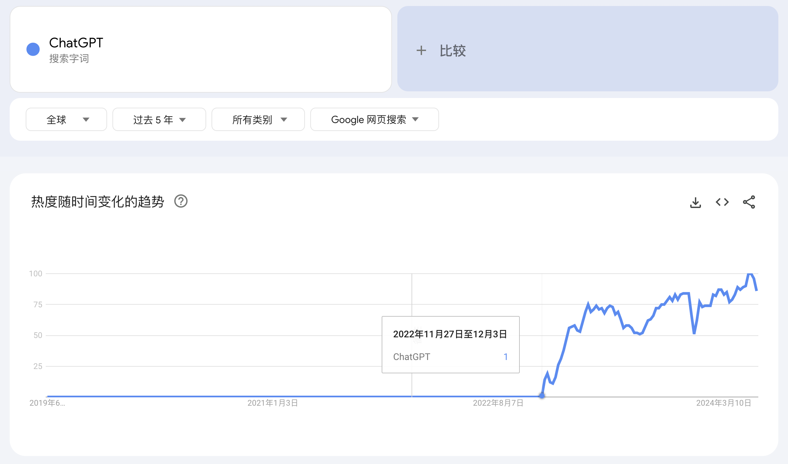
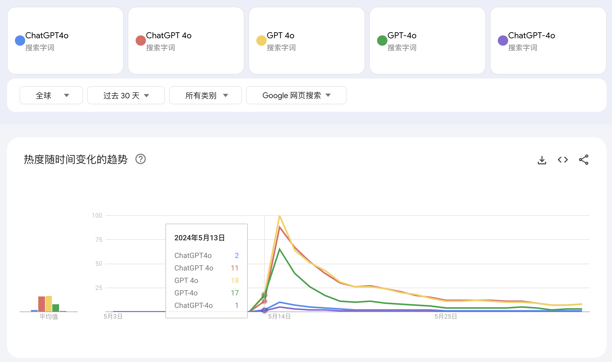
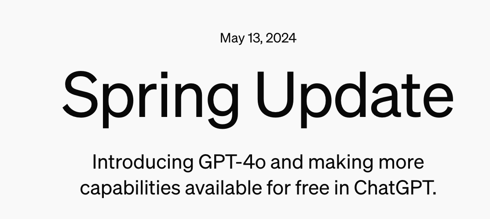
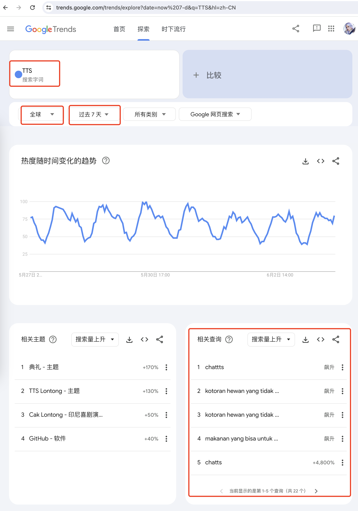
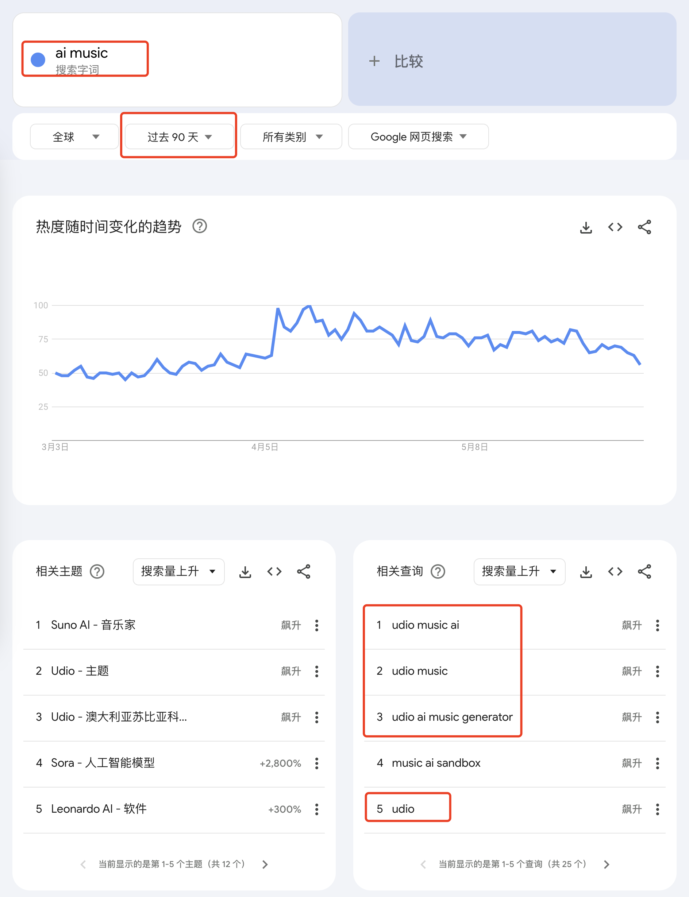
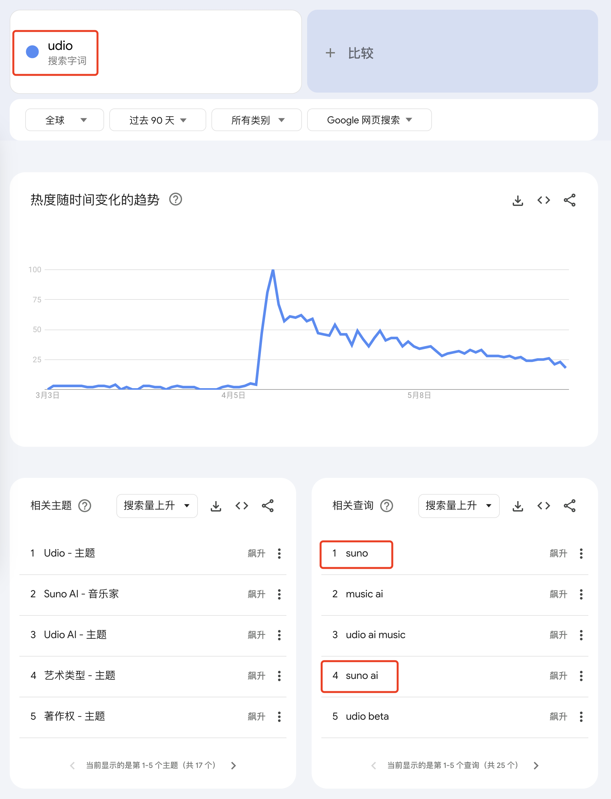
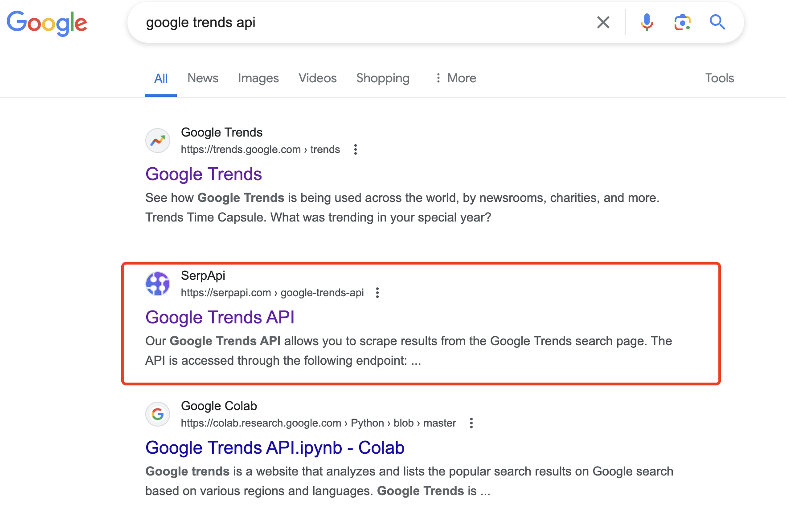

# 如何使用谷歌趋势找新词，如何判断一个关键词是新词
> 原文链接: https://new.web.cafe/tutorial/detail/gZnGR6eDaKxdyeT4ouR6KV

---

哥飞2024-08-13 15:47

进阶教程

## 进阶教程

# 如何使用谷歌趋势找新词，如何判断一个关键词是新词

收藏

刚发现一个词，昨天注册了，很有可能是群友。 

红色是GPTs，绿色是我说的词。

**如何判断一个词是否是新词**

方法很简单，把这个词放到谷歌趋势里搜索，然后看最近30天、90天、12个月、5年的曲线图。

如我们查一下 ChatGPT，看过去12个月，都是比较平稳的，这就说明这个词在12个月之前就出现了。

那就再往前看，我们看过去5年的数据。

我们知道，ChatGPT这个词是2022年11月30日出现的，拉长到五年之后，的确可以看到，就是从那个时间点开始有数据的。

所以根据谷歌趋势曲线，看一个词什么时候开始有曲线，就能够知道这个词的出现日期。

假如出现日期在30天内，那就最好不过了，新鲜热乎的新词，我们最喜欢了。

我们再拿 GPT 4o 的相关词验证下，可以看到这个些词就是5月13日开始出现的。

而 OpenAI 的发布会也是这一天发布的，所以我们现在可以确认，用谷歌趋势就可以看到一个词最先出来的时间，进而通过时间来判断是否是新词。 

好，现在我们已经知道怎么判断一个词是否是新词了

**那要怎么找出更多的新词呢？**

有很多办法，如你在任何地方看到的一个词，都可以放到谷歌趋势查询判断一下。

今天要教的方法是@Banbri 去年12月的线下聚会教过大家的方法。 我们打开谷歌趋势，输入任意一个关键词，举例 TTS ，选择全球，选择最近七天，看相关查询，是不是就看到了ChatTTS和ChaTTS。

这里我们发现，ChatTTS是我们之前就已经知道的，最近几天出现的新词。

并且还发现了一个Typo词，ChaTTS，这就很有意思了，多个T连在一起，有些人记不住，就会少输入一个T。

好，现在方法学会了，我们只需要不断的输入一些词，就能够找到这个词相关的新词。

举例，如果你输入AI，是不是就能找到AI相关的新词？ 但是AI太泛了，太大了，你还可以输入 AI Music，再选择90天，就把 udio 给找出来了。

输入 udio ，就把 suno 给找出来了。 也就是说，你知道一个产品之后，就可以拿着这个产品名称，或者这个产品所在品类的名称去谷歌趋势搜索，就能够找到更多的词。

找新词，不可能一击必中，你只能不断的探索，才可能会有发现。 所以方法就是不断的输入词汇，找到更多词汇。

那么这个方法可以自动化吗？ 那就要找到Google Trends的接口。

找接口的方法很简单，我通常就是直接去谷歌搜索。 输入 Google Trends API ，就找到了。

再把之前哥飞教给大家的方法用上，先从随便一个词，在谷歌找到一些网站，再去看这些网站获取自然流量的关键词，拿着这些词去找新词。

不断的在网站<->词<->更多词<->更多网站之间循环，你就能够打开一个全新的世界。

找词，找需求，不再是拍脑袋了，而是有科学方法去找。

好了，今晚的哥飞小课堂到此结束。

评论区

    請給我一支蘭州

    2025-04-27 17:15

    回复

    打卡

    2025-06-12 15:36

    回复

    谷歌趋势登录数据不是那么准，还是得换一个魔法

    YEE

    2025-08-26 10:26

    回复

    登录数据不准指的是？

    LFT

    2025-06-27 17:49

    回复

    打卡

    三球法术

    2025-07-05 11:30

    回复

    打卡

    Richao

    2025-07-05 21:03

    回复

    打卡，找需求找关键词，行百里者半九十！！！

    宇古

    2025-07-06 10:41

    回复

    用谷歌趋势可以快速判断和发现新词，只需看趋势曲线出现的时间。

    这篇文章教我们如何用谷歌趋势（Google Trends）来判断一个词是不是“新词”，以及怎么用它来挖掘更多新词。

    一、怎么判断一个词是不是新词？

    1.  把词丢进谷歌趋势搜索 比如你想查“ChatGPT”，就在谷歌趋势里搜它。
    2.  看趋势曲线的时间轴 ▫ 选最近30天、90天、12个月、5年，分别看曲线。 ▫ 如果曲线很早就有，说明这个词早就出现了。 ▫ 如果曲线是最近才冒出来的，说明这个词是新词。
    3.  举例说明 ▫ “ChatGPT”在2022年11月30日才有数据，说明那时才出现。 ▫ “GPT-4o”相关词在2024年5月13日才有数据，和OpenAI发布会同步。
    4.  结论 只要看谷歌趋势里，某个词第一次有数据的时间点，就能判断它是不是新词。如果是最近30天内的新词，那就非常新鲜。

    二、怎么用谷歌趋势挖掘更多新词？

    1.  随便输入一个相关词 ▫ 比如输入“TTS”，选“全球”，选“最近七天”。 ▫ 看“相关查询”里出现的新词，比如“ChatTTS”、“ChaTTS”（有的还是拼写错误的变体）。
    2.  不断尝试不同的词 ▫ 输入“AI”，能看到AI相关的新词。 ▫ 输入“AI Music”，选“最近90天”，能发现“udio”。 ▫ 再查“udio”，又能发现“suno”。
    3.  思路总结 ▫ 你知道一个新产品或新领域，就用它的名字或品类去查谷歌趋势。 ▫ 看相关查询，能不断挖出新词。 ▫ 这个过程需要不断尝试和探索，不可能一次就找到所有新词。

    三、能不能自动化？ • 可以！ 只要找到Google Trends的API（接口），就能批量查词。 • 方法： 直接谷歌搜索“Google Trends API”，就能找到相关资料。

    四、进阶玩法 • 先用谷歌趋势查词，再去看相关网站的自然流量关键词。 • 用这些关键词继续查新词，形成“网站<->词<->更多词<->更多网站”的循环。 • 这样就能系统性地挖掘新词和新需求，不再靠拍脑袋。

    总结一句话

    用谷歌趋势查词，看曲线出现的时间点，能判断新词；用相关查询功能，不断输入不同词，就能挖掘出更多新词。这个方法可以手动做，也可以用API自动化，配合网站流量数据，能系统性地发现新需求和新机会。

    M 🇸

    2025-12-11 20:05

    回复

    这是把AI用得明明白白的

    峻菁

    2025-07-07 11:12

    回复

    打卡，竟然还有api接口！

    阿木子三不知

    2025-07-07 21:46

    回复

    打卡

    💋大白兔白又白

    2025-07-10 11:11

    回复

    打卡

    Alexander

    2025-07-19 22:48

    回复

    打卡

    小楼

    2025-07-22 14:42

    回复

    打卡

    我素熊猫

    2025-08-03 09:19

    回复

    6666

    徐俊武

    2025-08-05 09:14

    回复

    打卡 Google Trends 领域宽泛名词-> google trends -> 更多名词 -> 更多网站 -> google trends Google Trends的API（接口）自动化

    Johnson

    2025-08-05 16:28

    回复

    打卡

    理想是自由

    2025-08-08 15:20

    回复

    打卡

    小楼

    2025-08-26 14:40

    回复

    打卡

    Sigma

    2025-09-10 01:04

    回复

    打卡

    Collins1337

    2025-09-11 11:34

    回复

    打卡

    老荀

    2025-09-22 12:18

    回复

    打卡

-   

    大雄

    2025-09-24 00:06

    回复

    打卡

添加图片添加隐藏回复

