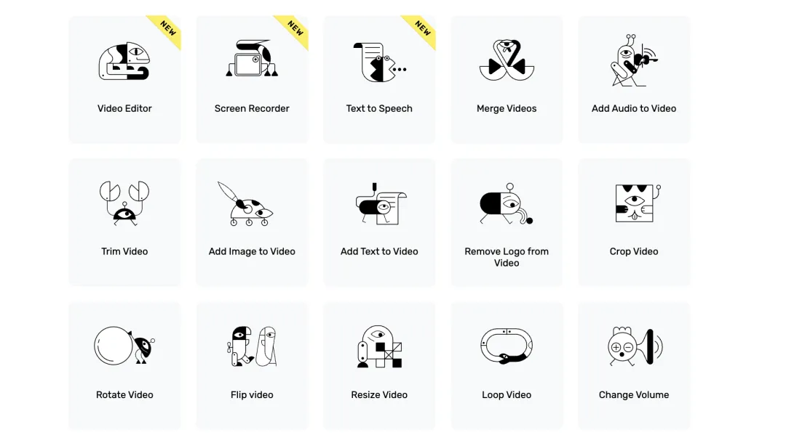

# 养网站防老：网站可以做成一生的事业

大家好，我是哥飞。

昨天给大家分享了《[做网站没灵感？来看看别人的优秀案例之前端工具站](https://mp.weixin.qq.com/s/SZ1rQLBuA8s2uVTGdHhMhA) 》，里边第2个案例如下：

> 2、脑力训练小游戏 humanbenchmark.com 这个网站提供了一系列的脑力小游戏给大家玩，月访问量190万，平均停留时间217秒。域名注册于2006年，archive 中能够查到第一版时间是2007年的2月6日。 我是哥飞，公众号：哥飞 [做网站没灵感？来看看别人的优秀案例之前端工具站](https://mp.weixin.qq.com/s/SZ1rQLBuA8s2uVTGdHhMhA)

即刻里有个评论说“07年的网站太牛了”，哥飞看到后，有感而发说“自己做的网站，努力推广，有了用户之后，就是一棵摇钱树，每年每月都会开花结果能赚钱。”

后来哥飞在社群里给大家分享一个国外团队做的网站矩阵，有了如下思考：

1、他这个矩阵里只做工具类网站，有很多域名，一个功能用一个域名来做站，随便找几个域名查一下，都有几百万月访问量；

2、其中两个域名又长还带横杠，一个390万月访问量，一个540万月访问量，从这可以看出来，其实域名长一点或者带横杠都没关系；

3、老带新，只要做出来了一个有一定流量的网站，就可以不断地做新网站，做矩阵。靠老网站给新网站增加外链和访问量，来提升新网站的权重和排名；

4、只要搜索引擎能够源源不断的带来新用户，总会有一部分用户记住网址或者把网址加入到书签栏或者保存到别的地方，能够二次访问，这样新用户就变成了老用户；

5、谷歌首页有10个位置，虽然有人已经占据了第一名，也不代表在这个需求我们不能做了。赢家通常不会通吃，我们在后几名也没关系，也能拿到一些流量；

6、做网站就像是种树一样，先种下第一棵树，再种下第二棵树，慢慢你就有了一个小果园，收成会越来越好；

7、尽量多种几种不同品种的果树，既可以使得一年四季都有水果吃，又可以防止“病虫害”导致同种果树死亡；

8、网站可以做成一生的事业，只要碳基生命还存在，就还会有网站的需求，我们就还能靠网站来赚钱；

9、养儿防老不如养网站防老。

其实之前哥飞也聊过这个话题《[2023年了，为什么还要做网站？为的是可控的流量，可控的用户，可控的收入。](https://mp.weixin.qq.com/s/cuWY9EkonDxMOT058dxNAg)》

今天有感而发，就再次跟大家聊聊。

最后给大家留一个课后作业，请根据下图，找出哥飞前面说的那个矩阵网站，如果你找出来了，请加哥飞微信 qiayue，哥飞会给你发一个随机金额小红包。

-   

    💎天天

    2024-08-22 18:55

    回复

    隐藏内容

    这个吧

-   

    龍嘨波

    2024-10-01 11:06

    回复

    [https://123apps.com/](https://123apps.com/) 找到了

-   

    殷小样

    2024-10-09 10:03

    回复

    隐藏内容

-   

    Liran413

    2024-10-29 20:39

    回复

    10s不到就 找到了。。。

-   

    NightWatch

    2025-07-30 21:18

    回复

    隐藏内容

-   

    tison

    2025-08-22 10:24

    回复

    找到了 

-   

    老荀

    2025-09-24 19:58

    回复

    打卡

-   

    小虾米游大海

    2025-12-03 09:30

    回复

    打卡

-   

    深圳的阳

    2025-12-15 19:57

    回复

    已阅

-   

    秋天 | AI探索者

    2026-01-21 10:33

    回复

    打卡

-   

    婉遙

    2026-02-02 09:07

    回复

    做工具站方式：

    1.  做矩阵，一个工具一个域名，只要跑出一个就可以带着其他工具站
    2.  矩阵工具方向可以多元化
    3.  域名长或者有横杠也不影响

    求助：如何找到网站呢？关键词搜索和问gpt都没找到

添加图片添加隐藏回复

Web.Cafe

153 results

Use arrow keys ↑↓ to navigate

The action has been successful
