# 养网站防老第 1 步，挖掘出第 1 个需求

大家好，我是哥飞。

前几天哥飞提出了一个新概念，养网站来防老《[养网站防老：网站可以做成一生的事业](https://mp.weixin.qq.com/s/URcdE3VaoYoAx0cOcll8_g)》，这篇文章很受大家欢迎，到现在已经一万八千阅读了。

可能是因为给大家打开了新思路，原来可以这样！居然可以这样！

这个时代对于会技术懂编程的人向来是有优待的，这就是我们的优势，那我们就要发挥这个优势。

我们之前在这篇文章聊了《[2023 年了，为什么还要做网站？为的是可控的流量，可控的用户，可控的收入](https://mp.weixin.qq.com/s/cuWY9EkonDxMOT058dxNAg)》，在前几天的养老文里也说了：

> 5、谷歌首页有 10 个位置，虽然有人已经占据了第一名，也不代表在这个需求我们不能做了。赢家通常不会通吃，我们在后几名也没关系，也能拿到一些流量； 6、做网站就像是种树一样，先种下第一棵树，再种下第二棵树，慢慢你就有了一个小果园，收成会越来越好； 我是哥飞，公众号：哥飞 [养网站防老：网站可以做成一生的事业](https://mp.weixin.qq.com/s/cuWY9EkonDxMOT058dxNAg)

那今天我们就来聊聊养网站防老第 1 步：挖掘出第 1 个需求。

挖掘需求之前哥飞已经讲过很多次了，可以用 Similarweb 和 Semrush 再配合 Google 。

大家可以看下面几篇文章复习一下：

《[人人都能学会的挖掘 web 产品需求之从出站域名发现新需求新产品](https://mp.weixin.qq.com/s/D77kXZ9_RCifP9iil6fGxQ)》

《[人人都能学会的发掘 web 产品需求方法入门](https://mp.weixin.qq.com/s/rzqgRubYO8Em3xuWRGufuw)》

《[利用 Semrush 找有一定搜索量且竞争小的关键词时容易遇到的一些陷阱](https://mp.weixin.qq.com/s/r0H48GssICrKbP8YePIuqw)》

《[保小图大：专门给给初学者的用小词图谋大词做站策略](https://mp.weixin.qq.com/s/LEfgrIDxWhZzD15T-F8o1A)》

《[再聊小词：不妨看看 CPC，有价值的小词也是值得做的](https://mp.weixin.qq.com/s/LB_9Xeaqhr2Ia9pstwETuQ)》

我们今天用《[【收藏】51 个挖掘需求时能用得上的财富密码关键词哥飞免费赠送给大家](https://mp.weixin.qq.com/s/pFi683ZoT_WJXO_t770vSQ)》提到的一些词实际给大家演示一下如何挖掘需求。

先把文章中提到的 51 个关键词拿过来，列出来。

| 关键词 | 说明 |
| --- | --- |
| Translator | 翻译器 |
| Generator | 生成器 |
| Example | 示例 |
| Convert | 转换 |
| Online | 在线 |
| Downloader | 下载器 |
| Maker | 制作器 |
| Creator | 创作者 |
| Editor | 编辑器 |
| Processor | 处理器 |
| Designer | 设计师 |
| Compiler | 编译器 |
| Analyzer | 分析器 |
| Evaluator | 评估器 |
| Sender | 发件人 |
| Receiver | 收件人 |
| Interpreter | 解释器 |
| Uploader | 上传者 |
| Calculator | 计算器 |
| Sample | 样本 |
| Template | 模板 |
| Format | 格式 |
| Builder | 构建器 |
| Scheme | 方案 |
| Pattern | 模式 |
| Checker | 检查器 |
| Detector | 检测器 |
| Scraper | 爬虫 |
| Manager | 管理器 |
| Explorer | 浏览器 |
| Dashboard | 仪表盘 |
| Planner | 计划器 |
| Tracker | 追踪器 |
| Recorder | 录制器 |
| Optimizer | 优化器 |
| Scheduler | 调度器 |
| Converter | 转换器 |
| Viewer | 查看器 |
| Extractor | 提取器 |
| Monitor | 监视器 |
| Notifier | 通知器 |
| Verifier | 验证器 |
| Simulator | 模拟器 |
| Assistant | 助手 |
| Constructor | 构建者 |
| Comparator | 比较器 |
| Navigator | 导航器 |
| Syncer | 同步器 |
| Connector | 连接器 |
| Cataloger | 目录制作人 |
| Responder | 响应器 |

我们以第一个 Translator 翻译器为例，说明如何使用。

我们打开 Semrush，输入 Translator 点击查询，可以看到这个词全球搜索量是 5000 万，其中印度 3000 万，波兰 610 万，德国 500 万。
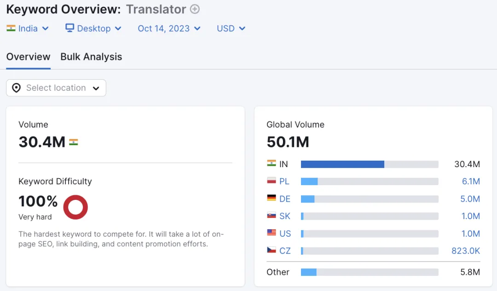
默认选中的是印度，有 3040 万搜索量，注意以下说的关键词相关信息都是印度的了。

再看关键词变种（keyword Variations），有 47 万个，总搜索量 1.5 亿。其中搜索量最大的几个是 translate 翻译 4550 万，translator 翻译器 3040 万。
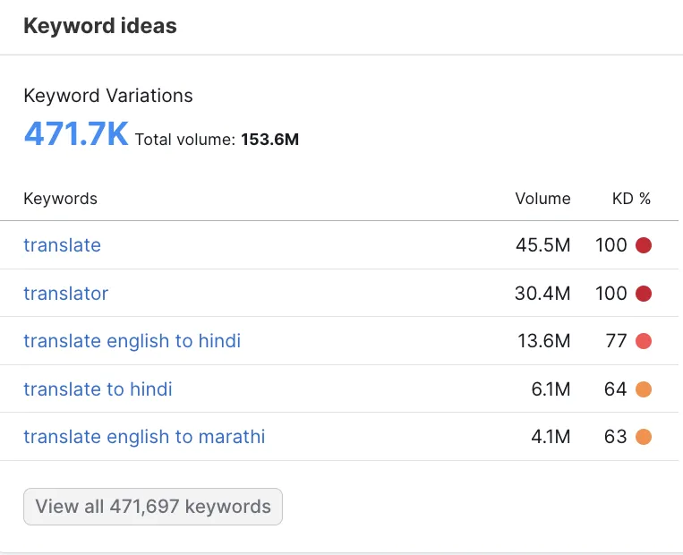
再看相关问题，有 1.9 万个问题，总搜索量 28 万。
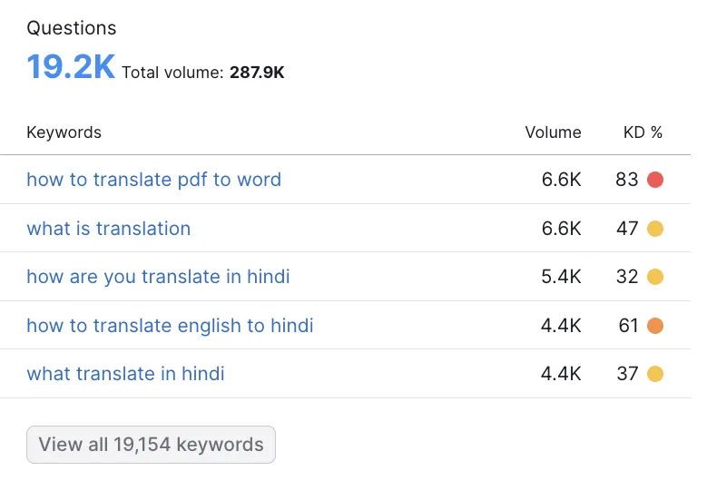
再看相关关键词有 3500 个，总搜索量是 1.2 亿。
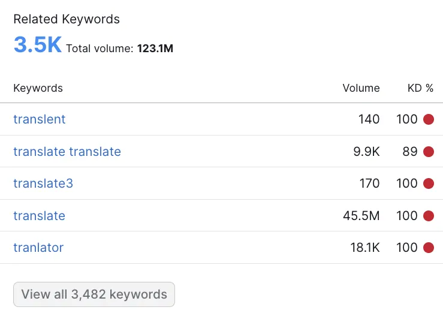
印度太穷了，我们先换个国家，改为德国，然后我们点击关键词变种 Keyword Variations ，打开新页面。分为左右两块，左侧是所有关键词的分组统计，右侧是所有关键词列表，按照搜索量从高到低排序。

我们设置筛选框中的 KD 值为 0 到 29，再设置 CPC>=0.1 美元，再按照搜索量从高到低排序，就得到了一批有一定搜索量且优化难度低且有一定价值的关键词。
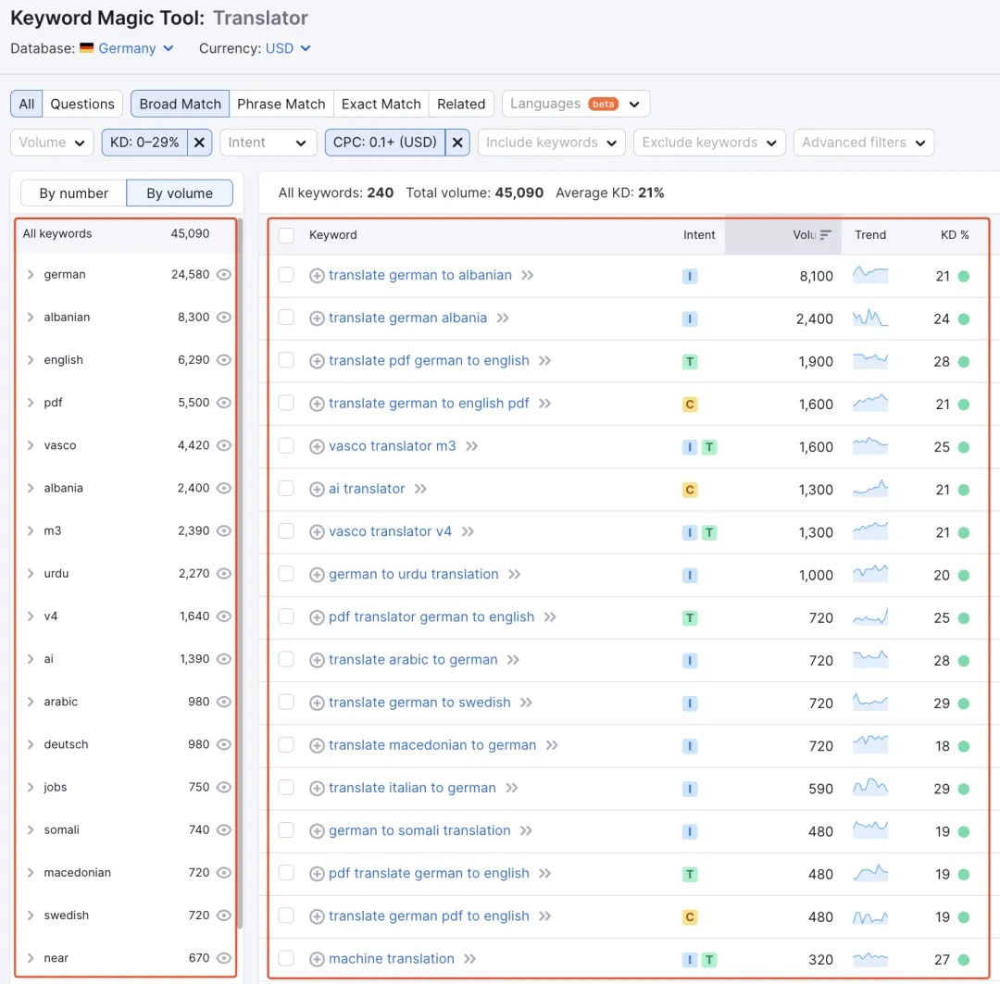
但是这样筛选出来的词，最大搜索量才 8100，还是太小了，我们尝试换一个词，改成 Generator 这个关键词，并且国家选择为美国后，得到了一些词。

搜索量最大的这个词不解释了，这个不能做，因为不好变现，连广告都没办法放，也没办法接入支付。
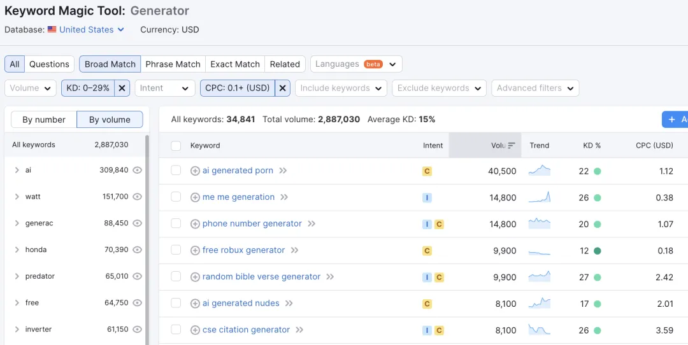
第二个关键词 me me generation 有点意思，美国有很强的 meme 文化氛围。这个词只有 26 的优化难度，并且搜索量也还行，有 14800，而且还很容易用 AI 去生成内容，这不就是我们要找的梦中情词嘛！
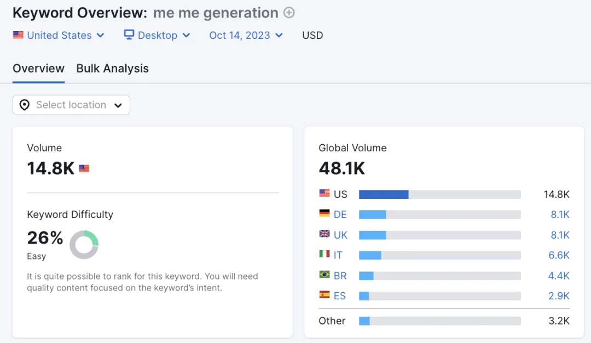
但是，别高兴太早。我们直接拿这个词去谷歌搜索一下，会发现排第一的是时代周刊 time.com 。如果只靠 SEO ，我们打不过的，不建议做这个词。
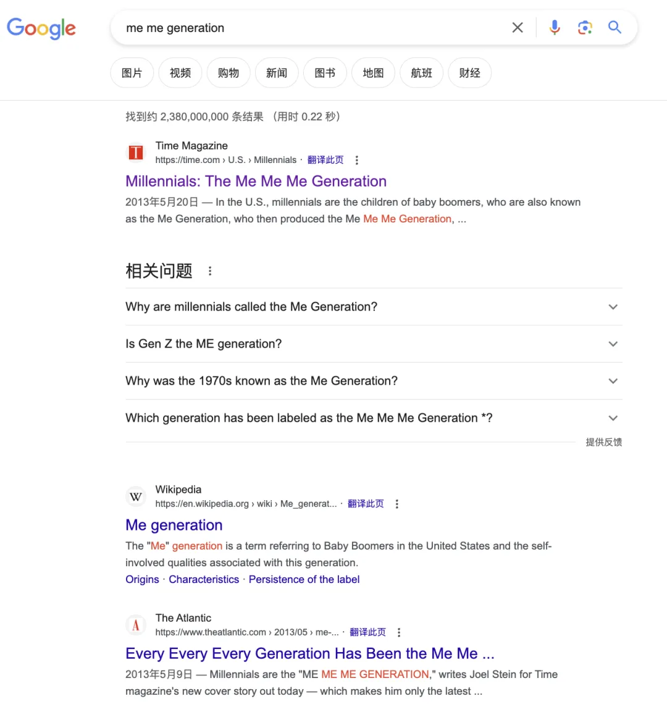
而且不知道大家发现没有，更常见的说法是 meme Generator ，这个词的竞争难度立马就飚升到了 93 了。
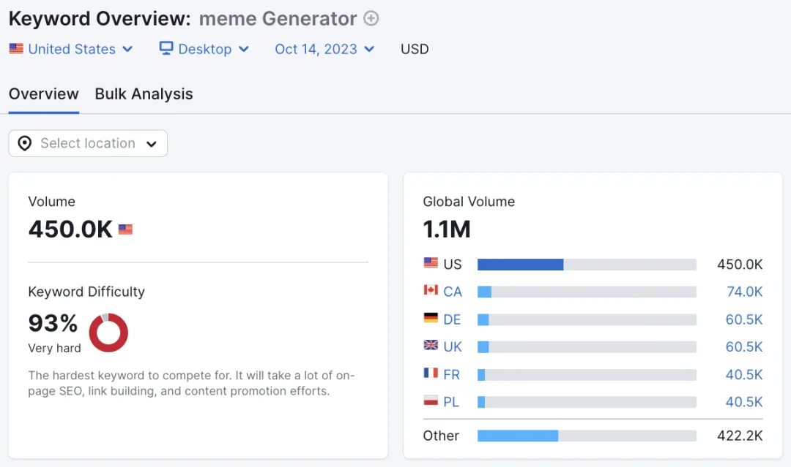
但是我们刚才说了，其实这个词特别适合用 AI 来生成内容，不管是生成文字还是图片，AI 都很在行。

而且之前我们在《[放眼世界，遍地是金矿，此时不做 AI，更待何时](https://mp.weixin.qq.com/s/De93EIfIJKzHD7N9vFVURQ)》、《[AI+强需求=新工具](https://mp.weixin.qq.com/s/mzQFx5Id_nGxcubyYakiYA)》都说过，现在我们做 AI 类工具，在宣传上可以得到事半功倍的效果，因为用户很愿意自发传播各种好用的或者好玩的 AI 工具。

所以从这个角度，AI MEME Generator 是可以去尝试做一做的。

实际上在 4 月份时，曾经火过一个 memecam ，也就是 MEME 相机，随便拍摄一张照片，AI 就会生成一段 MEME ，然后给你合成为一张图片。

不过也要看到，从下面的流量变化，可以看出来，这种功能太单一的产品，还是无法持久。
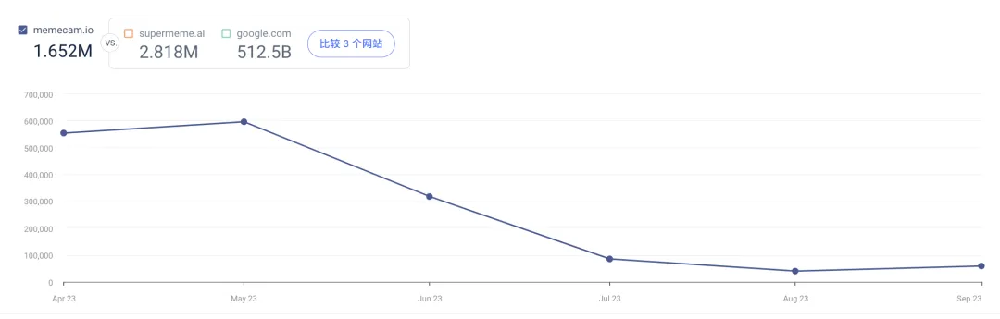
另一个 supermeme.ai 更好一些，目前每个月还有 28 万访问量，也就是每天九千左右。
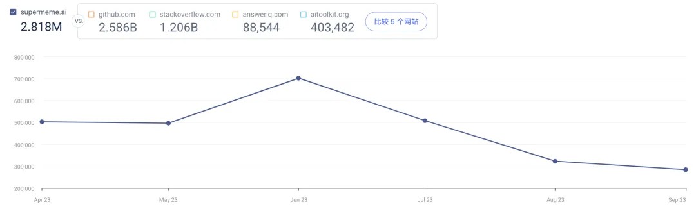
我们再继续看第二个词 phone number generator ，在美国有 14800 搜索量，而且 CPC 有 1.07 美元，有点值钱。
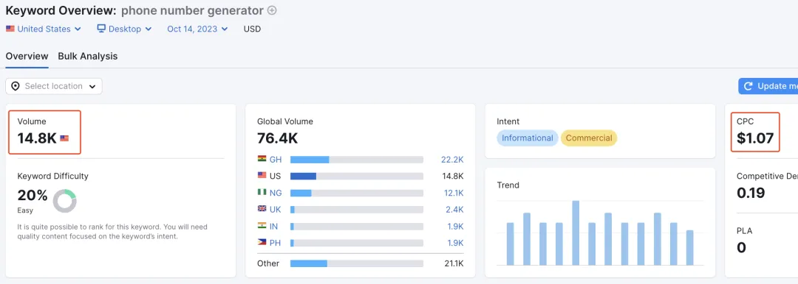
再看相关关键词变种，有 2600 个变种，总搜索量 62600，排名前 2 的是 phone number generator 和 random phone number generator 。
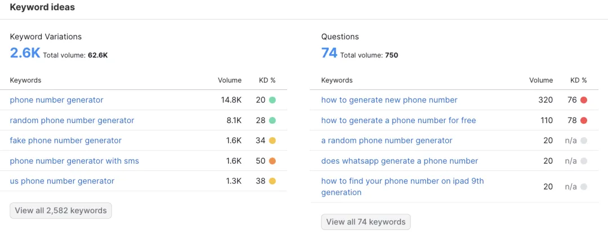
再看搜索结果，都是内页，看起来很容易优化上去。
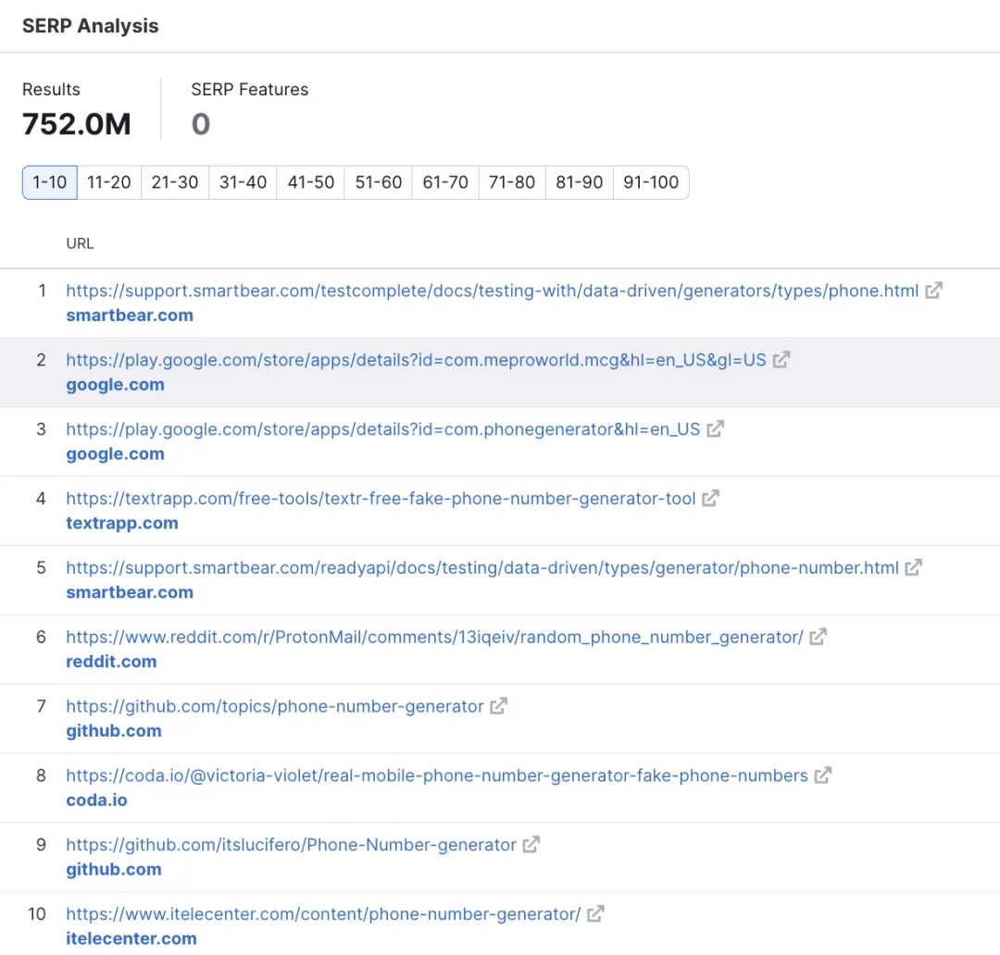
但是，为了防止这篇文章《[利用 Semrush 找有一定搜索量且竞争小的关键词时容易遇到的一些陷阱](https://mp.weixin.qq.com/s/r0H48GssICrKbP8YePIuqw)》讲到的陷阱，我们直接去谷歌搜索看看。
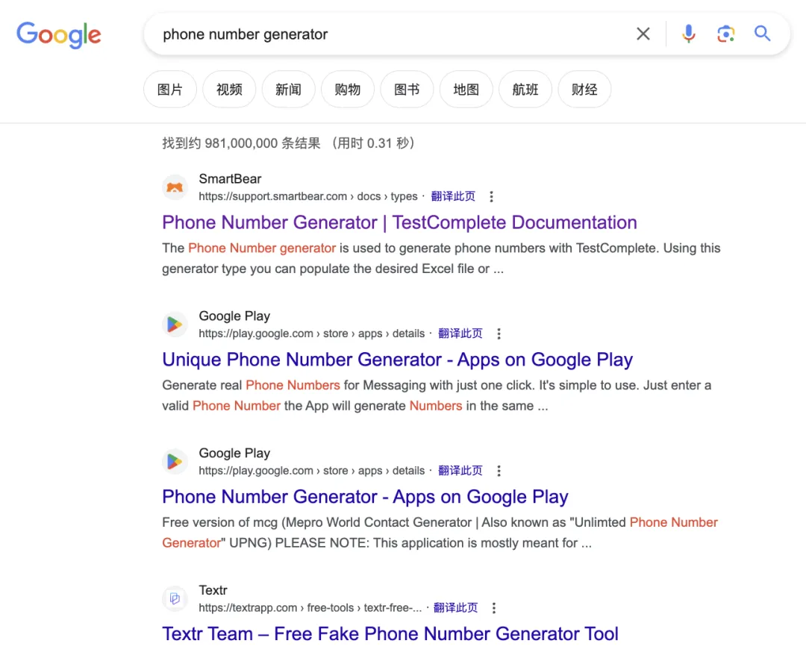
搜索结果没有陷阱，再看 Google Trends，搜索量趋势也是比较平稳的，不是季节性词汇。
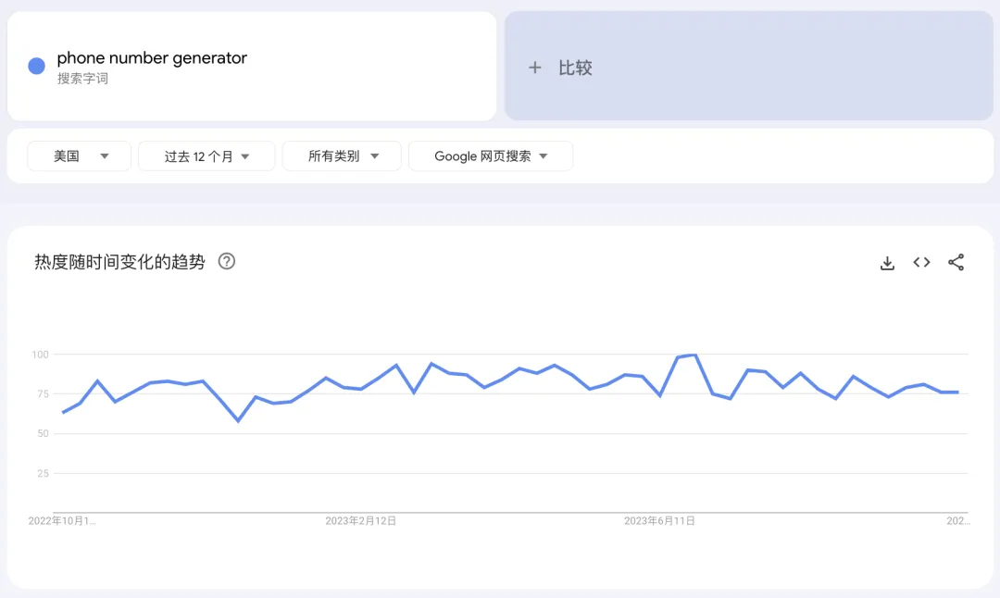
这就说明这个词可以做，而且也可以用 AI 去改造，如让用户用对话式提出需求，然后让 AI 去生成号码。

接下来大家可以继续按照哥飞教的这个方法，把所有 51 个关键词都分析一遍，一定会有收获的。

同时你也发现，这样一个一个查询比较费人工，那么你就可以尝试用自动化的操作去实现这些。

当你找到一个值得去做的关键词之后，就该去分析搜索意图，然后去做网页满足搜索用户了，这部分我们明天的文章再聊。

今天的文章就到这里了，跟大家说下，“哥飞的朋友们”社群已经快满 500 人了，目前一群还剩 61 个位置，哥飞已经开启了二群。

    老荀

    2025-09-24 20:02

    回复

    打卡

    班纳

    2025-10-10 08:23

    回复

    1

    秋天 | AI 探索者

    2026-01-21 14:43

    回复

    打卡

    辞安

    2026-07-18 23:10

    回复

    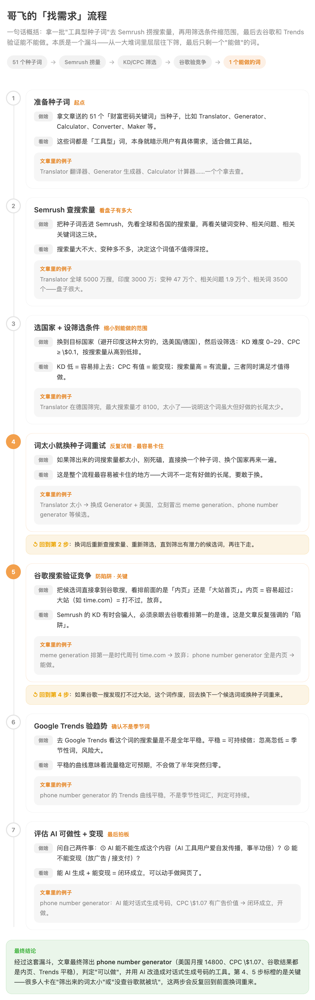

添加图片添加隐藏回复

