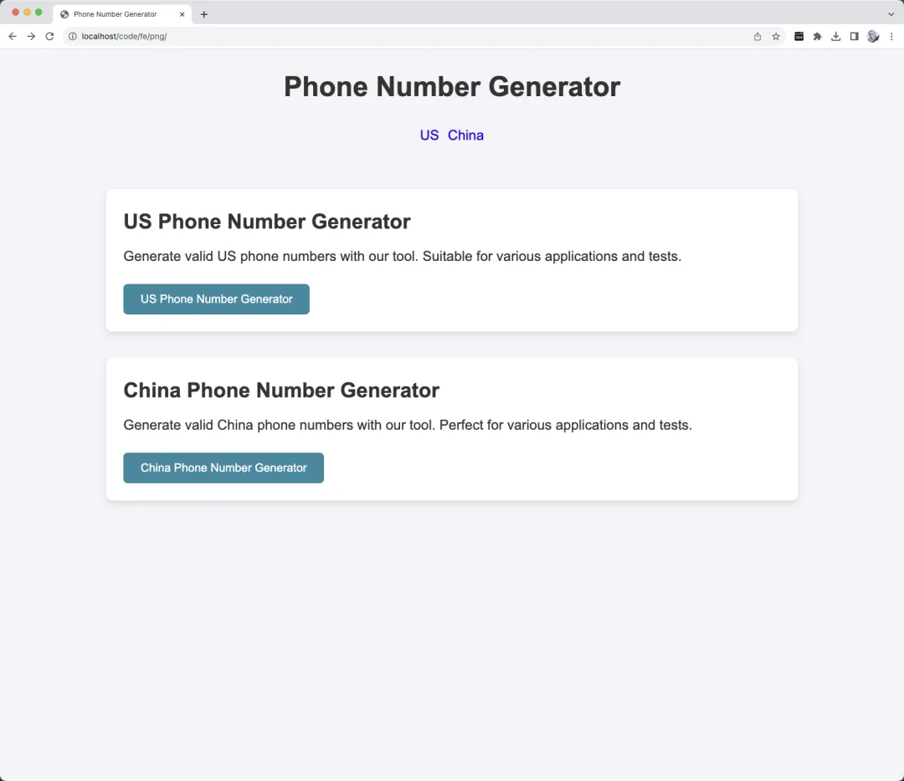
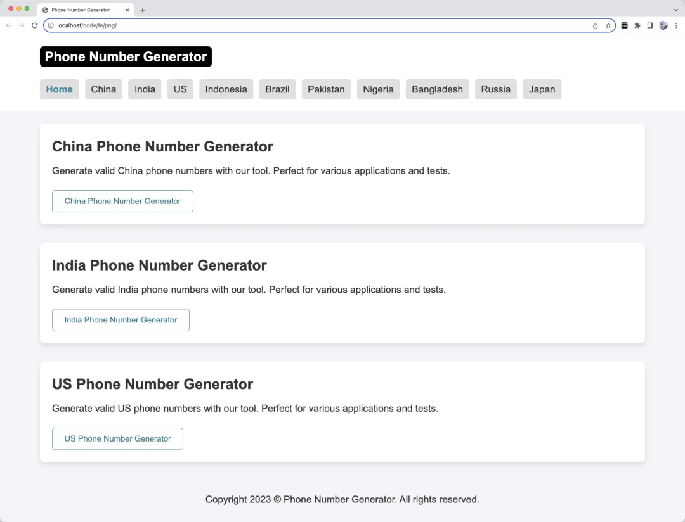
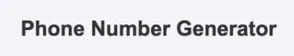
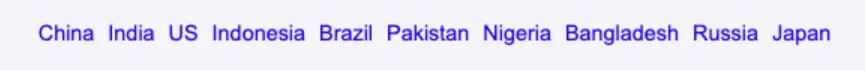
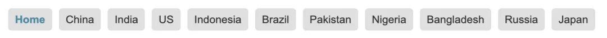
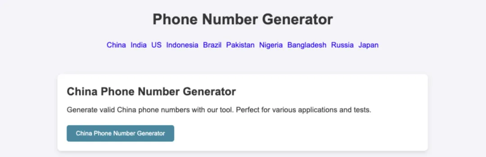
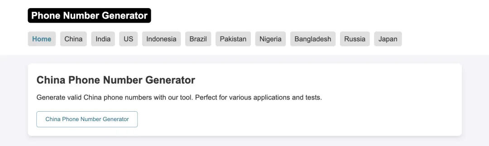
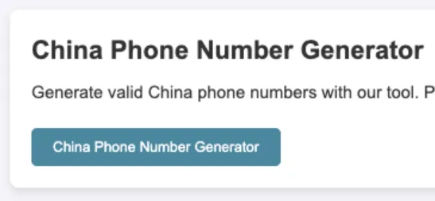
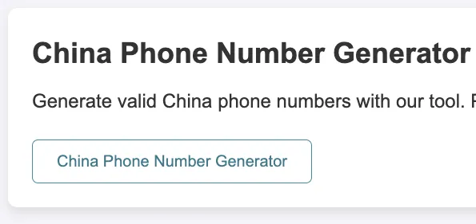
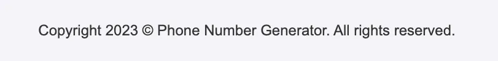

# 养网站防老第4步：手动调整布局和样式

大家好，我是哥飞。

网站养老系列哥飞已经更新了5篇了：

[养网站防老：网站可以做成一生的事业](https://mp.weixin.qq.com/s/URcdE3VaoYoAx0cOcll8_g)

[养网站防老第1步，挖掘出第1个需求](https://mp.weixin.qq.com/s/V35KGuSqMHhhgr4x1Bzw6Q)

[养网站防老第2步：分析搜索意图](https://mp.weixin.qq.com/s/0l-1EVPJWAJK6z9w8Bn-FQ)

[养网站防老第1.5步：用一个公式来判断关键词是否值得做，让你选择关键词不再犹豫](https://mp.weixin.qq.com/s/CJNigdIt8VkfQDangR8Bcg)

[养网站防老第3步：根据搜索意图使用ChatGPT的GPT4生成网页](https://mp.weixin.qq.com/s/Mg5utkp0iD_b0RGMbCvA4A)

今天我们紧接着第3步，在GPT4生成的网页上进行一些手动调整，让布局和样式更好看一点。

昨天的网页长这样：  调整后的网页长下面这样：  这里为了截图方便，正文国家列表只保留了三个，其它都暂时隐藏了 我们来一一看一下，改了哪些地方。

1、Logo

左右两边是 Logo 调整前后对比：

| 调整前 | 调整后 |
| --- | --- |
|  |  |

这里哥飞没有去设计图片Logo，直接用黑色背景加白色文字加圆角形式实现的文字Logo。 大多数时候我们快速上线一个网站时，都可以用这种方式做文字Logo。

首页 html 代码如下：

`<h1 class="logo">   <a href="./">Phone Number Generator</a> </h1>`

内页 html 代码如下：

`
   <a href="./">Phone Number Generator</a> </div`

可以看到首页和内页的区别就是首页logo这里哥飞用了h1，而内页直接用的 div 。这是因为内页的 h1 另有别的，所以logo这里不能放h1。

对应的 css 代码如下：

`.logo{     float: left;     font-size: 22px;     font-weight: bold;     font-style: normal;     height: 34px;     line-height: 34px;     background-color: black;     padding: 0 8px;     border-radius: 6px;     margin: 0; } .logo a{     color:white; }`

因为既有 h1 也有 div ，所以这里通过 font-style: normal; 去掉h1的默认字体样式。其它的都是常规css写法了，如果不会的话，可以先学习一下前端基础。

另外说明下，哥飞也不是专业前端，所以写法可能不专业，可能会有更好的写法，但是没关系，不用纠结技术细节，只要页面看起来能达到效果就行。

2、菜单栏

上下两个图是导航栏修改前后对比：

| 导航栏前后对比 |
| --- |
|  |
|  |
|  |

可以看到，增加了“Home”即首页的导航链接，另外还给每个导航链接增加了背景色和圆角。

html 代码如下：

`
     <a class="curr" href="./">Home</a>     <a href="china-phone-number-generator.html">China</a>     <a href="india-phone-number-generator.html">India</a>     <a href="us-phone-number-generator.html">US</a>     <a href="indonesia-phone-number-generator.html">Indonesia</a>     <a href="brazil-phone-number-generator.html">Brazil</a>     <a href="pakistan-phone-number-generator.html">Pakistan</a>     <a href="nigeria-phone-number-generator.html">Nigeria</a>     <a href="bangladesh-phone-number-generator.html">Bangladesh</a>     <a href="russia-phone-number-generator.html">Russia</a>     <a href="japan-phone-number-generator.html">Japan</a> 
`

对应的 css 代码如下：

`.country-list {     float: left;     width: 100%;     margin-top: 10px; } .country-list a {     display: block;     float: left;     height: 34px;     line-height: 34px;     margin-right: 10px;     margin-top: 10px;     padding: 0 10px;     background-color: #e0e0e0;     border-radius: 5px;     transition: background-color 0.3s;     color: #333; } .country-list a.curr{     color:#2c89a0;     font-weight: bold; } .country-list a:hover {     background-color: #d0d0d0; }`

增加了个 curr 类，用来标识当前页面。

3、页头

上下两图是修改前后页头对比：

| 前后页头对比 |
| --- |
|  |
|  |
|  |

页头整体背景改成了白色，并且让页头宽度等于网页宽度，还修改了logo和导航位置，不再居中布局，而是改为左对齐布局。

html 代码如下：

`<header>     <nav>         <h1 class="logo">             <a href="./">Phone Number Generator</a>         </h1>         
             <a class="curr" href="./">Home</a>             <a href="china-phone-number-generator.html">China</a>             <a href="india-phone-number-generator.html">India</a>             <a href="us-phone-number-generator.html">US</a>             <a href="indonesia-phone-number-generator.html">Indonesia</a>             <a href="brazil-phone-number-generator.html">Brazil</a>             <a href="pakistan-phone-number-generator.html">Pakistan</a>             <a href="nigeria-phone-number-generator.html">Nigeria</a>             <a href="bangladesh-phone-number-generator.html">Bangladesh</a>             <a href="russia-phone-number-generator.html">Russia</a>             <a href="japan-phone-number-generator.html">Japan</a>         
     </nav> </header>`

对应的 css 代码如下：

`body {     background-color: #f4f4f8;     color: #333;     line-height: 1.5;     padding: 0; } header {     width:100%;     margin-bottom: 20px;     padding: 20px 0;     text-align: center;     background-color: #fff;     overflow: hidden; } header nav{     width:100%;     max-width: 1000px;     margin: 0 auto; }`

其它 logo 和导航的 css 代码前文已经贴出来过，这里就不再贴出来了。

4、按钮样式

左右两图是修改前后对比：

| 修改前 | 修改后 |
| --- | --- |
|  |  |
|  |  |

默认按钮颜色不再用色块，而是改为了白色背景色，增加了按钮的边框颜色。

这样好处是，一眼望过去，不会整个页面都是蓝绿色按钮。

html 代码保持不变：

`<a href="china-phone-number-generator.html" title="Generate China Phone Number">     <button>China Phone Number Generator</button> </a>`

只修改了 css 代码：

`button {     color: #247a8c;     border: solid 1px #2c89a0;     background-color: #fff;     padding: 10px 20px;     border-radius: 5px;     cursor: pointer;     transition: background-color 0.3s; } button:hover {     background-color: #247a8c;     color: white; }`

5、footer

页脚增加了常规的版权文字：

`<footer>     Copyright 2023 &copy; <a href="./" style="color:#333;">Phone Number Generator</a>. All rights reserved. </footer>`

显示出来的效果如下： 

好了，首页的改动我们就说完了。

    袁锐钦

    2025-07-29 15:36

    回复

    ### 🔥 **养网站防老第4步笔记（零基础小白版）**

    **目标：不用学代码，5分钟改出更专业的网站布局！**

    #### 一、新手必改的5个核心位置（附抄作业代码）

    **👉 改Logo：文字Logo比图片更快上线**

    | 场景 | 首页代码（直接复制） | 内页代码（直接复制） |
    | --- | --- | --- |
    | **HTML** | `<h1 class="logo">手机号生成器</h1>` | `
手机号生成器
` |
    | **CSS** | `.logo{背景黑; 颜色白; padding:0 8px; 圆角6px;}` | 同上（内页去掉h1默认样式：`font-style:normal`） |
    | ✅ **效果**：黑底白字圆角，比默认文字更专业，适合快速上线。 |  |  |

    **👉 改导航栏：让用户和搜索引擎都看懂**

    `<!-- 导航栏代码（10国案例） -->   
     <a class="curr" href="/">首页</a> <!-- curr标当前页 -->     <a href="/中国">中国</a>     <a href="/美国">美国</a>     <!-- 其他国家... -->   
`

    🎨 **CSS抄作业**（直接加进style标签）：

    `.country-list a{     背景色:#e0e0e0; 圆角5px; 间距10px;     悬停变灰，当前页蓝色加粗（代码已包含）   }`

    ⚠️ **注意**：导航栏链接要和内页标题一致（如“中国”对应“中国手机号生成器”内页）。

    **👉 改页头：左对齐比居中更实用**

    1.  **删掉居中代码**：去掉原`text-align:center`
    2.  **固定宽度**：给`header nav`加`max-width:1000px; margin:0 auto;`
    3.  **效果**：Logo和导航左对齐，适配手机端不拥挤。

    **👉 改按钮：降低花哨感，突出功能**

    `/* 按钮样式（统一改） */   button{     边框1px蓝色; 背景白; 圆角5px;     悬停变蓝底白字（用户知道能点）   }`

    ✅ **对比**：原版色块按钮 vs 新版边框按钮，后者更显专业且不刺眼。

    **👉 加Footer：增加网站信任感**

    `<footer>     版权©2025 手机号生成器 | 备案号：XXX   </footer>`

    ✨ **技巧**：备案号后期补，先留位置；颜色用#333，别太显眼。

    #### 二、0代码偷懒方案：用工具替代手写（适合纯小白）

    | 工具 | 操作步骤 | 适合场景 |
    | --- | --- | --- |
    | **凡科建站** | 选“手机生成器”模板→拖拽替换文字和链接→自动适配多端 | 完全不想碰代码 |
    | **WordPress** | 装“Elementor”插件→可视化改导航/按钮→直接套用模板 | 想少量自定义但怕代码 |
    | **直接抄本文代码** | 复制HTML/CSS到GPT4→让它改成你的网站名和链接 | 想省工具费，愿复制粘贴 |

    ⚠️ **避坑**：别用复杂建站工具，初期能用代码改就用代码（更利于SEO）。

    #### 三、新手自查清单（做完必检查）

    ✅ 导航栏：首页标`curr`，每个国家链接正确
    ✅ Logo：首页用h1，内页用div（避免重复h1影响SEO）
    ✅ 按钮：悬停有变色，手机端点击区域够大（至少48x48px）
    ✅ 页头：宽度100%，内容不超出屏幕（手机预览测试）
    ✅ Footer：版权年更新为当前年，链接回首页

    #### 四、常见问题（小白必看）

    ❓ **Q：改了代码没效果？**
    A：检查代码拼写（如`class`写错），刷新浏览器按`Ctrl+F5`强制刷新。

    ❓ **Q：怕弄坏网站？**
    A：先用记事本保存原代码，改坏了直接替换回去；或用GPT4先模拟修改。

    ❓ **Q：需要学CSS吗？**
    A：初期不用！按本文抄代码，颜色/间距后期用浏览器F12微调（后续教程会教）。

    ### 📝 **一句话总结**

    布局修改核心：**让用户一眼看懂结构，让搜索引擎明白重点**。按本文抄代码，5分钟改出专业感，0基础也能避开“花里胡哨但不实用”的陷阱！ 🌟

    PAN潘

    2026-01-03 14:28

    回复

    同学啊，在这里见也能见到你的分享！666

    老荀

    2025-09-24 20:13

    回复

    打卡

    秋天 | AI探索者

    2026-01-21 15:54

    回复

    打卡

添加图片添加隐藏回复

