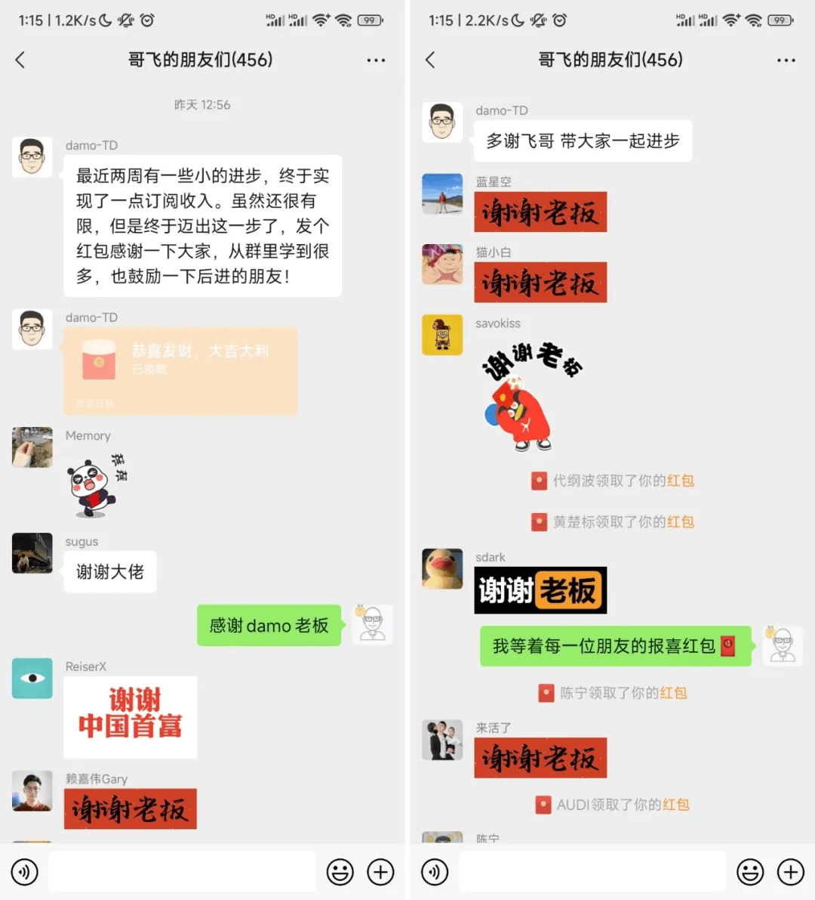
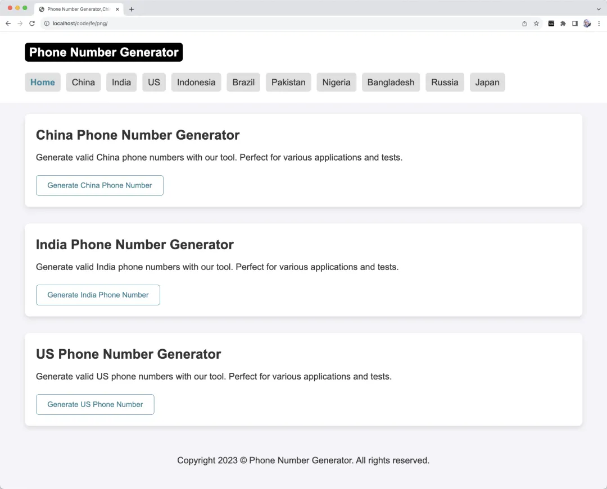
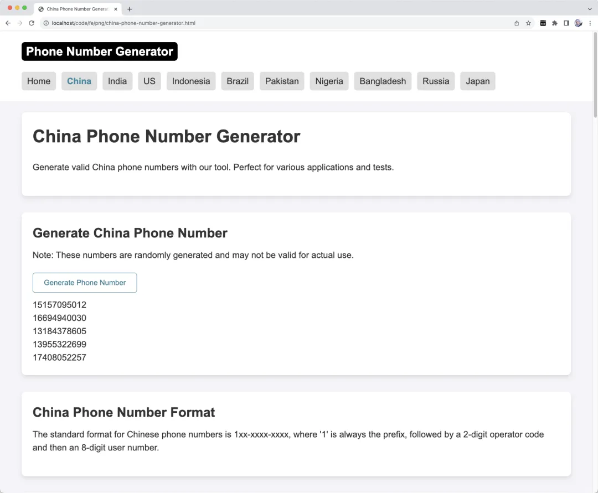
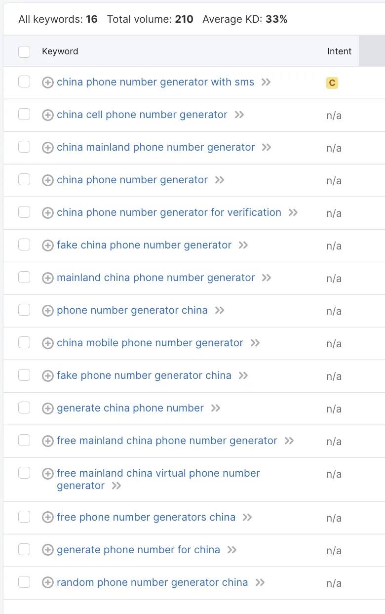
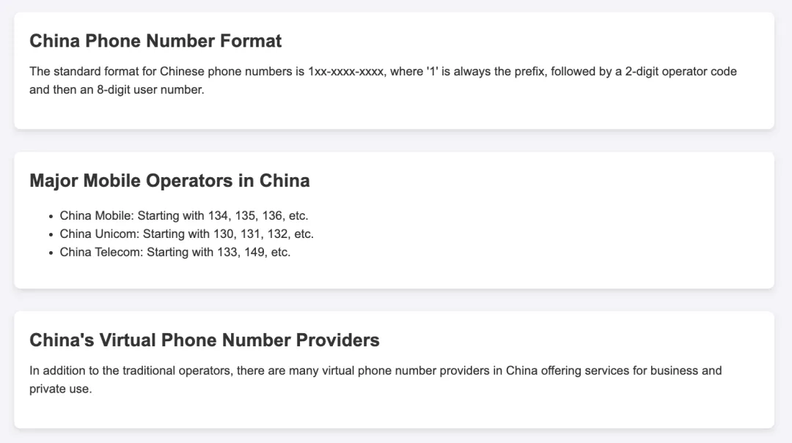

# 养网站防老第5步：内页和内链建设

大家好，我是哥飞。

昨天@damo 老板又来给大家报喜了，我们先恭喜他在订阅上走出了成绩。

网站养老系列，哥飞已经更新了6篇了：

[养网站防老：网站可以做成一生的事业](https://mp.weixin.qq.com/s/URcdE3VaoYoAx0cOcll8_g)

[养网站防老第1步，挖掘出第1个需求](https://mp.weixin.qq.com/s/V35KGuSqMHhhgr4x1Bzw6Q) [养网站防老第2步：分析搜索意图](https://mp.weixin.qq.com/s/0l-1EVPJWAJK6z9w8Bn-FQ)

[养网站防老第1.5步：用一个公式来判断关键词是否值得做，让你选择关键词不再犹豫](https://mp.weixin.qq.com/s/CJNigdIt8VkfQDangR8Bcg)

[养网站防老第3步：根据搜索意图使用ChatGPT的GPT4生成网页](https://mp.weixin.qq.com/s/Mg5utkp0iD_b0RGMbCvA4A) [养网站防老第4步：手动调整布局和样式](https://mp.weixin.qq.com/s/2T8u9QsGEKIv7c6ObSwYpw)

之前我们已经把首页做好了，今天我们来聊第5步，把内页也做好，同时教大家如何做内链建设。 一、首页小调整

在此之前，我们先把首页稍微修改一下。

1.1、标题和描述

标题和描述修改为：

`<title>Phone Number Generator,China,India,US,Indonesia,Brazil,Pakistan,Nigeria,Bangladesh,Russia,Japan</title> <meta name="description" content="Easily generate phone numbers for top countries like China,India,US,Indonesia,Brazil,Pakistan,Nigeria,Bangladesh,Russia,Japan.Phone Number Generator, Perfect for testing, verification, and various applications.">`

1.2、首页h1

首页h1的a标签增加title：

`<h1 class="logo">     <a href="./" title="Phone Number Generator">Phone Number Generator</a> </h1>`

1.3、导航栏

导航栏的a标签增加title：

`
     <a class="curr" href="./" title="Phone Number Generator">Home</a>     <a href="./china-phone-number-generator.html" title="China Phone Number Generator">China</a>     <a href="./india-phone-number-generator.html" title="India Phone Number Generator">India</a>     <!--此处限于篇幅只列出2个国家，实际页面要把所有10个国家都列出--> 
`

1.4、国家列表

每一个h2的a标签也增加title：

`<section>     <h2><a href="./china-phone-number-generator.html" title="China Phone Number Generator">China Phone Number Generator</a></h2>     
Generate valid China phone numbers with our tool. Perfect for various applications and tests.
     <a href="./china-phone-number-generator.html" title="Generate China Phone Number">         <button>Generate China Phone Number</button>     </a> </section>`

这样我们首页就给每个国家的内页都增加了2个链接，分别传递了“xxx Phone Number Generator”、“Generate xxx Phone Number”两个关键词的权重到对应的国家内页。

1.5、首页预览

调整完的首页长这样： 

二、内页

2.1、内页预览

以“China Phone Number Generator”为例，先给大家看下内页长这样：  2.2、标题和描述

先说标题和描述，先自己大概写一下：

`<title>China Phone Number Generator, Generate China Phone Number</title> <meta name="description" content="China Phone Number Generator, Generate China Phone Number">`

然后让GPT4生成符合SEO要求的且更自然的标题和描述：

`<title>China Phone Number Generator - Generate Authentic & Random Chinese Numbers</title> <meta name="description" content="Easily generate random Chinese phone numbers for testing, verification, and other purposes. Authentic format with comprehensive coverage across China.">`

2.3、内页h1

内页 h1 如下：

`<section>     <h1><a href="./china-phone-number-generator.html">China Phone Number Generator</a></h1>     
Generate valid China phone numbers with our tool. Perfect for various applications and tests.
 </section>`

这里我们直接用了首页的 section 样式，在 main 的第一个 section 中写 h1 和一些介绍。

2.4、生成电话号码功能

接着第二个 section 提供生成电话号码功能：

`<section>     <h2>Generate China Phone Number</h2>     
Note: These numbers are randomly generated and may not be valid for actual use.
     <button id="generateButton">Generate Phone Number</button>          

     

 </section>`

每点击一次按钮，就生成一个新的号码，并且不断添加到底部，也就是说可以生成一个号码列表，需要用 js 配合生成符合格式的号码：

``

这里为了用户体验，还可以增加一次生成10个号码、50个号码的按钮，限于篇幅今天我们不放相关代码出来，有需要直接找GPT生成就可以。

2.5、增加更多关于关键词的h2

在生成电话号码功能下方，我们让GPT基于我们提供的一些关键词，生成更多关于内页关键词的 seation ，每一个 section 都是一个 h2 。

我们先导出 Semrush 中跟当前内页关键词相关的更多关键词。 

然后提供关键词列表给GPT4，让AI生成指定格式的 section，部分生成后的代码如下：

`<section>     <h2>China Phone Number Format</h2>     
The standard format for Chinese phone numbers is 1xx-xxxx-xxxx, where '1' is always the prefix, followed by a 2-digit operator code and then an 8-digit user number.
 </section> <section>     <h2>Major Mobile Operators in China</h2>     <ul>         <li>China Mobile: Starting with 134, 135, 136, etc.</li>         <li>China Unicom: Starting with 130, 131, 132, etc.</li>         <li>China Telecom: Starting with 133, 149, etc.</li>     </ul> </section> <section>     <h2>China's Virtual Phone Number Providers</h2>     
In addition to the traditional operators, there are many virtual phone number providers in China offering services for business and private use.
 </section>`

对应页面效果如下：  2.6、生成更多内页

按照同样的方法，生成其它9个国家的内页，注意每个国家的电话号码格式都不一样，直接让GPT生成相关js代码就好。

我们举例说明的这个工具站页面结构更简单，只需要首页给每个内页增加内链，内页给首页给增加内链就行。

至此我们的代码网站代码就都写完了，目前的语言默认是英文，下一步我们还需要给网站增加多语言支持，这部分内容在明天的推文中介绍。

再下一步是注册域名，然后部署到Vercel，并且用 Cloudflare 包一层，既能加速又能保护源站。

再下一步是提交到谷歌Search Console后台，并且增加谷歌统计代码。

欢迎关注哥飞公众号，接收后续文章推送。

-   

    你好孙悟空

    2025-07-07 08:20

    回复

    导出 Semrush 中跟当前内页关键词相关的更多关键词，并且生成更多 section，其实本质上增加页面内容的丰富程度吧？

-   

    袁锐钦

    2025-07-29 15:34

    回复

    ### 🔥 **养网站防老第5步笔记（零基础小白版）**

    **目标：用最简单的步骤，做好内页和内链，让网站被搜索引擎喜欢，用户体验更好！**

    #### 一、准备工作：理解核心概念

    1.  **内页**：除了首页之外的页面（比如“中国手机号生成器”页面）。
    2.  **内链**：自己网站内部页面之间的链接（比如首页→内页，内页→内页）。
        ✨ **内链的作用**：
        -   帮搜索引擎找到更多页面（像路标，让蜘蛛顺着爬）。
        -   告诉搜索引擎哪些页面更重要（比如首页链接多的内页，权重更高）。
        -   让用户更容易找到相关内容（提升停留时间）。

    #### 二、第一步：调整首页，给内页“铺路”

    **操作场景**：假设我们的网站是“手机号生成器”，首页要链接到“中国、美国”等10个国家的内页。

    | 调整位置 | 具体操作（复制粘贴即可） | 为什么这么做？ |
    | --- | --- | --- |
    | **标题** | `<title>手机号生成器（中国/美国等10国）</title>` | 告诉搜索引擎首页核心关键词 |
    | **导航栏链接** | 每个国家按钮加`title`属性（例：`<a title="中国手机号生成器">中国</a>`） | 鼠标悬停显示提示，帮搜索引擎理解链接内容 |
    | **国家列表** | 每个国家区块加2个链接： `<h2>中国手机号生成器</h2>` `<button>生成中国号码</button>` | 传递“生成XX号码”关键词权重 |

    ⚠️ **小白注意**：导航栏和国家列表要包含所有10个国家，代码中的`<!-- -->`是注释，忽略即可。

    #### 三、第二步：制作内页（以“中国手机号”为例）

    **步骤1：写标题和描述（抄作业）**

    -   初稿（自己写）：`中国手机号生成器，生成中国号码`
    -   优化版（用GPT4）：`中国手机号生成器 - 生成真实随机中国号码`
        ✨ **技巧**：标题加“-”分隔，描述强调用途（测试、验证）。

    **步骤2：做生成功能（代码直接用）**

    `<button onclick="生成号码">点我生成</button>   

   `

    ⚠️ **小白注意**：不用懂代码，复制到内页HTML中即可，其他国家号码格式让GPT改（例：美国是+1开头）。

    **步骤3：丰富内容（用GPT偷懒）**

    -   导出Semrush关键词（如“中国手机号格式”“运营商”），让GPT生成：

        `<h2>中国手机号格式</h2>   
标准格式：1XX-XXXX-XXXX（1开头，第二位是运营商代码）
   <h2>中国三大运营商</h2>   <ul><li>移动：134-139</li><li>联通：130-132</li></ul>`

        ✨ **逻辑**：每个`h2`对应一个关键词，内容简短，段落清晰。

    #### 四、第三步：内链建设（新手必学3招）

    | 类型 | 操作示例 | 效果 |
    | --- | --- | --- |
    | **首页→内页** | 导航栏+国家列表各加1个链接（共2个） | 传递核心关键词权重 |
    | **内页→首页** | 内页底部加`返回首页`链接（锚文本“手机号生成器”） | 让搜索引擎知道内页属于首页分类 |
    | **内页→内页** | 中国页提到“美国号码”时，链接到美国内页（锚文本“美国手机号生成器”） | 形成内容网络，提升整体权重 |

    ⚠️ **禁忌**：

    -   一个页面内链不超过100个（太多搜索引擎会忽略）。
    -   锚文本要具体（不用“点击这里”，用“生成印度手机号”）。
    -   避免死链！发布前检查所有链接是否能打开。

    #### 五、下一步行动（超简单）

    1.  **复制粘贴**：按上述模板做10个国家的内页，改国号和号码格式（GPT帮忙）。
    2.  **多语言**：明天学如何用GPT加中文、西班牙语等（降低语言门槛）。
    3.  **部署网站**：注册域名→传代码到Vercel→用Cloudflare保护（后续教程会教）。

    ### 📝 **小白自查清单**

    ✅ 首页每个国家有2个内链（导航+按钮）
    ✅ 内页有生成功能+GPT写的关键词内容
    ✅ 内页底部有回首页的链接
    ✅ 所有链接`title`属性写清楚（鼠标悬停能看懂）
    ✅ 没用复杂代码，功能能正常点击

    **总结**：内页和内链就像“网站的小路”，让用户和搜索引擎都能轻松串门。按步骤抄作业，0基础也能做好！ 🌟

    （笔记整理：豆包，适合2025年新手，无需代码基础，重点在逻辑和复制操作）

-   

    老荀

    2025-09-24 20:24

    回复

    打卡

-   

    秋天 | AI探索者

    2026-01-21 16:50

    回复

    打卡

添加图片添加隐藏回复

