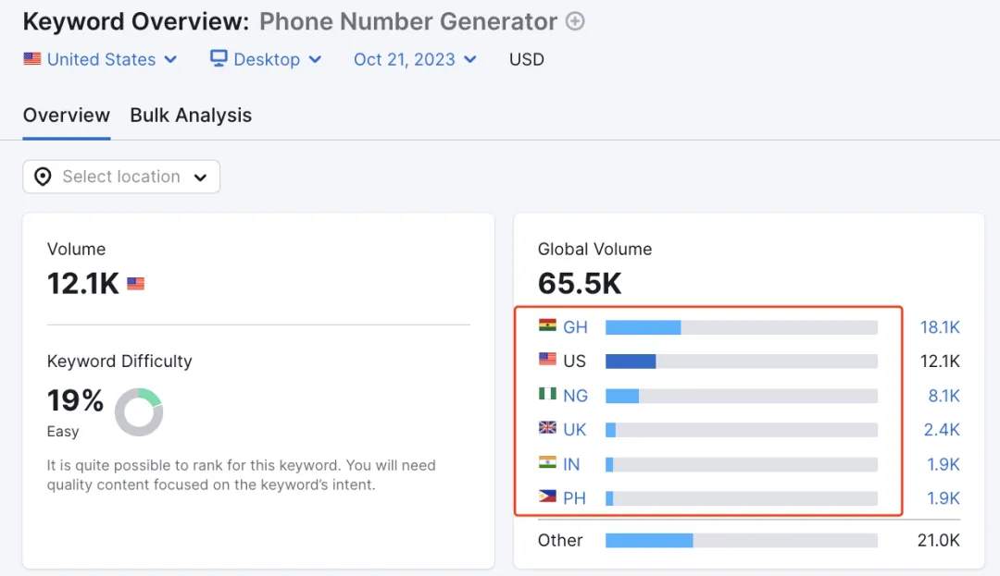
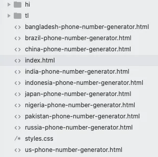
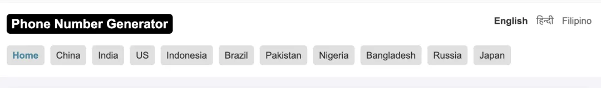
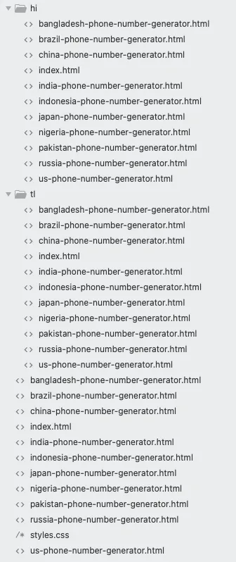
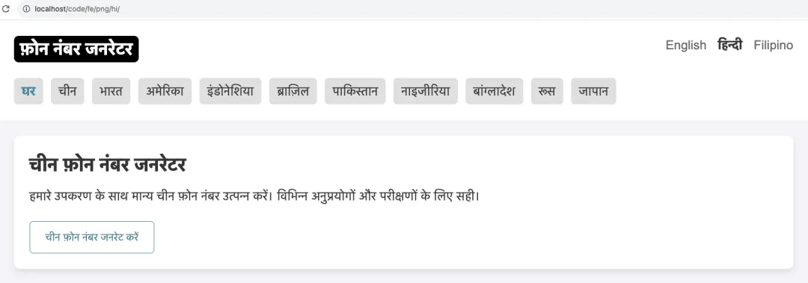

# 【6000字详解】养网站防老第6步：利用ChatGPT给网站增加多语言支持

大家好，我是哥飞。

网站养老系列，哥飞已经更新了7篇了：

[养网站防老：网站可以做成一生的事业](https://mp.weixin.qq.com/s/URcdE3VaoYoAx0cOcll8_g)

[养网站防老第1步，挖掘出第1个需求](https://mp.weixin.qq.com/s/V35KGuSqMHhhgr4x1Bzw6Q) [养网站防老第2步：分析搜索意图](https://mp.weixin.qq.com/s/0l-1EVPJWAJK6z9w8Bn-FQ)

[养网站防老第1.5步：用一个公式来判断关键词是否值得做，让你选择关键词不再犹豫](https://mp.weixin.qq.com/s/CJNigdIt8VkfQDangR8Bcg)

[养网站防老第3步：根据搜索意图使用ChatGPT的GPT4生成网页](https://mp.weixin.qq.com/s/Mg5utkp0iD_b0RGMbCvA4A)

[养网站防老第4步：手动调整布局和样式](https://mp.weixin.qq.com/s/2T8u9QsGEKIv7c6ObSwYpw)

[养网站防老第5步：内页和内链建设](https://mp.weixin.qq.com/s/X95UZmPEKHZZ4rNoBcaoJg)

在此前的步骤中，我们把首页和内页都做好了，但是只有英文一种语言，今天我们借助ChatGPT给网站增加多语言支持。

大家可能会发现，哥飞在一些步骤中推荐大家使用ChatGPT，这是因为这次网站养老系列教程，更主要的读者是初学者。

哥飞希望通过这个教程，让完全不懂海外网站开发，甚至有一点技术基础但是对于前端不太熟悉的同学，也能够顺利地跟着教程学会如何开发海外网站。

所以使用ChatGPT，不仅仅可以提高效率，还可以让初学者也能做出及格线以上水平的网站。

那么到底要做哪些语言呢？我们用数据说话，打开Semrush，查看这个关键词各个国家的搜索量。  排名前六的分别是：GH 、US 、NG 、UK、IN、PH，我们通过询问ChatGPT，可以得到这些国家信息和主要语言。

`GH、US、NG、UK、IN、PH 分别是哪些国家，说什么语言？`

GPT4的回答：

`这些是国家的缩写，以下是对应的国家及其主要官方语言： GH - 加纳 (Ghana) 语言：英语（官方）  US - 美国 (United States) 语言：英语（官方，但并没有在联邦层面明文规定）  NG - 尼日利亚 (Nigeria) 语言：英语（官方）  UK - 英国 (United Kingdom) 语言：英语（主要官方语言）  IN - 印度 (India) 语言：印度有多种官方语言。印地语和英语是中央政府的官方语言。  PH - 菲律宾 (Philippines) 语言：菲律宾语（或称塔加洛语）和英语都是官方语言。  这些国家中，英语在多数国家都有官方地位或被广泛使用。`

刚好挺巧的，这些国家都会说英语，也就是其实我们这个网站只需要有英文就足够了，但是我们今天为了给大家讲解如何给网站增加多语言支持，所以我们以印地语和菲律宾语为例来说明。

我们需要先问一下GPT4，印地语和菲律宾语一般缩写是什么。

`印地语和菲律宾语一般缩写是什么？ 我需要用这些缩写来创建子目录给网站增加多语言支持`

GPT4的回答：

`为了网站多语言支持，通常我们会采用语言代码作为子目录的命名。 以下是对应的ISO 639-1语言代码： 印地语 (Hindi)：HI 菲律宾语 (Filipino)：TL  （这个是基于它的另一个名字，塔加洛语 Tagalog） 所以，如果你要为网站增加这两种语言的支持， 你可以创建名为 "HI" 和 "TL" 的子目录。`

所以，我们需要在网站根目录，也就是 index.html 的同级，创建两个子目录，分别是“hi”和“tl”，创建好之后我们网站目前的目录结构如下： 

然后，我们需要在原先的页面中增加语言切换按钮，同样，先问GPT4:

`如果我要在网站增加语言切换按钮，英文我用 English ，那么 hi 和 tl 用什么名称？`

GPT4回答：

`在为网站添加语言切换按钮时，我们通常会使用该语言的自称来表示。 对于你提到的语言，可以这样表示：  英文 (English)：English 印地语 (Hindi)：हिन्दी 菲律宾语 (Filipino)：Filipino 或 Tagalog 所以，当用户看到 "हिन्दी"，他们就知道这是印地语的按钮； 看到 "Filipino" 或 "Tagalog"，他们就知道这是菲律宾语的按钮。 但是具体使用哪一个（Filipino 或 Tagalog）要取决于你的目标受众和他们更习惯的称呼。 如果目标是菲律宾国内用户，"Filipino" 可能更为合适。`

哥飞继续问：

`如果用 Filipino ，那么简称用 tl 合适吗？`

GPT4回答：

`"Filipino" 是基于"塔加洛语" (Tagalog) 的官方标准版本，用于菲律宾的官方事务和教育。 它们之间有很多共同之处，但"Filipino"被设计为更具包容性，包括了来自菲律宾其他方言和语言的词汇。 在ISO 639-1语言代码中，"TL" 是塔加洛语 (Tagalog) 的代码。 但在许多实际应用中，尤其是在网站的语言选择上，"TL" 也常常用于代表"Filipino"。 所以，如果你决定使用"Filipino"作为名称，使用"TL"作为简称或代码是完全合适的。`

所以我们语言名称用“Filipino”，简称用“tl”是完全没问题的。

在 logo 和 country-list 中间增加一个 language-list ：

`
     <a class="curr" href="./" title="English">English</a>     <a href="./hi/" title="हिन्दी">हिन्दी</a>     <a href="./tl/" title="Filipino">Filipino</a> 
`

对应的 css 如下：

`.language-list{     float: right; } .language-list a{     margin-left: 10px;     color: #666; } .language-list a.curr{     color: #333;     font-weight: bold; } .language-list a:hover{     color: #247a8c; }`

效果如下，没有过多美化，直接在右侧增加了三个语言的列表，当前语言加粗加黑： 

我们这个网站，默认是英语，所以给英语增加了“curr”类。

接着去修改 china-phone-number-generator.html 文件，依然是把语言切换放进去，跟首页有些小区别的是，因为用户当前在中国手机号页面，所以切换时也需要保持继续在这个页面，对应的代码如下：

`
     <a class="curr" href="./china-phone-number-generator.html" title="English">English</a>     <a href="./hi/china-phone-number-generator.html" title="हिन्दी">हिन्दी</a>     <a href="./tl/china-phone-number-generator.html" title="Filipino">Filipino</a> 
`

其它页面按照同样的方法处理。

接着，我们把所有处理好的 .html 文件复制，然后分别粘贴到 /hi/ 和 /tl/ 目录，做完之后，我们网站目前的目录结构如下： 

注意，styles.css 是不用复制的，因为这是公共通用文件。

但是子目录内的链接就需要调整一下了。

以下我们都以 /hi/ 目录的文件为例，tl目录方法类似。

修改 /hi/ 所有文件的第二行：

`从下面这样： <html lang="en"> 修改为下面这样： <html lang="hi">`

修改 /hi/ 所有文件的 styles.css 引用路径，指向到上一层目录下的styles.css：

`从下面这样： <link rel="stylesheet" href="styles.css"> 修改为下面这样： <link rel="stylesheet" href="../styles.css">`

修改 /hi/ 首页位置，也就是印地语的首页指向 /hi/ 目录 ：

`从下面这样： <a href="./" title="Phone Number Generator">Phone Number Generator</a> 修改为下面这样： <a href="../hi/" title="Phone Number Generator">Phone Number Generator</a>`

修改 /hi/ 首页语言列表对应的链接，首页对应代码如下：

`
     <a href="../" title="English">English</a>     <a class="curr" href="./" title="हिन्दी">हिन्दी</a>     <a href="../tl/" title="Filipino">Filipino</a> 
`

看出区别了吗？因为我们目前在 /hi/ 的 index.html 页面，所以curr要放在第二个。如果要切换到英语，需要回到上一层级，所以用了“../”来回到上一层。同理，要切换到菲律宾语，也需要回到上一层级，然后再进入 /tl/ 目录，所以用“../tl/”。

再看 /hi/china-phone-number-generator.html 文件，语言列表这里就需要改为如下代码：

`
     <a href="../china-phone-number-generator.html" title="English">English</a>     <a class="curr" href="./china-phone-number-generator.html" title="हिन्दी">हिन्दी</a>     <a href="../tl/china-phone-number-generator.html" title="Filipino">Filipino</a> 
`

请注意观察，跟英语对应的同名文件，这里写法上的区别。

有没有发现，这里写起来还是挺繁琐的？这是因为我们目前这个网站采用的是纯静态文件的形式制作。如果用上动态生成页面技术，就不用这么麻烦了。

但是对于初学者来讲，如果通过这个有些麻烦的方法，能够学会并理解，也是值得的。

并且对于初学者，如果不懂后端开发的话，麻烦就麻烦，先手工方式做好第一个网站再说，从第二个网站开始，再来想办法提升效率。

接下来，回到 /hi/index.html 文件，我们目前网页上的文字还是英语呢，需要让 GPT4 帮忙翻译为印地语。

`请把下面翻译为印地语： <title>Phone Number Generator,China,India,US,Indonesia,Brazil,Pakistan,Nigeria,Bangladesh,Russia,Japan</title> <meta name="description" content="Easily generate phone numbers for top countries like China,India,US,Indonesia,Brazil,Pakistan,Nigeria,Bangladesh,Russia,Japan.Phone Number Generator, Perfect for testing, verification, and various applications.">`

翻译结果为：

`<title>फ़ोन नंबर जनरेटर, चीन, भारत, अमेरिका, इंडोनेशिया, ब्राज़िल, पाकिस्तान, नाइजीरिया, बांग्लादेश, रूस, जापान</title> <meta name="description" content="चीन, भारत, अमेरिका, इंडोनेशिया, ब्राज़िल, पाकिस्तान, नाइजीरिया, बांग्लादेश, रूस, जापान जैसे प्रमुख देशों के लिए फ़ोन नंबर आसानी से जनरेट करें। फ़ोन नंबर जनरेटर, परीक्षण, सत्यापन, और विभिन्न अनुप्रयोगों के लिए सही।">`

为了确认翻译质量，我们可以新开一个窗口让GPT4把印地语再翻译为英语：

`请把下面的印地语翻译为英语： फ़ोन नंबर जनरेटर, चीन, भारत, अमेरिका, इंडोनेशिया, ब्राज़िल, पाकिस्तान, नाइजीरिया, बांग्लादेश, रूस, जापान`

翻译结果看起来没问题，也就说明印地语没多大问题：

`Phone number generator, China, India, America, Indonesia, Brazil, Pakistan, Nigeria, Bangladesh, Russia, Japan`

接着翻译导航栏：

`请把下方html代码中的 title 和标签内英语翻译为印地语：  
     <a class="curr" href="./" title="Phone Number Generator">Home</a>     <a href="./china-phone-number-generator.html" title="China Phone Number Generator">China</a>     <a href="./india-phone-number-generator.html" title="India Phone Number Generator">India</a>     <a href="./us-phone-number-generator.html" title="US Phone Number Generator">US</a>     <a href="./indonesia-phone-number-generator.html" title="Indonesia Phone Number Generator">Indonesia</a>     <a href="./brazil-phone-number-generator.html" title="Brazil Phone Number Generator">Brazil</a>     <a href="./pakistan-phone-number-generator.html" title="Pakistan Phone Number Generator">Pakistan</a>     <a href="./nigeria-phone-number-generator.html" title="Nigeria Phone Number Generator">Nigeria</a>     <a href="./bangladesh-phone-number-generator.html" title="Bangladesh Phone Number Generator">Bangladesh</a>     <a href="./russia-phone-number-generator.html" title="Russia Phone Number Generator">Russia</a>     <a href="./japan-phone-number-generator.html" title="Japan Phone Number Generator">Japan</a> 
`

翻译结果如下：

`
     <a class="curr" href="./" title="फ़ोन नंबर जनरेटर">घर</a>     <a href="./china-phone-number-generator.html" title="चीन फ़ोन नंबर जनरेटर">चीन</a>     <a href="./india-phone-number-generator.html" title="भारत फ़ोन नंबर जनरेटर">भारत</a>     <a href="./us-phone-number-generator.html" title="अमेरिका फ़ोन नंबर जनरेटर">अमेरिका</a>     <a href="./indonesia-phone-number-generator.html" title="इंडोनेशिया फ़ोन नंबर जनरेटर">इंडोनेशिया</a>     <a href="./brazil-phone-number-generator.html" title="ब्राज़िल फ़ोन नंबर जनरेटर">ब्राज़िल</a>     <a href="./pakistan-phone-number-generator.html" title="पाकिस्तान फ़ोन नंबर जनरेटर">पाकिस्तान</a>     <a href="./nigeria-phone-number-generator.html" title="नाइजीरिया फ़ोन नंबर जनरेटर">नाइजीरिया</a>     <a href="./bangladesh-phone-number-generator.html" title="बांग्लादेश फ़ोन नंबर जनरेटर">बांग्लादेश</a>     <a href="./russia-phone-number-generator.html" title="रूस फ़ोन नंबर जनरेटर">रूस</a>     <a href="./japan-phone-number-generator.html" title="जापान फ़ोन नंबर जनरेटर">जापान</a> 
`

再接着翻译首页的section，以第一个 china 为例：

`以下html代码，除了 url 不翻译，其它该翻译的地方都翻译为印地语： <section>     <h2><a href="./china-phone-number-generator.html" title="China Phone Number Generator">China Phone Number Generator</a></h2>     
Generate valid China phone numbers with our tool. Perfect for various applications and tests.
     <a href="./china-phone-number-generator.html" title="Generate China Phone Number">         <button>Generate China Phone Number</button>     </a> </section>`

翻译结果如下：

`<section>     <h2><a href="./china-phone-number-generator.html" title="चीन फ़ोन नंबर जनरेटर">चीन फ़ोन नंबर जनरेटर</a></h2>     
हमारे उपकरण के साथ मान्य चीन फ़ोन नंबर उत्पन्न करें। विभिन्न अनुप्रयोगों और परीक्षणों के लिए सही।
     <a href="./china-phone-number-generator.html" title="चीन फ़ोन नंबर जनरेट करें">         <button>चीन फ़ोन नंबर जनरेट करें</button>     </a> </section>`

全部翻译完成后的印地语首页效果如下：  大家按照上面的方法继续把剩下所有页面都翻译好，那么我们的多语言支持就做好了。

注意，本来这些页面都需要再做移动端适配的，我们暂时不做处理，先继续往下走。

明天哥飞带着大家进行下一步，注册域名，然后部署到Vercel，并且用 Cloudflare 包一层。

到时候，网站就可以对外访问了，然后就可以提交到谷歌Search Console后台，并且增加谷歌统计代码。

    你好孙悟空

    2025-07-07 12:04

    回复

    新网址站点是不是不推荐多语言？那么到多久以后再加这种呢？

    袁锐钦

    2025-07-29 15:42

    回复

    ### 🔥 **养网站防老第6步笔记（零基础小白版）**

    **目标：不用懂外语，3步给网站加多语言，让更多国家用户看懂！**

    #### 一、先搞懂：为什么要加多语言？

    -   👉 **用户更多**：比如印度用户看不懂英文，换成印地语后，他们能轻松使用你的网站。
    -   👉 **搜索引擎喜欢**：多语言页面更容易被对应国家的谷歌收录，增加流量。
    -   👉 **新手友好**：全程用ChatGPT翻译，不用自己学外语，复制粘贴就行！

    #### 二、3步搞定多语言（超简单，跟着做就行）

    ##### **第1步：选语言——用数据决定加哪几种**

    不用瞎猜！按下面步骤选：

    1.  打开Semrush（类似“网站流量分析工具”），查你网站关键词在哪些国家搜索多（比如原文中“手机号生成器”在加纳、美国、印度等国搜索多）。
    2.  查这些国家说什么语言（直接问ChatGPT：“GH、US、IN是哪些国家？说什么语言？”）。
        ✅ 例子：印度（IN）主要说印地语，菲律宾（PH）说菲律宾语，所以我们先加这两种。

    ##### **第2步：建文件夹——给每种语言找个“家”**

    就像给不同语言的内容建不同的文件夹，方便管理：

    | 语言 | 文件夹名（固定缩写） | 存放位置 |
    | --- | --- | --- |
    | 印地语 | `hi` | 和首页文件（index.html）放同一级 |
    | 菲律宾语 | `tl` | 同上 |

    📌 **操作：**
    在电脑上找到存放网站文件的文件夹（比如“我的网站”），里面新建两个文件夹，分别命名为`hi`和`tl`。

    ##### **第3步：加语言切换按钮——让用户能换语言**

    就像手机切换语言的按钮，放在网站顶部，用户一点就能换：

    **👉 按钮代码（直接复制，改改文字就行）**

    `<!-- 语言切换按钮（放网站顶部，logo旁边） -->   
     <a class="curr" href="./" title="英语">English</a> <!-- 当前语言加粗 -->     <a href="./hi/" title="印地语">हिन्दी</a> <!-- 印地语按钮 -->     <a href="./tl/" title="菲律宾语">Filipino</a> <!-- 菲律宾语按钮 -->   
`

    **👉 按钮样式（复制到CSS里，按钮更好看）**

    `.language-list{     float: right; /* 按钮放右边 */   }   .language-list a{     margin-left: 10px; /* 按钮之间留空隙 */     color: #666; /* 文字颜色 */   }   .language-list a.curr{ /* 当前语言加粗 */     font-weight: bold;     color: #333;   }`

    ⚠️ **注意：** 内页（比如“中国手机号生成器”页面）的按钮链接要改，确保切换语言后还在当前页面，例子：

    `<!-- 内页的语言按钮（以印地语为例） -->   <a href="./hi/china-phone-number-generator.html" title="印地语">हिन्दी</a>`

    ##### **第4步：复制文件+改链接——让每个语言页面能打开**

    1.  **复制文件**：把所有英文页面（比如index.html、china-phone-number-generator.html）复制到`hi`和`tl`文件夹里。
    2.  **改链接**：因为文件放在子文件夹里，链接要“退一级”才能找到原来的文件（就像从“卧室”到“客厅”要先出门）：
        -   用`../`表示“上一级文件夹”（比如`hi`文件夹里的文件想链接到首页，就用`../index.html`）。
        -   例子：印地语首页（`hi/index.html`）的语言按钮链接：

            `<a href="../" title="英语">English</a> <!-- 回到上一级的英文首页 -->   <a class="curr" href="./" title="印地语">हिन्दी</a> <!-- 当前在印地语首页 -->`

    ##### **第5步：翻译内容——ChatGPT帮你搞定，不用学外语**

    1.  **翻译模板（直接问GPT）**：
        -   “请把下面的文字翻译成印地语，链接和代码不动：\[粘贴你要翻译的内容，比如标题、按钮文字\]”
        -   例子：翻译“Generate China Phone Number”，GPT会返回“चीन फ़ोन नंबर जनरेट करें”。
    2.  **检查翻译**：让GPT再把翻译好的文字译回英文，看看是否和原文意思一致（避免翻错）。
    3.  **替换文字**：把翻译好的内容复制到`hi`或`tl`文件夹的对应页面里，替换原来的英文。

    #### 三、小白避坑指南

    1.  **别贪多**：先加2-3种主要语言，太多了容易乱。
    2.  **链接别错**：改完链接后，一定要点一点试试，打不开就是路径错了（多检查`../`用对没）。
    3.  **新网站可以晚点加**：如果网站刚上线，先做好1种语言，有流量后再加多语言，避免一开始工作量太大。

    #### 四、自查清单（做完打勾）

    ✅ 建了`hi`和`tl`文件夹
    ✅ 加了语言切换按钮，能正常切换
    ✅ 英文页面复制到了子文件夹
    ✅ 链接改对了，所有页面能打开
    ✅ 用GPT翻译了内容，替换完成

    **总结**：多语言就是给不同国家的用户“换说明书”，跟着步骤复制粘贴，小白也能搞定！下一步就是把网站上线，让全世界都能访问～ 🌟

    老荀

    2025-09-24 20:28

    回复

    打卡

    秋天 | AI探索者

    2026-01-21 17:01

    回复

    打卡

添加图片添加隐藏回复

