# 养网站防老第 8 步：添加统计代码，提交到 Google Search Console，增加外链，等待被收录

大家好，我是哥飞。

昨天的文章我们已经把网站上线了，今天说一下上线之后我们要做的操作。

照旧，先来列出养网站防老系列的所有文章：

[养网站防老：网站可以做成一生的事业](https://mp.weixin.qq.com/s/URcdE3VaoYoAx0cOcll8_g)

[养网站防老第 1 步，挖掘出第 1 个需求](https://mp.weixin.qq.com/s/V35KGuSqMHhhgr4x1Bzw6Q) [养网站防老第 2 步：分析搜索意图](https://mp.weixin.qq.com/s/0l-1EVPJWAJK6z9w8Bn-FQ)

[养网站防老第 1.5 步：用一个公式来判断关键词是否值得做，让你选择关键词不再犹豫](https://mp.weixin.qq.com/s/CJNigdIt8VkfQDangR8Bcg)

[养网站防老第 3 步：根据搜索意图使用 ChatGPT 的 GPT4 生成网页](https://mp.weixin.qq.com/s/Mg5utkp0iD_b0RGMbCvA4A)

[养网站防老第 4 步：手动调整布局和样式](https://mp.weixin.qq.com/s/2T8u9QsGEKIv7c6ObSwYpw)

[养网站防老第 5 步：内页和内链建设](https://mp.weixin.qq.com/s/X95UZmPEKHZZ4rNoBcaoJg)

[【6000 字详解】养网站防老第 6 步：利用 ChatGPT 给网站增加多语言支持](https://mp.weixin.qq.com/s/b3_lY793bgiVcuZ2TREF2w)

[养网站防老第 7 步：注册域名，解析域名，部署上线](https://mp.weixin.qq.com/s/B-boMGJsI3bxB8Ih10duRw)

今天我们聊第 8 步，主要分为三个小步骤：

1.  添加统计代码；
2.  提交到 Google Search Console；
3.  增加外链，等待被收录。

一、添加统计代码

我们网站主要面向海外用户，因为添加 Google Analytics 代码即可。

打开谷歌分析网站 [https://analytics.google.com/](https://analytics.google.com/) ，点击左下角的齿轮⚙️图标，打开管理页面，点击“创建媒体资源”按钮。

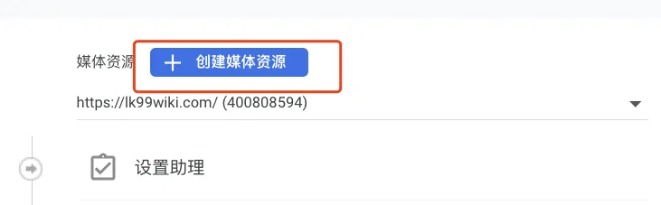 媒体资源名称填写网站名称或者域名都可以，哥飞这里填写域名，点击下一步。

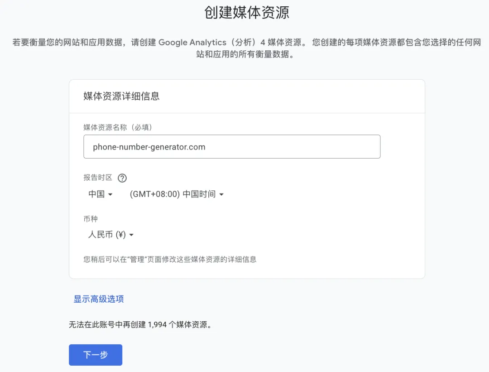 商家描述这里选择合适的网站行业类别，选择业务规模为小型。 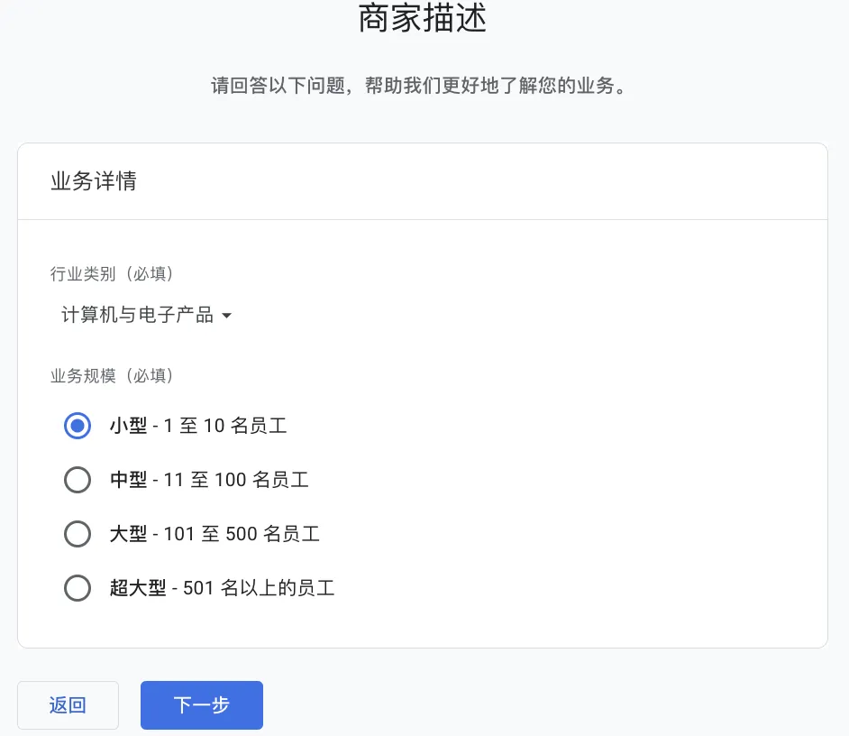 业务目标选择为“获取基准报告”，点击“创建”按钮。 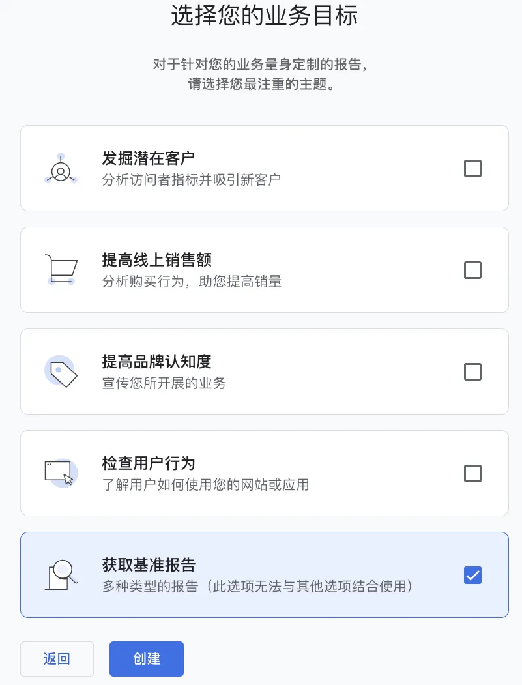 选择平台为“网站”。 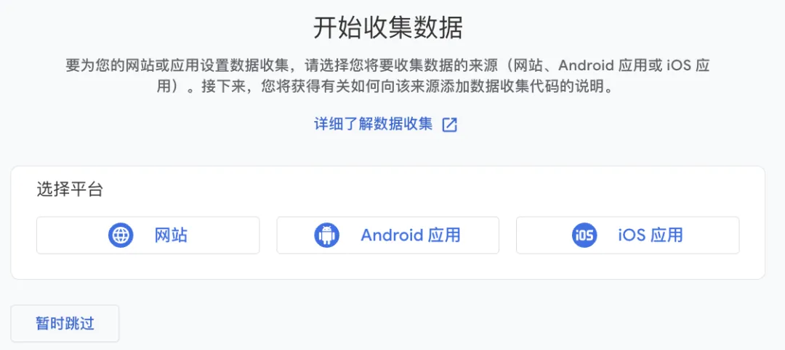 设置网址的协议，域名，和网站名称，点击“创建数据流”按钮。 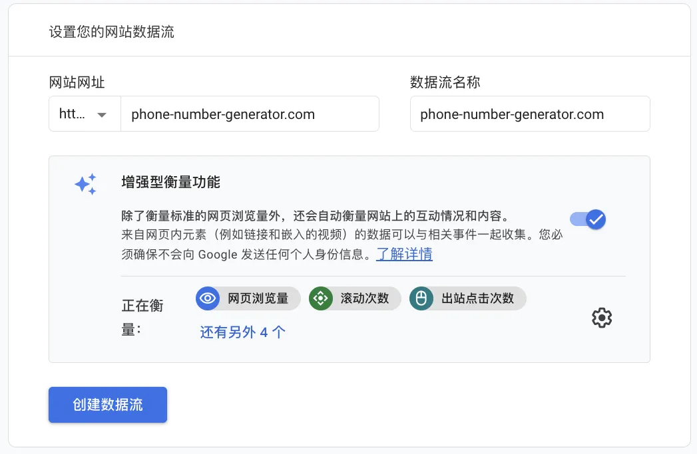 等待片刻，弹出来了网站统计代码，复制代码。 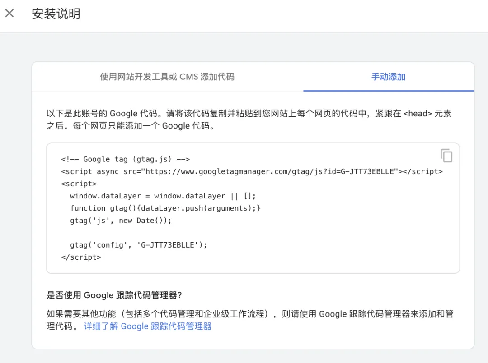 打开我们的网站代码，在每一个 html 文件的 `</body>` 之前增加一个 div ，设置 style 为 display:none ，把复制的统计代码放到 div 内。 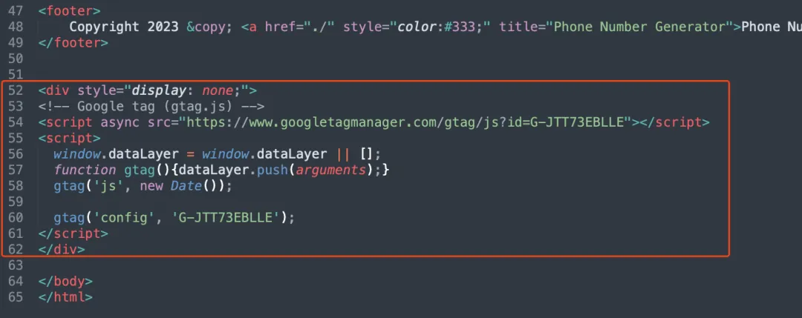 放在 body 最后，是为了不让统计代码拖慢网站加载，万一统计服务器有问题，统计代码加载不出来无非也就是丢失一点统计数据，但却不会影响网站访问。

记住，每一个 html 文件都需要加上统计代码，如果是后端动态页面，就可以只添加一个，然后在所有 html 文件中引入添加的代码，但我们这里只是手工制作的静态页面，那么就手动添加吧。

添加好之后，就可以把本地改动后的静态网页文件通过 git 提交到最新版本到 Github 。
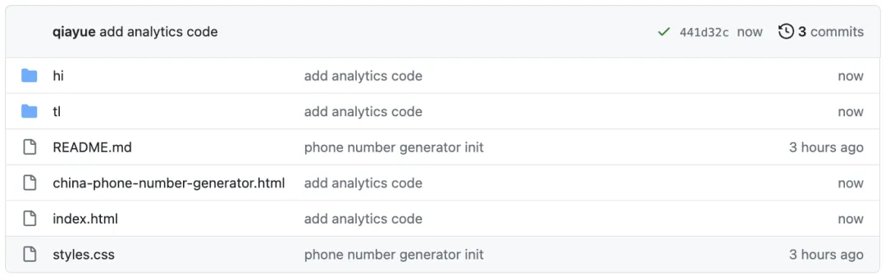
此时如果你打开 Vercel 就会发现，我们提交最新代码到 Github 之后，Vercel 就重新部署了新版网页。
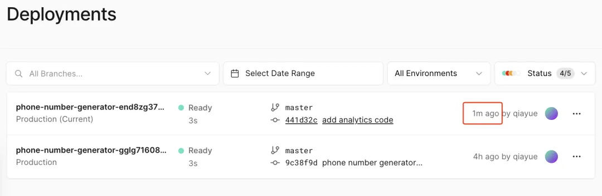
此时，我们打开网页，用浏览器查看网页 html 源码，也能够发现，最新改动已经生效了。
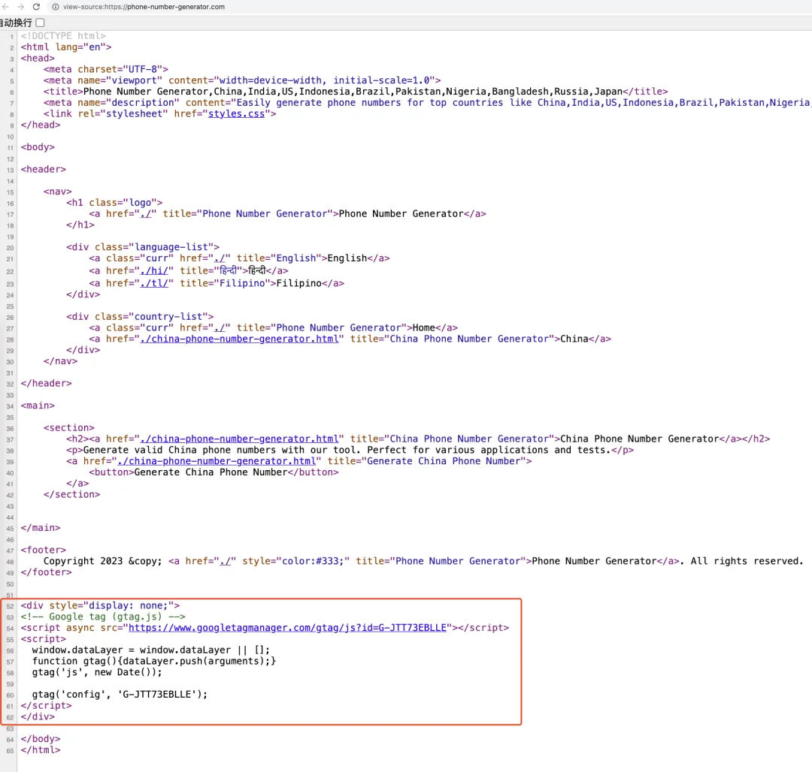
从这里就可以看出来，我们为什么要用 Github 了，因为通过 GitHub 做中转，我们可以做到在我们的电脑上改动网站之后，网站就自动更新了。

也就是说，我们的电脑就可以认为是我们网站的数据源头。我们可以真正可以掌控我们的网站数据，不会像语雀一样，在周一下午崩溃 7 个小时而无法访问。

我们目前依赖于 Vercel 和 Cloudflare ，这两家公司短期来讲，都不会倒闭，所以我们的网站也能够保证可用性。

万一哪天这两个服务中哪个无法使用了，我们也可以把网页部署到别的服务，然后修改域名解析到别的服务即可。

因为最原始的网页一直在我们的电脑上保存了一份，在 Github 保存了一份，几乎不会丢失或者损坏。

二、提交到 Google Search Console

这个步骤的流程细节挺多的，之前哥飞已经写过一篇教程了，大家直接看这篇教程就行，就不复制到本文了。

[如何清晰的知道我们网站在搜索引擎的表现：Google Search Console 使用入门讲解](https://mp.weixin.qq.com/s/bETdv9x1Ytozi49Nfm-l6g)

记住，一定要制作好 Sitemap 文件，并提交到 Google Search Console 。 三、提交外链

其实这部分的教程，哥飞也写过，大家直接看下面的教程即可：

[Threads 上线，我火速做了个网站，1 小时就被谷歌收录了，操作步骤全揭秘](https://mp.weixin.qq.com/s/pW3hHm-04oBz98LielieTw)

[新上线的网站，如何快速让谷歌收录？做网站为什么要生成几十万个页面？](https://mp.weixin.qq.com/s/F8nbfD720wjxcJsSPlAb-w)

答案就是在谷歌爬虫经常光顾的网站留下自己新网站的链接。

我们新网站被收录的速度有多快，就取决于谷歌的蜘蛛到我们提交链接的网站有多频繁。

接下来，我们只需要等待即可，一般来讲，通过提交外链的方法，最快 1 个小时可以被收录，慢的话也一天足够了。

如果你等了几天还没被收录，那么就要看看是不是我们的网页质量太低了，或者其它什么原因。

如果有问题的话，一般都可以在 Google Search Console 后台看到提醒。

到此为止，养网站防老系列的前期准备工作都做完了，接下来就是去所有能够宣传我们网站的地方去宣传了。

    拭心

    2025-04-10 00:56

    回复

    遇到 Github push 后没有自动触发部署的问题，我的原因是提交的邮箱没有绑定 Github，git config --get user.email 获取提交的邮箱后，到 Github Setting 里添加 email 就好了。

    理想园

    2026-01-05 21:47

    回复

    👍

    老荀

    2025-09-24 20:36

    回复

    打卡

    秋天 | AI 探索者

    2026-01-21 17:44

    回复

    打卡

    Meet you

    2026-01-31 22:34

    回复

    选择您的业务目标时 选 了解网站和/或应用流量

添加图片添加隐藏回复

