# 介绍几个 Ahrefs 家的免费SEO工具 Free SEO Tools（上）

大家好，我是哥飞。

Ahrefs 做了好多免费 SEO 工具：

1.  Free Keyword Generator 免费关键词生成器
2.  Amazon Keyword Tool 亚马逊关键词工具
3.  Bing Keyword Tool Bing 关键词工具
4.  YouTube Keyword Tool YouTube 关键词工具
5.  Keyword Difficulty Checker 关键词难度检查器
6.  Backlink Checker 反链检查器
7.  Website Authority Checker 网站权限检查器
8.  Broken Link Checker 坏链检查器
9.  Website Traffic Checker 网站流量检查器
10.  Keyword Rank Checker 关键词排名检查器
11.  SERP Checker 搜索引擎结果页检查器
12.  Ahrefs SEO WordPress Plugin Ahrefs SEO WordPress 插件
13.  AI Writing Tools 人工智能写作工具
14.  Ahrefs SEO Toolbar Ahrefs SEO 工具栏

今天给大家介绍几个前面的7个，明天介绍后面的7个。 **一. Free Keyword Generator 免费关键词生成器**  工具网址：[https://ahrefs.com/keyword-generator](https://ahrefs.com/keyword-generator)

工具用途：基于输入的关键词，免费生成 Google 相关搜索关键词 。

使用演示：如输入“ai generator” 可以生成所有相关的关键词，并且前10个关键词还会给出优化难度（KD）。

注意这里的搜索量（Volume）是月度数据，用最近12个月的数据平均得到的。 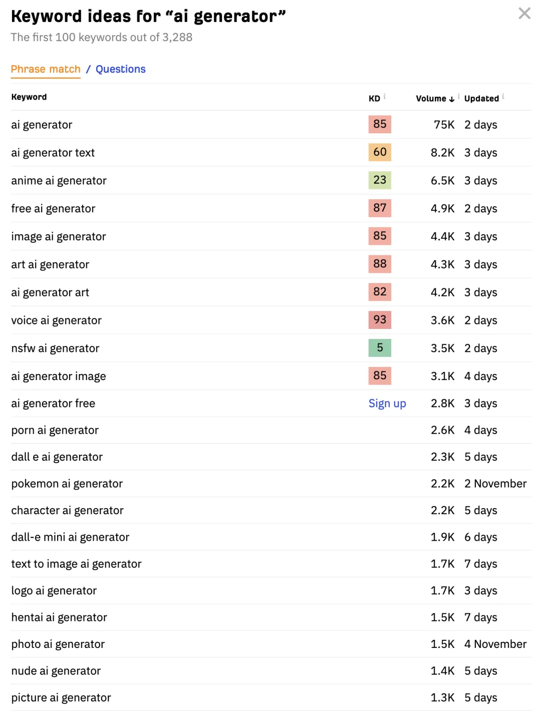 **二. Amazon Keyword Tool 亚马逊关键词工具** 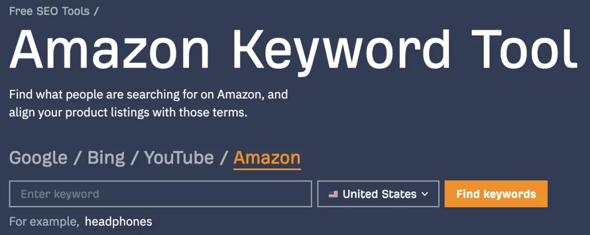

工具网址：[https://ahrefs.com/amazon-keyword-tool](https://ahrefs.com/amazon-keyword-tool)

工具用途：根据输入的关键词显示 Amazon 相关关键词

使用演示：输入关键词 headphones ，给出 Amazon 的相关关键词和搜索量。 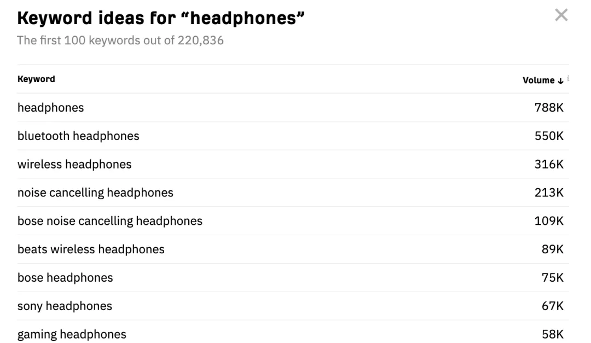 **三. Bing Keyword Tool Bing 关键词工具** 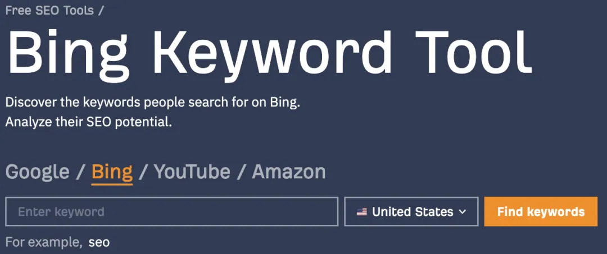 工具网址：[https://ahrefs.com/bing-keyword-tool](https://ahrefs.com/bing-keyword-tool)

工具用途：根据输入的关键词显示 Bing 相关关键词

使用演示：输入关键词 seo ，给出 Bing 相关关键词和搜索量。 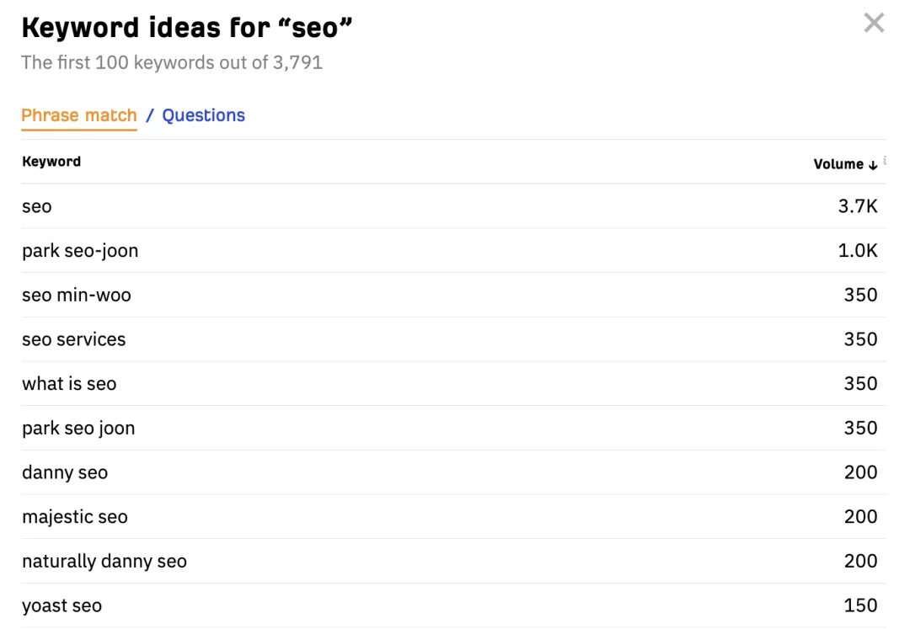

**四. YouTube Keyword Tool YouTube 关键词工具** 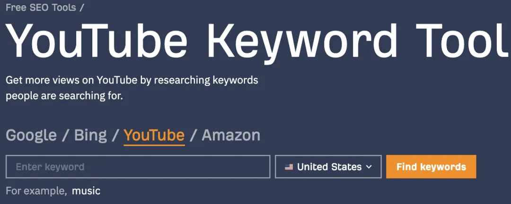

工具网址：[https://ahrefs.com/youtube-keyword-tool](https://ahrefs.com/youtube-keyword-tool)

工具用途：根据输入的关键词显示 Youtube 相关关键词

使用演示：输入关键词 music ，给出 Youtube 相关关键词和搜索量。

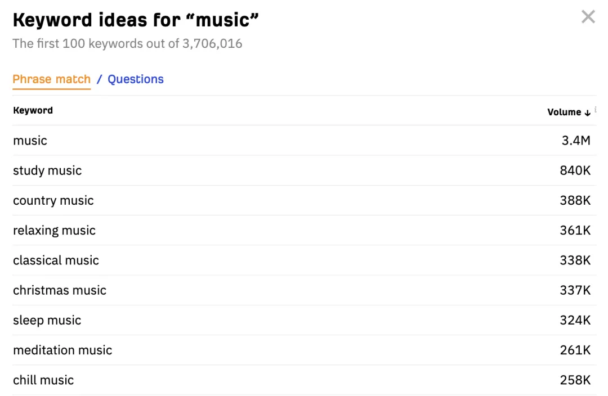

**五. Keyword Difficulty Checker 关键词难度检查器** 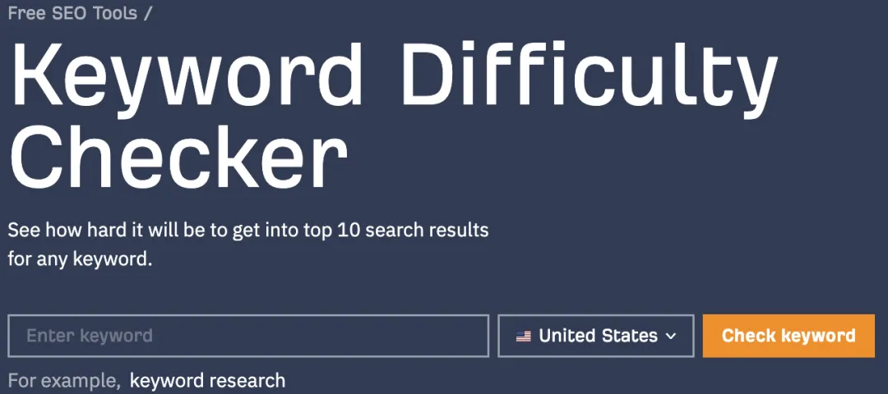 工具网址：[https://ahrefs.com/keyword-difficulty](https://ahrefs.com/keyword-difficulty)

工具用途：根据输入的关键词显示该关键词的优化难度

使用演示：这个工具其实哥飞之前介绍过，具体演示请看《有了这几个关键字优化难度分析工具，妈妈再也不怕我不会判断SEO难度了》。

**六. Backlink Checker 反链检查器** 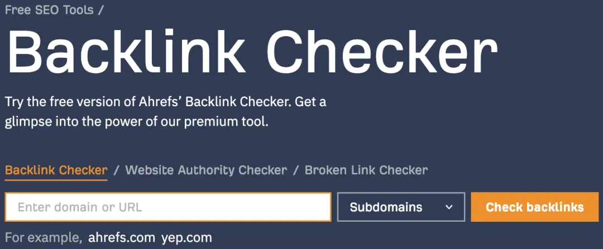 工具网址：[https://ahrefs.com/backlink-checker](https://ahrefs.com/backlink-checker)

工具用途：输入域名或者网址，查询反向链接（也就是外链）数据

使用演示：给大家查一下 qiuyumi.com 的外链数量，有1100个网站给了7500个外链。 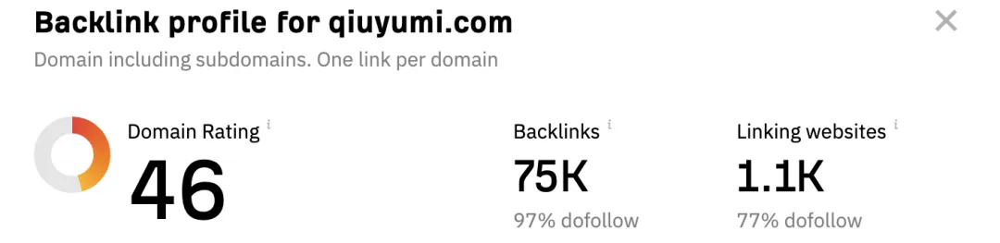

**七. Website Authority Checker 网站权限检查器** 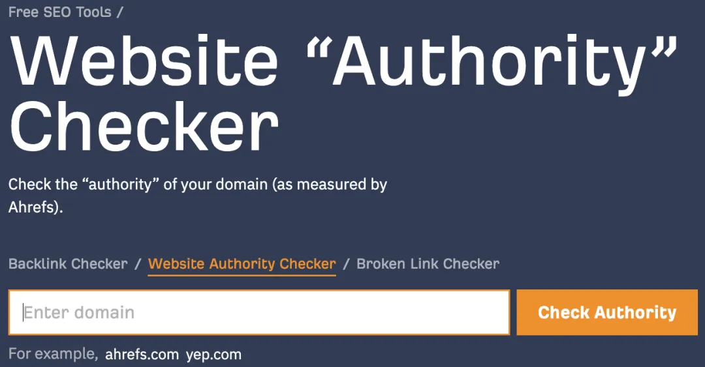 工具网址：[https://ahrefs.com/website-authority-checker](https://ahrefs.com/website-authority-checker)

工具用途：查询指定域名的权威性数据

使用演示：输入域名，会看到查询出来的数据跟上面这个查反链的工具相同，不用疑惑，查反链时显示的数据，就是这里的 website authority 数据。 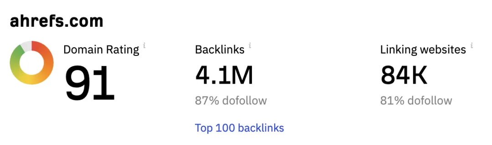 好了，剩下的7个我们在明天的文章中介绍。

