# 介绍几个 Ahrefs 家的免费SEO工具 Free SEO Tools（下）

大家好，我是哥飞。 昨天在《[介绍几个 Ahrefs 家的免费SEO工具 Free SEO Tools（上）](https://mp.weixin.qq.com/s/ZoLAZoiKUphLUR8YFLajcQ)》给大家介绍了14个Ahrefs家的免费SEO工具中的前7个，今天继续介绍后面的7个。

-   Broken Link Checker 坏链检查器
-   Website Traffic Checker 网站流量检查器
-   Keyword Rank Checker 关键词排名检查器
-   SERP Checker 搜索引擎结果页检查器
-   Ahrefs SEO WordPress Plugin Ahrefs SEO WordPress 插件
-   AI Writing Tools 人工智能写作工具
-   Ahrefs SEO Toolbar Ahrefs SEO 工具栏

**8\. Broken Link Checker 坏链检查器**

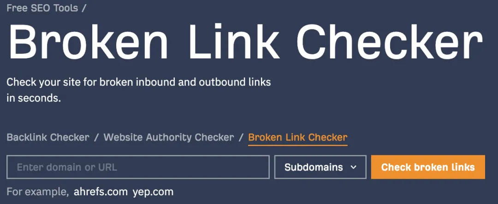

工具网址：[https://ahrefs.com/broken-link-checker](https://ahrefs.com/broken-link-checker)

工具用途：检测指定网站的坏链，也就是404链接，也成死链 。

这里又分为出站链接和入站链接。A网站上有一个B网站的链接，如果B网站无法访问了，对于 A网站来说，就有一个出站死链。

如果A网站无法访问，B网站可以访问，对于 B网站来说，A网站的这个就属于是入站死链。

使用演示：如输入“qiuyumi.com” 可以看到有 8个出站死链。
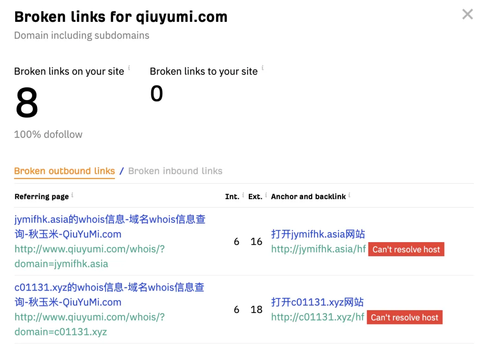

**9\. Website Traffic Checker 网站流量检查器**

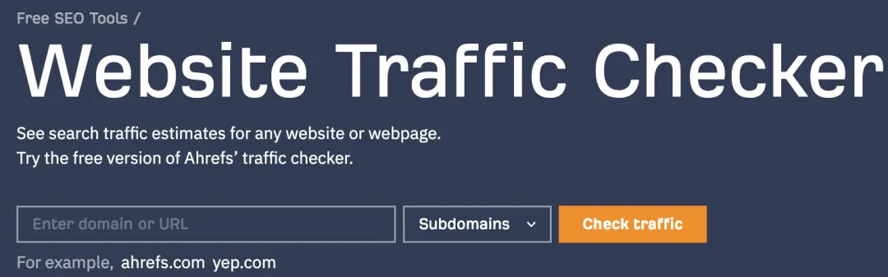

工具网址：[https://ahrefs.com/traffic-checker](https://ahrefs.com/traffic-checker)

工具用途：查询指定域名的自然搜索流量和流量价值。

使用演示：如输入 producthunt.com ，显示自然流量110万，价值49.5万美元。 

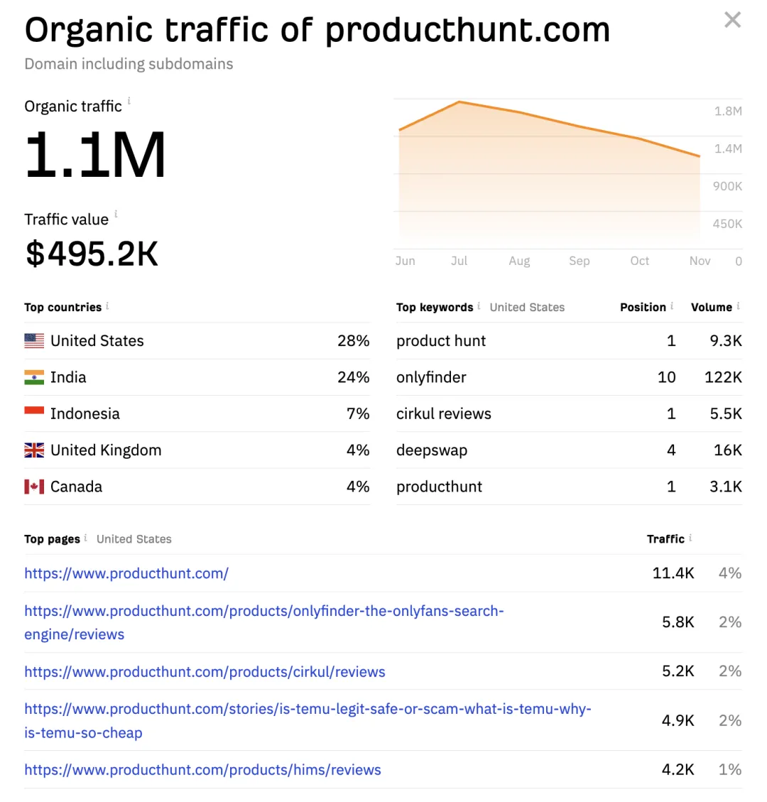

 这里可以跟 Semrush 数据对比，比 Semrush 显示的更多。 

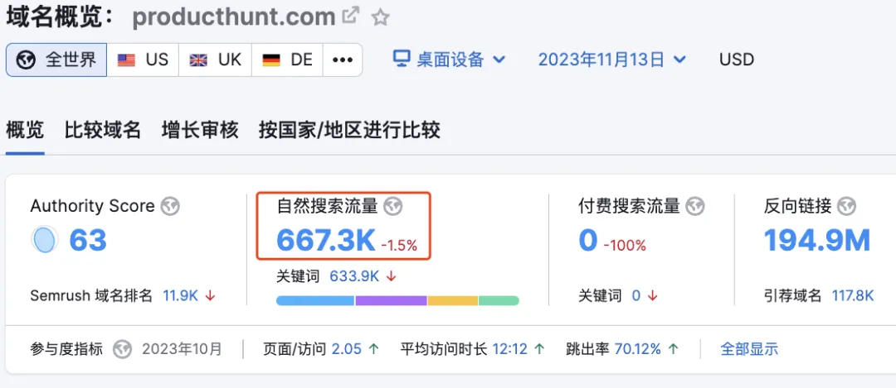

**10\. Keyword Rank Checker 关键词排名检查器**

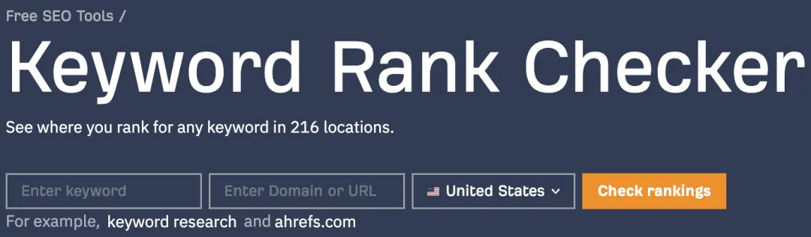

工具网址：[https://ahrefs.com/keyword-rank-checker](https://ahrefs.com/keyword-rank-checker)

工具用途：查询某个网站某个关键词在谷歌中的排名。

使用演示：这里以查询“keyword research”这个词，ahrefs.com排名为例，输入后得到排名结果是第7位。

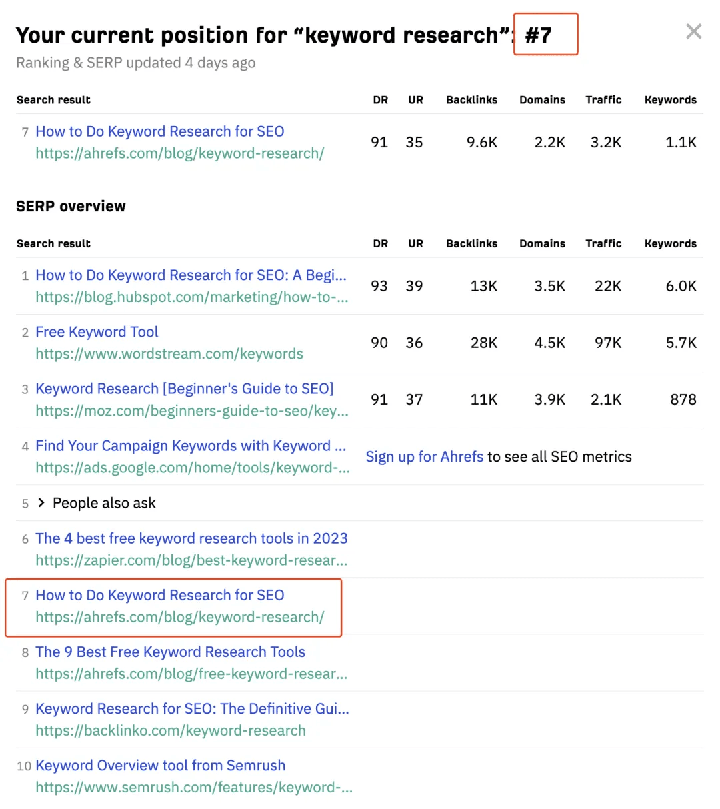

**11\. SERP Checker 搜索引擎结果页检查器**

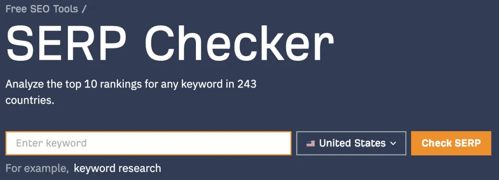

工具网址：[https://ahrefs.com/serp-checker](https://ahrefs.com/serp-checker)

工具用途：查询某个词的自然搜索结果，SERP是Search Engine Results Page的缩写，即搜索引擎搜索结果页面 。

使用演示：如输入“ai generator” 可以看到这个词在谷歌中的前10搜索结果，以及每个域名的DR、UR、反链数量、反链网站数量、流量和关键词数量。

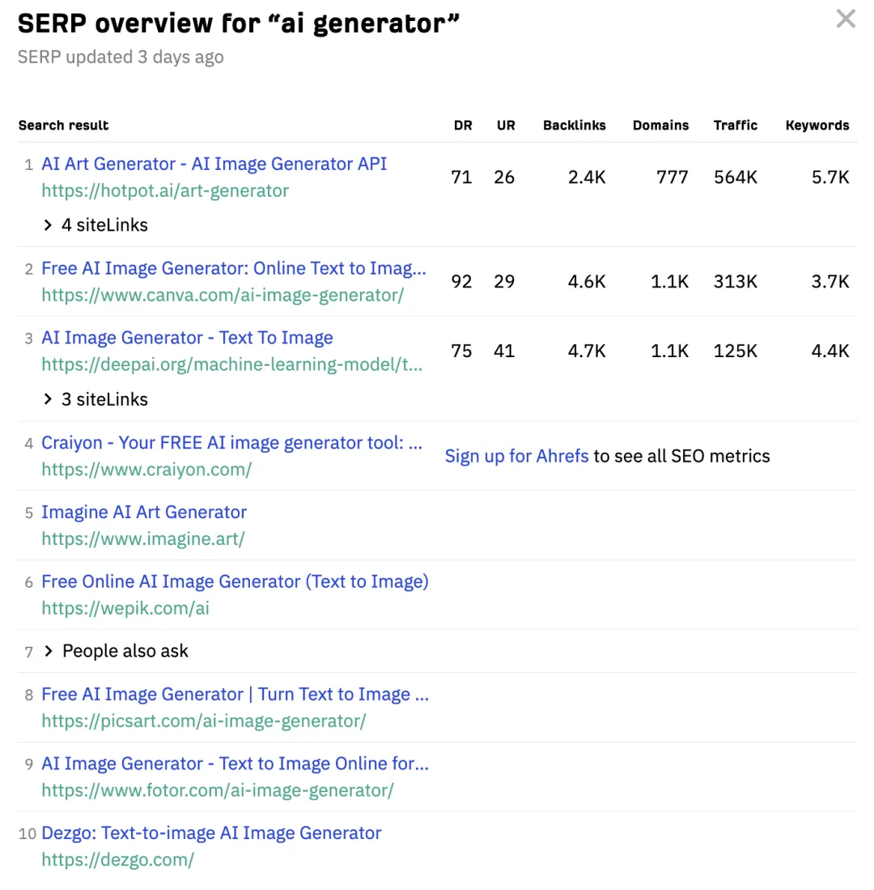

**12\. Ahrefs SEO WordPress Plugin Ahrefs SEO WordPress 插件**

工具网址：[https://ahrefs.com/wordpress-seo-plugin](https://ahrefs.com/wordpress-seo-plugin)

工具用途：这是Ahrefs开发的一个SEO Wordpress 插件。

使用演示：插件需要在Wordpress 中使用，哥飞就不给大家演示了。Ahrefs的介绍很有意思，不是另一个SEO插件，至少并不全是，这是对其它SEO插件的补充，专注于做内容审查和建议。

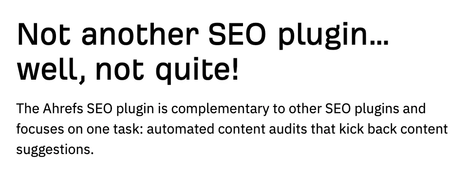

**13\. AI Writing Tools 人工智能写作工具**

工具网址：[https://ahrefs.com/writing-tools](https://ahrefs.com/writing-tools)

工具用途：AI加持的智能SEO内容创作工具 。

使用演示：这个工具后面哥飞测评一下后专门写一篇文章介绍，看起来功能还是挺多的：

1.  Acronym Generator 首字母缩略词生成器
2.  Paragraph Rewriter 段落重写器
3.  Conclusion Generator 结论生成器
4.  Paraphrasing Tool 释义工具
5.  Emoji Translator 表情符号翻译器
6.  Rewording Tool 改写工具
7.  Lorem Ipsum Generator Lorem Ipsum 生成器
8.  Sentence Rewriter Tool 句子重写工具
9.  Outline Generator 轮廓生成器
10.  Summarizer Tool 摘要工具
11.  Paragraph Generator 段落生成器
12.  以及更多几十项功能……

**14\. Ahrefs SEO Toolbar Ahrefs SEO 工具栏**

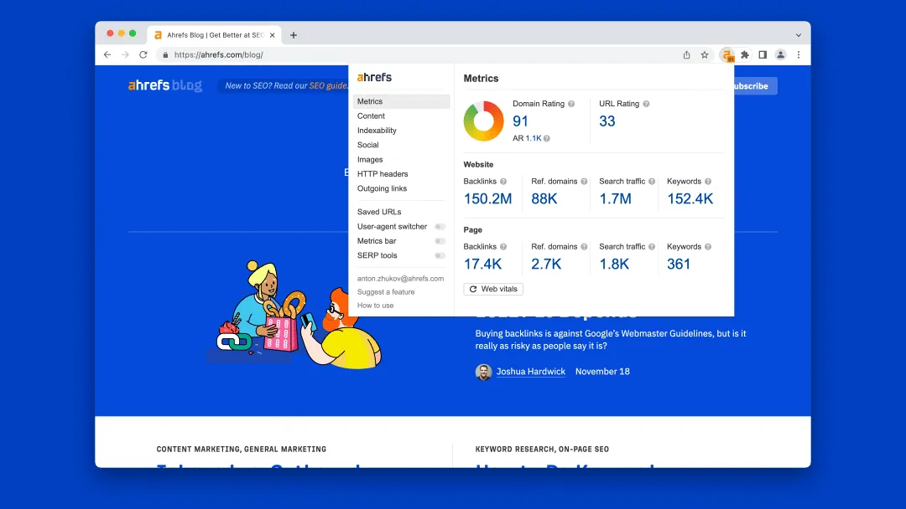

工具网址：[https://ahrefs.com/seo-toolbar](https://ahrefs.com/seo-toolbar)

安装地址：[https://chromewebstore.google.com/detail/ahrefs-seo-toolbar-on-pag/hgmoccdbjhknikckedaaebbpdeebhiei](https://chromewebstore.google.com/detail/ahrefs-seo-toolbar-on-pag/hgmoccdbjhknikckedaaebbpdeebhiei)

工具用途：Ahrefs 出品的SEO浏览器插件，可以看到当前网站的各种信息。

使用演示：大家可以自己安装使用。

