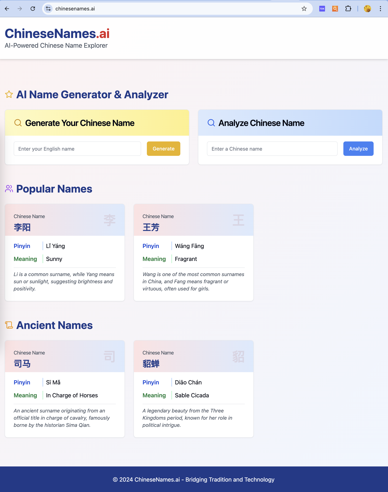
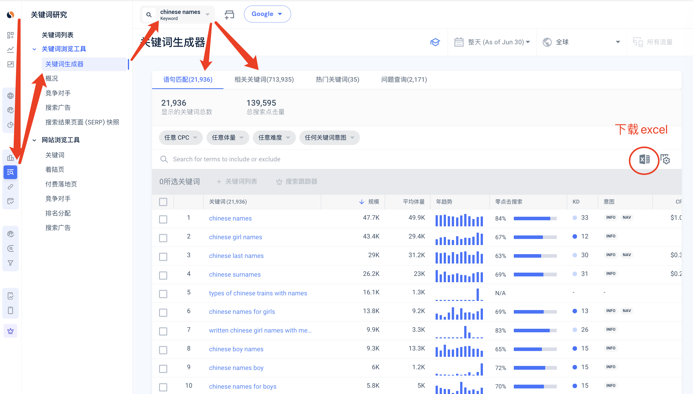
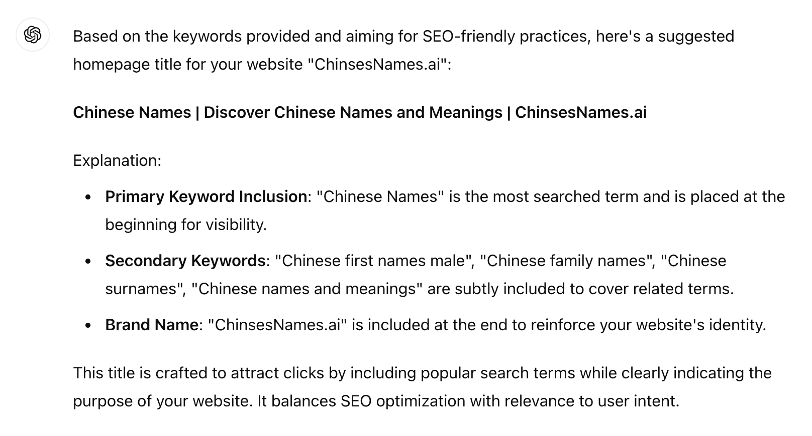
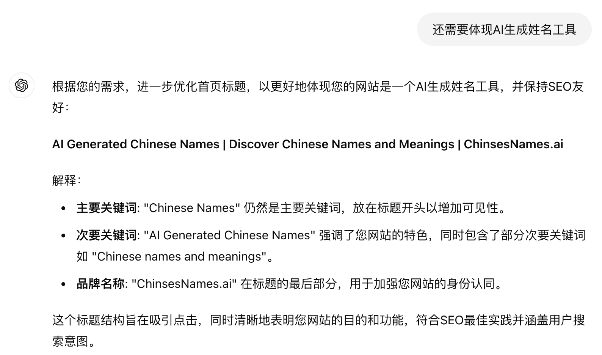
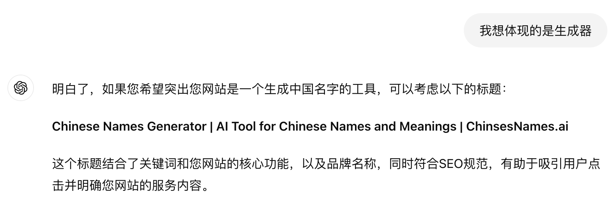
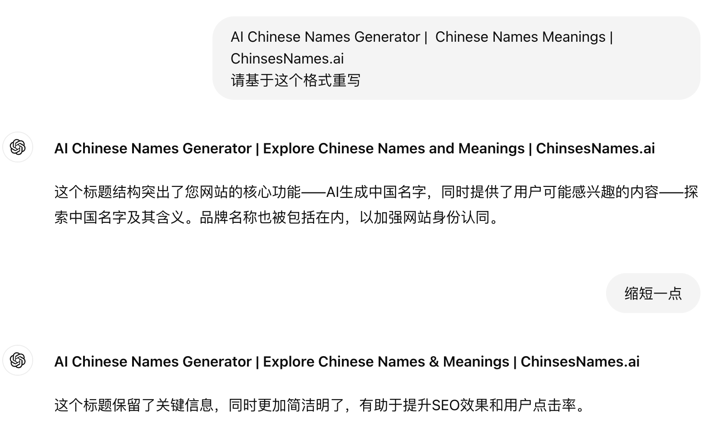
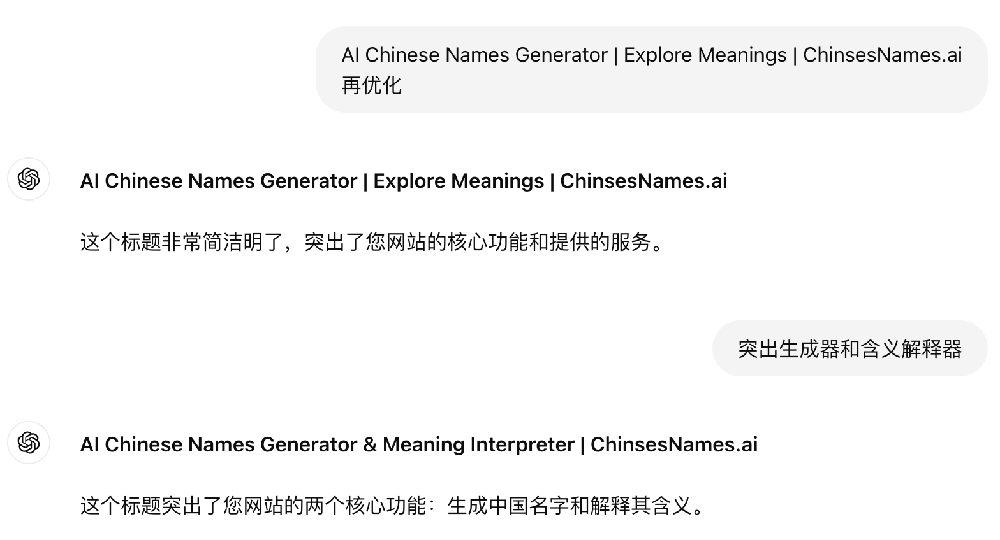
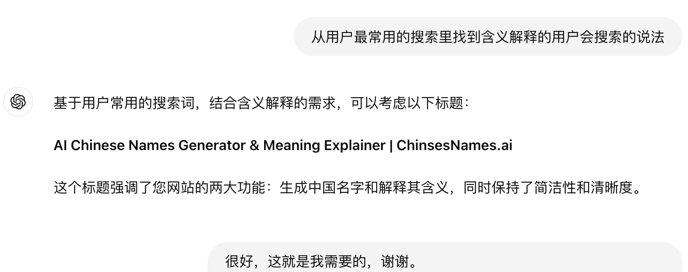
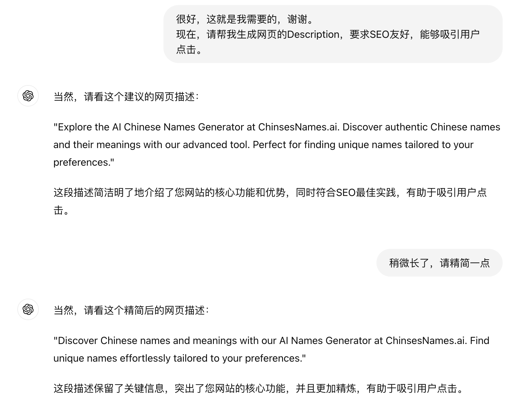
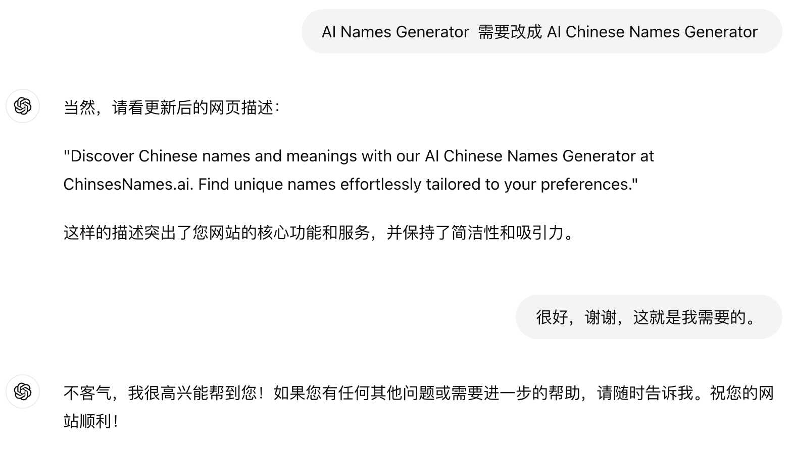

# 如何用GPT生成SEO友好的网页Title和Description

## 新手入门

# 如何用GPT生成SEO友好的网页Title和Description
上周，哥飞在社群里跟大家分享了，使用 [https://Claude.ai](https://claude.ai/) 轻松编写好了 [https://ChineseNames.ai](https://chinesenames.ai/) 的首页代码。

从上面的截图看到，UI还是挺不错的。

不过呢，很多SEO细节还没有做好，如网页的 Head 部分标签缺失，特别是最重要的Title和Description都没设置。

所以今天哥飞给大家演示一下，哥飞平常上线一个网站，是怎么让GPT辅助编写SEO友好的网页Title和Description。

## 数据准备

第一步，一定要记住，我们不能直接让GPT帮我们写标题和描述，我们需要做好数据准备工作。

方法也很简单，打开 Similarweb 或者 Semrush 的关键词生成器，输入核心关键词，找出用户真的会搜索的关键词列表。

下面哥飞以 Similarweb 为例，给大家演示一下。

把“语句匹配”和“相关关键词”关键词列表下载为 excel 文件，合并、去重、按照搜索量从高到低排序，取前100个关键词，一行一个，只要关键词，不要数据。

## 跟GPT对话要求生成标题 Ttitle

哥飞的提示词如下：

`我正在做 https://chinesenames.ai/ ，网站名称是 ChinsesNames.ai ，这是一个帮助非中国人起中国名字的工具类网站，同时也包含各种中国人名的解释信息。 请帮我写符合SEO规范的首页Title，要求SEO友好，覆盖网站名称和核心关键词 Chinses Names。 请参考以下用户经常会在谷歌搜索的关键词，从上到下分别是按照搜索量从高到低排序： chinese names chinese first names male chinese family names chinese surnames chinese last names （限于篇幅，此处省略95个关键词，大家自己使用时补充完整）`

GPT 的回复如下： 

但是不符合哥飞的要求，于是哥飞继续提需求： 

“Generated”不是哥飞想要的关键词，于是继续提新需求： 

这时候给出的标题已经差不多达标了，但是哥飞有更高的要求，基于GPT给出来的，哥飞自己写了一版，让GPT润色。 

标题一般要求小于60个字符，所以哥飞还要求继续缩短了一些，但是GPT写的还是太长了，于是哥飞自己又写了一版，让GPT继续润色。 

“Interpreter” 这个单词不是哥飞 想要的，太专业了，普通人不太会写这个单词，于是让GPT从哥飞之前给出的关键词列表里找一个单词。 

最终，得到了如下标题，这就是哥飞想要的标题： `AI Chinese Names Generator & Meaning Explainer | ChinsesNames.ai`

这个标题，突出了核心关键词“Chinese Names”，又在最开头写了“AI”来吸引用户，还包含了核心关键词“Meaning”，最后还有品牌名称“ChinsesNames.ai”，可以说是该有的都有了。

## 继续生成描述

有了标题之后，再生成描述就很简单了。

“with our AI Names Generator at”这里缺少“Chinese”，哥飞要求GPT加上。

最终，哥飞如愿得到了SEO友好的网页Title和Description。

大家也可以用这个方法，取跟GPT或者Claude对话，让AI辅助你编写网页标题和描述。

