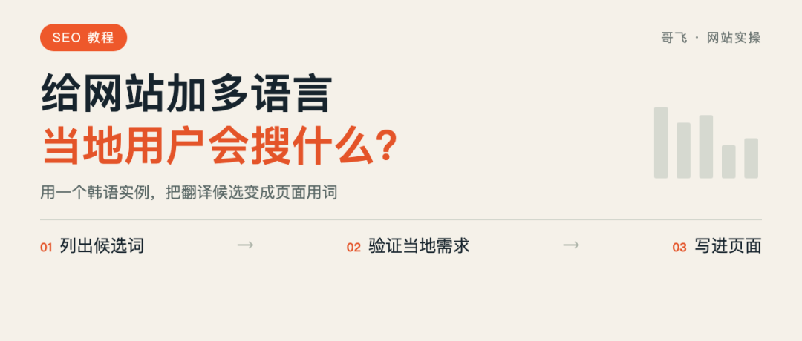
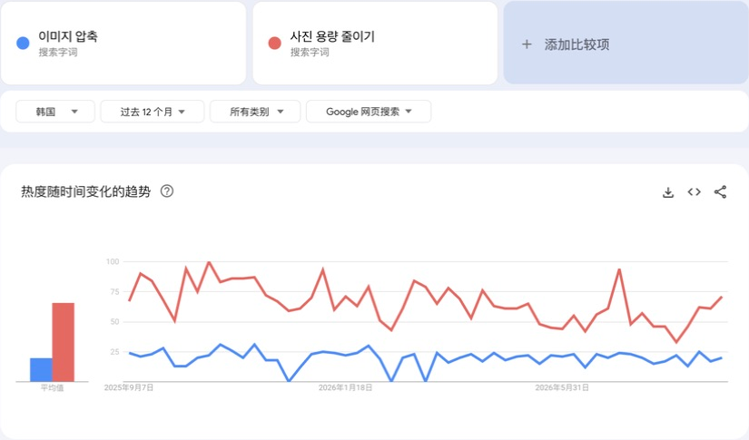
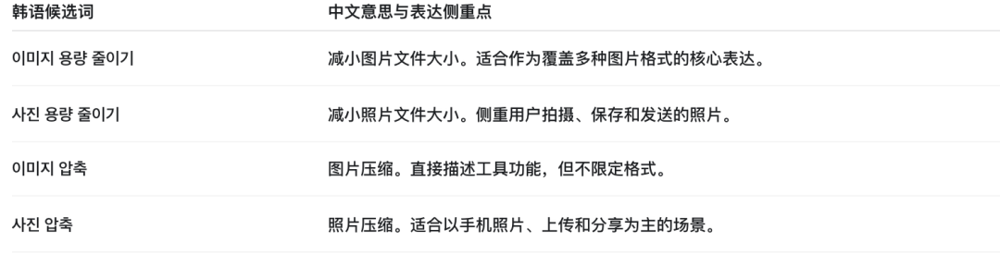
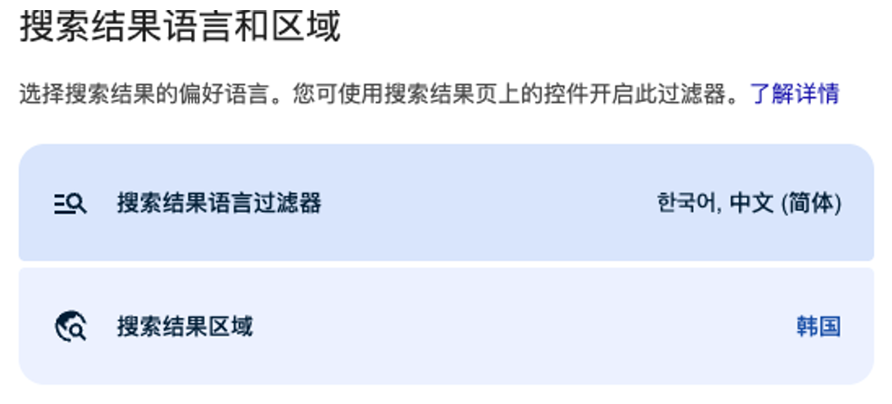
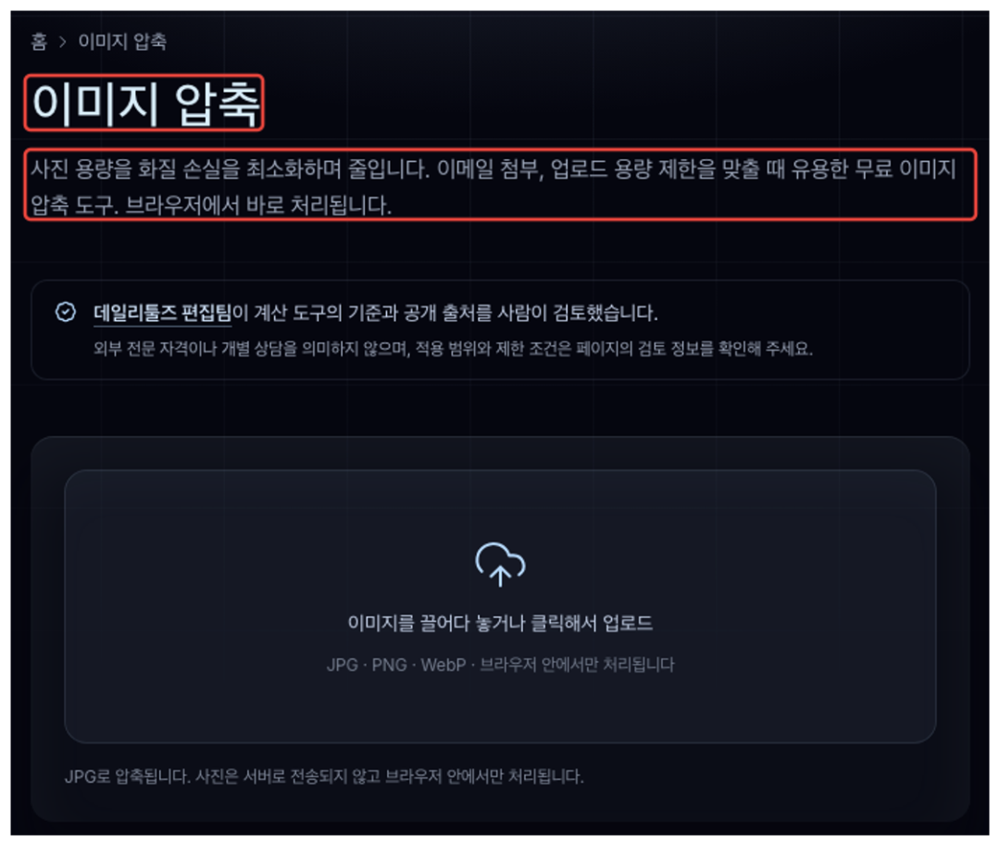
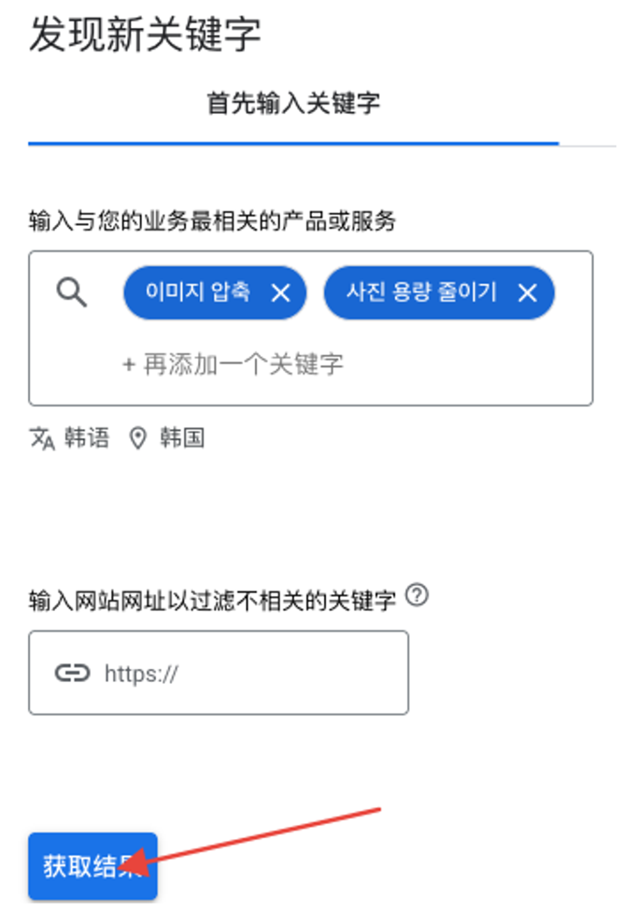
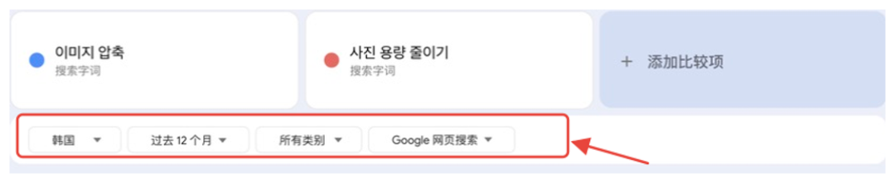
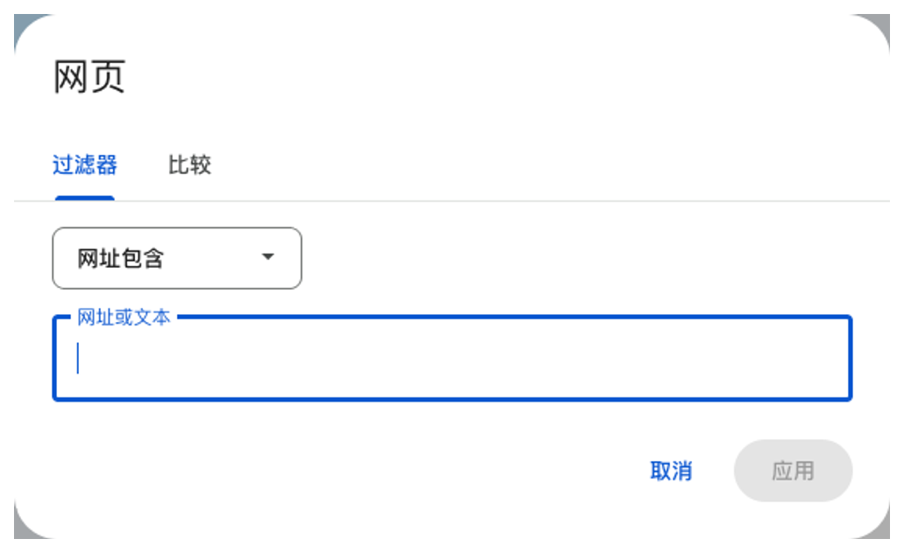

# 给网站加多语言，怎么找到当地用户真正会搜的词？

给网站加多语言，先找到当地用户会搜的词大家好，我是哥飞。给网站加多语言，很多朋友会先把英文文案交给 AI，翻译完就上线。但翻译得通顺，和当地用户会不会这样搜索，是两件事。比如，你做了一个图片压缩工具，准备增加韩语版。用“图片压缩”去翻译，很容易得到이미지 압축。这个表达可以用，但如果只查到这里，你就会漏掉另一种说法：사진 용량 줄이기，意思是“减少照片文件大小”。我把这两个词放到 Google Trends 里，地区选韩国，时间选过去 12 个月，两项都按“搜索字词”比较。同一张趋势图里，“减少照片文件大小”的搜索热度持续高于“图片压缩”。Google Trends：韩国过去12个月的两个韩语搜索字词对比同样一个功能，换一种说法，搜索需求就有差别。只翻译功能名，会漏掉这些词。今天就用这个例子，讲一下：给网站增加一门语言时，怎样找到当地用户真正会搜的词，以及查完之后怎么用。先把用户要做的事讲清楚先别急着翻译网站的整段文案。把这个页面解决什么问题，写成一句话。这里的图片压缩工具，解决的是“照片文件太大，想把它缩小后上传或发送”，不是“把图片的长宽改小”。这两种需求会用到一些相似的词，但用户想得到的结果不同。一个关心文件从几 MB 变成几百 KB，另一个关心图片从多少像素改成多少像素。如果你的工具只做前一种，就不要因为后一种词看着热度高，也拿来当页面的主词。可以参考下面这个提示词示例：我有一个图片压缩工具，能减小 JPG、PNG 的文件大小，方便上传和发送。请给出韩国用户表达这项需求的韩语候选词，并逐项解释中文意思。区分文件大小和图片尺寸，不要编造搜索量。这次回答里，AI 给出了사진 용량 줄이기（减小照片文件大小）和이미지 압축（图片压缩），也解释了两者的侧重点。AI 对话：四个韩语候选词及中文含义拿着这些候选词，再去当地网页和搜索工具里验证。看当地页面怎么说，别只看翻译结果自己检查时，先打开 Google 的“搜索设置”，找到语言和地区相关设置，把结果地区选为韩国，在结果语言过滤器里勾选韩语。浏览器也使用韩语环境，并保留网页原文，不让翻译插件把它变回中文。Google 搜索设置：已选择韩国，并勾选韩语如果要进一步核对当地的结果排序，还要使用韩国的网络出口，并检查搜索页底部识别的位置。看页面表达时，多打开几个相关结果，别只抄第一名的标题。把候选词放进目标地区的 Google 搜索，看看结果标题怎么写，再打开相关页面，对照大标题和工具说明，确认它提供的功能。比如，DailyTools 的页面大标题写的是“图片压缩”，下面的说明则讲“减小照片文件大小”，以及邮件附件、上传容量限制这些用途。DailyTools：红框标出图片压缩标题和用途说明所以，除了“图片压缩”，还可以顺着“照片太大，传不上去”这个需求找词。把看到的当地说法记下来，再查搜索数据。想补充搜索量，再查关键词规划师如果你有可用的 Google Ads 账号，可以从“工具”里的“规划”进入关键词规划师，选择“发现新关键字”，一次放入这两个韩语候选词。地区选韩国、语言选韩语。搜索网络统一选 Google，不选“Google 和搜索合作伙伴”；比较几个词时，时间范围也保持一致。设置好后，再查看关键词建议。Google Ads：选好韩语和韩国，点击箭头所指的获取结果图中输入框下方已经选好韩语和韩国，再点击“获取结果”。先看平均每月搜索量，但不要直接复制排在最上面的词。遇到一个新词，先问：搜这个词的人，要的还是我这个工具提供的功能吗？只留下与你的工具用途一致的表达，再比较需求大小。有的账号显示搜索量区间，就把区间原样记下来。关键词规划师暂时用不了，或者新词还查不到数据，就先到 Google Trends 验证。下面拿这两个韩语词做一次比较。把候选放进同一张趋势图打开 Google Trends，先输入이미지 압축，再添加사진 용량 줄이기。两项都选“搜索字词”，不要一项选字词、一项选主题。地区选择韩国，时间选择过去 12 个月，搜索类型保持 Google 网页搜索。Google Trends：红框标出比较条件，上方两项均为搜索字词按这个条件，就能复现开头的比较方式：蓝线是“图片压缩”，红线是“减少照片文件大小”。做这个韩语页面时，可以优先考虑后者。Google Trends 的数值表示相对热度，100 对应本次比较范围内的热度峰值。把地区和时间统一，才能比较两个词的高低。也不要把两个词分开查，各自看到一个最高值 100，就认为它们一样热门。放在同一次比较里，才能看出它们之间的差别。如果某个候选显示数据不足，就先留在待验证列表里。尤其是新词、小众词，不能仅凭没有曲线就删掉；把当地页面、关键词建议和上线后的实际查询作为后续验证依据。查完之后，落实到页面上词找到了，页面怎么写？可以把“减小照片文件大小”放进标题和大标题，再用“图片压缩”解释功能。这两种说法不冲突，也不用每段都重复一遍。比如，你的工具支持 JPG、PNG 上传、压缩和下载，可以参考下面这组文案：页面标题：사진 용량 줄이기 | JPG·PNG 이미지 압축中文意思：减小照片文件大小｜JPG、PNG 图片压缩。页面大标题：사진 용량 줄이기中文意思：减小照片文件大小。功能说明：JPG 또는 PNG 사진을 업로드하고, 파일 용량을 줄인 뒤 다운로드하세요.中文意思：上传 JPG 或 PNG 照片，减小文件大小后下载。如果你的工具不支持 PNG，就删掉 PNG，不照抄示例里的能力。如果两个表达对应的是同一个功能，也不必为了各占一个词，立刻做两个几乎一样的页面。具体给网站增加多语言版本的做法，我之前写过《利用ChatGPT给网站增加多语言支持》。页面搭好以后，再按这里的方法确认每门语言的用词。你可以给每个语言版本留一份简短记录：候选词、中文含义、相关页面、比较条件、采用位置。这样以后调整英文文案时，就知道哪些本地表达已经查过，哪些只是初始翻译。已经有流量的词，别被下一次翻译覆盖之前有位朋友的网站，主要流量来自韩语页面，注册用户一天有800个，第二天有1000个，随后流量突然没了。排查时，他发现修改英文文案会自动触发韩语文案更新，原来韩语页面覆盖的关键词也被替换了。好不容易找到的词，又被下一次翻译改掉了。所以，英文文案可以更新，但别让程序直接覆盖已经确认过的韩语关键词。把各语言采用的词单独保留，更新时先对照，再决定哪些句子需要重译。尤其是已经带来搜索展现和点击的表达，改之前先看数据。在 Search Console 的效果报告里，筛选对应的语言页面，查看查询：用户实际上用什么词找到它？这些词是不是你准备换掉的词？先点击“添加过滤条件”，在菜单中选择“网页”。选择“网址包含”，填入你网站的韩语页面路径；如果只检查一张页面，就改用精确网址。应用后，再看下方的查询列表。Google Search Console：网页筛选入口上线新版本后，也用同样的页面范围查看查询和展现。先确认目标语言页面开始覆盖哪些表达，再决定是否调整，不要因为短时间没看到点击就立刻全部重写。你自己做的时候，如果拿不准两个当地说法该选哪个，可以把词和查到的页面放在一起讨论。我们平时聊做网站、做 SEO，也经常会具体到一个词、一张页面。如果你是第一次看我的文章，也简单介绍一下我自己。我是哥飞，做网站和 SEO 很多年了，现在在运营“哥飞的朋友们”社群。平时我会和大家一起研究怎么挖掘需求、做网站、获取流量，再把流量变成收入。如果你想进一步了解我和这个社群，可以从下面几篇文章开始：想先了解我为什么做这个社群，以及它为什么能持续三年：在教人赚钱这件事情上，我干了三年了，居然口碑不错想看社群朋友如何把 SEO 和做网站变成真实结果：我的4000人出海创业社群里，靠SEO赚到钱的人都做对了什么？想看看社群里的分享和交流是什么样：650位朋友来到深圳，在哥飞的朋友们2026年中分享交流会里都学到了这些想看看大家如何在一天里把想法做成上线的网站：一个词根、一个白天、175支交卷的队伍——“哥飞的朋友们”上站Hackathon深圳站侧记如果看完之后觉得这个社群适合你，可以加哥飞微信咨询了解。微信搜索框，输入 361079，点击查找 QQ 号，就能加哥飞微信了。哥飞微信

大家好，我是哥飞。

给网站加多语言，很多朋友会先把英文文案交给 AI，翻译完就上线。

但翻译得通顺，和当地用户会不会这样搜索，是两件事。

比如，你做了一个图片压缩工具，准备增加韩语版。用“图片压缩”去翻译，很容易得到이미지 압축。这个表达可以用，但如果只查到这里，你就会漏掉另一种说法：사진 용량 줄이기，意思是“减少照片文件大小”。

我把这两个词放到 Google Trends 里，地区选韩国，时间选过去 12 个月，两项都按“搜索字词”比较。同一张趋势图里，“减少照片文件大小”的搜索热度持续高于“图片压缩”。

同样一个功能，换一种说法，搜索需求就有差别。只翻译功能名，会漏掉这些词。

今天就用这个例子，讲一下：给网站增加一门语言时，怎样找到当地用户真正会搜的词，以及查完之后怎么用。

## 先把用户要做的事讲清楚

先别急着翻译网站的整段文案。把这个页面解决什么问题，写成一句话。

这里的图片压缩工具，解决的是“照片文件太大，想把它缩小后上传或发送”，不是“把图片的长宽改小”。

这两种需求会用到一些相似的词，但用户想得到的结果不同。一个关心文件从几 MB 变成几百 KB，另一个关心图片从多少像素改成多少像素。

如果你的工具只做前一种，就不要因为后一种词看着热度高，也拿来当页面的主词。

可以参考下面这个提示词示例：

> 我有一个图片压缩工具，能减小 JPG、PNG 的文件大小，方便上传和发送。请给出韩国用户表达这项需求的韩语候选词，并逐项解释中文意思。区分文件大小和图片尺寸，不要编造搜索量。

我有一个图片压缩工具，能减小 JPG、PNG 的文件大小，方便上传和发送。请给出韩国用户表达这项需求的韩语候选词，并逐项解释中文意思。区分文件大小和图片尺寸，不要编造搜索量。

这次回答里，AI 给出了사진 용량 줄이기（减小照片文件大小）和이미지 압축（图片压缩），也解释了两者的侧重点。

拿着这些候选词，再去当地网页和搜索工具里验证。

## 看当地页面怎么说，别只看翻译结果

自己检查时，先打开 Google 的“搜索设置”，找到语言和地区相关设置，把结果地区选为韩国，在结果语言过滤器里勾选韩语。浏览器也使用韩语环境，并保留网页原文，不让翻译插件把它变回中文。

如果要进一步核对当地的结果排序，还要使用韩国的网络出口，并检查搜索页底部识别的位置。看页面表达时，多打开几个相关结果，别只抄第一名的标题。

把候选词放进目标地区的 Google 搜索，看看结果标题怎么写，再打开相关页面，对照大标题和工具说明，确认它提供的功能。

比如，DailyTools 的页面大标题写的是“图片压缩”，下面的说明则讲“减小照片文件大小”，以及邮件附件、上传容量限制这些用途。

所以，除了“图片压缩”，还可以顺着“照片太大，传不上去”这个需求找词。把看到的当地说法记下来，再查搜索数据。

## 想补充搜索量，再查关键词规划师

如果你有可用的 Google Ads 账号，可以从“工具”里的“规划”进入关键词规划师，选择“发现新关键字”，一次放入这两个韩语候选词。地区选韩国、语言选韩语。搜索网络统一选 Google，不选“Google 和搜索合作伙伴”；比较几个词时，时间范围也保持一致。设置好后，再查看关键词建议。

图中输入框下方已经选好韩语和韩国，再点击“获取结果”。

先看平均每月搜索量，但不要直接复制排在最上面的词。

遇到一个新词，先问：搜这个词的人，要的还是我这个工具提供的功能吗？

只留下与你的工具用途一致的表达，再比较需求大小。

有的账号显示搜索量区间，就把区间原样记下来。

关键词规划师暂时用不了，或者新词还查不到数据，就先到 Google Trends 验证。下面拿这两个韩语词做一次比较。

## 把候选放进同一张趋势图

打开 Google Trends，先输入이미지 압축，再添加사진 용량 줄이기。

两项都选“搜索字词”，不要一项选字词、一项选主题。地区选择韩国，时间选择过去 12 个月，搜索类型保持 Google 网页搜索。

按这个条件，就能复现开头的比较方式：蓝线是“图片压缩”，红线是“减少照片文件大小”。做这个韩语页面时，可以优先考虑后者。

Google Trends 的数值表示相对热度，100 对应本次比较范围内的热度峰值。把地区和时间统一，才能比较两个词的高低。

也不要把两个词分开查，各自看到一个最高值 100，就认为它们一样热门。放在同一次比较里，才能看出它们之间的差别。

如果某个候选显示数据不足，就先留在待验证列表里。尤其是新词、小众词，不能仅凭没有曲线就删掉；把当地页面、关键词建议和上线后的实际查询作为后续验证依据。

## 查完之后，落实到页面上

词找到了，页面怎么写？

可以把“减小照片文件大小”放进标题和大标题，再用“图片压缩”解释功能。这两种说法不冲突，也不用每段都重复一遍。

比如，你的工具支持 JPG、PNG 上传、压缩和下载，可以参考下面这组文案：

页面标题：사진 용량 줄이기 | JPG·PNG 이미지 압축中文意思：减小照片文件大小｜JPG、PNG 图片压缩。

页面大标题：사진 용량 줄이기中文意思：减小照片文件大小。

功能说明：JPG 또는 PNG 사진을 업로드하고, 파일 용량을 줄인 뒤 다운로드하세요.中文意思：上传 JPG 或 PNG 照片，减小文件大小后下载。

如果你的工具不支持 PNG，就删掉 PNG，不照抄示例里的能力。

如果两个表达对应的是同一个功能，也不必为了各占一个词，立刻做两个几乎一样的页面。

具体给网站增加多语言版本的做法，我之前写过《利用ChatGPT给网站增加多语言支持》。页面搭好以后，再按这里的方法确认每门语言的用词。

你可以给每个语言版本留一份简短记录：候选词、中文含义、相关页面、比较条件、采用位置。这样以后调整英文文案时，就知道哪些本地表达已经查过，哪些只是初始翻译。

## 已经有流量的词，别被下一次翻译覆盖

之前有位朋友的网站，主要流量来自韩语页面，注册用户一天有800个，第二天有1000个，随后流量突然没了。

排查时，他发现修改英文文案会自动触发韩语文案更新，原来韩语页面覆盖的关键词也被替换了。好不容易找到的词，又被下一次翻译改掉了。

所以，英文文案可以更新，但别让程序直接覆盖已经确认过的韩语关键词。把各语言采用的词单独保留，更新时先对照，再决定哪些句子需要重译。

尤其是已经带来搜索展现和点击的表达，改之前先看数据。在 Search Console 的效果报告里，筛选对应的语言页面，查看查询：用户实际上用什么词找到它？这些词是不是你准备换掉的词？

先点击“添加过滤条件”，在菜单中选择“网页”。

选择“网址包含”，填入你网站的韩语页面路径；如果只检查一张页面，就改用精确网址。应用后，再看下方的查询列表。

上线新版本后，也用同样的页面范围查看查询和展现。先确认目标语言页面开始覆盖哪些表达，再决定是否调整，不要因为短时间没看到点击就立刻全部重写。

你自己做的时候，如果拿不准两个当地说法该选哪个，可以把词和查到的页面放在一起讨论。我们平时聊做网站、做 SEO，也经常会具体到一个词、一张页面。

如果你是第一次看我的文章，也简单介绍一下我自己。

我是哥飞，做网站和 SEO 很多年了，现在在运营“哥飞的朋友们”社群。平时我会和大家一起研究怎么挖掘需求、做网站、获取流量，再把流量变成收入。

如果你想进一步了解我和这个社群，可以从下面几篇文章开始：

想先了解我为什么做这个社群，以及它为什么能持续三年：

在教人赚钱这件事情上，我干了三年了，居然口碑不错

想看社群朋友如何把 SEO 和做网站变成真实结果：

我的4000人出海创业社群里，靠SEO赚到钱的人都做对了什么？

想看看社群里的分享和交流是什么样：

650位朋友来到深圳，在哥飞的朋友们2026年中分享交流会里都学到了这些

想看看大家如何在一天里把想法做成上线的网站：

一个词根、一个白天、175支交卷的队伍——“哥飞的朋友们”上站Hackathon深圳站侧记

如果看完之后觉得这个社群适合你，可以加哥飞微信咨询了解。

微信搜索框，输入 361079，点击查找 QQ 号，就能加哥飞微信了。
