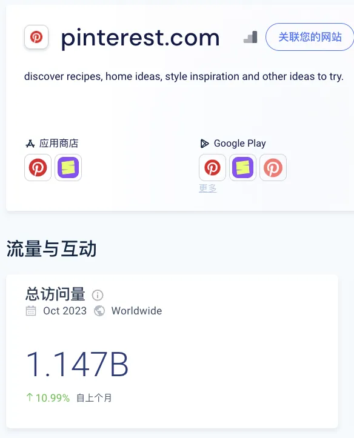
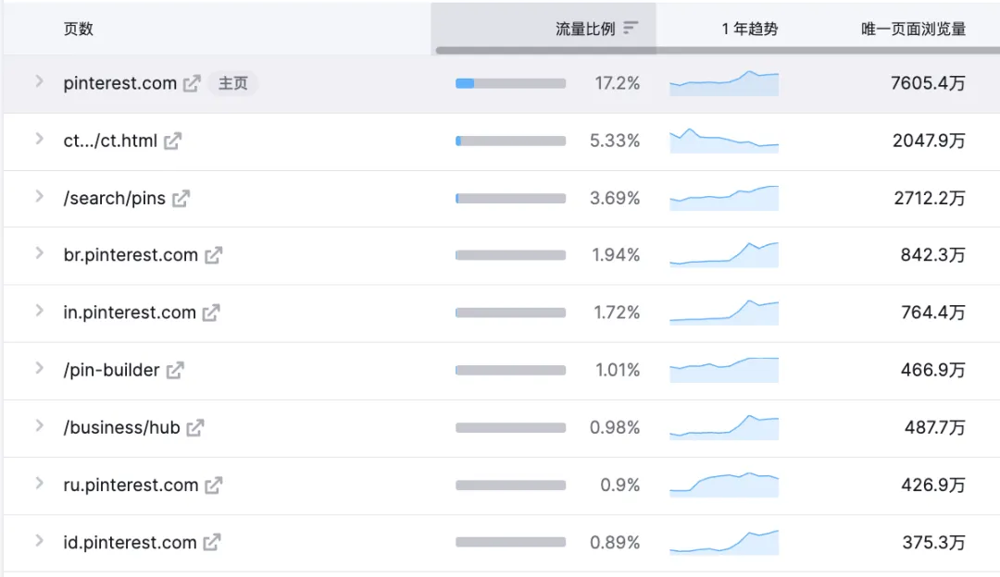
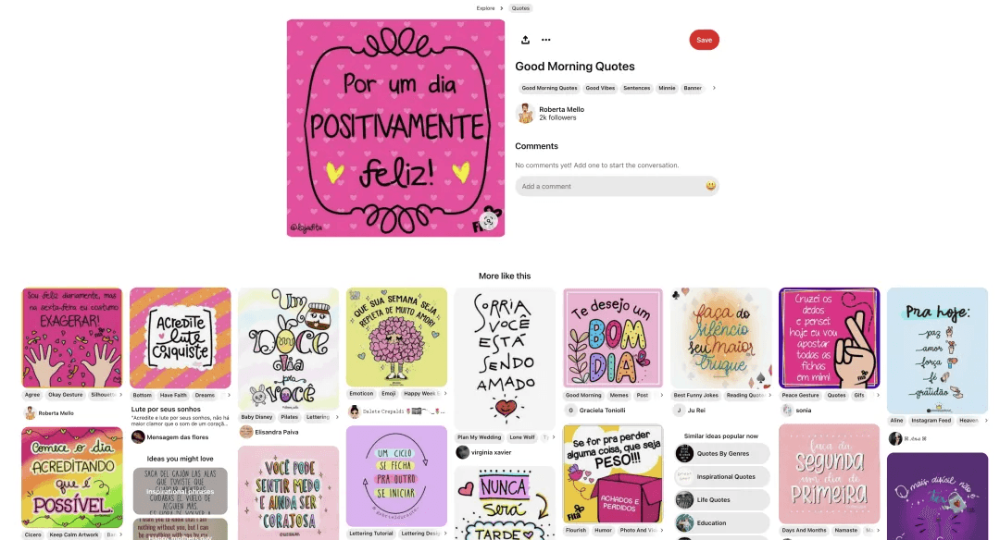
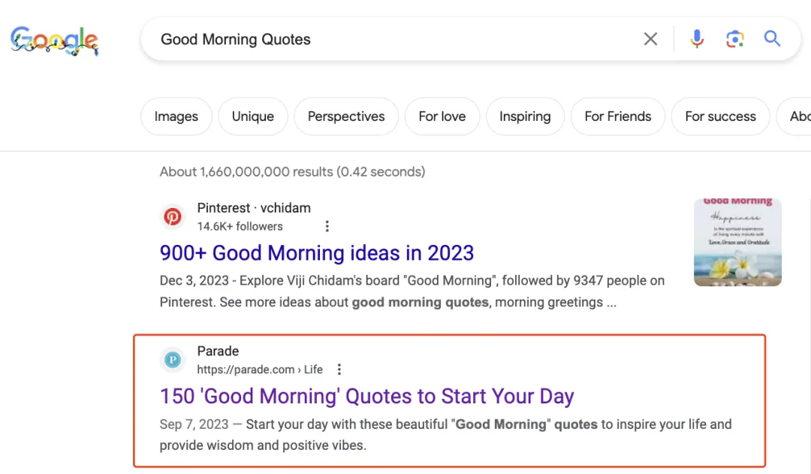
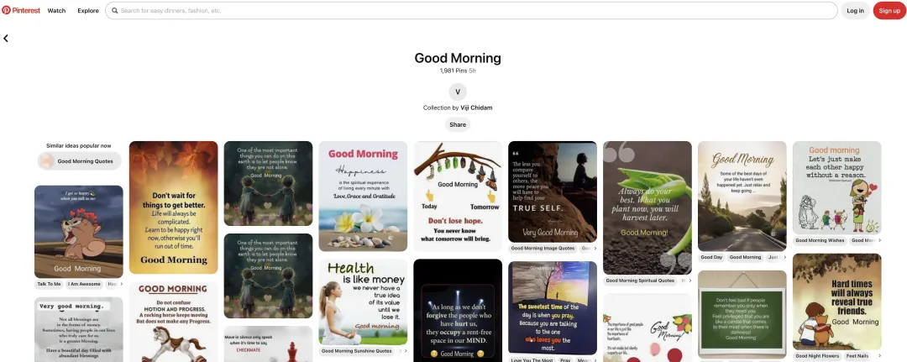
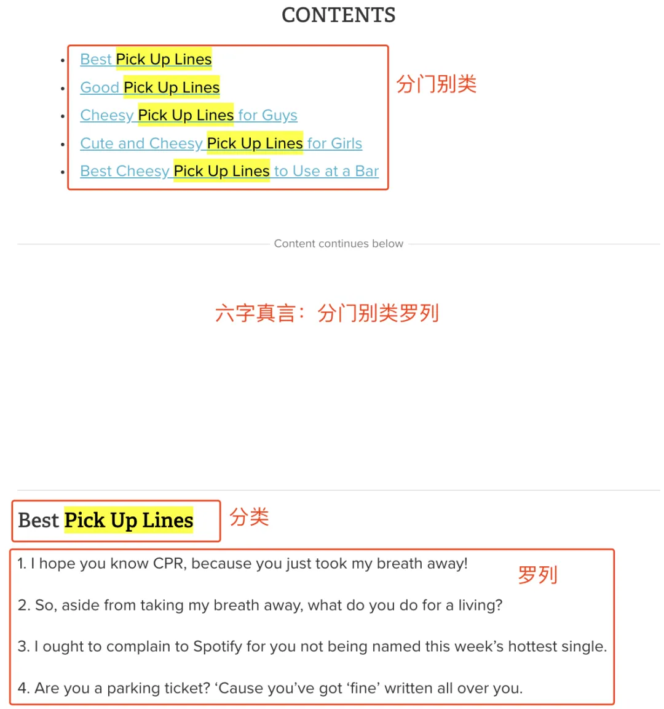
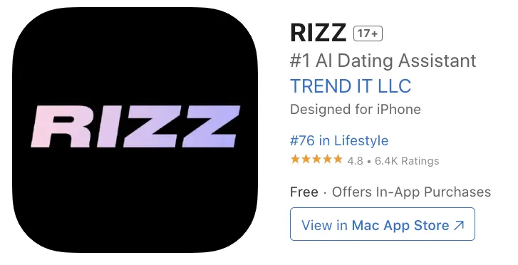

大家好，我是哥飞。

今天给大家分享一个月访问量 3000 多万的网站中的一个内页，仅仅这个内页每个月就能从搜索引擎获取 100 万的访问量。

有个 3 人小团队，基于这个页面的需求，做了一个 App，现在月收入已经有 12 万美金了。请看下图，有图为证。

在分享网站页面之前，哥飞会把如何发现这个页面的过程完整的告诉大家，让大家以后自己也可以这样去发现更多有流量的网站。

事情要先从 Pinterest.com 说起，这个图片分享社区月访问量已经达到了 11 亿，太牛了。最近哥飞在研究这个网站，看看都是从哪些页面获取流量的。

这就需要用到 Semrush.com 的 Traffic Analytics 功能，我们输入 Pinterest.com，点击主要页面，就可以看到所有的带来流量的页面。

可以看到流量排名前几名的都是首页，这种不具有参考意义，所以我们需要拉到底下翻页，一页一页去看。

看到第三页的时候，终于发现具体的页面了。这些页面一个一个点进去看，看看都是什么页面，到底是什么需求。

打开红色框出来的页面，长下面这样，关于 "Good Morning Quotes"，即早安问候语的。

当时哥飞就想，看来全世界人民的喜好都差不多啊，国内的"小来早晚安"公众号篇篇 10 万+，国外则是 Good Morning Quotes 需求大。

于是哥飞就去谷歌搜索这个关键词，结果如下。

第一名是 Pinterest 的页面，长下面这样，有没有发现，跟上面哥飞截图的不是同一个页面，也就是说，相同的关键词，可以有多个关键词变种，每一个都可以有一个页面来获取流量。

第二名长下面这样。

哥飞遇到每一个网站，都会去查一下访问量，结果一查吓一跳，这个网站居然月访问量 3000 多万，即使去重后也有 2059 万。

后来哥飞去了解了一下，这是美国发行量最大的健康杂志《Parade》的官网，不仅杂志内容丰富，网站内容也丰富多彩。

这个网站上线已经快要 30 年了，是不是就是哥飞说的《[养网站防老：网站可以做成一生的事业](https://mp.weixin.qq.com/s/URcdE3VaoYoAx0cOcll8_g)》。

于是哥飞又去查了这个网站访问量靠前的网页有哪些。

访问量第一的页面，就是今天哥飞要给大家介绍的页面，仅仅这一个页面，每个月就能够从搜索引擎拿到 118 万的流量。

谷歌真是大慈善家，对于优质内容从不吝啬流量，为什么谷歌愿意给流量呢，哥飞之前写了《[哥飞解读：Adsense 生态是谷歌的胜利](https://mp.weixin.qq.com/s/O5vsGGn7Vq_x7smI8OODOw)》来分析，大家可以点过去看。

说回刚才的页面，长下面这样。

这个网页的内容优化也用到了哥飞之前讲过的站内页面优化六字真言"分门别类罗列"。

这个页面的主关键词是 "Pick Up Lines"，可以理解为土味情话。

有个名叫 Rizz 的 AI App 就是主打这个功能的，月收入 10 万+ 美元了。

| TREND IT LLC | Trendlt |
| --- | --- |
|  |  |

从 Rizz 官网可以看到他们的创业故事：

有了 GPT 的加持后，他们 3 人的小团队，就可以做这么一个月收入 12 万美金的 App，各位正在看哥飞文章的大家，是否也可以呢？

## 留言

- **LFT** · 2025-07-01 14:38
  > 有时候找到合适的词了，但是语言问题理解不了词的意思，理解不了用户搜索本意，这个怎么破呢

- **欲买桂花同载酒** · 2025-08-18 17:12
  > 问 ai

- **尖椒干豆腐大师** · 2025-10-06 18:04
  > 问问 GPT 呗 让他帮忙理解理解

- **甜瓜** · 2026-03-29 14:16
  > 问 CC

- **阿木子三不知** · 2025-07-08 19:39
  > 打卡，按着哥飞教程多操作，多看。

- **小楼** · 2025-07-23 09:47
  > 打卡

- **\- . -** · 2025-08-20 18:28
  > 哇 pickuplines，翻译一下才知道他的含义——搭讪金句，像这种如果不是熟知他们表达习惯的，感觉单看也不知道是这个意思

- **大林** · 2025-10-19 21:58
  > 当年，PUA 的意思，还是 Pick Up Artist 搭讪达人的意思呢，现在含义国内被泛化太多了……

- **老荀** · 2025-09-23 19:40
  > 打卡

- **swimming** · 2025-09-24 16:18
  > 打卡

- **tison** · 2025-09-25 09:15
  > 打卡

- **班纳** · 2025-10-09 08:13
  > 1

- **陈浩填** · 2025-10-09 12:59
  > 打卡

- **经纬** · 2025-10-15 10:48
  > 打卡

- **楠木** · 2026-01-05 13:17
  > 打卡

- **秋天 | AI探索者** · 2026-01-18 23:31
  > 打卡

- **Shrek☀** · 2026-01-27 11:22
  > 打卡

- **陈慧\_Vera** · 2026-04-28 21:15
  > 打卡

- **简语** · 2026-05-22 22:57
  > 打卡

- **Jimmy sunshine** · 2026-07-04 09:54
  > 打卡
