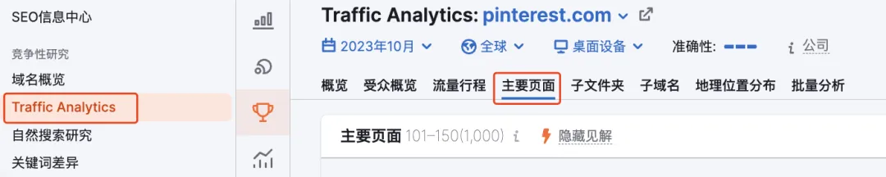
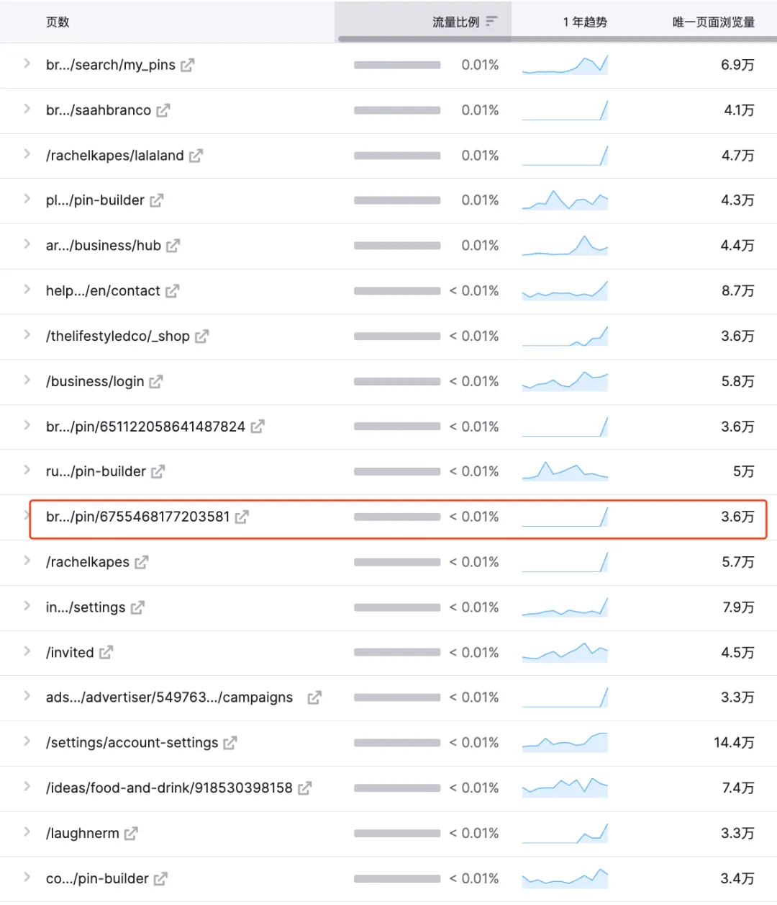
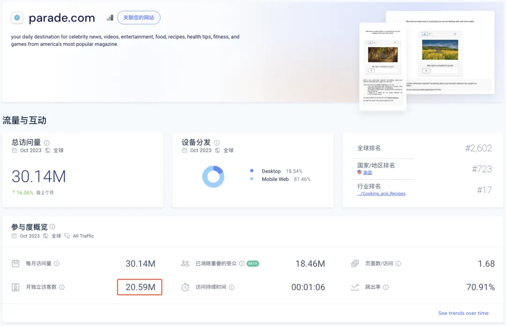
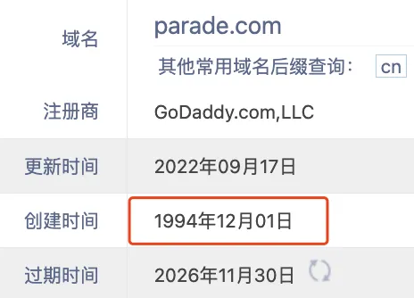
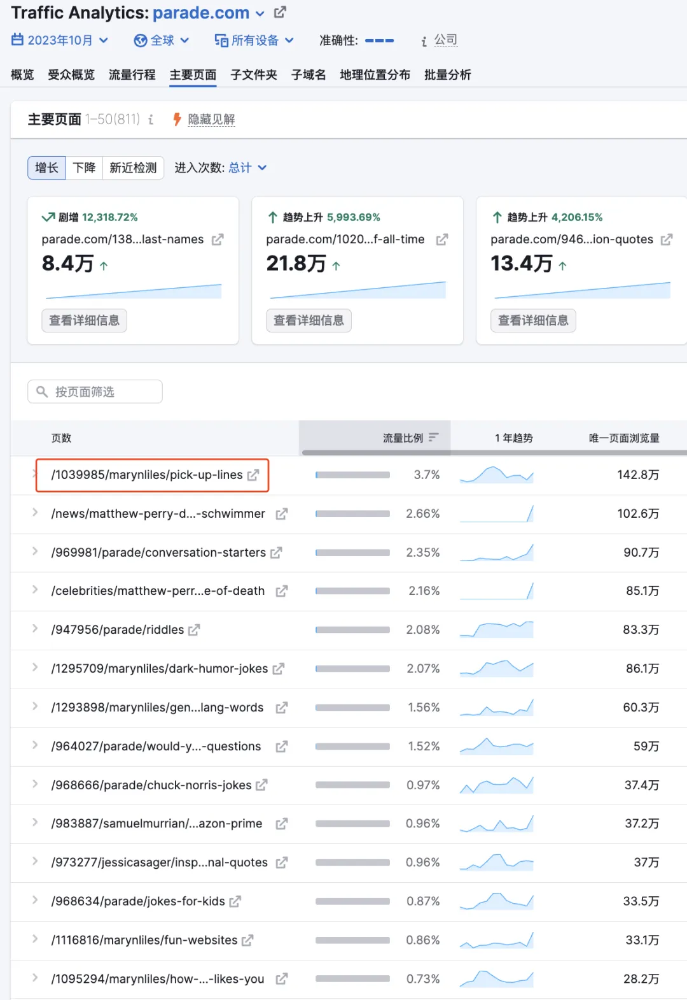
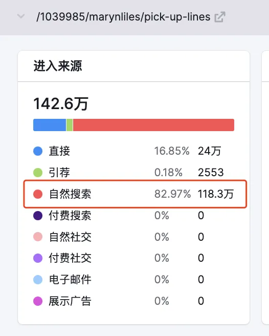
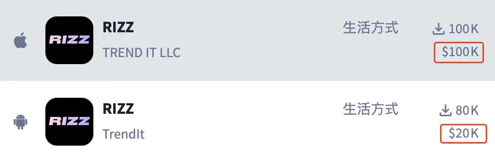
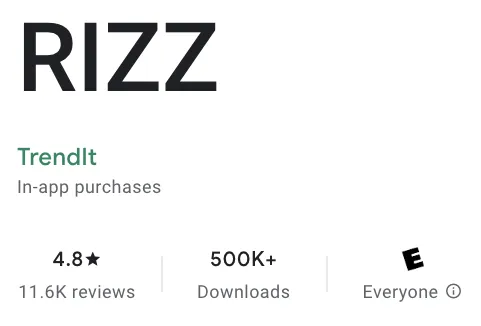
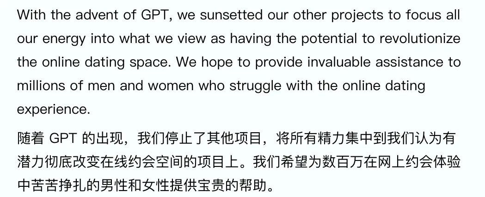

哥飞2024-08-12 15:54

挖掘需求

## 挖掘需求

# 某个月访问量3000多万的网站里有个月访问量118万的页面，有人基于这个页面的需求做了个月收入12万+美金的AI App

收藏

大家好，我是哥飞。

今天给大家分享一个月访问量3000多万的网站中的一个内页，仅仅这个内页每个月就能从搜索引擎获取100万的访问量。

有个3人小团队，基于这个页面的需求，做了一个App，现在月收入已经有12万美金了。请看下图，有图为证。  在分享网站页面之前，哥飞会把如何发现这个页面的过程完整的告诉大家，让大家以后自己也可以这样去发现更多有流量的网站。

事情要先从 Pinterest.com 说起，这个图片分享社区月访问量已经达到了11亿，太牛了。最近哥飞在研究这个网站，看看都是从哪些页面获取流量的。  这就需要用到 Semrush.com 的 Traffic Analytics 功能，我们输入 Pinterest.com ，点击主要页面，就可以看到所有的带来流量的页面。  可以看到流量排名前几名的都是首页，这种不具有参考意义，所以我们需要拉到底下翻页，一页一页去看。  看到第三页的时候，终于发现具体的页面了。这些页面一个一个点进去看，看看都是什么页面，到底是什么需求。  打开红色框出来的页面，长下面这样，关于“Good Morning Quotes”，即早安问候语的。  当时哥飞就想，看来全世界人民的喜好都差不多啊，国内的“小来早晚安”公众号篇篇10万+，国外则是Good Morning Quotes需求大。

于是哥飞就去谷歌搜索这个关键词，结果如下。  第一名是 Pinterest 的页面，长下面这样，有没有发现，跟上面哥飞截图的不是同一个页面，也就是说，相同的关键词，可以有多个关键词变种，每一个都可以有一个页面来获取流量。  第二名长下面这样。  哥飞遇到每一个网站，都会去查一下访问量，结果一查吓一跳，这个网站居然月访问量3000多万，即使去重后也有2059万。  后来哥飞去了解了一下，这是美国发行量最大的健康杂志《Parade》的官网，不仅杂志内容丰富，网站内容也丰富多彩。  这个网站上线已经快要30年了，是不是就是哥飞说的《[养网站防老：网站可以做成一生的事业](https://mp.weixin.qq.com/s/URcdE3VaoYoAx0cOcll8_g)》。

于是哥飞又去查了这个网站访问量靠前的网页有哪些。  访问量第一的页面，就是今天哥飞要给大家介绍的页面，仅仅这一个页面，每个月就能够从搜索引擎拿到118万的流量。  谷歌真是大慈善家，对于优质内容从不吝啬流量，为什么谷歌愿意给流量呢，哥飞之前写了《[哥飞解读：Adsense 生态是谷歌的胜利](https://mp.weixin.qq.com/s/O5vsGGn7Vq_x7smI8OODOw)》来分析，大家可以点过去看。

说回刚才的页面，长下面这样。  这个网页的内容优化也用到了哥飞之前讲过的站内页面优化六字真言“分门别类罗列”。  这个页面的主关键词是“Pick Up Lines”，可以理解为土味情话。 有个名叫 Rizz 的 AI App 就是主打这个功能的，月收入10万+美元了。

| TREND IT LLC | Trendlt |
| --- | --- |
|  |  |

从 Rizz 官网可以看到他们的创业故事： 

 有了GPT的加持后，他们3人的小团队，就可以做这么一个月收入12万美金的App，各位正在看哥飞文章的大家，是否也可以呢？

[上一篇: 以月访问量1.75亿的Character.ai为例，哥飞教你如何挖掘大流量网站的新流量机会](https://new.web.cafe/tutorial/detail/1afYY3YjTnWv4gaLG6Hhxi)[下一篇: 如果你做AI工具没灵感，可以来这里：一个让你可以找到真实AI需求的地方](https://new.web.cafe/tutorial/detail/jKVAYNoDeKfe6yWm2mqDUA)

评论区

-   

    LFT

    2025-07-01 14:38

    回复

    有时候找到合适的词了，但是语言问题理解不了词的意思，理解不了用户搜索本意，这个怎么破呢

    

    欲买桂花同载酒

    2025-08-18 17:12

    回复

    问 ai

    

    尖椒干豆腐大师

    2025-10-06 18:04

    回复

    问问GPT呗 让他帮忙理解理解

    

    甜瓜

    2026-03-29 14:16

    回复

    问CC

-   

    阿木子三不知

    2025-07-08 19:39

    回复

    打卡，按着哥飞教程多操作，多看。

-   

    小楼

    2025-07-23 09:47

    回复

    打卡

-   

    \- . -

    2025-08-20 18:28

    回复

    哇pickuplines，翻译一下才知道他的含义——搭讪金句，像这种如果不是熟知他们表达习惯的，感觉单看也不知道是这个意思

    

    大林

    2025-10-19 21:58

    回复

    当年，PUA的意思，还是 Pick Up Artist 搭讪达人 的意思呢， 现在含义国内被泛化太多了……

-   

    老荀

    2025-09-23 19:40

    回复

    打卡

-   

    swimming

    2025-09-24 16:18

    回复

    打卡

-   

    tison

    2025-09-25 09:15

    回复

    打卡

-   

    班纳

    2025-10-09 08:13

    回复

    1

-   

    陈浩填

    2025-10-09 12:59

    回复

    打卡

-   

    经纬

    2025-10-15 10:48

    回复

    打卡

-   

    楠木

    2026-01-05 13:17

    回复

    打卡

-   

    秋天 | AI探索者

    2026-01-18 23:31

    回复

    打卡

-   

    Shrek☀

    2026-01-27 11:22

    回复

    打卡

-   

    陈慧\_Vera

    2026-04-28 21:15

    回复

    打卡

-   

    简语

    2026-05-22 22:57

    回复

    打卡

-   

    Jimmy sunshine

    2026-07-04 09:54

    回复

    打卡

添加图片添加隐藏回复

Web.Cafe

153 results

Use arrow keys ↑↓ to navigate

The action has been successful