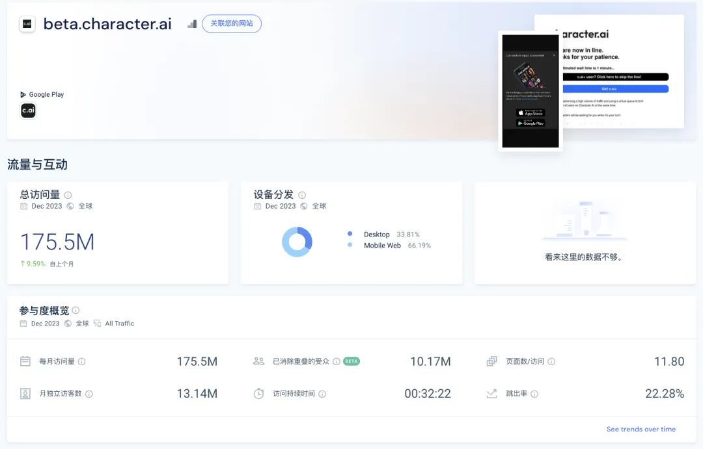
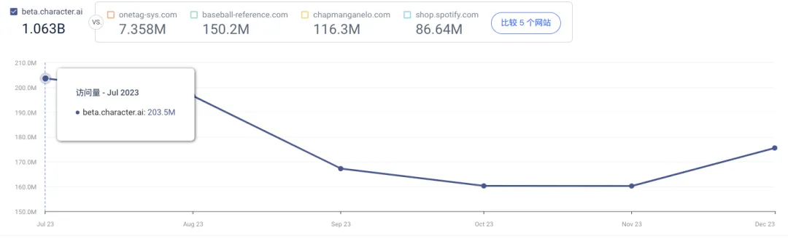
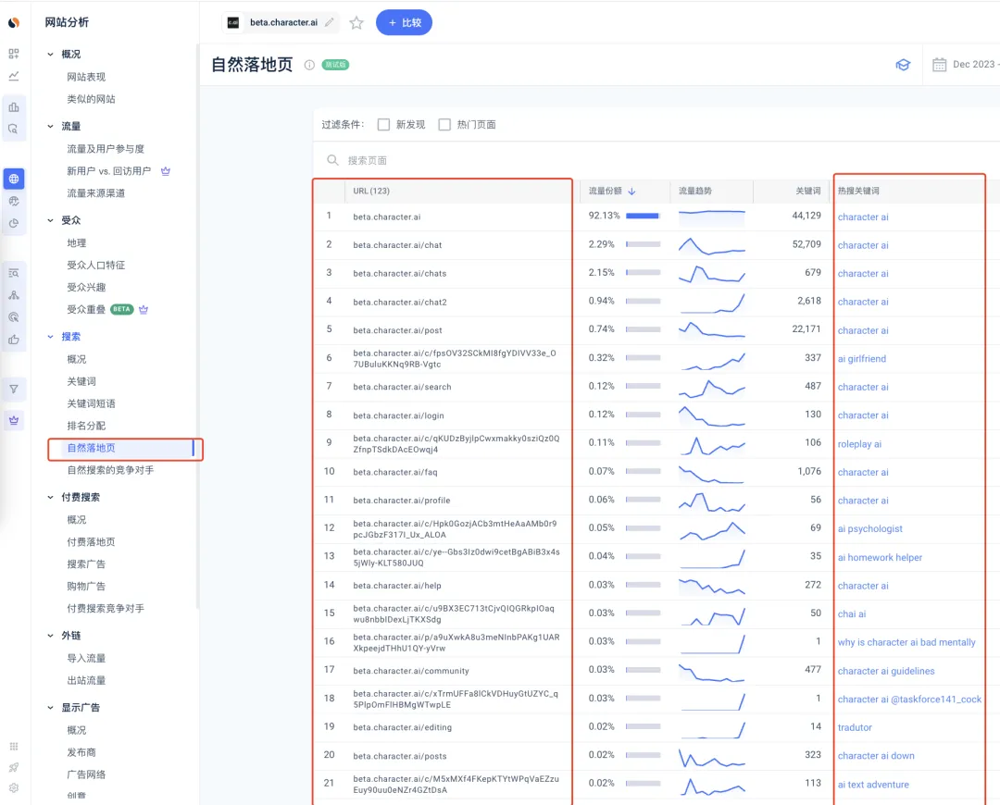
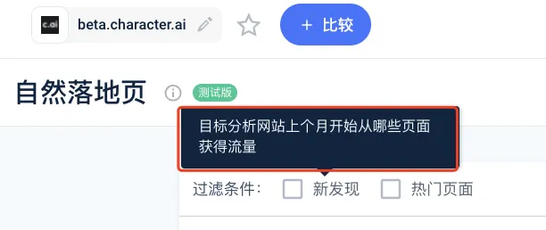
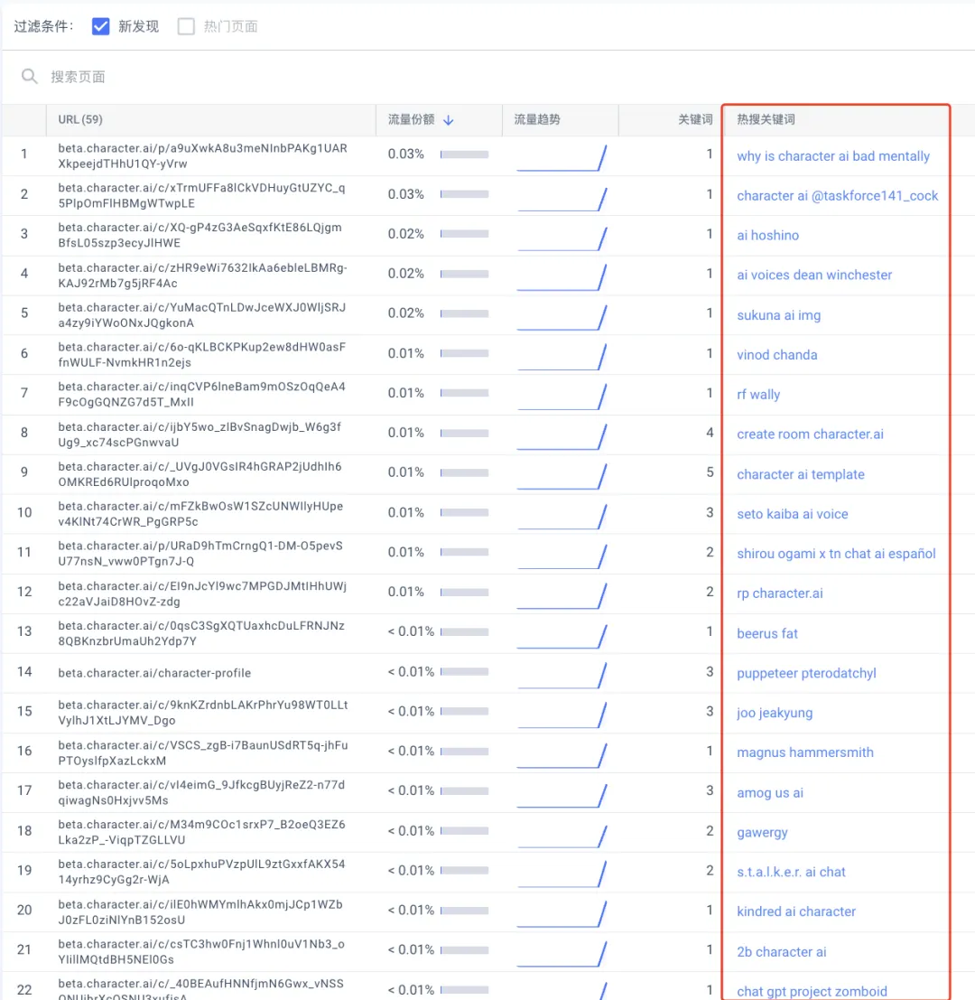
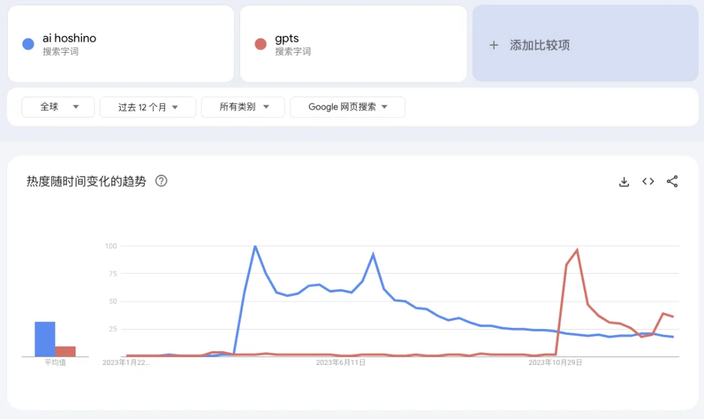
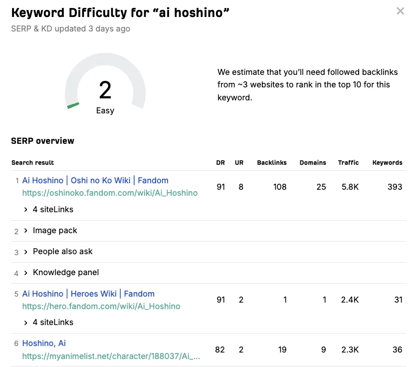
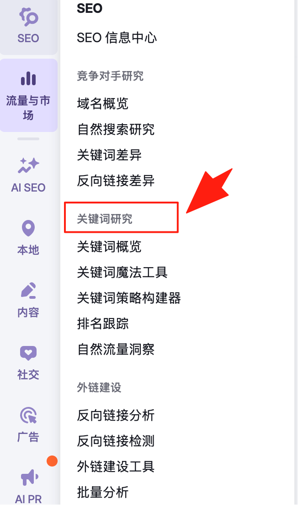

大家好，我是哥飞。

话说今天哥飞去看了 Character.ai 的流量，吓一跳，都这么高了，每月 1.75 亿访问量了。

如果看流量曲线会发现，这还是因为最近几个月流量下降了一些，之前月访问量超过了 2 亿。

那么大家肯定会好奇，这么多访问量，都在访问哪些页面呢？都是什么需求呢？

哥飞今天就带大家挖一挖。

打开 Similarweb 的"自然落地页"功能，就可以看到按照访问量从高到低排序的各个不同的页面。

可以看到前几个大流量页面的关键词都是品牌词，但是第 6、第 9 等页面就不是品牌词了。

其中第 6 解决的是 AI 虚拟女友需求，第 9 解决的是角色扮演 AI 需求。

这些页面都是老页面，哥飞今天先不继续分析了，大家可以自行去分析。

哥飞今天带着大家看新页面，鼠标放到"新页面"会有提示，说这些页面是从上个月开始有流量的页面。

这种页面才是哥飞希望大家关注的页面，因为新页面意味着新需求，新需求意味着竞争没有那么激烈，大家把这些需求单独做成一个网站，就更容易搞到流量。

我们勾选新页面，结果如下。

我们会发现获取这些页面获取流量几乎都只要一两个核心关键词。

我们拿第 3 名关键词"ai hoshino"来分析看看，先看谷歌趋势过去一年的走势图，会发现这个词搜索量并不低，差不多相当于"GPTs"的搜索量了。

再看这个词的优化难度，超级 easy，居然难度只有 2，而所需的外链网站数量只需要 3，也就是说，只要你拿这个关键词注册域名，做个网站专门优化这个关键词，只需要找三五个网站的外链，就能拿到谷歌首页排名结果了。

所以，用哥飞教你这个方法找关键词，是不是 so easy，一天找几十个关键词都不在话下。

其它的关键词类似，哥飞就不一一带着大家分析了，就当交给大家的家庭作业吧，大家自己去分析。

## 留言

- **人生旅行** · 2024-08-18 15:48
  > 这个应该比想象的难，仅仅靠外链是不行的。

- **Leovyx** · 2025-02-14 10:15
  > +1，不知道大家也没有衡量 kd 更准确的方式

- **(未署名)** · 2025-06-16 16:27
  > [https://aihoshino.com/](https://aihoshino.com/) 有人注册了 没做站吗，我访问不了

- **阿木子三不知** · 2025-07-08 19:10
  > 打卡

- **小楼** · 2025-07-23 09:43
  > 打卡

- **\- . -** · 2025-08-20 18:13
  > semrush 上好像没有这个功能，我在主要页面点击了新近检测，但是他并没有总结出关键词，这篇用 similarweb 比较方便

- **MR.ZY** · 2025-08-22 17:26
  > 在关键词研究 > 网站浏览工具 > 着陆页 中可以查看

- **汉宜** · 2025-09-18 17:40
  > MR.ZY
  > 好像关键词研究那里没有网站浏览工具这项？

- **L.King** · 2025-12-23 11:18
  > MR.ZY
  > 这说的还是 similarweb

- **Sigma** · 2025-09-19 08:11
  > 打卡

- **班纳** · 2025-10-10 08:06
  > 1

- **大林** · 2025-10-19 21:53
  > 原来是《我推的孩子》星野爱呀

- **楠木** · 2026-01-05 13:10
  > 打卡

- **FeiYing** · 2026-01-06 13:43
  > 打卡

- **秋天 | AI探索者** · 2026-01-18 22:55
  > 打卡，飞哥分享的那个功能现在是收费的了

- **陈慧\_Vera** · 2026-04-28 21:11
  > 厉害

- **简语** · 2026-05-22 22:54
  > 打卡
