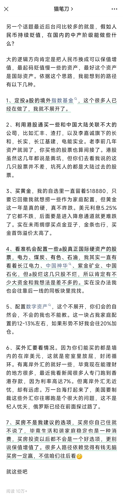

今天哥飞去东莞走亲戚了，所以没有写长文，就分享下大牛猫的一篇文章片段给大家。

大牛猫原文在这里：\`<\1>

文中大牛猫给中产提了一些实操性强的建议，有这个条件的可以照做。

哥飞想补充一点，对于我们来说，出海赚美元，应该是最适合我们的方案了。

大家撸起袖子加油干，尽快赚到人生中的第一个 100 美元，然后是 1000 美元，10000 美元。

这里说第一个 100 美元，是因为谷歌 Adsense 广告费是 100 美元起付。

广告变现是最简单，最傻瓜化的方式，只要能够搞到流量，然后在网站里放上谷歌 Adsense 代码就可以了。

不要给自己定门槛，不要想着等到多少用户多少流量才放广告，请在做好网站开始有流量时就去申请 Adsense 账号。

当然，三个月内注册的新域名，如果流量太低，很有可能会不给你审核通过。

所以这里哥飞给大家提个建议，如果你暂时不知道要做什么网站，那就先部署一个 Wordpress，写上十几篇原创博文，然后去申请 Adsense 账号，这样更容易通过。

以下是大牛猫建议截图，如果觉得有用请转发分享。

