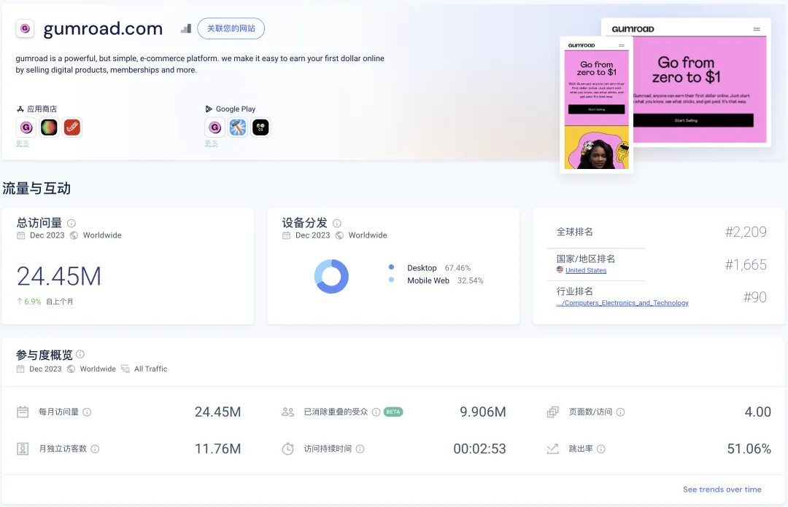
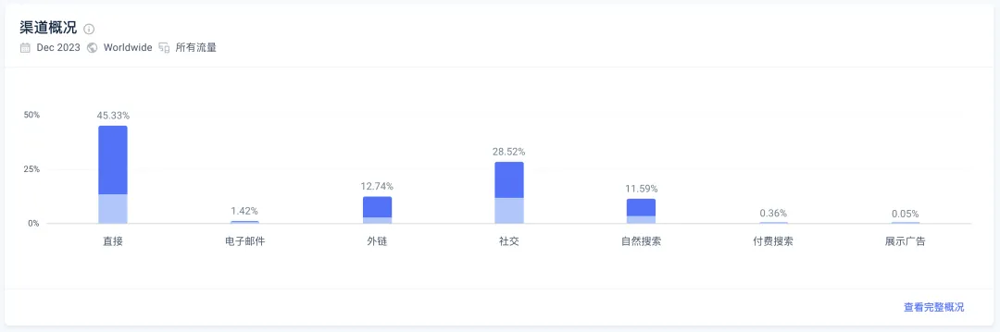
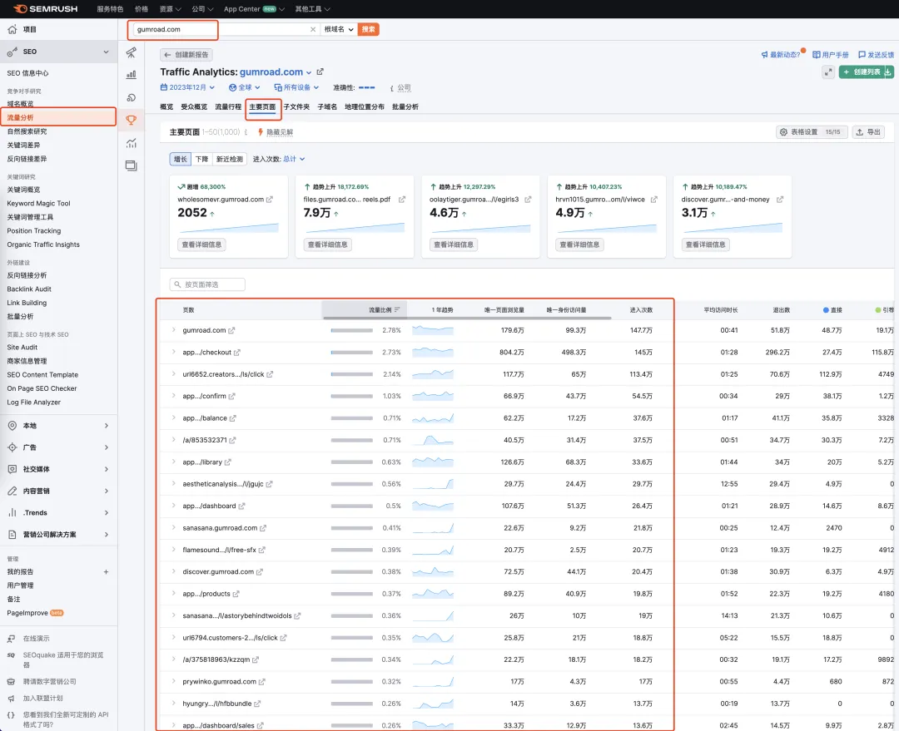
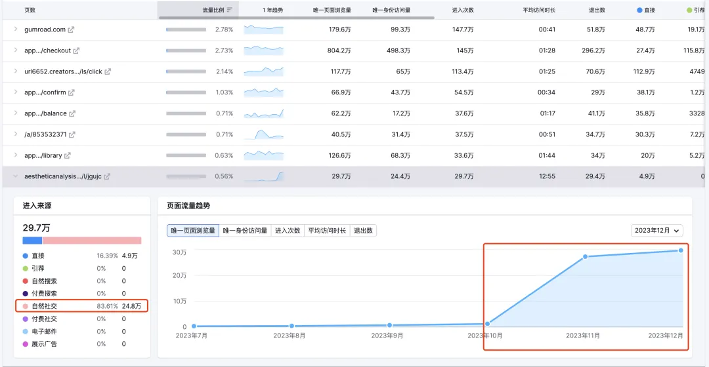
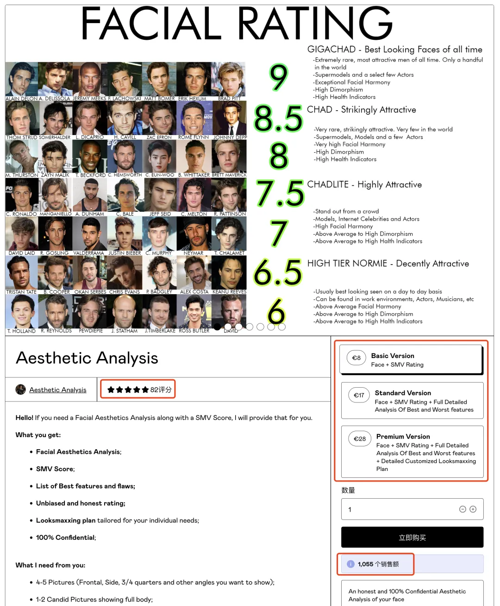
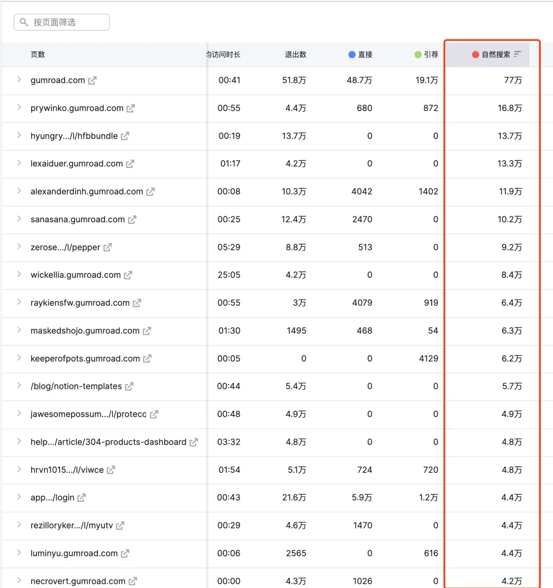
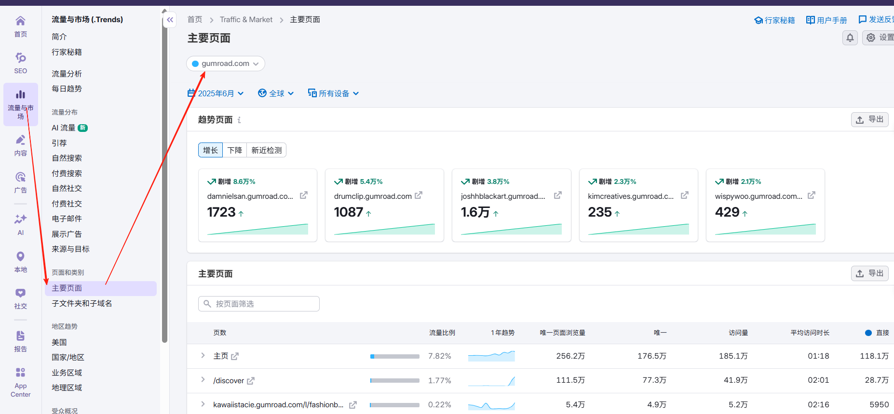

哥飞2024-08-12 15:40

挖掘需求

## 挖掘需求

# 哥飞教你通过分析月访问量2445万的 Gumroad 高流量页面来挖掘他人正在赚钱的需求

收藏

大家好，我是哥飞。

今天教大家使用 Semrush 的流量分析功能来挖掘正在赚钱的需求。

先介绍下 Gumroad ，这是一个海外虚拟产品销售平台，卖家简单设置就可以得到一个链接，然后到处去宣传推广，别人从链接点进去，就能够购买产品。  我们先看下 Gumroad 的流量数据，打开 Similarweb 可以看到，目前 Gumroad 月访问量是2445万，人均访问4个页面，平均停留时间接近3分钟。  主要流量来源是社交传播和外链，也即是卖家自发的宣传推广。再就是自然搜索，也就是说这些产品也是能够从谷歌等搜索引擎获取到流量的。 

打开 Gumroad 的发现页面，可以看到好多各种各样的商品。  那么怎么找到那些高流量的产品呢？

有一个办法是搞个爬虫去爬这些页面，然后把销量、评价、产品介绍信息等抓取下来，之后基于销量和评价排序，进行分析。

但如果我们想省事不想爬，或者我们不会写爬虫，那要怎么办呢？

哥飞今天就教大家这个方法，通过使用 Semrush ，查看 Top Pages 的方法，就能把这些高流量页面给找出来。

之后就能找到正在赚钱的产品了，然后再去分析这些产品解决了什么需求，我们是否可以做一个产品来满足同样的需求。

方法很简单，打开 Semrush ，输入 Gumroad.com ，点击流量分析，点击主要页面，然后就可以针对查询出来的结果进行分析了。  哥飞拿几个页面给大家做个示范，这里边有一些是 Gumroad 的网站功能页面，我们忽略掉，往下看，看到第9个，展开之后可以看到，主要流量来自于社交平台，从10月份才开始有流量的，11月就到了二十多万访问量。  我们打开这个页面看一看，原来是卖颜值打分服务的。  最低8欧元，还有17欧元和28欧元的套餐，总共卖了1055份，假设平均10欧元算，总共卖了10550欧元，也就是8.2万人民币左右。

刚才我们看到了，这个网页其实是11月、12月才开始有流量的，10月还几乎是零流量，目前1月份也过去12天了，我们可以算出这个页面的总流量是27.3+29.7+10=67万左右。

假如我们的网站只放广告，67万访问量，按照这篇文章《[如何快速估算一个网站的Adsense广告收入？](https://mp.weixin.qq.com/s/Zt6QQVaGtqWbKPjHjjO5gw)》教的方法估算，大概收入是67_10_2\*2=2680美元，也就是大约1.9万人民币。 从这里就可以看出来，为什么我们的网站不能仅仅靠广告赚钱了，通过用户付费，可以赚8.2万，通过广告只能赚1.9万，差距很明显了。

那么我们是否可以基于这个需求去做网站赚钱呢？

不知道大家还记不记得十几年前在微博大火的留几手，他火起来就靠的是给人颜值打分。

也就是说，颜值打分这个需求其实是长期存在的，以前需要靠人工打分，现在可以靠AI来打分了。 那么要怎么快速做一个可以AI打分的小工具呢？

欢迎加哥飞微信 qiayue ，哥飞告诉你一个开源项目，拿过来自己部署好，改改提示词就能用。

除了哥飞带着大家看的这个页面，剩下的页面，大家也可以继续去一一查看，一一分析。

刚才的页面主要流量来自于社交网络分享，如果我们想知道主要流量来自于搜索引擎的页面，要怎么办呢？

我们回到 Gumroad 的流量页面列表，选择按照“自然搜索”从高到低排序，就能够找到了。  这些页面，大家可以自己去看，哥飞就不给大家演示了。

[上一篇: 51个挖掘需求时能用得上的财富密码关键词哥飞免费赠送给大家](https://new.web.cafe/tutorial/detail/2kk1hukGPXDZfr6Ra5Ciiy)[下一篇: 以月访问量1.75亿的Character.ai为例，哥飞教你如何挖掘大流量网站的新流量机会](https://new.web.cafe/tutorial/detail/1afYY3YjTnWv4gaLG6Hhxi)

评论区

-   

    东

    2025-05-27 14:03

    回复

    为什么我看到的流量分析的页面不一样？

-   

    2025-06-16 15:53

    回复

    时间久了，这商店的都不卖了

-   

    maktub.

    2025-06-16 21:19

    回复

    好多方法都开始收费了。打开 Semrush ，输入 Gumroad.com ，点击流量分析，点击主要页面，然后就可以针对查询出来的结果进行分析了。

    

    陈鹏

    2025-12-03 20:26

    回复

    淘宝的semrush套餐也是区分是否带 traffic analysis的。我买的就没有

-   

    LFT

    2025-07-01 14:05

    回复

    好思路

-   

    阿木子三不知

    2025-07-08 16:56

    回复

    打卡，Semrush后台改版的现在不知道怎么看文章中演示的操作了。

    

    殷小样

    2025-07-20 20:59

    回复

    打开 semrush，点击「流量与市场」➡️「主要页面」，输入 gumroad.com

    

    金鱼Evan

    2025-07-27 12:31

    回复

    殷小样

    感谢

    

    PeacePower

    2025-08-17 09:03

    回复

    殷小样

    感谢，我也是自己这样摸索出来。刚在另外一个帖子里回了，和你一模一样。哈哈

    共 4 条回复，展开查看

-   

    小楼

    2025-07-23 09:43

    回复

    打卡

-   

    \- . -

    2025-08-20 17:56

    回复

    通过Gumroad这种大的产品平台去挖掘新产品和新需求确实不错，只是也引发了一个思考，谷歌搜索结果只能有一个第一，除了竞争以外，应该尝试找找其他的市场，还有推广的空间；

-   

    班纳

    2025-10-10 08:08

    回复

    1

-   

    经纬

    2025-10-15 09:46

    回复

    打卡

-   

    楠木

    2026-01-05 13:06

    回复

    打卡

-   

    墨白

    2026-01-16 17:10

    回复

    打卡

-   

    陈慧\_Vera

    2026-04-28 21:08

    回复

    好思路

-   

    简语

    2026-05-21 23:13

    回复

    打卡

-   

    Jimmy sunshine

    2026-07-04 09:37

    回复

    打卡

添加图片添加隐藏回复

Web.Cafe

153 results

Use arrow keys ↑↓ to navigate

