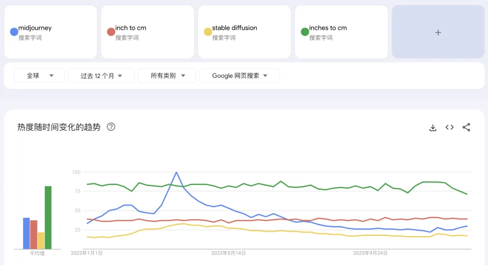
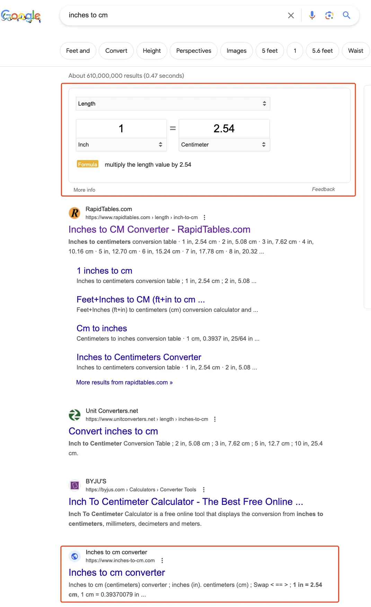
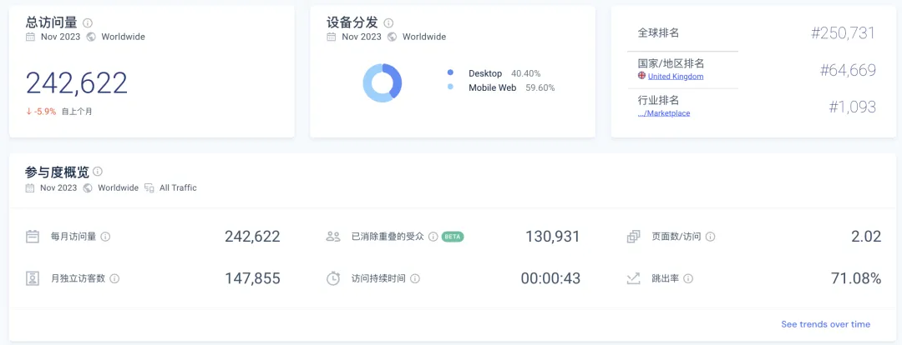
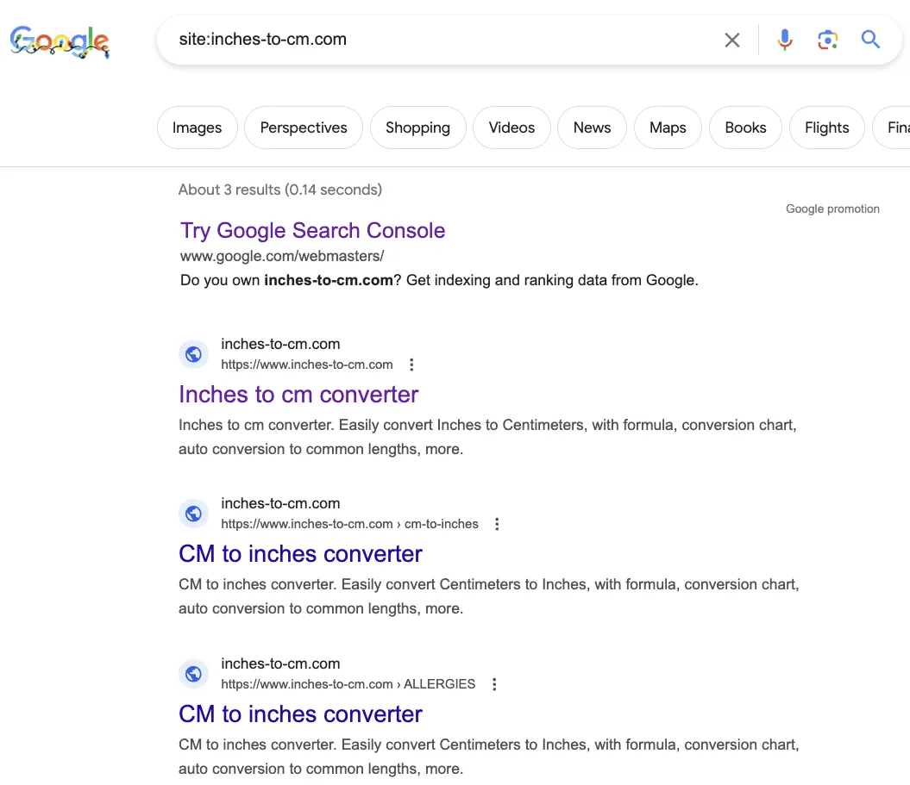
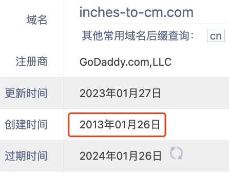
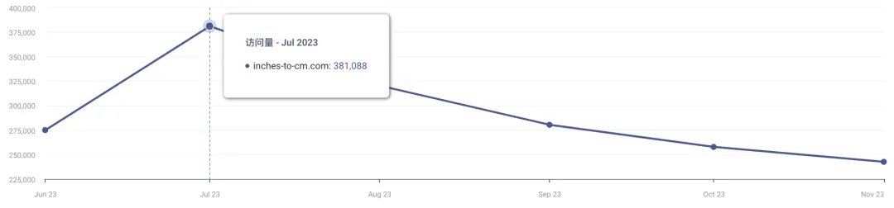
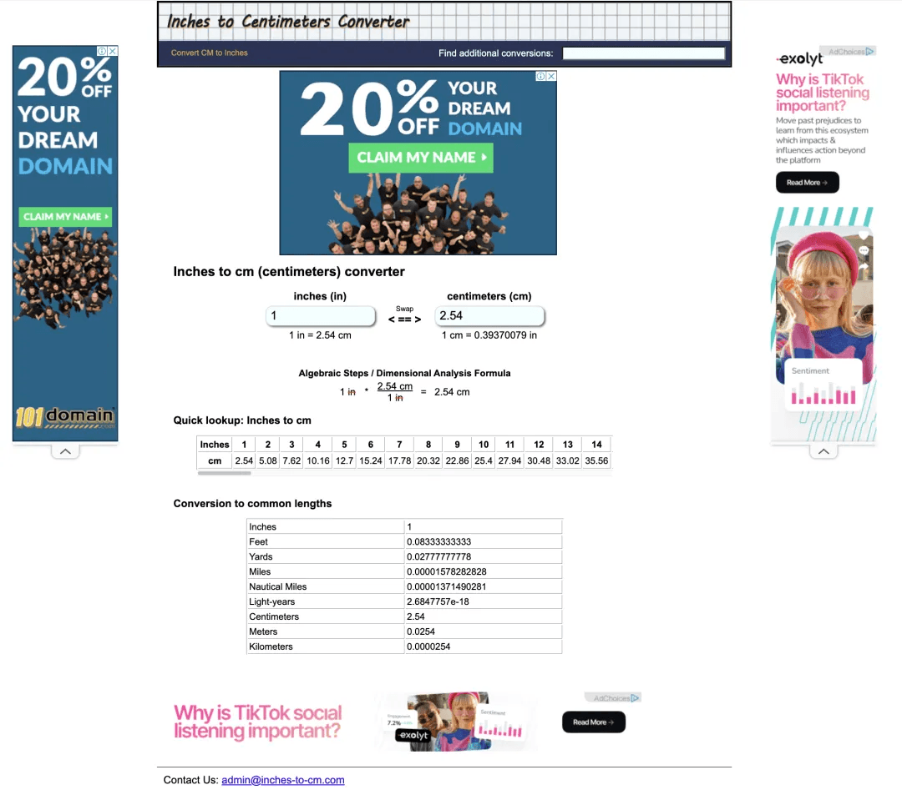
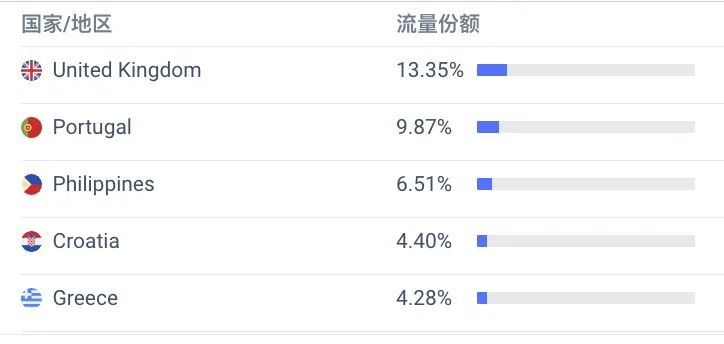
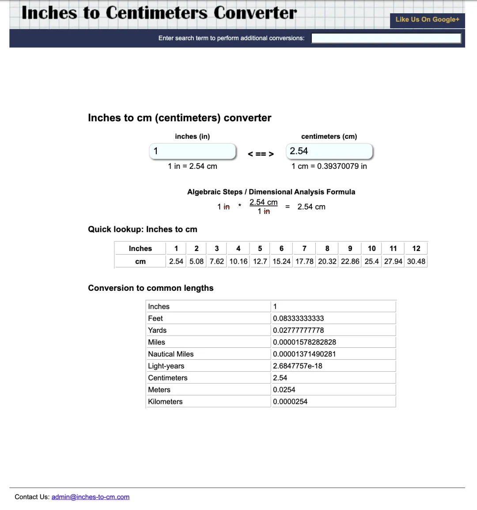
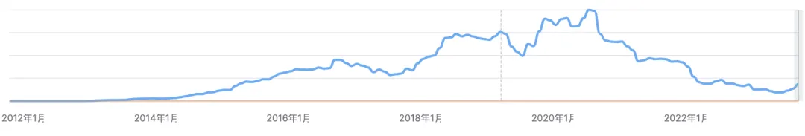

大家好，我是哥飞。

废话不多说，先看下图，哥飞今天要给大家分享的这个关键词是 "inches to cm" 和 "inch to cm"，可以看到在这两个词面前，Midjourney 和 Stable Diffusion 都甘拜下风。

其实 "inches to cm" 和 "inch to cm" 可以认为是同一个词，因为解决的需求是一样的，都是英寸到厘米的转换。

我们在谷歌搜索看看这两个词的搜索结果：

在搜索框的下方直接出现了功能卡片，满足了用户需求。

还记得哥飞之前这篇文章《[利用 Semrush 找有一定搜索量且竞争小的关键词时容易遇到的一些陷阱](https://mp.weixin.qq.com/s/r0H48GssICrKbP8YePIuqw)》吗？

这种词，其实可以认为是陷阱词。

但是呢，不是所有的陷阱词都不能做，还是要看搜索量的。

我们先看下搜索结果中出现的 inches-to-cm.com 的流量，月访问量 24 万，虽然不是特别大，但是也还不错了。

而这个站，其实谷歌才收录 3 个页面，几乎可以认为就是单页网站了。

域名是 2013 年注册的，到现在 10 年了。

有时候流量高时，还能到达 38 万的月访问量。

我们按照《[如何快速估算一个网站的 Adsense 广告收入？](https://mp.weixin.qq.com/s/Zt6QQVaGtqWbKPjHjjO5gw)》介绍的方法估算一下广告收入。

这个网页上有 4 个广告位，而且每次打开几乎全部广告位都会被展示出来，我们就假设每个 PV 能够产生 4 个广告展示。

24 万的访问量，我们假设有 25 万个 PV，那么乘以 4，就是 100 万的广告展示，也就是 1000 个 ECPM。即使按照 1 美元的广告单价来算，一个月也有 1000 美元广告收入，也就是 7000 多人民币。

而实际这个网站主要流量来自于英国、葡萄牙等，广告单价会更高，所以月收入过万人民币是有可能的。

哥飞在 archive 上找到了这个网站 2013 年 2 月 8 日上线的第一版网站，跟现在是不是很像？

也就是说，这个网站做了 10 年了，但是代码几乎没怎么改过，自然也就不需要做什么维护工作了。

下图是从 Semrush 看到的这个网站的历年流量曲线，2013 年 2 月上线后，流量一直在上升，之后虽然在下降，但是 2015 年的 5 月流量就跟 2023 年 12 月差不多了。

也就是说，每个月 1 万元的广告收入，也许他已经领了 8 年了，估计加起来，这个网站给他带来了 100 万人民币的收入了。

这就是哥飞之前说的《[养网站防老：网站可以做成一生的事业](https://mp.weixin.qq.com/s/URcdE3VaoYoAx0cOcll8_g)》。

好了，这就是哥飞今天想跟大家分享的，跟着大流量的关键词，即使排名没到前三，也可以吃到不错的汤水。

\`<\1>
