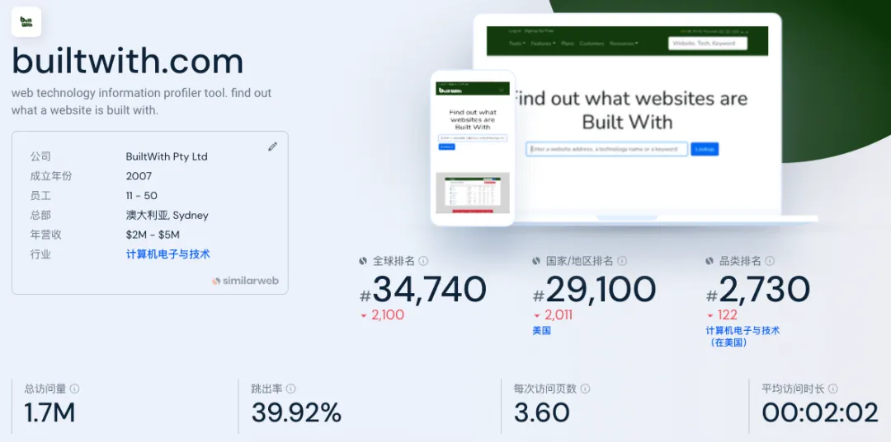
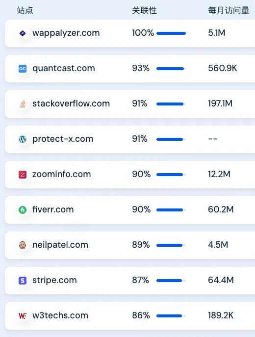
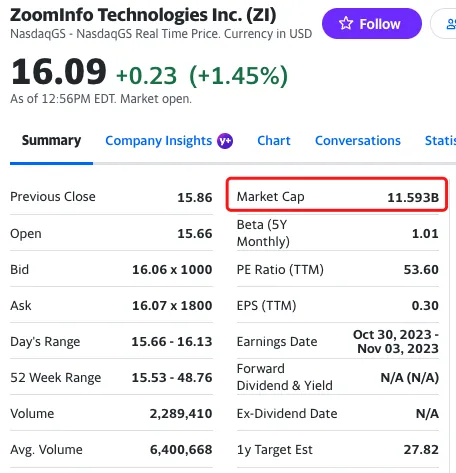
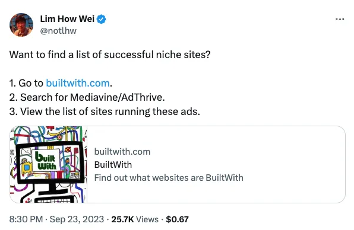
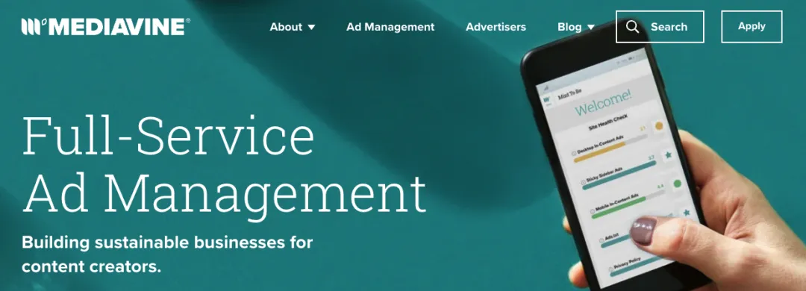
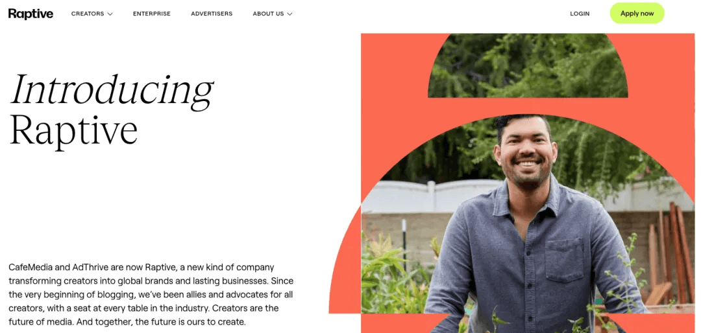

大家好，我是哥飞。

2022 年 10 月，上面截图这篇文章的中文版本，在开发者圈子里刷屏了，估计好多人都看过了。

所以哥飞今天不给大家翻译全文了，我们基于这篇文章聊聊为什么这个网站这么赚？

如果你对原文感兴趣，可以打开这个链接查看 \`<\1>。

文章说的是 BuiltWith.com 这个网站，年收入 1400 万美元，但其实只有一个员工，就是创始人自己。

我们先用 Similarweb 看下这个网站的流量，月访问量 170 万，这流量也不高啊，怎么就那么赚钱呢？

我们看下相似网站，就能够知道答案了。哥飞先考考你，看到下面这张图片，你找到答案了吗？给你 30 秒思考。

好了，30 秒思考结束，哥飞公布答案，看到月访问量 1220 万的 zoominfo.com 了吗？这就是 BuiltWith 赚钱的秘密。

如果你还不知道答案，看看 ZoomInfo 的股市数据就知道了，市值 11.593B，也就是 115.93 亿美元。

你可能会问了，ZoomInfo 的市值跟 BuiltWith 有什么关系？

刚才我们从哪里看到 ZoomInfo 的？从 BuiltWith 的相似站点看到的。

这说明什么？

这说明 BuiltWith 做的也是卖销售线索的生意，因为用户可以通过 BuiltWith 找到潜在的顾客信息，所以用户才愿意为 BuiltWith 付费。

英文原文是这么形容 BuiltWith 的：

> a database of potential customers and leads

翻译成中文是：

> 一个潜在客户和销售线索的数据库

这就是 BuiltWith 赚钱的原因。

看完上面哥飞的解释，你可能还是不太了解，刚好前几天有个推特可以用来放在这里解释一下 BuiltWith 的价值。

> 如何寻找成功的利基站点？
> 1. 打开 BuiltWith.com
> 2. 搜索 Mediavine / AdThrive
> 3. 查看所有用了 Mediavine 或者 AdThrive 的网站

哥飞给大家解释下，Mediavine 和 AdThrive 都是帮助内容创作者通过数字广告获取收入的公司，另外说下 AdThrive 与 CafeMedia 合并后成立了新品牌 Raptive，所以你搜索时还可以搜索 Raptive。

也就是说，因为网站放置了 Mediavine 或者 AdThrive 的广告代码，就表明网站能赚钱，那么我们找到这些网站，就能够去找到这些赚钱的网站，然后去模仿。

同理，你也可以去找找哪些网站放置了 adsense 的广告代码，哪些网站放置了 Stripe 收款代码，哪些网站放置了 Buy Me Coffee 代码……

当然，这只是 BuiltWith 的价值之一，事实上基于 BuiltWith 统计的数据，可以挖掘很多信息出来，所以那些销售们才愿意花钱去购买 BuiltWith 的服务。

那么 BuiltWith 开发起来麻烦吗？

其实技术并没有多少难度，事实上任何一个有两三年以上工作经验的后端开发人员都可以开发出来，无非就是用爬虫去爬取各个网站的 html 源码，然后分析用了哪些技术服务，形成一个数据库，最后把数据库显示出来就行了。

其实 BuiltWith 创始人也是误打误撞的切入了线索销售行业的，他一开始开发这个网站，并不知道这些数据可以卖钱，只是觉得能够分析一家网站所使用的技术很酷。

好，今天哥飞这篇文章就告诉你了，线索销售很赚钱。
